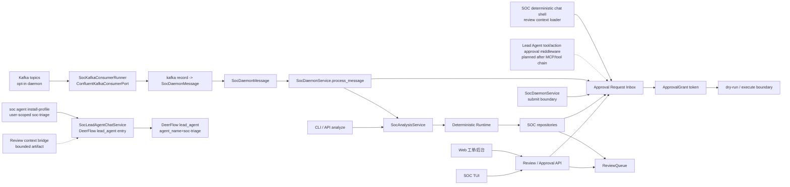
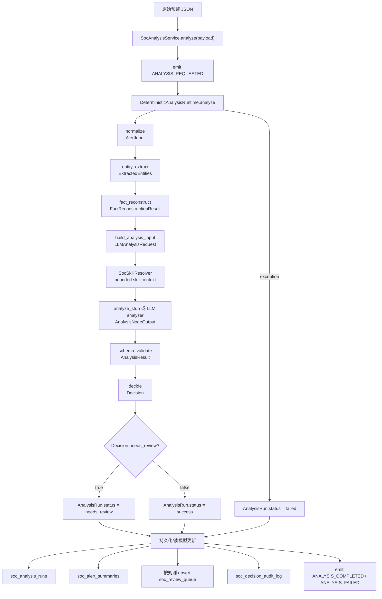
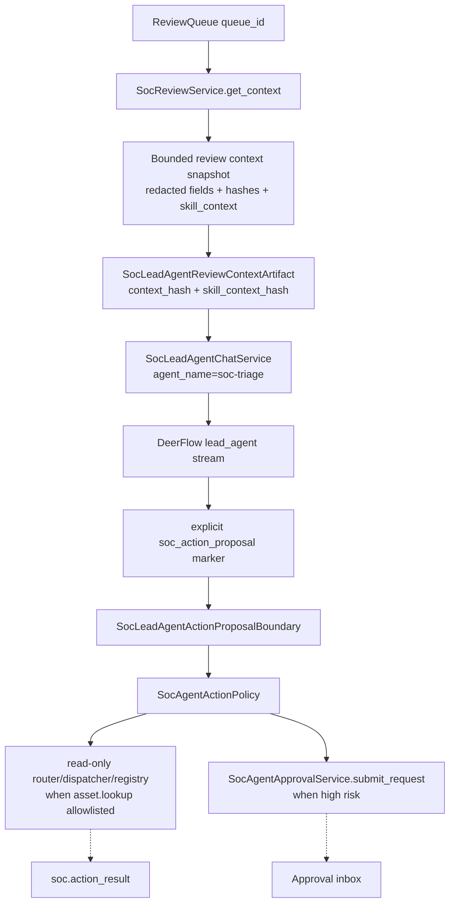
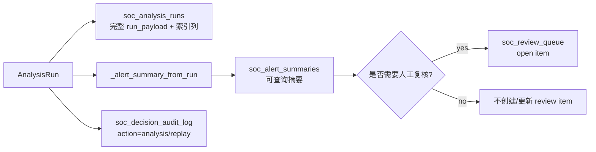
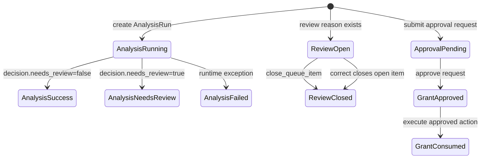
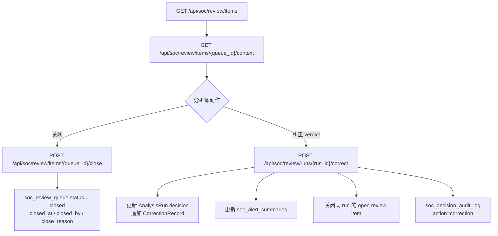
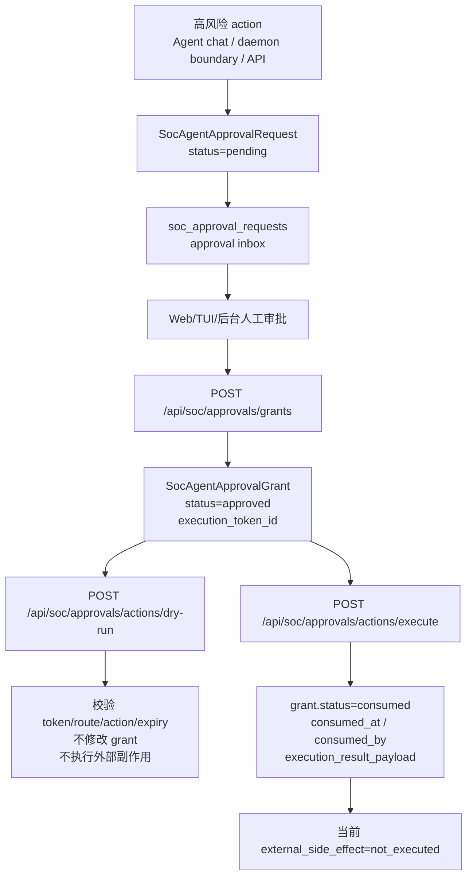
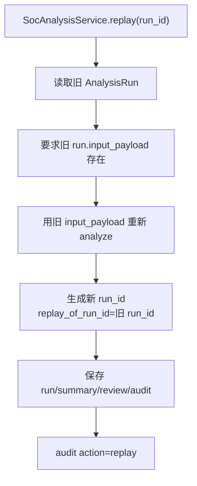

# SOC Alert Lifecycle Flow

> 当前文档描述的是截至 2026-07-04 已落地代码的预警流转、状态变化和数据写入边界。Kafka daemon opt-in broker consumer、approval inbox、ReviewQueue、skill-selected bounded context、SOC Lead Agent profile install/chat entry、SOC Lead Agent review context bridge、SOC Lead Agent action proposal boundary 都已落地；Lead Agent tool/action approval middleware、真实外部处置 adapter、worker pool 并发仍是后续接入点。

## 总览

当前已实现的中心不是某一个 UI 或 middleware，而是一组稳定 service/repository 边界：

- `SocAnalysisService`：预警分析入口，负责调用固定 runtime、保存 run/summary/review/audit。
- `SocReviewService`：复核队列、调查上下文、关闭、人工纠正。
- `SocAgentApprovalService`：approval request inbox、approval grant、dry-run、execute boundary。
- `SocSkillResolver`：从 canonical alert / review context 选择白名单 SOC domain skills，并生成 compact bounded context。
- `SocLeadAgentChatService`：通过 DeerFlow `DeerFlowClient(agent_name="soc-triage")` 进入现有 `lead_agent`，不是 SOC action executor。
- `SocKafkaDaemonRunner` / `SocKafkaConsumerRunner`：opt-in Kafka daemon run loop，负责 broker poll、record mapping、process、dead-letter、commit、metrics JSONL。
- `SqlAlchemyAlertRepository`：当前统一实现 run、summary、review queue、audit、approval request、approval grant 的持久化协议。

三类入口后续都应该进入同一组 service：

## 预警分析主链路

当前预警进入分析后，主控制流由 runtime 固定掌握。LLM 或 stub analyzer 只能作为固定节点，不决定是否跳过必要步骤。

### Runtime Step Trace

每个 runtime step 都会写入 `PipelineStepTrace`：

| 字段 | 含义 |
|---|---|
| `step_name` | `normalize`、`entity_extract`、`fact_reconstruct`、`build_analysis_input`、`analyze_stub`/LLM step、`schema_validate`、`decide` |
| `status` | `running -> success` 或 `failed` |
| `input_hash` / `output_hash` | 当前 step 输入/输出稳定 hash |
| `warnings` | entity/fact/analysis request 中产生的警告 |
| `metadata` | analyzer model、prompt、parser 等元信息 |

## Skill Context 与 Lead Agent 入口

SOC 当前有两条 Agent 相关路径，必须区分：

| 路径 | 当前状态 | 作用 | 禁止边界 |
|---|---|---|---|
| Runtime analysis node | Done | `LLMAnalysisRequest.skill_context` 把 selected skills 作为 compact context 注入分析 prompt | 不动态加载未知 skill；不让 LLM 改主流程 |
| Deterministic chat shell | Done | `SocAgentChatService` 打开 ReviewQueue context，发出 `soc.review_context` / `soc.skill_context` stream event | 不替代 DeerFlow Lead Agent |
| DeerFlow SOC Lead Agent entry | Done | `SocLeadAgentChatService` 通过 `agent_name=soc-triage` 进入 DeerFlow `lead_agent` | 不执行处置动作 |
| Review context bridge | Done | 把 ReviewQueue context 转为 bounded `SocLeadAgentReviewContextArtifact`，提供给 DeerFlow SOC Lead Agent | 不让 Lead Agent 直接读 repository；不绕过 `SocReviewService`、`SocAgentActionPolicy`、`SocAgentApprovalService` |
| Action proposal boundary | Done | 只处理 `<soc_action_proposal>...</soc_action_proposal>` 显式 JSON；高风险输出 approval request；read-only `asset.lookup` 可经显式 router/dispatcher/registry 返回 action result | 不从自然语言猜动作；不直接调用 MCP/资产系统；不执行写动作 |
| Lead Agent tool/action middleware | Planned | 拦截未来 MCP/tool/action call，生成 approval request 或 action proposal | 不在没有真实 tool/MCP 宿主前提前实现 |

当前生命周期增量不是重新做一个 SOC agent runtime，而是在 `SocLeadAgentChatService` 前面补一个受控桥接层：

桥接层记录 context hash、queue_id、run_id、skill context hash、surface、actor 信息，保证 Lead Agent 的上下文可复现、可审计、可裁剪。Action proposal boundary 记录 `source_proposal_id`、`action_payload`、`context_refs`；Web/TUI approval inbox 已展示这些字段，审批人可以在生成 grant 前检查候选动作参数和上下文来源。Read-only proposal bridge 当前只允许显式 `asset.lookup`，并且必须由注入的 router/dispatcher/registry 打开；普通自然语言不会触发查询。

## 分析后的数据写入

### ReviewQueue 入队条件

`_upsert_review_queue_item()` 只在 `_review_reason(summary)` 返回原因时写入/更新 open item。

| 条件 | `reason` |
|---|---|
| `summary.needs_review == true` | `summary.needs_review` |
| `summary.confidence < 0.75` | `low_confidence` |
| `summary.verdict in unknown / needs_review / suspicious` | `uncertain_verdict` |
| `severity in critical/high/高危/严重` | `high_severity` |

优先级规则：

| 条件 | `priority` |
|---|---|
| 高危/严重，或 verdict 为 true_positive / suspicious | `high` |
| confidence < 0.6 | `high` |
| needs_review | `medium` |
| 其他入队项 | `low` |

## 状态模型

| 对象 | 当前状态字段 | 当前状态流转 |
|---|---|---|
| `AnalysisRun` | `status` | `running -> success / needs_review / failed` |
| `ReviewQueueItem` | `status` | `open -> closed` |
| `SocAgentApprovalRequest` | `status` | 当前只有 `pending` |
| `SocAgentApprovalGrant` | `status` | `approved -> consumed` |
| `CorrectionRecord` | `candidate_knowledge_status` | 当前写入 `pending_review`，不会自动成为 confirmed memory |

## 人工复核与纠正

纠正时的关键边界：

- 保留原 AI/模型结论在 `CorrectionRecord.previous_verdict`。
- 新的 operational decision 写回 `AnalysisRun.decision`。
- `candidate_knowledge_status` 只是 `pending_review`，不会污染长期记忆。
- 如果同一 run 有 open review item，会自动关闭。

## 审批与高风险动作

当前审批链路已经拆成 request inbox 和 grant token 两层。

### ApprovalRequest 数据变化

| 操作 | 数据变化 |
|---|---|
| `submit_request()` / `POST /api/soc/approvals/requests` | 写入 `soc_approval_requests`，完整 `request_payload` + route/action/risk/status/requested_by/created_at 索引列 |
| `SocAgentChatService.stream()` | 如果注入 `SocAgentApprovalService`，高风险 approval request 先写入 inbox，再发出同一个 `soc.approval_request` stream event |
| `SocDaemonService.submit_approval_request()` | daemon 侧统一写入边界，内部只调用 `SocAgentApprovalService.submit_request()` |
| `list_requests()` / `GET /api/soc/approvals/requests` | 读取 pending request inbox |
| `get_request()` / `GET /api/soc/approvals/requests/{id}` | 读取单个 pending request |

注意：`SocAgentApprovalRequest` 只是审批请求，不是执行授权。

### ApprovalGrant 数据变化

| 操作 | 校验 | 数据变化 |
|---|---|---|
| `approve()` | request 必须 pending；reason 非空；expiry > 0；actor 具备 `soc_approver` 或 `soc_admin` | 写入 `soc_approval_grants`，状态 `approved`；如果有 request repository，也会保存 request |
| `dry_run_approved_action()` | token 存在；grant 未过期；route/action 匹配；`dry_run=true` | 不消费 token，不修改 grant，不调用外部工具 |
| `execute_approved_action()` | token 存在；grant 未过期；route/action 匹配；`dry_run=false`；必须有 `idempotency_key` | `approved -> consumed`，写入 `consumed_at`、`consumed_by`、`consume_idempotency_key`、`execution_result_id`、`execution_result_payload` |
| 重放 execute | 相同 `idempotency_key` | 返回原 `execution_result_payload` |
| 重放 execute | 不同 `idempotency_key` | 拒绝，避免重复执行 |

当前 execute 只消费 token 和记录 execution boundary，不会封禁 IP、隔离终端、下发 F5 策略或调用 MCP。

## Replay 流转

Replay 不覆盖旧 run；它创建一个新 run，并通过 `replay_of_run_id` 关联旧 run。

## 当前已实现 API Surface

| Surface | 路径/命令 | 当前作用 |
|---|---|---|
| CLI | `soc analyze --persist` | 运行分析并写入 run/summary/review/audit |
| CLI | `soc show` / `soc replay` / `soc correct` | 查看、重放、人工纠正 |
| CLI | `soc agent profile` / `soc agent resolve-skills` / `soc agent install-profile` | 生成/解析/安装 DeerFlow `soc-triage` custom-agent profile；默认只读或 dry-run |
| CLI/TUI | `soc review tui` | ReviewQueue thin client；approval inbox pending request 列表、详情、approve token 生成、dry-run、execute boundary |
| CLI/TUI | `soc chat tui` | 默认 deterministic SOC chat shell；`--lead-agent` 时通过 DeerFlow `lead_agent` 进入 `soc-triage` |
| CLI | `soc daemon process` | 本地处理一条 decoded daemon message JSON；支持 `kind=alert` 和 `kind=approval_request` |
| CLI | `soc daemon consume` / `soc daemon run` / `soc daemon status` | opt-in Kafka broker 消费、长期运行、readiness/status；支持 dead-letter、manual commit、metric JSONL |
| Web | `/workspace/soc/review` | ReviewQueue 页面；审批动作区可从 approval inbox 选择 pending request 后 approve / dry-run / execute，仍保留手工 JSON fallback |
| Gateway | `/api/soc/review/*` | review list/context/close/correct |
| Gateway | `/api/soc/approvals/requests*` | approval inbox create/list/get |
| Gateway | `/api/soc/approvals/grants` | approval request -> execution token |
| Gateway | `/api/soc/approvals/actions/dry-run` | token 校验，不执行副作用 |
| Gateway | `/api/soc/approvals/actions/execute` | 消费 token，记录 execution boundary |
| Core service | `SocAgentChatService.stream(..., approval_service=...)` | TUI/Agent chat shell 高风险 request 写入 approval inbox 并发出 stream event；不是最终 Lead Agent middleware |
| Core service | `SocLeadAgentChatService.stream(...)` | 复用 DeerFlow embedded client/gateway runtime，以 `agent_name=soc-triage` 转发 stream；可接收 bounded review context；不是 action executor |
| Core service | `SocSkillResolver` / `build_soc_skill_context()` | 为 analysis/chat 生成 compact selected skill context，不直接加载完整 skill 文本 |
| Core service | `SocDaemonService.submit_approval_request()` | Kafka daemon 后续复用的 approval inbox 写入边界 |

## 尚未接入的后续点

这些是规划点，当前流程图里只作为未来入口或 adapter：

- SOC Lead Agent approval middleware：拦截高风险 tool/action call；当前 chat shell 已能在注入 approval service 时写入 approval inbox，但真实 DeerFlow-derived middleware 必须等 SOC Lead Agent / MCP tool chain 落地后再接入。
- MCP / real adapter bridge：规划见 `.notes/ai_soc/mcp-adapter-bridge-plan.md`。真实资产系统、EDR 进程树、`response.block_ip`、`edr.isolate_host`、F5 策略、Kafka 处置事件等外部能力都必须注册到 adapter boundary 后面；write/destructive 动作仍必须走 approval。
- 真实外部副作用的补偿、失败重试、审批后超时、adapter-level audit。
- Kafka bounded worker pool：当前 broker runner 仍是串行处理；并发 worker pool 要等真实吞吐、DB/K8s 参数和 LLM 限流策略明确后再接。
- Prometheus `/metrics` exporter 和运营态势看板：需求已记录为后续优化项，当前优先保证 SOC agent 主链路走通。
