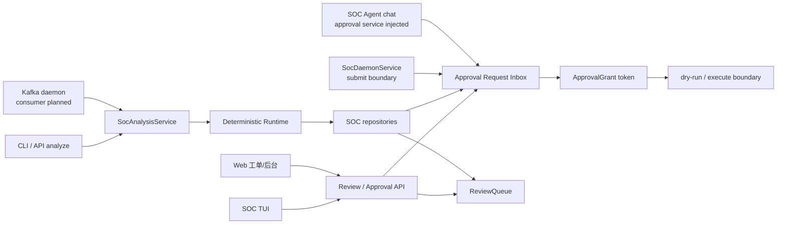
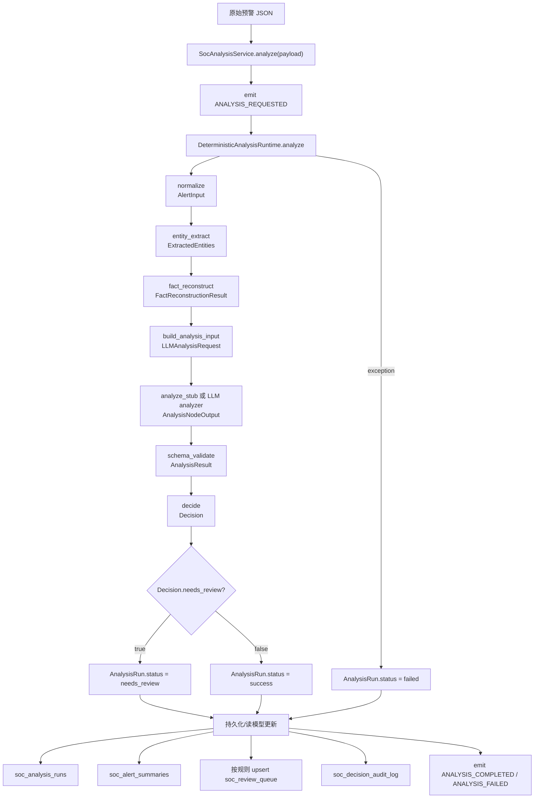
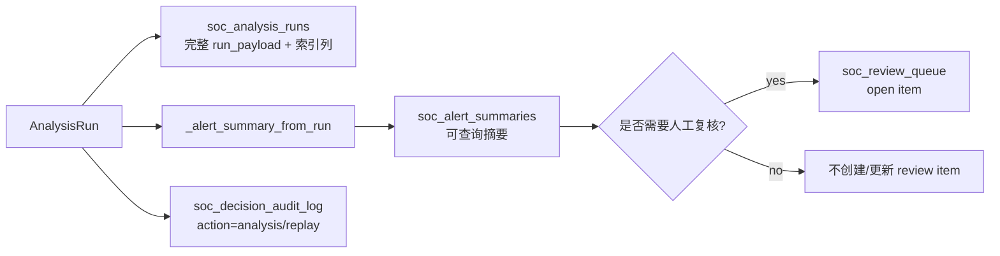
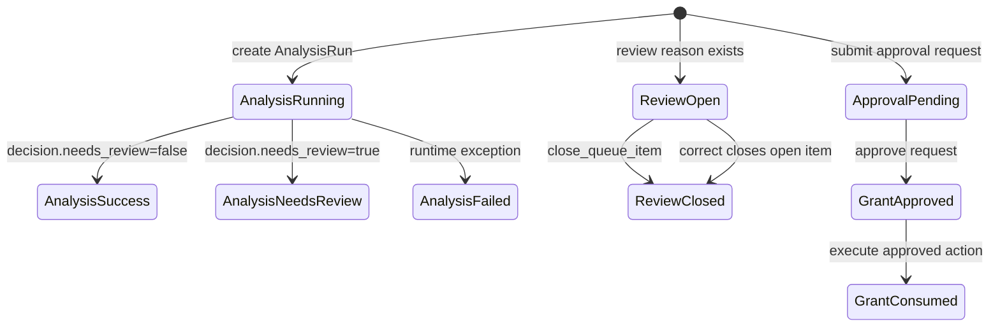
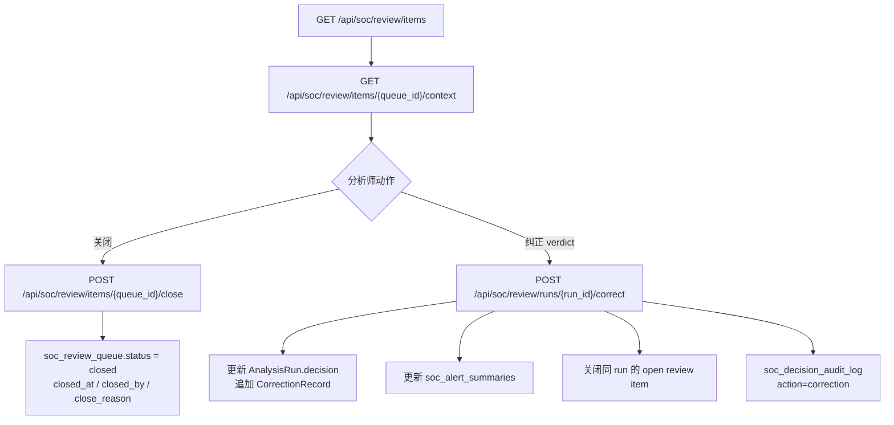
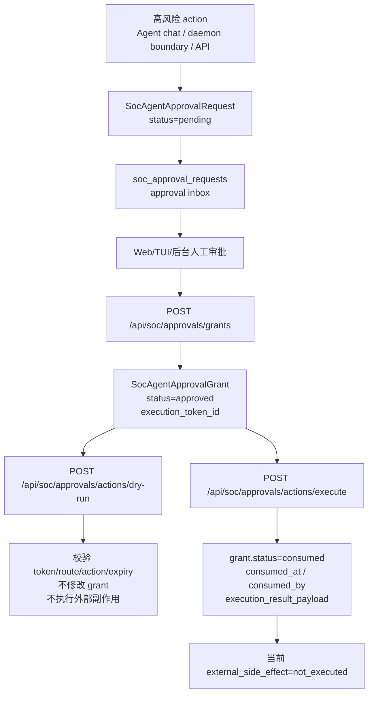
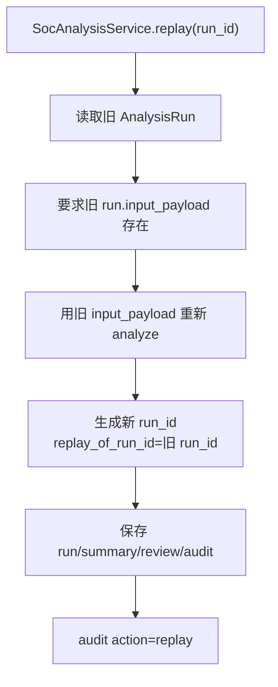

# SOC Alert Lifecycle Flow

> 当前文档描述的是截至 2026-07-03 已落地代码的预警流转、状态变化和数据写入边界。Agent/daemon 写入 approval inbox 的 service boundary 已落地；Kafka consumer、SOC Lead Agent middleware、真实外部处置 adapter 仍是后续接入点，不应被理解为已经完成的自动化生产链路。

## 总览

当前已实现的中心不是某一个 UI 或 middleware，而是一组稳定 service/repository 边界：

- `SocAnalysisService`：预警分析入口，负责调用固定 runtime、保存 run/summary/review/audit。
- `SocReviewService`：复核队列、调查上下文、关闭、人工纠正。
- `SocAgentApprovalService`：approval request inbox、approval grant、dry-run、execute boundary。
- `SqlAlchemyAlertRepository`：当前统一实现 run、summary、review queue、audit、approval request、approval grant 的持久化协议。

三类入口后续都应该进入同一组 service：

## 预警分析主链路

当前预警进入分析后，主控制流由 runtime 固定掌握。LLM 或 stub analyzer 只能作为固定节点，不决定是否跳过必要步骤。

### Runtime Step Trace

每个 runtime step 都会写入 `PipelineStepTrace`：

| 字段 | 含义 |
|---|---|
| `step_name` | `normalize`、`entity_extract`、`fact_reconstruct`、`build_analysis_input`、`analyze_stub`/LLM step、`schema_validate`、`decide` |
| `status` | `running -> success` 或 `failed` |
| `input_hash` / `output_hash` | 当前 step 输入/输出稳定 hash |
| `warnings` | entity/fact/analysis request 中产生的警告 |
| `metadata` | analyzer model、prompt、parser 等元信息 |

## 分析后的数据写入

### ReviewQueue 入队条件

`_upsert_review_queue_item()` 只在 `_review_reason(summary)` 返回原因时写入/更新 open item。

| 条件 | `reason` |
|---|---|
| `summary.needs_review == true` | `summary.needs_review` |
| `summary.confidence < 0.75` | `low_confidence` |
| `summary.verdict in unknown / needs_review / suspicious` | `uncertain_verdict` |
| `severity in critical/high/高危/严重` | `high_severity` |

优先级规则：

| 条件 | `priority` |
|---|---|
| 高危/严重，或 verdict 为 true_positive / suspicious | `high` |
| confidence < 0.6 | `high` |
| needs_review | `medium` |
| 其他入队项 | `low` |

## 状态模型

| 对象 | 当前状态字段 | 当前状态流转 |
|---|---|---|
| `AnalysisRun` | `status` | `running -> success / needs_review / failed` |
| `ReviewQueueItem` | `status` | `open -> closed` |
| `SocAgentApprovalRequest` | `status` | 当前只有 `pending` |
| `SocAgentApprovalGrant` | `status` | `approved -> consumed` |
| `CorrectionRecord` | `candidate_knowledge_status` | 当前写入 `pending_review`，不会自动成为 confirmed memory |

## 人工复核与纠正

纠正时的关键边界：

- 保留原 AI/模型结论在 `CorrectionRecord.previous_verdict`。
- 新的 operational decision 写回 `AnalysisRun.decision`。
- `candidate_knowledge_status` 只是 `pending_review`，不会污染长期记忆。
- 如果同一 run 有 open review item，会自动关闭。

## 审批与高风险动作

当前审批链路已经拆成 request inbox 和 grant token 两层。

### ApprovalRequest 数据变化

| 操作 | 数据变化 |
|---|---|
| `submit_request()` / `POST /api/soc/approvals/requests` | 写入 `soc_approval_requests`，完整 `request_payload` + route/action/risk/status/requested_by/created_at 索引列 |
| `SocAgentChatService.stream()` | 如果注入 `SocAgentApprovalService`，高风险 approval request 先写入 inbox，再发出同一个 `soc.approval_request` stream event |
| `SocDaemonService.submit_approval_request()` | daemon 侧统一写入边界，内部只调用 `SocAgentApprovalService.submit_request()` |
| `list_requests()` / `GET /api/soc/approvals/requests` | 读取 pending request inbox |
| `get_request()` / `GET /api/soc/approvals/requests/{id}` | 读取单个 pending request |

注意：`SocAgentApprovalRequest` 只是审批请求，不是执行授权。

### ApprovalGrant 数据变化

| 操作 | 校验 | 数据变化 |
|---|---|---|
| `approve()` | request 必须 pending；reason 非空；expiry > 0；actor 具备 `soc_approver` 或 `soc_admin` | 写入 `soc_approval_grants`，状态 `approved`；如果有 request repository，也会保存 request |
| `dry_run_approved_action()` | token 存在；grant 未过期；route/action 匹配；`dry_run=true` | 不消费 token，不修改 grant，不调用外部工具 |
| `execute_approved_action()` | token 存在；grant 未过期；route/action 匹配；`dry_run=false`；必须有 `idempotency_key` | `approved -> consumed`，写入 `consumed_at`、`consumed_by`、`consume_idempotency_key`、`execution_result_id`、`execution_result_payload` |
| 重放 execute | 相同 `idempotency_key` | 返回原 `execution_result_payload` |
| 重放 execute | 不同 `idempotency_key` | 拒绝，避免重复执行 |

当前 execute 只消费 token 和记录 execution boundary，不会封禁 IP、隔离终端、下发 F5 策略或调用 MCP。

## Replay 流转

Replay 不覆盖旧 run；它创建一个新 run，并通过 `replay_of_run_id` 关联旧 run。

## 当前已实现 API Surface

| Surface | 路径/命令 | 当前作用 |
|---|---|---|
| CLI | `soc analyze --persist` | 运行分析并写入 run/summary/review/audit |
| CLI | `soc show` / `soc replay` / `soc correct` | 查看、重放、人工纠正 |
| CLI/TUI | `soc review tui` | ReviewQueue thin client；approval inbox pending request 列表、详情、approve token 生成 |
| Web | `/workspace/soc/review` | ReviewQueue 页面；审批动作区可从 approval inbox 选择 pending request 后 approve / dry-run / execute，仍保留手工 JSON fallback |
| Gateway | `/api/soc/review/*` | review list/context/close/correct |
| Gateway | `/api/soc/approvals/requests*` | approval inbox create/list/get |
| Gateway | `/api/soc/approvals/grants` | approval request -> execution token |
| Gateway | `/api/soc/approvals/actions/dry-run` | token 校验，不执行副作用 |
| Gateway | `/api/soc/approvals/actions/execute` | 消费 token，记录 execution boundary |
| Core service | `SocAgentChatService.stream(..., approval_service=...)` | TUI/Agent chat 高风险 request 写入 approval inbox 并发出 stream event |
| Core service | `SocDaemonService.submit_approval_request()` | Kafka daemon 后续复用的 approval inbox 写入边界 |

## 尚未接入的后续点

这些是规划点，当前流程图里只作为未来入口或 adapter：

- Kafka daemon 自动消费预警流，批量调用 `SocAnalysisService`；当前仅有 approval request submit 边界，尚未实现 consumer。
- SOC Lead Agent middleware 拦截高风险 tool/action call；当前 chat service 已能在注入 approval service 时写入 approval inbox，但真实 DeerFlow middleware 尚未接入。
- Approval inbox 的 TUI dry-run / execute 命令；当前 TUI 已支持 pending request 展示和 approve token 生成。
- Action adapter registry：把 `response.block_ip`、`edr.isolate_host`、F5 策略、Kafka 处置事件等真实外部动作注册到 execute boundary 后面。
- 真实外部副作用的补偿、失败重试、审批后超时、adapter-level audit。
