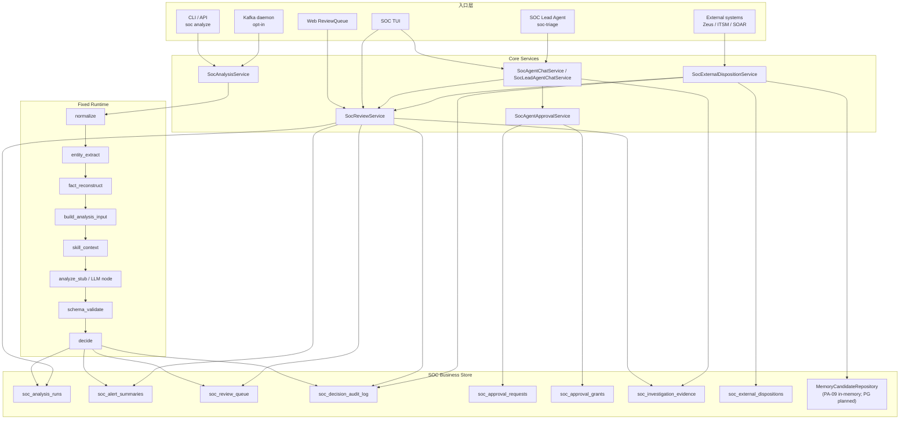
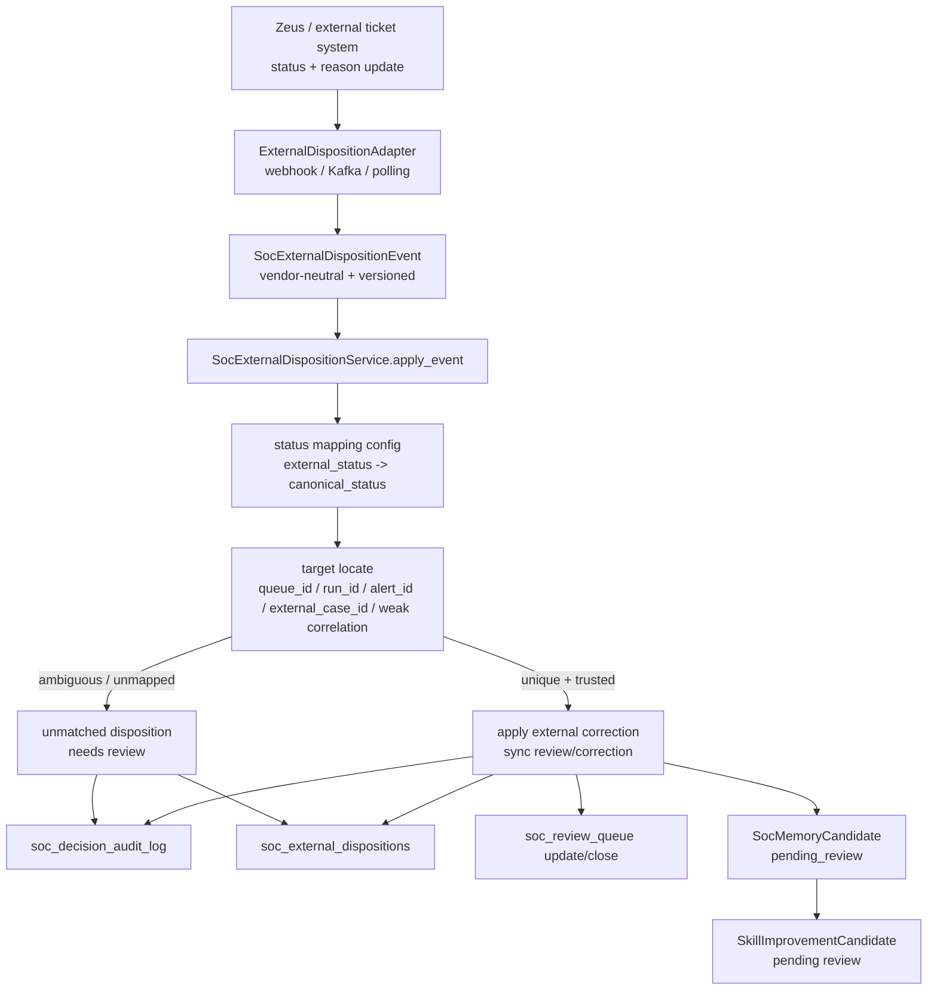
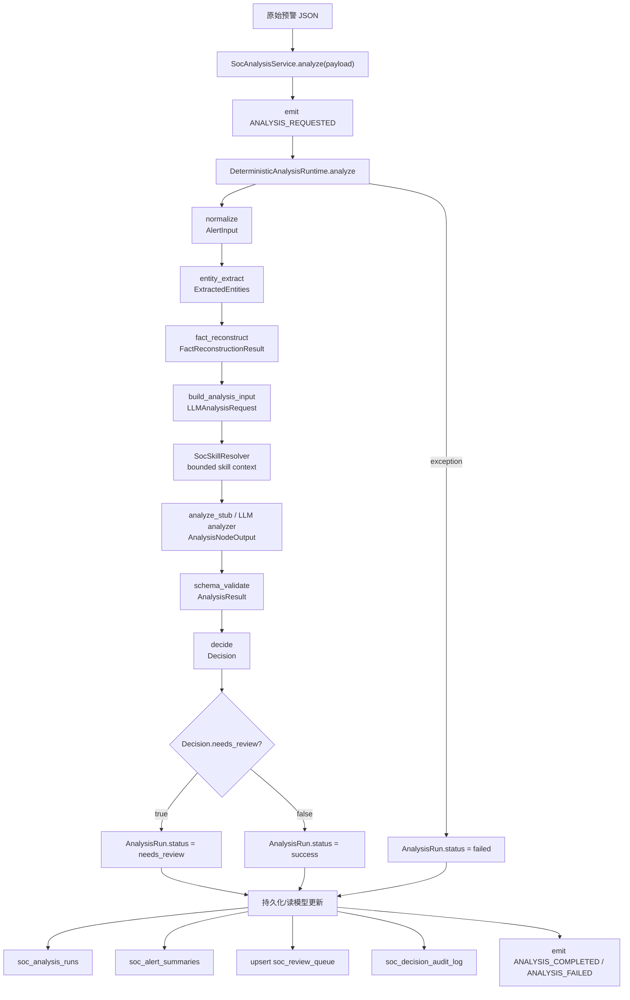
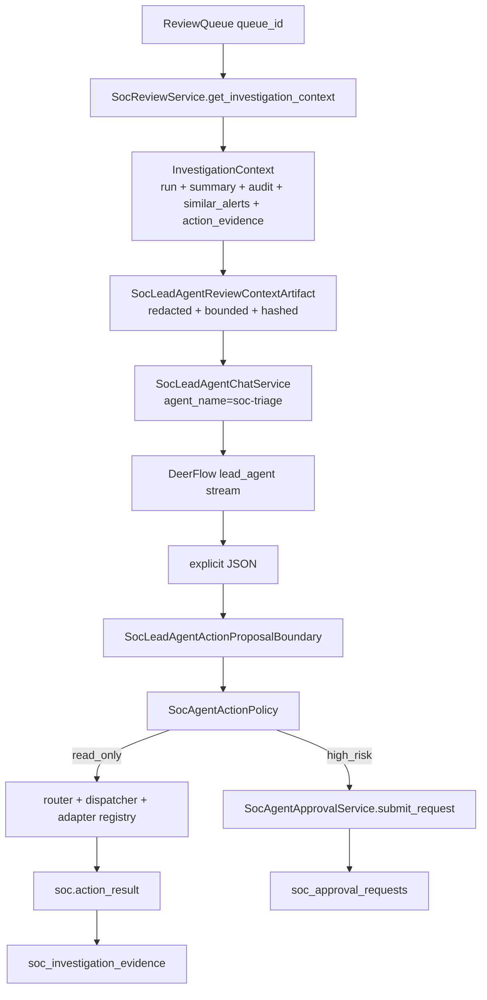
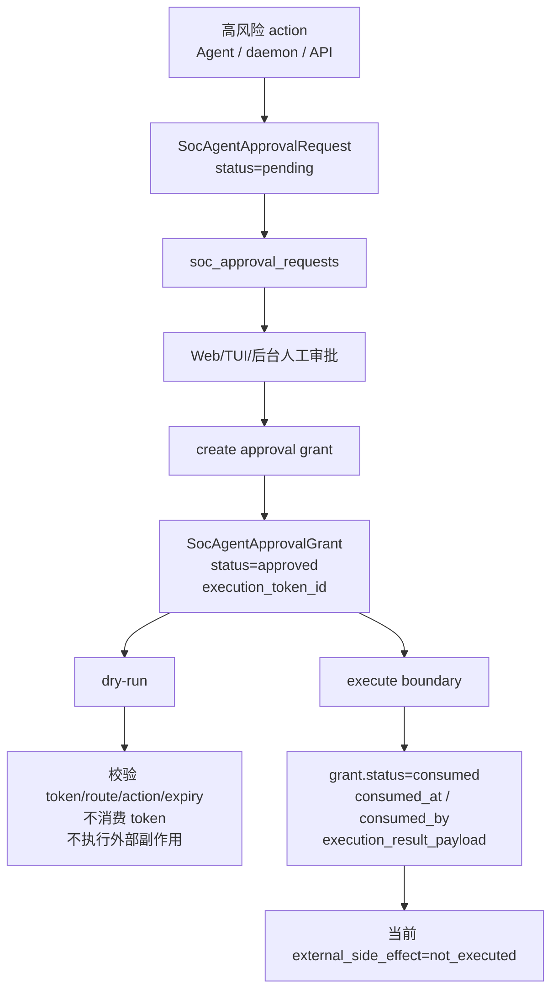
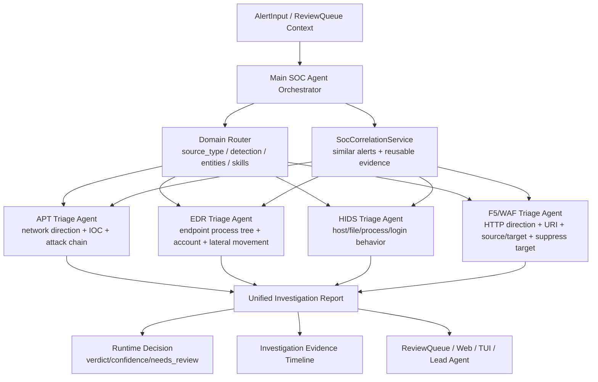

# SOC Alert Lifecycle Flow

> Updated: 2026-07-07
>
> 本文档描述两件事：
>
> 1. 当前代码已经实现的预警生命周期、状态变化和数据写入边界。
> 2. 下一阶段如何演进到可演示的 Main SOC Agent + EDR/APT/HIDS/F5 domain sub-agent 研判链路。
>
> 原则：LLM 和 Lead Agent 可以参与研判、提出调查动作和生成解释，但主流程、状态机、权限、审计、持久化仍由 SOC Runtime / Core Services 掌握。

## 1. 当前结论

当前系统已经具备一条可信的 SOC 预警闭环底座：

```text
alert in
  -> deterministic runtime analyze
  -> run / summary / review / audit persistence
  -> ReviewQueue Web/TUI
  -> SOC Lead Agent bounded context
  -> read-only action proposal
  -> investigation evidence persistence
  -> approval inbox / grant / execute boundary
```

但它还不是最终形态的“完整 SOC Agent + 多个子研判 Agent”。当前缺口在这里：

- `SocCorrelationService` MVP 已存在，能通过 CLI/core service 输出结构化相似告警、匹配原因和可复用 evidence；后续还需要接入 ReviewQueue/Web/TUI 可视化面板。
- External Disposition 已有 vendor-neutral event/mapping/service MVP，并且 high-trust mapped 外部结论可同步为本地 correction / review close；memory candidate、DB/API 和 Web/TUI visibility 待补。
- 已有 `SocMemoryCandidate` 候选入口；但还没有 DB-first typed memory store、确认/驳回/过期状态机和 confirmed memory 检索/注入策略。
- APT/EDR/HIDS 已有统一 `SocDomainTriageRequest` / `SocDomainTriageResult` / `SocDomainFinding`，F5/WAF handler 后续补。
- PA-11 已有只读 Main Orchestrator demo：`SocMainOrchestratorService` 能把 deterministic analyze、selected skills、read-only action evidence、domain findings 和 review context 合成 `UnifiedInvestigationReport`。
- 这条链路还没有接入 ReviewQueue Web/TUI 可视化，也没有替换为真实 PingAn MCP/API；PA-12 等真实 endpoint/凭证。

因此下一阶段目标不是继续堆更多 mock tool，而是按下面待办补齐可见 Alpha 链路：

```text
[Done] PingAn knowledge decomposition + capability cards + pending candidates
  -> [Done] Correlation Service MVP
  -> [Done] PingAn PA-08 eval fixtures
  -> [Done] PingAn PA-09 memory candidate entry
  -> [Done] PingAn PA-10 domain triage MVP
  -> [Done] PingAn PA-11 Main Orchestrator demo
  -> [Waiting] PingAn PA-12 real MCP/API replacement
  -> [Partial] External Disposition Sync Contract + Review/Correction
  -> [Planned] Memory Tracking Contract
  -> [Planned] Domain Sub-Agent Contract
  -> [Planned] EDR/APT/HIDS/F5 MVP handlers
  -> [Planned] Main SOC Agent Orchestrator MVP
  -> [Planned] Web/TUI visible investigation
  -> [Planned] Demo / Eval Script
```

暂缓项不作为当前 Alpha 前置条件：

- Real dev/staging CMDB/EDR MCP replacement：等待 endpoint/凭证。
- Wiki/OKF export projection：等 PostgreSQL memory store、retrieval 和 review workflow 稳定后再做，且只能作为 DB 的 projection。
- Prometheus / operations overview：等 Kafka/review/approval/runtime 数据流稳定后再做。
- High-risk real execute：等真实 staging adapter、审批策略、补偿和 adapter audit 成熟后再打开。

PingAn APT/EDR/HIDS 专属经验当前已经先落到 `.notes/ai_soc/pingan-capability-cards.md` 和 `.notes/ai_soc/pingan-knowledge-candidates.md`，并且已有 `SocMemoryService.propose_candidate()` 作为代码入口。它只生成 `pending_review` candidate，不能直接影响 runtime verdict；后续只能通过 confirmed memory、tenant policy/config、adapter mapping 或 eval fixture 的受控路径进入系统。

## 2. 当前已实现服务边界

| Service / Component | 当前职责 | 状态 |
|---|---|---|
| `SocAnalysisService` | 预警分析入口；调用固定 runtime，保存 run/summary/review/audit | Done |
| `SocCorrelationService` | 基于 alert summaries 和 investigation evidence 输出结构化相似告警、匹配原因和可复用 evidence | Done |
| `SocReviewService` | review queue、调查上下文、关闭、人工纠正；聚合 similar alerts 和 action evidence | Done |
| `SocAgentApprovalService` | approval request inbox、approval grant、dry-run、execute boundary | Done |
| `SocSkillResolver` | 从 canonical alert / review context 选择白名单 SOC domain skills，生成 compact bounded context | Done |
| `SocMainOrchestratorService` | 串起 analyze -> read-only route/action/evidence -> domain triage -> bounded review summary，输出 `UnifiedInvestigationReport` | Done for PA-11 |
| `SocLeadAgentChatService` | 通过 DeerFlow `DeerFlowClient(agent_name="soc-triage")` 进入现有 `lead_agent` | Done |
| `SocLeadAgentActionProposalBoundary` | 只处理显式 `<soc_action_proposal>`；read-only proposal 走 router/policy/dispatcher/registry，高风险写入 approval inbox | Done |
| `SocActionAdapterRegistry` | action adapter allowlist；当前支持 `asset.lookup`、`asset.locate`、`endpoint.process_tree.lookup` 等只读能力 | Done |
| `InvestigationEvidenceRepository` | 保存只读 action/tool 结果，供 ReviewQueue、Web/TUI、Lead Agent 后续复用 | Done |
| `SocMemoryService` | 生成 pending review memory candidate；confirmed fact store、review workflow 和 retrieval policy 仍后续实现 | Partial |
| `SocDomainTriageService` | APT/EDR/HIDS deterministic domain handlers；消费 skill context 和 read-only evidence refs，只输出 findings | Done for PA-10 |
| `SocKafkaDaemonRunner` / `SocKafkaConsumerRunner` | opt-in Kafka daemon run loop、mapper、dead-letter、manual commit、metrics JSONL | Done, production params waiting |
| `SqlAlchemyAlertRepository` | 当前统一实现 run、summary、review queue、audit、approval request、approval grant、investigation evidence 持久化 | Done |

## 3. 当前 As-Is 生命周期



### 3.1 数据状态变化

| 对象 | 状态字段 | 流转 | 说明 |
|---|---|---|---|
| `AnalysisRun` | `status` | `running -> success / needs_review / failed` | 完整 run payload 和输入快照保留，用于 replay |
| `AlertSummary` | `verdict / confidence / needs_review` | analyze/replay/correct 更新 | 面向列表、检索、关联和 review queue 的读模型 |
| `ReviewQueueItem` | `status` | `open -> closed` | close 不等于改判；改判必须走 correction |
| `CorrectionRecord` | `candidate_knowledge_status` | `pending_review` | 人工纠正不会直接写 confirmed memory |
| `ExternalDispositionRecord` | `mapped_status / apply_status` | `received -> mapped / unmatched -> applied / ignored` | 外部系统状态/理由同步记录；Zeus 只是 adapter，reason 只生成候选记忆 |
| `InvestigationEvidence` | `status` | `success / failed` | 只读调查证据，不自动改 verdict，不写 confirmed memory |
| `SocAgentApprovalRequest` | `status` | `pending` | 审批请求，不是执行授权 |
| `SocAgentApprovalGrant` | `status` | `approved -> consumed` | 一次性 execution token，当前 execute 仍不产生外部副作用 |

### 3.2 外部处置反馈流

外部处置反馈流用于接 Zeus、ITSM、SIEM/SOAR、客户自研工单系统等外部产品中的人工状态和理由。Zeus 只是第一个 adapter，不允许把 Zeus 字段、状态名或 ID 体系写死到 core service。



实现约束：

- Adapter 只做传输、认证、解码、字段映射和幂等键生成；不能直接写 repository。
- `SocExternalDispositionService` 是唯一允许同步外部状态到本地 review/correction/audit 的边界。
- 外部 free-text reason 默认只是 case feedback；只能生成 pending memory / skill improvement candidate，不能直接成为 confirmed memory 或 active skill。
- 状态映射必须可配置，未映射状态进入 `unknown/unmatched`，不自动改判。
- 幂等键必须包含 `tenant_id`、`external_system`、`external_case_id` 和外部事件版本/更新时间/hash，重复回放不能重复关闭队列或重复生成候选记忆。

## 4. 预警分析主链路

主控制流由 runtime 固定掌握。LLM 或 deterministic stub 只能作为固定节点，不决定是否跳过必要步骤。



### Runtime Step Trace

每个 runtime step 都写入 `PipelineStepTrace`：

| 字段 | 含义 |
|---|---|
| `step_name` | `normalize`、`entity_extract`、`fact_reconstruct`、`build_analysis_input`、`analyze_stub`/LLM step、`schema_validate`、`decide` |
| `status` | `running -> success` 或 `failed` |
| `input_hash` / `output_hash` | 当前 step 输入/输出稳定 hash |
| `warnings` | entity/fact/analysis request 中产生的警告 |
| `metadata` | analyzer model、prompt、parser、skill context 等元信息 |

## 5. ReviewQueue、Lead Agent 与 Evidence

ReviewQueue 是当前人工复核入口；SOC Lead Agent 只能拿 bounded context，不能直接读 repository、改 verdict 或执行处置。



当前 read-only action 能力：

| Action | 当前实现 | 用途 |
|---|---|---|
| `asset.lookup` | in-memory / MCP-backed config | 查静态资产记录，验证资产查询 contract |
| `asset.locate` | local stdio MCP mock | 模拟 Zeus/CMDB/asset_to_bu 归属定位 |
| `endpoint.process_tree.lookup` | in-memory mock | 模拟 EDR 进程树和网络连接调查 |

所有 read-only action result 都只是 investigation evidence：

- 可以进入 ReviewQueue context。
- 可以进入 Lead Agent bounded artifact。
- 可以展示在 Web/TUI。
- 不能自动改判。
- 不能自动关闭 review item。
- 不能直接写 confirmed memory。

## 6. 审批与高风险动作

当前审批链路已经拆成 request inbox 和 grant token 两层。



当前 execute 只消费 token 并记录 execution boundary，不会封禁 IP、隔离终端、下发 F5 策略或调用生产 MCP。真实外部副作用必须等 adapter-level audit、补偿、失败重试和真实 staging 验证后打开。

## 7. To-Be：完整 SOC Agent 可见链路

目标是让分析师能看到一个预警被 Main SOC Agent 调度多个 domain sub-agent 研判，并形成统一报告。PA-11 已先完成 headless/eval demo；后续要把同一份 `UnifiedInvestigationReport` 接入 ReviewQueue Web/TUI 和 Lead Agent bounded context：



这里的 sub-agent 可以先不是独立进程，也不一定马上是完整 DeerFlow custom agent。MVP 更合理的实现方式是：

- 先定义统一 `DomainTriageRequest` / `DomainTriageResult` contract（PA-10 已完成 APT/EDR/HIDS）。
- 每个 domain handler 可以是 deterministic + skill/prompt context 的受控节点。
- 后续再把稳定的 domain handler 升级为 DeerFlow-derived domain agent/profile。
- Main Agent 负责路由、并发策略、证据合并、冲突标记和审计，不让子 agent 直接写 DB 或执行工具。

## 8. 下一阶段实现路线

### Slice 0：PingAn Knowledge Decomposition + Capability Onboarding

目的：把用户掌握的平安 SOC 工具、MCP、skill、研判经验和处置经验结构化嵌入项目，并先区分通用 skill、平安 tenant memory、adapter/mapping、MCP/action、policy/config 和 eval fixture，避免把历史 prompt 原文直接塞进通用 skill 或主 Agent prompt。

范围：

- 新增并维护 `.notes/ai_soc/pingan-soc-capability-onboarding.md`。
- 新增并维护 `.notes/ai_soc/pingan-knowledge-decomposition-plan.md`。
- 新增并维护 `.notes/ai_soc/pingan-capability-cards.md`，作为 PingAn APT / EDR / HIDS capability card 台账。
- 每个经验点先整理成 capability card，再分类到 skill、tenant memory、MCP/action adapter、normalizer、policy/config、domain handler、eval case 或 memory candidate。
- 第一批已登记 APT 方向判断、APT 场景化研判、威胁情报、security tag、EDR 进程树、资产归属、HIDS 主机事件、HIDS event_type 研判等 P0 cards；F5/WAF 后续有源文档或样例后再补。
- 不把生产账号、token、内部系统地址或敏感数据写入仓库；真实 endpoint/凭证只通过本地配置或 secret 注入。

验收：

- 每个即将实现的平安 SOC 经验都有 capability card。
- 能明确它落到通用 skill、tenant memory、adapter、policy/config、domain handler、eval case 还是 memory candidate。
- 通用 `skills/public/soc-*` 不包含平安内部域名、账号、部门、规则码、模板 ID、策略 ID、字段别名或误报白名单。
- 每个能力都有至少一个脱敏样例或 fake fixture。
- read-only / high-risk / memory candidate 的安全边界明确。

### Slice 1：Correlation Service MVP

目的：让 SOC Agent 先具备“看历史、找相似、复用证据”的能力。

范围：

- 新增 `SocCorrelationService`。
- 新增 `CorrelationQuery`、`CorrelationMatch`、`CorrelationResult`。
- 基于 `soc_alert_summaries` 查询相似告警。
- 合并 `InvestigationEvidence` 中同 run / alert / entity 相关的只读证据。
- 接入 `SocReviewService.get_investigation_context()`，保留旧 `similar_alerts` 兼容展示，但新增更结构化的 `correlation_result`。
- 加 CLI 验证入口，例如 `soc correlate RUN_ID --pretty`。

验收：

- 不调用 LLM。
- 不依赖真实 MCP。
- 不改 DeerFlow core。
- 对同一批 demo alert 能看到相似告警、匹配原因和可复用 evidence。

### Slice 2：External Disposition Sync Contract

目的：让 Zeus、ITSM、SIEM/SOAR、客户自研工单系统中的人工状态和处置理由能回流 SOC Agent，同时保持协议可扩展、可插拔、可审计。

范围：

- 新增并维护 `.notes/ai_soc/external-disposition-sync-plan.md`。
- 固定 `SocExternalDispositionEvent` vendor-neutral schema，Zeus 只是第一个 adapter。
- 规划 `SocExternalDispositionService`、adapter port、状态映射、幂等键、unmatched record、audit、review/correction 同步和 memory/skill improvement candidate。
- 支持 webhook、Kafka、polling、manual import 作为 transport adapter，但进入 service 前必须归一成同一 event。
- 明确外部 free-text reason 只能进入 pending memory / skill improvement candidate，不能直接写 confirmed memory 或 active skill。

验收：

- 不在 core service 中写死 Zeus 字段、状态名或 ID 体系。
- 未映射状态或无法唯一定位的 case 只能保存 unmatched record，不自动改判。
- 重复外部事件不会重复关闭 queue、重复改判或重复生成候选记忆。
- Web/TUI/Review context 后续能展示外部 disposition history 和 reason。

### Slice 3：Memory Tracking Contract

目的：固定 typed memory record + facets + retrieval policy，让 TUI、Kafka daemon、ReviewQueue、Lead Agent 和 domain triage 的重要结论后续能转成候选记忆。

范围：

- 新增并维护 `.notes/ai_soc/soc-memory-tracking-plan.md`。
- 固定 DB-first memory contract：PostgreSQL 是 source of truth，wiki/OKF 只是后期展示、审阅和迁移 projection。
- 固定 typed record：`memory_type`、`status`、`content`、`facets`、`evidence_refs`、`version/hash`。
- 固定 facets：topics、canonical detection key、vendor aliases、scenario、entities、environment；缺失任意 facet 时系统仍要能工作。
- 明确具体 IP、UM、host、URL、hash 默认只作为 evidence / query dimension，不直接成为长期 memory 主粒度。
- 规划 `SocMemoryRecord`、`SocMemoryCandidate`、`SocMemoryFact`、`SocMemoryEvidenceRef`、`SocMemoryQuery`、`SocMemoryStatus`。
- 明确 TUI/Web correction、Kafka daemon repeated pattern、external disposition reason、Lead Agent summary、DomainTriageResult 和 InvestigationEvidence 如何生成 memory candidate。

验收：

- 不自动写 confirmed memory。
- `pending_review` 不注入 prompt。
- 所有 candidate 都有 typed memory record、facets、来源、evidence refs 和幂等键。
- 后续代码只能通过 `SocMemoryService` 写 memory，入口层不能直接写 repository。

### Slice 4：Domain Sub-Agent Contract

目的：先固定 EDR/APT/HIDS/F5 子研判单元的输入输出，避免每个 domain 各写一套。

范围：

- 新增 `DomainTriageRequest`。
- 新增 `DomainTriageResult`。
- 新增 `DomainTriageFinding`、`DomainTriageEvidenceRef`、`DomainTriageRecommendation`。
- 结果必须包含 `domain`、`confidence`、`findings`、`evidence_refs`、`recommended_next_actions`、`needs_human_review`。

验收：

- EDR/APT/HIDS/F5 都能用同一 schema。
- 子研判结果不能直接改 `AnalysisRun.decision`。
- 子研判结果可被统一 report 合并。

### Slice 5：EDR/APT/HIDS/F5 MVP Handlers

目的：让 demo alert 真正进入不同 domain triage 分支。

范围：

- APT handler：关注攻击方向、IOC、外联/入站/横向、受害资产。
- EDR handler：关注 endpoint、process tree、账号/UM、可疑进程和网络连接。
- HIDS handler：关注主机行为、文件/进程/登录/账号事件。
- F5/WAF handler：关注 HTTP method、URI、source/target、攻击方向和抑制目标。

验收：

- 先 deterministic + selected skill context。
- 可使用已有 read-only mock evidence。
- 每个 handler 都输出 `DomainTriageResult`。

### Slice 6：Main SOC Agent Orchestrator MVP

目的：把 correlation、domain routing、domain triage 和 report merge 串起来。

当前状态：PA-11 已完成只读 headless/eval 版本，入口为 `SocMainOrchestratorService` 和 `soc eval pingan-main`。

范围：

- 新增 `SocMainOrchestratorService` 或在 `SocAnalysisService` 后增加受控 investigation stage。
- 输入一个 run/review context。
- 自动选择 1-N 个 domain handlers。
- 合并 `CorrelationResult` 和 `DomainTriageResult`。
- 输出 `UnifiedInvestigationReport`。

验收：

- 单条 APT demo 能触发 APT + threat intel / security-tag evidence。
- 单条 EDR demo 能触发 EDR + endpoint process-tree evidence。
- 单条 HIDS demo 能触发 host-event context + security-tag evidence。
- 多 domain 冲突要显式展示，不能静默覆盖。

遗留：

- 当前 PA-11 使用 fixture action specs 和 mock adapters；PA-12 需要真实 PingAn MCP/API endpoint/凭证后替换 provider。
- correlation 尚未并入 PA-11 report；下一版 report merge 需要加入 `CorrelationResult`。
- Web/TUI 尚未展示 `UnifiedInvestigationReport`。

### Slice 7：Web/TUI 可见化

目的：让你和同事能直观看到“谁参与了研判、用了什么证据、给了什么结论”。

范围：

- ReviewQueue context 页面增加：
  - correlation panel
  - domain triage panel
  - evidence timeline
  - action proposal panel
- TUI 增加对应文本视图。
- Lead Agent bounded context 带入 report summary，不塞完整 raw payload。

验收：

- 打开一个 review item，能看到完整研判链路。
- 能区分 runtime decision、domain findings、read-only evidence 和人工 correction。

### Slice 8：Demo / Eval Script

目的：形成可重复演示和回归验证。

范围：

- 用 `alert_demo` 或脱敏样本生成一批 demo run。
- 提供一条命令跑完整链路。
- 输出 JSON report + Web/TUI 可打开的 review item。

验收：

```text
soc demo run apt
soc demo run edr
soc correlate RUN_ID
soc review tui
soc chat tui --lead-agent --queue-id REV-...
```

能稳定看到同一条预警的 runtime、correlation、domain triage、evidence 和 review 状态。

## 9. 暂缓项

这些需求有价值，但不是看到完整 SOC Agent Alpha 的前置条件：

- 真实 dev/staging CMDB/EDR MCP replacement：等待 endpoint/凭证。
- 真实 high-risk execute：等待 staging adapter、补偿、失败审计和审批策略成熟。
- Kafka bounded worker pool：等待真实吞吐、DB/K8s 参数和 LLM 限流策略。
- Prometheus `/metrics` exporter 和运行态势看板：已记录在 `.notes/archive/ai_soc/deferred/operations-overview-deferred.md`。
- 外部 Knowledge RAG / 威胁情报大屏：Phase 5。

## 10. 当前可见 Alpha 目标

Alpha 的定义不是“完全自动化 SOC”，而是：

```text
给一条 APT/EDR/HIDS/F5 预警
  -> 系统能稳定跑完整 runtime
  -> 找出历史相似告警
  -> 选择对应 domain triage handler
  -> 生成 domain findings
  -> 复用 read-only evidence
  -> 产出统一 Investigation Report
  -> 在 Web/TUI/Lead Agent context 里可审阅
  -> 所有状态、证据、审批边界可追踪
```

这条路线优先保证“看得见、查得清、改得了、可回放”，再考虑自动关闭、自动处置和大规模并发。
