# SOC Alert Lifecycle Flow / SOC 预警完整流转

> Updated: 2026-07-16
>
> 本文只描述当前项目里的 SOC Agent 端到端运行过程、状态流转、数据写入和安全边界。
>
> Principle / 原则：LLM、Lead Agent、skills、MCP/tools 都只能在受控边界内参与研判；主流程、状态机、权限、审计和持久化由 SOC Runtime / Core Services 掌握。

## 0. Icon Legend / 图标说明

| Icon | Meaning | 中文说明 |
|---|---|---|
| 🧾 | Alert / input | 原始预警、外部输入 |
| 🚪 | Entry surface | CLI、API、Web、TUI、Kafka 等入口 |
| ⚙️ | Runtime / service | 固定流程或核心服务 |
| 🧠 | LLM / reasoning | 受控推理节点或 Lead Agent |
| 🧰 | Tool / MCP / adapter | 只读工具、MCP、action adapter |
| 🧑‍💻 | Analyst / human | 分析师、审批人、人工复核 |
| 🗃️ | Database / store | SOC 业务库、读模型、审计表 |
| 🔎 | Investigation context | 调查上下文、关联、证据、时间线 |
| 🧩 | Domain finding | APT/EDR/HIDS/通用场景研判结果 |
| 🧠📌 | Memory candidate | 候选记忆，待人工评审 |
| ✅ | Confirmed memory | 已确认记忆，但默认不自动影响判定 |
| 🛡️ | Approval boundary | 高风险动作审批边界 |
| 🚫 | Forbidden mutation | 不允许自动改判、自动处置或绕过服务 |
| 🛠️ | Maintenance | 解析器、Schema 基线和字段映射维护 |
| 🪪 | Governed context | 带时效、范围、来源和撤销语义的运营事实 |

## 1. End-to-End Overview / 端到端总览

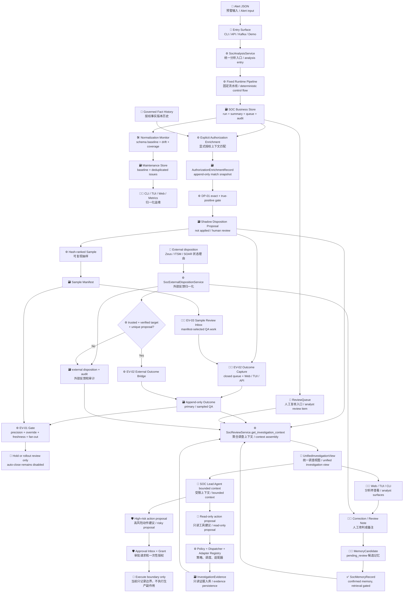
```mermaid
flowchart TD
    A["🧾 Alert JSON<br/>预警输入 / Alert input"] --> B["🚪 Entry Surface<br/>CLI / API / Kafka / Demo"]
    B --> C["⚙️ SocAnalysisService<br/>统一分析入口 / analysis entry"]
    C --> D["⚙️ Fixed Runtime Pipeline<br/>固定流水线 / deterministic control flow"]
    D --> E["🗃️ SOC Business Store<br/>run + summary + queue + audit"]
    E --> W["🛠️ Normalization Monitor<br/>schema baseline + drift + coverage"]
    W --> X["🗃️ Maintenance Store<br/>baseline + deduplicated issues"]
    X --> Y["🧑‍💻 CLI / TUI / Web / Metrics<br/>归一化运维"]

    E --> F["🔎 ReviewQueue<br/>人工复核入口 / analyst review item"]
    E --> Z1["⚙️ Explicit Authorization Enrichment<br/>显式授权上下文匹配"]
    Z0["🪪 Governed Fact History<br/>授权事实版本历史"] --> Z1
    Z1 --> Z2["🗃️ AuthorizationEnrichmentRecord<br/>append-only match snapshot"]
    Z2 --> Z3["⚙️ DP-01 exact + true-positive gate"]
    Z3 --> Z4["🗃️ Shadow Disposition Proposal<br/>not applied / human review"]
    Z4 --> Z5["🧑‍💻 EV-02 Outcome Capture<br/>closed queue + Web / TUI / API"]
    Z5 --> Z6["🗃️ Append-only Outcome<br/>primary / sampled QA"]
    Z4 --> Z7["⚙️ Hash-ranked Sample<br/>可复现抽样"]
    Z7 --> Z8["🗃️ Sample Manifest"]
    Z8 --> Z13["🧑‍💻 EV-03 Sample Review Inbox<br/>manifest-selected QA work"]
    Z13 --> Z5
    Z6 --> Z9["⚙️ EV-01 Gate<br/>precision + override + freshness + fan-out"]
    Z8 --> Z9
    Z9 --> Z10["🚫 Hold or rollout review only<br/>auto-close remains disabled"]
    Z4 --> G
    Z6 --> G
    F --> G["⚙️ SocReviewService.get_investigation_context<br/>聚合调查上下文 / context assembly"]

    G --> H["🔎 UnifiedInvestigationView<br/>统一调查视图 / unified investigation view"]
    H --> I["🧑‍💻 Web / TUI / CLI<br/>分析师查看 / analyst surfaces"]
    H --> J["🧠 SOC Lead Agent bounded context<br/>受限上下文 / bounded context"]

    J --> K["🧰 Read-only action proposal<br/>只读工具建议 / read-only proposal"]
    K --> L["⚙️ Policy + Dispatcher + Adapter Registry<br/>策略、调度、适配器"]
    L --> M["🗃️ InvestigationEvidence<br/>只读证据入库 / evidence persistence"]
    M --> G

    J --> N["🛡️ High-risk action proposal<br/>高风险动作建议 / risky proposal"]
    N --> O["🛡️ Approval Inbox + Grant<br/>审批请求和一次性授权"]
    O --> P["🚫 Execute boundary only<br/>当前只记录边界，不执行生产副作用"]

    I --> Q["🧑‍💻 Correction / Review Note<br/>人工改判或备注"]
    Q --> R["🧠📌 MemoryCandidate<br/>pending_review 候选记忆"]
    R --> S["✅ SocMemoryRecord<br/>confirmed memory, retrieval gated"]
    S --> G

    T["🧾 External disposition<br/>Zeus / ITSM / SOAR 状态理由"] --> U["⚙️ SocExternalDispositionService<br/>外部反馈归一化"]
    U --> V["🗃️ external disposition + audit<br/>外部反馈和审计"]
    U --> Z11{"⚙️ trusted + verified target<br/>+ unique proposal?"}
    Z11 -->|Yes| Z12["⚙️ EV-02 External Outcome Bridge"]
    Z12 --> Z6
    Z11 -->|No| V
    U --> Q
    V --> G
```

这张图表达的是当前系统的实际闭环：

1. Alert 进入统一分析服务。
2. Runtime 按固定步骤生成 `AnalysisRun`、`AlertSummary`、`ReviewQueueItem` 和 audit。
3. 分析师通过 ReviewQueue 打开统一调查上下文。
4. Lead Agent 只能拿 bounded context，并只能提出结构化 action proposal。
5. 只读工具结果写成 `InvestigationEvidence`，回到调查上下文。
6. 高风险动作只进入审批 inbox 和 grant boundary，当前不执行生产副作用。
7. 人工 correction、review note、外部处置理由、domain finding 都只能先形成 pending memory candidate。
8. confirmed memory 仍受 retrieval gate 控制，不直接改 runtime verdict。
9. 持久化分析完成后，Normalization Monitor 对 schema/coverage 做旁路检查；它可以创建维护问题，
   但不能改变 verdict、ReviewQueue 或分析成功状态。
10. 显式 authorization enrichment 把确定性匹配保存为独立记录；不会回写 Runtime decision。
11. DP-01 只有在 exact + current true-positive 时生成 shadow proposal；proposal 进入调查视图，但仍由
    人工决定是否关单，系统不会自动应用。
12. EV-01 不从 close reason 猜结论。它保存显式 primary/sample outcome，用可复现 manifest 防止挑样，
    再计算 precision、override、sample agreement、freshness 和 fact fan-out。
13. EV-02 已把 authenticated API/Web、Review TUI 和受门控的 trusted external feedback 接到同一
    evaluation service；各入口仍必须提供显式结构化标签和幂等身份。
14. EV-03 从 immutable manifest、proposal、ReviewQueue 和 latest outcomes 派生 reviewer-specific inbox；
    Web 只能打开 manifest-selected work，并回到 EV-02 写入口，不保存第二套 campaign 状态。
15. Gate 通过只表示可进入治理 rollout review；当前仍固定 `auto_close_allowed=false`。

Current governed-context boundary / 当前边界：GF-01 已能通过 `SocGovernedContextService` 和
`soc_governed_context_facts` 保存、审批、暂停、撤销、过期及回放 typed fact versions；AA-01 已能从
canonical alert 构造 `AuthorizationQuery`，按事件时间选择历史 fact version，并返回只读
`AuthorizationMatchResult`；EX-01 已把 query/result/policy/fact refs 保存为 append-only
`AuthorizationEnrichmentRecord`；DP-01 已从 persisted exact enrichment + current true-positive
detection truth 生成 append-only `SocDispositionProposalRecord`；EV-01 已保存 hash-ranked sample manifest、
append-only `SocDispositionOutcomeRecord` 并生成只读 gate report；EV-02 已提供 Web/TUI/API/trusted external
显式写入口；EV-03 已提供只读、分页、带 independent reviewer readiness 的 sample campaign/inbox，
outcome 同样投影到统一调查上下文。
`security_tag.lookup` 仍只是 `InvestigationEvidence`；护网 campaign/participant attribution 尚未实现。
该 proposal 只建议 `closed_benign_true_positive`，固定 shadow/not-applied，仍以人工 ReviewQueue 为准。

### 1.1 Authorization Shadow Path / 授权事实只读旁路


```mermaid
flowchart LR
    A["🧾 Alert<br/>raw or canonical"] --> N["⚙️ normalize + entity + fact<br/>复用确定性前处理"]
    N --> Q["🔎 AuthorizationQuery<br/>tenant + environment + event time<br/>subject + target + behavior"]
    F["🪪 Governed fact history<br/>append-only versions"] --> M["⚙️ AA-01 Matcher<br/>事件时间确定性匹配"]
    Q --> M
    M --> R["🔎 AuthorizationMatchResult<br/>exact / partial / conflict / expired<br/>not_found / unavailable"]
    R --> C["🚪 soc context match<br/>临时只读检查"]
    R --> P["🗃️ EX-01 Enrichment Record<br/>append-only + idempotent + replayable"]
    P --> I["👁️ InvestigationContext<br/>Web / TUI / Lead Agent"]
    P --> G{"⚙️ DP-01 Gate<br/>exact + current TP?"}
    G -->|"yes"| D["🗃️ Shadow Disposition Proposal<br/>closed_benign_true_positive"]
    G -->|"no"| F["🚫 Fail closed<br/>no proposal"]
    D --> I
    D --> H["🧑‍💻 Human Review<br/>人工决定是否关单"]
    H --> O["🗃️ Explicit Outcome<br/>confirmed / overridden / inconclusive"]
    D --> S["🗃️ Reproducible Sample Manifest"]
    S --> V["🧑‍💻 EV-03 Sample Inbox<br/>selected proposals only"]
    V --> H
    O --> E["⚙️ EV-01 Evaluation Gate"]
    S --> E
    E --> K["🚫 Hold shadow or rollout review<br/>never auto-close"]
    P --> X["🚫 No verdict mutation<br/>No ReviewQueue update<br/>No auto-close"]
    D --> X
    O --> X
```

AA-01 使用告警事件时间，不使用“当前时间”替代历史事实状态。无时区时间必须由租户/集成配置显式补充
IANA timezone；不同 selector kind 之间 AND，同 kind 多值 OR。任何缺失、冲突、过期、source stale、
repository unavailable 或候选截断都会 fail closed。

## 2. Alert Analysis Pipeline / 预警分析流水线

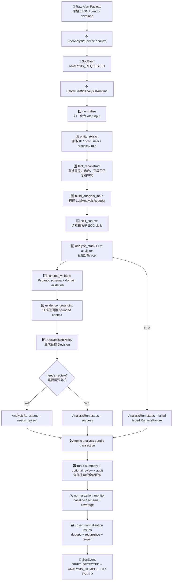
```mermaid
flowchart TD
    A["🧾 Raw Alert Payload<br/>原始 JSON / vendor envelope"] --> B["⚙️ SocAnalysisService.analyze"]
    B --> C["📣 SocEvent<br/>ANALYSIS_REQUESTED"]
    C --> D["⚙️ DeterministicAnalysisRuntime"]

    D --> E["1️⃣ normalize<br/>归一化为 AlertInput"]
    E --> F["2️⃣ entity_extract<br/>抽取 IP / host / user / process / rule"]
    F --> G["3️⃣ fact_reconstruct<br/>重建事实、角色、字段可信度和冲突"]
    G --> H["4️⃣ build_analysis_input<br/>构造 LLMAnalysisRequest"]
    H --> I["5️⃣ skill_context<br/>选择白名单 SOC skills"]
    I --> J["6️⃣ analyze_stub / LLM analyzer<br/>受控分析节点"]
    J --> K["7️⃣ schema_validate<br/>Pydantic schema + domain validation"]
    K --> L["8️⃣ evidence_grounding<br/>证据值回指 bounded context"]
    L --> M["9️⃣ SocDecisionPolicy<br/>生成受控 Decision"]

    M --> N{"needs_review?<br/>是否需要复核"}
    N -->|Yes| O["AnalysisRun.status = needs_review"]
    N -->|No| P["AnalysisRun.status = success"]
    J -->|error| Q["AnalysisRun.status = failed<br/>typed RuntimeFailure"]

    O --> R["🔒 Atomic analysis bundle transaction"]
    P --> R
    Q --> R
    R --> S["🗃️ run + summary + optional review + audit<br/>全部成功或全部回滚"]
    S --> T["🛠️ normalization_monitor<br/>baseline / schema / coverage"]
    T --> U["🗃️ upsert normalization issues<br/>dedupe + recurrence + reopen"]
    U --> V["📣 SocEvent<br/>DRIFT_DETECTED + ANALYSIS_COMPLETED / FAILED"]
```

### Step Details / 每一步到底做什么

| Step | English | 中文说明 | Output |
|---|---|---|---|
| `normalize` | Convert vendor payload to canonical alert | 把不同供应商、平安 Zeus envelope、EDR/APT/HIDS 原始字段转成统一 `AlertInput`；保留每条 message 的 network/process observation，并用 `SourceFieldSemantic` 阻止供应商占位值进入实体和推理 | `AlertInput`, `NormalizationReport` |
| `entity_extract` | Extract security entities | 抽取 IP、域名、URL、host、user/UM、process、file、rule_code/rule_name 等实体 | `ExtractedEntities` |
| `fact_reconstruct` | Rebuild and adjudicate facts | 把厂商字段声明转换为 `RoleClaim`，结合场景假设裁决 source/destination/attacker/victim/impacted asset；只在同一 observation 内判冲突，不把不同请求或不同进程执行压成一条会话；冲突时给暂定结论、证据缺口和核查清单，但不确定 response target | `FactReconstructionResult v2`, `RoleResolution`, `ConflictReport` |
| `build_analysis_input` | Build bounded model input | 不把整包 raw payload 塞给模型；按结构化字段和高价值优先级构造合法 JSON 投影，精确记录 projected/sanitized/omitted path，跨消息保留关键请求和进程证据 | `LLMAnalysisRequest` |
| `skill_context` | Resolve SOC skills | 根据 source type、场景、实体、冲突选择 SOC skills；当前产物是名称/原因/摘要/hash 的选择清单，不是完整 `SKILL.md` 正文 | `SocSkillContext` |
| `analyze_stub / LLM analyzer` | Run bounded reasoning | 默认 deterministic stub；显式选择后通过 DeerFlow `create_chat_model` 调用真实模型，输出仍必须经过 JSON/schema/domain validation | `AnalysisNodeOutput` |
| `schema_validate` | Validate model result | 严格校验 JSON schema、字段类型、domain rule，坏 JSON 需要 repair 后再校验 | `AnalysisResult` |
| `evidence_grounding` | Ground model claims | 对每条 `AnalysisResult.evidence` 校验唯一精确 source 是否是实际 bounded path，value 是否存在，并区分 `#parsed/#decoded/#repaired`；拒绝 composite citation，HTTP 200/工单状态等若被模型扩写成“攻击成功”则标为未证实 outcome claim | `AnalysisEvidenceGroundingReport` |
| `decide` | Apply deterministic decision policy | `SocDecisionPolicy` 将已校验结果转换成 operational decision；保留 raw confidence 来源、校准状态、证据状态、结构化复核原因和 policy version。当前 stub/LLM 分数均未校准，因此必须复核；高分不能覆盖冲突、schema 降级、关键证据缺口、截断或误报确认 | `Decision` |
| `normalization_monitor` | Detect parser/mapping maintenance work | 在业务结果已落库后检查基线、新结构、解析降级、关键字段缺口和 evidence truncation；失败只写 warning | `NormalizationMonitoringResult`, `NormalizationMaintenanceIssue` |

### Decision State / 决策状态

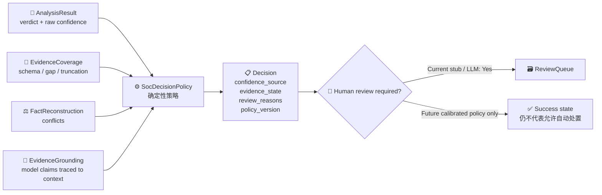
```mermaid
flowchart LR
    A["🧠 AnalysisResult<br/>verdict + raw confidence"] --> B["⚙️ SocDecisionPolicy<br/>确定性策略"]
    C["🔎 EvidenceCoverage<br/>schema / gap / truncation"] --> B
    D["⚖️ FactReconstruction<br/>conflicts"] --> B
    GR["🔗 EvidenceGrounding<br/>model claims traced to context"] --> B
    B --> E["📋 Decision<br/>confidence_source<br/>evidence_state<br/>review_reasons<br/>policy_version"]
    E --> F{"👤 Human review required?"}
    F -->|Current stub / LLM: Yes| Q["🗃️ ReviewQueue"]
    F -->|Future calibrated policy only| H["✅ Success state<br/>仍不代表允许自动处置"]
```

`AnalysisResult.confidence` 是分析器原始自评，不是生产概率。当前
`Decision.calibrated_probability=null`、`confidence_is_calibrated=false`；只有经过人工标注、离线校准、
版本化审批和 replay 验证的 profile，才有资格在未来改变复核策略。mock/failed/denied 调查证据不满足
场景所需证据，也不能提高 finding confidence；它们只在调查时间线或 demo 审计中可见。

## 3. Persistence Map / 数据写入地图

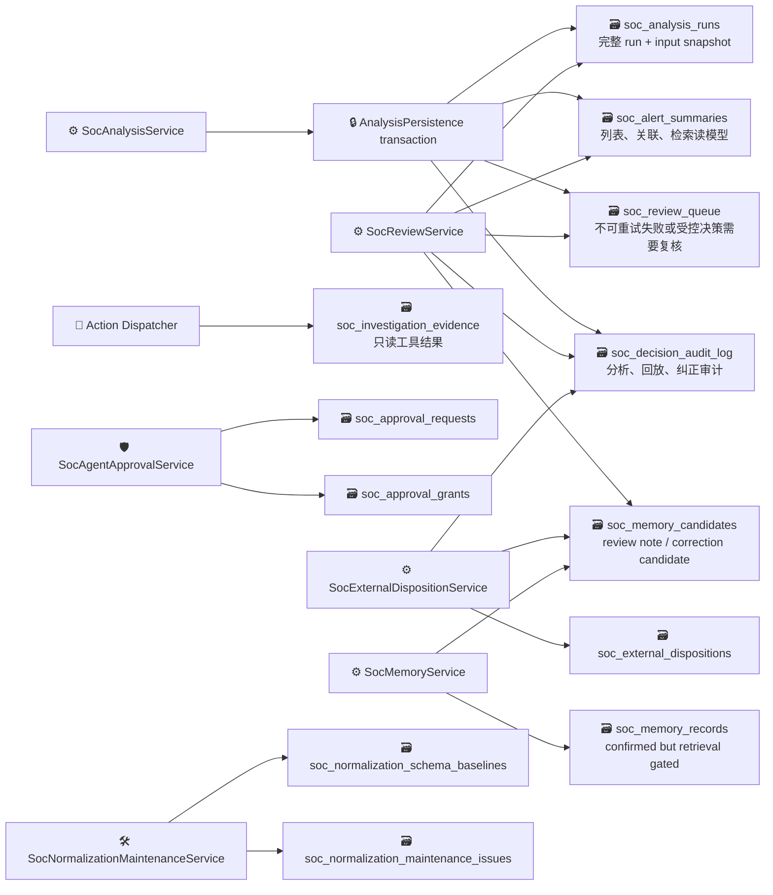
```mermaid
flowchart LR
    A["⚙️ SocAnalysisService"] --> TX["🔒 AnalysisPersistence transaction"]
    TX --> B["🗃️ soc_analysis_runs<br/>完整 run + input snapshot"]
    TX --> C["🗃️ soc_alert_summaries<br/>列表、关联、检索读模型"]
    TX --> D["🗃️ soc_review_queue<br/>不可重试失败或受控决策需要复核"]
    TX --> E["🗃️ soc_decision_audit_log<br/>分析、回放、纠正审计"]

    F["⚙️ SocReviewService"] --> D
    F --> B
    F --> C
    F --> E
    F --> G["🗃️ soc_memory_candidates<br/>review note / correction candidate"]

    H["🧰 Action Dispatcher"] --> I["🗃️ soc_investigation_evidence<br/>只读工具结果"]
    J["🛡️ SocAgentApprovalService"] --> K["🗃️ soc_approval_requests"]
    J --> L["🗃️ soc_approval_grants"]
    M["⚙️ SocExternalDispositionService"] --> N["🗃️ soc_external_dispositions"]
    M --> E
    M --> G
    O["⚙️ SocMemoryService"] --> G
    O --> P["🗃️ soc_memory_records<br/>confirmed but retrieval gated"]
    Q["🛠️ SocNormalizationMaintenanceService"] --> R["🗃️ soc_normalization_schema_baselines"]
    Q --> S["🗃️ soc_normalization_maintenance_issues"]
```

每张表的职责：

| Store | What It Stores | 中文职责 |
|---|---|---|
| `soc_analysis_runs` | Full analysis run | 保存完整 run、input payload/hash、pipeline trace、decision、corrections |
| `soc_alert_summaries` | Query-friendly read model | 面向列表、关联、相似检索和 ReviewQueue 的轻量摘要 |
| `soc_review_queue` | Human review queue | 分析师复核入口；close 不等于改判 |
| `soc_decision_audit_log` | Decision audit records | analyze/replay/correct/external disposition 的审计链 |
| `soc_investigation_evidence` | Read-only action results | 资产查询、EDR 进程树、威胁情报等只读调查结果 |
| `soc_external_dispositions` | External ticket feedback | Zeus/ITSM/SOAR 外部状态、理由、映射和同步结果 |
| `soc_disposition_proposals` | Shadow operational proposals | 保存 true-positive + exact authorization 产生的未应用处置建议 |
| `soc_disposition_sample_manifests` | Reproducible QA samples | 保存 scope/population/seed hash/selected proposal ids，防止人工挑样 |
| `soc_disposition_outcomes` | Append-only evaluation labels | 保存 primary/sample 结构化结论和 supersession lineage，不改 queue/verdict |
| `soc_memory_candidates` | Reviewable knowledge proposals | 候选记忆，默认 `pending_review`，不影响 runtime decision |
| `soc_memory_records` | Confirmed memory records | 已确认记忆，默认 `retrieval_enabled=false`，仍不自动注入 prompt |
| `soc_approval_requests` | Approval request lifecycle | 高风险动作审批 inbox；保存 pending/approved/rejected/expired 终态和处理元数据 |
| `soc_approval_grants` | One-time approval grants | 一次性授权 token，当前 execute boundary 不执行生产副作用 |
| `soc_normalization_schema_baselines` | Approved parser fingerprints | 人工批准的 tenant/source/adapter/parser/version 基线；新版本 supersede 旧版本 |
| `soc_normalization_maintenance_issues` | Parser/mapping maintenance queue | 去重保存 missing/novel/degraded/unsupported/gap/truncation，记录出现次数和处理状态 |

## 4. Review Context Assembly / 调查上下文聚合

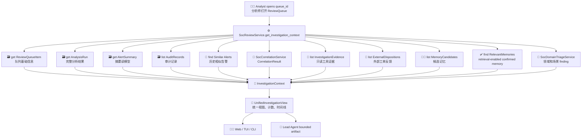
```mermaid
flowchart TD
    A["🧑‍💻 Analyst opens queue_id<br/>分析师打开 ReviewQueue"] --> B["⚙️ SocReviewService.get_investigation_context"]

    B --> C["🗃️ get ReviewQueueItem<br/>队列基础信息"]
    B --> D["🗃️ get AnalysisRun<br/>完整分析结果"]
    B --> E["🗃️ get AlertSummary<br/>摘要读模型"]
    B --> F["🗃️ list AuditRecords<br/>审计记录"]
    B --> G["🔎 find Similar Alerts<br/>历史相似告警"]
    B --> H["🔎 SocCorrelationService<br/>CorrelationResult"]
    B --> I["🧰 list InvestigationEvidence<br/>只读工具证据"]
    B --> J["🧾 list ExternalDispositions<br/>外部工单反馈"]
    B --> K["🧠📌 list MemoryCandidates<br/>候选记忆"]
    B --> L["✅ find RelevantMemories<br/>retrieval-enabled confirmed memory"]
    B --> M["🧩 SocDomainTriageService<br/>领域和场景 finding"]

    C --> N["🔎 InvestigationContext"]
    D --> N
    E --> N
    F --> N
    G --> N
    H --> N
    I --> N
    J --> N
    K --> N
    L --> N
    M --> N

    N --> O["🔎 UnifiedInvestigationView<br/>统一视图、计数、时间线"]
    O --> P["🧑‍💻 Web / TUI / CLI"]
    O --> Q["🧠 Lead Agent bounded artifact"]
```

`InvestigationContext` 是分析师打开一个 queue item 时的核心只读视图。它不是新的 source of truth，而是把已有数据组合起来：

| Context Field | English | 中文说明 |
|---|---|---|
| `queue_item` | Review task | 复核队列项，含 status、priority、rule、summary |
| `run` | Full analysis run | 完整 pipeline trace、entities、analysis、decision、corrections |
| `summary` | Alert summary | 面向列表和相似检索的摘要 |
| `audit_records` | Audit trail | 分析、回放、纠正、外部同步审计 |
| `similar_alerts` | Simple similarity matches | 轻量历史相似告警 |
| `correlation_result` | Structured correlation | 相似告警、匹配原因、可复用 evidence |
| `action_evidence` | Tool evidence | 只读工具/MCP 结果 |
| `authorization_enrichments` | Authorization snapshots | 事件时间确定性授权匹配快照，shadow/no-impact |
| `disposition_proposals` | Shadow proposals | 未应用、需人工复核的运营处置建议 |
| `disposition_outcomes` | Evaluation labels | 结构化 primary/sample outcome，只用于评测 |
| `external_dispositions` | External feedback | Zeus/ITSM/SOAR 状态和理由 |
| `memory_candidates` | Reviewable proposals | 待评审候选记忆 |
| `relevant_memories` | Retrieval-gated memories | 显式 retrieval-enabled 的 confirmed memory |
| `domain_triage_results` | Domain/scenario findings | APT/EDR/HIDS/通用场景发现 |
| `investigation_view` | Unified view | 面向 Web/TUI/Lead Agent 的统一时间线和计数 |

### 4.1 Main Orchestrator Correlation Bridge / 主编排历史关联

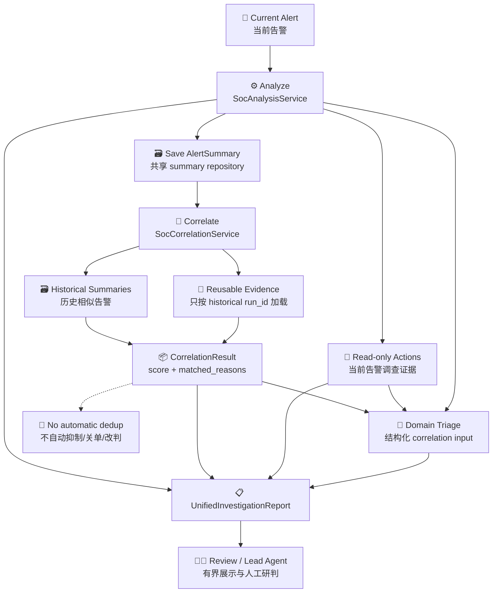
```mermaid
flowchart TD
    A["🧾 Current Alert<br/>当前告警"] --> B["⚙️ Analyze<br/>SocAnalysisService"]
    B --> C["🗃️ Save AlertSummary<br/>共享 summary repository"]
    C --> D["🔎 Correlate<br/>SocCorrelationService"]
    D --> E["🗃️ Historical Summaries<br/>历史相似告警"]
    D --> F["🧰 Reusable Evidence<br/>只按 historical run_id 加载"]
    E --> G["📦 CorrelationResult<br/>score + matched_reasons"]
    F --> G

    B --> H["🧰 Read-only Actions<br/>当前告警调查证据"]
    G --> I["🧩 Domain Triage<br/>结构化 correlation input"]
    H --> I
    B --> I

    B --> J["📋 UnifiedInvestigationReport"]
    G --> J
    H --> J
    I --> J
    J --> K["🧑‍💻 Review / Lead Agent<br/>有界展示与人工研判"]

    G -.-> L["🚫 No automatic dedup<br/>不自动抑制/关单/改判"]
```

1. `SocAnalysisService` 和 `SocCorrelationService` 共用同一个 `AlertSummaryRepository`；主编排器
   不直接查库。
2. `CorrelationResult` 是 `UnifiedInvestigationReport` 和 `SocDomainTriageRequest` 的显式 typed field；
   metadata 中的 count 只是展示投影。
3. 历史 evidence 只按 matched historical `run_id` 读取。即使历史与当前告警复用同一个
   `alert_id`，也不会把当前 action evidence 混入历史 match。
4. Domain finding 可以说明命中了多少历史告警、引用哪些历史 evidence；Runtime `Decision`、
   ReviewQueue、memory、approval 和 response action 均保持不变。
5. `soc eval pingan-main --pretty` 会为 APT/EDR/HIDS 各先生成一条本地历史 run，再运行当前告警，
   用于验证这条完整只读链路；其中 action provider 仍是 mock，不代表 PA-12 真实系统接入。

### 4.2 Correlation Evaluation Boundary / 关联评测边界

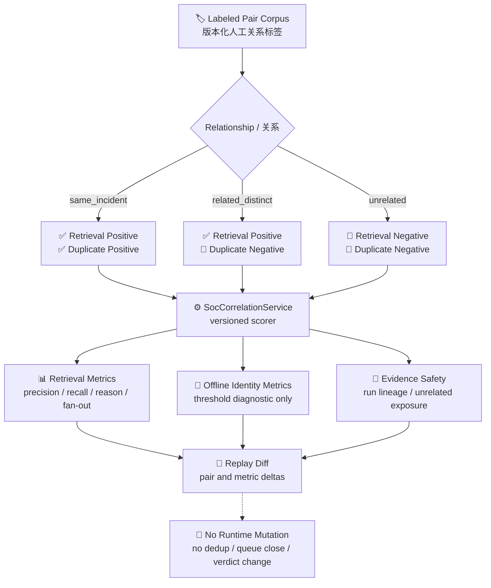
```mermaid
flowchart TD
    A["🏷️ Labeled Pair Corpus<br/>版本化人工关系标签"] --> B{"Relationship / 关系"}
    B -->|same_incident| C["✅ Retrieval Positive<br/>✅ Duplicate Positive"]
    B -->|related_distinct| D["✅ Retrieval Positive<br/>🚫 Duplicate Negative"]
    B -->|unrelated| E["🚫 Retrieval Negative<br/>🚫 Duplicate Negative"]

    C --> F["⚙️ SocCorrelationService<br/>versioned scorer"]
    D --> F
    E --> F
    F --> G["📊 Retrieval Metrics<br/>precision / recall / reason / fan-out"]
    F --> H["🧬 Offline Identity Metrics<br/>threshold diagnostic only"]
    F --> I["🧰 Evidence Safety<br/>run lineage / unrelated exposure"]
    G --> J["🔁 Replay Diff<br/>pair and metric deltas"]
    H --> J
    I --> J
    J -.-> K["🚫 No Runtime Mutation<br/>no dedup / queue close / verdict change"]
```

1. `CorrelationResult.scoring_policy_version` 记录实际评分语义；fixture 版本与 scorer 版本不一致时
   fail-fast，不能拿旧标签报告解释新规则。
2. `same_incident` 与 `related_distinct` 对检索都是正样本，但只有前者对 duplicate identity 是正样本；
   “相似”不能直接推出“可以合并”。
3. `evidence_lineage_leakage_count` 检查 evidence 是否来自错误 `run_id`；
   `unrelated_evidence_exposure_count` 单独统计无关候选被召回后带出的语义噪声。
4. `soc eval correlation --baseline-json PRIOR.json` 忽略生成时间，比较 pair、指标、reason、fan-out 和
   evidence 变化；当前 `shadow_dedup_allowed=false`，报告不写业务库、不抑制告警。

## 5. Domain and Scenario Triage / 领域与场景研判

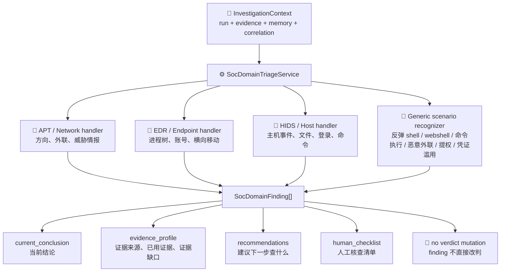
```mermaid
flowchart TD
    A["🔎 InvestigationContext<br/>run + evidence + memory + correlation"] --> B["⚙️ SocDomainTriageService"]
    B --> C["🧩 APT / Network handler<br/>方向、外联、威胁情报"]
    B --> D["🧩 EDR / Endpoint handler<br/>进程树、账号、横向移动"]
    B --> E["🧩 HIDS / Host handler<br/>主机事件、文件、登录、命令"]
    B --> F["🧩 Generic scenario recognizer<br/>反弹 shell / webshell / 命令执行 / 恶意外联 / 提权 / 凭证滥用"]

    C --> G["SocDomainFinding[]"]
    D --> G
    E --> G
    F --> G

    G --> H["current_conclusion<br/>当前结论"]
    G --> I["evidence_profile<br/>证据来源、已用证据、证据缺口"]
    G --> J["recommendations<br/>建议下一步查什么"]
    G --> K["human_checklist<br/>人工核查清单"]
    G --> L["🚫 no verdict mutation<br/>finding 不直接改判"]
```

Domain finding 的作用：

| Output | What It Means | 中文说明 |
|---|---|---|
| `scenario_key` | Recognized security scenario | 识别到的安全场景，如 `execution.reverse_shell`、`network.malicious_outbound` |
| `vendor_scenarios` | Upstream scenario hints | 上游厂商给出的场景提示；内部 taxonomy 未命中时可记录为 `vendor.unmapped` |
| `disposition` | Finding-level assessment | 领域 finding 层面的倾向，不是最终 operational verdict |
| `confidence` | Finding confidence | 场景判断置信度 |
| `evidence_profile.sources` | Available evidence | raw/canonical alert、similar alerts、external feedback、memory、read-only evidence |
| `evidence_profile.gaps` | Missing evidence | 当前缺少什么证据，例如威胁情报、进程树、资产归属 |
| `current_conclusion` | Current best conclusion | 即使证据不足，也给出带置信度和边界的当前结论 |
| `recommendations` | What to check next | 下一步查什么工具、看什么历史、找谁复核 |
| `human_checklist` | Manual checklist | 运营同事可执行的人工核查项 |

## 6. Lead Agent and Tool Boundary / Lead Agent 与工具边界

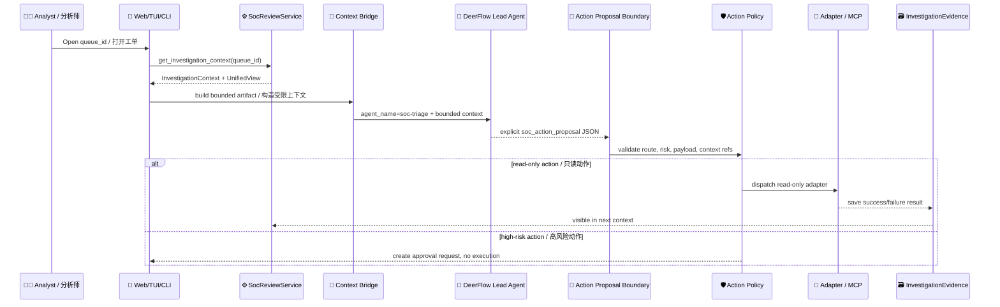
```mermaid
sequenceDiagram
    participant Analyst as 🧑‍💻 Analyst / 分析师
    participant TUI as 🚪 Web/TUI/CLI
    participant Review as ⚙️ SocReviewService
    participant Bridge as 🔎 Context Bridge
    participant Lead as 🧠 DeerFlow Lead Agent
    participant Proposal as 🧾 Action Proposal Boundary
    participant Policy as 🛡️ Action Policy
    participant Adapter as 🧰 Adapter / MCP
    participant Evidence as 🗃️ InvestigationEvidence

    Analyst->>TUI: Open queue_id / 打开工单
    TUI->>Review: get_investigation_context(queue_id)
    Review-->>TUI: InvestigationContext + UnifiedView
    TUI->>Bridge: build bounded artifact / 构造受限上下文
    Bridge->>Lead: agent_name=soc-triage + bounded context
    Lead-->>Proposal: explicit soc_action_proposal JSON
    Proposal->>Policy: validate route, risk, payload, context refs
    alt read-only action / 只读动作
        Policy->>Adapter: dispatch read-only adapter
        Adapter-->>Evidence: save success/failure result
        Evidence-->>Review: visible in next context
    else high-risk action / 高风险动作
        Policy-->>TUI: create approval request, no execution
    end
```

当前支持的只读工具链：

| Route / Action | Type | What It Does | 中文说明 |
|---|---|---|---|
| `asset.lookup` | read-only | Look up asset metadata | 查询资产记录 |
| `asset.locate` | read-only mock MCP | Locate owner/BU/environment | 定位资产归属、BU、环境 |
| `endpoint.process_tree.lookup` | read-only mock | Fetch process tree evidence | 查询终端进程树证据 |
| `host.event_context.lookup` | read-only mock | Fetch host event context | 查询主机事件上下文 |
| `threat_intel.ip_reputation.lookup` | read-only mock | Fetch IP reputation | 查询 IP 威胁情报 |
| `security_tag.lookup` | read-only mock | Fetch security tags | 查询授权、测试、白名单等标签 |

Tool boundary / 工具边界：

- Lead Agent 不能直接调用 repository。
- Lead Agent 不能直接执行 MCP/tool。
- Lead Agent 只能输出显式 action proposal。
- Read-only proposal 必须经过 policy、dispatcher、adapter registry。
- Tool result 只能写 `InvestigationEvidence`。
- Evidence 进入下一轮 `InvestigationContext`，不能直接改 verdict。

## 7. Approval Flow / 审批流

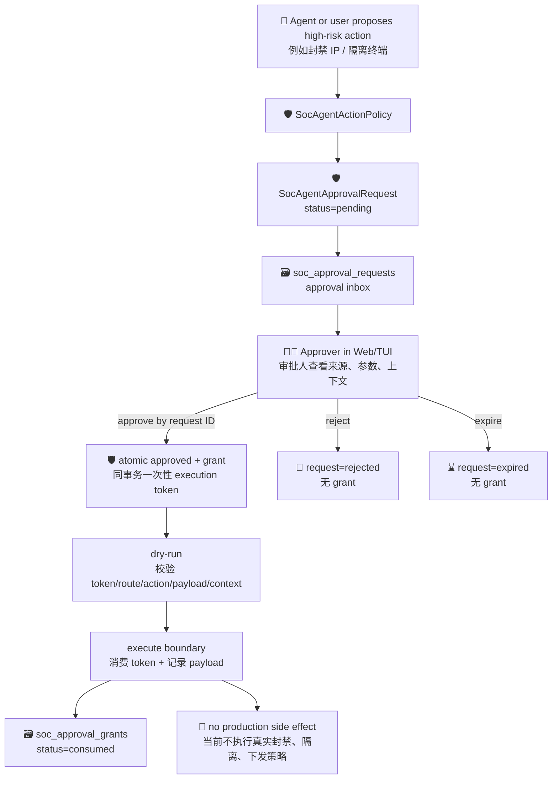
```mermaid
flowchart TD
    A["🧠 Agent or user proposes high-risk action<br/>例如封禁 IP / 隔离终端"] --> B["🛡️ SocAgentActionPolicy"]
    B --> C["🛡️ SocAgentApprovalRequest<br/>status=pending"]
    C --> D["🗃️ soc_approval_requests<br/>approval inbox"]
    D --> E["🧑‍💻 Approver in Web/TUI<br/>审批人查看来源、参数、上下文"]
    E -->|"approve by request ID"| F["🛡️ atomic approved + grant<br/>同事务一次性 execution token"]
    E -->|reject| R["🚫 request=rejected<br/>无 grant"]
    E -->|expire| X["⌛ request=expired<br/>无 grant"]
    F --> G["dry-run<br/>校验 token/route/action/payload/context"]
    G --> H["execute boundary<br/>消费 token + 记录 payload"]
    H --> I["🗃️ soc_approval_grants<br/>status=consumed"]
    H --> J["🚫 no production side effect<br/>当前不执行真实封禁、隔离、下发策略"]
```

Approval flow 当前做什么：

1. 高风险 proposal 不会直接执行。
2. 系统把 proposal 转成 `SocAgentApprovalRequest`。
3. Web/TUI/CLI 审批面只展示 repository 中的 request；grant command 只提交 request ID、理由和有效期，不回传可篡改的完整 request。
4. 审批人可 approve/reject/expire；approve 在同一事务把 request 变成 `approved` 并创建最多一个 `SocAgentApprovalGrant`，另外两个终态不创建 grant。
5. 完全相同的终态重试返回原结果；伪造、过时或改变理由/幂等键/有效期的重试会被拒绝。
6. dry-run 只验证 token、route、payload、上下文和 adapter 支持情况。
7. execute boundary 当前只消费 token并写执行边界记录。
8. 当前不会对生产系统产生外部副作用；统一追加式 mutation audit 由下一刀 `BG-P0-02` 补齐。

## 8. External Disposition Sync / 外部处置反馈流

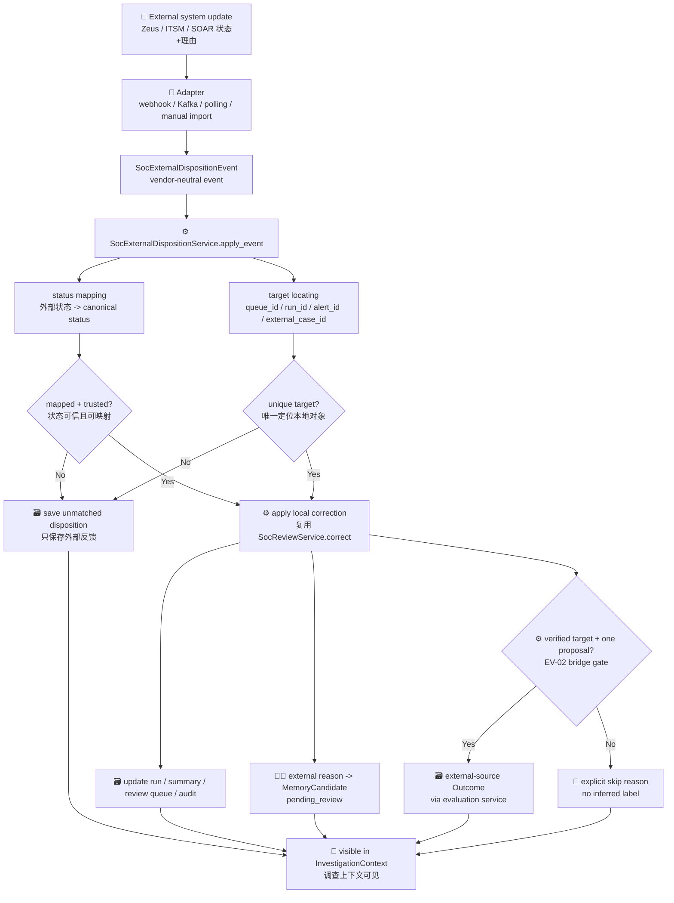
```mermaid
flowchart TD
    A["🧾 External system update<br/>Zeus / ITSM / SOAR 状态+理由"] --> B["🚪 Adapter<br/>webhook / Kafka / polling / manual import"]
    B --> C["SocExternalDispositionEvent<br/>vendor-neutral event"]
    C --> D["⚙️ SocExternalDispositionService.apply_event"]
    D --> E["status mapping<br/>外部状态 -> canonical status"]
    D --> F["target locating<br/>queue_id / run_id / alert_id / external_case_id"]

    E --> G{"mapped + trusted?<br/>状态可信且可映射"}
    F --> H{"unique target?<br/>唯一定位本地对象"}

    G -->|No| I["🗃️ save unmatched disposition<br/>只保存外部反馈"]
    H -->|No| I
    G -->|Yes| J["⚙️ apply local correction<br/>复用 SocReviewService.correct"]
    H -->|Yes| J

    J --> K["🗃️ update run / summary / review queue / audit"]
    J --> L["🧠📌 external reason -> MemoryCandidate<br/>pending_review"]
    J --> N{"⚙️ verified target + one proposal?<br/>EV-02 bridge gate"}
    N -->|Yes| O["🗃️ external-source Outcome<br/>via evaluation service"]
    N -->|No| P["🔎 explicit skip reason<br/>no inferred label"]
    I --> M["🔎 visible in InvestigationContext<br/>调查上下文可见"]
    K --> M
    L --> M
    O --> M
    P --> M
```

External disposition 的意义：

- 外部系统仍可能是分析师的实际工作台。
- 外部状态和理由需要回流本系统，保证 ReviewQueue、memory、audit 不脱节。
- 外部 reason 不能直接成为 confirmed memory。
- 外部 correction 必须复用 `SocReviewService.correct()`，避免两套改判逻辑。
- 未映射、低可信、无法唯一定位的事件只保存，不改判。
- EV-02 outcome bridge 还要求唯一 matching proposal，并复用 `SocDispositionEvaluationService`；bridge
  不从 external reason 猜 canonical status，不会覆盖较新的 analyst/replay primary outcome。
- External correction/queue sync 与 shadow outcome capture 是两条独立审计边界；后者不应用 proposal，
  不改变 ReviewQueue，仍保持 `auto_close_allowed=false`。

## 9. Memory Candidate and Confirmed Memory / 记忆候选与确认记忆

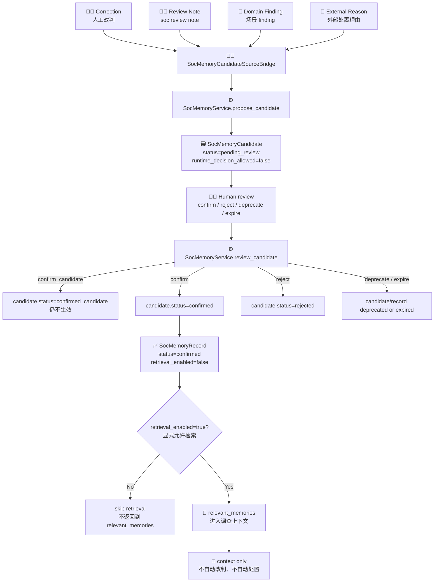
```mermaid
flowchart TD
    A["🧑‍💻 Correction<br/>人工改判"] --> B["🧠📌 SocMemoryCandidateSourceBridge"]
    C["🧑‍💻 Review Note<br/>soc review note"] --> B
    D["🧩 Domain Finding<br/>场景 finding"] --> B
    E["🧾 External Reason<br/>外部处置理由"] --> B

    B --> F["⚙️ SocMemoryService.propose_candidate"]
    F --> G["🗃️ SocMemoryCandidate<br/>status=pending_review<br/>runtime_decision_allowed=false"]

    G --> H["🧑‍💻 Human review<br/>confirm / reject / deprecate / expire"]
    H --> I["⚙️ SocMemoryService.review_candidate"]

    I -->|confirm_candidate| J["candidate.status=confirmed_candidate<br/>仍不生效"]
    I -->|confirm| K["candidate.status=confirmed"]
    K --> L["✅ SocMemoryRecord<br/>status=confirmed<br/>retrieval_enabled=false"]
    I -->|reject| M["candidate.status=rejected"]
    I -->|deprecate / expire| N["candidate/record deprecated or expired"]

    L --> O{"retrieval_enabled=true?<br/>显式允许检索"}
    O -->|No| P["skip retrieval<br/>不返回到 relevant_memories"]
    O -->|Yes| Q["🔎 relevant_memories<br/>进入调查上下文"]
    Q --> R["🚫 context only<br/>不自动改判、不自动处置"]
```

Memory 规则：

| Source | Candidate Type | Default State | Boundary |
|---|---|---|---|
| `soc correct` | correction lesson | `pending_review` | 改判会更新 operational decision，但记忆仍需评审 |
| `soc review note` | analyst observation | `pending_review` | 备注只形成候选记忆，不改 queue status，不改 verdict |
| domain finding | scenario lesson | `pending_review` | finding 可沉淀为经验，但必须显式调用 bridge |
| external reason | external feedback lesson | `pending_review` | 外部 reason 不能直接 confirmed |
| confirmed candidate | memory record | `confirmed`, `retrieval_enabled=false` | 默认仍不被检索，不注入 prompt |

## 10. Review Note Flow / 复核备注流

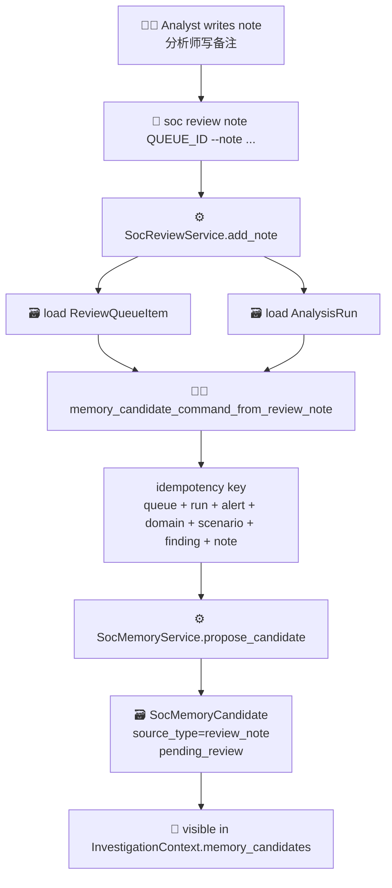
```mermaid
flowchart TD
    A["🧑‍💻 Analyst writes note<br/>分析师写备注"] --> B["🚪 soc review note QUEUE_ID --note ..."]
    B --> C["⚙️ SocReviewService.add_note"]
    C --> D["🗃️ load ReviewQueueItem"]
    C --> E["🗃️ load AnalysisRun"]
    D --> F["🧠📌 memory_candidate_command_from_review_note"]
    E --> F
    F --> G["idempotency key<br/>queue + run + alert + domain + scenario + finding + note"]
    G --> H["⚙️ SocMemoryService.propose_candidate"]
    H --> I["🗃️ SocMemoryCandidate<br/>source_type=review_note<br/>pending_review"]
    I --> J["🔎 visible in InvestigationContext.memory_candidates"]
```

Review note 保存什么：

- 原始 note 文本。
- `queue_id`、`run_id`、`alert_id`。
- 可选 `domain`、`scenario_key`、`finding_id`。
- runtime summary、runtime reason、runtime verdict。
- facets：source type、vendor/product、rule_code/rule_name、entities、scenario、domain。
- evidence refs：`review_note:*`、`review_queue:*`、`run:*`、`alert:*`、可选 `scenario:*`、`domain_finding:*`。

Review note 不做什么：

- 不关闭 ReviewQueue。
- 不修改 verdict。
- 不创建 confirmed memory。
- 不进入 prompt injection。
- 不绕过 `SocMemoryService.review_candidate()`。

## 11. Demo and Operator Commands / 演示与操作命令

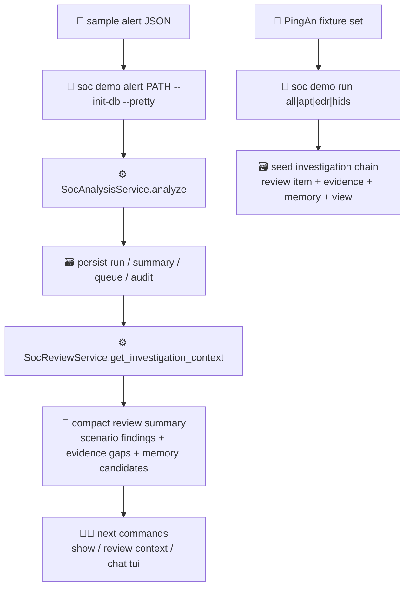
```mermaid
flowchart TD
    A["🧾 sample alert JSON"] --> B["🚪 soc demo alert PATH --init-db --pretty"]
    B --> C["⚙️ SocAnalysisService.analyze"]
    C --> D["🗃️ persist run / summary / queue / audit"]
    D --> E["⚙️ SocReviewService.get_investigation_context"]
    E --> F["🔎 compact review summary<br/>scenario findings + evidence gaps + memory candidates"]
    F --> G["🧑‍💻 next commands<br/>show / review context / chat tui"]

    H["🧾 PingAn fixture set"] --> I["🚪 soc demo run all|apt|edr|hids"]
    I --> J["🗃️ seed investigation chain<br/>review item + evidence + memory + view"]
```

Current useful commands:

```bash
# Run one alert and print review-ready summary
soc demo alert samples/alerts/pingan_legacy_apt.json --init-db --pretty

# Run one alert and create a review-note candidate
soc demo alert samples/alerts/pingan_legacy_apt.json \
  --init-db \
  --review-note "Analyst says raw message direction wins over derived fields." \
  --scenario-key network.malicious_outbound \
  --domain apt \
  --pretty

# Open compact investigation context
soc review context REV-... --summary --pretty

# Record analyst note as pending memory candidate
soc review note REV-... --note "..." --scenario-key execution.reverse_shell --domain edr --pretty

# Inspect pending candidates for a queue item
soc memory list --queue-id REV-... --pretty

# Open DeerFlow-aligned SOC chat entry
soc chat tui --queue-id REV-... --lead-agent
```

## 12. State Machines / 状态流转图

### 12.1 AnalysisRun / 分析运行状态

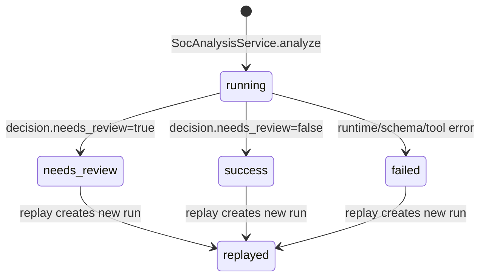
```mermaid
stateDiagram-v2
    [*] --> running: SocAnalysisService.analyze
    running --> success: decision.needs_review=false
    running --> needs_review: decision.needs_review=true
    running --> failed: runtime/schema/tool error
    needs_review --> replayed: replay creates new run
    success --> replayed: replay creates new run
    failed --> replayed: replay creates new run
```

### 12.2 ReviewQueueItem / 复核队列状态

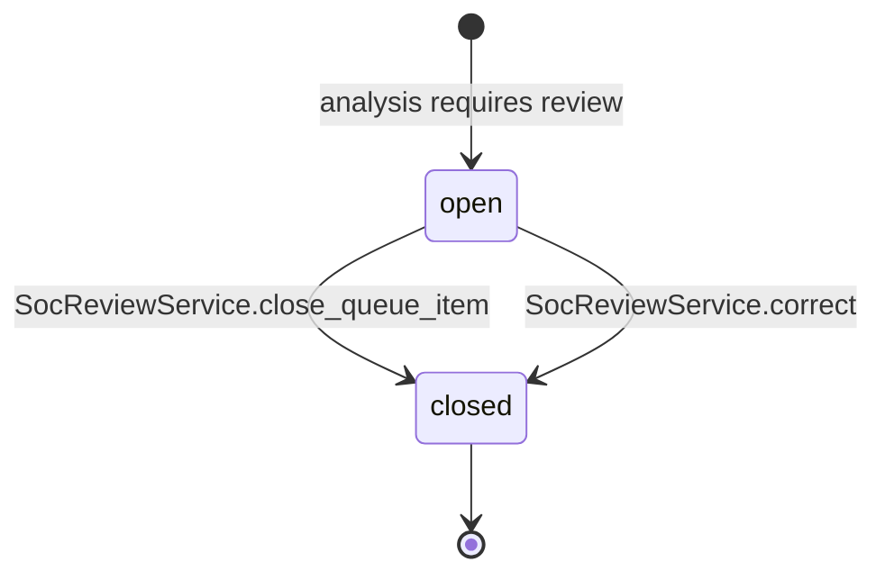
```mermaid
stateDiagram-v2
    [*] --> open: analysis requires review
    open --> closed: SocReviewService.close_queue_item
    open --> closed: SocReviewService.correct
    closed --> [*]
```

Important boundary / 重要边界：

- `close_queue_item` only marks review task done.
- `correct` changes operational decision and records `CorrectionRecord`.
- `review note` does not close queue and does not change decision.

### 12.3 MemoryCandidate / 候选记忆状态

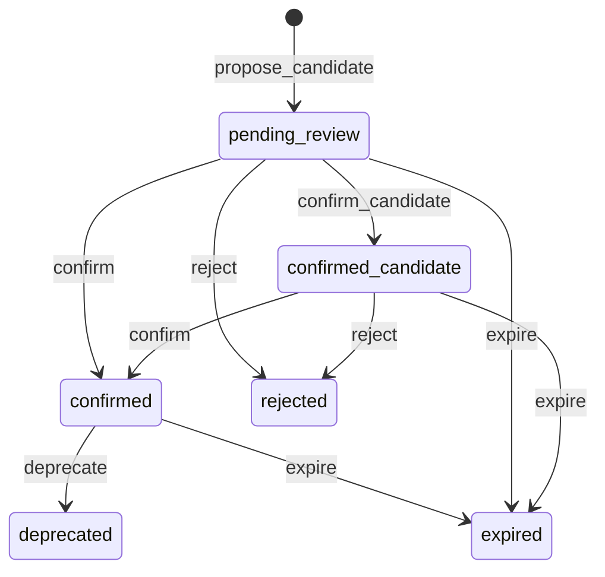
```mermaid
stateDiagram-v2
    [*] --> pending_review: propose_candidate
    pending_review --> confirmed_candidate: confirm_candidate
    pending_review --> confirmed: confirm
    confirmed_candidate --> confirmed: confirm
    pending_review --> rejected: reject
    confirmed_candidate --> rejected: reject
    confirmed --> deprecated: deprecate
    confirmed --> expired: expire
    pending_review --> expired: expire
    confirmed_candidate --> expired: expire
```

### 12.4 Approval / 审批状态

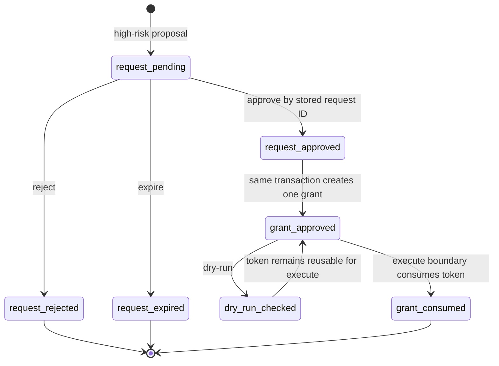
```mermaid
stateDiagram-v2
    [*] --> request_pending: high-risk proposal
    request_pending --> request_approved: approve by stored request ID
    request_pending --> request_rejected: reject
    request_pending --> request_expired: expire
    request_approved --> grant_approved: same transaction creates one grant
    grant_approved --> dry_run_checked: dry-run
    dry_run_checked --> grant_approved: token remains reusable for execute
    grant_approved --> grant_consumed: execute boundary consumes token
    request_rejected --> [*]
    request_expired --> [*]
    grant_consumed --> [*]
```

## 13. Safety Boundaries / 安全边界总图

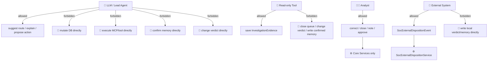
```mermaid
flowchart TD
    A["🧠 LLM / Lead Agent"] -->|allowed| B["suggest route / explain / propose action"]
    A -->|forbidden| C["🚫 mutate DB directly"]
    A -->|forbidden| D["🚫 execute MCP/tool directly"]
    A -->|forbidden| E["🚫 confirm memory directly"]
    A -->|forbidden| F["🚫 change verdict directly"]

    G["🧰 Read-only Tool"] -->|allowed| H["save InvestigationEvidence"]
    G -->|forbidden| I["🚫 close queue / change verdict / write confirmed memory"]

    J["🧑‍💻 Analyst"] -->|allowed| K["correct / close / note / approve"]
    K --> L["⚙️ Core Services only"]

    M["🧾 External System"] -->|allowed| N["SocExternalDispositionEvent"]
    N --> O["⚙️ SocExternalDispositionService"]
    M -->|forbidden| P["🚫 write local verdict/memory directly"]
```

The current product behavior is intentionally conservative:

- Code owns control flow.
- Services own state transitions.
- Repositories own persistence.
- LLM/Lead Agent owns bounded reasoning and suggestions.
- Human review owns high-risk confirmation and memory confirmation.
- Tool/MCP results are evidence, not verdicts.
