# SOC Alert Lifecycle Flow / SOC 预警完整流转

> Updated: 2026-08-11
>
> 本文只描述当前项目里的 SOC Agent 端到端运行过程、状态流转、数据写入和安全边界。
>
> Principle / 原则：LLM、Lead Agent、skills、MCP/tools 都只能在受控边界内参与研判；主流程、状态机、权限、审计和持久化由 SOC Runtime / Core Services 掌握。

## 0. Icon Legend / 图标说明

| Icon | Meaning | 中文说明 |
|---|---|---|
| 🧾 | Alert / input | 原始预警、外部输入 |
| 🚪 | Entry surface | CLI、API、Web、TUI、Kafka 等入口 |
| ⚙️ | Runtime / service | 固定流程或核心服务 |
| 🧠 | LLM / reasoning | 受控推理节点或 Lead Agent |
| 🧰 | Tool / MCP / adapter | 只读工具、MCP、action adapter |
| 🧑‍💻 | Analyst / human | 分析师、审批人、人工复核 |
| 🗃️ | Database / store | SOC 业务库、读模型、审计表 |
| 🔎 | Investigation context | 调查上下文、关联、证据、时间线 |
| 🧩 | Domain finding | APT/EDR/HIDS/通用场景研判结果 |
| 🧠📌 | Memory candidate | 候选记忆，待人工评审 |
| ✅ | Confirmed memory | 已确认记忆；普通文本只作上下文，审核后的 typed directive 可受控影响 effective decision |
| 🛡️ | Authorization boundary | 人工 Approval 或服务端自动策略授权边界 |
| 🚫 | Forbidden mutation | 不允许模型/自由文本 Memory 绕过服务直接改判或执行 |
| 🛠️ | Maintenance | 解析器、Schema 基线和字段映射维护 |
| 🪪 | Governed context | 带时效、范围、来源和撤销语义的运营事实 |

## 1. End-to-End Overview / 端到端总览

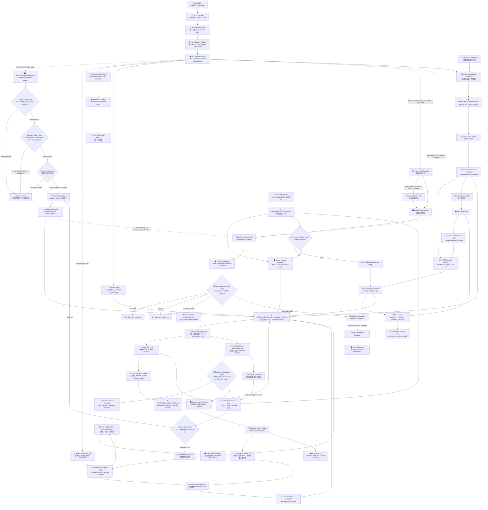
```mermaid
flowchart TD
    A["🧾 Alert JSON<br/>预警输入 / Alert input"] --> B["🚪 Entry Surface<br/>CLI / API / Kafka / Demo"]
    B --> C["⚙️ SocAnalysisService<br/>统一分析入口 / analysis entry"]
    C --> D["⚙️ Fixed Runtime Pipeline<br/>固定流水线 / deterministic control flow"]
    D --> E["🗃️ SOC Business Store<br/>run + summary + queue + decision audit"]
    E -.->|"Kafka / batch explicit opt-in"| MR1["🗃️ MemoryPatternObservation<br/>immutable recurrence source"]
    MR1 --> MR2{"⚙️ Recurrence Gate<br/>UTC window + support 5 + distinct 5"}
    MR2 -->|"below threshold"| MR3["🔎 Retain + replay<br/>只保留观察，不创建候选"]
    MR2 -->|"threshold met"| MR4{"⚙️ Lesson Quality Gate<br/>5 conclusive + consistency ≥80% + strong anchor"}
    MR4 -->|"conflicted / weak / unresolved"| MR3
    MR4 -->|"quality passed"| MR5{"⚙️ Lesson Fingerprint<br/>跨窗口同经验去重"}
    MR5 -->|"equivalent lesson"| MR3
    MR5 -->|"new / materially changed"| R
    E -.->|"Explicit opt-in only"| E0["⚙️ SocEnrichmentPlanner<br/>版本化只读调查计划 / default off"]
    E0 --> E1["🗃️ Durable Investigation Ledger<br/>immutable plan + execution + attempts"]
    E1 --> E2["⚙️ Investigation Reporting<br/>只读重建 / no Provider call"]
    E2 --> E3["🔎 Shadow Report + Addendum<br/>遥测与确定性调查附录"]
    E --> W["🛠️ Normalization Monitor<br/>schema baseline + drift + coverage"]
    W --> X["🗃️ Maintenance Store<br/>baseline + deduplicated issues"]
    X --> Y["🧑‍💻 CLI / TUI / Web / Metrics<br/>归一化运维"]

    E --> F["🔎 ReviewQueue<br/>人工复核入口 / analyst review item"]
    E -.->|"SOC_TENANT_POLICY_ENABLED<br/>default off"| TP0["⚙️ Tenant Policy Evaluator<br/>精确规则优先"]
    TP0 -->|"deterministic no-match + advisor enabled"| TP2["🧠 Reviewed Policy Skill<br/>组合运营语义"]
    TP0 --> TP1["🗃️ TenantPolicyDecision<br/>独立运营判断"]
    TP2 --> TP1
    E -.->|"tenant policy or automation enabled"| A0["⚙️ SocAutomationService<br/>post-Runtime resolver"]
    TP1 --> A0
    A0 --> A1["🗃️ DecisionTransition<br/>Base -> Memory -> Tenant -> Effective"]
    A1 --> A2{"🛡️ Versioned Automation Policy<br/>tenant / env / validity / exact rule"}
    A2 -->|"no match"| A3["🚫 No disposition or action"]
    A2 -->|"shadow"| A4["👁️ Proposed lineage only"]
    A2 -->|"human_approval"| A5["🗃️ Authorization: requires_human<br/>尚未自动写 Approval Inbox"]
    A2 -->|"automatic_policy"| A6["🔐 Machine Authorization<br/>Memory not required"]
    A6 -->|"execute flag + exact registry"| A7["⚡ Idempotent Adapter Execution"]
    A7 --> A8["🗃️ ActionExecution<br/>attempt + external before/after"]
    E --> Z1["⚙️ Explicit Authorization Enrichment<br/>显式授权上下文匹配"]
    Z0["🪪 Governed Fact History<br/>授权事实版本历史"] --> Z1
    Z1 --> Z2["🗃️ AuthorizationEnrichmentRecord<br/>append-only match snapshot"]
    Z2 --> Z3["⚙️ DP-01 exact + true-positive gate"]
    Z3 --> Z4["🗃️ Shadow Disposition Proposal<br/>not applied / human review"]
    Z4 --> Z5["🧑‍💻 EV-02 Outcome Capture<br/>closed queue + Web / TUI / API"]
    Z5 --> Z6["🗃️ Append-only Outcome<br/>primary / sampled QA"]
    Z4 --> Z7["⚙️ Hash-ranked Sample<br/>可复现抽样"]
    Z7 --> Z8["🗃️ Sample Manifest"]
    Z8 --> Z13["🧑‍💻 EV-03 Sample Review Inbox<br/>manifest-selected QA work"]
    Z13 --> Z5
    Z6 --> Z9["⚙️ EV-01 Gate<br/>precision + override + freshness + fan-out"]
    Z8 --> Z9
    Z9 --> Z10["🚫 Hold or rollout review only<br/>auto-close remains disabled"]
    Z4 --> G
    Z6 --> G
    F --> G["⚙️ SocReviewService.get_investigation_context<br/>聚合调查上下文 / context assembly"]

    G --> H["🔎 UnifiedInvestigationView<br/>统一调查视图 / unified investigation view"]
    H --> I["🧑‍💻 Web / TUI / CLI<br/>分析师查看 / analyst surfaces"]
    H --> J["🧠 SOC Lead Agent bounded context<br/>受限上下文 / bounded context"]

    J --> J1{"🛡️ Proposal Governance Bridge<br/>Web/Gateway middleware<br/>or TUI outer service"}
    J1 --> K["🧰 Read-only action proposal<br/>只读工具建议 / read-only proposal"]
    K --> L["⚙️ Policy + Dispatcher + Adapter Registry<br/>策略、调度、适配器"]
    E1 --> L
    L --> M["🗃️ InvestigationEvidence<br/>只读证据入库 / evidence persistence"]
    M --> E1
    M --> E2
    M --> G
    E3 --> G

    J1 --> N["🛡️ High-risk action proposal<br/>高风险动作建议 / risky proposal"]
    N --> O["🛡️ Approval Inbox + Grant<br/>审批请求和一次性授权"]
    O --> P["🚫 Execute boundary only<br/>事务化消费 token，不执行生产副作用"]
    O --> P1["🗃️ Mutation Audit<br/>request / resolution / action boundary"]

    I --> Q3["⚖️ Confirm Roles / Targets<br/>人工确认 attacker / victim / response target"]
    Q3 --> Q4["🗃️ RoleAdjudicationRevisionRecord<br/>append-only revision, no action authority"]
    Q4 --> G
    I --> Q["🧑‍💻 Correction / Review Note<br/>人工改判、备注或显式采纳结论"]
    J --> Q0["🧠 Lead Agent conclusion<br/>模型输出本身不写记忆"]
    Q0 -->|"analyst accepts + reason"| Q
    Q --> Q1{"🚦 Memory Admission<br/>人工提升 + 理由 + 可复用锚点"}
    Q1 -->|"admitted"| R["🧠📌 MemoryCandidate<br/>pending_review 候选记忆"]
    Q1 -->|"observed_only"| Q2["📊 只保留操作/审计结果<br/>不制造候选噪声"]
    R --> S["✅ SocMemoryRecord<br/>confirmed memory, retrieval gated"]
    S --> G
    S -. "future matching run: optional typed directive" .-> A0

    T["🧾 External disposition<br/>Zeus / ITSM / SOAR 状态理由"] --> U["⚙️ SocExternalDispositionService<br/>外部反馈归一化"]
    U --> V["🗃️ atomic external disposition<br/>state + decision/mutation audit"]
    U --> Z11{"⚙️ trusted + verified target<br/>+ unique proposal?"}
    Z11 -->|Yes| Z12["⚙️ EV-02 External Outcome Bridge"]
    Z12 --> Z6
    Z11 -->|No| V
    U --> Q
    V --> G
```

这张图表达的是当前系统的实际闭环：

1. CLI/demo alert 可直接进入统一分析服务；Kafka alert 必须先通过严格
   `SocAlertRawEnvelope(soc.alert.raw.v1)` 校验。mapper 完整保留 source `raw`，只补充通用 transport
   fallback 和 `_soc_ingress` provenance，再生成 `SocDaemonMessage`；裸 alert object、错误版本、超限
   payload 或保留键冲突进入现有 DLQ/commit 语义。
2. Runtime 按固定步骤生成 `AnalysisRun`、`AlertSummary`、`ReviewQueueItem` 和 audit。
3. `soc.enrichment_composition.v1` 显式启用并通过 Registry fail-fast 后，D3 workflow 从已持久化的基础
   run 生成不可变 `SocEnrichmentPlan`，保存 execution/attempt，再把 exact allowlisted read-only action
   送入同一 Dispatcher。Kafka 与内网 batch 都是显式 opt-in；默认 composition 关闭时只跑固定 Runtime。
   每个实际结果先校验 mock/real provenance，再写确定性 `InvestigationEvidence`；正常查无与 Provider
   failure 分开，retryable failure 不提交 Kafka offset，重复消息复用已完成 execution。
4. D4 reporting service 从同一个 execution/attempt/evidence 快照只读重建 shadow report 和
   investigation addendum。它不调用 Provider、不新增报告表、不产生第二个分析结论；只测量实际
   action-attempt latency，Provider 网络耗时和费用没有来源时明确 `not_measured`。
5. 分析师通过 ReviewQueue 打开统一调查上下文；Web、TUI、CLI 和 Lead Agent 都读取同一 addendum。
6. Lead Agent 只能拿 bounded context，并只能提出结构化 action proposal。标准 Web/Gateway
   `soc-triage` 运行由 profile v2 的 per-agent middleware 截获 marker；SOC TUI 由现有
   `SocLeadAgentChatService` 外层桥处理。两条入口共用 proposal parser、Policy 和 Approval Service。
7. 模型不能提供 proposal/request/decision ID、actor 或 context lineage；这些字段由服务端稳定派生，
   相同 graph replay 幂等，一条消息最多接收 5 个有效 proposal。
8. 自动计划和 Lead Agent proposal 都必须走 Policy、Dispatcher、Adapter Registry；只读结果写成
   `InvestigationEvidence` 后回到调查上下文，不能回写基础 Runtime verdict。
9. Lead Agent 提出的高风险动作仍只进入审批 inbox 和 grant boundary，middleware 不执行动作；高风险
   adapter 不能作为 unrestricted DeerFlow/MCP tool 暴露给模型。独立的 post-Runtime automation observer
   可以在 reviewed enforced policy 匹配时直接授权，不要求 Memory；只有显式 execution flag 和注入的
   exact reviewed registry 同时存在时才调用 adapter，并写独立 execution lineage。
9.1 分析师可以独立确认或修订 attacker、victim、proxy 和 action-specific response target。该命令追加
    `RoleAdjudicationRevisionRecord`，保留模型原始 adjudication hash 和前一版本；它不是 correction、
    Memory、Approval 或 action authorization。
10. 人工 correction、review note、外部处置理由、domain finding 先经过统一 Memory Admission；只有明确
    人工提升/采纳、足够理由和可复用锚点同时成立才形成 pending candidate，其余为 `observed_only`。
    Lead Agent 输出不会自动落记忆；PI-03F1 允许 `--lead-agent` TUI/CLI 在 open ReviewQueue 上由分析师
    明确采纳一条稳定 assistant message 并填写复用理由。PI-03F2 Web/Gateway 只接收 message ID 和理由，
    从 authenticated server-owned 当前 checkpoint 解析 `soc-triage` 最后一条 terminal assistant 原文，
    再复用 `SocReviewService.add_note()`。Direct Web 的 queue ID 只是 identity hint；Gateway 会把 owner-owned
    thread 一次性绑定到 queue/run/alert，每轮从 `SocReviewService` 重建 bounded context，middleware 临时注入
    模型并在 assistant message 保存 exact context provenance。不同 queue 必须新建 thread，artifact 不进入
    checkpoint/history，采纳仍只生成 `pending_review` candidate。Kafka/批处理也不能逐告警写 candidate；
    PI-03F3 只在显式启用时把完成的 run 保存为 immutable observation，以 tenant/environment/data class
    隔离。server-owned Memory Profile 从 canonical 字段选择 cohort 与 occurrence identity：generic fallback
    保持跨厂商，PingAn Profile v3 使用 detection key + detector signature + behavior fingerprint 形成
    compound cohort；只有 strong behavior compound 才可 decision-eligible，detection-only/weak-only 降为
    rule-context，behavior-only strong 保留 ruleless pattern，并拒绝 category-only cohort；
    同 upstream event/input occurrence 不重复增加 support。随后使用 canonical
    timezone-aware source event time 的固定 UTC 窗口。`soc.memory_pattern_aggregation.v3` 默认要求 24h 内
    达到 5 support + 5 distinct sources + 5 conclusive outcomes，并满足 risk/benign consistency >=80% 和
    consensus strong anchor，才提出一个 frozen `pending_review` pattern lesson。低支持、冲突、未决或弱锚点
    cohort 只保留 observation，不进入专家队列；候选必须总结适用范围、结论分布、代表性理由和例外，不能
    复述单条告警。后续记录仅供 replay，重复本身不证明授权、影响或处置权限。
11. confirmed memory 默认不可检索；只有 memory governor 经 role/reason/version/validity/review/audit
   状态迁移后才可进入 bounded context。普通 `M-*` 不直接改判；若确认时另附审核后的 typed decision
   directive，且 future match 的 exact profile/applicability/version/score/required facets 全部满足，则只追加 effective-decision
   before/after transition，不改写原 Runtime Decision，也不直接授权动作。
11.1 每次 `M-*` 投影都在 automation reconciliation 后保存 exact Memory use。分析师 correction 或可信
    Zeus 外部处置结果会回写该次 use 的 support/contradiction feedback 和 versioned health；矛盾生成修订
    proposal。若 active benign directive 被高可信风险真值反驳，disable-only safety monitor 立即关闭
    retrieval，防止同一经验继续造成漏报；旧 Memory 不原地改写，动作授权仍走独立 Policy。
12. 租户运营策略在 Memory 阶段之后形成独立 `TenantPolicyDecision`。精确规则先确定性匹配；仅在
    no-match 且显式启用时，受版本/hash 约束的 policy Skill 才处理组合语义。PingAn 当前确认语义中
    canonical `status=200` 只表示请求成功，单独不升级也不忽略；所有 canonical HTTP 事务均非 `200` 或
    上游明确请求失败时可形成运营忽略。强制转交 rule_code 优先；明确攻击成功/失陷只阻止非 `200` 规则
    直接忽略，本身不确定性转交，仍由 Runtime/Policy Skill 结合效果研判。`企图/尝试` 同样保留给组合
    研判。`enforced` 可改变有效复核/disposition，但不改技术 verdict，也不授权动作。
13. 持久化分析完成后，Normalization Monitor 对 schema/coverage 做旁路检查；它可以创建维护问题，
   但不能改变 verdict、ReviewQueue 或分析成功状态。
14. 显式 authorization enrichment 把确定性匹配保存为独立记录；不会回写 Runtime decision。
15. DP-01 只有在 exact + current true-positive 时生成 shadow proposal；proposal 进入调查视图，但仍由
   人工决定是否关单，系统不会自动应用。
16. EV-01 不从 close reason 猜结论。它保存显式 primary/sample outcome，用可复现 manifest 防止挑样，
   再计算 precision、override、sample agreement、freshness 和 fact fan-out。
17. EV-02 已把 authenticated API/Web、Review TUI 和受门控的 trusted external feedback 接到同一
   evaluation service；各入口仍必须提供显式结构化标签和幂等身份。
18. EV-03 从 immutable manifest、proposal、ReviewQueue 和 latest outcomes 派生 reviewer-specific inbox；
   Web 只能打开 manifest-selected work，并回到 EV-02 写入口，不保存第二套 campaign 状态。
19. EV-01/DP-01 旧 shadow gate 仍固定 `auto_close_allowed=false`；它与新的通用
   `SocAutomationPolicy` 是两条不同合同，不能把 shadow proposal 误当作已授权动作。
20. correction、close/note、memory review/retrieval activation、approval lifecycle/action boundary 和 external disposition
   都通过 `SocMutationUnitOfWork` 原子写入业务状态与 `soc_mutation_audit_log`；post-Runtime automation
   使用 migration `0023` 的四类 append-only lineage 表，migration `0024` 增加租户策略和四阶段索引；
   migration `0025` 保存 Memory profile/occurrence、use、feedback、health 与 revision proposal。
   两类审计互补，不能互相替代。

Current governed-context boundary / 当前边界：GF-01 已能通过 `SocGovernedContextService` 和
`soc_governed_context_facts` 保存、审批、暂停、撤销、过期及回放 typed fact versions；AA-01 已能从
canonical alert 构造 `AuthorizationQuery`，按事件时间选择历史 fact version，并返回只读
`AuthorizationMatchResult`；EX-01 已把 query/result/policy/fact refs 保存为 append-only
`AuthorizationEnrichmentRecord`；DP-01 已从 persisted exact enrichment + current true-positive
detection truth 生成 append-only `SocDispositionProposalRecord`；EV-01 已保存 hash-ranked sample manifest、
append-only `SocDispositionOutcomeRecord` 并生成只读 gate report；EV-02 已提供 Web/TUI/API/trusted external
显式写入口；EV-03 已提供只读、分页、带 independent reviewer readiness 的 sample campaign/inbox，
outcome 同样投影到统一调查上下文。
`security_tag.lookup` 仍只是 `InvestigationEvidence`；护网 campaign/participant attribution 尚未实现。
该 proposal 只建议 `closed_benign_true_positive`，固定 shadow/not-applied，仍以人工 ReviewQueue 为准。

### 1.1 Optional Automatic Read-only Plan / 可选自动只读调查计划

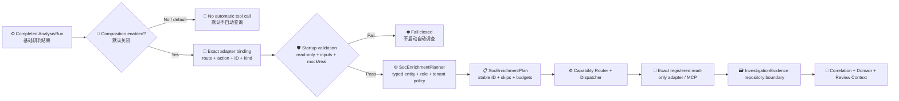
```mermaid
flowchart LR
    A["⚙️ Completed AnalysisRun<br/>基础研判结果"] --> P{"🔐 Composition enabled?<br/>默认关闭"}
    P -->|"No / default"| N["🚫 No automatic tool call<br/>默认不自动查询"]
    P -->|"Yes"| B["📜 Exact adapter binding<br/>route + action + ID + kind"]
    B --> F{"🛡️ Startup validation<br/>read-only + inputs + mock/real"}
    F -->|"Fail"| X["⛔ Fail closed<br/>不启动自动调查"]
    F -->|"Pass"| E["⚙️ SocEnrichmentPlanner<br/>typed entity + role + tenant policy"]
    E --> Q["📋 SocEnrichmentPlan<br/>stable ID + skips + budgets"]
    Q --> D["⚙️ Capability Router + Dispatcher"]
    D --> R["🧰 Exact registered read-only adapter / MCP"]
    R --> V["🗃️ InvestigationEvidence repository boundary"]
    V --> C["🔎 Correlation + Domain + Review Context"]
```

当前 `PI-01D1/D2/D3/D4` 已实现 production-shaped planner contract、严格 application composition、
durable investigation workflow 和只读 reporting projection：

- Planner 只读 `EntityMention`、`RoleResolution`、run status 和版本化 tenant policy，不读 PingAn 字段别名。
- 当前 exact route 只有 `asset.lookup`、`asset.locate`、`threat_intel.ip_reputation.lookup`、
  `security_tag.lookup`；同一 tenant 最多启用一个 asset route。
- 默认没有 enabled route；TI 默认要求内部 CIDR scope，内部/特殊 IP 不发送给 reputation Provider。
- 无效实体、无候选、预算耗尽和 tenant 不匹配都进入 plan 的结构化 `skipped`，不靠日志猜原因。
- Planner 不调用 Provider；Dispatcher 才能执行。D3 execution/attempt/evidence 可写 SQL repository，
  但本地 SQLite/mock 结果仍不是 `mocked=false` 或生产数据库证据。
- Composition 以 exact `route/action/adapter_id/adapter_kind` 锁定 Registry，拒绝非只读、Planner 无法
  提供的必需输入和 mock/real 性质冲突；校验过程不发现或调用 MCP tool。
- PingAn MCP 的 `runtime_declared` 只表示实际结果必须含 `mocked` 声明，不代表已完成真实调用；D3 会在
  每次 evidence 写入前核验它。模式不符进入 non-retryable contract failure，不会保存伪造 evidence。
- Migration `0019_enrichment_executions` 保存 execution/attempt ledger；bounded retry 只重试失败 action，
  stale recovery 优先读取确定性 evidence，linked replay 使用新幂等键且不修改原 run。
- `SocInvestigationReportingService` 从 ledger 和 exact referenced evidence 重建
  `soc.investigation_shadow_report.v1` 与 `soc.investigation_addendum.v1`；不调用 Provider，不新增报告表。
- report 公开 plan/result/retry/mock-real/evidence coverage 与 action-attempt latency；Provider 网络耗时和
  cost 无来源时明确 `not_measured`。addendum 固定不产生新结论、无 decision impact。
- evidence ref 必须匹配 run/alert/thread/route/action/plan-action，证据内容 hash 参与报告 identity；
  Review/Web/TUI/Lead Agent 只消费这份有界投影。
- `soc investigation get|report|replay` 是操作入口；内网 batch 还要求 `--persist` 与
  `--confirm-investigation`。所有配置省略时 Runtime/daemon/batch 保持原行为且不调用 Provider。

### 1.2 Authorization Shadow Path / 授权事实只读旁路


```mermaid
flowchart LR
    A["🧾 Alert<br/>raw or canonical"] --> N["⚙️ normalize + entity + fact<br/>复用确定性前处理"]
    N --> Q["🔎 AuthorizationQuery<br/>tenant + environment + event time<br/>subject + target + behavior"]
    F["🪪 Governed fact history<br/>append-only versions"] --> M["⚙️ AA-01 Matcher<br/>事件时间确定性匹配"]
    Q --> M
    M --> R["🔎 AuthorizationMatchResult<br/>exact / partial / conflict / expired<br/>not_found / unavailable"]
    R --> C["🚪 soc context match<br/>临时只读检查"]
    R --> P["🗃️ EX-01 Enrichment Record<br/>append-only + idempotent + replayable"]
    P --> I["👁️ InvestigationContext<br/>Web / TUI / Lead Agent"]
    P --> G{"⚙️ DP-01 Gate<br/>exact + current TP?"}
    G -->|"yes"| D["🗃️ Shadow Disposition Proposal<br/>closed_benign_true_positive"]
    G -->|"no"| X["🚫 Fail closed<br/>no proposal"]
    D --> I
    D --> H["🧑‍💻 Human Review<br/>人工决定是否关单"]
    H --> O["🗃️ Explicit Outcome<br/>confirmed / overridden / inconclusive"]
    D --> S["🗃️ Reproducible Sample Manifest"]
    S --> V["🧑‍💻 EV-03 Sample Inbox<br/>selected proposals only"]
    V --> H
    O --> E["⚙️ EV-01 Evaluation Gate"]
    S --> E
    E --> K["🚫 Hold shadow or rollout review<br/>never auto-close"]
    P --> X["🚫 No verdict mutation<br/>No ReviewQueue update<br/>No auto-close"]
    D --> X
    O --> X
```

AA-01 使用告警事件时间，不使用“当前时间”替代历史事实状态。无时区时间必须由租户/集成配置显式补充
IANA timezone；不同 selector kind 之间 AND，同 kind 多值 OR。任何缺失、冲突、过期、source stale、
repository unavailable 或候选截断都会 fail closed。

## 2. Alert Analysis Pipeline / 预警分析流水线


```mermaid
flowchart TD
    A["🧾 Raw Alert Payload<br/>原始 JSON / vendor envelope"] --> B["⚙️ SocAnalysisService.analyze"]
    B --> C["📣 SocEvent<br/>ANALYSIS_REQUESTED"]
    C --> D["⚙️ DeterministicAnalysisRuntime"]

    D --> E["1️⃣ normalize<br/>归一化为 AlertInput"]
    E --> F["2️⃣ entity_extract<br/>抽取 IP / host / user / process / rule"]
    F --> G["3️⃣ fact_reconstruct<br/>重建事实、角色、字段可信度和冲突"]
    G --> H["4️⃣ build_analysis_input<br/>ObservationCompactor + LLMAnalysisRequest.v6"]
    H --> I["5️⃣ skill_context<br/>白名单选择 + Skill-package bounded guidance"]
    I --> RC["6️⃣ reference_catalog<br/>Memory Retrieval v2 + tenant knowledge + E/S/A/M/C/T"]
    RC --> PJ["📝 Pre-provider journal<br/>running + bounded metadata"]
    PJ --> J["7️⃣ analyze_stub / LLM analyzer<br/>compact output v4 + short refs → AnalysisResult.v4"]
    J -.-> KC["💡 K-* candidate knowledge<br/>只建议、不生效"]
    KC -.-> KR["🧑‍💻 Human review package<br/>Memory / Skill / Adapter / Policy 分流"]
    KR -.-> KX["🚫 No automatic write or decision impact"]
    J --> K["8️⃣ output_acceptance<br/>syntax + core + independent section validation"]
    K -->|all valid| L["9️⃣ evidence_grounding<br/>校验 E-* 精确事实与 R-* 引用完整性"]
    K -->|optional item/section invalid| DG["⚠️ local isolation<br/>保留 core + 惰性默认值，不重复调用"]
    DG --> L
    K -->|core invalid| FR["🩹 One full-contract repair"]
    FR -->|valid| L
    FR -->|still invalid| SF["🧰 deterministic stub fallback<br/>explicit degraded/review"]
    SF --> L
    L --> VG{"🔀 10  role_verification_gate<br/>是否需要独立方向/角色反证?"}
    VG -->|No| MA["1️⃣1️⃣ AnalysisMateriality v1<br/>decision vs capability impact"]
    VG -->|Yes| VJ["📝 Second provider journal<br/>独立记录 verifier 调用"]
    VJ --> VR["🧠 verify_roles_llm<br/>RC-* supported / challenged / unresolved"]
    VR --> MA
    VR -->|provider/parser error| VU["⚠️ unavailable<br/>保留主分析 + 阻断方向/角色动作"]
    VU --> MA
    MA --> M["1️⃣2️⃣ SocDecisionPolicy v7<br/>生成受控 Decision"]

    M --> N{"needs_review?<br/>是否需要复核"}
    N -->|Yes| O["AnalysisRun.status = needs_review"]
    N -->|No| P["AnalysisRun.status = success"]
    J -->|provider timeout/auth/capacity/transport| Q["AnalysisRun.status = failed<br/>retryable typed RuntimeFailure"]
    PJ -->|process loss| X["⏸️ DB keeps running journal<br/>stale -> interrupted -> recover/replay"]
    VJ -->|process loss| X

    O --> R["🔒 Atomic analysis bundle transaction"]
    P --> R
    Q --> R
    R --> S["🗃️ run + summary + optional review + audit<br/>全部成功或全部回滚"]
    S --> T["🛠️ normalization_monitor<br/>baseline / schema / coverage"]
    T --> U["🗃️ upsert normalization issues<br/>dedupe + recurrence + reopen"]
    U --> V["📣 SocEvent<br/>DRIFT_DETECTED + ANALYSIS_COMPLETED / FAILED"]
```

### Step Details / 每一步到底做什么

| Step | English | 中文说明 | Output |
|---|---|---|---|
| `normalize` | Convert vendor payload to canonical alert | 把不同供应商、平安 Zeus envelope、EDR/APT/HIDS 原始字段转成统一 `AlertInput`；保留每条 message 的 network/process observation，并用 `SourceFieldSemantic` 阻止供应商占位值进入实体和推理 | `AlertInput`, `NormalizationReport` |
| `entity_extract` | Extract security entities | 抽取 IP、域名、URL、host、user/UM、process、file、rule_code/rule_name 等实体 | `ExtractedEntities` |
| `fact_reconstruct` | Rebuild and adjudicate facts | 把厂商字段声明转换为 `RoleClaim`，结合场景假设裁决 source/destination/attacker/victim/impacted asset；只在同一 observation 内判冲突，不把不同请求或不同进程执行压成一条会话；冲突时给暂定结论、证据缺口和核查清单，但不确定 response target | `FactReconstructionResult v3`, `RoleResolution`, `ConflictReport` |
| `build_analysis_input` | Build bounded model input | 不把整包 raw payload 塞给模型；先把全部 typed observations 按行为形状聚合成 stable facts、value distributions 和 correlated profiles，再选择主样本、dominant/rare 代表 Message。完整 raw/parsed/provenance 不变，Prompt 只接收压缩结果和路径计数，异常不会因 first-N 截断丢失 | `LLMAnalysisRequest.v6`, `EvidenceCompactionReport.v1` |
| `skill_context` | Resolve and project SOC skills | 根据 canonical typed source/entity/conflict 选择 SOC Skills，再从真实 public package 投影受预算约束的 `runtime-guidance.md`；记录选择原因、package/guidance hash 和 token accounting，不注入完整 `SKILL.md` | `SocSkillContext.v2` |
| `reference_catalog` | Retrieve governed Memory/knowledge and freeze deterministic references | Runtime 通过 `ConfirmedMemoryAnalysisRequestEnricher -> SocMemoryService` 用 vendor-neutral facets 和 v2 type-aware strong-anchor gate 检索，并按 tenant/integration 匹配已评审知识 profile；再从同一模型可见投影生成稳定引用：当前告警原子事实为 `E-*`；Skill/Adapter/Confirmed Memory/Reviewed Context/Tool Result 分别为 `S/A/M/C/T-*`。SQL facet index 跨完整 eligible corpus 选候选，top-K 只是最终上下文预算 | `AnalysisEvidenceCatalogItem[]`, `AnalysisContextCatalogItem[]` |
| `pre-provider journal` | Commit non-rollbackable call metadata | 每次调用 analyzer/verifier 前先把同一个 run 以 `running` 落到 `soc_analysis_runs`；只写 request hash/schema、purpose、模型、Prompt/Parser、步骤、来源、证据计数、skill、request/trace/actor 和哈希后的幂等键，不写渲染 prompt、provider header/response、credential/token。`provider_request_journals` 保留有序调用序列，`request_journal` 指向当前/最后一次调用用于恢复 | `AnalysisProviderInvocation`, `AnalysisRequestJournal[]` |
| `analyze_stub / LLM analyzer` | Run bounded reasoning | 默认 deterministic stub；显式选择后通过 DeerFlow `create_chat_model` 调用真实模型。模型返回 compact v4 核心结论与请求内短引用（如 `E-001`、`C-001`）；Runtime 用冻结映射还原稳定 ID，补全精确 evidence tuple 和稳定 `R-00`，并把可选 direction/role 投影为内部 `AnalysisResult.v4`。已评审 Adapter 的 provider-reported session initiator/responder 是 scoped 上游会话事实，不要求重复 SYN/PCAP，但不等于攻击角色或动作依据；动作目标由 Runtime 从已接受角色派生 | `AnalysisModelCoreOutputV4`, `AnalysisNodeOutput`, `AnalysisResult.v4` |
| `output_acceptance` | Validate, repair or safely degrade model output | 先做 JSON/机械修复，再独立校验 required core 与 reasoning/scenario/direction/role/guidance。core 有效而可选项损坏时，本地丢弃坏项或隔离坏区块，不再调用模型；core 无效才允许一次受限契约修复，仍失败则显式使用 deterministic stub。所有接受/修复/隔离 lineage 都写入 `analysis_output_quality` | `AnalysisResult.v4`, `AnalysisOutputQuality.v1`, parser repair log |
| `evidence_grounding` | Ground facts and reasoning references | `soc.analysis_evidence_grounding.v3` 逐条验证 `E-*` reference/source path/typed scalar，再验证 `R-*` 的 `E-*` 与 `S/A/M/C/T-*` 引用及 basis。它只证明引用闭合，不二次裁判模型基于这些事实作出的安全推理 | `AnalysisEvidenceGroundingReport.v3` |
| `role_verification_gate` | Decide whether a second pass is justified | 默认关闭；开启后由 Runtime v2 gate 只检查最多四个原子方向字段和非占位 attacker/victim claim。只有核心方向冲突/不确定、上游角色冲突或核心引用 Grounding 失败才触发；tentative、普通证据缺口、中间节点、response target 和低 confidence 本身都不触发。模型不能自行路由 | `RoleVerificationTriggerDecision.v1` |
| `verify_roles_llm` | Independently challenge direction and core role claims | 第一轮方向按 `observed_flow / boundary_direction / semantic_direction / connection_initiator` 拆成 `RC-ND-01..04`，attacker/victim 为 `RC-R-*`；第二轮只看 claim 相关的冻结 `E/S/A/M/C/T-*` 子集与 Runtime typed constraints，不看 raw payload、第一轮 rationale/confidence。逐条返回 `supported/challenged/unresolved` 及有极性的支持/反驳引用；必须遵守 Adapter scoped 会话语义。`challenged` 进入复核，`unresolved/unavailable` 保留第一轮结论但阻断依赖精确方向/角色的动作 | `RoleAdjudicationVerificationResult.v2` |
| `analysis_materiality` | Scope defects to decisions or capabilities | 汇总 output quality、Grounding、`ConflictReport` 与 role verifier，输出 core/decision 是否可用、冲突是已解决/可接受差异/仅阻断动作/必须复核，以及 scenario/direction/source/destination/attacker/victim/impacted-asset/user/response-action 的独立 capability guard | `AnalysisMaterialityReport.v1` |
| `knowledge candidate review` | Review model-suggested reusable knowledge | `K-*` 必须回指本轮 `E-* + R-*`。生产 Runtime 只把它作为 analysis 的 inert data；验证工具可汇总为人工审核包并建议 `general_skill / tenant_memory / governed_context / provider_requirement / adapter_mapping / tenant_policy / evaluation_fixture / reject_or_verify`，但不会自动写入或激活任何目标 | `K-* pending_review`, validation `knowledge-review/REVIEW.md` |
| `decide` | Apply deterministic decision policy | `SocDecisionPolicy.v7` 将已校验结果转换成 operational decision；只因 `unknown/needs_review`、核心不可用、核心引用失败、关键证据缺口、critical unresolved conflict、challenged verifier 或 stub 进入复核。可选区块损坏和 verifier unresolved/unavailable 不抹掉有效 verdict，只由 capability guard 暂停相关动作 | `Decision` |
| `normalization_monitor` | Detect parser/mapping maintenance work | 在业务结果已落库后检查基线、新结构、解析降级、关键字段缺口和 evidence truncation；失败只写 warning | `NormalizationMonitoringResult`, `NormalizationMaintenanceIssue` |

### Decision State / 决策状态

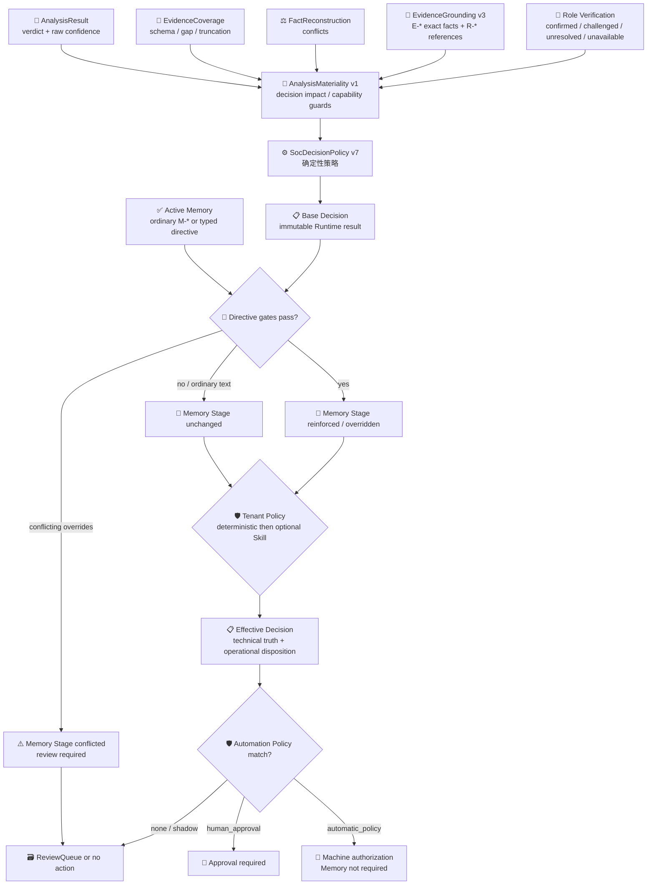
```mermaid
flowchart TD
    A["🧠 AnalysisResult<br/>verdict + raw confidence"] --> MAT["🧭 AnalysisMateriality v1<br/>decision impact / capability guards"]
    C["🔎 EvidenceCoverage<br/>schema / gap / truncation"] --> MAT
    D["⚖️ FactReconstruction<br/>conflicts"] --> MAT
    GR["🔗 EvidenceGrounding v3<br/>E-* exact facts + R-* references"] --> MAT
    RV["🧭 Role Verification<br/>confirmed / challenged / unresolved / unavailable"] --> MAT
    MAT --> B["⚙️ SocDecisionPolicy v7<br/>确定性策略"]
    B --> E["📋 Base Decision<br/>immutable Runtime result"]
    M["✅ Active Memory<br/>ordinary M-* or typed directive"] --> T{"📎 Directive gates pass?"}
    E --> T
    T -->|"no / ordinary text"| U["🔁 Memory Stage unchanged"]
    T -->|"yes"| V["🔁 Memory Stage reinforced / overridden"]
    T -->|"conflicting overrides"| W["⚠️ Memory Stage conflicted<br/>review required"]
    U --> TP{"🛡️ Tenant Policy<br/>deterministic then optional Skill"}
    V --> TP
    TP --> F["📋 Effective Decision<br/>technical truth + operational disposition"]
    F --> P{"🛡️ Automation Policy match?"}
    W --> Q
    P -->|"none / shadow"| Q["🗃️ ReviewQueue or no action"]
    P -->|"human_approval"| H["🛂 Approval required"]
    P -->|"automatic_policy"| X["🔐 Machine authorization<br/>Memory not required"]
```

`AnalysisResult.confidence` 是分析器原始自评，不是生产概率。当前
`Decision.calibrated_probability=null`、`confidence_is_calibrated=false`；基础 Runtime 因此通常保留
ReviewQueue。受评审的自动策略若要在 `needs_review=true` 时仍对精确动作授权，必须显式匹配该状态并
记录 `review_required_override_reason`；这不会删除 ReviewQueue 或伪装成人工复核。mock/failed/denied
调查证据不满足场景所需证据，也不能提高 finding confidence；它们只在调查时间线或 demo 审计中可见。

租户策略是独立的运营判断，不是第二次技术检测。`SOC_TENANT_POLICY_ENABLED` 默认关闭；开启后必须
固定 policy/environment，策略 Skill 仍需单独启用。持久化 lineage 固定包含 Base、Memory、Tenant
Policy、Effective 四个阶段。没有独立 `SocAutomationPolicy` 时，即使 PingAn enforced policy 形成
`ignored`、`escalated` 或 `closed_benign_true_positive`，也不会产生封禁、隔离或抑制授权。

人工 correction 的数字是未校准 confirmation strength，来源固定为 `human_confirmation`；只有通过
外部状态 trust/mapping/target gate 后由 service 内部调用的 correction 才是 `external_disposition`。
两者都使用 `soc.correction_policy.v1`、保留是否显式输入及解释，并且不生成 calibrated probability。

## 3. Persistence Map / 数据写入地图

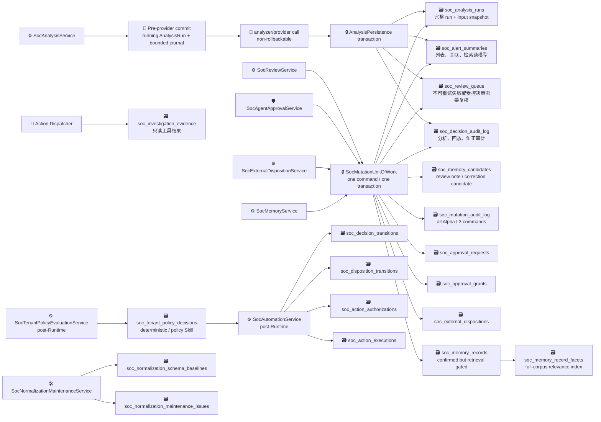
```mermaid
flowchart LR
    A["⚙️ SocAnalysisService"] --> PJ["📝 Pre-provider commit<br/>running AnalysisRun + bounded journal"]
    PJ --> LLM["🧠 analyzer/provider call<br/>non-rollbackable"]
    LLM --> TX["🔒 AnalysisPersistence transaction"]
    TX --> B["🗃️ soc_analysis_runs<br/>完整 run + input snapshot"]
    TX --> C["🗃️ soc_alert_summaries<br/>列表、关联、检索读模型"]
    TX --> D["🗃️ soc_review_queue<br/>不可重试失败或受控决策需要复核"]
    TX --> E["🗃️ soc_decision_audit_log<br/>分析、回放、纠正审计"]

    F["⚙️ SocReviewService"] --> MTX["🔒 SocMutationUnitOfWork<br/>one command / one transaction"]
    MTX --> D
    MTX --> B
    MTX --> C
    MTX --> E
    MTX --> G["🗃️ soc_memory_candidates<br/>review note / correction candidate"]
    MTX --> MA["🗃️ soc_mutation_audit_log<br/>all Alpha L3 commands"]

    H["🧰 Action Dispatcher"] --> I["🗃️ soc_investigation_evidence<br/>只读工具结果"]
    J["🛡️ SocAgentApprovalService"] --> MTX
    MTX --> K["🗃️ soc_approval_requests"]
    MTX --> L["🗃️ soc_approval_grants"]
    M["⚙️ SocExternalDispositionService"] --> MTX
    MTX --> N["🗃️ soc_external_dispositions"]
    O["⚙️ SocMemoryService"] --> MTX
    MTX --> P["🗃️ soc_memory_records<br/>confirmed but retrieval gated"]
    P --> PF["🗃️ soc_memory_record_facets<br/>full-corpus relevance index"]
    TP["⚙️ SocTenantPolicyEvaluationService<br/>post-Runtime"] --> TPD["🗃️ soc_tenant_policy_decisions<br/>deterministic / policy Skill"]
    TPD --> AT
    AT["⚙️ SocAutomationService<br/>post-Runtime"] --> DT["🗃️ soc_decision_transitions"]
    AT --> DS["🗃️ soc_disposition_transitions"]
    AT --> AA["🗃️ soc_action_authorizations"]
    AT --> AX["🗃️ soc_action_executions"]
    Q["🛠️ SocNormalizationMaintenanceService"] --> R["🗃️ soc_normalization_schema_baselines"]
    Q --> S["🗃️ soc_normalization_maintenance_issues"]
```

每张表的职责：

| Store | What It Stores | 中文职责 |
|---|---|---|
| `soc_analysis_runs` | Full analysis run | 保存完整 run、input payload/hash、pipeline trace、decision、corrections |
| `soc_alert_summaries` | Query-friendly read model | 面向列表、关联、相似检索和 ReviewQueue 的轻量摘要 |
| `soc_review_queue` | Human review queue | 分析师复核入口；close 不等于改判 |
| `soc_decision_audit_log` | Decision audit records | analyze/replay/correct/external disposition 的审计链 |
| `soc_mutation_audit_log` | L3 mutation audit records | correction、close/note、memory review/retrieval activation、approval 和 external disposition 的 actor/provenance/reason/idempotency/result 追加式审计；不保存原始敏感 payload |
| `soc_investigation_evidence` | Read-only action results | 资产归属、威胁情报、安全标签、软件路径等只读调查结果；不包含已删除的外部 EDR/HIDS 查询 mock |
| `soc_external_dispositions` | External ticket feedback | Zeus/ITSM/SOAR 外部状态、理由、映射和同步结果 |
| `soc_disposition_proposals` | Shadow operational proposals | 保存 true-positive + exact authorization 产生的未应用处置建议 |
| `soc_disposition_sample_manifests` | Reproducible QA samples | 保存 scope/population/seed hash/selected proposal ids，防止人工挑样 |
| `soc_disposition_outcomes` | Append-only evaluation labels | 保存 primary/sample 结构化结论和 supersession lineage，不改 queue/verdict |
| `soc_memory_candidates` | Reviewable knowledge proposals | 候选记忆，默认 `pending_review`，不影响 runtime decision |
| `soc_memory_records` | Confirmed memory records | 已确认记忆，默认不可检索；符合 activation/有效期/复核条件后可进入 `M-*`；普通文本只作推理上下文，可选 typed directive 受额外 gate 约束 |
| `soc_memory_record_facets` | Memory relevance index | normalized exact facet 倒排索引；先跨完整 eligible corpus 召回，再进入 bounded scoring/top-K |
| `soc_tenant_policy_decisions` | Tenant operational decisions | 保存确定性规则或 policy Skill 的独立决策、E/R/context 引用及 model/prompt/Skill provenance；不改技术检测真值 |
| `soc_decision_transitions` | Four-stage effective lineage | 保存 Base/Memory/Tenant/Effective、before/after、最终 disposition、贡献者与 policy hash |
| `soc_disposition_transitions` | Operational disposition lineage | shadow 为 proposed，enforced 为 applied；不覆盖 detection truth |
| `soc_action_authorizations` | Independent action authority | 保存 human/automatic mode、exact target/adapter、原因、有效期和 selected rule；Memory 可有可无 |
| `soc_action_executions` | External attempts | 保存 attempt、稳定幂等键、external request ID、前后状态以及 retryable/terminal/skipped 结果 |
| `soc_approval_requests` | Approval request lifecycle | 高风险动作审批 inbox；保存 pending/approved/rejected/expired 终态和处理元数据 |
| `soc_approval_grants` | One-time approval grants | 一次性授权 token，当前 execute boundary 不执行生产副作用 |
| `soc_normalization_schema_baselines` | Approved parser fingerprints | 人工批准的 tenant/source/adapter/parser/version 基线；新版本 supersede 旧版本 |
| `soc_normalization_maintenance_issues` | Parser/mapping maintenance queue | 去重保存 missing/novel/degraded/unsupported/gap/truncation，记录出现次数和处理状态 |

## 4. Review Context Assembly / 调查上下文聚合

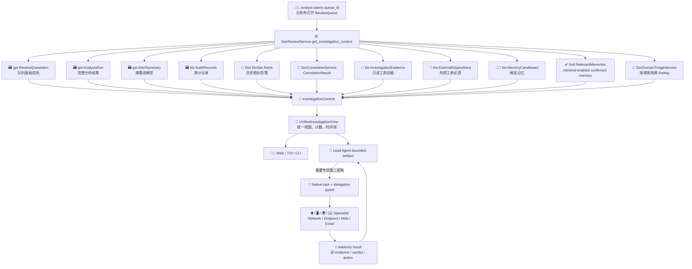
```mermaid
flowchart TD
    A["🧑‍💻 Analyst opens queue_id<br/>分析师打开 ReviewQueue"] --> B["⚙️ SocReviewService.get_investigation_context"]

    B --> C["🗃️ get ReviewQueueItem<br/>队列基础信息"]
    B --> D["🗃️ get AnalysisRun<br/>完整分析结果"]
    B --> E["🗃️ get AlertSummary<br/>摘要读模型"]
    B --> F["🗃️ list AuditRecords<br/>审计记录"]
    B --> G["🔎 find Similar Alerts<br/>历史相似告警"]
    B --> H["🔎 SocCorrelationService<br/>CorrelationResult"]
    B --> I["🧰 list InvestigationEvidence<br/>只读工具证据"]
    B --> J["🧾 list ExternalDispositions<br/>外部工单反馈"]
    B --> K["🧠📌 list MemoryCandidates<br/>候选记忆"]
    B --> L["✅ find RelevantMemories<br/>retrieval-enabled confirmed memory"]
    B --> M["🧩 SocDomainTriageService<br/>领域和场景 finding"]

    C --> N["🔎 InvestigationContext"]
    D --> N
    E --> N
    F --> N
    G --> N
    H --> N
    I --> N
    J --> N
    K --> N
    L --> N
    M --> N

    N --> O["🔎 UnifiedInvestigationView<br/>统一视图、计数、时间线"]
    O --> P["🧑‍💻 Web / TUI / CLI"]
    O --> Q["🧠 Lead Agent bounded artifact"]
    Q -->|"需要专项第二视角"| R["🧰 Native task + delegation guard"]
    R --> S["🌐 / 🖥️ / 🌍 / ✉️ Specialist<br/>Network / Endpoint / Web / Email"]
    S --> T["📄 Advisory result<br/>非 evidence / verdict / action"]
    T --> Q
```

`InvestigationContext` 是分析师打开一个 queue item 时的核心只读视图。它不是新的 source of truth，而是把已有数据组合起来：

| Context Field | English | 中文说明 |
|---|---|---|
| `queue_item` | Review task | 复核队列项，含 status、priority、rule、summary |
| `run` | Full analysis run | 完整 pipeline trace、entities、analysis、decision、corrections |
| `summary` | Alert summary | 面向列表和相似检索的摘要 |
| `audit_records` | Audit trail | 分析、回放、纠正、外部同步审计 |
| `similar_alerts` | Simple similarity matches | 轻量历史相似告警 |
| `correlation_result` | Structured correlation | 相似告警、匹配原因、可复用 evidence |
| `action_evidence` | Tool evidence | 只读工具/MCP 结果 |
| `authorization_enrichments` | Authorization snapshots | 事件时间确定性授权匹配快照，shadow/no-impact |
| `disposition_proposals` | Shadow proposals | 未应用、需人工复核的运营处置建议 |
| `disposition_outcomes` | Evaluation labels | 结构化 primary/sample outcome，只用于评测 |
| `external_dispositions` | External feedback | Zeus/ITSM/SOAR 状态和理由 |
| `memory_candidates` | Reviewable proposals | 待评审候选记忆 |
| `relevant_memories` | Retrieval-gated memories | confirmed 且 activation policy/有效期/复核期均有效的记忆；直接布尔开关无效 |
| `domain_triage_results` | Domain/scenario findings | APT/EDR/HIDS/通用场景发现 |
| `investigation_view` | Unified view | 面向 Web/TUI/Lead Agent 的统一时间线和计数 |

Lead Agent 委派不会新建 Runtime 分支或新的事实表。服务端从上述同一
`InvestigationContext` 构造专家投影，过滤为对应 domain 的 Skill guidance，然后通过 DeerFlow
原生 `task` 事件返回 advisory text。专家文本只帮助 Lead Agent 组织复核；不持久化为
`InvestigationEvidence`，不覆盖 Runtime decision，不确认 memory，也不发放 approval/action。

### 4.1 Main Orchestrator Correlation Bridge / 主编排历史关联

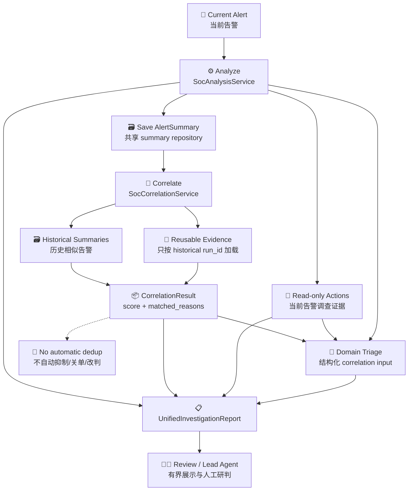
```mermaid
flowchart TD
    A["🧾 Current Alert<br/>当前告警"] --> B["⚙️ Analyze<br/>SocAnalysisService"]
    B --> C["🗃️ Save AlertSummary<br/>共享 summary repository"]
    C --> D["🔎 Correlate<br/>SocCorrelationService"]
    D --> E["🗃️ Historical Summaries<br/>历史相似告警"]
    D --> F["🧰 Reusable Evidence<br/>只按 historical run_id 加载"]
    E --> G["📦 CorrelationResult<br/>score + matched_reasons"]
    F --> G

    B --> H["🧰 Read-only Actions<br/>当前告警调查证据"]
    G --> I["🧩 Domain Triage<br/>结构化 correlation input"]
    H --> I
    B --> I

    B --> J["📋 UnifiedInvestigationReport"]
    G --> J
    H --> J
    I --> J
    J --> K["🧑‍💻 Review / Lead Agent<br/>有界展示与人工研判"]

    G -.-> L["🚫 No automatic dedup<br/>不自动抑制/关单/改判"]
```

1. `SocAnalysisService` 和 `SocCorrelationService` 共用同一个 `AlertSummaryRepository`；主编排器
   不直接查库。
2. `CorrelationResult` 是 `UnifiedInvestigationReport` 和 `SocDomainTriageRequest` 的显式 typed field；
   metadata 中的 count 只是展示投影。
3. 历史 evidence 只按 matched historical `run_id` 读取。即使历史与当前告警复用同一个
   `alert_id`，也不会把当前 action evidence 混入历史 match。
4. Domain finding 可以说明命中了多少历史告警、引用哪些历史 evidence；Runtime `Decision`、
   ReviewQueue、memory、approval 和 response action 均保持不变。
5. `soc eval pingan-main --pretty` 会为 APT/EDR/HIDS 各先生成一条本地历史 run，再运行当前告警，
   用于验证这条完整只读链路；其中 action provider 仍是 mock，不代表 PA-12 真实系统接入。

### 4.2 Correlation Evaluation Boundary / 关联评测边界

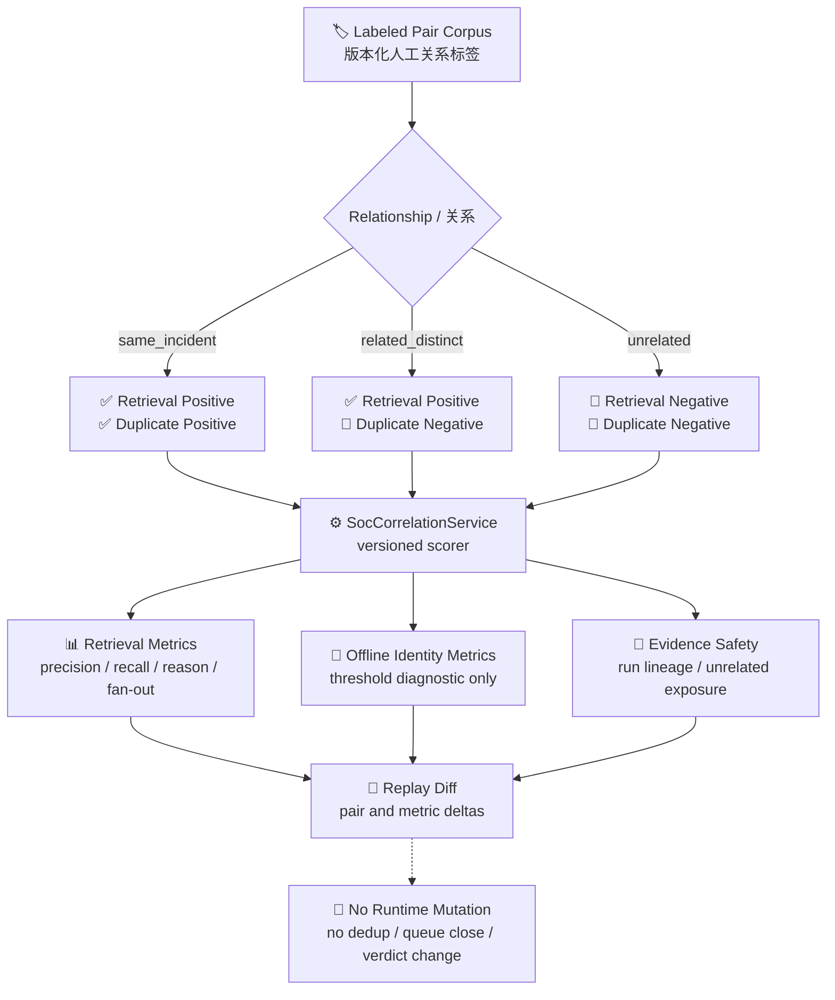
```mermaid
flowchart TD
    A["🏷️ Labeled Pair Corpus<br/>版本化人工关系标签"] --> B{"Relationship / 关系"}
    B -->|same_incident| C["✅ Retrieval Positive<br/>✅ Duplicate Positive"]
    B -->|related_distinct| D["✅ Retrieval Positive<br/>🚫 Duplicate Negative"]
    B -->|unrelated| E["🚫 Retrieval Negative<br/>🚫 Duplicate Negative"]

    C --> F["⚙️ SocCorrelationService<br/>versioned scorer"]
    D --> F
    E --> F
    F --> G["📊 Retrieval Metrics<br/>precision / recall / reason / fan-out"]
    F --> H["🧬 Offline Identity Metrics<br/>threshold diagnostic only"]
    F --> I["🧰 Evidence Safety<br/>run lineage / unrelated exposure"]
    G --> J["🔁 Replay Diff<br/>pair and metric deltas"]
    H --> J
    I --> J
    J -.-> K["🚫 No Runtime Mutation<br/>no dedup / queue close / verdict change"]
```

1. `CorrelationResult.scoring_policy_version` 记录实际评分语义；fixture 版本与 scorer 版本不一致时
   fail-fast，不能拿旧标签报告解释新规则。
2. `same_incident` 与 `related_distinct` 对检索都是正样本，但只有前者对 duplicate identity 是正样本；
   “相似”不能直接推出“可以合并”。
3. `evidence_lineage_leakage_count` 检查 evidence 是否来自错误 `run_id`；
   `unrelated_evidence_exposure_count` 单独统计无关候选被召回后带出的语义噪声。
4. `soc eval correlation --baseline-json PRIOR.json` 忽略生成时间，比较 pair、指标、reason、fan-out 和
   evidence 变化；当前 `shadow_dedup_allowed=false`，报告不写业务库、不抑制告警。

## 5. Domain and Scenario Triage / 领域与场景研判

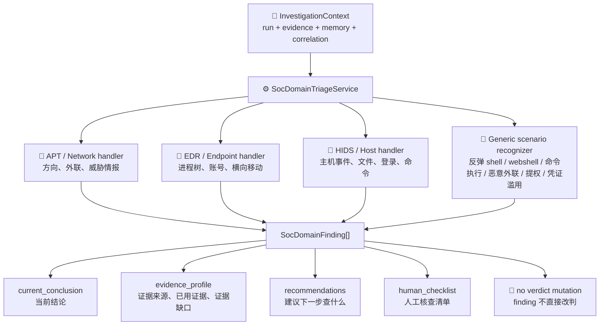
```mermaid
flowchart TD
    A["🔎 InvestigationContext<br/>run + evidence + memory + correlation"] --> B["⚙️ SocDomainTriageService"]
    B --> C["🧩 APT / Network handler<br/>方向、外联、威胁情报"]
    B --> D["🧩 EDR / Endpoint handler<br/>进程树、账号、横向移动"]
    B --> E["🧩 HIDS / Host handler<br/>主机事件、文件、登录、命令"]
    B --> F["🧩 Generic scenario recognizer<br/>反弹 shell / webshell / 命令执行 / 恶意外联 / 提权 / 凭证滥用"]

    C --> G["SocDomainFinding[]"]
    D --> G
    E --> G
    F --> G

    G --> H["current_conclusion<br/>当前结论"]
    G --> I["evidence_profile<br/>证据来源、已用证据、证据缺口"]
    G --> J["recommendations<br/>建议下一步查什么"]
    G --> K["human_checklist<br/>人工核查清单"]
    G --> L["🚫 no verdict mutation<br/>finding 不直接改判"]
```

Domain finding 的作用：

| Output | What It Means | 中文说明 |
|---|---|---|
| `scenario_key` | Recognized security scenario | 识别到的安全场景，如 `execution.reverse_shell`、`network.malicious_outbound` |
| `vendor_scenarios` | Upstream scenario hints | 上游厂商给出的场景提示；内部 taxonomy 未命中时可记录为 `vendor.unmapped` |
| `disposition` | Finding-level assessment | 领域 finding 层面的倾向，不是最终 operational verdict |
| `confidence` | Finding confidence | 场景判断置信度 |
| `evidence_profile.sources` | Available evidence | raw/canonical alert、similar alerts、external feedback、memory、read-only evidence |
| `evidence_profile.gaps` | Missing evidence | 当前缺少什么证据，例如威胁情报、进程树、资产归属 |
| `current_conclusion` | Current best conclusion | 即使证据不足，也给出带置信度和边界的当前结论 |
| `recommendations` | What to check next | 下一步查什么工具、看什么历史、找谁复核 |
| `human_checklist` | Manual checklist | 运营同事可执行的人工核查项 |

## 6. Lead Agent and Tool Boundary / Lead Agent 与工具边界

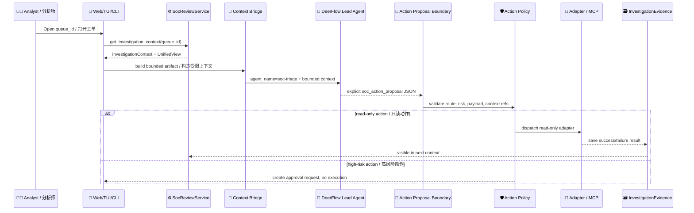
```mermaid
sequenceDiagram
    participant Analyst as 🧑‍💻 Analyst / 分析师
    participant TUI as 🚪 Web/TUI/CLI
    participant Review as ⚙️ SocReviewService
    participant Bridge as 🔎 Context Bridge
    participant Lead as 🧠 DeerFlow Lead Agent
    participant Proposal as 🧾 Action Proposal Boundary
    participant Policy as 🛡️ Action Policy
    participant Adapter as 🧰 Adapter / MCP
    participant Evidence as 🗃️ InvestigationEvidence

    Analyst->>TUI: Open queue_id / 打开工单
    TUI->>Review: get_investigation_context(queue_id)
    Review-->>TUI: InvestigationContext + UnifiedView
    TUI->>Bridge: build bounded artifact / 构造受限上下文
    Bridge->>Lead: agent_name=soc-triage + bounded context
    Lead-->>Proposal: explicit soc_action_proposal JSON
    Proposal->>Policy: validate route, risk, payload, context refs
    alt read-only action / 只读动作
        Policy->>Adapter: dispatch read-only adapter
        Adapter-->>Evidence: save success/failure result
        Evidence-->>Review: visible in next context
    else high-risk action / 高风险动作
        Policy-->>TUI: create approval request, no execution
    end
```

当前支持的只读工具链：

| Route / Action | Type | What It Does | 中文说明 |
|---|---|---|---|
| `asset.lookup` | read-only | Look up asset metadata | 查询资产记录 |
| `asset.locate` | production-shaped MCP; real smoke parked | Locate owner/BU/environment | 定位资产归属、BU、环境；真实内网验收暂存 |
| `threat_intel.ip_reputation.lookup` | production-shaped PingAn MCP; real smoke pending | Fetch bounded IP reputation | 查询 IP 情报、时效和来源链；结果只作为调查证据 |
| `security_tag.lookup` | production-shaped PingAn MCP; real smoke pending | Fetch bounded security tags | 查询 active/expired/inactive/conflicted/unknown 标签；只形成调查证据，不创建授权事实 |

进程树、命令行、登录上下文和主机事件直接来自告警原生证据，经 Normalizer、Fact Reconstruction 和 bounded evidence 进入研判；当前不存在额外 EDR/HIDS 查询 action。

Tool boundary / 工具边界：

- Lead Agent 不能直接调用 repository。
- Lead Agent 不能直接执行 MCP/tool。
- Lead Agent 只能输出显式 action proposal。
- Read-only proposal 必须经过 policy、dispatcher、adapter registry。
- Tool result 只能写 `InvestigationEvidence`。
- Evidence 进入下一轮 `InvestigationContext`，不能直接改 verdict。

## 7. Approval Flow / 审批流

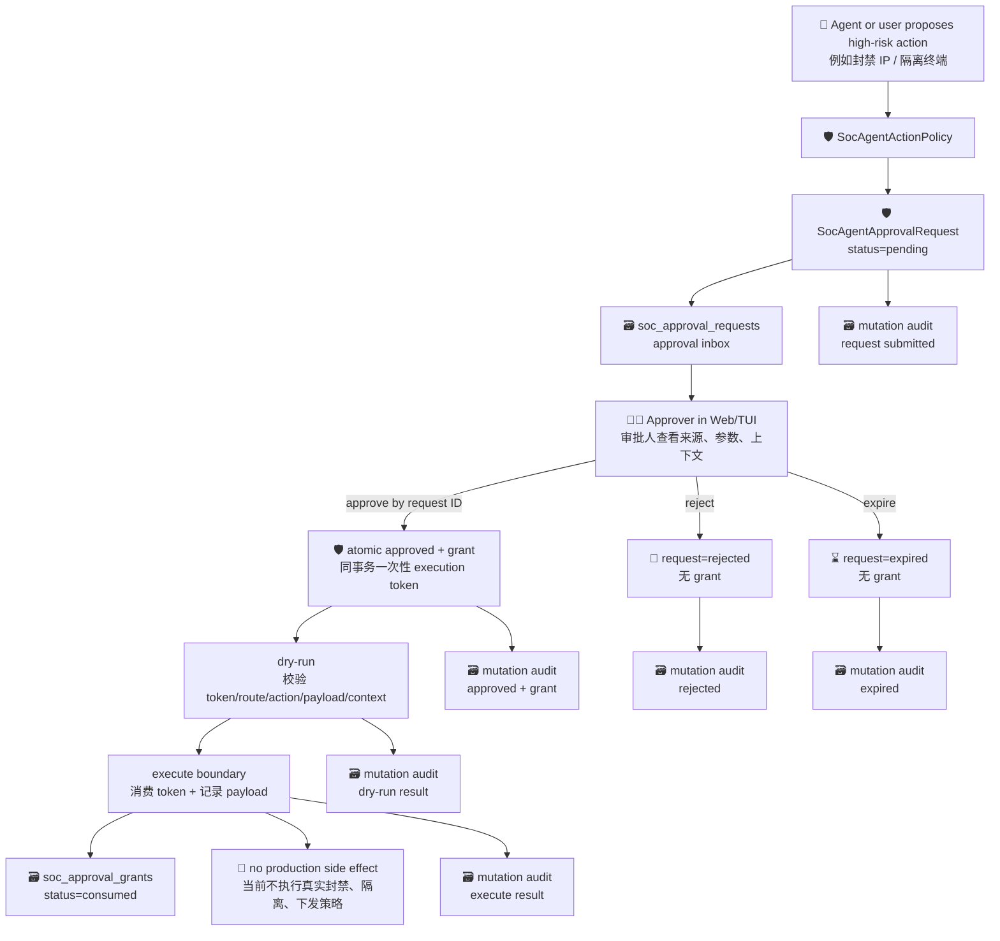
```mermaid
flowchart TD
    A["🧠 Agent or user proposes high-risk action<br/>例如封禁 IP / 隔离终端"] --> B["🛡️ SocAgentActionPolicy"]
    B --> C["🛡️ SocAgentApprovalRequest<br/>status=pending"]
    C --> D["🗃️ soc_approval_requests<br/>approval inbox"]
    D --> E["🧑‍💻 Approver in Web/TUI<br/>审批人查看来源、参数、上下文"]
    E -->|"approve by request ID"| F["🛡️ atomic approved + grant<br/>同事务一次性 execution token"]
    E -->|reject| R["🚫 request=rejected<br/>无 grant"]
    E -->|expire| X["⌛ request=expired<br/>无 grant"]
    F --> G["dry-run<br/>校验 token/route/action/payload/context"]
    G --> H["execute boundary<br/>消费 token + 记录 payload"]
    H --> I["🗃️ soc_approval_grants<br/>status=consumed"]
    H --> J["🚫 no production side effect<br/>当前不执行真实封禁、隔离、下发策略"]
    C --> A1["🗃️ mutation audit<br/>request submitted"]
    F --> A2["🗃️ mutation audit<br/>approved + grant"]
    R --> A3["🗃️ mutation audit<br/>rejected"]
    X --> A4["🗃️ mutation audit<br/>expired"]
    G --> A5["🗃️ mutation audit<br/>dry-run result"]
    H --> A6["🗃️ mutation audit<br/>execute result"]
```

Approval flow 当前做什么：

1. 高风险 proposal 不会直接执行。
2. 系统把 proposal 转成 `SocAgentApprovalRequest`。
3. Web/TUI/CLI 审批面只展示 repository 中的 request；grant command 只提交 request ID、理由和有效期，不回传可篡改的完整 request。
4. 审批人可 approve/reject/expire；approve 在同一事务把 request 变成 `approved` 并创建最多一个 `SocAgentApprovalGrant`，另外两个终态不创建 grant。
5. 完全相同的终态重试返回原结果；伪造、过时或改变理由/幂等键/有效期的重试会被拒绝。
6. dry-run 只验证 token、route、payload、上下文和 adapter 支持情况。
7. execute boundary 当前只消费 token并写执行边界记录。
8. 当前不会对生产系统产生外部副作用；每个 request/resolve/dry-run/execute 命令都和追加式
   `SocMutationAuditRecord` 在同一事务提交，审计不保存原始 action payload 或 secret。

### 7.1 Automatic Policy Flow / 自动策略流

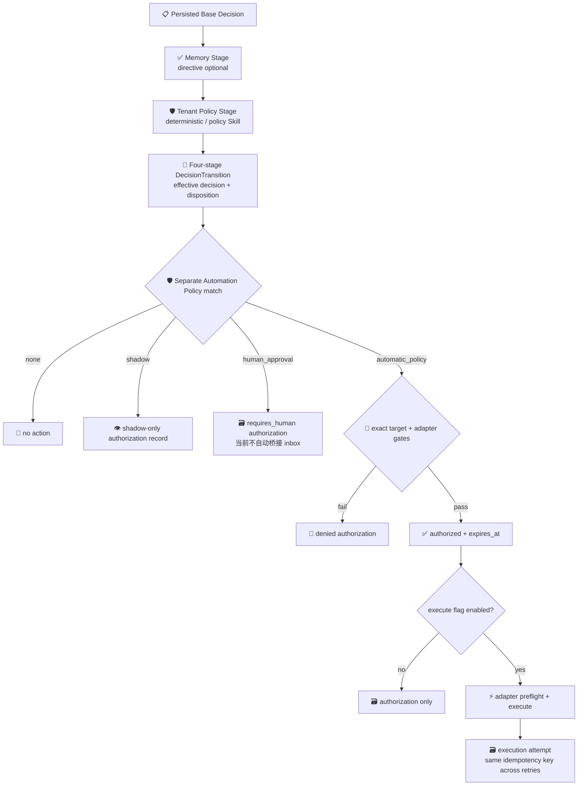
```mermaid
flowchart TD
    A["📋 Persisted Base Decision"] --> M["✅ Memory Stage<br/>directive optional"]
    M --> T["🛡️ Tenant Policy Stage<br/>deterministic / policy Skill"]
    T --> B["🔁 Four-stage DecisionTransition<br/>effective decision + disposition"]
    B --> C{"🛡️ Separate Automation Policy match"}
    C -->|"none"| N["🚫 no action"]
    C -->|"shadow"| S["👁️ shadow-only authorization record"]
    C -->|"human_approval"| H["🗃️ requires_human authorization<br/>当前不自动桥接 inbox"]
    C -->|"automatic_policy"| U{"🔐 exact target + adapter gates"}
    U -->|"fail"| D["🚫 denied authorization"]
    U -->|"pass"| E["✅ authorized + expires_at"]
    E --> F{"execute flag enabled?"}
    F -->|"no"| G["🗃️ authorization only"]
    F -->|"yes"| X["⚡ adapter preflight + execute"]
    X --> R["🗃️ execution attempt<br/>same idempotency key across retries"]
```

- 该路径是 persisted analysis 的 default-off post-analysis observer，不属于十步 Runtime。
- `human_approval` 当前只形成 `requires_human` authorization record，尚未自动创建现有 Approval Inbox
  request；不能把两张表当成已经打通。
- `automatic_policy` 不要求 Memory。若 effective decision 仍 `needs_review=true`，规则必须显式匹配并
  填写 `review_required_override_reason`；ReviewQueue 保留。
- Tenant Policy 可以单独输出运营 disposition，但不具备 action authority。缺少
  `SOC_AUTOMATION_POLICY_PATH` 时四阶段 lineage 仍会保存，authorization/execution 必须为 0。
- 自动规则还必须锁定 model、Prompt 和 Decision Policy 版本；replay 只重算留痕，固定拒绝外部自动动作。
- Memory override 冲突时不选择任何 rule。目标缺失、policy/env/tenant/validity 不符、adapter 未注册或
  不具备 execute/write-or-destructive/idempotency contract 时都 fail closed。
- 当前真实 write/destructive adapter、生产 owner approval 和 rollback evidence 仍 data-gated；本地可执行
  adapter 只证明合同、幂等和 lineage。

## 8. External Disposition Sync / 外部处置反馈流

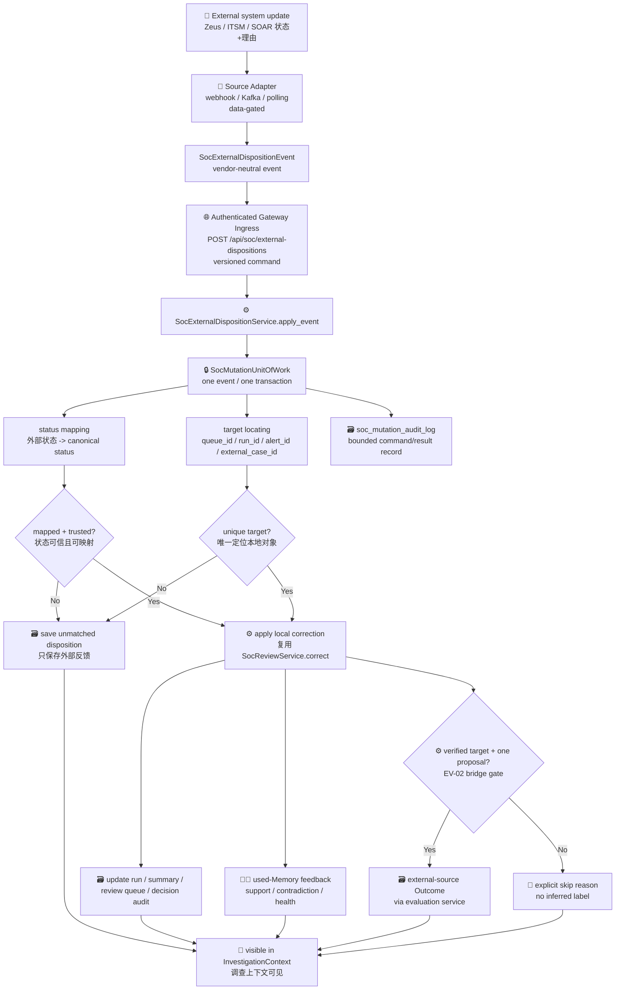
```mermaid
flowchart TD
    A["🧾 External system update<br/>Zeus / ITSM / SOAR 状态+理由"] --> B["🔌 Source Adapter<br/>webhook / Kafka / polling<br/>data-gated"]
    B --> C["SocExternalDispositionEvent<br/>vendor-neutral event"]
    C --> C1["🌐 Authenticated Gateway Ingress<br/>POST /api/soc/external-dispositions<br/>versioned command"]
    C1 --> D["⚙️ SocExternalDispositionService.apply_event"]
    D --> TX["🔒 SocMutationUnitOfWork<br/>one event / one transaction"]
    TX --> E["status mapping<br/>外部状态 -> canonical status"]
    TX --> F["target locating<br/>queue_id / run_id / alert_id / external_case_id"]

    E --> G{"mapped + trusted?<br/>状态可信且可映射"}
    F --> H{"unique target?<br/>唯一定位本地对象"}

    G -->|No| I["🗃️ save unmatched disposition<br/>只保存外部反馈"]
    H -->|No| I
    G -->|Yes| J["⚙️ apply local correction<br/>复用 SocReviewService.correct"]
    H -->|Yes| J

    J --> K["🗃️ update run / summary / review queue / decision audit"]
    J --> L["🧠📌 used-Memory feedback<br/>support / contradiction / health"]
    J --> N{"⚙️ verified target + one proposal?<br/>EV-02 bridge gate"}
    N -->|Yes| O["🗃️ external-source Outcome<br/>via evaluation service"]
    N -->|No| P["🔎 explicit skip reason<br/>no inferred label"]
    TX --> A1["🗃️ soc_mutation_audit_log<br/>bounded command/result record"]
    I --> M["🔎 visible in InvestigationContext<br/>调查上下文可见"]
    K --> M
    L --> M
    O --> M
    P --> M
```

External disposition 的意义：

- 外部系统仍可能是分析师的实际工作台。
- 当前已接通的是 authenticated canonical Gateway ingress；真实 Zeus/ITSM/SOAR source adapter、
  endpoint、签名和凭证仍是 data-gated，不得把 sample fixture 当作真实上游接入。
- command 必须携带 stable `source_event_id`。Gateway 与 core service 同时执行角色边界；exact retry
  返回同一逻辑结果，使用同一语义 identity 提交不同内容会冲突。
- 外部状态和理由需要回流本系统，保证 ReviewQueue、memory、audit 不脱节。
- 外部 reason 不逐事件创建 Memory candidate，也不能直接成为 confirmed Memory；它只反馈给该 run
  实际命中的 Memory。新经验必须由人工显式 promotion 或 repeated-pattern quality gate 提出。
- 外部 correction 必须复用 `SocReviewService.correct()`，避免两套改判逻辑。
- 未映射、低可信、无法唯一定位的事件只保存，不改判。
- EV-02 outcome bridge 还要求唯一 matching proposal，并复用 `SocDispositionEvaluationService`；bridge
  不从 external reason 猜 canonical status，不会覆盖较新的 analyst/replay primary outcome。
- External correction/queue sync 与 shadow outcome capture 是两条独立审计边界；后者不应用 proposal，
  不改变 ReviewQueue，仍保持 `auto_close_allowed=false`。
- 同一 external event 产生的 local correction、summary/queue、used-Memory feedback、external record、eligible
  outcome 和两类 audit 属于一个数据库事务；任一步失败全部回滚，`SocEvent` 只在成功提交后发出。

## 9. Memory Candidate and Confirmed Memory / 记忆候选与确认记忆

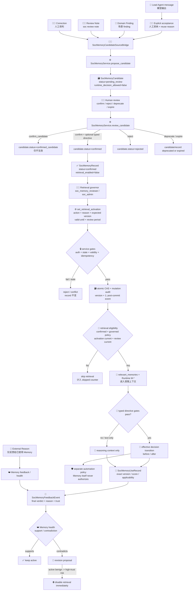
```mermaid
flowchart TD
    A["🧑‍💻 Correction<br/>人工改判"] --> B["🧠📌 SocMemoryCandidateSourceBridge"]
    C["🧑‍💻 Review Note<br/>soc review note"] --> B
    D["🧩 Domain Finding<br/>场景 finding"] --> B
    E["🧾 External Reason<br/>仅反馈给已使用 Memory"] --> EF["❤️ Memory feedback / health"]
    A0["🧠 Lead Agent message<br/>模型输出"] --> A1["🧑‍💻 Explicit acceptance<br/>人工采纳 + reuse reason"]
    A1 --> B

    B --> F["⚙️ SocMemoryService.propose_candidate"]
    F --> G["🗃️ SocMemoryCandidate<br/>status=pending_review<br/>runtime_decision_allowed=false"]

    G --> H["🧑‍💻 Human review<br/>confirm / reject / deprecate / expire"]
    H --> I["⚙️ SocMemoryService.review_candidate"]

    I -->|confirm_candidate| J["candidate.status=confirmed_candidate<br/>仍不生效"]
    I -->|"confirm + optional typed directive"| K["candidate.status=confirmed"]
    K --> L["✅ SocMemoryRecord<br/>status=confirmed<br/>retrieval_enabled=false"]
    I -->|reject| M["candidate.status=rejected"]
    I -->|deprecate / expire| N["candidate/record deprecated or expired"]

    L --> O["🧑‍⚖️ Retrieval governor<br/>soc_memory_reviewer / soc_admin"]
    O --> T["⚙️ set_retrieval_activation<br/>action + reason + expected version<br/>valid-until + review period"]
    T --> U{"🔒 service gates<br/>auth + state + validity + idempotency"}
    U -->|"fail / stale"| P["reject / conflict<br/>record 不变"]
    U -->|"pass"| V["🗃️ atomic CAS + mutation audit<br/>version + 1; post-commit event"]
    V --> W{"🔎 retrieval eligibility<br/>confirmed + governed policy<br/>activation current + review current"}
    W -->|No| X["skip retrieval<br/>计入 skipped counter"]
    W -->|Yes| Q["🔎 relevant_memories + Runtime M-*<br/>进入受限上下文"]
    Q --> R{"📎 typed directive gates pass?"}
    R -->|"no / text only"| R0["🧠 reasoning context only"]
    R -->|"yes"| R1["🔁 effective decision transition<br/>before / after"]
    R1 --> R2["🛡️ separate automation policy<br/>Memory itself never authorizes"]
    R0 --> UR["🧾 SocMemoryUseRecord<br/>exact version / score / applicability"]
    R1 --> UR
    EF --> FB["🧾 SocMemoryFeedbackEvent<br/>final verdict + reason + trust"]
    UR --> FB
    FB --> MH{"❤️ Memory health<br/>support / contradiction"}
    MH -->|"supports"| KEEP["✅ keep active"]
    MH -->|"contradicts"| REV["📝 revision proposal"]
    REV -->|"active benign -> high-trust risk"| STOP["⛔ disable retrieval immediately"]
```

Memory 规则：

| Source | Candidate Type | Default State | Boundary |
|---|---|---|---|
| `soc correct --promote-to-memory` | correction lesson | `pending_review` | 普通改判只反馈/观察；显式提升且通过 Admission 才产生候选 |
| `soc review note` | analyst observation | `pending_review` | 备注只形成候选记忆，不改 queue status，不改 verdict |
| accepted Lead Agent conclusion | analyst-owned detection lesson | `pending_review` | CLI/TUI 保存 captured lineage；Web 由 Gateway 从当前 checkpoint 解析原文，客户端不能提交正文 |
| domain finding | scenario lesson | `pending_review` | finding 可沉淀为经验，但必须显式调用 bridge |
| external reason | used-Memory outcome feedback | append-only | 不逐事件建候选；support/contradiction 更新 health，危险反证可暂停 retrieval |
| confirmed candidate | memory record | `confirmed`, `retrieval_enabled=false` | 默认仍不被检索；不能由 repository/demo 直接改布尔值 |
| governed activation | retrieval state transition | `enabled` or `disabled`, version incremented | 只能经 `SocMemoryService`；enable 必须有角色、理由、有效期、复核期、expected version 和幂等键 |
| reviewed typed directive | effective decision input | optional on `confirm` | exact version/score/required facets 全部通过才 reinforce/override；自由文本不自动生成，且不授权动作 |

Retrieval 的最终筛选不是只看一个布尔值，也不是只看最新 200 条。SQL 先通过 normalized facet index
跨完整 eligible corpus 召回候选，再进入评分和 top-K/token budget。`find_relevant_records()` 还会拒绝无治理 metadata 的
legacy/direct flag、activation 已过期、review 已逾期、record 非 confirmed 或 source validity 已过期的记录；
这些原因分别计数。`soc memory search --baseline-json` 可输出同一 query 前后新增、删除和变化的 match，
用于 activation replay/diff 审阅，但不会写库或改变 verdict。

## 10. Review Note Flow / 复核备注流

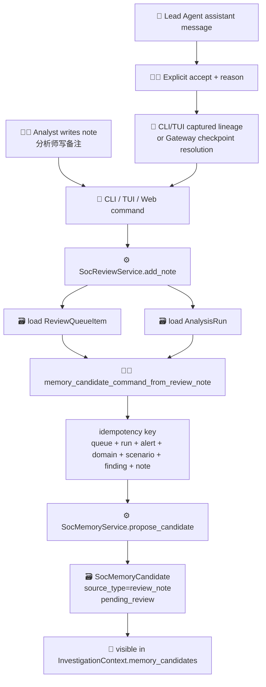
```mermaid
flowchart TD
    A["🧑‍💻 Analyst writes note<br/>分析师写备注"] --> B["🚪 CLI / TUI / Web command"]
    A0["🧠 Lead Agent assistant message"] --> A1["🧑‍💻 Explicit accept + reason"]
    A1 --> B0["🔐 CLI/TUI captured lineage<br/>or Gateway checkpoint resolution"]
    B0 --> B
    B --> C["⚙️ SocReviewService.add_note"]
    C --> D["🗃️ load ReviewQueueItem"]
    C --> E["🗃️ load AnalysisRun"]
    D --> F["🧠📌 memory_candidate_command_from_review_note"]
    E --> F
    F --> G["idempotency key<br/>queue + run + alert + domain + scenario + finding + note"]
    G --> H["⚙️ SocMemoryService.propose_candidate"]
    H --> I["🗃️ SocMemoryCandidate<br/>source_type=review_note<br/>pending_review"]
    I --> J["🔎 visible in InvestigationContext.memory_candidates"]
```

Review note 保存什么：

- 原始 note 文本。
- `queue_id`、`run_id`、`alert_id`。
- 显式采纳时额外保存 `origin`、`thread_id`、`message_id`、acceptance reason；Web 还保存 checkpoint ID
  和 assistant text SHA-256，不保存客户端声称的正文。
- 可选 `domain`、`scenario_key`、`finding_id`。
- runtime summary、runtime reason、runtime verdict。
- facets：source type、vendor/product、rule_code/rule_name、entities、scenario、domain。
- evidence refs：`review_note:*`、`review_queue:*`、`run:*`、`alert:*`、可选 `scenario:*`、`domain_finding:*`。

Review note 不做什么：

- 不关闭 ReviewQueue。
- 不修改 verdict。
- 不创建 confirmed memory。
- 不进入 prompt injection。
- 不绕过 `SocMemoryService.review_candidate()`。

## 11. Demo and Operator Commands / 演示与操作命令

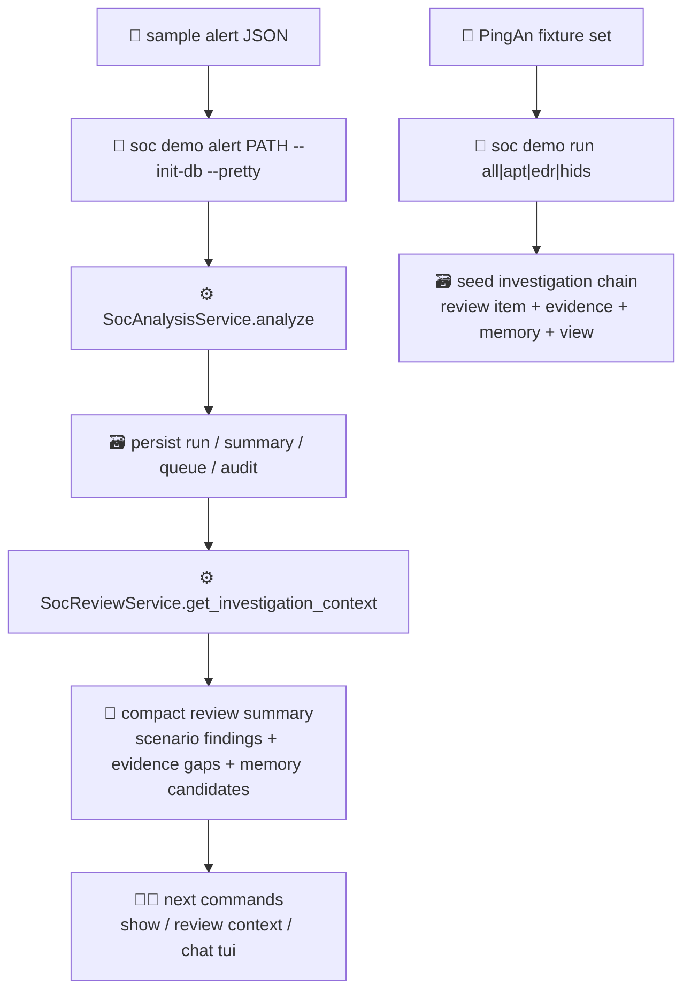
```mermaid
flowchart TD
    A["🧾 sample alert JSON"] --> B["🚪 soc demo alert PATH --init-db --pretty"]
    B --> C["⚙️ SocAnalysisService.analyze"]
    C --> D["🗃️ persist run / summary / queue / audit"]
    D --> E["⚙️ SocReviewService.get_investigation_context"]
    E --> F["🔎 compact review summary<br/>scenario findings + evidence gaps + memory candidates"]
    F --> G["🧑‍💻 next commands<br/>show / review context / chat tui"]

    H["🧾 PingAn fixture set"] --> I["🚪 soc demo run all|apt|edr|hids"]
    I --> J["🗃️ seed investigation chain<br/>review item + evidence + memory + view"]
```

Current useful commands:

```bash
# Run one alert and print review-ready summary
soc demo alert samples/alerts/pingan_legacy_apt.json --init-db --pretty

# Run one alert and create a review-note candidate
soc demo alert samples/alerts/pingan_legacy_apt.json \
  --init-db \
  --review-note "Analyst says raw message direction wins over derived fields." \
  --scenario-key network.malicious_outbound \
  --domain apt \
  --pretty

# Open compact investigation context
soc review context REV-... --summary --pretty

# Record analyst note as pending memory candidate
soc review note REV-... --note "..." --scenario-key execution.reverse_shell --domain edr --pretty

# Inspect pending candidates for a queue item
soc memory list --queue-id REV-... --pretty

# Inspect base/effective decision, disposition, authorization and execution lineage
soc automation lineage --run-id RUN-... --database-url "$SOC_DATABASE_URL" --pretty

# Open DeerFlow-aligned SOC chat entry
soc chat tui --queue-id REV-... --lead-agent

# In Lead Agent TUI, explicitly accept the latest stable assistant message
/accept-conclusion "Verified against the alert evidence and reusable for this scenario"

# Recover a stale process-lost provider call; the original run remains interrupted
soc recover RUN-... --reason "worker exited during provider call" --database-url "$SOC_DATABASE_URL" --pretty
```

Release-level Alpha acceptance is intentionally outside the ten Runtime nodes. It orchestrates the
same public paths and seals their evidence without adding another business workflow:

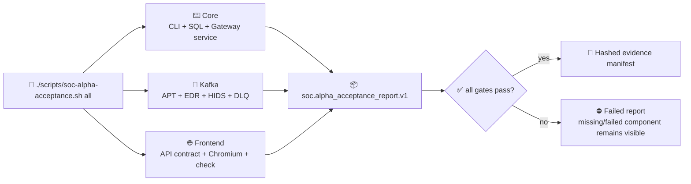
```mermaid
flowchart LR
    A["🧪 ./scripts/soc-alpha-acceptance.sh all"] --> B["⌨️ Core<br/>CLI + SQL + Gateway service"]
    A --> C["📨 Kafka<br/>APT + EDR + HIDS + DLQ"]
    A --> D["🌐 Frontend<br/>API contract + Chromium + check"]
    B --> E["📦 soc.alpha_acceptance_report.v1"]
    C --> E
    D --> E
    E --> F{"✅ all gates pass?"}
    F -->|yes| G["🔏 Hashed evidence manifest"]
    F -->|no| H["⛔ Failed report<br/>missing/failed component remains visible"]
```

The generated package lives under `backend/.deer-flow/soc-alpha-acceptance/` and is gitignored.
Fixture, mock, local SQLite/Redpanda, browser transport and production data-gated boundaries are
part of the report. See `alpha-acceptance-runbook.md`; a pass proves local/test Alpha repeatability,
not production readiness.

## 12. State Machines / 状态流转图

### 12.1 AnalysisRun / 分析运行状态

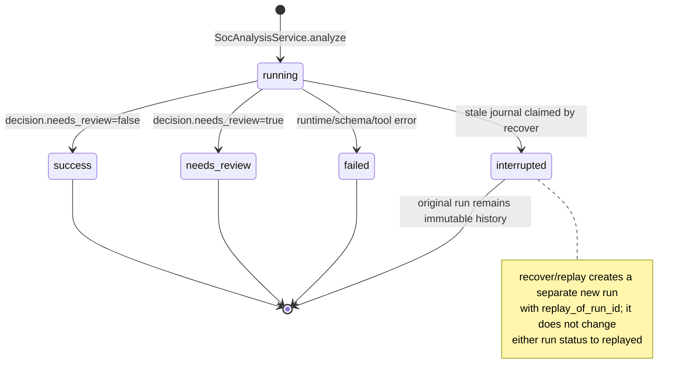
```mermaid
stateDiagram-v2
    [*] --> running: SocAnalysisService.analyze
    running --> success: decision.needs_review=false
    running --> needs_review: decision.needs_review=true
    running --> failed: runtime/schema/tool error
    running --> interrupted: stale journal claimed by recover
    interrupted --> [*]: original run remains immutable history
    success --> [*]
    needs_review --> [*]
    failed --> [*]

    note right of interrupted
      recover/replay creates a separate new run
      with replay_of_run_id; it does not change
      either run status to replayed
    end note
```

### 12.2 ReviewQueueItem / 复核队列状态

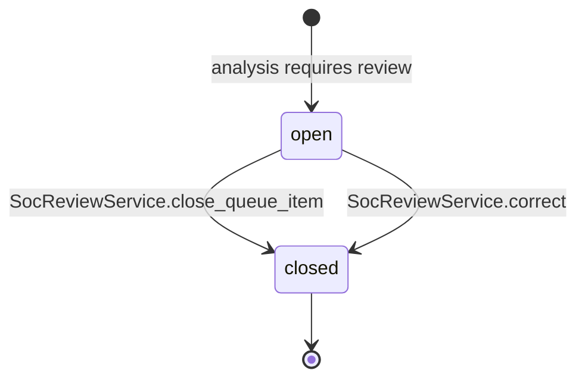
```mermaid
stateDiagram-v2
    [*] --> open: analysis requires review
    open --> closed: SocReviewService.close_queue_item
    open --> closed: SocReviewService.correct
    closed --> [*]
```

Important boundary / 重要边界：

- `close_queue_item` only marks review task done.
- `correct` changes operational decision and records `CorrectionRecord`.
- `review note` does not close queue and does not change decision.

### 12.3 MemoryCandidate / 候选记忆状态

```mermaid
stateDiagram-v2
    [*] --> pending_review: propose_candidate
    pending_review --> confirmed_candidate: confirm_candidate
    pending_review --> confirmed: confirm
    confirmed_candidate --> confirmed: confirm
    pending_review --> rejected: reject
    confirmed_candidate --> rejected: reject
    confirmed --> deprecated: deprecate
    confirmed --> expired: expire
    pending_review --> expired: expire
    confirmed_candidate --> expired: expire
```

### 12.4 Approval / 审批状态

```mermaid
stateDiagram-v2
    [*] --> request_pending: high-risk proposal
    request_pending --> request_approved: approve by stored request ID
    request_pending --> request_rejected: reject
    request_pending --> request_expired: expire
    request_approved --> grant_approved: same transaction creates one grant
    grant_approved --> dry_run_checked: dry-run
    dry_run_checked --> grant_approved: token remains reusable for execute
    grant_approved --> grant_consumed: execute boundary consumes token
    request_rejected --> [*]
    request_expired --> [*]
    grant_consumed --> [*]
```

## 13. Safety Boundaries / 安全边界总图

```mermaid
flowchart TD
    A["🧠 LLM / Lead Agent"] -->|allowed| B["suggest route / explain / propose action"]
    A -->|forbidden| C["🚫 mutate DB directly"]
    A -->|forbidden| D["🚫 execute MCP/tool directly"]
    A -->|forbidden| E["🚫 confirm memory directly"]
    A -->|forbidden| F["🚫 change verdict directly"]

    G["🧰 Read-only Tool"] -->|allowed| H["save InvestigationEvidence"]
    G -->|forbidden| I["🚫 close queue / change verdict / write confirmed memory"]

    J["🧑‍💻 Analyst"] -->|allowed| K["correct / close / note / approve"]
    K --> L["⚙️ Core Services only"]

    M["🧾 External System"] -->|allowed| N["SocExternalDispositionEvent"]
    N --> O["⚙️ SocExternalDispositionService"]
    M -->|forbidden| P["🚫 write local verdict/memory directly"]
```

The current product behavior is intentionally conservative:

- Code owns control flow.
- Services own state transitions.
- Repositories own persistence.
- LLM/Lead Agent owns bounded reasoning and suggestions.
- Human review owns high-risk confirmation and memory confirmation.
- Tool/MCP results are evidence, not verdicts.
