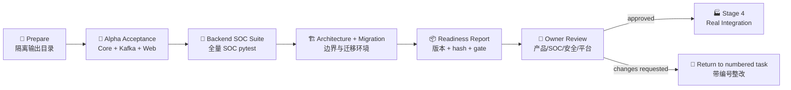

# SOC Alpha Readiness Package / Alpha 就绪评审包

Status: **Alpha Gate approved for Stage 4 integration preparation / Alpha Gate 已批准进入 Stage 4 真实集成准备**

Report schema: `soc.alpha_readiness_report.v1`

Task: `BG-03`

This is the Stage 3 exit packet. It packages existing acceptance evidence; it does not add another
capability backlog and does not turn local/test evidence into production proof. Capability status is
owned only by `audits/alpha-completeness-matrix.md`; stage order is owned only by
`delivery-roadmap.md`.

## 1. Decision / 当前结论

| Question / 问题 | Current answer / 当前答案 |
|---|---|
| Are code-controllable Alpha blockers closed? / 代码可控 Alpha 阻塞是否清零？ | **Yes**: authoritative matrix `Gap=0` |
| Is the local/test Alpha journey repeatable? / 本地测试闭环是否可重复？ | **Yes**, when the versioned acceptance and regression gates pass |
| May Stage 4 start? / 是否进入 Stage 4？ | **Yes, by recorded human decision**: integration preparation only |
| Is the system production or pilot ready? / 是否生产或试点就绪？ | **No**: real providers, infrastructure, labels, operations and response rollout remain external gates |

The machine report intentionally emits:

```json
{
  "alpha_candidate_ready": true,
  "release_decision": "pending_owner_review",
  "stage_transition_allowed": false,
  "production_ready": false
}
```

`alpha_candidate_ready=true` means only that the documented technical gates passed. A human owner
decision is a separate governance fact and must not be inferred by a script. That decision is now
recorded in [`alpha-gate-review.md`](alpha-gate-review.md); the machine report remains unchanged by
design.

## 2. One-Command Evidence / 一键证据

From the repository root:

```bash
./scripts/soc-alpha-readiness.sh all
```

The command runs, in order:



Output is isolated and gitignored:

```text
backend/.deer-flow/soc-alpha-readiness/
├── alpha-readiness-report.json
├── acceptance.log
├── soc-alpha-acceptance/
│   ├── alpha-acceptance-report.json
│   ├── core/
│   ├── kafka/
│   └── frontend/
└── tests/
    ├── backend-soc.log
    ├── backend-soc.status.json
    ├── architecture-migrations.log
    └── architecture-migrations.status.json
```

The readiness report fails closed when any required report is missing/malformed, acceptance does not
pass, a pytest command exits non-zero, no passing tests can be parsed, the authoritative matrix has a
non-zero `Gap`, or Stage 4 work packages cannot be read from the roadmap.

## 3. Evidence Contract / 证据契约

| Gate | Source | Pass condition | Claim boundary |
|---|---|---|---|
| Alpha E2E | nested `soc.alpha_acceptance_report.v1` | Core/Kafka/frontend pass with exact APT/EDR/HIDS coverage | Deterministic analyzer, local SQLite/Redpanda, mock investigation facts and browser HTTP fixture remain disclosed |
| Backend SOC regression | `tests/test_soc_*.py` | pytest exit `0`, parsed pass count greater than zero, no failures/errors | Code regression only; it is not production load or provider validation |
| Architecture/migrations | architecture boundary + persistence migration environment tests | pytest exit `0`, parsed pass count greater than zero, no failures/errors | Import and environment wiring; not a PostgreSQL backup/failover exercise |
| Completeness | authoritative 50-row matrix + SHA-256 | `Gap=0`, counts add to `Total` | Mock, Data-gated and Deferred remain visible and non-zero |
| Stage 4 handoff | delivery roadmap + SHA-256 | `PI-01..05` remain discoverable | The report references work package IDs; it does not create a second status list |

The report records the Git commit/branch and whether the working tree is clean. A technical pass from
a dirty tree is useful during development, but the release archive must be regenerated from a clean
checkout of the reviewed commit.

## 4. Alpha Scope / Alpha 可承诺范围

The current local/test Alpha can demonstrate and regress:

- strict vendor-neutral Kafka ingress with PingAn APT/EDR/HIDS adapters;
- deterministic normalization, entity extraction, fact reconstruction and bounded evidence;
- fixed Runtime control flow with explicit deterministic/live-LLM analyzer selection;
- SQL run/summary/review/audit/replay and fail-closed decision guards;
- ReviewQueue Web/TUI, bounded Lead Agent context, correction and notes;
- approval request/grant/preflight boundaries without real response side effects;
- external disposition canonical ingress, idempotency, exact-used-Memory feedback and outcome path;
- confirmed-memory review and governed read-only retrieval activation;
- correlation/domain findings and normalization/governance evaluation surfaces.

It must not be presented as proof of:

- real CMDB/EDR/HIDS/TI/security-tag or Zeus/ITSM/SOAR connectivity;
- production PostgreSQL/Kafka/K8s capacity, ACL/TLS, backup, failover or disaster recovery;
- calibrated model probability, production precision/recall or representative traffic distribution;
- automatic close, suppression, host isolation, IP blocking or attack simulation;
- Prometheus/SLO operations, worker-pool throughput or autonomous specialist Sub Agents.

The exact current categories and capability IDs remain in the completeness matrix and are embedded by
reference/hash in each readiness report.

## 5. Shared Alpha Deployment Preconditions / 共享 Alpha 部署前置

The one-command gate is local/test evidence. A shared dev/staging Alpha must not silently copy those
local defaults. Before deployment, the owner must provide and review:

| Area | Required before start | Fail-closed rule |
|---|---|---|
| Database | Dedicated PostgreSQL URL, least-privilege account, backup/restore owner and migration window | Do not use SQLite for shared staging/production |
| Kafka | Versioned input topic, consumer group, DLQ, ACL/TLS/SASL secrets and retention owner | Do not accept bare vendor alerts or enable auto commit |
| Identity | Gateway authentication plus service actors/roles and trusted `auth_source` mapping | Anonymous/unknown provenance cannot perform L3 mutation |
| Models | Explicit `SOC_ANALYZER_MODE`, registered model, budget/concurrency/timeouts and secret injection | Never silently fall back from requested live mode to stub |
| Providers | Explicit registry/MCP allowlist and evidence redaction rules | Missing real provider stays mock/data-gated; LLM cannot invent facts |
| Actions | Approval policy, adapter preflight and audited owner | Keep real side effects disabled for Alpha |
| Data | Tenant mapping, retention, redaction and replay approval | Raw alert/provider payload must not enter prompts or broad logs |

Deployment sequence for a reviewed environment:

1. Freeze an image/commit and archive a clean-checkout readiness report outside Git.
2. Back up the SOC database and record current `soc_alembic_version`.
3. Inject secrets through the deployment secret boundary; do not commit `.env` or rendered manifests.
4. Run migrations as a separate controlled job:

   ```bash
   cd backend
   python -m soc_agent.cli db upgrade --database-url "$SOC_DATABASE_URL"
   ```

5. Start Gateway/Web first and validate authenticated ReviewQueue reads and one non-destructive write.
6. Run daemon readiness without consuming a business record:

   ```bash
   sh backend/scripts/soc_daemon_healthcheck.sh
   ```

7. Start one serial daemon replica in shadow/manual-review mode. Keep high-risk external adapters
   disabled and inspect lag, DLQ, Runtime failures and ReviewQueue creation.
8. Publish only approved canary envelopes; confirm offset, idempotency, audit and replay before opening
   the full input topic.

`docker/docker-compose.soc-daemon.yaml` and `docker/k8s/soc-daemon.yaml` are opt-in templates, not
validated production manifests. Image, namespace, resource limits, broker, topics, secrets and
observability must be replaced and reviewed in `PI-02/PI-04`.

## 6. Stop and Rollback / 停止与回滚

Rollback prioritizes stopping new side effects and preserving evidence:

1. **Stop ingress first**: pause/scale down the SOC Kafka daemon; do not delete topics, offsets or DLQ.
2. **Keep analyst access read-only where possible**: preserve ReviewQueue, run, audit and replay data.
3. **Capture evidence**: archive sanitized daemon metrics/errors, release image/commit, config version,
   DB migration version and affected topic partitions/offsets.
4. **Rollback application/config**: restore the last reviewed image and configuration. Keep
   high-risk adapters disabled throughout.
5. **Do not automatically downgrade schema**: all revisions have Alembic downgrade functions, but
   the public SOC CLI only exposes controlled upgrade targets. Prefer forward-compatible application
   rollback; if schema rollback is unavoidable, use an approved backup restore or separately reviewed
   Alembic procedure during downtime.
6. **Revalidate before resume**: DB readiness, broker connectivity, one canary envelope, exactly-once
   logical mutation/idempotency, ReviewQueue visibility and audit lineage must pass.
7. **Resume gradually**: one serial consumer first; monitor errors/DLQ/lag before restoring input rate.

Never “fix” a failed rollout by deleting audit rows, overwriting runs, resetting offsets without an
incident record, accepting unversioned payloads, or bypassing approval/RBAC.

## 7. Stage 4 Handoff / 下一阶段输入

This table groups required inputs for review; status remains owned by the roadmap/matrix.

| Work package | Capability references | External owner/input needed |
|---|---|---|
| `PI-01 Real providers` | `AC-09`, `AC-33`, `AC-44` | Zeus/ITSM/SOAR feed; CMDB/EDR/HIDS/TI/tag endpoints; authoritative activity sources; credentials and approved payloads |
| `PI-02 Real infrastructure` | `AC-48` | PostgreSQL/Kafka/K8s topology, ACL/TLS, SLO/capacity targets, backup/failover environment |
| `PI-03 Real labels and calibration` | `AC-19` | Desensitized labels, reviewer ownership, representative scope and offline calibration/evaluation protocol |
| `PI-04 Operations and security` | `AC-47` plus PI security gate | Metrics/SLO owner, alerting, secret rotation, audit retention, privacy and incident response process |
| `PI-05 Governed rollout` | `AC-36` | Staging response adapters, compensation/verification, owner approval and shadow-to-pilot rollback criteria |

Entry into a PI work package requires its concrete external inputs. Adding another local mock does not
satisfy the handoff.

## 8. Owner Review / 负责人评审

The independent four-lens assessment and accountable decision are recorded in
[`alpha-gate-review.md`](alpha-gate-review.md). `yydspanda` approved Stage 4 development and real
integration preparation, while keeping shared deployment, pilot, production and high-risk execution
unapproved. The same identity temporarily covers all roles during solo development; actual environment
owners must reconfirm their areas before shared deployment or pilot.

| Reviewer role | Must answer | Status |
|---|---|---|
| Product owner | Is Alpha scope useful and honestly presented? | Approved by `yydspanda` at `2026-07-20T18:42:25+08:00` |
| SOC operations | Can analysts complete review/feedback, and are operating owners named? | Approved by temporary owner `yydspanda`; pilot operations remain gated |
| Security | Are data, identity, tool/action and audit boundaries acceptable? | Approved by temporary owner `yydspanda`; actual environment review remains gated |
| Platform/infrastructure | Are deployment, backup, stop/rollback and PI inputs actionable? | Approved by temporary owner `yydspanda`; shared deployment remains gated |

Gate transition record:

- [x] Reviewed the generated development report and nested artifact hashes.
- [x] Accepted the explicit Mock/Data-gated/Deferred boundaries.
- [x] Assigned temporary named owners for `PI-01..05` during solo development.
- [x] Recorded reviewer identity, time, scope and reason in `alpha-gate-review.md`.
- [x] Authorized Stage 4 integration preparation only.
- [ ] Regenerate a release archive from a clean reviewed checkout before shared deployment.
- [ ] Obtain actual security/platform/response owner approval before shared deployment or pilot.

`BG-03` is complete. The two unchecked deployment conditions belong to `PI-02/PI-04/PI-05`; they do
not authorize production behavior and must not be hidden by local evidence.
