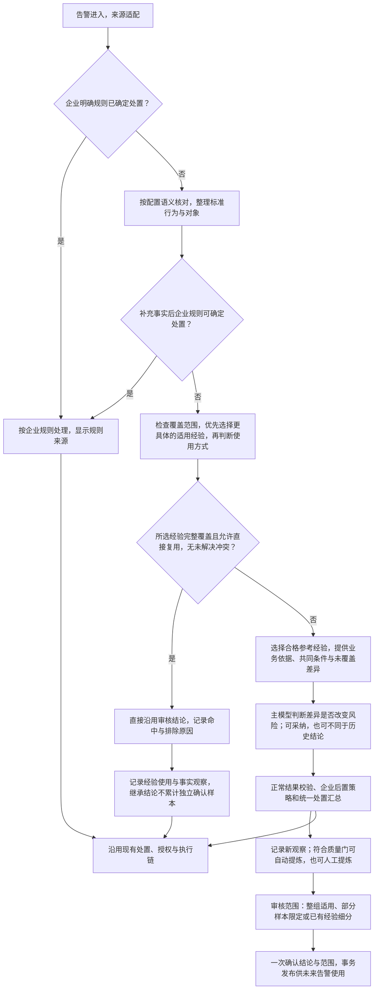

# Memory 复用范围与经验细分整改方案

状态：**代码已接入，用户已验证精确复用、新行为参考研判和草稿保留；核心匹配稳定性已有回归，模型差异解释与经验起草质量仍开放**。

讨论补充：已按“产生 -> 审核 -> 复用”的故事线补充首次出现新行为时的参考研判路径，
详见第 5.5 节；实际实现、验证证据和操作入口见第 16 节。下面的现状调查保留为改造前基线。

2026-09-17收尾实测：2次主研判、1次经验起草均完成，但2488604的解释与草稿仍弱化了
未覆盖检测。机器匹配事实没有丢失、没有错误直接复用；不能据结构通过宣称该问题已解决。
证据见 `backend/.deer-flow/soc-validation/closure-20260917/README.md`。

日期：2026-09-16。代码核查基线：`75f9abc3917890e095413bb599e44d29d13346ff`。
数据依据：本地 DEV SQLite 中的既有 Run、Pattern Observation、Candidate 和 Memory，只读检查。
调查与只读重投影没有真实模型调用，也没有修改运营数据库或经验启停。新实现使用隔离测试库和模拟浏览器 API 验证写流程。

本方案补充并拟修订 [现有适用条件设计](memory-applicability-design.md)、
[语义核对设计](normalization-assistance-design.md) 和
[PingAn Memory 设计](../memory/pingan-soc-memory-design.md)。
不是新的项目路线，不改变 `PI-01 / D12-B` 内网验收指针；实现归入既有 SOC Memory 与
`PI-03E` 下游消费工作。内网交付与真实模型效果仍需后续验证，不由这份外网结构验收替代。

## 1. 一句话目标

**已审核且完整覆盖的经验自动复用；新场景继续研判和积累；运营可以限定适用范围，
细分经验不会被宽经验抢先接管。**

这次不是再增加一个 Agent，也不是要求运营多做几轮审批。要修复的是同一套经验系统内部的
抽取、匹配、直接处理、候选聚合和审核之间的含义不一致。

## 2. 用户问题与已核实事实

| 用户问题 | 已核实原因 | 影响 |
|---|---|---|
| 同样的 OpenVPN 行为，为什么一条多出“检测行为与对象” | 2457177 的语义核对输出 `network_access`，2457581 输出 `other_detection`；两者都提取了检测名称与网络对象，但指纹消费者只接住前者 | 表达分类差异变成不同指纹 |
| 为什么 2457177 能直接沿用 2457581 同类经验的结论 | 当前 v3 只要求选中的行为成分全部出现，不限制另外增加的行为成分 | “包含条件”被解释为“覆盖整条告警” |
| OpenVPN + SIP/5060 为什么也被 UDP/1194 经验处理 | 混合告警包含 UDP/1194，新增 SIP/5060 不会阻止该子集匹配 | 新场景绕过主研判，无法正常进入独立样本积累 |
| 达到 5 条后，为什么只能“审核同类经验” | 为避免重复候选，人工入口被统一到已有候选 | 缺少“针对部分样本细分范围”的操作 |
| 为什么同类候选无法选择 IP 等附加条件 | 聚合只保留达到共识比例的值，审核可选目录也使用了这一份数据 | 不是共同条件的真实实体从可选目录消失 |
| 即使选择 IP，会不会仍被宽经验覆盖 | 当前没有完整的父范围与细分例外关系；多个相反指令只会放弃直接复用 | 无法表达“这个 IP 用新经验，其余仍用旧经验” |

### 2.1 本次实际样本

- 2457177：`RUN-085F060C7235` 提取 `network_access`，生成
  `detected_behavior:network_access:代理工具:发现vpn工具openvpn通信行为@port:1194` 和 `target_port:1194`。
- 2457581：`RUN-63BB0D32B8D9` 提取同名检测，但类型为 `other_detection`，上述两个特征未生成。
  两次都使用语义核对 Prompt v7 和 PingAn Profile 8 / feature v6，不是旧版与新版对比。
- 复用实验：2457177 的 `RUN-66A5A9357E3B`、2480991 的 `RUN-520B70A5D2F5`、
  2488405 的 `RUN-C1AF237FB9D1` 均直接使用 `MEM-659D77C494B2` 的误报结论。
- 该 Memory 选择的四个成分为代理隧道、UDP/1194、UDP、T1190。
  后两条 Run 的网络观察同时包含 SIP/5060 和 UDP/1194。
- 2456988 所属当前候选 `MC-920302EECCF9` 的生成快照包含 5 条观察，80% 共识门槛要求值至少出现 4 次。
  冻结的 `role_entity` 中，来源 `199.45.154.177` 出现 3 次，目标 `124.196.28.68` 出现 2 次，
  目标 `103.36.174.81` 出现 1 次，均没有进入候选的可选条件。

上述 IP 次数是当时保存的角色 facet 统计，不代表已经重新枚举每条原始日志的全部连接。
整改后的样本覆盖预览必须读取带对象归属的标准观察，不能直接把这些旧统计冒充新匹配结果。

### 2.2 当前代码入口

| 责任 | 位置 |
|---|---|
| 模型事件类型说明 | `backend/soc_agent/prompts/normalization.py` |
| 检测绑定对象与行为成分生成 | `backend/soc_agent/integrations/pingan/memory/semantic_features.py` |
| PingAn 指纹、范围构造 | `backend/soc_agent/integrations/pingan/memory/profile.py` |
| 选中成分子集匹配 | `backend/soc_agent/memory/scoring.py:evaluate_memory_scope` |
| 主模型前直接复用 | `backend/soc_agent/core/direct_resolution.py:resolve_memory` |
| 共识条件筛选 | `backend/soc_agent/core/memory_patterns.py:_consensus_facets` |
| 自动与人工候选合并 | `backend/soc_agent/memory/learning.py:_covers` |
| 范围比较、发布冲突 | `backend/soc_agent/memory/governance.py`、`core/service.py:_check_memory_publication` |

注意：当前直接处理不是简单“取第一条相反答案”。它检查全部合格 override，发现相反结论会退出
直接处理。但它没有识别新增行为的覆盖缺口，也没有细分例外的治理关系，因此仍会发生本次问题。

## 3. 保留与不做

保留：

- 相同条件下自动复用已审核结论，不要求每条再调用主模型或人工申请。
- 企业明确处置策略优先。策略直接处理时如实显示来源，不冒充 Memory 复用。
- 语义核对继续利用 LLM 理解日志，不退回无限增加厂商解析特判。
- context-only 可影响主模型判断，但不能作为程序直接覆盖结论的指令。
- 核心行为可勾选；IP/主机/账号等可额外限定。取消勾选必须真实生效。
- 自动候选与人工提炼共用治理入口，人工不受 5 条阈值限制。
- 保存原始日志、模型输出、审核范围和历史结果；不静默重写旧数据。

不做：

- 不把所有中文描述交给另一个模型总结成新的自由文本“指纹”。
- 不要求模型阅读全部历史 Memory 才能提取当前告警。
- 不按召回分数、记录新旧或条件数量选择相反答案。
- 不因为 Memory 不能直接复用，就强制给出可疑或转交。
- 不用一个模糊“严格模式”开关让运营承担算法含义。
- 不以这次工作引入 EDR/HIDS 查询、外网新服务、第二套经验库或自动批准经验。

## 4. 整改一：稳定表达同一行为

### 4.1 模型做什么

更新语义核对 Prompt：说明每种事件类型的含义、边界、正反例，以及类型不确定时如何保留对象。
增加网络检测、混合服务、多文件检测、进程与被检测文件分离等示例，覆盖已发现问题。

明确“日志报告了一项网络检测”与“日志中的一段文字描述了检测结果”的重叠：
存在明确网络对象和检测关联时，应按该事件语义分类，而不是随意落入兜底类型。
名称、类别、结果仍忠实保留上游内容；不要求模型为了迎合旧指纹而改写事实。

仅改 Prompt 不能保证所有输出一致，因此不能把枚举字符串本身当成唯一匹配依据。

### 4.2 程序做什么

在现有标准观察到行为特征的投影处，综合“绑定对象类型、检测身份、事件语义”生成稳定特征：

- 已确定绑定网络对象的同一检测，不因 `network_access` / `other_detection` 的表达差异丢失网络特征。
- 模型原 `kind` 不覆盖删除；额外保存实际采用的匹配解释及其依据。
- 存在稳定厂商检测 ID 时，使用来源系统/产品命名空间加检测 ID；例如不能跨产品把 `0x5dc9` 当同一规则。
  同一检测 ID 也不能单独决定同类，还必须结合服务、行为对象和适用边界。
- 没有稳定 ID 时，保留可追踪的名称/类别和对象特征；只做明确的大小写、空白、格式归一。
  不删除中文、不进行任意同义词归并、不承诺所有自然语言描述自动等价。
- 一个连接中的 `target_port:1194` 与同一连接的 UDP/1194 是重复表达，不作为两个新行为。
  但 SIP/5060 与 UDP/1194、不同 CVE、父进程与子进程、不同被检测文件不能因此合并。
- 对无法唯一解释的绑定保留未解决信息，继续正常研判；不能把“未形成匹配特征”视为“没有其他行为”。

网络“传输协议 UDP / 应用协议 SIP / 端口 5060”应使用类型化属性表达，不把它们当三条互相冲突的
自由文本。展示可以保留 SIP/5060，匹配必须保留协议层次与来源，不否认上游标签。

### 4.3 版本与通用性

通用层负责类型、来源和对象关系；PingAn Profile 负责从这些事实选择匹配特征以及厂商检测身份。
不在通用 Runtime 写死 OpenVPN、SIP、rule code 或特定 alert ID。
特征含义变化必须升级 Profile/feature schema；仅改 Prompt 文案则独立升级 Prompt 版本。

预期：2457177 / 2457581 的同一网络检测不再因枚举分类差异拆分。
如果实际另有不同核心行为，仍保留差异，不能为了让测试通过强行合并。

## 5. 整改二：从“包含条件”改为“审核范围覆盖”

### 5.1 四类信息分开

| 信息 | 用途 | 默认处理 |
|---|---|---|
| 固定范围 | 租户、环境、检测规则及来源标识 | 不能通过业务勾选随意变更 |
| 审核过的核心行为范围 | 说明这条经验究竟解释哪些事件/服务/对象 | 直接复用必须覆盖当前告警相关行为 |
| 必须出现的行为 | 用户勾选的行为 | 所选条件必须满足 |
| 附加对象限制 | 来源/目标 IP、主机、账号等 | 不选时允许跨实体泛化；选择后限制直接复用 |

“当前告警有一个被经验解释的连接”不代表“整条告警全部被解释”。
对于聚合了多条连接或不同检测的告警，未覆盖的相关行为必须进入后续研判。

### 5.2 取消勾选的精确定义，已按用户同意实施

推荐默认语义：

- 勾选某项：要求当前告警出现该项。
- 取消某项：这项可以有，也可以没有；不再暗中要求旧完整指纹相同。
- 取消某项不代表允许任何未审核的新服务、新工具或新漏洞。
- 如确实要完全放开一类变化，通过明确操作“不限定目标服务”等表达；必须展示扩大范围的影响。
  这不是默认行为，不用取消一个值来暗示无限通配。

例如已审核 SIP/5060 与 UDP/1194，取消 SIP/5060 后，只有 UDP/1194 的告警也可以匹配；
带 SIP/5060 的原告警仍可匹配。但额外出现未审核的第三种服务，不因这次取消自动获得复用资格。
如果原经验从未包含 SIP/5060，新增 SIP/5060 不是“取消过的条件”，而是未覆盖行为。

第一期不支持无限制编辑任意布尔表达式。完全放开某一维度只在 Profile 允许且保留足够可复用
行为锚点时开放；不能只剩 rule code、UDP、T1190 等宽标签就称为精确业务经验。

### 5.3 覆盖检查

设已审核的稳定行为集合为 K，必须出现的子集为 R，当前同版本投影为 Q。
对可以安全扁平比较的单一行为维度，检查 R 包含于 Q，并且 Q 没有 K/明确允许变化之外的核心值。
这里的集合只用于解释；真正的服务、进程、文件和 IP 条件必须按对应对象/事件分组比较，
不能把不同日志中的半条事实拼成一次完整命中。

额外信息分类：

| 当前比经验多出的信息 | 默认结果 |
|---|---|
| IP、时间、告警编号变化，且未限制该实体 | 不阻止复用 |
| 同一事实的重复表达、分类标签机械差异 | 归一后不阻止复用 |
| 新服务、新 CVE、新检测对象/行为、相关执行影响 | 未覆盖部分存在，不直接套用整条结论 |
| 明确命中已审核的失效条件 | 不直接复用 |
| 普通备注、额外来源字段、无法映射的非核心计数 | 不因字段多了就阻断 |
| 有来源的相关新事件存在，但关键绑定无法判断 | 保留未知覆盖，走普通研判，不能当作已覆盖 |

覆盖检查不能仅比较“已经成功生成的指纹项”。标准检测事件若未被消费者接住，也要明确留下
消费缺口，否则模型使用 `configuration_detection` 等标签时仍可能绕过这条保护。
缺失可选遥测、一般归一化备注本身不是这类缺口，不引入每日大量维护告警。

### 5.4 参考与直接复用仍分开

覆盖不完整时，有关联的旧经验仍可按现有检索门槛进入 context-only，并携带具体未覆盖项。
模型可以据此给出误报、真实攻击或其他有依据的判断，不强迫可疑。
附加 IP 条件未命中仍然只取消直接复用资格，不额外封死原来合法的相似召回。
租户、环境、有效期、排除范围和真实不相关场景的检索限制继续生效。

覆盖检查结果必须同步用于主模型前快捷路径和研判后 Memory Decision；否则会发生前面拒绝、
后面仍然强制套用的假修复。待审和确认记录的范围去重也必须使用同一套语义。

### 5.5 首次出现新行为：旧经验与差异一起进入主研判

这是未达到直接复用条件时的正常路径，不是异常补救。目标是让模型理解：**旧经验为什么值得
参考，为什么尚未解释当前全部行为，以及哪些差异需要结合当前告警重新判断。**
“没有解释新增行为”不等于“新增行为与旧经验矛盾”，更不等于新增行为已经被证明恶意。

#### 经验选择

1. 先检查经验已审核、允许使用、租户和数据范围有效，且与当前行为确有相关性。
   只有同 rulecode、没有有效行为关联，不能因为候选池里排名第一就进入上下文。
2. 默认以合格候选中最相关的一条为主要参考。召回分数用于相关性排序，不是结论正确概率，
   也不赋予直接复用权限。存在完整适用的更具体经验时，先按第 6 节选择，不让分数压过范围。
3. 若另有更具体、或对当前新增行为提供不同解释的合格经验，可作为少量补充对照。
   不能只取最高分而隐藏相关反例，也不把同 rulecode 的全部经验堆入模型。
4. 上下文选择预算与直接复用冲突检查分开。未选中的记录留在审计中，不声称被模型实际使用；
   待审、暂停、废止或越出硬性检索范围的记录，不借“提供反例”绕过使用限制。

#### 模型应看到的业务说明

例如：旧经验 A 已确认工具 P 的某种通信属于正常业务；新告警在相同通信之外，还报告了文件读取。
下面是说明结构，不是待硬编码的具体业务规则：

| 内容 | 给模型的信息 |
|---|---|
| 历史业务事实和结论 | A 的审核业务事实、审核结论、适用及失效条件，保留 Memory ID/版本与 M-* 引用 |
| 召回原因 | 当前与 A 共享检测规则、通信工具及目标服务；引用对应当前事实 |
| 当前差异 | 当前另有文件读取行为，明确其对象和 E-* 来源；旧经验未解释它 |
| 不能直接复用的原因 | A 尚未覆盖这项新增行为，不是旧经验本身无效，也不是当前行为已被判恶意 |
| 本次判断任务 | 旧业务解释能说明哪些部分；新增文件读取是否改变当前风险判断 |

差异对照**审核后的适用条件、允许变化范围及业务解释**生成，不仅比较历史原始 facets 或 Hash。
已允许变化的 IP、同一事实的重复表达和字段顺序不能被重新包装成未匹配核心行为。
明确未满足的条件、尚未覆盖的行为、已命中的失效条件分开说明；程序提供可追踪差异，
模型判断其业务意义，不能把每个字段差异预先定性为实质风险。
源 IP、文件、账号等差异保留事件/对象绑定，不能把不同日志的片段拼成同一个行为。

#### 主研判提示词

以下业务规则已接入主研判 Prompt，不是将经验正文当作系统指令执行：

> 以下经验经过人工审核，但针对的是历史业务场景，不是当前告警的完整答案。
> 系统提供共同条件、当前新增行为及未满足的适用条件，因此本次没有直接沿用历史结论。
> 请判断历史业务解释能够说明当前哪些行为，以及尚未解释的差异是否改变风险判断。
> 如果差异不改变业务性质，可以得出与历史经验相同的结论，并说明原因。
> 如果差异改变业务性质，应根据当前告警给出不同结论，并指出决定性的差异。
> 如果现有信息确实不足以判断这项差异，说明具体尚待确认的问题，不把可疑作为默认答案。
> 不得仅因未完全匹配就判为可疑，也不得仅因历史经验是误报就忽略新增行为。
> 历史审核事实以 M-* 引用，当前事件事实以 E-* 引用，不把历史业务授权自动当成当前对象已获授权。

配套示例同时覆盖：差异不改变业务性质、差异证明另一种风险、差异尚不能明确解释。
不能让所有“部分匹配”示例都输出 true_positive 或 suspicious。
解释使用现有结论理由及引用结构，不新增大段机械 JSON 输出要求；提示词不要求模型自行授予
Memory Directive 权限或修改审核范围。企业策略和外部动作授权继续走原有独立控制链。

2026-09-17 补齐解释一致性（`soc-analysis-v46`）：

- 输出示例先看未覆盖行为、未满足条件、附加限制和排除命中，再看历史审核结论。
  存在差异时使用比较示例，不再因为 Memory 为真实攻击就套用“全部匹配”的示例。
- 保留原始 `memory_comparison`、完整经验和事实。输入侧 `memory_use_explanation`
  说明差异类别；在作答契约附近用紧凑 `memory_comparison_focus` 重申实际 M-* 及未覆盖项，
  不重复整段经验，不重新计算召回或匹配，不新增模型输出字段。
- `matched_required_facets` 全命中不等于旧经验覆盖全部当前行为。模型仍可认为新增检测
  与已审核业务解释一致，但应明确“存在机器范围差异，经当前证据判断仍可采纳”，
  不能反过来说程序已精确匹配。新增项不直接等于攻击证据，不强制可疑或重复业务核实。
- 2480991 冻结事实实测：第一版仅调整示例仍有解释错误；加强差异位置后，一次明确指出
  `0x4ef7/SIP5060` 未覆盖，并判断其业务语义仍支持真实攻击；另一次连接失败。
  此为主研判组件验证，不是全链路或两次稳定通过；未重跑语义核对、修改 Memory 或历史 Run。
  详见月度 `EXP-20260917-memory-difference-explanation`，稳定性仍需后续观察。

2026-09-17 后续修正（`soc-analysis-v47` / Business Lesson v10）：

- 2488604 的后续真实运行再次出现“差异仅 IP/端口”的错误措辞，不能宣称只改 Prompt 已解决。
  现从冻结比较生成独立“系统匹配说明”，模型只写“模型研判依据”。原话仍保留作审计，不做
  正则改写，也不让措辞错误反过来改变风险判断、召回、授权或生成额外复核任务。
- 同一套来源说明覆盖新增行为、缺少行为、必需条件、附加限制、排除项；不针对 SIP 写特例。
  “具备指令资格”不冒充“已经采用指令”；历史未保存比较时明确不可推断精确匹配。
- 自动 Pattern 和人工提炼都携带系统匹配事实，供后续经验起草解释业务影响；不能把旧模型
  的“全部覆盖”传成新的标准答案。既有候选不自动修改，最终经验仍由运营确认。
- 只读复核 2488604 为 B 经验参考使用、仍列出 Nmap/0x4ef7 未覆盖；2455998 为 A 精确复用。
  未重跑告警或修改经验；Prompt v47/v10 的真实模型措辞稳定性仍待后续运行观察。

#### 本次结论与未来沉淀

| 主研判结果 | 本次如何处理 | 后续经验如何处理 |
|---|---|---|
| 差异不改变业务解释 | 可以形成与旧经验相同的结论，包括 false_positive，记录采纳依据 | 保留观察；满足准入后可建议补充旧经验，不自动扩大直接复用范围 |
| 新增行为构成不同风险场景 | 根据当前事实形成不同结论，说明旧经验仍解释哪部分、不能解释哪部分 | 按现有质量门积累，或由运营提前提炼；审核差异后细分或修订 |
| 差异意义暂不能确定 | 给出当前有依据的判断及具体待确认问题，不机械判为真实攻击 | 保留观察，不把未确认结论包装成已审核答案 |

原先允许直接复用的 A，在本次因未覆盖新增行为而供模型参考时，其本次最终用途记录为
context-only；不能同时记作直接复用，也不能在后置 Memory Decision 再强制套用 A。
本次得出相同结论不反向证明机器匹配已完全成立，不自动授权未来所有同类变化。
这次主研判若采纳 A，应保存实际引用、差异和采用理由；若未采纳，也保存原因。
一次模型推断不是运营确认，不自动改写经验、提升审核置信度或创建已启用的新经验。

#### 现有基础与待补工作

- 已有：`memory/retrieval.py:_memory_context_comparison` 投影共同字段、当前独有字段和历史独有字段；
  `prompts/analysis.py:_MEMORY_REASONING_GUIDANCE` 允许 context-only 支持当前 Base Decision。
- 待补：按审核范围解释差异；将新增行为覆盖报告传入参考选择和模型上下文；选择相关对照经验；
  完善上述业务提示与结果留痕，并保证前置/后置不会绕过本次参考用途。
- 沿用 `AnalysisMemoryContextComparison`、现有引用和匹配报告协议，按需扩展，不另起 Memory 研判服务。
  仍使用本次主研判调用，不增加一次专门的“经验适用性研判”。相较原来的错误直接处理，
  未覆盖新行为的告警会恢复一次正常主研判，需要如实记录新增 Token 和耗时，不能宣称成本不变。

## 6. 整改三：宽经验与细分经验不是抢先匹配

### 6.1 选择可执行的“细分例外”，不做分数优先

例子：A 表示同一 OpenVPN 行为默认误报；B 表示该范围内目标 IP 为 X 的行为是真实攻击。

推荐在 B 确认并开放使用时，原子完成：

1. 校验 B 确实是 A 的严格子范围，固定租户、检测、行为版本一致。
2. 审核页面说明“X 由 B 负责，其余仍由 A 负责”。
3. 保存 B，并为 A 增加一条有类型、有版本的直接复用排除范围 B。
4. 原 A 的正文和判断依据保留历史版本；不能只在 B 文案写“例外”而不修改实际匹配边界。

于是运行时：X 只由 B 直接处理，其他受 A 完整覆盖的情况由 A 处理。
不是按谁先查到、创建时间、置信度或勾选数量决定。每条告警不增加模型调用或审批。

这是针对前轮“窄经验优先”的具体实现：**通过审核明确分配范围，不用隐含排序猜优先级。**

业务选择顺序必须是：先比较完整适用的经验范围，优先更具体的已审核经验，再读取其使用方式。
不能先过滤出允许直接复用的经验，从而绕过更具体但仅供参考的经验。分数只用于合格参考经验
的相关性排序，不替代范围包含关系；多个条件或更多文字本身不证明更具体。
上面的父范围排除表示是上一版提出的工程实现选项，并非本轮已批准的数据结构要求；
最终实现可复用范围关系与版本化治理记录，但必须达到相同的选择、撤销与并发一致性结果。

### 6.2 可接受的范围关系

| 关系 | 确认时处理 |
|---|---|
| 同范围、同结论 | 补充或修订已有经验，不新增重复标准答案 |
| 同范围、相反结论 | 修订替换旧经验，不并存两条相反直接答案 |
| B 是 A 的严格子范围 | 可选择“为该范围建立细分经验”，确认后 A 让出 B 的范围 |
| 明确不同且不重叠 | 可以分别启用 |
| 一个限制 IP、另一个限制账号等交叉范围 | 展示交集，先限定交集归属，不按条件数量选胜者 |
| 无法证明包含/互斥关系 | 不发布新的相反重叠直接指令；可保留待审或参考方式 |

包含关系必须按类型化条件证明，不能从自然语言正文、相似度或“两个 IP 不同”直接推断。
一条告警可能包含多个对象；不同 IP 不一定意味着两条经验在告警级互斥。
首期支持一层通用经验和多个互不冲突的细分范围，不提供无限嵌套的运营规则编辑器。

### 6.3 生命周期必须明确

| 操作 | B 的范围后续如何处理 |
|---|---|
| B 仅创建草稿，尚未确认并开放 | 不改变 A 的现有范围；页面明确草稿尚未生效 |
| B 确认并开放为直接复用 | A 排除该范围，B 自动处理 |
| B 确认作为参考，且审核人明确将该范围交给 B 重新研判 | A 不直接处理该范围，进入模型研判；参考 B 不等于直接套用 B |
| B 暂停、到期、被安全监测停用或废止 | A 的排除范围不静默消失；该范围继续正常研判 |
| 审核人选择“撤销细分范围，恢复原经验处理” | 检查 A 有效性及其他冲突后，显式移除排除范围并留痕 |
| B 修订或改变范围 | 同事务校验并更新关联范围；旧版引用保留在历史 Run |

仅相似、未完整适用的普通参考经验不会自动排除宽经验；已审核且完整适用的更具体经验，
则应优先选择，即使它仅供参考。包含关系由服务比较已审核条件确认，不靠模型相关性评分，
也不要求运营逐条填写父子优先级。
相反结论或人工“此处不适用”的反馈继续进入现有修订机制；模型可疑和企业转交不能自动推翻 A。
当前告警完整落在已审核的 B 细分范围时，参考选择也应解释这项关系：优先提供适用的 B，
不把已让出该范围且结论相反的 A 当作同等适用答案。A 可留在差异审计，不算实际使用。
新的 C 场景若不被两者完整覆盖，仍按合法相关性检索，并向模型说明各自范围，不伪造一个优先结论。

暂停 B 时用户看到的是：“暂停后，该范围恢复模型研判，不会自动沿用原宽经验。”
恢复 A 属于明确的范围变更，不要求另填一份重复治理理由；仍保留操作身份和审计记录。

### 6.4 发布与并发

沿用 `SocMemoryService` 的治理事务、幂等键和版本检查。
细分经验开放与父经验排除必须同事务成功或全部失败，不能存在两条相反答案短暂同时生效的窗口。
先确认但未开放的候选可以保留拟议关系；真正开放时重新检查父版本、有效期、全部重叠记录。
两个审核人同时细分同一范围，后提交者收到范围已变化的提示并刷新，不覆盖先提交内容。
一次运行的候选选择应读取一致的经验/排除版本快照，或在决定前重新验证版本。
仅保证写事务原子还不够，不能让多次独立查询分别读到旧 A 与新 B，再拼成错误的可用集合。

## 7. 整改四：自动聚合不能删掉人工限定能力

### 7.1 共同条件与可选目录分离

保留现有共识逻辑用于候选推荐，但另外生成“来源样本可选择的限定目录”。
目录使用候选冻结的全部来源观察，不只读取 3 条代表说明，也不拉取无限历史。

每个可选值包含：字段/角色、值、出现的独立样本数量、来源 alert/run/对象引用、是否来自当前告警。
它们只是可选值，不自动加入必需条件，不计为全组共识。
高基数字段用搜索/分页，不截断存储后假装完整；来源不明的值不伪装成来源 IP 或目标 IP。

需要合并多条条件时，源 IP 与目标 IP 必须作用于同一条相关连接；主机、账号与进程同理。
跨日志分别出现 X 源与 Y 目标不证明存在 X→Y 的连接。
多个来源和目标值不会静默生成未审核的任意组合，预览应按对象绑定核对实际适用范围。

### 7.2 用户界面

```text
适用告警
  固定范围：红队IP监控 / 来源 / 产品 / 数据范围
  核心行为：默认全选，可逐项调整

进一步限定
  添加限制：目标 IP
  [ ] 124.196.28.68    来源样本中出现 2 次
  [ ] 103.36.174.81    来源样本中出现 1 次，包含当前告警

按当前选择
  当前 5 条来源样本中：N 条完全符合，M 条只部分符合，K 条不符合
  未覆盖样本保留，不会因本次确认被标记为已审核
```

N/M/K 必须由同一后端匹配器针对冻结标准事实计算，不由前端猜测，也不从 IP 出现次数直接推导。
例如一条告警有多个相关目标，仅其中一个目标符合限制，应明确“部分符合”，不能声称整条覆盖。

改变范围后，AI 草稿需按当前范围更新。用户手工编辑内容不自动覆盖，提示复核即可。
草稿保存范围 hash；确认前检查草稿与最终范围是否一致，不能沿用范围外样本的业务结论冒充支持。

“生成前有 5 条样本”与“收窄后有几条支持这个结论”分别展示。
人工收窄到 1 条仍可确认，不重新要求达到 5 条；自动质量统计不能继续显示 5 条全部支持。

### 7.3 入口统一，但允许细分

| 告警当前状态 | 主操作 | 必要的次级操作 |
|---|---|---|
| 未达到自动候选门槛 | 提炼经验 | 无需额外理由输入框 |
| 已有同范围待审候选 | 审核同类经验 | 为本条限定经验范围 |
| 已有已确认适用经验 | 查看经验 | 修订经验 / 为该范围建立细分经验 |
| 新行为不被旧经验完整覆盖 | 提炼经验或审核新的同类候选 | 查看相关旧经验及差异 |

次级操作先选择范围，不立即创建另一份同内容候选。
相同范围继续进入原审核；真实细分才保存关联候选。入口沿用经验中心和候选审核页，不新增运营栏目。

如果用户要收窄整个待审候选，保留原始来源快照，另保存本次审核范围；剩余样本不被批量批准。
如果用户只想单独处理部分样本，则保留原候选并创建细分候选，明确父子来源，提交时处理重叠范围。
已有确认经验只能修订或建立细分，不能在原页面直接覆写其历史内容。

## 8. 整改五：样本积累与候选协调

自动、人工、跨窗口和修订必须调用同一个范围判定，不能各自依赖旧 hash 或子集匹配。

| 运行结果 | 样本与审核处理 |
|---|---|
| 完整覆盖并直接复用已有结论 | 记录 MemoryUse 和当前事实观察；继承结论不计为独立确认样本，不自动复制候选 |
| 新核心行为未覆盖，完成常规研判 | 按现有准入规则记录新观察；达到质量门再生成候选 |
| 未覆盖新行为经模型参考旧经验后得到相同结论 | 记录差异及采用依据，可建议补充；不自动扩大旧经验权限或将本次判断视为人工确认 |
| 人工未满 5 条提前提炼 | 建立一次审核，后续相同范围复用这个审核入口 |
| 之后达到 5 条 | 追加样本关联，不重复生成同范围候选 |
| 仅部分样本获得人工限定经验 | 其余样本继续积累；覆盖去重不能用父候选身份把它们一并吃掉 |
| 同范围新告警挑战已确认结论 | 进入已有修订/反馈链，不不断建立相反标准答案 |
| 未覆盖的新场景与旧经验相反 | 允许新范围候选，审核时明确范围关系 |

一个新观察不保证自动产生候选，还须满足现有重复、有效结论和一致性条件。
相同告警重跑不当作新的独立事件；旧运行、旧观察保留，不用重跑伪造“5 个独立样本”。
直接复用后人工仍可主动提出“经验不适用/需要细分”，其新业务结论来自人工，不把复制的模型结果
作为新的独立支持证据。

## 9. 完整故事线



高优先级企业规则条件尚未具备时，沿用现有 defer 机制，不能让 Memory 提前绕过它。
图中的“无未解决冲突”允许多个一致佐证，但不允许未解决的相反直接指令。
参考路径如无合格经验，则直接基于当前事实正常研判，不为填充上下文强行选择低相关记录。
一次运行中同一 Memory 只能记录一种最终用途；没有实际提供给模型或直接复用的记录仅保留差异审计。

## 10. 页面应让人看懂什么

不用新增 Profile、指纹版本等业务术语。正常页面显示四类说明：

| 情形 | 面向运营的说明 |
|---|---|
| 直接复用 | 已复用“OpenVPN 已知业务通信”经验；本次行为及适用范围全部符合，未调用主研判模型 |
| 多出行为 | 找到 OpenVPN 经验，但本次另含 SIP/5060；经验仅作参考，继续研判 |
| 细分范围 | 本次目标为 X，适用“X 专属经验”；通用经验不处理这一范围 |
| 附加条件不满足 | 该经验仅直接适用于目标 X；本次目标为 Y，可按相关性作为参考 |

具体引用、原始分类、归一后的类型、版本、额外行为、覆盖对象、未选中的其他经验等放技术详情。
既有 corpus 分组只是导航提示，不应把“仅参考/精确复用”写成不随审核变化的固定事实。
实际结果显示真实 Run 的处理来源。企业直接处理时显示“本次未检索经验”，不是“未找到经验”。

候选审核页面只要求最终判断和可选业务事实；范围编辑是为了表达适用对象，不另加重复治理理由。
确认按钮附近显示影响：是否替换、细分哪条旧经验、哪些样本仍未覆盖、是否开放直接复用。

## 11. 工程落点与契约

以下是待实现的契约含义，字段命名在实现时与现有模型对齐，不代表现在已有这些接口。

### 11.1 沿用现有模块

| 工作 | 所有者 | 边界 |
|---|---|---|
| 类型定义、来源绑定、分类解释记录 | `contracts/normalization.py`、`normalizers/semantic_observations.py` | 通用，不读取平安原始字段名 |
| 稳定特征身份、重要行为维度、同义表示 | PingAn `memory/semantic_features.py`、`profile.py` | 从 canonical 消费；可扩展其他租户 Profile |
| 必需行为、覆盖范围、限制和例外判断 | `memory/scoring.py`、`behavior_scope.py`、`governance.py` | 通用集合/对象关系，不硬编码 OpenVPN |
| 直接复用及研判后采用 | `core/direct_resolution.py`、现有 Memory Decision 消费者 | 使用同一范围判定与例外排除 |
| 参考选择、差异表达与主研判提示 | `memory/retrieval.py`、`prompts/analysis.py`、现有 comparison 契约 | 参照已审核条件；复用本次主研判，不授予新指令权限 |
| 可选实体目录、细分来源、去重协调 | `core/memory_patterns.py`、`memory/learning.py` | 不把共识过滤用于全部可选值 |
| 确认、开放、修订、恢复与原子发布 | `SocMemoryService`、既有 UoW/Repository | 身份、幂等、版本和审计完整 |
| 页面与预览 | 现有候选审核、经验详情、`soc-memory-scope.tsx` | 前端不计算指纹/包含关系/冲突优先级 |

### 11.2 最小数据扩展

- 在现有 applicability 版本化增加：已审核的行为覆盖快照、所选必需行为、明确允许变化维度、
  作用于相关对象的附加条件、直接复用排除范围。仍保留旧 hash 作来源，不混同为新版语义。
- 扩展匹配报告：已覆盖行为、未覆盖行为、未知覆盖原因、附加条件命中、排除的父经验及版本。
- 候选增加可选条件目录的来源索引/快照、细分来源、当前范围内外样本数。明细按需读取，不复制整份日志。
- 父经验的排除保存子范围快照、来源细分记录/版本和审核信息；不能只存一个会随启停失效的动态 ID。
- 扩展范围关系：same / strict_subset / strict_superset / disjoint / overlap / unknown。
  只有类型化关系可证明时才返回包含；版本不兼容是不能比较，不拿它证明实际业务互斥。
- Runtime 冻结本次实际选择与排除的 scope hash，历史重放不读取今天的经验来改写昨日结果。

优先使用现有候选/记录/使用记录的 JSON payload 和治理事务，不另建经验数据库。
如需要查询索引，仅增加必要 migration；不能绕开 Repository 在页面代码直接改库。
不兼容的新语义记录不得被旧 Worker 忽略字段后照常直接执行，发布必须升级全部写入/消费进程。

### 11.3 共用服务接口

- 扩展现有 `governance-preview` 和 `match-test`，支持当前候选草稿以及父/子范围影响的只读预览。
- 人工 promote 入口增加“细分范围”意图，先比较范围，再决定复用原候选或创建细分候选。
- 确认/开放指令可携带被细分的记录 ID、预期版本、预览 scope hash，服务器重新计算而非信任客户端。
- 预览不调用模型、不创建 MemoryUse、不增加样本次数。
- UI 与 CLI/API 共享同一服务规则，不能只在一个页面阻止冲突。

### 11.4 性能与失败

- 不增加每条告警的“选择经验”模型调用。继续使用既有语义核对，覆盖和例外选择由代码完成。
- 按租户、环境、检测范围和已索引行为定位相关记录，再评估完整相关集合；不能用 context Top-K
  代替冲突检查，也不能按最新 200 条截断遗漏旧例外。
- 相关集合异常大或匹配服务失败时，放弃本次直接复用，保留原因并继续常规研判，不无限等待。
- 语义核对失败仍保留 Adapter 结果；不得把失败后缺少新行为当成“全部已覆盖”。
  只有现有标准事实足以完成覆盖检查时才能直接复用，否则普通研判继续。
- 不根据新增目录重新计算全量数据库；预览以冻结候选和已运行样本为范围，按需加载。

## 12. 已有数据和发布方式

**不清库，不自动废止或修改现有 Memory，不批量调用模型。**

推荐上线步骤：

1. 新判定先只读对比，记录“旧规则会直接复用、新规则应继续研判”的差异，不影响现有结果。
2. 对本次相关候选和经验提供迁移预览：能否重建覆盖范围、缺少什么来源、哪些告警会变化。
3. 已有记录保持旧版本可读；经审核创建新版修订或细分关系，不原地扩大或缩小已批准条件。
4. 新匹配功能正式开启后，未核验的旧子集指令不得绕过新覆盖检查。用户在开启前看到受影响列表并确认。
   能恢复同版本参考范围的仍可参考；无法解释或版本不兼容的明确不采用，不能声称所有旧记录都能参考。
5. 有反向需求时通过迁移/回滚预览恢复，不简单关开关让旧宽经验重新吞掉已经生效的细分范围。

旧运行继续展示当时真实结果。新版发布只影响新运行；不修改既有实验统计，不重写已废止记录。
只读对比开关与正式采用开关由部署配置管理，不给运营增加每次运行必须理解的算法选择。
本轮没有要求上传内网包；待外网实现验收后再形成一次交付。

## 13. 验收矩阵

先使用保存的真实 Run 做无模型回放，再做小范围真实调用与浏览器演练。合成审核结论标为仿真。

| 场景 | 必须看到的结果 |
|---|---|
| 同一网络检测分别输出 network_access / other_detection | 对象与检测身份相同则生成一致稳定行为，不丢失检测 |
| other/configuration 类型另有真实不同检测 | 不因绑定同一网络对象就把不同检测合并 |
| 2457177 与 2457581 相关同一行为 | 消除本次分类表达造成的差异；其他真实差异照常保留 |
| UDP/1194 经验遇到 2480991 / 2488405 的混合服务 | 新增 SIP/5060 未被授权覆盖时，不直接沿用整条结论 |
| 只变化 IP、时间，且没有实体限制 | 仍允许直接复用，验证跨 IP 泛化 |
| 取消已审核 SIP 成分，当前只有 UDP/1194 | 不要求旧完整 hash 相同，勾选确实生效 |
| 同一取消操作之后出现新 CVE/第三类服务 | 默认不直接复用，不把取消解释为无限许可 |
| 同一事实换顺序、重复出现、改变大小写 | 指纹/条件身份一致；中文检测信息仍保留 |
| 相同网络标识新增已声明的实际影响反证 | 不因旧标签满足就直接忽略 |
| 2456988 同类候选编辑附加范围 | 可从全部冻结样本选择 IP，并显示来源与真实覆盖数量 |
| 收窄后仅 1 条完全符合 | 可人工确认；不伪称 5 条都支持该限定结论 |
| 源 IP 与目标 IP 分别出现在不同连接 | 不把两个半条件拼成命中 |
| 同一告警包含受限 IP 和其他未覆盖对象 | 不把部分对象匹配当作整条覆盖 |
| 达到 5 条后选择“为本条限定经验范围” | 相同范围回到已有审核；真实细分可新建，不丢剩余样本 |
| 先手工提炼，后来达到 5 条 | 不产生重复同范围候选 |
| A 宽误报、B 窄真实攻击 | 审核发布后，B 范围由 B 自动处理，A 不接管 |
| 交换记录顺序、分数或创建时间 | 最终选择不改变 |
| A 宽直接复用、B 已审核细分但仅参考 | B 范围正常调用模型，不被 A 前置或后置指令覆盖 |
| B 暂停/到期/废止 | 该范围恢复研判，不静默回退 A |
| 明确撤销例外恢复 A | 版本、权限与冲突检查后生效，有审计 |
| 两条不可比较的相反细分范围 | 发布提示交集问题；运行兜底不按分数选答案 |
| 两人并发确认相反/重叠范围 | 最多一个兼容提交成功，无半完成发布 |
| 新增行为完成正常研判 | 可记录独立观察并手工提炼，自动候选仍受质量门控制 |
| 仅同 rulecode 的低相关经验排名第一 | 不强行进入模型上下文；召回分数不代表结论正确概率 |
| 旧经验未覆盖新增行为，但具备有效关联 | 上下文同时提供审核依据、共同条件、新增行为及不直接复用原因 |
| 较低分合格经验对新增行为有更具体或相反解释 | 不被最高分经验遮蔽；作为必要对照提供，不按结论多数投票 |
| 差异经当前事实解释为不改变业务性质 | 允许模型采纳历史误报结论；记录理由，不自动扩大旧范围 |
| 差异证明新的风险或确实尚不能解释 | 根据当前证据判断或明确具体问题；不因部分匹配默认可疑/真实攻击 |
| 用户已允许的 IP 变化、顺序变化或重复字段 | 不把它们描述成未覆盖核心行为，不暗中恢复原完整指纹限制 |
| 原直接经验本次只作参考 | 前置与后置都不再强制覆盖结论；一次 Run 只记一种最终用途 |
| 企业明确策略启用并命中 | 仍优先直接处理，页面写企业来源而非 Memory |
| 旧 Profile、旧候选、旧记录和历史 Run | 不静默迁移，不丢历史，不假称新规则已适用 |

真实模型抽样：先 2457177、2457581、2480991、2488405，再选择一组文件检测与一组进程检测。
2456988 的候选治理使用隔离副本做流程验证，正式 DEV 数据由用户亲自审核。
Memory 效果实验暂关闭会提前处理这些规则的企业策略，并冻结运行配置；另设一条启用企业策略的
回归，证明没有破坏企业优先。不能把策略短路误当 Memory 修复成功。

浏览器覆盖：候选编辑、范围预览、细分确认、重复点击、刷新返回、旧记录修订、暂停与恢复。
桌面和窄屏检查文字不重叠、主次按钮清晰；不自动跳转打断用户操作。

记录指标：归一后同义分类一致性、错误直接覆盖次数、合法跨 IP 复用、独立观察/候选数、
每条实际采用的 Memory 与范围理由、模型调用/Token/阶段耗时。
预定义回归中的错误覆盖和重复候选必须为 0；真实小样本通过不能宣称全量准确率。
SQLite 并发测试在外网执行；PostgreSQL 事务/快照路径使用具备条件的测试环境验收，未运行则列为
未验收，不能以 SQLite 通过代替。真实 ZEUS/Agent Platform 接口不属于本轮整改通过的证明范围。
实验记录 upstream commit、模型/config/data hash、硬件、命令和产物，按现有实验台账归档。

## 14. 实施顺序与每轮交付

| 轮次 | 范围 | 用户能审核什么 |
|---|---|---|
| 第一轮 | 分类边界、稳定行为投影、对象覆盖报告；新版契约和离线回放 | 两条 OpenVPN 为什么相同，混合服务为什么不同；先不改已有经验 |
| 第二轮 | 直接复用覆盖检查、参考经验与差异投影、主研判提示、研判后同步采用、候选覆盖去重 | 宽经验不吞掉新行为；旧经验仍能帮助新情况研判，合法同类仍自动复用 |
| 第三轮 | 同类候选完整可选目录、来源/覆盖预览、人工细分入口及子集草稿 | 2456988 可选择 IP；收窄后剩余样本继续积累 |
| 第四轮 | 宽窄例外关系、原子发布、暂停/撤销/恢复、完整前端故事线 | A/B 相反结论按已审核范围自动分工 |
| 最终验收 | 上述组合矩阵、少量真实模型、浏览器与迁移预览 | 用户亲自完成完整操作，确认后才计划内网交付 |

这些是本整改的交付切片，不新增路线任务编号。第三轮不能对用户宣称“细分可以安全开放”，
直到第四轮完成宽经验让出范围的实现与验收。不会把半成品发布到内网让用户反复部署。

## 15. 已同意的产品决定

| 决定 | 推荐方案 |
|---|---|
| 新告警多出未审核的核心行为 | 不直接复用整条结论，旧经验可作参考，继续研判与积累 |
| 新场景参考哪些旧经验、怎样参考 | 默认合格最相关经验，必要时附相关对照；说明共同条件与未覆盖行为，由本次主模型判断业务差异，不强迫沿用或推翻历史结论 |
| 取消某个勾选项 | 该项可有可无，不暗含允许所有新行为；完全放开一个维度须明确表达 |
| 同类候选的附加条件 | 提供全部来源样本的真实可选值，保留角色/关联和覆盖预览 |
| 达到 5 条后的人工操作 | 保留“审核同类经验”，同时支持“为本条限定经验范围” |
| 窄范围结论与宽经验不同 | 审核时明确建立细分例外，发布时让宽经验让出该范围 |
| 细分经验停止使用 | 不自动回退宽经验；恢复宽经验必须显式确认 |
| 已有数据 | 不清库、不自动改经验；先预览，再审核迁移，新旧语义严格区分 |

这些决定已获用户同意。没有替用户确认、废止或重新启用任何经验。

## 16. 实现与本机验收

### 已接入的行为

| 故事线 | 实现 |
|---|---|
| 产生 | 新 apply Run 冻结 PingAn Profile 9 / features v7；检测特征按绑定对象解释，不因 `network_access/other_detection` 分类差异漏掉网络检测。检测 ID 使用来源系统和产品命名空间；无 ID 时仍保留原检测标签，不臆造中文同义词归并。 |
| 范围 | Applicability v4 同时保存选中的必需行为和完整审核覆盖。新增未覆盖行为进入参考研判；已取消的已知行为可有可无。网络连接、进程的主机/账号保留对象绑定；不能跨对象拼成一次完整适用。 |
| 审核 | `scope-options` 按维度查询全部冻结来源样本，页面每页 10 个值、支持搜索，不一次展开全集。预览显示整条来源告警的覆盖数量，出现一个 IP 不等于该 IP 覆盖整条混合告警。 |
| 细分 | `为部分告警建立细分经验` 保留原候选，仅把符合全部条件的来源快照送入子候选和经验草稿；子候选仍待审核。旧结论不自动继承。 |
| 复用 | 同一治理快照先比较范围，再判断直接复用权限。更具体的已开放参考经验也能让宽经验退出直接处理。相反且不可证明包含关系的重叠指令仍被发布门禁拦截。 |
| 生命周期 | 已发布的细分记录本身充当持久边界，不新增父子关系表。暂停、过期或废止不自动撤回边界；原经验详情的 `细分经验与范围管理` 可显式恢复，校验双方版本并记录原因和审计。 |
| 参考研判 | M-* 比较携带未覆盖行为、对象匹配缺口和范围优先原因；Prompt 明确差异不等于恶意，并保留当前证据支持误报的示例。后置指令不绕过同一覆盖判断。 |
| 样本积累 | 直接复用 Memory 也保存事实观察，但 `lesson=null`，不把复用的结论算成独立确认样本；企业规则直接处理路径不变。 |

库存分页读取使用既有治理事务锁形成快照，锁仅覆盖读取，不覆盖评分或模型调用。
旧 Run、旧索引和旧 Memory 不改写。已知历史 Profile 7/8 可读、可解释、可回放；
新 Profile 9 查询不会把旧 Profile 的授权当成新授权。旧经验需要通过新样本重新提炼/审核才能用于新版直接复用。
样本库导航仍使用 Adapter-only 索引，不要求重新处理全量 PKL。

### 四条真实保存样本的只读重投影

使用保存的 canonical/语义核对结果，未重跑模型；临时范围以 2457581 的新特征构造，**不是新建真实 Memory**。

| 告警 | 临时范围比较 | 说明 |
|---|---|---|
| 2457581 | 完整适用 | UDP/1194 基准 |
| 2457177 | 完整适用 | 同检测的分类差异不再额外拆分 |
| 2480991 | 仅供参考 | 新增检测绑定 SIP/5060 和 SIP/5060 服务，不直接套用 UDP/1194 结论 |
| 2488405 | 仅供参考 | 同上 |

报告：`backend/.deer-flow/soc-validation/memory-scope-remediation-20260916/saved-run-comparison.json`。
脚本：`validation/compact_zeus/audits/memory_scope_coverage.py`，数据库连接强制只读。
同时通过当前 API 确认 `MC-920302EECCF9` 的 5 条冻结来源可查询 15 个目标 IP，首页最多 10 个。

### 一起操作的顺序

1. 打开原候选 `MC-920302EECCF9`，先看 `为部分告警建立细分经验` 的实体目录、搜索及覆盖预览；先不提交，避免修改旧演练。
2. 告警演练保持语义核对开启；本次 Memory 验证关闭企业策略，以免既有规则码直接转交优先终止流程。
3. 重跑 2457581，人工提炼并确认新版经验。最终判断、业务事实和是否直接复用由用户决定。
4. 重跑 2457177，检查新版完整适用是否按所选使用方式工作。
5. 重跑 2480991，检查新增行为说明、主模型研判和独立样本积累；不预先保证模型最终风险结论。
6. 选择来源样本实体创建细分候选、审核成参考方式或不同结论，再验证最具体范围优先。
7. 暂停细分经验时确认不会偷偷恢复宽经验；只有显式恢复范围才允许恢复。

尚未做：付费实时 LLM A/B、全量语料质量统计、PostgreSQL 真并发、内网部署验收。
本轮结构测试不能宣称模型准确率或生产匹配质量已通过。

### 2026-09-17 用户逐步验收补充

用户明确要求清空 DEV SOC 库后重新操作，原始语料保留。2457581 新运行成功，用户手工
提炼并审核第一条仅用于 DEV 演练的误报经验；随后 2457177 完整命中该范围，直接复用，
主模型未调用，语义核对一次，总时长 12.634 秒。
检查同时发现 Web 两个 Workbench 仍把所有 direct 路径排除在 Pattern 写入和读侧投影外，
与通用服务的新事实观察能力未接通。现已区分 Memory 与企业策略直接处理，补齐前者的
观察写入及轨迹；沿用结论不增加独立确认票。未补写该次历史运行、未重跑模型、未改审核经验。
这是一条实际复用验证，不能代替新增行为、宽窄范围及暂停/恢复的后续验收。

## 17. 2026-09-17：事实稳定性修复与验证

### 原因和修复

`2480991` 的 `RUN-38035FBF0935` 与 `RUN-CD776CCF86B2` 原始输入相同。
模型第一次把 OpenVPN 的 `rule_id=0x5dc9` 当检测标识，第二次选了 `_origin.sig_id=3518`；
后一次还补出另一条日志的 Nmap 检测。前者是身份不稳定，后者是真实增量，必须分开处理。

1. 通用检测观察增加 `identifiers[{kind, source_field, value}]` 和 `identity_basis`。
   PingAn 只负责声明本来源的 `rule_id/_origin.sig_id/virus_id` 类型；不把别条日志的值拼入。
   LLM 保留对象、检测和来源归属，不再自行从不同命名空间任选一个主 ID。
2. 通用代码去重排序，按 rule/signature/malware/detector 优先级确定主身份。
   已有正确 rule 编码保持兼容，其他类型加命名空间前缀。同级身份有歧义时保留事件供
   研判，但不拿任选的标识制造强匹配。文件哈希不作为检测身份。
3. 服务按完整输入 hash、租户和核对请求 hash 复用已保存的核对结果，最多检查该告警最近
   20 条运行。每次仍新建 Run，并重新检索当前经验、评估当前策略，不缓存最终判断。
4. 页面“后续运行设置”增加默认关闭的“重新核对事实”。开启则重新调用核对模型，保存
   新旧 canonical entities hash 和变化标志。配置/版本/输入变化也会重算；失败/跳过不缓存。
   复用记录保留来源 Run，但实际调用数为 0，旧 Token 和耗时不会计为本次消耗。
5. 审核页草稿按用户、租户、候选和服务端版本保存在当前浏览器会话，24 小时过期。
   刷新保留判断、业务事实、AI 经验与编辑条件；审核完成/版本变化会清除旧草稿。
   这不是跨浏览器草稿同步，也不自动确认经验。

适用边界：此机制减少已知身份混用和重复运行波动，不保证第一次模型抽取永不遗漏。
同一来源的新模型事件仍必须绑定标准对象；新格式由类型化协议接入，不能通过硬编码别名
穷举所有厂商。并发首轮没有全局 single-flight 承诺，历史检索是有界复用。

### 已完成验证

- 保存结果模拟：把两种旧 ID 选择重放到新内核，OpenVPN 均为 `0x5dc9`，顺序无关；
  显式重核保留新增 Nmap `0x4ef7`，不会为命中旧经验丢掉新行为。
- 真实 GlobalAI V4.1 Flash，thinking 关闭：成功轮核对 10.57 秒、10962 Token，两个检测
  正确绑定各自日志和服务；相同输入再运行零次核对调用、核心特征一致。
  主研判使用 Stub，验证重点是补充事实与匹配衔接，不是风险结论准确率。
- 用户库只读，全部实验写临时 SQLite。没有自动创建、审核、修改或废止 Memory。
  首次实时实验在模型成功后被审计脚本的 callable 配置错误中止，修复脚本后重跑通过；
  两次真实调用均应计入本次实验成本，不把失败尝试隐藏为“只调用一次”。
- 后端范围/身份/缓存回归、前端草稿和按次设置，以及桌面/手机运行设置均覆盖。
  完整后端大套件设 240 秒上限，未跑完，不能声称全库测试通过。

证据在 `backend/.deer-flow/soc-validation/normalization-stability-20260917/`：
`saved-choices.json` 为保存输出模拟，`live-semantic.json` 为真实补充调用及其缓存复跑。

### 用户继续验证

保持现有经验不变，先正常重跑一次，再正常重跑同条，第二次核对轨迹应明确“复用已保存事实”。
随后可显式勾选“重新核对事实”对比新提取。经验启停或修订后无需勾选，当前经验总会重匹配。

对 `2480991`：`MEM-2E214287F75A` 的审核范围没有包含独立 Nmap 检测。
这次修复不会自动扩张它；因此补齐该行为后仍可能是 context-only。
若确认该经验业务结论也覆盖 Nmap，应由运营从包含该事实的新样本审核适用范围，
而不是把本次运行强行算作精确命中。
