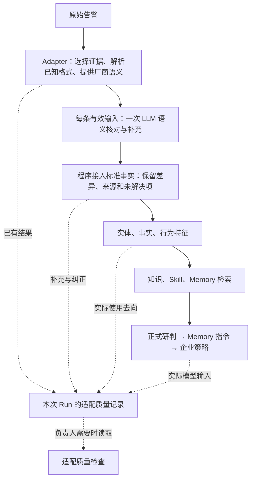

# Normalization Assistance / 日志语义核对与适配质量检查

Status: In progress / 常规模型核对首批内核已接入、默认关闭；真实输出验收及消费者/质量检查仍未完成

Date: 2026-09-14
Roadmap owner: `PI-03E`；沿用现有路线，不改变当前内网验收指针。

已接入的下游整改：[Memory 复用范围与经验细分方案](memory-reuse-scope-remediation.md)，实际验收见第 16 节。
该方案处理相同检测的模型分类差异如何进入稳定特征、未覆盖行为如何阻止错误直接复用，以及
人工细分范围。新 apply Run 已采用新版语义；旧 Run 与旧 Memory 保持冻结，不自动改写。

## 2026-09-17 补充：事实身份与重跑稳定性

`2480991` 的两次原始输入相同，但模型曾分别把 `rule_id` 和 `_origin.sig_id` 放入
同一个 `detector_id`。这不是字符串排序或 hash 问题。现以 Prompt v9/类型化 identifiers
保留两种身份，已知字段由 PingAn Adapter 声明，通用合并器按固定优先级选择匹配身份；
其他厂商可通过相同协议接入，Runtime 不识别平安原始字段名。

同一告警、完整输入、租户和核对请求配置相同时，服务从该告警最近 20 条运行中寻找兼容
事实快照，复用事实而非结论；当前 Memory、策略与主研判仍正常重新执行。
“重新核对事实”复选框显式重算，输入/模型/Prompt/配置变化也自动失效；失败/跳过结果
不进入复用。引用来源、实际调用数、Token 与前后事实 hash 留痕，旧运行不改写。
这是有界的历史复用，不是跨 Worker 的首轮调用锁，也不保证不同新告警的所有模型抽取完全一致。

真实核对一次成功：OpenVPN 主身份 `0x5dc9` 和 Nmap `0x4ef7` 保持各自来源，后续相同输入
零次核对调用、匹配特征相同。旧经验未覆盖新发现的 Nmap，因此保持参考用途，不能以
“稳定”为由抹掉真实新增行为。详细验证、草稿刷新修复与后续操作见
[范围整改第 17 节](memory-reuse-scope-remediation.md#17-2026-09-17事实稳定性修复与验证)。

## 2026-09-16 补充：完整研判方法与企业知识连接

- Skill Context v3 加载已选 `SKILL.md` 和包内 Markdown 参考方法全文，不再取前 240 Token；
  S-* 保存完整正文，模型输入的 Skill 清单仅保留元数据，避免重复正文。
- 审核 Memory 正文、企业知识和 A-* 字段语义不经过原始证据的 4,000 字符裁剪；
  Memory 条件先用完整值比较，不再将 256 字符相同前缀误当相同条件。
  经验起草保留单项来源全文，超出整体请求预算时显式报错，不生成缺失后半段依据的经验。
  原始日志去重、编码压缩、原始证据预算和整条/整份选择仍保留，不等于全量塞入日志。
- 语义 Prompt v7 在既有 supplementary facts 中增加可选 `clue_type`：
  `url/domain/application/file_path/process`。自由命名的 `name` 不是 API；旧无类型事实继续可读。
- 通用 `supplementary_fact_patterns` 必须在同一条有来源的线索中匹配全部条件。
  域名使用边界匹配，URL 的 `/#/` 或 `/#!/` 只用于识别应用页面路由，不回写 HTTP 请求路径。
  不把多个日志的域名和路径拼成一次命中，不依赖平安字段名或 AskBob 硬编码。
- PingAn `internal-systems` 1.1.0 单独声明 AskBob 报文线索知识：同一地址中的
  `paic.com.cn` 域名与 `/pws/askbob-gpt` 路由组合。现有 canonical HTTP 知识保持独立。
  其他企业 URL、应用名和文件路径通过同一协议配置，不需要新 Runtime 分支。
- 主研判 Prompt v43 要求解释有意义的业务线索：为何采纳或拒绝该解释、对应 E/C 引用。
  信赖已审核服务身份；业务解释可支持无 Memory 的误报判断，但不改写连接事实或动作权限。
  不新增模型调用、数据库迁移、Memory 版本迁移或行为指纹规则。

验证分两类：合成案例证明跨企业匹配、域名边界、来源隔离、全文保留；真实单条
`2025642` 验证提取、知识进入模型、解释及方向/角色，不能由单条声称整体准确率改善。
证据目录：`backend/.deer-flow/soc-validation/shell-reverse-knowledge-bridge-20260916/`。

实跑 `RUN-95A4952AFC1B`：26 项补充全部进入模型，AskBob 知识匹配并被决策推理引用；
此前 true_positive/80% 变为 suspicious/62%，企业策略仍转交。五元组、内网方向和角色
归属不变；16 条事实及 7 条推理引用通过，无输出付费重试/降级/fallback。
完整 Skill 正文仅在 S-* 提供一次；两包分别 11,298/8,467 字符。语义+主研判 46,855 Token
（此前 41,670），Runtime 26.416 秒，恢复轮开始至后置策略保存 34.689 秒。
首次 Web 尝试被 DEV 热重载中断，使用既有服务恢复，保留旧 Run；中断调用费用未知，
不计入上述成功轮用量。页面最新轮选择同步为 started_at，避免恢复父记录更新遮住新结果。
282 项聚焦回归及 1 项恢复展示回归通过。本次没有验证整体误报率、批量稳定性或内网接口。

## 1. Decision / 已确认的主线

**模型从“代码发现异常后的补丁”，改为正常处理中的语义核对与补充。**
对于启用范围内、存在有效原始证据的每条告警，默认核对一次。
不要求 Adapter 先发现残留，不以“已有指纹”“解析成功”“没有高价值缺口”跳过模型。
每天最多约一万条告警的规模下，用户接受额外模型调用；调用次数不是排除本方案的理由。

**归一化运维改为适配质量检查。按需的是人查看，不是系统才开始记录。**
每次 Run 自动留下原始来源、Adapter 结果、模型差异、合并结果和实际消费去向。
负责人按需检查单条或汇总已有记录，判断该改 Prompt、Adapter、标准契约还是消费者。
不要求安全运营认领维护问题，不增加一个模型专门写诊断报告。

两个概念不能混淆：
- 每条让模型核对，不等于每条让模型重写全部输入。
- 调用成功或模型声称“完整”，不等于全部语义已经覆盖。

以下对象保持独立：
| 对象 | 责任 |
|---|---|
| 当前事实 | 从本次原始证据识别主机、进程、文件、网络等，供本次下游使用 |
| 厂商适配规则 | 已发布的输入选择、字段语义和稳定解析，不由模型在线改写 |
| 业务经验 Memory | 对风险和适用范围的已审核业务判断；抽取结果不是 Memory |

不做模型生成代码后在线执行、新任务库、新 Agent、第二套 Memory、自动批准经验、自动规则发布。
不引入 EDR/HIDS 外部查询或全量历史自动重算。钓鱼邮件信赖上游 ML+LLM 检出，
按用户决定暂缓专用兼容，最后按旧流程处理，见历史记录 13.7。

## 2. As-Is / 现状与问题

| 部分 | 当前实际能力 | 尚未完成 |
|---|---|---|
| Adapter | 已知格式解析、message 优先、标准实体及 raw；KV v3 留语法区间 | 不保证未知字段语义全部接住 |
| 模型补充实验 | 2448412 真实调用已补出五项事实 | 实验脚本不是生产入口，不得从 validation 导入 |
| Runtime | 已在 entities 前接入可注入的语义核对、合并和 journal；默认 off | 首批只支持九个单主体字段；真实输出与后续消费尚未完整验收 |
| 归一化运维 | 完成 Run 后记录基线、截断等问题 | 不能充当前置门控；现有噪音未解决 |
| 指纹消费者 | 消费一部分标准进程/网络行为 | 检测文件、部分观察等仍存在消费缺口 |

2448412 暴露了三种不同问题：旧解析器将命令读为空；文件等字段读到了但未标准化；
标准事实补出后，部分消费者仍未使用。不能靠单一“覆盖率”解释这三件事。
KV v3 修复已经保留，但不再把扩写解析器作为接入模型的先决条件。

## 3. Cooperation / 三者如何协作



模型核对发生在首次 Memory 检索前。不能在主研判完成后才补字段，却声称影响了本次召回。
原始告警无有效证据时不凑一次调用；恢复重放优先复用同输入、同配置的已保存结果。
未来节省调用属于有质量证据之后的优化，不恢复“代码发现问题才允许模型看”的默认门槛。

## 4. Input / 给模型什么

- 按既有输入策略选出的原始日志及必要同事件上下文。
- Adapter 已有的标准事实，明确是待核对初稿，不是不可修正的答案。
- 厂商声明的字段语义；只在 integration 内维护厂商别名、约束和背景。
- 当前支持的标准目标与观察关系，正常、损坏、无新增事实、多事件的输出示例。

不能只给程序识别出的残留；否则无法发现程序不知道的遗漏。
message 存在时继续独占事件事实，不混入被排除的外层加工字段、relatedAlertList 或运营标签。
没有 message 时核对 Adapter 选择的 structured fallback，不换成整份上游包。
无可解析 message 而存在原文时，模型仍可理解它；若要从 fallback 切换为 message 事实，
必须整条输入分支切换并留痕，不能悄悄拼接。首批未支持该切换时明确跳过，不冒充已核对。

大输入沿用去重、代表选择、编码压缩。多个消息保持独立来源/事件身份。
保存选中、未选中及截断范围；代表消息通过不等于全部消息都已检查。
不是每条无限输入，也不是默认只检查第一个然后声称全覆盖。

## 5. Output / 模型与程序的分工

模型直接输出本次可接入的结构化事实，不是等待人工改代码的映射建议。
允许补充缺失值、识别错误截断、提出纠正与无法表达的重要事实；不输出风险结论或处置权限。
已有非空值不能被视为天然正确，但纠正必须说明来源和理由，不能静默覆盖。

程序负责：
1. 验证支持的字段类型和事实所属消息/观察，保留逐项成功与失败。
2. 核对原文出处；允许明确的格式标准化，记录转换，不要求模型机械复制完整 AlertInput。
3. 将有效结果接入现有标准契约；固定派生字段由代码生成。
4. 对无法安全区分的多值/关系保留未解决项，不拼出不存在的事件。
5. 保留合并前后差异，不能把“引用存在”当成语义必然正确。

首批只接经过验证的事实类型，不意味着未支持的事实不重要。
未支持的新关系记录其原文与原因；新增通用关系需要扩展标准契约和消费者，
不是每个新厂商别名都必须新增 Python 分支。
来源可信度与抽取方式分开：LLM 提取不自动降低上游检测可信度，也不赋予新的业务授权。
模型不会因为 D 盘目录、topic 名称或程序名自行声明授权或无风险。

## 6. Quality / 每次怎样留下可用的检查记录

语义发现由本次模型核对完成；程序核对实际去向，不再增加诊断模型。
语法区间是辅助证据，不是调用模型的门票，也不是完整性证明。

针对重要事实保留：
| 维度 | 内容 |
|---|---|
| 原始来源 | 消息身份、位置/引用；raw 沿用本次 Run，不重复存整份 |
| Adapter 结果 | 原来得到什么，未读入还是未标准化 |
| 模型结果 | 新增、纠正、无差异、关系未明确或暂不支持 |
| 合并结果 | 采纳值、前后差异、未采纳的具体原因 |
| 后续用途 | 标准事实、实际研判输入、行为匹配、明确背景或未接入 |
| 版本与耗时 | Adapter/Prompt/模型/特征版本、请求 Hash、Token、分步与总耗时 |

消费核对必须针对同一来源事实，不能用另一个事件的非空字段抵消遗漏。
不是所有字段都需要参与指纹。IP/时间/随机编号不必是核心行为，明确背景不等于丢失。
对已声明的消费要求可确定性核对；未知语义保留“未评估”，不冒充自动证明根因。

2448412 的目标解释：
“完整命令已补入进程事实并进入研判；yak.exe 已形成文件观察，
若行为匹配尚未使用，应检查文件检测特征，而不是再补一次命令解析。”

## 7. Inspection / 按需检查与升级决策

复用现有 Run、执行轨迹和 /workspace/soc/normalization 技术入口。
入口默认只读，移出运营必经导航；不要求认领、填写原因或关闭问题。
不因浏览页面调用 LLM、重跑告警或扫描全量原始 PKL。

| 现象 | 处理方向 |
|---|---|
| 模型补得正确且下游用上 | 当前链路有效，无需立即升级 Adapter |
| 模型经常混淆进程与检测文件 | Prompt、字段语义、标准观察关系及质量对照 |
| 标准事实有值但需要它的消费者没接住 | 指纹/投影等消费者 |
| 同类不合理拆分或异类合并 | 特征和匹配规则；不能只看有没有指纹 |
| 原文本来没有信息 | 明示上游不足，不要求模型补不存在内容 |
| 核对调用或合并连续失败 | 现有技术监控暴露，不制造运营人工审核队列 |

缺少基线、正常编码压缩、已有等效补偿的预算省略仅留技术信息。
模型已解决的问题不继续挂成待修。已有旧问题不伪造关闭；没有足够历史证据不补写“已解决”。
高频模型补充不是故障，也不自动要求固化成代码。

汇总按需读取已有记录：受影响独立 alert_id 数量、来源/规则、已解决与未解决项、
代表样本和版本。重跑次数单独计，不冒充独立告警数量。
升级前后用相同代表样本比较事实、分组/匹配和研判效果；不以模型自报覆盖率验收。

## 8. Integration / 生产接入与兼容

- 通用 Runtime 只认识标准请求、事实、核对结果和固定步骤；PingAn 选择器/语义在 integration。
- normalize_alert_payload 和离线索引保持纯函数，不暗中联网。
- SocAnalysisService 的组合入口注入能力，Web/API/CLI/Worker 共用，不只做演练脚本。
- 使用 DeerFlow 模型工厂和 SOC client，共享准入；不新建模型网关、任务库或无限线程池。
- 核对用小输出契约，实际内网默认不强加 max_tokens；继承模型配置和 chat_template_kwargs。
- 增加独立 provider purpose/请求类型，journal 在调用前持久化。不能伪装成正式研判请求。
- 结果随现有 AnalysisRun JSON 保存，旧记录字段缺失表示未记录，不反算成历史事实。

模型失败保留既有可用输入并记录具体失败，不凭辅助抽取失败把有效 verdict 一律转交。
原文不可用继续执行原有证据可用性规则。模型失败不能显示“核对通过”。
失败/跳过/部分成功不能通过 journal 最终状态伪装为全成功。

## 9. Recovery / 恢复、并发与发布控制

发布开关仍可用 off/shadow/apply：
- off 是未启用或回滚，不是按解析异常筛选。
- shadow 对范围内每条有效输入核对，保存候选结果，不改变实际标准事实/Memory。
- apply 对范围内每条有效输入核对，有效事实进入下游。
先隔离验证，再启用现有 DEV；本次不自动改当前工作台配置、旧 Memory 或整库分组。

同一 Run/相同输入与配置的恢复优先复用已持久化核对结果；未落盘的远端调用不能承诺不重复计费。
缓存身份包含输入、来源选择、Adapter、Prompt、目标契约、模型配置；不按 rule_code 缓存 IP/路径。
重试和超时沿用共享机制，第一版不另加语义修复循环。
恢复复用尚未实现时必须明确限制接入范围，不允许对外宣称完整恢复已交付。

每步记录时间、reported/estimated/mixed Token；没有价格和人工真值不编造成本和准确率。
一万条/天约 0.116 条/秒是平均流量，不是峰值承诺；实测共享并发、排队和超时，
但不再以省一次调用为理由让未知遗漏绕过语义核对。

## 10. Memory And Index / 下游不能断链

标准事实与消费者必须一起验收。事实进入模型，不等于指纹已经用到。
指纹使用稳定的结构化行为成分，不直接 Hash 模型自由文本。
不将主机/IP 的变化误当行为必然变化；检测标签不同也不自动要求拆组。
新增特征必须验证同类跨 IP 泛化、同 rule_code 不同场景区分、旧 Memory 适用范围不被放大。

离线列表仍可能是 Adapter 初分组。启用补充后，已运行结果使用最终事实/特征快照解释归属，
未运行记录不冒充已核对；不在页面读取时补调用模型。
接入当前工作台 apply 前要完成最终组、候选、Memory 来源与索引的一致展示。
不清空数据库解决兼容，不静默重写已审核经验。

## 11. Delivery / 当前实施顺序

| 切片 | 交付与验收 |
|---|---|
| A | 常规核对请求、Prompt、合并、Runtime 前置步骤、Run/journal 留痕；已有完整输入也调用，不依赖残留 |
| B | 文件/进程/网络等消费者及用途核对，真实样本事实→行为→Memory 输入验证 |
| C | 现有技术入口降噪、按需汇总、执行轨迹与最终分组一致性；启用 DEV apply |
| D | 代表样本稳定性回归、版本对比、内网交付和真实验收 |

A 不等待所有解析器支持精确残留，也不等待基线审批或运维页面重做。
每片标明已实现、模拟验证、真实模型验证和未完成项，不将单样本成功当成全部32组通过。

首批验证包括：2448412、2450017、2455416、已有完整字段的对照、原文为空、
多消息同名值、字段非空但截断、跨事件错误关系、模型失败、恢复与影子不变性。
聚焦测试优先，真实调用先小样本，不自动扩为全量15,286条。
实验按月度 soc-experiment manifest 记录代码/upstream、模型/config/data Hash、硬件、命令和指标。

## 12. Acceptance / 做好与否怎么判断

- 模型不受旧解析器“没报错”限制，能主动发现语义遗漏。
- 已补事实进入所需下游，而不是只写入 extensions 或漂亮报告。
- 正常日志、空输入、未支持语义分别有真实状态，不虚构“100%完整”。
- 核对与正式研判分开计时、Token、journal；旧逻辑、权限与 Memory 治理保持兼容。
- 负责人能从具体样本决定改哪层；成功补充无需变成运营待办。
- 新版相较旧版改善哪些样本、还差什么，有同输入对照；失败不靠放松精确匹配掩盖。

## 13. Historical Evidence / 历史实验与范围决定

以下保留此前实验事实。13.1–13.8 的“异常才调用、优先修 Parser”等旧实施顺序
已被本文件 1–12 节替代，不作为当前策略。实验成功不代表在线功能已经完成。
钓鱼邮件暂缓等用户范围决定仍有效。

### 13.1 2026-09-14 首个隔离试验结果

只试 `2448412`，未修改线上 Runtime、Adapter、Memory 或索引。
验证脚本在 `validation/compact_zeus/audits/normalization_assistance_trial.py`，
小合同先限制为主机名/IP、进程路径/命令、文件路径五个目标；这不是完整性覆盖声明。

- 确定性检查确实发现 24 个 KV 匹配中的 `cmdline` 空值，以及字符区间 `[145,195)` 的命令残留。
- 两次真实调用均使用 `globalai-deepseek-v4-flash-0731`、thinking off、非流式。
  请求构造已核对 `extra_body.thinking.type=disabled`；响应仍记录 reasoning，
  分别达到 2048/4096 输出上限，未返回最终 JSON。不能据此采纳事实，也不能把该响应当成抽取成功。
- 首轮 42.48 秒 / 3404 Token；原文直接文本复测 41.31 秒 / 5472 Token。
  同时调整了原文呈现与输出预算，不能归因于单个 Prompt 因素；停止继续扩大调用预算。
- 离线回读失败响应后，标准事实和指纹均保持原样；事实采纳为 0。
  这是保留原路径的对照，不是一次完整 Runtime 研判，未检索/写入 Memory 或生成候选。
- 当前结论：残留检查可行；真实模型补充及其指纹收益尚未得到证明。
  下一步应先查清当前模型通道的推理/输出行为，再继续小样本验收，不启用线上 apply。

原始两次尝试：`backend/.deer-flow/soc-validation/normalization-assist-2448412-20260914*/`；
重点对比：`backend/.deer-flow/soc-validation/normalization-assist-2448412-20260914-review/10-comparison.json`。
这些是显式试验产物，非新增的常驻报告系统；既有候选 `MC-4DB33FF49C6C` 未变更。

### 13.2 同日模型通道排查：已确认什么，尚不能确认什么

检查顺序为配置、模型工厂、SDK 实际 HTTP 序列化、SDK 响应处理、绕过 SDK 的直接请求。
未修改全局模型配置、Prompt、生产 Runtime 或数据库，未再跑完整告警。

| 检查 | 实测结果 | 可以排除/确认 |
|---|---|---|
| 真实模型工厂 + HTTPX MockTransport | HTTP body 顶层为 `thinking={"type":"disabled"}`，`stream=false`；没有 `extra_body` 嵌套 | SDK 已把 extra_body 展开；关闭参数没有在本地丢失 |
| 模拟响应：正文空、只有推理 | SDK 保持正文空，推理留在 additional_kwargs | 没有本地“拿推理补正文”的行为 |
| 模拟响应：正文 JSON + 推理，或两者重复 | SDK 原样保留各自内容 | 前两次正文异常不能归因于 SDK 拼接；但未保存那两次的原始 HTTP body |
| 绕过 LangChain/OpenAI SDK，直接请求 GlobalAI | 显式 disabled 后仍有 reasoning_content；这次也返回正确 JSON | 异常已到中转/上游响应边界，不是 SOC 解析器生成了推理内容 |

直接请求仅用虚构输入 `只输出一个 JSON 对象：{"ok":true}。不要解释。`，不带告警、Memory 或 Skill。
结果：HTTP 200、finish_reason=stop、正文 11 字符、reasoning 26 字符，二者不同；
返回模型名仍为 `deepseek-v4-flash-0731`。输入 99 / 输出 17 / 合计 116 Token，耗时 23,322 ms。
输出上限 256，未重试。这是通道探针成功，不是五字段抽取成功或稳定性证明。

当前安装版本：langchain-deepseek 1.0.1、langchain-openai 1.2.1、langchain-core 1.4.9、
openai 2.32.0、httpx 0.28.1。关闭参数符合
[DeepSeek 官方 Thinking Mode 契约](https://api-docs.deepseek.com/guides/thinking_mode/)。
**不能据此断言中转“丢了参数”、强制开启了某条路由，或模型内部具体如何执行**；
这些需要服务端请求/路由记录。能够确认的是：显式 disabled 与返回推理字段的行为不一致，
以及前两次请求均耗尽输出预算、没有最终 JSON。不能仅凭这一点保证换个通道就一定抽取正确。

同时修正试验脚本的诊断：在线尝试与离线回读共用解码入口，先检查 `finish_reason=length`，
再解析 JSON；失败文件明确记录 `provider_output_truncated=true`，避免误导为 Prompt 未遵守 Schema。
新增 6 项离线检查，总计 19 项通过。不以放宽引用校验或增加预算来掩盖通道行为。
下一步只需确认服务商关闭推理参数/路由，或经确认选择另一条已配置通道做单样本对照；
当前继续保持隔离试验，不启用在线补充。复现命令与结果摘要见 audits/README 的“模型通道排查”。

### 13.3 vLLM 参数对照：不采用，保持原配置

经用户同意，仅在进程内复制 GlobalAI Flash profile，把 when_thinking_disabled 改为
`extra_body.chat_template_kwargs.enable_thinking=false`；实际 HTTP body 已确认只有
`chat_template_kwargs`，没有同时保留官方 `thinking` 字段。模型、虚构提示词、temperature=0、
非流式、256 输出上限及 45 秒 timeout 与 §13.2 短探针相同，不带真实告警。

| 关闭写法 | 有效 JSON | 返回 reasoning 字符数 | 总 Token | 本次耗时 |
|---|---|---:|---:|---:|
| 官方 thinking.type=disabled（此前探针） | 是 | 26 | 116 | 23.322 秒 |
| chat_template_kwargs.enable_thinking=false（本次） | 是 | 102 | 128 | 31.681 秒 |

两种写法都没有得到“关闭后无推理内容”的预期响应。单次、非同时对照不能证明性能差异，
也不能从字符数推断内部推理强度。停止继续调整参数/增加预算，没有重跑完整告警，
没有把 vLLM 写法应用到全局 Flash 或 Pro 配置。

初次连接发生 ConnectError（530 ms，无 HTTP 响应/usage）；随后获准在沙箱外测试，
得到上述一次 HTTP 200/finish_reason=stop。全局 config.yaml 的 SHA256 与缓存 profile 均未改变，
临时配置随进程结束丢弃，因此无须部署回滚；运营 DB、Memory、服务均未改动。
产物：`backend/.deer-flow/soc-validation/globalai-thinking-parameter-20260914/`，
其中 `unrestricted/01-request.json` 是实际请求体，`02-response-summary.json` 是返回形状/用量，
`00-manifest.json` 保留配置、模型、数据、代码、硬件、命令。探针脚本同目录；不保存推理正文。

### 13.4 8192 输出预算：单样本成功，修正失败归因

用户要求继续核对 max_tokens。仅将 §13.1 第二次抽取的 max_tokens 从 4096 改为 8192，
模型、Prompt、messages、thinking=false、JSON mode=false、timeout=90、retries=0 均保持不变。
请求文件对比已确认只有该控制值改变。2048/4096 是试验自己设置的上限，并非服务商能力上限。

- 真实告警 `2448412` 返回 finish_reason=stop，实际输出 5573 Token，输入 1376，总计 6949。
  Provider 56.932 秒，全流程 57.577 秒；正文为 987 字符的有效 JSON，仍有 reasoning 元数据。
- 主机名/IP、进程路径/命令、文件路径五项均通过逐字来源与标准契约检查，5 accepted / 0 rejected。
  原先为空的标准字段得到补充；来源附带原始 message 字符区间。未虚构 bash 执行 yak 的关系。
- 使用生产消费者后 mention 数 3 -> 8，进程/文件观察各 0 -> 1；新增行为指纹，强度 weak_only -> strong。
  文件路径与命令进入 bounded request；未转换的检测字段仍在原始 parsed evidence 中，未丢弃。
- 指纹目前主要来自 bash 进程/路径，并未证明病毒类型、检测文件等跨样本区分已经足够。
  没有运行主研判、实际 Memory 检索/写入或分组索引更新，不能将这次成功当作在线或召回质量验收。

修正结论：本次完整输出确实超过 4096，试验预算偏小是失败的直接因素；
不能把前两次截断直接归因为模型无抽取能力或 Prompt 无法遵守 JSON。
关闭推理后仍有推理返回是另一个接口行为问题，但本次证明它并不必然导致抽取失败。
单次成功也不保证所有同类请求在 8192 内完成。试验默认预算改为 8192，增加显式 --max-tokens；
不自动递增预算或重试，不改线上模型配置。相关离线测试 24 项通过。

完整过程：`backend/.deer-flow/soc-validation/normalization-assist-2448412-20260914-8192/`。
审阅入口：`06-validation-and-merge.json` 看五项来源，`10-comparison.json` 看补充前后，
`11-manifest.json` 看真实调用、Hash、耗时与 Token。下一步是字段/指纹质量审阅与同类稳定性，
不是重新调整思考参数，也不是将每条告警都固定增加该调用。

### 13.5 下游消费者对照：发现遗漏，不将有指纹当作通过

只读索引中，天融信 `RPAADM_002661` 共 315 条，其中 306 条没有指纹。
这只是索引分布，不代表已对 315 条做完整语义审核或模型抽取。
选取其中 8 条，复用 `2448412` 的已保存真实模型回答；其余 7 条使用明确标注的
原文字段测试输入（literal_test_control_not_llm），模拟“这些标准字段已经补好”，
只验证后面的生产消费者。没有新增模型调用，不能声称 8/8 模型抽取成功。

| 样本 | 对照结果 | 暴露的边界 |
|---|---|---|
| 2448412 | 五项真实补充仍有效；指纹主要为 bash.exe/进程路径 | yak.exe 是标准文件观察且模型可见，但未参与指纹；GoExec.a/HackTool 仍只有原始检测证据 |
| 2448580、2459908、2464210、2466490、2483048 | 都产生同一个 explorer.exe 指纹及相同默认必需条件 | 其中存在 LNK.Agent.b/Trojan、LNK.Starter.aj/Trojan、LNK.Phorpiex.a/Worm 的差异，未体现在范围中 |
| 2450017 | 形成 msvsmon.exe 的进程指纹 | 这不能证明 FileCopyTool.exe/MSIL.Stealer.iu 的文件检测语义已被覆盖 |
| 2455416 | wirelesscm.exe 文件路径补入，仍无指纹 | proc_path=System 不是路径，本试验不强填；仅补主机/文件不能让当前消费者形成有效行为成分 |

这五条同指纹告警共有 10 个对照组合：7 对带检测名称或类别差异，3 对只是文件/出现上下文差异。
前者证明应保留的检测语义没有参与范围；后者是否合理泛化仍需审核，不能算成 10 对已确认误分组。
默认必需条件相同不等于已发生错误改判：本轮没有实际 Memory 检索、审核/激活、Directive 或 Policy。
生产读取位置为 `memory/facets.py::_behavior_components` 和
`integrations/pingan/memory/profile.py::_pingan_canonical_behavior_components`；后者仅将指定
endpoint_action_target 中的注册表目标类别用于核心指纹，不消费普通 observed_artifact 文件身份。

产物：`backend/.deer-flow/soc-validation/normalization-assist-consumers-20260914/`。
先看 summary.json，再看对应 `<alert_id>.consumers.json` 的 source、merge、field_destinations、
canonical、bounded_request 和 facets。字段表只对已检查的 KV 单元负责；cmdline 的残留修复
在 merge 中展示，不能用旧解析器读到的空值覆盖补充后的命令。
8 条消费者检查总计 526.729 ms，原文不变；34 项离线测试通过，新增调用/Token/运营写入均为 0。
不代表真实模型重复抽取稳定性、完整 Runtime 或线上检索质量已验收。

下一步执行重点（沿用 §11，不增加阶段/平台）：

1. 完成已定位 KV 引号/消费区间缺陷及按需检查，避免把检测遗漏伪装为“缺少基线”。
2. 扩充小型抽取契约所支持的检测事实，不把 virus_name 塞进 rule_name 或 IOC，
   不用自由生成的安全结论当指纹；观察作用域、标签原值和来源必须保留。
3. PingAn 的文件检测行为组成规则同时消费检测事实和正确关系的文件观察，
   先验证不同检测类型不误合、同类跨 IP/用户名不过分拆组，再按 §7.2 版本化接入。
4. 上述消费者缺口解决前保持线上 off/shadow，不花钱扩跑来掩盖确定性缺陷，
   不批量修改当前 Memory、数据库和演练分组。

### 13.6 32 组范围核查与内网输出预算

2026-09-14 用户要求继续分析通用性，未要求直接修改线上 Profile。只读当前索引，
无指纹的 32 组覆盖 1,074 条告警；每组选第一条重新检查原文及 Adapter 标准事实。
这是 32 条代表检查，不是 1,074 条逐条语义验收；同组内部也可能有不同缺口。

| 来源 | 无指纹组数 | 告警数 |
|---|---:|---:|
| 天融信杀毒 | 1 | 306 |
| 蜂巢 CNSP | 3 | 371 |
| 联软 EDR | 15 | 193 |
| 青藤 HIDS（两个 topic） | 4 | 139 |
| SIEM 模型告警 | 2 | 29 |
| edr-core | 2 | 4 |
| 默安蜜罐 | 1 | 11 |
| SOAR 钓鱼网站 | 1 | 5 |
| 资产风险视图 | 2 | 15 |
| APT | 1 | 1 |

核查已经证明不能把 32 组统一归因为“需要 LLM 抽取”：

- `2448932`：两条 CNSP message 已产生 12 个进程节点，含 kubectl；单值 process_name 为空。
  当前通用 facets 读取单值进程名，PingAn 附加规则也未遍历进程观察。先修按观察作用域消费，
  不把全树节点无区别拼成一个执行行为，不再为已有节点重复花费一次模型调用。
- `1980265`：两条蜜罐网络观察已有访问来源、目标 IP 和 8001 端口；没有协议，当前
  `_network_services` 要求协议与端口同时存在，故未形成服务成分。需要表示真实存在的
  蜜罐访问/目标端口，不为凑 tcp/8001 而猜协议。
- `2447850`：标准 command_line 已有 PowerShell 路径，进程名/路径为空；现有命令特征
  仅关注部分模块和开关。规范化可确定的执行文件与消费者读取都需检查，不能只说原文没信息。
- `1965802`：structured fallback 已有邮件地址、主题、链接等标准实体和观察，正文仍在模型证据中，
  当前行为成分未覆盖邮件。按用户随后确认，暂不以此推进补抽取或新指纹，最后按旧项目兼容，见 13.7。
- `2454280/2573336`：原文有 Webshell 检测标签及文件信息；`2498551` 有探测描述、代理与蜜罐
  地址，`2554115` 有伪冒网站 URL/域名。分别需要正确的文件/检测和网络/网站标准事实，不能套用
  本次五字段单消息白名单。代理端口不能冒充受攻击服务端口。
- `1965795/1965452` 的代表输入没有原始行为日志；资产风险视图代表也只有规则与部分 SOAR 信息。
  保留已有信息，不由规则标题或 localhost 地址编出行为指纹；不能据代表判断整组所有样本均为空。

通用方案是同一套来源检查、标准观察、小型抽取、合并与下游用途核对；
实际特征按进程执行、文件检测、网络访问、网站等可复用行为类别构建（邮件暂缓，见 13.7），
不是为 32 个组 ID 写分支，也不是把全部字段 Hash 进去。
已经有标准事实时优先修消费者；原文有而标准事实缺失时才考虑补充；真正缺原文时不抽取。
多消息和 structured fallback 沿用既定优先级与作用域，单消息试验尚未实现这些通用边界。
因此当前只能确认架构可推广，不能宣称已完成 32 组或保证所有组都应有强指纹。

内网 max_tokens 核查（只构造请求，不访问模型、不打印凭证）：

- `backend/samples/pingan_dev/config.example.yaml` 与本机 `config.pingan-dev.local` 均未配置
  max_tokens/max_completion_tokens。经实际 create_chat_model 构造、开启/关闭推理分别序列化后，
  四个请求均无这两个输出上限；chat_template_kwargs 和 stream=false 按预期保留。
- `DeerFlowLLMChatClient::_get_model` 只覆盖 disable_streaming，不额外强加输出上限。
  `PingAnModelGateway::_prepare_request` 透传调用方字段，也不自动添加输出 Token 上限。
- 2048/4096/8192 来自本次隔离抽取试验；128 来自只要求短回复的模型连通 smoke，
  都不是生产研判的默认上限。未来在线补充应继承内网模型配置，默认不传该参数，
  不把外网试验的 8192 搬成跨环境固定限制。显式实验预算与 Provider 默认模式需要分别记录。
- 不传参数表示由模型服务决定，不等于无限输出。vLLM generation_config 中的 max_new_tokens
  可以形成服务端上限；模型上下文容量同样有限。内网服务具体配置尚未取得，不能由本地构造验证
  证明服务端无截断。参考 [vLLM serve 文档](https://docs.vllm.ai/en/latest/cli/serve/#--generation-config)
  与 [DeepSeek Chat Completion 文档](https://api-docs.deepseek.com/api/create-chat-completion/)。
- 保留并发、超时、输入上下文预算、结构校验和 usage/finish_reason 记录；这些不是同一个
  max_tokens 输出限制，不因内网无计费额度压力而一并取消。本轮没有改配置或生产代码。

### 13.7 钓鱼邮件：信赖上游检出，最后兼容旧流程

状态：**Deferred / 用户明确暂缓，其他适配工作完成后最后处理**。属于现有 `PI-03E` 范围，
不新增路线；本节是后续约定，不代表已修改运行逻辑或完成邮件处置对接。

- 用户确认：这类钓鱼邮件告警已经过上游机器学习 + LLM 检出。信赖该检出结论，后续按旧项目
  邮件流程兼容，不另起一套“是否真是钓鱼”的重复判断，也不因缺少行为指纹而否定上游结果。
- 当前停止邮件专项抽取、指纹/Memory 分组改造和追加模型试验。不要求当前 32 组核查中的
  邮件组也必须生成强指纹才算本轮完成；历史无指纹统计保留，不通过删除样本美化指标。
- 后续实现以用户提供的
  `validation/original_works/my_workflows/zeus/flows/active_inhibition_processing.py`
  为入口，连同 `disposition_tools/prompt.py` 和 `disposition_tools/phishing_email_disposition_tool.py`
  核对主题/原文段落提取、发件人/链接处理及处置参数。以实际执行分支为准，不只抄文件头说明。
  平安处置细节仍放 PingAn integration，不搬进通用 Runtime，也不恢复已排除的 relatedAlertList 判断。
- 已核查 `1965802`：没有 message，按既有高可信 structured fallback 使用自带字段；
  邮件地址、主题、链接已标准化，118 字符正文完整进入 bounded primary evidence，未发生正文丢失。
  这只能说明当前字段去向，不能当作邮件专用兼容已经交付。
- 重新开始时先核对旧流程与现有 action/provider 的衔接，再做不产生真实外部动作的隔离验证；
  真实处置沿用项目已有授权与内网验收边界。本次没有修改邮件代码、Memory、配置或数据库。

### 13.8 首个生产修复：KV 引号与语法消费区间

本轮只完成确定性解析基础，不启用在线补充，不改字段映射/Memory Profile 或工作台索引。

- `PingAnQuotedKvMessageParser` 升级 v3。对外层双引号中、以内层引号开始的完整值，保留成对的
  未转义引号及多个命令参数；恢复不得跨越可能的下一个字段。引号不平衡、格式不明确时保留原文
  区间，不猜成空值，也不吞掉随后完整字段。普通转义和 HTML 实体继续沿用既有行为。
- 通用 `ParsedRawMessageEvidence` 增加可选 `syntax_coverage`。记录字段/值、合法前缀、
  未消费文本的左闭右开字符区间，以及重复/冲突/恢复字段名；不复制一份原始 message。
  旧结果缺少该字段时为 None，不假造已检查。只有 PingAn KV parser 产生当前观察；没有厂商语义
  进入通用 Runtime，也未改变其他 JSON/逗号/loose KV parser 的实现。
- 同值重复保留每次出现的来源区间；不同值重复不再最后一个覆盖前面值，冲突键不进入唯一值映射，
  原文与每个出现位置仍可审计。未消费片段/冲突进入既有 parser warnings；成功恢复、合法空值、
  同值重复不追加降级警告。不仅凭这些标记自动创建业务复核或自动调用 LLM。
- 留痕位于 `extensions.parsed_raw_messages[].syntax_coverage`，随当前规范化结果保存。
  字符区间不进入 bounded LLM evidence；恢复后的实际字段值按既有投影进入模型。
  `complete=true` 只表示语法消费完整且无重复值冲突，不表示实体映射完整或指纹质量合格。

真实对照共 8 条，使用只读 payload SQLite、生产 Adapter 和 bounded request builder；
基线是冻结的 v2 matcher，并非重跑旧主研判。第一次发现 `2450017` 有多组带引号参数，
补充同语法回归后再次对照：

| 样本 | v2 解析 | v3 解析与模型证据 |
|---|---|---|
| 2448412 | cmdline 为空，命令残留未上报 | 完整 bash 命令，恢复字段为 cmdline；模型证据可见 |
| 2450017 | cmdline 为空 | 完整 msvsmon 命令及带引号 DLL 参数；模型证据可见 |
| 其余 6 条 | 原字段值 | 全部保持一致，没有为生成指纹额外补值 |

最终 8 条语法 complete=true、raw 全部不变，耗时 1032.028 ms，新增调用/Token/运营写入均 0。
79 项生产 parser/消息链路/归一化路由与维护测试、35 项离线试验/消费者检查通过。
没有跑主模型、全量后端或前端回归，没有修改邮件、Memory、配置或数据库，没有重新打包。

产物：`backend/.deer-flow/soc-validation/quoted-kv-parser-20260914-final/`。
从 `summary.json` 看字段变化与模型可见性；对应 `<alert_id>.parsing.json` 看 before_v2、after、
syntax_coverage 和 current_canonical。命令和 Hash 在 summary 与月度实验记录中。
当时提出的“先检查、再异常触发”顺序已撤销，按本文件 1–12 节常规语义核对执行。
不能因为修好引号就宣称此前 32 组已修复，钓鱼邮件仍最后处理。

## 14. Initial Checkpoint / 首批九字段实现与真实验收

2026-09-14：完成切片 A 的首批内核，不代表全部事实类型、32 组或 DEV 上线验收通过。

- `application/analysis.py` 通过 `SOC_NORMALIZATION_ASSIST_MODE=off|shadow|apply` 注入生产
  reviewer，共用现有 SOC 模型 client/准入；默认 off，没有改当前工作台配置。
- 位置为 Adapter 之后、实体/事实/Memory 输入之前。九个通用目标为主机名/IP、进程路径/
  命令/PID/父进程名/父命令、文件路径、账号。不包含厂商字段别名或风险结论。
  首批只核对选定主消息；其余消息数量/路径、草稿限长和未提供的语义说明明确记录。
- 模型可补缺失值、纠正有原文支撑的非空值；同一单值字段多主体、已有进程树纠正、
  新路径与旧哈希归属暂不自动合并。逐项失败不吞掉其他可用事实。
- `AnalysisRun.normalization_assist_request` 保存冻结输入，`normalization_assistance` 保存
  模型结果和前后差异；调用前 journal 使用独立 `normalization_assist` purpose。
  相同输入/配置且已落盘的恢复复用结果，显式重跑仍重新核对。
- 有效事实进入标准实体；检测文件同时形成独立文件观察，不自动声称由某进程执行。
  `model_input_status` 检查实际 canonical 模型投影；`matching_status=not_assessed`
  明确行为匹配尚未验收，不能用 raw 留存或非空字段冒充消费者已接入。
- 模型异常/输出不完整保留 Adapter 路径，辅助步骤和 journal 留失败，不改成核对通过。
  调用次数、Token（无 usage 时估算）、步骤和总时间接入现有 Run/统计。

**真实模型试验没有通过：** `2448412` 调用一次 GlobalAI Flash，显式 thinking off、
未覆盖 max_tokens，但返回 `finish_reason=length`、输出 8192 Token，仍有 reasoning 字段。
本轮没有完整结构化核对结果，采纳 0 项；输入 2109、总 Token 10301、Runtime 82.635 秒。
这不能证明模型语义抽取失败的根因，也不能证明内网默认同样受限；不传上限不等于服务端无限输出。
不自动加预算或循环重试，不用手写结果替代失败。原始数据保留，主研判使用显式 stub，
所以该试验只验证核对入口与失败后原路径可继续，不证明真实研判/Memory 效果。

产物：`backend/.deer-flow/soc-validation/normalization-runtime-review-20260914/`，
先看 `summary.json` 和 `04-review-result.json`；再看冻结请求、Prompt、provider journal
及 `05-runtime.json`。该产物保留调用时版本，不事后改写成收尾代码的结果。

后续按原切片继续：先拿到完整真实核对输出，再验证文件/进程等实际消费者；随后改造现有
检查入口和已运行分组展示，才启用 DEV apply。没有改旧 Memory、索引、数据库或自动关闭旧维护记录。

### 14.1 用户授权再试一次与失败隔离复核

同日按用户要求再调用一次，模型配置不变、仍不覆盖 max_tokens。
原始告警相同，但上一轮收尾已缩小 Adapter 草稿投影并增加省略记录，完整 Prompt Hash 不同；
不能称为完全相同请求的稳定性复现，也不能把耗时下降单独归因于 Prompt 改动。

| 指标 | 上次 | 本次 |
|---|---|---|
| finish_reason | length | stop |
| Runtime 耗时 | 82.635 秒 | 9.710 秒 |
| 输入/输出 Token | 2109 / 8192 | 2076 / 1662 |
| 总 Token | 10301 | 3738 |
| 补充并进入模型输入 | 0 项 | 5 项 |
| 核对结果 | failed | partial，完整输出但范围未全覆盖 |

本次五项是主机 `LQSZ-L06099`、主机 IP `10.118.160.64`、bash.exe 进程路径、
完整 `--login -i` 命令以及 `D:\SCAN\CyberStrikeAI\sec-tools\nuclei\yak.exe` 检测文件。
partial 并非本次截断：哈希、病毒类型等未纳入九目标；空账号、执行关系和无定义状态码也留说明，
没有因此拒绝五项可用事实或编造 bash 执行 yak 的关系。仍有 reasoning 字段，关闭请求未改变。

本次输出不到 8192，不证明远端不存在该上限。现有证据只能确认上次响应 length；
无法判定由中转还是上游模型服务设置。没有新增预算或第二次自动重试。
产物：`backend/.deer-flow/soc-validation/normalization-runtime-review-20260914-retry1/`；
主研判仍显式 stub、未调用 Memory，不能当作最终风险结论或召回质量验收。

复核另外发现并修复：原先只包住 reviewer 的模型调用/解析错误，准备输入、reviewer 实现异常、
合并异常仍可能阻断整个 Run。现统一隔离辅助阶段，保留 Adapter 和 raw，继续原主研判；
合并未应用的提议留在 `normalization_assistance.metadata.unapplied_changes`，不标记为已应用。
连接错误、超时、429/502、空/坏 JSON、错误结构及上述三个程序故障以离线注入验证，
不额外调用模型。真正的主研判失败仍是可重试 Run 失败，journal/持久化失败仍停止调用，
不能把故障隔离解释为“无论哪个模块坏了都显示完成”。

## 15. Typed Observations / 类型化事实接入（2026-09-14）

本节是当前实现；§14 保留当时九字段版本的真实模型记录，不混作 v2 验收。
本次完成 Schema、通用合并器、事实/模型输入和 PingAn 指纹消费者接入。该后端切片未启用
在线开关、修改旧 Memory 或索引、调用真实模型。随后 DEV 前端对比入口见 §16。

### 15.1 一份标准告警，不新增平行链路

```text
Adapter 选择可信输入、产出初稿
  -> LLM 核对原始消息和已有对象
  -> 通用合并器：类型检查、可选引用校验、同源绑定、局部合并、来源留痕
  -> 同一份 AlertInput
  -> 原有实体/事实重建、bounded request、E-* 证据目录
  -> 原有主研判；PingAn Profile 消费新的标准事实
```

Adapter 不调用模型、不导入模型实现；普通 Runtime 不识别 `virus_name` 等厂商字段。
模型负责把字段解释为通用对象和检测事件；代码负责验证引用、字段类型和对象关联并合入标准结构。
不是为每个告警再写一段别名映射，也不是把厂商原文直接复制进 Memory 匹配条件。

### 15.2 Schema 与消费位置

输出为 `objects/events/additional_facts/unresolved` 四个数组。前三个各最多 40 项，
最后一个最多 20 项；对象属性稀疏填写。Schema 位于
`backend/soc_agent/contracts/normalization.py`，Prompt 位于 `backend/soc_agent/prompts/normalization.py`。

| 内容 | 合入位置 | 下游用途 |
|---|---|---|
| 进程、父进程、命令、PID、进程镜像哈希 | 既有 `entities.process.observations[].nodes` | 实体/事实、主研判、进程行为特征 |
| 被检测文件、文件名/路径、明确归属的 MD5/SHA1/SHA256 | 既有 `entities.file.observations` | 文件证据及关联检测特征 |
| 连接地址/端口/协议、HTTP 方法/状态/URL | 既有 network/http observations | 网络/HTTP 证据，已支持的服务特征 |
| 主机、账号、容器 | 新增 `entities.context_observations` | 主机/账号实体和可引用上下文；不声称所有属性已用于匹配 |
| 病毒名/类型/检测 ID、上游结果/动作 | 新增 `entities.detections`，subject_refs 指向标准对象路径 | 事件证据；部分类型用于 PingAn 指纹 |
| 计数、未知状态码、无法归属的哈希 | 新增 `entities.supplementary_facts` | 保留值与含义供研判，不强行生成行为指纹 |

请求提供 `L0...L7` 独立来源和 `O*` 已有对象目录。模型只用 O* 或本次对象 ID 关联，
不填写任意 canonical 写入路径。明确引用已有对象时只给变化属性即可，原 ID、关系、
未变更字段来源仍保留。代码不跨消息拼进程链，不将 bash 的哈希挪给 yak.exe。
events 的 name/category/reported_result/action 保留上游原文；kind 和 supplementary meaning
是模型整理的语义，不冒充原始字段名。无法确定归属时允许无 subject，但不会凭此产生强匹配。

**以 2448412 的目标效果说明（不是本次真实模型结果）：** bash.exe 是运行进程，yak.exe
是被检测文件，GoExec.a/HackTool 是该文件的检测描述；virus_id 仍为检测标识。原文若不能确定
某个哈希属于哪个文件，就保留独立补充事实，而不是丢弃或随便挂到其中一个对象。

### 15.3 输入边界、失败与检查

- 启用后对有选定证据的告警常规调用，不依赖缺基线、截断或无指纹等告警信号。
- 首消息与补充消息共享 48,000 字符，最多 8 条；完全重复文本去重并计数。原始告警不修改。
  预算用尽时保存未核对路径/数量；已有对象目录最多 40 项、16,000 字符，超限也记录。
  这些是输入预算，不是新加 `max_tokens` 输出上限；本次没有改内外网模型参数。
- 一项对象属性或事件引用错误只隔离该项；有效事实继续。空/坏 JSON、length 截断、连接失败
  等保留 Adapter；准备/合并异常也隔离。真正主研判及持久化失败不伪造成功。
- `normalization_assist_request` 看输入/省略；`normalization_assistance.observation_changes`
  看前后值/来源/是否实际进入模型投影。逐字段 provenance 只标记变化字段。
  `unresolved` 不再装所有“当前没有专用字段但有价值”的事实。
- 当前只支持表内类型和有来源的标量补充；统计多行、完整容器拓扑等不声称已结构化。
  “完整语法消费”“有事实”“进入模型”“产生合适指纹”仍是不同检查结论。

### 15.4 PingAn 特征版本与 rollout

`SOC_NORMALIZATION_ASSIST_MODE=off/shadow` 保持 Profile 7 / features v5；只有 apply
选择独立 Profile 8 / features v6，沿用 30 天聚合。旧版记录不能被新算法重新解释。

新特征保留“检测类别/名称 + 对象”的配对，而非各取一个无关联集合。例如同样有两个文件和
Trojan/Worm，但检测对象交换，必须得到不同特征；两个目录下的相同 yak.exe 检测则可泛化。
检测文件名、绑定的目标端口、同一观察内进程关系可被消费；不直接以文件哈希、IP 或用户目录
作为这些新增强锚点。只知道 explorer.exe 等进程名不自动声称已获得高质量强指纹。
没有协议的蜜罐端口可保留，不能编造 TCP；非法 Cookie-as-protocol 不进入 v6 协议特征。

这不是全类型指纹设计完成：统计/配置事件等保留可引用事实，不强行分组。现有主摘要与观察
指向不同对象时分别保留；只用名称猜测同对象、跨来源合并和未知关系仍不做。
工作台离线索引不会暗中调用 LLM。本次没有自动重建索引、更新旧经验适用范围或切换服务；
真实模型抽取、跨样本指纹质量和运行后分组展示通过后，再安排 DEV apply 与明确的索引处理。

### 15.5 样本与验证边界

- 从当前 15,286 条的只读 index/payload store 选取 32 个无指纹组代表，再加近期 17 个
  代表 ID，去重后 43 条。39 条构建核对输入，4 条选定证据为空而跳过：
  1965452、1965795、2694695、2694696。不是从外层随便找文字假装有原始证据。
- 3 条存在未核对补充来源、1 条存在输入截断；都留范围。最长完整 Prompt 65,144 字符，
  不等于 Token；调用 0、运营写入 0。这个检查不测 LLM 抽取准确率。
- `2448932` 发现的 dotted-key/混合 comma-KV 解析回归已恢复：quoted-KV v4 保留完整点号键，
  同时让 comma 记录回到原解析器，`detail.process_tree` 走明确 PingAn alias；本次可见 12 个
  进程节点、2 个独立消息。不是增加万能正则，也没有撤销 LLM 常规核对。
- 新增离线测试覆盖 Schema→合并→事实→真实构建的模型输入→可引用 E-*、对象归属、稀疏修订、
  局部失败、同路径跨消息、目录泛化、检测配对、Profile 隔离。测试使用明确标注的 synthetic
  模型响应，不把通过率当作真实模型质量。
- 下一次经确认的真实验收可使用 `validation/compact_zeus/audits/normalization_runtime_review.py`；
  新增 `03-output-schema.json` 与 `06-matching-features.json`，主研判仍标注 stub，禁止写 Memory。
  先检查 2448412 / 2455416 的对象归属与检测，再扩大到其他场景。
- 按需检查 UI、原 maintenance 噪音收敛、32 组全量真实抽取验收仍未完成；钓鱼邮件 1965802
  按用户决定最后处理，信赖上游机器学习/LLM 检测，不另做邮件深解析。

## 16. DEV 页面核对体验（2026-09-14）

入口仍为 `/workspace/soc/corpus-validation`。搜索 `2448412`，关闭“仅显示未运行告警”后
点击重新运行；完成后点“查看结果 -> 打开完整审计 -> 语义核对记录”。

- 新阶段显示三步实际耗时；模型调用期间显示正在核对，不误标成后续验证。
- 按用户最新决定，删除专门的前后对比组件和切换页签。完整冻结 request/result 通过既有
  JSON 浏览器查看、搜索和下载，不重新解析原文或调用模型。前后值仍保留在审计数据中。
- 当时本机 `.env` 显式为 `SOC_NORMALIZATION_ASSIST_MODE=shadow`，服务已重建并读取该值；
  项目默认仍 off。用户运行时会真实调用核对模型，但建议不进入主研判或 Memory 匹配。
  原有主研判与 Pattern 流程照常运行；shadow 不表示整条 Run 没有模型调用或持久化。
- 已有结果保持原样，无核对记录就不伪造核对阶段。失败/跳过明确写出沿用 Adapter 或未执行。
  没有清空数据库、重建分组或修改已有经验。apply 和 v6 特征质量仍另行验收。
- 本轮页面验证使用合成保存结果，浏览器没有业务 POST；真实 `2448412` 只读确认可重跑。
  14 项聚焦后端测试、桌面 1440/手机 390 浏览器检查和前端类型/lint 通过。
  较宽的旧 210 条本地语料测试另外发现指纹覆盖快照 `192 -> 191` 的差异，未通过改断言
  掩盖；该旧计数基线待与前序 Adapter 修改单独复核，不作为本轮质量通过依据。

这是单条效果的按需检查入口；原归一化运维噪音收敛、32 组真实模型质量检查尚未关闭。

## 17. 默认信任模型整理与显式输出上限（2026-09-14）

本节取代前面历史实验中“所有模型引用必须精确唯一命中”的默认要求。

- 新增 `SOC_NORMALIZATION_REFERENCE_VALIDATION_ENABLED=false`，默认关闭原文片段唯一性、
  字符位置和值必须位于同一引用内的机械校验。可设 `true` 恢复严格模式；找不到片段记录
  `missing_quote`，重复片段记录 `ambiguous_quote`，不再混用同一个错误码。
- 仍检查 JSON/类型、允许的标准字段、来源编号、对象归属及预算；不会把其他日志的检测
  拼到当前对象。关闭引用校验不等于关闭所有安全校验，也不更改主研判 Grounding。
- 请求与配置哈希冻结开关；旧冻结请求缺少开关时保留历史严格语义。未校验变更记录
  `reference_validation_status=not_checked`、空起止位置和 `#semantic-unverified`，不伪造定位。
- Prompt v3 明确按原文含义整理属性，引用短片段供回看，默认不要求计算字符位置。
- 本机忽略提交的 `config.yaml` 仅 GlobalAI Flash/Pro 设置 `max_tokens: 24576`；官方直连和
  PingAn 内网配置不改，思考开关不改。真实抽取失败仍保留 Adapter 并继续主流程。
- 单次 `2464210` 实验请求 24576、关闭引用校验，`stop`，输出 4032 / 总计 6472 Token；
  12 项对象/检测/补充记录通过类型和合并，并在后续模型输入中找到，issues 为空。
  此实验实际 apply 到隔离的 Runtime 输入，主研判显式 stub，Memory/运营库写入均为 0；
  **网页仍为 shadow**，不自动切换 apply 或改变旧分组。12 项通过不代表抽取准确率 100%。
- 本次输出不足 8192，不能据此认定服务商已取消 8192 上限；只确认显式参数和一次完整结果。
  请求虽关闭 thinking，服务商仍返回 reasoning，保留该事实，不宣称已控制其内部实现。

产物：`backend/.deer-flow/soc-validation/semantic-review-2464210-24576-unchecked/`。

## 18. V4.1 六例复验与合入可靠性（2026-09-15）

按用户请求，外网默认改为 GlobalAI `deepseek-v4.1-flash`，先通过项目模型工厂验证，再跑
3 条历史失败与 3 条原本已有强指纹的对照。显式关闭 thinking，七次核对（含一条修复后复测）
均 stop、无 reasoning、无超时。请求 max_tokens=24576；SDK timeout=240 秒，Runtime 外层
270 秒，不自动重试；没有改 PingAn 内网配置。返回模型名实际是
`deepseek-v4.1-flash-expires-on-0910`，只记录服务商回传值，不据后缀猜测有效期。

| 告警 | 本次核对耗时 | 离线消费结果 |
|---|---:|---|
| 2448412 | 14.95 秒 | 18 项进入模型投影；HackTool/GoExec.a 绑定 yak.exe，恢复完整 Git bash 命令，弱特征变强 |
| 2448932 | 11.92 秒 | 19 项进入模型投影；两条消息分别保留 kubectl PID/命令/检测归属，弱特征变强 |
| 2455416 | 7.39 秒 | 15 项进入模型投影；Trojan/ShellLoader.auj 绑定 wirelesscm.exe，弱特征变强 |
| 1965449 | 11.61 秒 | 29 项进入模型投影；补充弱口令检测与 HTTP 请求对象的关联，保留原强特征 |
| 1965810 | 9.19 秒 | 20 项进入模型投影；补充服务进程/通信对象，保留原强特征 |
| 1984510 | 11.77 秒 | 20 项进入模型投影；补充 SAM/SYSTEM 对象与上下文，原强指纹不变；进程名/路径冲突仍未解决 |

### 本轮真实发现并修复的代码问题

- 空值 `cmdline=""` 忠实保留后，合入错误地产生非空 provenance，导致所有补充回退。
  现在保留空值和变化记录，只跳过空标量 provenance；不发明值。
- 同时修改主文件和嵌套文件观察时，后一次修改污染前一次快照。现在创建与合入时深拷贝，
  保留快照一致性门禁。`1984510` 旧失败产物保留，单独真实重跑验证，未改写旧快照。
- 接受层不再因错误的可选数组丢掉其他有效区块；JSON/长度/调用异常明确标记阶段和原因。
  历史 `2448412` 的 generic ValueError 没有原回答，不能断言就是本轮两种合入缺陷之一。
- Prompt v4 约束四个输出数组、短引用、检测器编号与直接检测对象。普通未知信息仍保留，
  不把所有疑点/partial 视为失败，也不因供应商超时让主研判断点。

### 价值和未完成项

本轮 121/121 个接受后的记录进入离线构建的完整模型投影，原始数据 6/6 完整，未删掉
原有行为组件，三个原无指纹样本恢复强特征。记录数不等于新增信息数，也不等于准确率。
对已覆盖告警，一部分输出只是重复元数据；1965810 同时绑定父/子进程、2448932 把事件编号
当 detector_id 等质量问题仍可见。1984510 成功指出旧名称/路径组合存疑，但因改变已有对象
身份而被隔离，其依赖检测也未合入：只能说发现问题，不能说修正完成。

六条 Web 主研判均为真实模型、结构 accepted、无 stub，Base 均 suspicious；因为网页仍为
shadow，这不是补充后结论改善/降噪率证明。特征对比是离线 apply，不写运营 Memory 或重建
工作台索引。五条离线重新收集无额外模型调用，1984510 修复后单独多跑一次。
当时正式 apply、32 组全面覆盖、同模式多次指纹稳定性、归一化运维降噪和邮件尾项继续保留。

可读结果及逐条文件索引：`backend/.deer-flow/soc-validation/globalai-v41-20260915/README.md`。

## 19. 外网 DEV 实际采用与工作台衔接（2026-09-15）

用户确认后，本机 `.env` 已切换 `SOC_NORMALIZATION_ASSIST_MODE=apply`，Gateway 重建后
API 已确认读取 apply。不是只改提示文字；成功补充进入同一标准告警，再供事实重建、模型
输入和 Profile 8/v6 特征消费。项目默认仍 off，内网私有配置未改。

- 历史查看按 Run 保存的核对模式选择 Profile，再核对实际签名；不按今天的开关重解释历史。
- 重跑交给 Pattern 服务按当前 Profile/签名/告警 ID 去重，不能无条件复用旧 observation。
  同一告警、相同行为重跑仍计一次；真正改变行为的结果不挂到旧指纹。
- 已运行行的行为特征来自实际模型输入，而非离线 Adapter 索引。离线分组仍是选样导航，
  未调用模型重算 15,286 条或改写已审核经验。旧版本 Memory 不自动扩大适用范围。
  指纹覆盖、可复用标签与筛选同步采用该运行的特征；新签名的重复数量只认实际 observation，
  不把旧离线组里的所有样本算作已经通过语义核对的新同类样本。
- 被检测文件、检测对象关系、进程关系采用中文标签和既有逐项勾选；不是所有新增元数据
  都进入核心行为。UUID、检测器编号、文件哈希未被作为这些新增核心锚点。

### 实际结果与剩余问题

| 告警 | 结果 | 后续消费 |
|---|---|---|
| 2448412 | 完整 Web 流程成功，16.073 秒、2 次模型调用 | 17/17 调整合入且进入模型投影；生成 Profile 8 observation，计数 1；yak.exe、HackTool/GoExec.a 对象配对进入核心条件 |
| 2651342 第一次 | 核对成功，主研判失败；24.692 秒、2 次调用 | 24/24 调整合入并进入模型输入；失败不生成 Pattern/Memory |
| 2651342 第二次 | 核对成功，主研判仍失败；25.518 秒、2 次调用 | 24/24 调整合入并进入模型输入；失败记录保留 |

2448412 的 partial 表示 `result=0` 含义、client_ip 与主机绑定仍有疑点；不是 17 项补充被撤销。
纯函数生成的 candidate preview 验证 Profile/指纹/核心条件一致，**没有创建、审核或启用新
Memory**，是否沉淀由用户操作。旧 shadow Run 保留原样。

2651342 额外两次主研判诊断发现：SDK 收到字符串并调用 `model_dump`，HTTP 直读确认
GlobalAI 向非流式请求返回 `text/event-stream`，仅 usage、空 choices、0 completion tokens
与 DONE，没有可用答案。不能从 HTTP 200 推断调用成功，也不能仅凭 33,144 prompt tokens
断言服务端限制为 32k。没有修改模型参数、伪造结论或反复自动重试来掩盖问题。
其两次核对虽均完整结束，但检测标签与对象绑定不同，产生不同指纹；稳定性待审仍为真实
未完成项，不能将这两条失败 Run 作为可发布经验的质量证明。

122 项聚焦后端回归、1 项新前端组件测试及 1440/390 宽度共 3 项浏览器回归通过。
产物：`backend/.deer-flow/soc-validation/semantic-apply-20260915/summary.json`；含旧/新 Run、
实际特征、只读候选预览和原始 HTTP 响应。32 组全面验收、归一化运维噪音收敛、邮件尾项未关闭。

### 随后修正：完成后页面仍转圈

用户重跑2448412，`RUN-27F7B3FD181F` 已在18.924秒完成：核对6.789秒、主研判11.691秒，
15项补充采用，8条引用通过、无拒绝；后台活动任务为0。UI完成反馈只监听activity列表变化，
没有消费execution终态，漏掉短时claim时可能一直保留本地running。
现已通过本次Run终态触发最终列表刷新；排除旧Run完成状态，列表缺行或刷新失败也不无限
转圈。显式focus结果暂时绕过运行引起的readiness/处置对比变化，避免补出指纹后从原筛选
消失。用户更改筛选即解除focus。新增浏览器重现覆盖首次运行、重跑；并发及候选通知回归
通过，后端补充后focus测试通过。本次排查只读真实结果，未新增模型调用。

### 2026-09-15：SOC 模型输入紧凑序列化

失败请求 `RUN-6A2B6881DF01` 的三次隔离诊断：原排版在输出上限4096、24576时均返回
HTTP200空SSE、33680输入Token、0输出Token；只把analysis_context重新序列化为紧凑JSON，
保留全部事实与字符串内容，得到24764输入Token、1645输出Token、13.07秒正常JSON答案。
这证明了该请求的无损规避办法，不能据此断言GlobalAI的精确上下文上限为32k。

现已落地SOC专用 `utils/model_json.py`：主研判、语义核对、角色复核、经验生成、策略建议、
主/局部/角色/经验输出修复、归一化映射建议统一紧凑发送；SOC MCP结果文本也保持紧凑。
原本已紧凑的Lead/Sub Agent SOC上下文不变；不改DeerFlow核心、自然语言/原始字符串空白、
审计格式、Provider签名、Memory/Profile或数据契约。Prompt版本分别升级为analysis v42、
normalization v5、role v6、lesson v8、policy v3，修复Prompt也独立升级。

代码完成后的单条真实Web回放 `2651342 / RUN-288A23688711` 已完整结束：21.118秒、
2次Provider调用、无额外重试；24项语义补充全部采用且进入模型投影。主研判输入23260、
输出1474Token，输出accepted、无局部降级，14条引用通过、0拒绝；观察
`MPO-ABC612AFE353` 已保存，工作台终态completed。核对仍保留两个真实语义疑点，不伪造完全
覆盖或准确率结论。本次新模型补充与诊断冻结输入不同，不能用这条新Run计算无损节省比例。

三组聚焦回归133/71/5项通过（部分重叠），另有ruff和diff检查。原始失败Run与旧Memory保留，
未重建索引或自动审核经验；只有一次完整Web回放，不代表批量稳定性验收。对照与本次结果见
`backend/.deer-flow/soc-validation/semantic-apply-20260915/2651342-primary-request-ab.json`
及 `compact-model-input-rollout.json`。

相关入口：

- [系统方案](../soc-agent-solution.md) 与 [当前生命周期](../alert-lifecycle-flow.md)
- [工程契约](../../reference-index/soc-agent-engineering-contracts.md)
- [Roadmap](../delivery-roadmap.md)、[进度](../progress.md)
- [PingAn Memory 设计](../memory/pingan-soc-memory-design.md)
- [外部集成与 Deferred](../integrations/README.md)
