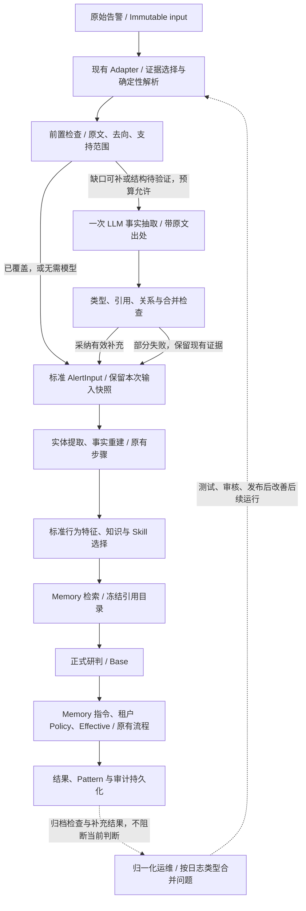

# Normalization Assistance / 日志适配检查与模型事实补充方案

Status: Proposed / 设计待评审，尚未实现在线补充  
Date: 2026-09-14  
Baseline: `eba3f16c`，已推送 `origin/yyds-dev`  
Roadmap owner: `PI-03E`，复用现有任务，不新增平行路线或修改当前内网验收指针。

## 1. Decision / 核心决定

**保留 Adapter，增加可解释的覆盖检查；必要时让模型直接补充当前日志中的事实，
再进入现有实体、指纹、Memory、研判与 Policy 流程。保留归一化运维，负责长期修复与成本收敛。**

三个对象必须分开：

| 对象 | 回答的问题 | 生效范围 |
|---|---|---|
| 当前告警事实补充 | 这条原文里的主机、文件、进程等是什么？ | 当前输入及其有版本的处理结果 |
| 厂商适配规则 | 这一类日志以后怎样稳定地解析、转换？ | 审核发布后的指定产品/日志类型 |
| 业务经验 Memory | 此类行为为什么有风险或无风险，何时可复用？ | 已审核、已启用且适用的后续告警 |

模型补出一个文件路径，不等于发布新的 Adapter，更不等于确认该文件无风险。
普通安全运营人员不需要逐条审批事实抽取；他们仍审核业务经验。适配维护由平台/接入工程师按日志类型处理。

本方案不做：全量每条固定增加模型调用、模型自行生成 Python/正则并在线执行、
OCSF 中转层、第二套 Memory、自动审批经验、自动修改上游规则、重新引入 EDR/HIDS 外部查询。

## 2. As-Is / 当前问题与已有基础

### 2.1 已核实的实例

`2448412` 的持久化运行是 `RUN-46354BEA33B0`；人工提前提炼候选为
`MC-4DB33FF49C6C`。以下是本地审阅结果，不是模型补充方案的验收结果。

| 环节 | 现状 | 后果 |
|---|---|---|
| quoted KV 解析 | `cmdline=""C:\Program Files\Git\usr\bin\bash.exe" --login -i"` 被读成空字符串 | 尾部命令没有被统计为解析残留 |
| 标准事实 | `hostname/proc_path/file_path/client_ip` 有解析值，但未进入相应标准实体 | 模型看到了部分信息，指纹与选择器却没接住 |
| 模型研判 | 原有模型引用病毒名、路径、主机等，并给出可疑结论 | 不能说整条告警没有被研判 |
| 行为匹配 | 仅有宽泛的“主机失陷”行为成分，没有行为指纹 | 候选主要依靠检测规则及数据范围，不能直接精确复用结论 |
| 覆盖报告 | 已解析字段均进入模型，且高价值缺口为 0 | 没有证明原文无遗漏，也没有证明实体/指纹覆盖完整 |

### 2.2 可复用能力与实际缺口

| 现有模块 | 已实现 | 本次不能假装已有的能力 |
|---|---|---|
| `normalizers/pingan_messages.py` | 多种解析器、嵌套修复、原始内容保留 | 原文消费区间、重复键损失与歧义的完整检查 |
| `normalizers/mapping.py` | 简单厂商 payload 的显式字段搬运配置 | PingAn message 的完整声明式语义映射引擎 |
| `pipeline/evidence_coverage.py` | 解析/标准事实/模型投影路径及省略原因 | 独立于解析结果的原文遗漏检查、前置补充触发 |
| `pipeline/field_importance.py` | 已登记的高价值来源到目标规则 | 未知字段的完备语义识别；逐观察的值与关系覆盖 |
| `normalizers/suggestions.py` | 离线映射建议，校验来源路径和目标白名单 | 在线事实抽取；现有建议 Prompt 主要看路径，不看完整原文值 |
| `core/normalization_maintenance.py` | 基线、去重问题、人工确认与事件留痕 | 模型补充效果、规则固化和完整性验证版本的管理 |
| `core/runtime.py` | normalize → entities → facts → context → analysis | 实体提取前的有界模型补充步骤 |
| `core/service.py` | Run 持久化、模型请求 journal、事后运维监控 | 对独立抽取请求的 journal/recovery 兼容 |

代码是当前行为依据；方案中的新名称、配置和状态均为拟议契约。

## 3. Coverage / 怎样知道覆盖与残留

不使用一个“覆盖率 100%”来承诺理解了全部信息。分别检查以下三件事。

### 3.1 原文账：读了哪些、留下哪些

解析器返回已读取区间、字段值位置、合法分隔符/日志头区间和未解释区间。
偏移针对原始字符串，明确采用字符索引；Hash 使用 UTF-8 原始字节。
HTML 解码、转义还原等另记转换方式，不拿转换后的偏移冒充原文位置。

- KV 不再只凭 `findall` 得到若干字段即认定完整；修复共享引号处理，覆盖转义引号和字段间边界。
- 重复 key 保留出现顺序及对应片段，不先压成字典再声称没有丢失。
- JSON 检查完整读取、尾部、重复键和嵌套文本；不能用字典加载结果证明原文没有重复字段。
- 合法前缀、分隔符、明确的编码压缩单独记账，不算缺失安全证据。
- 无法解释的区间必须保留。模糊边界可以保留多个候选，不凭长度百分比决定正确解析。
- 嵌套 JSON 损坏继续保留字符串；日志本身截断时，不要求模型补出原文不存在的后半段。

这能发现 `cmdline` 尾部残留，但不能证明一个“被完整读到的值”已经被赋予正确语义。

### 3.2 去向账：逐条来源事实，而不是检查目标非空

每个非空字段实例及有意义的原文片段，允许记录多个用途：

| 用途 | 判定依据 |
|---|---|
| 原样保存 | 原始输入 Hash、消息身份和来源位置 |
| 标准事实 | 具体观察中的字段和值、转换方式与来源一致 |
| 模型证据 | 值确实出现在冻结后的模型输入或受控压缩表示中 |
| 匹配特征 | 指纹组成或可选收窄条件明确引用该标准事实 |
| 明确保留为背景 | 有版本的使用策略说明原因，如随机标识不作为核心行为 |
| 用途未知/待适配 | 未知语义、目标契约未支持，或没有可验证的消费去向 |

某个 `process_path` 非空，不能代表所有消息的进程路径都已接住；
某个 IP 被提取了，不能代表它被正确区分为主机 IP、网络源或攻击者。
核对单位包含消息/事件/观察身份，不允许拿另一条记录的值抵消本条缺口。

字段不必全部进入指纹。IP、精确 Hash、时间、账号可能是实体或收窄条件；
检测名称、进程/文件关系、目标服务等是否进入行为核心，由版本化特征规则决定。
“已进入标准事实”与“有足够稳定特征生成强指纹”仍是两项独立结果。

### 3.3 支持范围账：未知不等于已覆盖

三种检查结论：

- **已验证范围内通过**：来源/日志类型、解析器/映射/消费者版本在已验证范围内，当前输入无异常。
- **发现具体缺口**：有残留、丢失的重复值、已知重要事实未映射或已映射但下游未消费。
- **尚未验证**：新的结构、类型变化或缺少覆盖验证记录，不能因为“缺口为 0”就视为完整。

现有“接受 Schema 基线”只表示认可一组结构指纹，不是完整性认证。
不得把旧 baseline 的 accepted 状态自动升级为“无需抽取检查”。需补充验证范围、版本、样本与结果引用。

结构指纹由字段路径、类型和日志类型等形成，不含 IP/时间/随机字段值。
Schema 指纹与 Memory 行为指纹不是同一个东西：前者管理日志格式，后者区分安全事件。
新的可选字段先进入未知用途记录；经确认无关的可选字段可纳入兼容规则，不让每次出现都触发告警风暴。

同样的字段结构也可能改变含义，因此保留低比例、可配置的离线抽样复核。
纯代码检查和模型抽取都不能保证发现所有语义变化；质量证据来自代表样本及持续反馈。

首次上线先从已有来源回归和代表样本建立支持范围，不将全部旧基线一键标为通过。
缺少覆盖验证也不能导致存量全部告警突然各增加一次模型调用：先限定来源、抽样和调用预算，
预算外明确保留“尚未验证”，仍走原有可用研判路径。未发现问题不冒充已验证，未验证也不等于有风险。

## 4. Trigger / 何时调用模型

前置检查必须在正式研判前执行。现有 Run 完成后的维护 monitor 不能负责决定已经发生的模型调用。

| 情况 | 行为 | 是否直接影响安全结论 |
|---|---|---|
| 已验证范围内通过 | 继续 Adapter 路径 | 否 |
| 有可恢复残留/已知映射缺口 | 对当前允许的证据发起一次有界抽取 | 抽取后由现有研判决定 |
| 未知结构、缺少语义覆盖验证 | 在启用范围与预算内进行抽取；登记结构级问题 | 不直接变成可疑/待审 |
| 标准事实已有，下游指纹没有消费 | 记录消费者缺口，修消费者；不重复调用模型 | 不凭此降低有效 verdict |
| 原文无事实可提取、只有空字段 | 不调用，不让模型编造 | 沿用现有证据可用性处理 |
| 正常编码压缩、明确的背景字段 | 不单独触发 | 否 |
| 预算耗尽、模型不可用或契约不支持 | 记录未补全原因，保留现有可用路径 | 按实际影响范围处理 |

不能只以“没有行为指纹”触发。也不能只以模型自报置信度决定“覆盖已完成”。
调用的输入是待补片段和必要的同一事件上下文，不是只给残留字符，也不是全量 relatedAlertList。
大消息沿用去重/代表选择/编码压缩思路；明确记录未抽取的消息，不能把代表覆盖冒充整条覆盖。

## 5. Runtime / 如何接入现有链路



补充必须在实体、指纹及 Memory 检索之前。不能只在主模型输出末尾增加几项实体，
否则当前告警已经完成的 Memory 检索仍然缺失这些条件。

### 5.1 Ownership / 模块边界

| 所有者 | 工作 | 不做什么 |
|---|---|---|
| PingAn normalizer/integration | 来源选择、厂商字段说明、来源特有的类型与语义约束 | 不改通用 Runtime 以认识 `proc_path` 等字段 |
| 通用 SOC 检查与补充服务 | 检查报告、补充协议、来源验证、合并、预算与审计 | 不内置厂商字段名或风险豁免 |
| DeerFlow 模型工厂与现有 SOC client | 模型选择、调用、内网兼容、共享准入 | 不另建模型网关/Agent/任务队列 |
| Runtime | 固定调用顺序、保存补充前后快照、调用既有下游 | 不自修改 Parser，不改变审批与处置权限 |
| Memory Profile/特征消费者 | 稳定特征组成、强匹配与适用条件 | 不直接 Hash 模型自然语言，不解析厂商 raw |
| 运维服务 | 合并问题、验证范围、发布/回滚记录 | 不替运营审核无风险业务经验 |

保持 `normalize_alert_payload()`、离线索引构建等纯函数无网络副作用。
通过 `SocAnalysisService` 注入可选的补充能力，Runtime 控制步骤；Web/API/CLI/Worker/批量共用它。
没有注入或开关为 off 时，保持现有行为。不得只在告警演练页面实现补充。

### 5.2 Message-first / 输入优先级

已选中的 message 路径继续独占事件事实；平台加工字段只按现有许可提供身份/路由元数据。
模型输入不能暗中加入 relatedAlertList、运营标签、被排除的外层加工字段或其他租户信息。

对“所有 message 都无法确定性解析、当前已选择 structured fallback”的情况，需要显式分支：

1. 先保留完整 Adapter fallback 快照。
2. 在已启用的 PingAn 策略下，仅向抽取模型提供原始 message 及允许的元数据，不混入 fallback 事件事实。
3. 如果得到可引用、满足最小观察契约的结果，可选择 raw-message 补充分支，并整体重新构建事件事实。
4. 若不满足，保留原 fallback；不得把两条分支的事件字段拼成一份“完整事实”。

这是需要版本化并单独验收的证据选择扩展，不假装它已经属于当前确定性解析契约。
首个试验先处理 `2448412` 这样的“已有 message 解析、部分事实缺失”；完全未知语法随后单独放行。

## 6. Contract / 模型究竟返回什么

不要求模型生成整份 `AnalysisResult` 或 `AlertInput`。使用小型、严格的事实补充契约：

```json
{
  "facts": [
    {
      "target": "entities.process.process_path",
      "value": "C:\\Program Files\\Git\\usr\\bin\\bash.exe",
      "source_ref": "X-1",
      "source_quote": "proc_path=\"C:\\Program Files\\Git\\usr\\bin\\bash.exe\"",
      "observation_ref": "O-1"
    }
  ],
  "unresolved": []
}
```

示例不是当前 API。`X-*` 是本次抽取输入的冻结来源编号，`O-*` 是程序分配的输入观察作用域；
模型不自行制造 Run ID、事件身份、偏移、Hash 或批准状态。程序校验引文并定位原文位置。
无法唯一定位的引用保留歧义，不用另一条消息的相同字符串代替。

### 6.1 Prompt / 提示词与校验

- 复用 `prompts/analysis.py` 的结构组织和共享中文要求，但独立为“小任务、少字段”的 Prompt。
- 明确角色是事实抽取，不输出 verdict、处置、Memory、授权或是否攻击成功。
- 提供目标字段/观察结构白名单、类型、已知事实、厂商说明及具体缺口。
- 示例覆盖：正常补全、引号损坏、无法确定关系、原文没有事实、多观察不混合。
- 不把日志内的指令当作系统指令；不开放工具、网络查询或代码执行。
- 模型可以理解字段语义和提取关系；未确认的推断单独保留，不能伪装成设备明示事实。
- 严格 JSON 是输出合同，不强制依赖 Provider 的 JSON mode。内网非流式 Chat Completions 同样可用；
  thinking 通过现有配置传递，包含内网 `chat_template_kwargs` 适配，不硬编码到新服务。
- 本地处理代码围栏等机械问题；局部无效事实隔离，不拖垮有效事实，不启用无限修复对话。

原文能证明值存在，不必然证明模型赋予的角色正确。这是来源校验的边界，
不是否认上游告警或禁止模型的安全推理；正式研判继续承担语义判断。

### 6.2 Merge / 合并与来源

新增拟议 `NormalizationAssessment`、`NormalizationAssistResult` 两类有版本的报告；
最终事件数据仍进入既有 `AlertInput`、标准观察、`CanonicalFieldProvenance`、`FieldTrust` 和引用目录。

- 原始输入不可变；保存 Adapter 输出和采纳补充后的输出，保证审计能解释差异。
- 空值可被有出处的值补充；同值合并来源，不重复投票。
- 非空冲突不得静默覆盖。仅对检查已定位的机械错误，允许验证后修正并记录前后值及理由。
- 保留实际原始来源层级，同时标明 `extraction_method=llm`、模型/Prompt 版本；
  模型的语义解释不能借 raw-message 的高信任度冒充已审核的厂商语义规则。
- 多主机、多进程、多文件使用标准 observations；不能将任意首个值扁平化成整条告警唯一事实。
- `proc_path` 与 `file_path` 分别指向进程及文件。两者同时出现不证明前者执行了后者；
  原文 Hash 的归属也不能仅凭就近字段猜成进程 Hash。
- `virus_name/virus_type` 是上游检测标签，不为填满标准字段而覆盖原规则名称或伪装成 IOC；
  `result=0` 在厂商语义未确认前保持原值，不自动解释为已阻断、已清除或无风险。
- 契约暂不支持的语义保留为有出处的补充证据及 `unsupported_target`，不丢弃，也不宣称已经被指纹使用。

## 7. Compatibility / 下游与历史兼容

### 7.1 标准事实不等于所有消费者自动支持

实体、事实重建、Skill、租户知识选择器、证据目录、Memory facets、软件路径策略等逐项回归。
新增一条文件观察后，必须验证消费者读的是正确的文件关系，而不是全局路径集合。
模型补充可能改变知识选择、Base 和 Policy 命中，因此它不是只影响展示的小改动。
影子阶段必须记录这些变化；不得默认允许新事实绕过现有动作目标、权限或政策准入。

### 7.2 指纹与已审核经验

模型返回事实，不返回指纹 Hash 或任意新场景词作为强匹配依据。
程序使用版本化的路径/名称/分类规范及行为组成规则计算指纹。
结构格式统一不能消除所有抽取波动；模型升级也要做事实与指纹一致性评测。

如果有效行为特征的生成语义变化，则同步升级特征/Memory Profile 版本与兼容规则。
未受影响记录只能在可验证的兼容范围内沿用，不自动把旧宽范围经验升级为精确结论。
不清空数据库、不重写旧 Run/Memory、不自动审批或替换当前 Candidate。
`MC-4DB33FF49C6C` 应在新运行后展示新旧适用条件差异，由用户明确更新待审候选或发起修订。
仍使用现有同范围去重、冲突检查和修订流程，不能因补充事实而制造并行相反标准答案。

### 7.3 离线分组索引与在线运行

当前告警演练索引通过纯确定性 `build_analysis_request_for_payload()` 预计算分组。
如果只有在线运行增加事实，就会出现“列表一个组、实际 Pattern 另一个组”的真实兼容风险。

采用同一套事实物化与特征计算入口，并区分预分组与已运行后的最终分组：

1. 离线构建不自动调用 LLM；有版本匹配的已保存事实补充时才显式读取，否则是未补充的预分组。
2. 在线采纳补充后保存最终特征快照；页面按已运行结果的最终组解释候选归属，展示分组变化原因。
3. 实现后按变动告警更新或重建派生索引，再原子切换；不能仅改 index 中的 Profile 版本蒙混通过。
4. 原始 PKL 不写入模型事实或研判标签，派生结果与正文分离；未运行告警不冒充已获得补充。
5. 入口与候选详情引用同一最终快照。打开页面、查找分组不会触发 LLM。

首个试验使用独立输出目录与小样本索引，不先重建全部 15,286 条，不改当前用户审核环境。

### 7.4 持久化、API 与部署

优先扩展既有 Run JSON 的可选报告字段及版本化 journal，不新增第二套任务库。
旧 Run 缺少报告时显示“历史运行未记录”，不拿新代码重新计算后冒充历史事实。
覆盖/运维契约若新增字段或状态，先更新读者与测试；需要索引列时走正式 Alembic migration，
验证 SQLite DEV 和 PostgreSQL 的兼容，禁止手工建表绕过迁移。

保持 ZEUS ingress/callback 格式不变。平安内网使用既有模型网关、模型配置和环境切换；
不依赖 validation 源代码、不新增外网服务、Docker、Celery 或 Redis 要求。
灰度配置随应用版本交付；旧运行参数缺失时默认 off。

## 8. Reliability / 调用、成本、恢复与失败

拟议统一开关：`SOC_NORMALIZATION_ASSIST_MODE=off|shadow|apply`，默认 off。
来源启用范围、模型别名、输入/输出预算、超时、抽样比例使用服务端配置；UI 不另建厂商策略。

- off：没有额外模型调用；新增检查可独立运行。
- shadow：在预算内抽取、校验并比较，但不改变实际研判输入、指纹和 Memory。
- apply：只采纳通过合同检查的事实，再由原流程研判；原始快照仍保留。

第一版最多一次语义抽取调用，不再另加一个 LLM 判断“要不要抽取”。
同一告警的多个必要片段在预算内合并请求；超出预算记未覆盖，不能偷偷无限分片调用。
默认不增加模型输出修复调用。网络重试沿用有界策略，所有尝试计数；超时后的远端是否计费可能未知，
不能宣称实现了端到端 exactly-once 模型调用。

复用现有 SOC LLM admission，抽取与主研判共享并发额度，分步获取并释放；
不得占住一个额度再等待第二个，也不得为抽取建立额外无限线程池。
总耗时含抽取、排队、校验和主研判；分步记录 Token `reported/estimated/mixed`，成本无价格表时不编造。

当前 provider hook 接收 `LLMAnalysisRequest`，不能硬塞尚未形成的抽取请求。
需增加 `normalization_assist` purpose 与版本化、可区分请求类型的 journal，复用同一 Run/恢复服务。
保存允许的输入、请求 Hash、输入选择版本、Adapter/Prompt/模型版本、返回和采纳结果。
请求摘要也纳入 profile/知识快照和输出契约版本；任何影响抽取的配置变化均不能误用旧缓存。

同一输入及相同配置的恢复，优先读取已持久化的补充结果；不能按 rule_code 缓存具体 IP/文件值。
跨告警只复用经发布的解析/映射规则。影子重复测量可显式禁用结果缓存，以测模型真实波动。
journal 写入失败时不发起补充调用；能保留原路径时记录辅助能力不可用，核心持久化本身失败仍正常报错。

失败不一律转交：有效核心研判继续保留；只限制实际依赖缺失事实的匹配/目标能力。
预算用完不是安全风险，未成功抽取也不是攻击证据。真正没有可用输入时，仍执行现有证据可用性规则。

## 9. Operations / 归一化运维还要不要

**要，而且不另建一个中心。保留现有运维服务、基线和问题仓库，补充检查证据与处理结果。**

在线模型解决“这一条先能用”；运维解决“为什么这一类一直需要模型补、以后如何稳定且少花钱”。
没有运维，补充模型很可能永久重复工作，还会掩盖 Adapter 缺陷和输入变化。

| 责任人 | 看到什么 | 做什么 |
|---|---|---|
| 安全运营 | 当前告警补了什么、哪些还缺、经验适用范围为何变化 | 审核业务事实与经验，不逐条维护 Parser |
| 接入/平台工程师 | 按厂商日志类型合并的问题、代表样本、影响量和补充成本 | 修共享解析器、调整映射或消费者、验证发布 |
| 模型/质量负责人 | 抽取一致性、关系错误、错误合并/拆组、额外延迟与 Token | 评估 Prompt/模型版本及灰度范围 |

复用 `soc_normalization_schema_baselines`、`soc_normalization_maintenance_issues` 与现有 API/RBAC。
问题按租户、来源/日志类型、版本、问题类别和缺口路径聚合；不按 alert_id 建一项。
记录独立告警影响数和发生次数，重放不虚增受影响告警数；保留少量代表运行的引用，不复制海量原文。

将“模型已补上”与“根因已解决”分开记录：

```text
发现同类解析/映射缺口
  → 当前告警可由模型补充，维护问题仍开放
  → 选取代表样本，形成规则/代码变更
  → 正反例测试、旧来源回归、双跑比较
  → 工程师审核，灰度发布
  → 确认覆盖改善且额外调用下降，关闭问题
  → 回滚或再次发生时保留/重新打开问题
```

接受一个新 Schema 基线不能自动关闭“事实仍未映射”问题；
一次模型成功也不能自动接受基线、扩大支持范围或发布规则。
LLM 映射建议工具保留给工程师，将高频补充转成可维护配置；不建设通用可执行映射 DSL 作为前置条件。

## 10. Product / 用户如何审阅

在现有“输入解析与归一化”执行轨迹下展示，不新增运营必经页面：

- 处理方式：Adapter 完成 / AI 已补充 / 部分信息待适配。
- 触发原因：具体原文残留、未进入标准事实的字段、尚未验证的格式。
- 补充前后：字段、原文出处、Adapter 值、补充值、采纳结果。
- 下游用途：本次是否进入研判、实体、行为匹配或仅保留背景。
- 额外开销：抽取耗时、模型、Token 与失败原因；技术详情可展开原始 JSON。

“AI 已补充”不等于“发现攻击”，也不等于“已获得精确 Memory”。
匹配条件继续显示规则、行为、实体等可读内容，Hash 只留技术详情。
存在未覆盖消息时要直接标出，不能以已选代表消息通过掩盖全体输入。

## 11. Delivery / 分步实施与验收

实施顺序沿用 `PI-03E`。以下为计划，不是完成记录，也不要求现在发内网包。

| 顺序 | 交付范围 | 用户审核点 | 放行条件 |
|---|---|---|---|
| 1 | 修复共享 KV 引号缺陷，建立原文/去向/支持范围检查；off 模式 | 2448412 原文残留与字段去向 | 能发现静默丢失；合法前缀/空值/编码压缩不过度告警 |
| 2 | 有界抽取、小合同、来源验证、影子合并、journal 与并发 | 模型具体补了什么；没有制造执行关系 | 无原文改写、无跨事件串联、失败不破坏原路径 |
| 3 | 独立 DEV apply，接通标准消费者、指纹、知识和 Memory | 适用条件真正增加；同规则不同事件仍区分 | 实体有出处；强弱匹配符合合同；不绕过治理 |
| 4 | 接通派生索引、历史兼容、前端审计与归一化运维 | 列表组、Run、Candidate 一致；运维问题可追溯 | 不清库、不隐式调用模型、不静默迁移已审核经验 |
| 5 | 小范围回归与发布准备 | 新旧结果、成本和实际维护负担 | 质量与成本由试验决定；独立保留内网真实验收 |

### 11.1 测试集合

先用当前真实语料挑选并冻结最多 20 条：天融信、CNSP、蜜罐、EDR 命令行变体、
已有完整 NDR/HIDS 对照、真实空日志。保留同规则不同行为和同类跨 IP 的正反例。
候选例子：`2448412`、`2448932`、`1980265`、`2447850`、`1965795`；最终清单按真实内容确认。

第一轮只运行抽取，不重跑主研判；20 条一次，加 5 条各重复两次，总预算最多 30 次抽取，
需明确启用真实模型后执行。重复测量用于观察事实/指纹波动，不虚增 Pattern 样本。
通过后选 5 条进入独立数据库的完整链路测试，其余不自动扩大；不用旧运营标签指导抽取。

必须覆盖：引号/反斜杠/中文路径、重复键、嵌套损坏、未知字段、原文缺失、
多进程/多文件关系、值相同但角色不同、伪造引用、恶意日志指令、模型超时、无 usage、
共享并发上限、恢复重放、off/shadow 不变性、历史 Memory/索引版本兼容。

### 11.2 验收指标与停止条件

- 人工一次标注样本中的应提取事实及关系，计算事实准确率/召回率；“多抽字段”不等于更好。
- 统计解析残留检出、已知重要字段去向、未知用途数量，不把所有字段混成单一覆盖率。
- 比较同类告警合并、异类误合并、同一输入重复抽取稳定性；不给无真值样本宣称准确率。
- 分开统计指纹生成率、强匹配资格、Memory 召回、Directive 采用及最终结论，不混为一个成功率。
- 记录额外调用率、Token、排队、步骤耗时与总耗时；小样本延迟分位数只作参考，不当生产 SLO。
- 结构/来源/权限不变量必须全部通过；出现跨事件拼接、错误覆盖或原文之外的事实直接停止 apply。
- 事实质量、同类稳定性和成本阈值在看到影子报告后确认，不为了达标降低现有 Memory 强匹配门槛。

实验使用现有 `soc-experiment` manifest：upstream/code commit、模型/Prompt/config/data Hash、
硬件、命令、指标、对照与产物路径。沿用月度归档，不把测试日志写满活动 progress。

## 12. Future / 扩展方式与收敛边界

| 未来变化 | 扩展方式 |
|---|---|
| 同语法增加普通字段 | 完整解析与未知用途记录；确认后纳入兼容范围 |
| 厂商字段改名/改层级 | 厂商映射配置或小型映射函数，不改 Runtime |
| 新的文本语法 | 解析器插件；线上辅助抽取可在许可范围兜底，不自动发布 Parser |
| 新厂商/新日志类型 | 来源策略、字段说明和支持验证；共用检查、抽取协议、模型调用与运维 |
| 新的通用事件关系 | 扩展标准观察契约与消费者，版本化回归；不能假装只改 Prompt 就完成 |
| 模型/Prompt 升级 | 影子对照，核对事实、指纹、召回、Policy 变化后放行 |

长期目标不是“永远不用维护”，而是：变化可见、当前告警可继续处理、同类问题只维护一次，
并逐步将重复模型工作固化为稳定适配。归一化运维就是这条收敛路径的负责人。

## 13. Plan Alignment / 与旧规划的关系

旧 `PI-03E` 同时限制单告警 LLM 解析与 Runtime 自修改。本次提出受限例外：
**允许在受控运行内抽取当前事实；仍禁止模型自行更新全局 Parser、发布映射、扩大基线或写入已确认 Memory。**
这不是以一次模型调用替代 parser 治理；自动规则发布继续 Deferred。
本文件只记录设计，实际契约、生命周期图、模块指南与开关将在对应实现切片同步更新。

相关入口：

- [系统方案](../soc-agent-solution.md) 与 [当前生命周期](../alert-lifecycle-flow.md)
- [工程契约](../../reference-index/soc-agent-engineering-contracts.md)
- [Roadmap](../delivery-roadmap.md)、[进度](../progress.md)
- [PingAn Memory 设计](../memory/pingan-soc-memory-design.md)
- [外部集成与 Deferred](../integrations/README.md)
