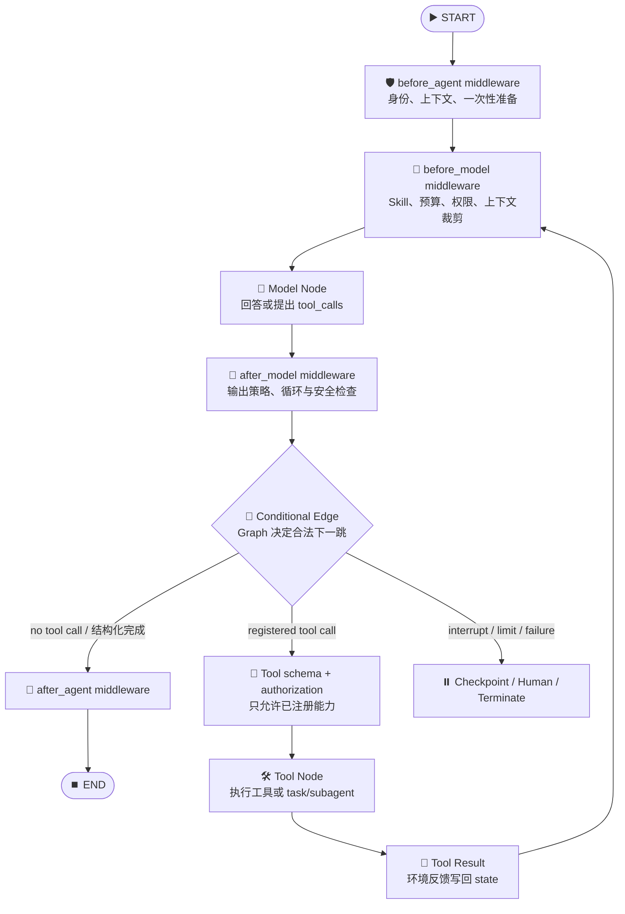
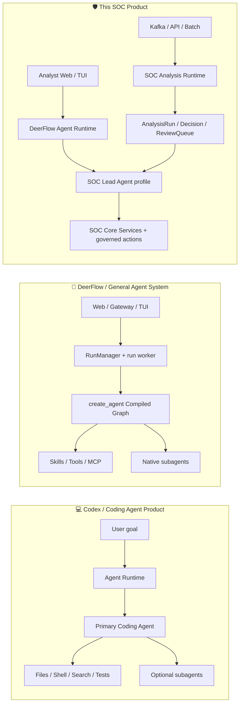
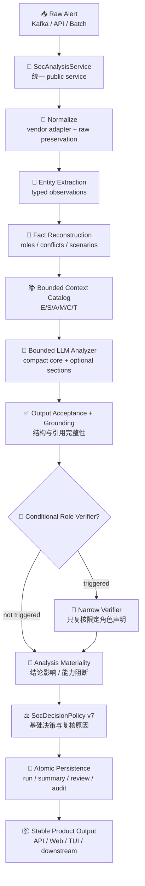
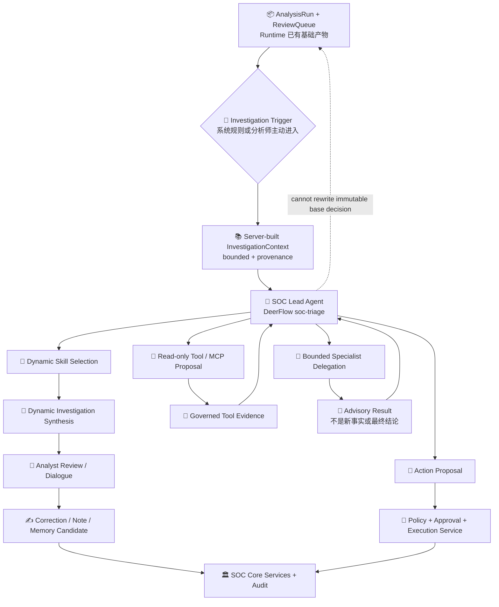
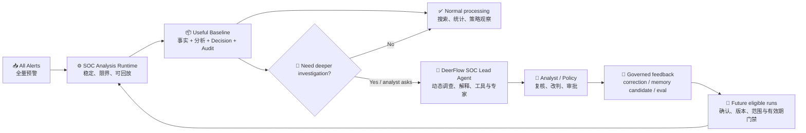

# SOC Analysis Runtime + Agent Runtime Architecture / SOC 分析运行时与智能体运行时架构

Status: Explanatory architecture reference / 架构解释材料

Last reviewed: 2026-08-14

Audience: SOC analysts, architects, model engineers, platform engineers, product and management reviewers

This document explains **why this product needs both a stable SOC Analysis Runtime and a dynamic
SOC Agent**, how DeerFlow/LangGraph constrains an agent created by `create_agent`, and how this
architecture differs from a coding agent product such as Codex.

本文只负责解释架构，不拥有项目阶段、任务状态或精确接口定义：

- 产品和系统方向以 [`../soc-agent-solution.md`](../soc-agent-solution.md) 为准。
- 当前实际流转以 [`../alert-lifecycle-flow.md`](../alert-lifecycle-flow.md) 为准。
- 工程/API/权限契约以
  [`../../reference-index/soc-agent-engineering-contracts.md`](../../reference-index/soc-agent-engineering-contracts.md)
  为准。
- 阶段顺序和进度分别看 [`../delivery-roadmap.md`](../delivery-roadmap.md) 与
  [`../progress.md`](../progress.md)。

---

## 1. Executive Conclusion / 核心结论

当前选择是合理的，而且很适合 SOC：

> **所有预警先经过稳定、可回放的 SOC Analysis Runtime；只有需要开放式调查、工具选择、跨域综合或人机协作的案件，才进入 DeerFlow SOC Lead Agent。**

这不是“流程和 Agent 二选一”，而是四层职责分配：

| Owner / 掌握者 | Owns / 掌握什么 | Must not own / 不掌握什么 |
| --- | --- | --- |
| Deterministic Runtime / 确定性运行时 | 必经步骤、状态、重试、幂等、审计、持久化 | 不替模型做开放式安全语义推理 |
| Bounded LLM Node / 受控模型节点 | 场景、方向、角色、影响、解释等模糊判断 | 不跳步、不改 Schema、不直接执行动作 |
| Dynamic Agent / 动态智能体 | 调查顺序、只读工具选择、Skill/专家委派、分析师问答 | 不改写基础 Decision，不取得隐式处置权限 |
| Policy + Human / 策略与人 | 改判、批准、处置授权、记忆确认 | 不把自由文本直接当执行命令 |

一句话概括：

> **主流程固定，节点智能；复杂案件自主调查，高风险动作独立授权。**

---

## 2. Why This Is the Right Split / 为什么这套拆分有道理

### 2.1 SOC volume amplifies every agent loop / 预警量会放大 Agent 循环

一天一万条告警对 Kafka、数据库和普通服务并不是很大的吞吐量，平均约为 `0.116 alert/s`；
但它意味着每天有一万个潜在模型任务，并且生产流量存在峰值。固定分析与开放式 Agent 的调用量
近似关系不同：

```text
fixed model calls ≈ alert_count × (primary_call + verifier_rate + repair_rate)

agent model calls ≈ alert_count × average_agent_turns
                  + tool-follow-up calls
                  + subagent calls
                  + retries
```

例如，仅作容量说明：若每条告警平均进行 6 轮 Agent 推理，一万条告警就先放大为约六万次模型轮次，
还没有计算工具、子智能体和重试。真正的问题不仅是平均吞吐量，还包括：

- 模型轮数和尾延迟不可预测；
- CMDB、EDR、TI、SOAR 等下游服务会被同时放大；
- 任意一步超时或格式错误都会增加整条链路失败概率；
- 同类预警会重复做近似调查，浪费 token 和外部查询额度；
- 开放式循环更难做稳定回放、版本对比和 SLA 归因。

因此，高吞吐入口适合**有上限的固定执行语义**，而不是默认启动一个未知轮数的 Agent。

### 2.2 Every alert still needs a useful baseline / 每条告警都需要稳定基础产物

无论模型、MCP、Agent 或外部系统是否可用，系统都应尽可能留下：

- canonical alert / 标准预警；
- entity and fact reconstruction / 实体与事实重建；
- evidence provenance and trust / 证据来源与可信边界；
- structured analysis / 结构化分析；
- base decision and review reasons / 基础结论与复核原因；
- trace, failure class and replay input / 步骤留痕、失败分类和回放输入。

这些是 Kafka 消费、API、批处理、Web、TUI 和后续 Agent 共同依赖的稳定资产。若直接把原始告警交给
开放式 Agent，这些产物很容易随 prompt、工具可用性和轮次变化而漂移。

### 2.3 Reliability is a system property / 可靠性不是模型单项能力

生产可靠性来自 Runtime 对以下语义的控制：

- schema validation / Schema 校验；
- bounded context / 上下文预算；
- idempotency and offset commit / 幂等与 Kafka offset 提交；
- retryable versus non-retryable failure / 可重试与不可重试失败；
- timeout, concurrency and backpressure / 超时、并发与背压；
- checkpoint, recovery and replay / 检查点、恢复与回放；
- authorization and audit / 权限与审计。

更强的模型可以改善局部研判质量，但不能替代这些执行语义。

### 2.4 SOC needs both consistency and exploration / SOC 同时需要一致性与探索性

SOC 工作并不全是固定流程：新的攻击手法、跨域线索、复杂攻击链、模糊资产关系和分析师追问，无法
预先枚举全部调查步骤。此时 Agent 的动态路由、工具选择和多轮综合非常有价值。

正确边界不是“彻底不用 Agent”，而是：

- **重复、可枚举、必须稳定的事情**进入 SOC Analysis Runtime；
- **输入模糊但输出可约束的判断**进入 Runtime 内的 bounded LLM node；
- **下一步不能预知、需要环境反馈的调查**进入 SOC Lead Agent；
- **不可逆或高风险动作**进入独立 Policy/Approval/Execution boundary。

### 2.5 The split must not become two products / 双运行时不等于重复建设

这套设计唯一需要警惕的是“双栈重复”：Runtime 和 Agent 各自实现一套解析、MCP、记忆、审批或
数据库逻辑。当前项目应继续坚持：

- SOC Analysis Runtime 只负责领域主流程和领域状态；
- SOC Lead Agent 复用 DeerFlow 已有模型、Skill、MCP、流式协议、checkpoint 和 subagent 能力；
- 两者通过 `SocAnalysisService`、`SocReviewService`、`InvestigationContext`、ReviewQueue 和 action
  boundary 连接；
- 共享契约和 Core Services，但不共享一个不受控执行循环。

---

## 3. Terminology / 先把几个 Runtime 说清楚

`Runtime` 在不同项目里经常指不同层，混用后很容易误判架构。

| Term / 术语 | Definition / 定义 | This project / 本项目 |
| --- | --- | --- |
| Model / 模型 | 单次生成或推理能力 | DeepSeek 或其他 DeerFlow model profile |
| Augmented LLM / 增强模型 | 模型加检索、记忆、工具、结构化输出 | Runtime 中的 bounded analyzer 也是一种受控增强模型调用 |
| Agent / 智能体 | 模型基于环境反馈，在循环中动态选择下一步或工具 | `soc-triage` Lead Agent、受控 specialist agents |
| Agent Graph / 智能体图 | 允许 Agent 循环运行的节点、边和状态拓扑 | LangChain `create_agent()` 编译出的 `CompiledStateGraph` |
| Agent Runtime/Harness / 智能体运行时 | 执行 Agent Graph，管理模型、工具、状态、流、checkpoint、中断和子智能体 | DeerFlow harness + run worker；Codex 属于同类产品层次 |
| Domain Runtime / 领域运行时 | 对一类业务输入执行稳定、版本化、可回放的业务流程 | `backend/soc_agent/core/runtime.py` |
| Core Services / 核心服务 | 对 API、Kafka、CLI、Web/TUI 提供统一业务入口和事务边界 | `SocAnalysisService`、`SocReviewService` 等 |
| Agent Product / 智能体产品 | UI/CLI + Agent Runtime + Agent profile + tools + domain services | Codex 是 coding-agent 产品；DeerFlow 是通用 Agent 系统；本项目是 SOC 产品 |

可以把 Agent 简化为：

```text
Agent = model + instructions + state + allowed tools + feedback loop + stopping policy
```

而一个生产产品还必须增加：

```text
Agent Product = Agent + runtime + identity + permissions + persistence
              + observability + recovery + domain services + user surfaces
```

---

## 4. How `create_agent` Is Constrained by a Graph / Agent Graph 如何约束智能体

### 4.1 Dynamic does not mean unconstrained / 动态不等于没有边界

本仓库的 DeerFlow Lead Agent 最终调用 LangChain `create_agent(model, tools, middleware,
system_prompt, state_schema)`。当前安装版本的 `create_agent` 返回一个 `CompiledStateGraph`，
其基本循环是：模型生成回答或工具调用；Graph 根据结果走向 Tool Node 或结束；工具结果再回到模型。



模型拥有的是**围栏内的路由权**，而不是系统拓扑和最终权限：

| Constraint / 约束 | Controlled by / 谁控制 | Model can do / 模型能做什么 |
| --- | --- | --- |
| Graph nodes and edges / 节点与边 | `create_agent` + middleware code | 只能在已编译的合法边之间触发路由 |
| Tool inventory / 工具集合 | DeerFlow config、tool groups、MCP routing | 只能调用被暴露且通过授权的工具 |
| Tool arguments / 工具参数 | Tool schema + validation | 只能提出参数，不能绕过执行器 |
| State / 状态 | `state_schema`、checkpointer、store | 读取/生成允许的状态更新 |
| Context / 上下文 | middleware + server-owned projection | 不能自行读取未投影的数据库或告警原文 |
| Loop budget / 循环预算 | recursion/turn/token/subagent limits | 在预算内决定下一步，超过预算由 Runtime 停止 |
| Side effects / 副作用 | sandbox、tool authorization、SOC policy/approval | 提议不等于获权，工具结果才是环境事实 |
| Recovery / 恢复 | run worker、checkpoint、interrupt/cancel | 不能自行宣称失败步骤已经恢复 |

DeerFlow 中的子智能体也不是脱离 Graph 的“另一个自由进程”。Lead Agent 通过已注册的 `task`
能力发起委派，Agent Runtime 创建和执行子任务，再将结果作为环境反馈返回主图。SOC 额外用
`SocLeadAgentDelegationMiddleware` 限制允许的专家、问题长度、每轮数量、上下文来源和输出权限。

> Graph 只提供结构约束；如果工具权限过宽、参数契约含糊或没有动作授权层，Agent 仍然可能造成风险。
> 因此“用了 LangGraph”本身不等于生产安全。

### 4.2 Graph is a mechanism, not an autonomy level / Graph 不等于 Agent

Workflow 和 Agent 都可以用 LangGraph 实现，区别不在于是否“画了图”：

- 固定 `START -> normalize -> analyze -> validate -> decide -> END`，分支由确定性代码判断，仍是
  workflow；
- `model -> tool -> model` 中，模型根据新获得的环境反馈决定下一工具和轮数，才具有 Agent loop；
- 当前 SOC Analysis Runtime 是直接 Python pipeline，不妨碍它是严谨的领域 Runtime；未来即使因
  可视化、checkpoint 或并行需求改成 `StateGraph`，也不应顺便把必经步骤交给模型路由。

因此，技术框架与控制权必须分开评审：**Graph 回答“允许怎么走”，控制策略回答“谁决定走哪条边”。**

---

## 5. SOC Runtime, DeerFlow, and Codex / 三者究竟有什么不同

### 5.1 Layer view / 分层视图



Codex 在这里是**类别对照**：它是面向代码工作的 Agent 产品，适合接收“修复问题、理解代码、实现
功能”这类开放目标，然后动态决定搜索、读取、编辑和测试顺序。其 Agent Runtime 负责把动态行为
限制在工具、沙箱、审批、状态和预算边界内。它不是“每来一个结构化业务事件就执行固定事务”的领域
Runtime。

DeerFlow 更接近可复用的通用 Agent Runtime/Harness。本仓库可以直接看到它如何装配模型、Skill、
MCP、middleware、stream、checkpoint 和 subagent。`soc-triage` 是运行在这个 Harness 上的 SOC
Agent profile，不应再发明一套 SOC 专用 Agent loop。

SOC Analysis Runtime 则是一个**领域事务处理器**：它接收预警，保证固定步骤、结构化产物、基础决策、
持久化、审计和可回放。它内部可以调用 LLM，但 LLM 只是其中一个受控节点。

### 5.2 Detailed comparison / 详细对照

| Dimension / 维度 | SOC Analysis Runtime | DeerFlow Agent Runtime | Codex Agent Product |
| --- | --- | --- | --- |
| Primary input / 主要输入 | 大量结构化或半结构化告警 | 用户消息、thread、Agent profile | 开放式开发目标与代码仓库 |
| Main goal / 目标 | 每条告警都产出一致、可审计的基础分析 | 执行可配置的通用 Agent loop | 完成代码理解、修改、测试与交付 |
| Control flow / 控制流 | Runtime 固定必经步骤 | 模型在 Compiled Graph 内动态选工具 | Agent 动态规划，Runtime 约束工具和环境 |
| LLM role / 模型角色 | bounded analyzer，可选条件 verifier | 主循环决策者 | 主循环决策者 |
| Expected turns / 轮数 | 有明确上限，通常一主调用加条件调用 | 随任务动态变化 | 随开发任务动态变化 |
| Tools / 工具 | 主流程不依赖开放式工具循环 | Skill、built-in tool、MCP、subagent | 文件、命令、搜索、测试及其他允许工具 |
| State / 状态 | `AnalysisRun`、Decision、Summary、ReviewQueue | messages、checkpoint、thread state | session/task state 和工作区状态 |
| Failure semantics / 失败语义 | typed failure、retryability、replay、offset policy | graph error、interrupt、checkpoint、resume | 工具失败后继续推理或请求用户处理 |
| Authority / 权限 | base decision 由策略形成，动作另行授权 | 由工具授权和 middleware 限制 | 由沙箱、审批和工具权限限制 |
| Scaling unit / 扩缩容单元 | alert/run/partition/worker | interactive run/thread | user task/session |
| Without Agent / Agent 不可用时 | 仍应完成基础分析或显式失败并可恢复 | 无 Agent 就没有主要交互任务 | 无 Agent 就没有 Codex 任务 |

最重要的区别不是“有没有 LLM”，而是：

> **谁决定下一步，以及这个下一步是否属于必须稳定执行的业务语义。**

---

## 6. Target Architecture in This Project / 本项目的组合架构

### 6.1 Every-alert base lane / 全量预警基础链路



这里的 `analyze` 和条件式 `role_verifier` 都可以用 LLM，但它们不能决定是否执行 normalize、
schema validation、grounding、materiality、decision 或 persistence。Grounding 只验证引用闭合；
Materiality 决定缺陷影响整个结论还是仅影响某个动作能力。Provider 出错、输出坏 JSON、引用悬空、
角色复核失败等情况由 Runtime 以显式质量状态和失败语义处理。

### 6.2 Selected-case agent lane / 复杂案件动态调查链路



动态 Agent 的入口可以由以下条件触发，但触发策略应属于可审计配置，而不是隐藏在 prompt 中：

- Runtime 明确输出 `needs_review` 或结构性 blocker；
- 高价值资产、显式冲突或复杂跨域场景需要二次调查；
- 相似告警聚合后需要攻击链/事件级综合；
- 分析师从 Web/TUI 主动围绕某个 ReviewQueue 工单提问；
- 处置前需要补充只读工具证据或解释动作影响。

并非所有 `suspicious` 告警都必须启动 Agent；也不应因为 Agent 暂时不可用而阻塞全量 Runtime。

### 6.3 Authority flow / 权限流

```mermaid
flowchart LR
    Telemetry["📡 Current Alert Evidence"] --> Runtime["⚙️ Runtime Base Decision"]
    Runtime --> Review["👤 Human Review / Correction"]
    Runtime --> Agent["🧠 Agent Investigation"]
    Agent --> Suggest["💡 Explanation / Proposal"]
    Suggest --> Review
    Review --> Effective["⚖️ Governed Effective Decision"]
    Effective --> Auth["🔐 Server-owned Authorization Policy"]
    Auth -->|"requires approval"| Approval["🛂 Human Approval"]
    Auth -->|"exact reviewed auto rule"| Execute["🛠️ Idempotent Execution Service"]
    Approval --> Execute
    Execute --> Audit["🧾 Immutable Lineage + Audit"]
```



Agent 负责发现和解释，不能因为“说得合理”就获得动作权限。Skill、Memory、MCP 返回、模型置信度和
子智能体意见都不能越过服务端 Policy/Approval。

---

## 7. What Goes Where / 一个能力应该放在哪一层

| Capability / 能力 | Deterministic Runtime | Bounded LLM Node | Dynamic Agent | Policy/Human |
| --- | :---: | :---: | :---: | :---: |
| Vendor envelope validation / 厂商输入校验 | ✅ |  |  |  |
| Adapter selection and raw preservation / Adapter 与原文保存 | ✅ |  |  |  |
| Canonical normalization / 标准化 | ✅ | 辅助发现新 Schema，不逐条控制 |  | 确认 Adapter 变更 |
| Evidence provenance and field trust / 证据来源与字段可信 | ✅ | 可解释冲突 | 可进一步调查 | 人工裁决可追加 |
| Entity/fact extraction / 实体与事实提取 | ✅ code-first | ✅ 处理模糊语义 | 可补充调查线索 | 可纠正 |
| Scenario, role, effect, impact / 场景、角色、效果、影响 | 固定输入/输出契约 | ✅ 主研判 | ✅ 复杂案件再调查 | 最终确认 |
| Schema/grounding validation / 输出与引用校验 | ✅ |  |  |  |
| Base decision and review reason / 基础结论与复核原因 | ✅ policy | 提供结构化候选 | 不直接改写 | 可受控改判 |
| Unknown next investigative step / 未知的下一调查步骤 |  | 可建议白名单 soft route | ✅ | 可接管 |
| Choose Skill/MCP/tool / 动态选择能力 | 只投影固定 guidance | 仅受控建议 | ✅ allowlisted | 配置与权限治理 |
| Cross-domain investigation / 跨域综合调查 | 只提供基础事实 | 有界初判 | ✅ | 复核 |
| Kafka offset, retry, replay / 消费、重试、回放 | ✅ |  |  |  |
| Memory confirmation / 记忆确认 | 状态机和检索契约 | 只产 candidate suggestion | 只提候选 | ✅ human gate |
| Block/isolate/close / 封禁、隔离、关闭 | 记录请求和结果 | 只提建议 | 只提 proposal | ✅ authorization/approval |

判断口诀：

1. 步骤高度确定、异常可枚举、必须可回放：写代码进入 Runtime。
2. 步骤固定，但语义模糊：用有 Schema、有证据目录、有预算的 bounded LLM node。
3. 下一步依赖刚获得的环境反馈，无法预知调查轮数：交给 Agent。
4. 会改变外部世界或未来决策权：交给 Policy/Approval/Human，而不是 prompt。

---

## 8. What External Systems Publicly Show / 外部产品公开做法

以下结论来自官方公开文档，只用于比较**产品和架构边界**；除开源框架外，不声称知道厂商内部源码
实现。

| Source / 外部参考 | Publicly documented pattern / 官方公开模式 | Relevance / 对本项目的启示 |
| --- | --- | --- |
| [Anthropic: Building effective agents](https://www.anthropic.com/engineering/building-effective-agents) | 明确区分 predefined code path 的 workflow 与模型动态决定过程/工具的 agent，并指出 agentic complexity 会增加成本和延迟 | 本项目采用 workflow + bounded LLM + selected-case agent，符合按任务确定性选择模式的原则 |
| [LangGraph: Workflows and agents](https://docs.langchain.com/oss/python/langgraph/workflows-agents) | Workflow 走预定路径；Agent 在 model/tool feedback loop 中运行，conditional edge 决定调用工具还是结束 | `create_agent` 的自主性位于已编译 Graph 内，不是让模型控制整个生产系统 |
| [Google SecOps ingestion and UDM](https://docs.cloud.google.com/chronicle/docs/ingestion/log-ingestion-and-parsing) + [alert investigation](https://docs.cloud.google.com/chronicle/docs/investigation/investigate-alert) | 多来源日志先解析并统一到 UDM，供规则与分析使用；告警进入 case/enrichment，并可由 Gemini Triage and Investigation Agent 分析真/误报及总结 | 公开产品边界体现“标准数据/检测/案件基础层 + AI 研判层”，与先建稳定 Runtime 再做动态调查一致 |
| [Microsoft Sentinel automation](https://learn.microsoft.com/en-us/azure/sentinel/automation/automation) + [Security Copilot Phishing Triage Agent](https://learn.microsoft.com/en-us/defender-xdr/phishing-triage-agent) | 重复、可预测的 enrichment/response/remediation 用 automation rules 和 playbooks；专门的 phishing agent 用上下文推理做动态分类和解释 | 固定自动化与专项 Agent 可以并存。专项 Agent 的规模化不等于用一个通用 Agent 接管任意原始告警和所有动作 |
| [Elastic Attack Discovery](https://www.elastic.co/docs/solutions/security/ai/attack-discovery) + [AI Assistant for Security](https://www.elastic.co/docs/solutions/security/ai/ai-assistant) | LLM 在已有 alerts 上形成 attack narrative，也提供交互式调查助手；Attack Discovery 可从手动、定时、workflow 或 Agent Builder 入口启动，但使用同一分析步骤 | 多入口应复用同一分析服务；批量分析产物与交互式 Assistant 是两个互补 surface，而不是各写一套分析逻辑 |
| [OpenAI Developers: Codex](https://developers.openai.com/) | Codex 被定位为 coding agent，用于理解代码、实现、测试和审查这类开放式开发任务 | Codex 适合作为动态 Agent Runtime 类比，不应被当作高吞吐 SOC 事件处理器的直接模板 |

这些产品并不证明只有一种正确架构。Google/Microsoft 已经公开展示 AI Agent 可以直接参与大量安全告警
研判，但其 Agent 工作在已有数据模型、检测、case、权限和自动化基础设施之上。对本项目真正重要的
结论是：

> **Agent 可以成为研判核心能力，但不能替代承载数据契约、状态、权限、恢复和审计的系统基础层。**

---

## 9. Architectural Invariants / 后续开发不能破坏的边界

1. **Every alert has one base path.** 每条告警只能通过统一 `SocAnalysisService` 进入基础分析，不由
   API、Kafka、CLI 或 Agent 各拼一套 pipeline。
2. **The LLM is a node, not the transaction coordinator.** 模型不能跳过 normalize、validation、
   grounding、materiality、decision、persistence 或 offset 语义。
3. **The Agent starts from server-built context.** SOC Lead Agent 使用服务端绑定的 ReviewQueue 和
   `InvestigationContext`，不能信任客户端直接上传的“内部事实”。
4. **Agent output is not current-alert evidence by itself.** Agent/子智能体文本属于分析意见；只有带
   provenance 的告警事实、受治理上下文或真实工具结果才能成为对应类别证据。
5. **No second SOC agent framework.** SOC profile、Skill、MCP、stream、checkpoint 和 subagent 继续
   复用 DeerFlow；SOC 模块只增加领域契约和治理边界。
6. **No direct base-decision rewrite.** 动态调查可以形成 note、correction command、memory candidate 或
   action proposal，但不能直接覆盖 immutable base Decision。
7. **Proposal is not authorization.** MCP/Tool/Skill/Memory/模型都不能授予高风险动作权限。
8. **Failure isolation is deliberate.** Agent、MCP 或可选区块/verifier 故障不能静默污染基础结果；
   core 问题、局部 capability block、复核、重试还是失败，必须由 Materiality/Decision Policy 明确决定
   并留痕，不能用一个笼统 degraded 状态处理所有问题。
9. **Autonomy must be earned by evaluation.** 只有代表性样本证明质量、延迟、成本和风险收益后，才把
   某类告警从人工/固定链路扩大到更强自主调查。
10. **Raw evidence remains auditable.** bounded prompt 只投影所需内容，不等于丢弃原始告警、完整
    message 或 provenance。

### Anti-patterns / 需要避免

- 为每个 `topic`、厂商或 `rule_code` 启动一个独立 Agent Runtime；
- 默认让每条告警进行未知轮数的 Lead/Sub Agent 对话；
- 让 Agent 自己提交 Kafka offset、写数据库状态或关闭工单；
- 在 Lead Agent prompt 中复制 Normalizer、Decision Policy 或租户永久白名单；
- 因为用了 Graph/MCP 就认为工具已经具备权限、幂等和审计；
- 让 Runtime 和 Web/TUI Agent 各自维护不同的分析结论格式；
- 把 Agent 生成的解释直接提升为 confirmed memory 或真实工具证据。

---

## 10. Current Code Mapping / 当前代码怎么对应

| Architecture concept / 架构概念 | Current source / 当前源码 | What to inspect / 看什么 |
| --- | --- | --- |
| SOC fixed domain pipeline | [`../../../backend/soc_agent/core/runtime.py`](../../../backend/soc_agent/core/runtime.py) | `analyze_alert()` 的固定步骤、条件 verifier、Decision Policy 与 typed failure |
| Stable public business entry | [`../../../backend/soc_agent/core/service.py`](../../../backend/soc_agent/core/service.py) | `SocAnalysisService` 的 analyze/replay/recover/persistence 边界 |
| SOC Lead Agent profile | [`../../../backend/soc_agent/lead_agent.py`](../../../backend/soc_agent/lead_agent.py) | 复用 DeerFlow、Skill、action proposal 和权限声明 |
| SOC specialist profiles | [`../../../backend/soc_agent/subagents.py`](../../../backend/soc_agent/subagents.py) | capability-oriented、read-only、advisory-only 专家边界 |
| Bounded specialist delegation | [`../../../backend/soc_agent/middlewares/lead_agent_delegation.py`](../../../backend/soc_agent/middlewares/lead_agent_delegation.py) | ReviewQueue 绑定、allowlist、预算、上下文投影和输出拒绝 |
| DeerFlow Agent factory | [`../../../backend/packages/harness/deerflow/agents/lead_agent/agent.py`](../../../backend/packages/harness/deerflow/agents/lead_agent/agent.py) | 模型、Skill、MCP、tool auth、middleware 和 `create_agent()` 装配 |
| DeerFlow graph execution | [`../../../backend/packages/harness/deerflow/runtime/runs/worker.py`](../../../backend/packages/harness/deerflow/runtime/runs/worker.py) | graph stream、checkpoint、interrupt、cancel、usage 和 run lifecycle |
| Product architecture | [`../soc-agent-solution.md`](../soc-agent-solution.md) | Sections 1、5.3、6、7、10、12 |
| Current end-to-end lifecycle | [`../alert-lifecycle-flow.md`](../alert-lifecycle-flow.md) | as-is 状态、数据和界面流转 |

---

## 11. Shareable Explanation / 给同事的简版说法

### 30-second version / 30 秒版

我们不是让一个大模型 Agent 直接接管所有 SOC 告警。每条告警先进入稳定的 SOC Analysis Runtime，
完成厂商适配、事实重建、受控模型研判、证据校验、基础决策、持久化和审计。复杂或需要复核的案件再
进入 DeerFlow SOC Lead Agent，由它动态选择 Skill、只读工具和专项子智能体，与分析师协作调查。
模型负责不确定性，Runtime 负责确定性，Policy 和人负责权限。

### The key diagram / 一张图讲清楚



### Final design statement / 最终设计判断

> 我们不是把 LLM 放在系统驾驶位，也不是把它降级成普通文本生成器。我们让 Runtime 掌握必须稳定
> 的业务语义，让 LLM 在固定节点中做高价值判断，让 Agent 在复杂案件中自主调查，再由独立策略和
> 人类掌握不可逆权限。这比“每条告警一个开放式 Agent”更稳定、更便宜、更可评测，也保留了模型在
> 新场景中的泛化能力。
