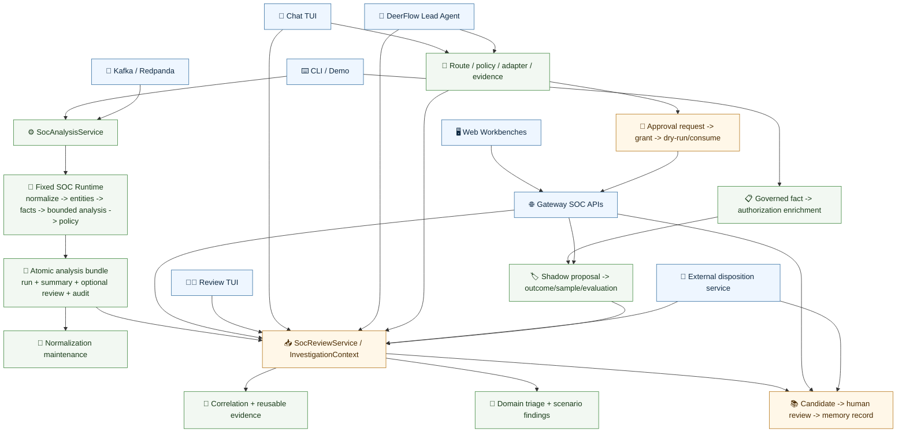
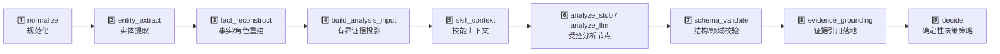
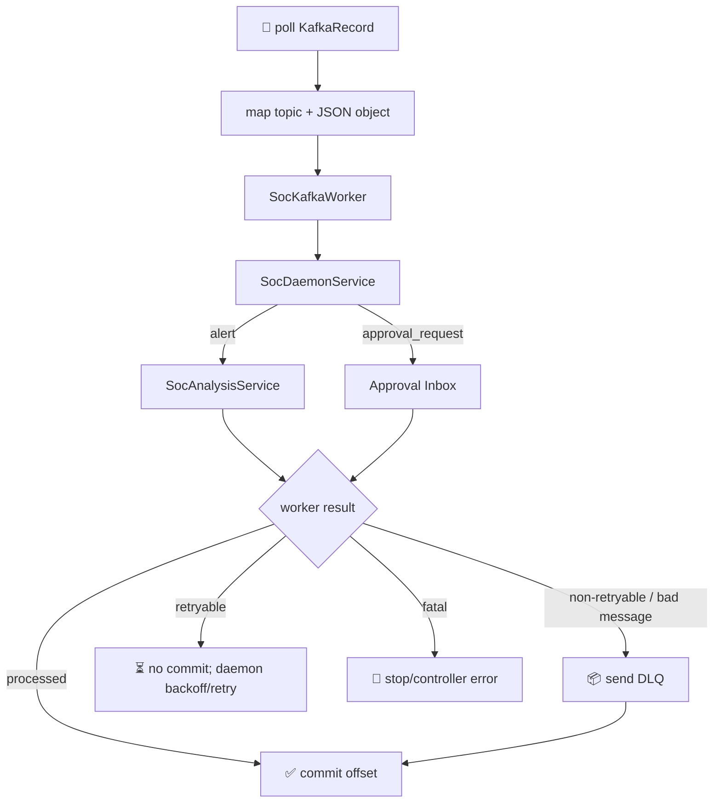
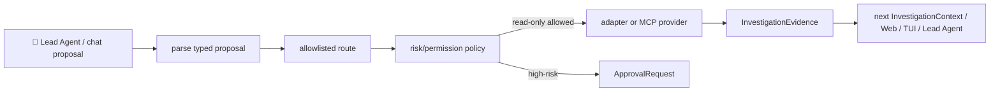
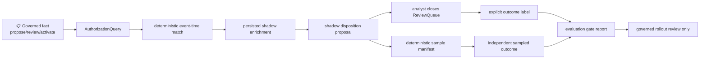

# SOC Alpha Full Journey Inventory / 完整旅程盘点

> Roadmap item: **AUD-01 Journey inventory**  
> Status: **Complete / As-is evidence snapshot**  
> Snapshot date: **2026-07-18**  
> Branch snapshot: `yyds-dev`, HEAD `70e80646`, including the current SOC working-tree changes  
> Next audit: **AUD-02 Code/contract/docs consistency**

Post-snapshot addendum: `BG-P0-02` (2026-07-18) added migration `0018_mutation_audit`, table
`soc_mutation_audit_log`, `SocMutationUnitOfWork`, and commit-buffered events for Alpha L3 commands.
The original 17-table and audit inventory below is intentionally retained as AUD-01 evidence; current
truth is recorded in the completeness matrix, lifecycle and engineering contracts.

## 1. Purpose and Boundary / 目的与边界

本文只回答一个问题：**当前代码中，一条 SOC 告警和它的后续人工/治理流程实际能走到哪里，每个落点在哪里。**

本次盘点覆盖：

- entry surface / 入口；
- public service / 对外服务边界；
- runtime and side-service journey / Runtime 主链与旁路服务；
- state transition / 状态变更；
- persistence table / 持久化表；
- user-visible artifact / CLI、Web、TUI、Lead Agent、Kafka 可见产物；
- source and test evidence / 源码与测试证据。

本文不做以下工作：

- 不在审计时修改业务代码；
- 不把存在 class/contract 等同于产品入口已经接通；
- 不判断 P0/P1/P2，也不在这里建立第二份 blocker list；
- 不使用 `Complete / Gap / Mock / Data-gated / Deferred` 分类，这些属于 `AUD-02` 和 `AUD-03`；
- 不用方案文档推断实现，所有 as-is 结论以 CodeGraph 和源码为准。

盘点标记：

| Marker | Meaning / 含义 |
|---|---|
| `Wired` | 已有可调用入口，且入口调用真实 service boundary |
| `Service-only` | service/contract/test 存在，但没有 CLI/API/Kafka/Web 等应用入口 |
| `Derived` | 读取时动态计算的 read model，不单独持久化 |
| `Demo/Eval` | 仅用于演示、fixture 或离线评测，不是在线生产链路 |
| `Boundary-only` | 只验证权限、参数或 token 边界，不执行外部生产副作用 |

## 2. System Journey at a Glance / 全局旅程

关键边界：

1. `SocAnalysisService` 和 fixed Runtime 负责确定性主链。
2. correlation、domain triage、memory retrieval、authorized activity、action adapter、Lead Agent 都是显式旁路服务，不是隐藏 Runtime node。
3. `InvestigationContext` 是各旁路结果的统一读取模型；其中 correlation、domain finding 和 unified view 在读取时动态生成。
4. 高风险 action 当前到达 token consume boundary，结果明确记录 `external_side_effect=not_executed`。
5. 外部处置同步已有 service，但当前没有应用层 ingress；这是 `Service-only`，不能当作已接 Zeus/Kafka/API。

## 3. Entry Surface Inventory / 入口清单

### 3.1 CLI command groups

统一入口为 `backend/pyproject.toml -> soc = "soc_agent.cli:main"`，parser 和 handler 位于
`backend/soc_agent/cli.py`。

| Entry ID | Command group | Current responsibility | Primary service/location | Marker |
|---|---|---|---|---|
| `E-CLI-01` | `soc analyze/list/show/replay/correct/correlate` | 分析、读取、重放、人工纠正、相似告警查询 | `SocAnalysisService`, `SocReviewService`, `SocCorrelationService` | Wired |
| `E-CLI-02` | `soc normalize ...` | inspect、drift、baseline、issue、离线 mapping suggestion | `SocNormalizationService`, `SocNormalizationMaintenanceService` | Wired |
| `E-CLI-03` | `soc review list/context/note/close/tui` | ReviewQueue 查询、上下文、note、关闭与 TUI | `SocReviewService`, `backend/soc_agent/tui/` | Wired |
| `E-CLI-04` | `soc chat tui [--lead-agent]` | deterministic chat 或 DeerFlow SOC Lead Agent chat | `SocAgentChatService` / `SocLeadAgentChatService` | Wired |
| `E-CLI-05` | `soc agent profile/install-profile/resolve-skills` | DeerFlow custom-agent profile 和 skill resolution | `agent_profile.py`, `lead_agent.py`, `SocSkillResolutionService` | Wired |
| `E-CLI-06` | `soc mcp smoke/tools` | MCP tool inventory 和只读 adapter smoke | `actions/mcp.py` | Wired |
| `E-CLI-07` | `soc llm status` | 无 secret 的模型解析状态 | `soc_agent/llm/` | Wired |
| `E-CLI-08` | `soc daemon process/status/consume/run` | 单消息处理、readiness、有限消费、长运行 daemon | `SocDaemonService`, `soc_agent/daemon/` | Wired |
| `E-CLI-09` | `soc eval ...` | Runtime、scenario、correlation、PingAn、confidence 离线评测 | `soc_agent/eval/` | Demo/Eval |
| `E-CLI-10` | `soc demo run/alert/boss` | 持久化调查演示与 Boss Demo golden path | `soc_agent/demo/`, `scripts/soc-boss-demo.sh` | Demo/Eval |
| `E-CLI-11` | `soc memory ...` | candidate/record 查询、评审和检索 | `SocMemoryService` | Wired |
| `E-CLI-12` | `soc disposition ...` | shadow proposal、sample、outcome、evaluation | `SocDispositionProposalService`, `SocDispositionEvaluationService` | Wired |
| `E-CLI-13` | `soc context ...` | governed fact 生命周期、授权 match/enrich/replay | `SocGovernedContextService`, `SocAuthorizedActivityService`, `SocAuthorizationEnrichmentService` | Wired |
| `E-CLI-14` | `soc db init/upgrade` | 建表和 Alembic migration | `soc_agent/db/` | Wired |

### 3.2 Kafka and daemon entries

| Entry ID | Entry | Accepted input | Primary location | Observable result | Marker |
|---|---|---|---|---|---|
| `E-KAFKA-01` | `soc.alerts.raw.v1` | JSON object alert | `daemon/kafka_mapper.py -> SocKafkaWorker -> SocDaemonService` | run/summary/review/audit、worker result、offset/DLQ result | Wired |
| `E-KAFKA-02` | `soc.approvals.requests.v1` | `SocAgentApprovalRequest` JSON object | same mapper/worker path | shared approval inbox row and process result | Wired |
| `E-KAFKA-03` | `soc.alerts.dead_letter.v1` | original record + adapter error | `KafkaConsumerPort.send_dead_letter()` / `kafka_adapter.py` | broker DLQ record and committed source offset | Wired |
| `E-DAEMON-01` | production shell entry | environment -> `soc daemon run` | `backend/scripts/soc_daemon_entrypoint.sh` | long-running process and JSONL metrics | Wired |
| `E-DAEMON-02` | healthcheck | DB/Kafka readiness | `backend/scripts/soc_daemon_healthcheck.sh`, `daemon/kafka_status.py` | exit status and `soc.kafka_daemon_status.v1` | Wired |
| `E-DAEMON-03` | opt-in deployment | daemon container/deployment | `docker/docker-compose.soc-daemon.yaml`, `docker/k8s/soc-daemon.yaml` | isolated daemon workload | Wired |

Kafka 当前只映射 `alert` 和 `approval_request` 两种 message kind。外部 disposition、memory feedback、governed fact
不属于当前 topic mapper。

### 3.3 Gateway API entries

SOC routers 在 `backend/app/gateway/app.py` 注册。当前真实 path 使用未版本化 `/api/soc/...`。

| Entry ID | API prefix | Endpoints | Service owner | Marker |
|---|---|---|---|---|
| `E-API-01` | `/api/soc/review` | `GET /items`, `GET /items/{id}/context`, `POST /items/{id}/close`, `POST /runs/{id}/correct` | `SocReviewService` | Wired |
| `E-API-02` | `/api/soc/review` | `POST /disposition-outcomes`, `GET /disposition-samples`, `GET /disposition-samples/{id}/inbox` | `SocDispositionEvaluationService` | Wired |
| `E-API-03` | `/api/soc/approvals` | request create/list/get/reject/expire、request-ID grant create、action dry-run/execute | `SocAgentApprovalService` | Wired |
| `E-API-04` | `/api/soc/memory` | candidate list/get/review、record list/get、search | `SocMemoryService` | Wired |
| `E-API-05` | `/api/soc/normalization` | baseline create/list、issue list/update、metrics | `SocNormalizationMaintenanceService` | Wired |

当前没有 Gateway `analyze`、`replay`、governed fact、authorization enrichment、disposition proposal 或 external
disposition ingress endpoint。相应 service/CLI 是否足够，由 `AUD-02/AUD-03` 判断。

### 3.4 Web, TUI, and Lead Agent entries

| Entry ID | User surface | Route/command | Owner | Marker |
|---|---|---|---|---|
| `E-WEB-01` | SOC review workbench | `/workspace/soc/review` | `SocReviewQueueWorkbench`, `frontend/src/core/soc/api.ts` | Wired |
| `E-WEB-02` | normalization operations | `/workspace/soc/normalization` | `SocNormalizationWorkbench` | Wired |
| `E-TUI-01` | review operations TUI | `soc review tui` | `SocReviewTUI` | Wired |
| `E-TUI-02` | deterministic SOC chat | `soc chat tui` | `SocAgentChatTUI` + `SocAgentChatService` | Wired |
| `E-LEAD-01` | DeerFlow SOC Lead Agent chat | `soc chat tui --lead-agent` | `SocLeadAgentChatService`, `DeerFlowClient(agent_name="soc-triage")` | Wired |
| `E-LEAD-02` | Lead Agent profile | `soc agent install-profile` | DeerFlow per-user custom-agent storage | Wired |
| `E-EXT-01` | external disposition ingestion | no application adapter; direct service invocation/tests only | `SocExternalDispositionService.apply_event()` | Service-only |

## 4. Public Service Inventory / 服务清单

| Service ID | Public boundary | Owns | Reads/writes | Entry callers |
|---|---|---|---|---|
| `S-01` | `analyze_alert()` / `DeterministicAnalysisRuntime` | fixed nine-step Runtime、failure classification、step trace | returns `AnalysisRun`; no repository access itself | `S-02`, tests, request builder helpers |
| `S-02` | `SocAnalysisService` | analyze/replay、idempotency、analysis event、atomic bundle orchestration | run/summary/review/audit; then normalization monitoring result | CLI, Kafka, demos, main orchestrator |
| `S-03` | `SocNormalizationService` | inspect/drift/drift_recent without decision execution | payload or persisted run reports; no business mutation | CLI |
| `S-04` | `SocNormalizationMaintenanceService` | schema baseline、deduplicated issue、recurrence/reopen、metrics source | baseline and maintenance issue tables | analysis side path, CLI/API/Web/TUI |
| `S-05` | `SocSkillResolutionService` | whitelist-based SOC skill selection | skill context only | CLI; Runtime calls the same resolver functions directly |
| `S-06` | `SocReviewService` | queue list/context/close/correct/note | run/summary/queue/audit/candidate plus context reads | CLI/API/Web/TUI/Lead Agent |
| `S-07` | `SocCorrelationService` | deterministic historical similarity and reusable evidence refs | summary/evidence reads only | CLI, InvestigationContext, main orchestrator |
| `S-08` | `SocDomainTriageService` | APT/EDR/HIDS/WAF/generic finding generation | typed derived findings; no DB write | InvestigationContext, main orchestrator/eval |
| `S-09` | `SocMemoryService` | candidate lifecycle、record creation/lifecycle、bounded retrieval | candidate/record tables | CLI/API/Web/Review context; source bridges |
| `S-10` | `SocDaemonService` | decoded daemon message -> analysis or approval inbox | delegates to `S-02` / `S-14` | Kafka worker, CLI process |
| `S-11` | `SocAgentChatService` | deterministic chat stream、route、permission、review context | context read; optional approval/evidence write through collaborators | Chat TUI |
| `S-12` | `SocLeadAgentChatService` | DeerFlow stream、bounded ReviewContext artifact、proposal extraction | context read; proposal boundary may write evidence/approval | Lead Agent Chat TUI |
| `S-13` | router/policy/dispatcher/adapter boundary | action allowlist、risk policy、read-only adapter/MCP invocation | successful read-only result -> investigation evidence | deterministic chat, Lead Agent, orchestrator |
| `S-14` | `SocAgentApprovalService` | request terminal lifecycle、one-request/one-grant resolution、dry-run、token consume、L3 role/provenance gate | approval request/grant tables | Kafka, Chat/Lead Agent, API/Web/TUI |
| `S-15` | `SocGovernedContextService` | typed fact proposal/version/lifecycle/RBAC | append-only governed fact versions | CLI |
| `S-16` | `SocAuthorizedActivityService` | canonical query and event-time deterministic fact match | governed fact reads only | CLI, enrichment service |
| `S-17` | `SocAuthorizationEnrichmentService` | persist/replay authorization match attached to run | authorization enrichment table | CLI; ReviewContext projection |
| `S-18` | `SocDispositionProposalService` | exact authorization + current detection truth -> shadow proposal | enrichment/run/open queue reads; proposal write | CLI; ReviewContext projection |
| `S-19` | `SocDispositionEvaluationService` | immutable outcomes、deterministic sample、derived inbox、evaluation gate | proposal/enrichment/queue/sample/outcome reads/writes | CLI/API/Web/TUI/external bridge |
| `S-20` | `SocExternalDispositionService` | vendor-neutral status mapping、target locate、optional correction/candidate/outcome | external disposition plus delegated review/memory/audit/outcome writes | direct tests only; no app ingress |
| `S-21` | `SocMainOrchestratorService` | bounded analysis + actions + correlation + domain + report composition | default in-memory; report metadata says no DB/high-risk execute | PingAn main eval/demo |

Service protocols are centralized in `backend/soc_agent/protocols.py`. SQL persistence is implemented by
`backend/soc_agent/db/repositories.py::SqlAlchemyAlertRepository`, which implements the repository ports without
making entry adapters write tables directly.

## 5. Fixed Runtime Journey / 固定分析主链

### 5.1 Runtime steps

| Step | Owner | Main output | Important boundary |
|---|---|---|---|
| `normalize` | `normalizers/` + `core/runtime.py` | canonical `AlertInput`, `NormalizationReport` | vendor aliases stop in adapters; original input remains in `AnalysisRun.input_payload` |
| `entity_extract` | `pipeline/extractor.py` | `ExtractedEntities`, `ExtractionReport` | reads canonical fields, not PingAn aliases |
| `fact_reconstruct` | `pipeline/fact_reconstructor.py` | role claims/resolutions、scenario signals、conflicts | does not assume attacker=source or victim=destination |
| `build_analysis_input` | `pipeline/analysis_context.py` | `LLMAnalysisRequest` + bounded evidence/coverage | raw payload/body/token is not blindly sent to the model |
| `skill_context` | `skills.py` / analysis context | selected skill metadata/hash/budget | whitelist selection; no arbitrary model-loaded skill |
| `analyze_*` | stub or `llm/analyzer.py` | `AnalysisNodeOutput` | LLM exists only at this bounded node |
| `schema_validate` | `core/validator.py` | validated `AnalysisResult` | invalid model output fails as typed Runtime failure |
| `evidence_grounding` | `pipeline/evidence_grounding.py` | citation grounding report | claims must map to exact bounded projection |
| `decide` | `core/decision_policy.py` | operational `Decision` | deterministic guards can force review and disable automation |

### 5.2 Analysis persistence sequence

| Journey ID | Sequence | State/write | User-visible result |
|---|---|---|---|
| `J-01` | CLI/Kafka/demo -> `SocAnalysisService.analyze()` -> Runtime | new `AnalysisRun`; atomic run + summary + optional ReviewQueue + decision audit | CLI JSON, Web/TUI queue and context, Kafka process result |
| `J-02` | `SocAnalysisService.replay(old_run_id)` -> reload old `input_payload` -> new Runtime run | new run with `replay_of_run_id`; old run is not overwritten; audit action=`replay` | `soc replay` JSON and new summary/review context |
| `J-03` | Runtime completion -> normalization maintenance monitor | after main bundle, update run monitoring result and create/update issues; monitor error does not fail analysis | normalization Web/TUI/API/CLI and run JSON |

`ReviewQueueItem` is created only when summary review logic returns a reason. Retryable failed runs persist run/summary/audit
but do not create a review item; non-retryable failed runs are reviewable.

## 6. End-to-End Journey Inventory / 端到端旅程清单

### 6.1 Kafka ingestion and offset semantics

| Journey ID | Exact behavior | Durable result | Operator artifact |
|---|---|---|---|
| `J-04A` | alert topic -> daemon `kind=alert` -> analysis, using idempotency `kafka:{topic}:{partition}:{offset}` | same as `J-01` | process/loop/daemon result, JSONL metrics |
| `J-04B` | approval topic -> validate `SocAgentApprovalRequest` -> shared inbox | `soc_approval_requests` | Web/TUI approval inbox |
| `J-04C` | mapper or non-retryable service failure | DLQ publish, then source offset commit | dead-letter counter/error |
| `J-04D` | retryable Runtime failure | no commit and no immediate DLQ | daemon error/backoff; retryable typed failure |

The current runner is serial. `PartitionCommitTracker` and worker-result contracts exist for concurrency planning, but the
active `SocKafkaConsumerRunner` processes one record at a time.

### 6.2 Review and investigation context

| Journey ID | Action | Mutations | Derived/read products |
|---|---|---|---|
| `J-05A` | list/open review item | none | queue item, run, summary, audit, similar alerts, action evidence, authorization, proposals/outcomes, external feedback, memory |
| `J-05B` | `close_queue_item` | ReviewQueue `open -> closed`, actor/reason/timestamp | updated queue item |
| `J-05C` | manual `correct` | append correction to run; replace current operational decision; update summary; close open queue; audit; optional pending candidate | corrected run and refreshed context |
| `J-05D` | analyst review note | create pending memory candidate only | `ReviewNoteResult`, candidate visible in context |
| `J-05E` | open InvestigationContext | no write | dynamically computed correlation, domain triage and `UnifiedInvestigationView` |

`InvestigationContext` is assembled in `SocReviewService.get_investigation_context()`. The unified view is a read-only
projection; it is not a database table and cannot change verdict, queue, memory, authorization or disposition.

### 6.3 Read-only investigation actions

| Journey ID | Current path | Write boundary | Decision impact |
|---|---|---|---|
| `J-06A` | deterministic chat metadata route -> router/policy/dispatcher | successful read-only result writes `soc_investigation_evidence` | none |
| `J-06B` | Lead Agent `<soc_action_proposal>` -> proposal boundary -> same dispatcher | same evidence repository | none |
| `J-06C` | `SocMainOrchestratorService` action specs -> same dispatcher | default in-memory evidence only | none; Demo/Eval |

Default Chat TUI wiring uses in-memory/mock asset, EDR process tree, host context, security tag and threat-intel adapters.
An explicit MCP action config switches to DeerFlow cached MCP tools through the same adapter boundary.

### 6.4 High-risk approval journey

| Journey ID | Sequence | State/write | External effect |
|---|---|---|---|
| `J-07A` | policy sees high-risk proposal -> creates/submits approval request | request persisted with contract status `pending` | none |
| `J-07B` | `soc_approver` or `soc_admin` resolves a stored request by ID | approve atomically writes request `approved` + one grant; reject/expire write terminal request without grant | none |
| `J-07C` | exact terminal retry uses the same actor/reason/idempotency/expiry | returns the stored request or grant; changed/stale retry conflicts | none |
| `J-07D` | dry-run validates token/route/action/expiry and optional adapter payload | no grant consumption | none |
| `J-07E` | execute boundary requires `dry_run=false` and idempotency key | grant `approved -> consumed`, execution result stored in grant | `external_side_effect=not_executed` |
| `J-07F` | consumed token retried with same idempotency key | returns stored execution result | none |

Request resolution is a repository compare-and-set from `pending` to exactly one terminal state. Grant creation and
the `approved` transition share one transaction and a unique request-to-grant constraint.

### 6.5 Memory journey

| Journey ID | Source | Current wiring | Result |
|---|---|---|---|
| `J-08A` | manual correction | automatically wired in `SocReviewService.correct()` | pending candidate linked back to correction/run/queue |
| `J-08B` | analyst review note | wired in `SocReviewService.add_note()` / `soc review note` | pending candidate |
| `J-08C` | mapped external disposition reason | wired inside `SocExternalDispositionService` when eligible; trust level is retained in candidate confidence/facets | pending candidate |
| `J-08D` | domain finding | bridge/factory and tests exist; no live app caller found | Service-only candidate source |
| `J-08E` | Lead Agent/Kafka conclusion | no candidate source caller in current app path | no write |
| `J-08F` | human reviews candidate | confirm-candidate/confirm/reject/deprecate/expire via service | updated candidate; `confirm` creates memory record |
| `J-08G` | InvestigationContext/search | deterministic facet/text scoring with token budget | only confirmed, unexpired, explicitly retrieval-enabled records returned |

New confirmed records are created with `retrieval_enabled=false`. Retrieval does not inject records into fixed Runtime or
alter its decision; current Web/TUI/Lead Agent surfaces show them as review context only.

### 6.6 Governed context and shadow disposition journey

| Journey ID | Contract | Preconditions | Mutation/impact |
|---|---|---|---|
| `J-09A` | governed fact lifecycle | role, evidence, source freshness, validity, optimistic version | append-only fact version; no alert decision impact |
| `J-09B` | authorized-activity match | canonical alert/query + tenant/environment/event time | read-only match; no persistence |
| `J-09C` | authorization enrichment | existing run, optional matching queue, idempotency | immutable enrichment; `shadow_only=true`, decision impact none |
| `J-09D` | disposition proposal | exact enrichment + open queue + current detection truth `true_positive` | immutable `closed_benign_true_positive` proposal; no close/auto action |
| `J-09E` | analyst outcome | proposal + closed ReviewQueue + explicit reason/idempotency | append-only/superseding outcome; no detection/queue mutation |
| `J-09F` | sample campaign | complete scoped population + deterministic hash rank | immutable manifest; derived reviewer inbox |
| `J-09G` | evaluation | proposals + enrichments + current outcomes/manifests | read-only gate report; passed status still has `auto_close_allowed=false` |

### 6.7 External disposition feedback

| Journey ID | Current sequence | Writes | Entry status |
|---|---|---|---|
| `J-10` | vendor adapter -> canonical event -> status map -> target locate -> persist -> optional correction/candidate/audit/outcome | external disposition always when service configured; delegated writes only under trust/target rules | Service-only; tests and fixture invoke it directly |

High-trust, mapped, uniquely verified targets may call `SocReviewService.correct()`. Unknown/low-trust/unmatched events remain
recorded feedback without changing the operational verdict. No Gateway/Kafka/CLI application adapter currently calls this service.

### 6.8 Demo and evaluation composition

| Journey ID | Entry | Composition | Persistence |
|---|---|---|---|
| `J-11A` | `soc demo run/alert/boss` | real persistent services and ReviewContext; Boss Demo seeds clearly marked mock/shadow artifacts | isolated SQLAlchemy database, SQLite for local Boss Demo |
| `J-11B` | `soc eval pingan-main` | `SocMainOrchestratorService`: analysis -> read-only actions -> correlation -> domain -> unified report | default in-memory, metadata `writes_db=false` |
| `J-11C` | `scripts/soc-runtime-validation.sh` | fixed Runtime plus separate maintenance/eval/governance tracks | gitignored local JSON/screenshots under `backend/.deer-flow/` |

## 7. State Machine Inventory / 状态机清单

| State ID | Aggregate | Contract states | Transitions produced by current code | Owner |
|---|---|---|---|---|
| `ST-01` | AnalysisRun | pending/running/needs_review/success/failed/interrupted/rolled_back/replayed | constructor writes `running`; Runtime terminates in `needs_review`, `success`, or `failed`; replay creates a new normal run with lineage rather than setting `replayed` | `core/runtime.py`, `SocAnalysisService` |
| `ST-02` | PipelineStepTrace | pending/running/skipped/success/failed/retrying | fixed Runtime appends `running -> success/failed`; other contract values are not produced in this runner | `core/runtime.py` |
| `ST-03` | ReviewQueueItem | open/closed | create open; explicit close, correction, or eligible external correction closes; no reopen transition found | `SocReviewService` |
| `ST-04` | MemoryCandidate | pending_review/confirmed_candidate/confirmed/rejected/deprecated/expired | service-enforced review transition map; confirm creates record | `SocMemoryService` |
| `ST-05` | MemoryRecord | confirmed/deprecated/expired | candidate deprecate/expire updates linked record; retrieval additionally requires `retrieval_enabled=true` | `SocMemoryService` |
| `ST-06` | ApprovalRequest | pending/approved/rejected/expired | insert pending; compare-and-set to one terminal state; approved transition atomically creates at most one grant | `SocAgentApprovalService` |
| `ST-07` | ApprovalGrant | approved/consumed literal | approve creates approved; execute boundary consumes; expiry is time validation, not a third persisted status | `SocAgentApprovalService` |
| `ST-08` | GovernedContextFact | proposed/active/suspended/expired/revoked | propose; proposed/suspended -> active; active -> suspended; nonterminal -> revoked; due nonterminal -> expired; revise creates new proposed version | `SocGovernedContextService` |
| `ST-09` | AuthorizationEnrichment | immutable record | create or replay as a new record linked by `replay_of_enrichment_id` | `SocAuthorizationEnrichmentService` |
| `ST-10` | DispositionProposal | immutable shadow record | create/dedupe only; no applied/closed state | `SocDispositionProposalService` |
| `ST-11` | DispositionOutcome | confirmed/overridden/inconclusive | append new label; correction uses explicit supersession lineage | `SocDispositionEvaluationService` |
| `ST-12` | Sample review item | ready/waiting_for_queue_close/completed/unavailable | derived from immutable manifest + queue/proposal/outcomes; not a mutable campaign row | `SocDispositionEvaluationService` |
| `ST-13` | NormalizationBaseline | active/superseded | accepting a new baseline supersedes active baseline(s) in the same scope | `SocNormalizationMaintenanceService` |
| `ST-14` | NormalizationIssue | open/acknowledged/resolved/ignored | operator update; recurrence reopens resolved/ignored; accepted baseline can resolve covered issues | `SocNormalizationMaintenanceService` |
| `ST-15` | Kafka worker result | processed/dead_letter_required/retryable_error/fatal_error | worker classifies; poller owns commit/DLQ/stop semantics | `daemon/kafka_worker.py`, `kafka_runner.py` |

## 8. Persistence Inventory / 持久化清单

Schema owner: `backend/soc_agent/db/models.py`; repository owner:
`backend/soc_agent/db/repositories.py::SqlAlchemyAlertRepository`; migrations:
`backend/soc_agent/db/migrations/versions/`.

| DB ID | Table | Migration | Writer/service | Main readers/projections |
|---|---|---|---|---|
| `DB-01` | `soc_analysis_runs` | `0001` | `SocAnalysisService`, correction update | CLI show/replay, ReviewContext, Web/TUI/Lead Agent |
| `DB-02` | `soc_decision_audit_log` | `0002`, `0007` | analysis/replay/correction/external disposition services | ReviewContext, idempotency lookup |
| `DB-03` | `soc_alert_summaries` | `0003` | analysis/correction | CLI list/correlate, ReviewContext |
| `DB-04` | `soc_review_queue` | `0004` | analysis bundle, review correction/close | API/Web/TUI/Lead Agent, proposal/outcome validation |
| `DB-05` | `soc_approval_grants` | `0005`, `0017` | approval service | API/Web/TUI dry-run/execute |
| `DB-06` | `soc_approval_requests` | `0006`, `0017` | Agent/Lead Agent/Kafka/API via approval service | API/Web/TUI inbox and terminal lifecycle |
| `DB-07` | `soc_investigation_evidence` | `0008` | successful read-only action dispatcher | correlation, ReviewContext/Web/TUI/Lead Agent |
| `DB-08` | `soc_external_dispositions` | `0009` | external disposition service | ReviewContext/Web/TUI/Lead Agent |
| `DB-09` | `soc_memory_candidates` | `0010` | memory source bridges/service | CLI/API/Web/TUI/Lead Agent |
| `DB-10` | `soc_memory_records` | `0011` | memory candidate confirm/deprecate/expire | memory search and ReviewContext |
| `DB-11` | `soc_normalization_schema_baselines` | `0012` | normalization maintenance service | monitor, CLI/API/Web/TUI metrics |
| `DB-12` | `soc_normalization_maintenance_issues` | `0012` | analysis maintenance monitor/operator update | CLI/API/Web/TUI |
| `DB-13` | `soc_governed_context_facts` | `0013` | governed context service append-only versions | CLI list/get/match and authorization matcher |
| `DB-14` | `soc_authorization_enrichments` | `0014` | authorization enrichment service | proposal service and ReviewContext |
| `DB-15` | `soc_disposition_proposals` | `0015` | disposition proposal service | ReviewContext, outcomes/sampling/evaluation |
| `DB-16` | `soc_disposition_sample_manifests` | `0016` | disposition evaluation service | CLI/API/Web sample campaign/inbox/evaluation |
| `DB-17` | `soc_disposition_outcomes` | `0016` | disposition evaluation service / trusted external bridge | ReviewContext, sample inbox, gate report |
| `DB-META` | `soc_alembic_version` | Alembic config | migration runner | `soc db upgrade` |

There is no separate table for `CorrelationResult`, `SocDomainTriageResult`, `UnifiedInvestigationView`, Lead Agent stream
events, `SocEvent`, Kafka metrics, or Kafka offsets. These are derived, external-broker, log-stream, or process-local artifacts.

## 9. User-Visible Artifact Inventory / 用户可见产物

| Artifact ID | Surface | Visible content/actions | Source of truth |
|---|---|---|---|
| `U-01` | CLI analyze/show/replay | full `AnalysisRun`, step trace, normalized/entity/fact/analysis/decision/failure | `SocAnalysisService` + run repository |
| `U-02` | CLI list/correlate | summary list, similarity scores/reasons, reusable evidence refs | summary/evidence repositories |
| `U-03` | Web ReviewQueue | queue filters, run/detection/entities/summary, close/correct | Review API + `SocReviewService` |
| `U-04` | Web unified investigation | Runtime decision, correlation, domain findings, timeline, action evidence, authorization, proposals/outcomes, external feedback, memory | `InvestigationContext` / `UnifiedInvestigationView` |
| `U-05` | Web sample campaign | immutable sample batches, reviewer inbox, readiness and outcome capture | `SocDispositionEvaluationService` |
| `U-06` | Web approval panel | pending and terminal requests, proposal payload/context refs, approve/reject/expire, grant, dry-run, execute result | approval API/service/tables |
| `U-07` | Web memory panel | candidate review and relevant confirmed memory | memory API/service/tables |
| `U-08` | Web normalization | issue counts, severity/schema/baseline metrics, queue details, acknowledge/resolve/ignore | normalization API/service/tables |
| `U-09` | Review TUI | queue/context, approvals, normalization, close/correct, outcome/sample outcome | same services as Web, no duplicate business rules |
| `U-10` | Chat TUI | DeerFlow-compatible stream, route/permission/action/approval/context events | `SocAgentChatService` |
| `U-11` | Lead Agent TUI | DeerFlow model stream, bounded review artifact/hash, structured action proposal decisions/results | `SocLeadAgentChatService` + DeerFlow client |
| `U-12` | Kafka operator output | readiness, finite/long-run counters, errors, JSONL start/result/error/stop metrics, broker DLQ | daemon runner/status/metric sink and Kafka broker |
| `U-13` | Boss Demo | launch manifest, ReviewQueue page, run/queue IDs, screenshots, feedback result | isolated demo DB and gitignored local artifacts |
| `U-14` | Runtime validation | step JSON, governance/eval reports, `RUN-INDEX.md` | `scripts/soc-runtime-validation.sh`, gitignored local artifacts |

Web currently has two SOC routes: review and normalization. There is no separate SOC dashboard, analyze page, governed
fact page, or standalone memory page; memory/approval/disposition are embedded in the review workbench or exposed by API/CLI.

## 10. Audit and Event Inventory / 审计与事件

| Evidence type | Durable? | Current contents | Location |
|---|---|---|---|
| Decision audit record | Yes | analysis, replay, correction, external disposition; actor/surface/verdict/idempotency/payload | `soc_decision_audit_log` |
| Analysis step trace | Yes, inside run payload | step status/timing/error/metadata | `soc_analysis_runs.run_payload` |
| Correction lineage | Yes, inside run payload + audit | previous/final verdict, reason, actor, candidate link | analysis run and audit table |
| Approval request resolution | Yes, inside request payload and indexed columns | terminal status, actor, reason, time, idempotency and optional grant reference | `soc_approval_requests` |
| Approval execution result | Yes, inside grant payload | token consume actor/time/idempotency/result | `soc_approval_grants` |
| Governed fact history | Yes | immutable versions, source, validity, actor, evidence refs | `soc_governed_context_facts` |
| Enrichment/proposal/outcome lineage | Yes | query/fact refs/policy/idempotency/supersession | `DB-14..17` |
| `SocEvent` | Not by default | typed service event emitted to injected `SocEventSink` | default `NoopEventSink`; no SOC event table |
| Kafka metrics | log stream | daemon start/result/error/stop and counters | JSONL sink stdout/stderr |
| Web/TUI interaction | indirect | mutations persist through service records above | no separate UI interaction table |

Approval lifecycle persistence is not a unified append-only mutation audit. Review close/note, memory review and approval
transitions still require the `AC-21/BG-P0-02` audit boundary.

## 11. Source and Test Evidence Index / 证据索引

| Evidence area | Primary source | Focused tests/evidence |
|---|---|---|
| Runtime and policy | `backend/soc_agent/core/runtime.py`, `decision_policy.py` | `test_soc_agent_runtime.py`, `test_soc_agent_llm_analyzer.py`, `test_soc_analysis_evidence_grounding.py` |
| Service and persistence | `core/service.py`, `protocols.py`, `db/models.py`, `db/repositories.py` | `test_soc_agent_service.py`, `test_soc_agent_repository.py`, architecture boundary tests |
| Kafka | `daemon/kafka_*.py`, daemon scripts/deploy files | mapper/worker/runner/daemon/status/commit tracker/script/compose/K8s tests and real local smoke script |
| Review/API | `routers/soc_review.py`, `SocReviewService` | `test_soc_review_router.py`, `test_soc_demo_investigation.py` |
| Approval | `routers/soc_approvals.py`, `SocAgentApprovalService` | `test_soc_approvals_router.py`, service/TUI tests |
| Memory | `routers/soc_memory.py`, `SocMemoryService`, `memory/sources.py` | `test_soc_memory_router.py`, service/repository tests |
| Normalization operations | `normalization_maintenance.py`, normalization router/workbench | `test_soc_normalization_maintenance.py`, `test_soc_normalization_router.py`, Runtime validation artifacts |
| Correlation/domain | `core/correlation.py`, `domain/triage.py` | correlation/scenario/PingAn domain/main eval tests |
| Lead Agent/actions/MCP | `lead_agent_chat.py`, `actions/proposals.py`, `actions/adapters.py`, `actions/mcp.py` | Lead Agent/chat/profile/action/MCP adapter tests |
| Governed context/authorization | governed context and authorization core/contracts | `test_soc_governed_context.py`, `test_soc_authorization.py` |
| Shadow disposition | proposal/evaluation services and review router/Web | disposition proposal/evaluation/review router tests |
| External feedback | `core/external_disposition.py`, `external_disposition/` | `test_soc_external_disposition.py`; no application ingress test because no ingress exists |
| Web | `frontend/src/app/workspace/soc/`, `components/workspace/soc/`, `core/soc/` | Boss Demo browser screenshots and API smoke; no SOC-named frontend unit test file found |

CodeGraph was synchronized before this audit. It confirmed stable service symbols and core relationships; direct source reads
were used for dynamically wired Gateway/TUI/Lead Agent callers that the static caller query did not enumerate.

## 12. AUD-01 Acceptance and Handoff / 验收与交接

### Acceptance checklist

- [x] Every current CLI command group has one entry ID and code owner.
- [x] Kafka topics, daemon/deployment entries, commit and DLQ outcomes have unique locations.
- [x] Every registered SOC Gateway router and Web/TUI/Lead Agent surface has a unique location.
- [x] Every public SOC service boundary found in source has one service ID.
- [x] Fixed Runtime nodes are separated from explicit side services.
- [x] Every current SOC business table and migration has one DB ID and writer/reader mapping.
- [x] Current state transitions are distinguished from enum values that are only present in contracts.
- [x] Derived views and Demo/Eval reports are distinguished from persisted business state.
- [x] Service-only external disposition and domain-memory paths are not presented as wired product entries.
- [x] User-visible Web/TUI/CLI/Lead Agent/Kafka artifacts have unique source-of-truth locations.

### Handoff to AUD-02

`AUD-02` should compare this as-is inventory against:

1. `.notes/ai_soc/soc-agent-solution.md`;
2. `.notes/ai_soc/alert-lifecycle-flow.md`;
3. `.notes/reference-index/soc-agent-engineering-contracts.md`;
4. `.notes/ai_soc/integrations/mock-and-real-register.md`;
5. current code/tests and generated Boss Demo/Runtime validation evidence.

Items such as API versioning, service-only ingress, request/grant lifecycle, unproduced contract states, mock adapters, memory
activation, UI coverage and event durability must first be classified in `AUD-02`; only `AUD-03` may turn confirmed differences
into the unique completeness matrix and P0/P1/P2 blocker register.
