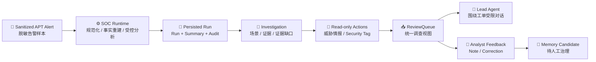

# Boss Demo v0.1 Runbook / 老板演示手册

> Delivery stage: `BD` / Stage 1  
> Current status: `BD-01 Done`, `BD-02 Done`, `BD-03 Done`; **BD Gate Passed**  
> Route source of truth: [`delivery-roadmap.md`](delivery-roadmap.md)

## 1. What We Demonstrate / 汇报结论

SOC Agent 已经不是“一个 prompt 加几个工具”的 Demo。当前演示使用同一套生产形态的 Runtime、
service、repository 和 ReviewQueue contract，把一条脱敏 APT 告警推进为可审阅调查上下文：



老板在 Web 里主要看到：

- 当前研判结论、置信度和 `needs review` 状态。
- 领域发现、攻击场景、当前结论、证据缺口和建议动作。
- 只读调查证据、相似告警（存在时）、确认记忆和调查时间线。
- Runtime 使用的 pipeline/model/prompt 版本。
- 人工关闭、纠正和记忆候选入口。
- mock、fixture、shadow-only 和 disabled 能力的明确边界。

## 2. Current Delivery Snapshot / 当前交付快照

| Task | Status | Evidence / 证据 |
|---|---|---|
| `BD-01` 独立数据与一键准备 | **Done** | `soc demo boss`、独立 `soc_boss_demo.db`、结构化 `soc.boss_demo_manifest.v1`、聚焦测试 |
| `BD-02` Web + Lead Agent 连贯旅程 | **Done** | Docker Gateway/API/Web 共用独立 Demo DB；authenticated Review Context API 200；Web 页面截图与 bounded Lead Agent context bridge 已验证 |
| `BD-03` 演练与验收 | **Done** | live DeepSeek 页面、Web 人工纠正到 pending memory candidate、停栈后的 deterministic clean reset、authenticated context 与最终页面截图均已验证 |

2026-07-17 最新 live Boss Demo 实跑结果：

| Item | Result |
|---|---|
| Manifest status | `ready` |
| Scenario | 1 条 APT / NDR 告警 |
| ReviewQueue | 1 个 open queue item |
| Analyzer | `deepseek-v4-pro` / `soc-analysis-v3` / no silent fallback |
| Runtime decision | `needs_review` / confidence `0.45` / automation blocked |
| Evidence grounding | `6 grounded / 1 rejected`，正确触发 degraded review |
| Domain findings | 3 |
| Read-only evidence | 2 |
| Relevant demo memory | 1 |
| Timeline items | 10 |
| Focused tests | `4 passed` |

`run_id`、`queue_id` 每次 reset 后会重新生成，这是正确的运行实例语义；脚本始终把本次有效 ID
写入 manifest，不要求 ID 固定。

## 3. Commands / 演示命令

所有命令从仓库根目录执行。

### 3.1 Prepare deterministic rehearsal / 确定性彩排

```bash
./scripts/soc-boss-demo.sh prepare --reset
```

作用：

- 只删除并重建 `backend/.deer-flow/data/soc_boss_demo.db`。
- 不触碰开发/测试/生产数据库。
- 运行固定 Runtime 和真实 SOC service/repository contract。
- 保存 launch manifest 到
  `backend/.deer-flow/data/soc_boss_demo_manifest.json`。

### 3.2 Start the browser demo / 启动浏览器演示

```bash
./scripts/soc-boss-demo.sh start --reset
./scripts/soc-boss-demo.sh status
```

浏览器入口：

```text
http://localhost:2026/workspace/soc/review
```

Docker overlay 只把 Gateway 的 `SOC_DATABASE_URL` 指向容器内同一挂载文件：

```text
sqlite:////app/backend/.deer-flow/data/soc_boss_demo.db
```

它不会修改 `.env`，也不会修改 DeerFlow 基础 Compose。

### 3.3 Live DeepSeek path / 真实模型路径

```bash
./scripts/soc-boss-demo.sh start \
  --reset \
  --analyzer-mode llm \
  --model-name deepseek-v4-pro
```

规则：

- `llm` 显式请求失败时命令失败，不静默切到 stub。
- 汇报前若外部模型/网络不可用，重新执行 deterministic 命令，并明确说明当前是固定分析器彩排。
- “真实 LLM 调用成功”不等于 production-ready。

### 3.4 Operations / 状态、日志与停止

```bash
./scripts/soc-boss-demo.sh status
./scripts/soc-boss-demo.sh logs
./scripts/soc-boss-demo.sh stop
```

底层 CLI 调试：

```bash
cd backend
uv run soc demo boss --reset --pretty
uv run soc review list \
  --database-url sqlite:////home/yydspei/projects/deer-flow/backend/.deer-flow/data/soc_boss_demo.db \
  --pretty
```

## 4. Eight-Minute Talk Track / 8 分钟汇报话术

| Time | Screen / 页面 | What to say / 讲什么 |
|---|---|---|
| 0:00-0:45 | ReviewQueue 列表 | 预警由固定 Runtime 进入统一工单，不让 LLM 随意控制主流程 |
| 0:45-2:00 | 统一调查视图 | 展示结论、置信度、领域发现、证据和缺口；结论与证据分开保存 |
| 2:00-3:15 | 场景与事实 | PingAn Adapter 只处理厂商字段，通用 Runtime 不写死平安字段 |
| 3:15-4:15 | 只读查询证据 | 当前 TI/security-tag 是 mock，但走真实 action/evidence contract，未来只替换 provider |
| 4:15-5:15 | 相似告警/记忆 | 历史关联和确认记忆作为调查证据/提示，不直接改 verdict |
| 5:15-6:15 | Runtime 上下文 | 展示 pipeline/model/prompt 版本和审计，可 replay、可定位、可恢复 |
| 6:15-7:15 | 人工纠正 | 高风险和低置信场景进入人工；反馈生成 candidate，不直接污染 confirmed memory |
| 7:15-8:00 | 边界与路线 | 明确 Demo != Alpha != Production，并展示 `BD -> AA -> BG -> PI` 四阶段路线 |

## 5. Truthful Capability Boundary / 能力边界

| Capability | Mode now | Report wording / 汇报口径 |
|---|---|---|
| Alert input | `fixture` | 使用脱敏真实形态样本，不是实时 Zeus/Kafka 数据 |
| Runtime/service/repository/ReviewQueue | `real contract` | 使用正式代码路径，本地存储为独立 SQLite |
| Analyzer | `deterministic` or explicit `llm` | 两种模式必须在 manifest 中显示，不静默切换 |
| Threat intel / security tag | `mock` | 验证 action/evidence 流；真实 provider 在 Stage 4 接入 |
| Demo confirmed memory | `fixture` | 仅演示检索与治理投影，不代表生产经验库 |
| Authorization/disposition | `shadow-only` | 可以解释和提议，不能改 verdict、关单或授权动作 |
| Block/isolate/auto-close | `disabled` | 当前不执行任何高风险副作用 |

## 6. Failure Handling / 汇报前故障处理

| Symptom | Check | Action |
|---|---|---|
| 页面打不开 | `./scripts/soc-boss-demo.sh status` | 查看 `logs`；确认 Docker Desktop/daemon 可用 |
| 页面没有 SOC 工单 | 查看 manifest 的 `status/queue_id/database_locator` | 重新 `prepare --reset`，确认 Gateway 使用 overlay DB |
| live LLM 失败 | 命令 stderr、Gateway log、模型配置 | 不隐瞒；改用 deterministic 彩排并说明外部依赖失败 |
| WSL 中找不到 `docker` | Docker Desktop / WSL Integration | 启动 Docker Desktop，等待 Engine Ready，并启用当前发行版 WSL Integration |
| 页面显示 mock 证据 | 这是预期边界 | 强调 provider 可插拔，Stage 4 才接真实凭证 |
| reset 后 ID 变化 | 查看新 manifest | 使用新 `queue_id`；不要复用旧链接或截图 |

## 7. Demo Readiness / 演示就绪状态

- `BD Gate` 已通过，当前浏览器入口保持可用：`http://localhost:2026/workspace/soc/review`。
- 明日默认使用 deterministic clean-reset 实例，避免汇报依赖模型网络；需要展示真实模型时使用已保存的
  DeepSeek 页面与 API 证据，并明确两种模式的边界。
- 下一阶段是 `AUD-01 SOC Alpha journey inventory`；Boss Demo 不再新增功能。

## 8. Verification Record / 验证记录

```text
2026-07-17
- ruff check: passed
- backend/tests/test_soc_demo_investigation.py: 4 passed
- deterministic `soc demo boss --reset --pretty`: status=ready
- Docker Gateway/API/Web shared-DB smoke: passed
- authenticated `/api/soc/review/items/<queue_id>/context`: HTTP 200
- bounded Lead Agent review-context artifact: generated and contract-tested
- deterministic Web screenshot: `backend/.deer-flow/soc-boss-demo/review-desktop.png`
- live `deepseek-v4-pro` reset: status=ready, run=RUN-8366A14C3E9B, queue=REV-78D96F703BA0
- live decision: needs_review, confidence=0.45, grounding=6/7, automation_allowed=false
- live Review Context API artifact: `backend/.deer-flow/soc-boss-demo/review-context-live.json`
- Docker later disconnected from WSL; the remaining acceptance work was resumed on 2026-07-18

2026-07-18
- Docker Desktop/WSL Integration recovered; `status` returned READY
- live DeepSeek Web screenshot: `backend/.deer-flow/soc-boss-demo/review-desktop-live.png`
- live baseline copy: `backend/.deer-flow/soc-boss-demo/review-desktop-deepseek.png`
- Web correction recorded as `suspicious`; 1 correction created 1 `pending_review` memory candidate
- feedback evidence: `backend/.deer-flow/soc-boss-demo/review-context-after-feedback.json`
- feedback UI screenshot: `backend/.deer-flow/soc-boss-demo/review-feedback-live.png`
- clean rehearsal: stop stack, then `./scripts/soc-boss-demo.sh start --reset`
- deterministic reset: run `RUN-7330DE4DADCC`, queue `REV-F978361476D8`, queue open
- reset context: 3 domain findings, 2 read-only evidence items, 1 relevant confirmed memory, 0 corrections
- authenticated/CLI context artifact: `backend/.deer-flow/soc-boss-demo/review-context-rehearsal.json`
- deterministic Web screenshot: `backend/.deer-flow/soc-boss-demo/review-desktop-rehearsal.png`
- first readiness probe during Gateway cold start timed out; second probe at about 40 seconds returned READY
- BD-03 complete; BD Gate passed; next task is AUD-01
```

每完成一个步骤都在本节追加“命令、结果、失败/修复和产物路径”，同时同步 `progress.md`。
