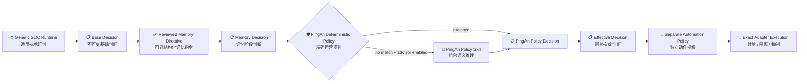

# PingAn Disposition Policy Extraction / 平安处置策略抽取

> Updated: 2026-08-11
>
> 本文是旧 ZEUS Flow、Prompt、同事 Skill Demo 与项目负责人确认经验的迁移台账。它回答三件事：旧实现到底有哪些能力；每类能力在新架构中归谁；哪些已经实现、哪些仍待数据或人工治理。它不是第二套 Runtime，也不把旧 Prompt 的每一行都翻成硬编码。

## 1. Final Boundary / 最终边界



强制边界：

- 通用 Runtime 不包含 `if tenant == pingan`、平安字段、网段、规则码、内部系统或人员名单。
- PingAn Adapter 负责字段解析、canonical 投影和来源语义，不直接设置 verdict、忽略、转交或动作权限。
- 租户策略只在完整 Runtime 之后运行，保留 `Base -> Memory -> Tenant Policy -> Effective` 四阶段留痕。
- Policy Skill 可形成独立运营 Decision，但不能改写技术检测真值，也不能授权外部动作。
- 封禁、隔离、抑制、分单和关单必须再经过独立 `SocAutomationPolicy` 或人工 Grant。

## 2. Rule 24-60 Explained / 已授权活动规则说明

`tenant-disposition-v2.json:24-60` 不是“看到内网 IP 就忽略”，也不是“平安告警默认安全”。它表达的是一个已经完成治理的业务事实：

```text
当前告警技术结论是 true_positive / suspicious / needs_review
  AND 来源属于支持的安全检测域
  AND AuthorizationMatchResult.status == exact
    ├─ subject 精确匹配
    ├─ target 精确匹配
    ├─ behavior 在授权范围
    ├─ tenant/environment 一致
    └─ alert event time 落在授权有效期
       ↓
保留技术检测结论
运营处置 = closed_benign_true_positive
清除逐条人工复核
自动响应姿态 = no_automated_response
```

例如红队在获批时间窗内对获批目标执行真实攻击，检测仍然可以是技术真阳性，但运营上属于“授权良性真阳性”。`exact` 由 Governed Context 授权匹配服务产生；单个 IP、部门名、UA、标签或 Skill 文本都不能伪造它。该规则也不授予封禁、隔离或抑制权限。

## 3. HTTP And Outcome Semantics / HTTP 与结果语义

### 3.1 Canonical status boundary

确定性规则只读取：

- `llm_analysis_request.canonical_entities.http.status_code`
- `llm_analysis_request.canonical_entities.http.observations[].status_code`

并且只接受 `100..599`。以下内容即使字段名叫 `status` 也不参与：工单状态、Workflow 状态、转发状态、规则状态、抑制状态、处置状态、顶层原始 payload 状态，以及 `300XX/500XX` 之类内部业务码。

### 3.2 Current reviewed meaning

- HTTP `200` 只表示请求成功。它单独出现时不产生忽略，也不产生强制转交。
- 至少存在一个 canonical HTTP 状态，且同一告警所有 canonical HTTP 状态均非 `200` 时，可按平安运营规则 `ignored`；技术检测结论仍保留。
- 同一告警同时出现 `200` 与非 `200` 时，不使用“全非 200”规则，由 Runtime/Policy Skill 继续研判多个事务。
- `host_state=攻击成功|失陷` 是 PingAn Adapter 投影的上游结果断言。它会让非 `200` 忽略规则弃权，
  但不会确定性转交；Runtime/Policy Skill 必须结合响应、命令、文件、进程、会话或其他效果证据判断。
- 精确强制转交 rule_code 同样优先于非 `200` 忽略。
- `host_state=失败|攻击失败|请求失败` 可形成明确失败忽略。
- `企图|尝试` 只说明检测到攻击尝试，不等于请求失败；不能由确定性规则直接忽略。
- 响应正文中的成功、失败、命令输出、Token、敏感数据、错误型 SQL 回显等组合语义由 Runtime 和 Policy Skill 判断，不能靠字符串硬编码裁决。

### 3.3 Deterministic priority

数字越小优先级越高：

| Priority | Rule | Meaning |
|---:|---|---|
| 10 | `authorized-activity-operational-close` | 精确授权活动，保留技术真值并运营关闭 |
| 20 | `legacy-forced-transfer-rule-code` | 两个经审阅的历史 rule_code 强制转交 |
| 25 | `edr-safe-software-path-fast-ignore` | 全部 canonical EDR 路径命中精确 `safe_paths` 或安全路径族，运营忽略 |
| 30 | `canonical-http-non-200-ignore` | canonical HTTP 全部非 200，运营忽略 |
| 31 | `provider-confirmed-request-failure-ignore` | 上游明确请求/攻击失败，运营忽略 |

因此 `403 + 攻击成功` 由确定性层弃权并进入 Policy Skill，`403 + 强制 rule_code` 选择强制转交，
`200` 单独出现则 deterministic `no_match`。

## 4. Source-Level Capability Catalog / 旧源码策略能力目录

本次盘点覆盖 `validation/original_works/zeus/prompt/` 的 14 个文件和
`validation/original_works/zeus/flows/` 的 26 个文件。它们不是三条策略，也不是数千条独立策略：

- APT/NIDS/EDR/HIDS/WB/other-topic 的判断步骤与场景 Prompt，主要提炼为 Runtime 证据契约、通用
  triage Skill 和 PingAn Policy Skill；
- 精确 rule code、canonical HTTP 结果、明确 provider failure 和 exact authorization，才适合成为
  确定性租户规则；provider success/compromise 仍需结合实际效果证据；
- 历史相似告警、正常进程链、业务行为和人工处置原因进入 Confirmed Memory，不写成永久条件；
- 内部资产、扫描器、红蓝白队、维护窗口、标签与时效信息进入 Governed Context 或只读 Provider；
- 封禁、隔离、抑制、分单和关单进入独立 Automation Policy/Approval 与动作 adapter；
- NL2SQL、Chat BI、邮件 Agent、报告展示与 attack-chain 可视化不属于当前“单告警研判处置策略”，不因
  出现在旧目录就混进本策略包。

去重后形成以下能力族：

| ID | Legacy source / 代表来源 | Reviewed capability / 能力 | New owner / 新归属 | Status |
|---|---|---|---|---|
| `PA-POL-AUTH-01` | NIDS Flow scanner/渗透名单关闭；HIDS 安全部门/测试活动 | 精确授权活动可运营关闭 | Governed Context exact match + deterministic tenant rule | Implemented；真实权威名单仍 data-gated |
| `PA-POL-RULE-01` | `apt_alert_assess.py:495-505` | `RPAADM_002267`、`RPAADM_000558` 强制转交 | Deterministic tenant rule | Implemented |
| `PA-POL-HTTP-01` | `apt_prompts.py:298-306`、`nids_prompts.py:3748-3753,3839-3841` | canonical 非 200 请求按失败运营忽略；200 继续看效果 | Deterministic tenant rule + Policy Skill | Implemented with corrected boundary |
| `PA-POL-OUTCOME-01` | `apt_prompts.py:473-495`、`nids_prompts.py:4085-4090` | 成功/失陷断言和正文效果需组合判断，明确失败可忽略 | Success/effect -> Policy Skill; exact failure -> deterministic | Implemented |
| `PA-TRIAGE-WEB-01` | APT/NIDS SQL 注入、XSS、RCE、目录遍历、文件读取/上传/下载、WebShell、弱口令、未授权访问场景 | 区分载荷、响应、执行、落盘、回显和影响 | `soc-web-application-triage` + `soc-network-apt-triage` references + Runtime | Extracted and active |
| `PA-TRIAGE-LEAK-01` | APT/NIDS 信息泄露、敏感文件、源码、Token/Session、SQL 数据响应 | 响应中的实质泄露/凭证材料支持升级 | Public triage Skill + PingAn Policy Skill | Extracted and active |
| `PA-TRIAGE-TUNNEL-01` | NIDS NPS；APT proxy/hacker tool；HIDS bounce shell | 代理、隧道、反弹 Shell、C2 与双用途工具研判 | Network/Endpoint Skills + scenario findings | Extracted and active |
| `PA-TRIAGE-DIR-01` | APT/NIDS `sip/dip`、XFF、CDN、to_client/to_server；反连方向 | 分离 wire source/destination、attacker/victim、proxy/relay | PingAn normalizer + `soc-asset-direction` | Implemented; conflict remains reviewable |
| `PA-TRIAGE-ENDPOINT-01` | `edr_alert_assess.py:356-418`；HIDS event-type router | 按进程、命令、路径、用户、提权、持久化、回连等场景研判 | Skill resolver + `soc-endpoint-triage` references | Extracted and active |
| `PA-TRIAGE-HIDS-01` | `hids_alert_assess.py:256-290`；HIDS `malic_opera/backdoor/bounce_shell/web_command/bruteforce/virus/privilege/honeypot/webshell` | HIDS 场景化方法与人工核查项 | Endpoint Skill + open-vocabulary Finding | Extracted and active |
| `PA-CTX-ORG-01` | 内部网段、域名、系统、产品、部门、账号 | 可变化的租户环境事实 | Governed Context / read-only Provider | Cataloged; authoritative source data-gated |
| `PA-CTX-EXERCISE-01` | 扫描器、红蓝白队、护网、维护窗口、安全测试 | 有主体、目标、行为和时效的授权事实 | Governed Context / authorized activity | Lifecycle implemented; real feed data-gated |
| `PA-MEM-BEHAVIOR-01` | 历史关联处置、已确认正常命令/进程链/业务行为 | 可复用但需版本、有效期和人工确认的经验 | Confirmed Memory | Infrastructure implemented; content onboarding ongoing |
| `PA-TOOL-PATH-01` | EDR 安全路径表；`edr_alert_assess.py:429-448` | 路径、hash 和历史处置查询上下文 | `endpoint.software_path.lookup` | Implemented; 命中不等于天然安全，D 盘重点关注 |
| `PA-POL-PATH-01` | 同一 EDR 安全路径表 + 项目负责人确认的高吞吐模式 | 全路径精确/路径族覆盖可直接运营忽略 | PingAn policy signal + deterministic tenant rule | Implemented; default-off，exact/family 同等奏效，Runtime truth retained |
| `PA-TOOL-ASSET-01` | APT/NIDS/EDR/HIDS asset/BUS/owner 定位 | 资产归属、环境、处置目标候选 | `asset.locate` Provider | Product path implemented; real intranet acceptance open |
| `PA-TOOL-TI-01` | APT IP intelligence/risk score | IP 信誉、标签、时效 | `threat_intel.ip_reputation.lookup` | Product path implemented; real intranet acceptance open |
| `PA-TOOL-TAG-01` | 渗透名单、扫描器指纹、安全标签 | 当前实体的标签调查结果 | `security_tag.lookup`; confirmed authorization uses Governed Context | Product path implemented; real feed/authority open |
| `PA-AUTO-01` | APT IP block、HIDS host isolation、NIDS suppression/assignment | 封禁、隔离、抑制、分单等副作用 | Separate Automation Policy + exact adapter/Approval | Generic governance implemented; real PingAn adapters/review open |
| `PA-REJECT-01` | 多处“字段缺失/响应为空直接忽略” | 缺失证据不能证明安全 | Rejected; evidence gap -> review | Enforced by new architecture |
| `PA-REJECT-02` | 固定域名、账号、部门、路径、UA 宽泛白名单 | 旧样本只能作为候选或评测材料 | Governed Context / Memory / eval fixture, never public Skill | Direct migration rejected |
| `PA-REJECT-03` | `alert_action_merge` 与互相矛盾 Prompt 优先级 | 隐式覆盖无法审计 | Replaced by explicit four-stage decisions and priorities | Replaced |

### Scenario inventory covered by the catalog

- APT: event TCP、认证控制、暴力破解、系统/服务配置、后端程序、挖矿、信息泄露、XSS、敏感文件、代码/命令执行、文件下载/上传/读取、WebShell、代理/黑客工具、SQL 注入、未授权访问、目录遍历、弱口令。
- NIDS: 可疑通信、网络代理、XML 实体、权限绕过、代码/命令执行、文件下载/上传/读取、默认/弱口令、WebShell、信息泄露、未授权、目录遍历、TCP/UDP 黑客工具、DNS/后台通信。
- EDR: 登录数据/系统文件读取、提权、历史安全路径、通用 LLM 兜底和后续处置目标。
- HIDS: 可疑操作、后门检测、反弹 Shell、Web 命令、内外网爆破、病毒、提权、蜜罐、WebShell。

这些场景已经进入通用 Skill/Runtime 方法或平安 Policy Skill。内部系统、人名、部门和宽泛字符串白名单没有被永久激活；软件路径只有在显式开启的 PingAn 高吞吐策略中，按版本化 exact/family 完整覆盖契约生效。

## 5. Implemented Artifacts / 已实现载体

| Artifact | Role |
|---|---|
| `backend/soc_agent/integrations/pingan/policies/tenant-disposition-v2.json` | 服务端持有、版本化、按优先级执行的五条精确规则 |
| `backend/soc_agent/integrations/pingan/software_path_policy.py` | 将 canonical EDR 路径的完整 exact/family 覆盖转成受审计策略信号；不进入通用 Runtime |
| `backend/soc_agent/integrations/pingan/policy_skills/disposition/SKILL.md` | deterministic no-match 后的受限组合语义策略；不进入普通 Skill 自动发现 |
| `skills/public/soc-network-apt-triage/` | 跨租户网络/APT 方法、C2/隧道与利用成功证据 |
| `skills/public/soc-web-application-triage/` | HTTP、代理链、Web 攻击与响应效果 |
| `skills/public/soc-endpoint-triage/` | EDR/HIDS 进程链、命令、路径、提权、持久化和回连 |
| `skills/public/soc-asset-direction/` | 攻击方向、角色、代理/中继和处置目标 |
| `backend/soc_agent/integrations/pingan/` | PingAn 字段 Adapter、Policy、Provider 和 MCP 边界 |

Policy Skill 放在 Integration 而不是 `skills/public`，因为它包含平安运营语义，只有服务端显式配置后才能执行；普通 Lead Agent 不应把它当通用安全知识动态加载。

## 6. Operator Switches / 配置开关

```bash
SOC_TENANT_POLICY_ENABLED=true
SOC_TENANT_DISPOSITION_POLICY_PATH=backend/soc_agent/integrations/pingan/policies/tenant-disposition-v2.json
SOC_TENANT_POLICY_ENVIRONMENT=dev
SOC_TENANT_POLICY_EVENT_TIMEZONE=Asia/Shanghai

# EDR 安全软件路径高吞吐策略默认关闭
SOC_PINGAN_SOFTWARE_PATH_CATALOG_PATH=backend/.deer-flow/pingan-context/software-path-catalog.sqlite
SOC_PINGAN_SOFTWARE_PATH_FAST_POLICY_ENABLED=true

# 组合语义策略默认关闭；只启用确定性规则时保持 off
SOC_TENANT_POLICY_ADVISOR_MODE=llm
SOC_TENANT_POLICY_SKILL_PATH=backend/soc_agent/integrations/pingan/policy_skills/disposition/SKILL.md
SOC_TENANT_POLICY_MODEL=deepseek-v4-flash
```

- 总开关默认 `false`；只给 path 而未显式打开会启动失败。
- 路径快速策略还要求自己的显式开关和 catalog；精确 `safe_paths` 与安全路径族同等直接 `ignored`，但必须覆盖当前告警全部相关路径。
- 任一路径未知、仅命中 `other_paths`、哈希冲突、非法或超预算时不产生聚合信号，回到正常 Runtime/Policy Skill 结果。
- Advisor 只在 deterministic `no_match` 后运行；调用、schema 或引用校验失败保存 `failed_closed + no_match`。
- 没有 `SOC_AUTOMATION_POLICY_PATH` 时可以形成运营 disposition，但不会授权或执行动作。
- 真正执行仍需 `SOC_AUTOMATION_EXECUTE_AUTHORIZED_ACTIONS=true` 和受评审 registry。

本地浏览器验收使用额外的显式安全门：

```bash
SOC_DEV_WORKBENCH_ALLOW_TENANT_POLICY=true
SOC_TENANT_POLICY_ENABLED=true
SOC_TENANT_POLICY_ADVISOR_MODE=llm
SOC_PINGAN_SOFTWARE_PATH_FAST_POLICY_ENABLED=true
SOC_AUTOMATION_EXECUTE_AUTHORIZED_ACTIONS=false
```

该组合表示“确定性规则 + 安全路径策略 + bounded Policy Advisor”均参与 DEV
研判，但封禁、隔离、抑制等真实外部动作仍不可执行。隔离的完整语料回放作用域
`dev-corpus-eval` 仅用于复用同一份受评审 PingAn policy 做开发验收，不增加生产权限。

## 7. Replay And Review / 回放与复盘

每条持久化 run 必须能看到：

```text
Base Decision
  -> Memory Decision
  -> PingAn Policy Decision
       source = deterministic_rule | llm_policy_skill | no_match
       selected_rule_id / condition evaluations / exact refs
  -> Effective Decision + operational disposition
  -> optional Action Authorization
  -> optional Action Execution
```

查询入口：

```bash
cd backend
.venv/bin/soc automation lineage --run-id RUN_ID --pretty
```

Policy Skill Decision 还保存 model、Prompt/Skill version/hash、response hash、repair/usage、精确 `E/R/S/A/M/C/T-*` 引用或 fail-closed code。

历史 `e2e-ten-pingan-policy-20260811/` 报告使用旧 v2.1 语义，只能保留作历史基线，不能沿用“HTTP 200 确定性升级”的旧统计。

v2.2 live-model 验收位于
`backend/.deer-flow/soc-validation/e2e-ten-pingan-policy-v2.2-20260811/`：固定十条告警
`10/10` 结构与安全链路通过；1 条命中确定性
`provider-confirmed-success-escalation`，其余 9 条进入 Policy Skill，最终 3 条 Skill advice、6 条
`no_match`。本 cohort 没有 canonical HTTP 全非 `200`、明确失败或强制 rule code 样本，因此这些规则的
正反例由组件测试覆盖，不能把“本批未命中”理解为规则不存在。全批产生 10 条四阶段 transition、0
Memory contributor、0 action authorization/execution、0 real external call；只读调查仍为
`mocked=true`。与旧 v2.1 的同输入比较在
`e2e-ten-pingan-policy-v2.2-comparison-20260811/COMPARISON.md`：5 条 base verdict 变化仅归因于
live-model 重采样，各自 base 到 effective 的 verdict/review 变化为 0。

该 v2.2 结果现为历史基线：v2.3 已删除 `provider-confirmed-success-escalation`。当前代码以
`pingan-disposition-v2.4.0` 和 Policy Skill `v1.2.0` 为准；`攻击成功/失陷` 只阻止非 `200` 直接忽略，
随后进入 Policy Skill。组件测试覆盖确定性弃权与 advisor 接管；新的完整 live 十条重跑尚未执行，不能
把上述 v2.2 命中数量当作 v2.4 当前验收。v2.4 新增的 EDR 路径 exact/family 快速忽略目前只有 catalog
真实构建与聚焦组件证据，尚未进入同一 live 十条 cohort。

## 8. Extraction Acceptance / 后续抽取准则

每新增一条平安经验先回答：

1. 是否是当前告警可观察事实？进入 Adapter/`E-*`。
2. 是否是精确、稳定、服务端可验证的运营规则？进入 deterministic tenant policy。
3. 是否需要理解多个证据、场景和上下文？进入 reviewed Policy Skill 或通用 triage Skill。
4. 是否是会变化、有范围和时效的名单/活动？进入 Governed Context。
5. 是否是人工确认的历史模式？进入 Confirmed Memory。
6. 是否依赖远端当前状态？进入 read-only Provider/Tool。
7. 是否会产生外部副作用？进入独立 Automation Policy/Approval + adapter。
8. 是否只是缺失证据、宽泛字符串或旧 Prompt 的冲突结论？拒绝直接迁移，转成评测样本。

禁止以新增平安策略为理由修改通用 Runtime 控制流。目录入表不等于策略已激活；只有具备 owner、版本、测试、回放和适用范围的载体才可标记 Implemented。
