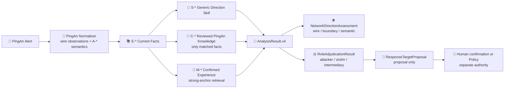

# PingAn Network Direction Knowledge Migration

> Status: Implemented baseline, production quality evaluation pending
>
> Updated: 2026-08-13

本文说明旧 Zeus 方向判断 Prompt、`asset_extractor.py` 和
`security-log-analysis` 经验如何进入新的通用 SOC Runtime。目标不是照搬旧代码，而是保留其有效的
安全语义，同时避免把平安网段、字段名和运营处置写死进通用核心。

## 1. 旧实现的价值与问题

旧实现的主要价值是让 LLM 同时观察：

- 网络五元组和连接发起方向；
- 平安内外网资产归属；
- 反弹 Shell、C2 回连、恶意外联等角色反转场景；
- CDN、XFF、反向代理、F5 SNAT 和 FRP 等中间链路；
- 最终攻击者、受害者与建议处置对象。

问题是这些内容过去被放在一段很长的 Prompt 中，其中混合了通用方法、平安环境知识、供应商字段、
外部查询和运营处置。模型效果可能不错，但无法独立版本、检索、审计或复用。

## 2. 新的六层落位

| 旧内容 | 新落位 | 运行时引用 | 权限边界 |
|---|---|---|---|
| source/destination、端口、XFF 等当前告警事实 | Normalizer + fact catalog | `E-*` | 只证明当前告警包含什么 |
| 通用方向研判方法 | `skills/public/soc-asset-direction` | `S-*` | 只指导推理，不直接改判 |
| PingAn 字段与采集点语义 | PingAn Adapter contract | `A-*` | 只解释供应商数据，不产生租户处置 |
| 已评审的平安网段、内部域名、F5/CDN 语义 | Tenant knowledge profile | `C-*` | 只作为有来源、有限投影的知识上下文 |
| 人工确认的历史场景经验 | Confirmed Memory | `M-*` | 必须经过准入、确认和 retrieval activation |
| CMDB、TI、标签、F5 会话等实时结果 | MCP / Action Adapter | `T-*` | 默认只形成调查证据 |
| 忽略、转交、封禁等运营规则 | Tenant Policy / Automation Policy | 独立 Decision lineage | 不进入方向知识，不改写基础检测真值 |

静态知识和动态事实必须分开。平安受控网段属于可版本化的租户知识；某个 IP 在某次护网中属于红队、
当前扫描是否获授权、某个变更窗口是否有效，必须进入 Governed Context Fact 生命周期，不能永久写入
本 profile。

## 3. 当前实现

Implemented artifacts:

- `backend/soc_agent/integrations/pingan/knowledge/network-direction-v1.json` stores the reviewed
  PingAn profile. It is selected by `integration_name` or tenant scope and projects only facts whose
  selectors match the current canonical request.
- Profile `1.3.0` records the operator-confirmed `26/8`, `29/8`, and PingAn-owned `172/8` ranges,
  distinguishes reviewed office `/16` subnets, adds the negative caveat that `*.pingan.com.cn`
  and `*.pingan.com` do not prove an internal traffic direction, and records that provider GeoIP
  enrichment may mislabel `30/8` as a foreign location. GeoIP remains audit-only and cannot override
  typed network ownership. The full migration review is
  `tenant-static-knowledge-migration.md`.
- `TenantKnowledgeAnalysisRequestEnricher` projects bounded, hashed `C-*` catalog items. It does not
  execute tenant code and every projection records profile/fact/source/review lineage plus
  `decision_authority=none`.
- `AnalysisResult.v4` returns `NetworkDirectionAssessment`, `RoleAdjudicationResult`, typed roles and
  action-specific `ResponseTargetProposal` objects. Every assessed result must cite exact `E-*`,
  `R-*` and any used `S/A/M/C/T-*` context.
- `SocReviewService.confirm_role_adjudication()` and the Review API create append-only human role
  revisions. They do not rewrite model output and do not authorize an action.

## 4. Three Distinct Questions / 三个问题必须分开

1. **Wire flow / 线上流向**：日志中实际观察到 `source -> destination`，可能只是一段代理或 SNAT 后链路。
2. **Boundary direction / 组织边界方向**：外到内、内到外、内到内、外到外、代理中介或无法判断。
3. **Security roles / 安全角色**：谁是 attacker、victim、impacted asset、proxy、relay、scanner 或 C2。

因此禁止建立 `source == attacker`、`destination == victim` 的全局规则。反弹 Shell 中 source 可以是受害主机，
CDN 场景中 source 可以是中间节点，F5 SNAT 采集点甚至可能只有后半段流量。

## 5. Knowledge Use Across the Product / 知识如何被使用

- **固定 Runtime Analyzer**：只注入当前告警命中的有限 `S/A/C/M/T-*` 条目，帮助输出方向、角色、场景和
  证据缺口；不把旧 Prompt 全文塞入每次请求。
- **SOC Lead Agent / specialist**：继续按需动态读取 public Skill 的详细 references；ReviewQueue 中只看到
  已冻结的当前告警事实、模型结果、人工修订和受控调查证据。
- **Fact reconstruction**：保持 code-first，只重建观测、声明和冲突，不尝试用平安知识确定最终安全角色。
- **Memory**：只保存通过 `MemoryAdmissionService` 的人工可复用经验；租户静态网段不通过逐告警 Memory
  反复沉淀。
- **Tenant Policy / Automation**：消费已完成的技术研判和独立运营事实，决定复核、处置或动作授权；不能把
  “内部资产”自动等价为“安全”。

## 6. Validation Boundary / 验收边界

当前组件测试已证明 profile 选择、按当前告警匹配、`C-*` hash/lineage、v4 schema/parser/reference
validation、人工修订和 Retrieval v2 强锚点机制。真实模型的方向/角色准确率仍必须使用脱敏、人工确认的
APT/NDR/EDR/HIDS 样本评测：至少分别覆盖正向攻击、反连、内到外、内到内、CDN/XFF、F5 SNAT、多个
wire observation 和无法判断。组件通过不能替代这项生产质量 Gate。
