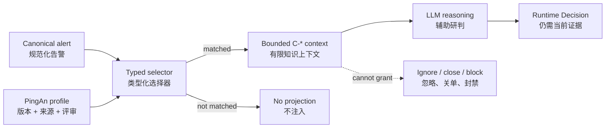

# PingAn Tenant Static Knowledge Migration

> Status: Implemented baseline
>
> Review date: 2026-08-13
>
> Scope: PingAn legacy alert integration only

本文记录旧 `security-log-analysis`、Zeus Prompt 和运营确认中的平安通用知识，哪些已经进入生产
Runtime、如何匹配，以及哪些内容被明确拒绝。它是本轮 Profile 的 review authority，不替代原始来源。

## 1. Runtime Boundary / 运行边界

平安静态知识以版本化 `TenantKnowledgeProfile` 保存，只在
`integration_name=pingan_legacy_alert_platform` 时参与匹配。命中的条目投影为有来源和 hash 的 `C-*`
上下文，并固定携带 `decision_authority=none`。



`C-*` 只回答“当前规范化实体命中了哪条已评审平安背景知识”。它不是当前告警证据 `E-*`，不是历史
Memory `M-*`，不是实时工具结果 `T-*`，也不是 Tenant/Automation Policy。

## 2. Typed Selector / 类型化选择器是什么意思

Selector 是知识的启用条件。一个 Profile 可以包含很多知识，但一次告警只注入与当前规范化实体匹配的
少量条目。

| Selector | 只检查 | 示例 | 不会检查 |
|---|---|---|---|
| `host_prefixes` | canonical host name | `CTXGMPVS-PA178` 命中 `CTX` | rule name 或 raw text 中偶然出现的 `CTX` |
| `process_names` | canonical process/parent/tree node name | `PaMailH5App.exe` | 一段描述文本中的同名字符串 |
| `path_prefixes` | canonical process/file path | `C:/Program Files/pingantechmail/B/...` | command line 或任意 payload 的模糊包含 |
| `account_patterns` | canonical user/UM/process user | `EX-ZHANGWU233` | request body 中偶然出现的账号样式文本 |
| `uri_prefixes` | canonical HTTP path/URL path | `/code_pilot/api/v1/...` | 日志全文中的路径片段 |

同一字段内多个值是 **OR**，例如两个 URI 前缀命中任一即可；不同非空字段组之间是 **AND**，例如
Palo 条目必须同时命中精确 IP 和 URI。大小写、Windows 路径分隔符和 URL query 在通用 matcher
边界做确定性规范化，租户 Profile 不读取平安字段名。

## 3. Activated Profiles / 已启用 Profile

| Profile | 当前内容 | 版本 |
|---|---|---|
| `pingan.network_direction` | 内部/办公/BGP/APP-TS/PAFC 地址、域名边界、反连与代理链路解释 | `1.2.0` |
| `pingan.platform_context` | 青藤 HIDS 来源背景、禁止从 topic 推断环境 | `1.0.0` |
| `pingan.internal_systems` | CTX、HappyPA、PaMail、AskBob、IOBS、CodePilot、data-manager、Palo、ubiops、账号格式 | `1.0.0` |

内部系统条目只建立“应用、平台、主机角色或账号格式身份”。即使旧资料曾把某案例写成误报，新 Profile
也不会直接输出低风险、忽略或白名单结论。

## 4. Review 2026-08-13 / 本次人工确认

以下事实由当前项目运营方明确确认，可以作为 PingAn 静态知识：

- `172.0.0.0/8` 是平安真实自用/受控地址空间；不沿用旧文档对 RFC 1918 的错误解释。
- `26.0.0.0/8`、`29.0.0.0/8` 是平安内网地址空间，不再保留“待确认”状态。
- `security_qthids-stg` 等 topic 不能作为 `dev/stg/prd` 环境真值；Runtime 必须依赖明确的当前告警或
  受治理资产证据。
- `*.pingan.com.cn`、`*.pingan.com` 可内外访问，域名后缀不能证明流量是内网方向。
- `*.paic.com.cn` 仍是内部域名信号，但代理改写等当前证据可推翻该方向提示。

## 5. Explicitly Not Migrated / 明确拒绝迁移

以下旧经验不会进入静态 Profile：

- “国内 IP 默认可能是平安资产”、夜间扫描或端口经验等宽泛启发式；
- 仅凭 `dev/stg/test`、topic、主机名片段或环境名称直接判定无风险；
- 扫描器、红队、护网、渗透测试和维护窗口的永久白名单，它们必须走 event-time governed context；
- 仅凭内部系统、安全产品、进程或路径身份直接忽略告警；
- “命中 CodePilot/IOBS/data-manager/Palo 就必然误报”等历史结论；
- 原 Prompt 中“固定时间、固定来源、固定 rule code 就忽略/转交”的宽泛处置规则；
- 青藤 topic 到环境的旧映射，该规则已被本次运营确认明确取代。

EDR 软件路径已有独立 `software_path_catalog`、Tenant Policy 和评测边界，不复制进静态知识。扫描器、
安全演练和授权工具进入 `AuthorizedActivityFact`；可复用的人工历史结论进入受审核 Memory；实时资产、TI
和标签进入 MCP/Action Adapter。

## 6. Deferred Candidates / 后续候选

旧资料还包含机房代码、安全产品名称、扫描器地址和更多业务系统。暂不启用的原因分别是：缺少稳定的
canonical typed selector、需要有效期/owner，或只有单案例结论。后续新增必须：

1. 先确认它是稳定静态身份，而不是动态授权或历史处置；
2. 使用 canonical typed selector，不用 raw vendor field 或宽泛 `text_terms`；
3. 提供 source、review、profile version 和跨租户不泄漏测试；
4. 文案明确禁止把身份直接等价为 benign、authorized 或 action authority；
5. 修改 Profile 后用固定真实样本做 selection diff，再评审是否启用。

## 7. Validation / 验证

聚焦回归：

```bash
cd backend
.venv/bin/pytest -q tests/test_soc_agent_tenant_knowledge_context.py
```

验收至少覆盖已确认网段、办公网细分、企业公网域名反例、五类 typed selector、AND 组合、invalid regex、
纯文本误触发和其他厂商 integration 隔离。结构测试只证明选择与权限边界，不替代 LLM 研判准确率评测。
