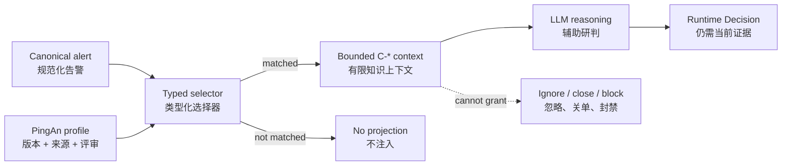

# PingAn Tenant Static Knowledge Migration

> Status: Implemented baseline
>
> Review dates: 2026-08-13, 2026-08-24
>
> Scope: PingAn legacy alert integration only

本文记录旧 `security-log-analysis`、Zeus Prompt 和运营确认中的平安通用知识，哪些已经进入生产
Runtime、如何匹配，以及哪些内容被明确拒绝。它是本轮 Profile 的 review authority，不替代原始来源。

## 1. Runtime Boundary / 运行边界

平安静态知识以版本化 `TenantKnowledgeProfile` 保存，只在
`integration_name=pingan_legacy_alert_platform` 时参与匹配。命中的条目投影为有来源和 hash 的 `C-*`
上下文，并固定携带 `decision_authority=none`。



`C-*` 只回答“当前规范化实体命中了哪条已评审平安背景知识”。它不是当前告警证据 `E-*`，不是历史
Memory `M-*`，不是实时工具结果 `T-*`，也不是 Tenant/Automation Policy。

## 2. Typed Selector / 类型化选择器是什么意思

Selector 是知识的启用条件。一个 Profile 可以包含很多知识，但一次告警只注入与当前规范化实体匹配的
少量条目。

| Selector | 只检查 | 示例 | 不会检查 |
|---|---|---|---|
| `host_prefixes` | canonical host name | `CTXGMPVS-PA178` 命中 `CTX` | rule name 或 raw text 中偶然出现的 `CTX` |
| `process_names` | canonical process/parent/tree node name | `PaMailH5App.exe` | 一段描述文本中的同名字符串 |
| `path_prefixes` | canonical process/file path | `C:/Program Files/pingantechmail/B/...` | command line 或任意 payload 的模糊包含 |
| `command_terms` | canonical process/parent/tree node command line | `powershell.exe -File Map_Drive.ps1` 命中 `map_drive.ps1` | rule name、raw payload 或告警描述中的同名字符串 |
| `process_observation_patterns` | 一个 process observation，或同一 `event_scope_id` 内通过“相同规范化进程名 + 相同非空 PID”连通的 observation component | `Ccm32BitLauncher -> cmd -> PowerShell` | 两条不相关日志、同事件中不连通的片段或只有同名但 PID 缺失的片段 |
| `parent_process_names` / `parent_command_terms` | canonical direct parent identity/command | 标准 `msiexec.exe /V` 自调用 | 从进程名称集合猜测父子关系 |
| `file_observation_patterns` | 同一个 canonical file observation 的 relation、name、path prefix/suffix | Startup 下的 `observed_artifact` `.lnk` | 把进程文件与 IOC 文件拼成一个对象 |
| `required_exact_command_lines` | canonical normalized complete command | `net share` | `net share d$ /delete`、`net user ...` 等包含相同前缀的变更命令 |
| `account_patterns` | canonical user/UM/process user | `EX-ZHANGWU233` | request body 中偶然出现的账号样式文本 |
| `uri_prefixes` | canonical HTTP path/URL path | `/code_pilot/api/v1/...` | 日志全文中的路径片段 |

同一字段内多个值是 **OR**，例如两个 URI 前缀命中任一即可；不同非空字段组之间是 **AND**，例如
Palo 条目必须同时命中精确 IP 和 URI。大小写、Windows 路径分隔符和 URL query 在通用 matcher
边界做确定性规范化，租户 Profile 不读取平安字段名。

## 3. Activated Profiles / 已启用 Profile

| Profile | 当前内容 | 版本 |
|---|---|---|
| `pingan.network_direction` | 内部/办公/BGP/APP-TS/PAFC 地址、GeoIP 误标边界、域名边界、反连与代理链路解释 | `1.3.0` |
| `pingan.platform_context` | 青藤 HIDS 来源背景、禁止从 topic 推断环境 | `1.0.0` |
| `pingan.internal_systems` | CTX、HappyPA、PaMail、AskBob、IOBS、CodePilot、data-manager、Palo、ubiops、账号格式 | `1.0.0` |
| `pingan.endpoint_playbooks` | canonical 多信号命中的已审核终端行为解释：组策略、SCCM、PyCharm/WMIC、Notepad++、exact `net share`、FDMEE、Office Assistant NSIS、MSI Startup | `1.4.0` |

内部系统条目只建立“应用、平台、主机角色或账号格式身份”。即使旧资料曾把某案例写成误报，新 Profile
也不会直接输出低风险、忽略或白名单结论。

`endpoint_playbooks` 与普通身份知识不同：它保存已审核、可在首条告警使用的多信号行为解释，但仍只
投影 `C-*` 分析上下文，不产生 Memory Directive 或运营处置权限。它只读取 canonical typed process、
parent、command-line 和 file observation 信号。当前 matcher 不扫描 rule name、原始 payload 或任意描述
文本；非空 selector group 继续按 AND 组合，文件条件必须在同一个 file observation 上成立。

## 4. Review 2026-08-13 / 本次人工确认

以下事实由当前项目运营方明确确认，可以作为 PingAn 静态知识：

- `172.0.0.0/8` 是平安真实自用/受控地址空间；不沿用旧文档对 RFC 1918 的错误解释。
- `26.0.0.0/8`、`29.0.0.0/8` 是平安内网地址空间，不再保留“待确认”状态。
- `security_qthids-stg` 等 topic 不能作为 `dev/stg/prd` 环境真值；Runtime 必须依赖明确的当前告警或
  受治理资产证据。
- `*.pingan.com.cn`、`*.pingan.com` 可内外访问，域名后缀不能证明流量是内网方向。
- `*.paic.com.cn` 仍是内部域名信号，但代理改写等当前证据可推翻该方向提示。
- 平安供应商 GeoIP/address-location enrichment 可能把 `30/8` 内网地址标为美国或美国州名；该字段只
  保留审计，不参与方向/角色推理，且不能覆盖已审核 `network_scope`。
- 平安五组 `network_scope` Fact 均显式声明并通过通用 metadata 投影
  `network_scope_membership=organization_controlled`；这是类型化组织归属，不依赖解析英文 statement，
  也不把平安网段写进通用 Runtime。其他供应商可明确声明 external/shared，而不是被通用层默认成内网。

## 5. Explicitly Not Migrated / 明确拒绝迁移

以下旧经验不会进入静态 Profile：

- “国内 IP 默认可能是平安资产”、夜间扫描或端口经验等宽泛启发式；
- 仅凭 `dev/stg/test`、topic、主机名片段或环境名称直接判定无风险；
- 扫描器、红队、护网、渗透测试和维护窗口的永久白名单，它们必须走 event-time governed context；
- 仅凭内部系统、安全产品、进程或路径身份直接忽略告警；
- “命中 CodePilot/IOBS/data-manager/Palo 就必然误报”等历史结论；
- 原 Prompt 中“固定时间、固定来源、固定 rule code 就忽略/转交”的宽泛处置规则；
- 青藤 topic 到环境的旧映射，该规则已被本次运营确认明确取代。

EDR 软件路径已有独立 `software_path_catalog`、Tenant Policy 和评测边界，不复制进静态知识。扫描器、
安全演练和授权工具进入 `AuthorizedActivityFact`；可复用的人工历史结论进入受审核 Memory；实时资产、TI
和标签进入 MCP/Action Adapter。

## Review 2026-08-24 / 终端 Playbook 首批确认

旧资料中的组策略登录脚本案例已作为第一个 bootstrap playbook 启用，理由是它不是某一 IP/主机的一次
运营点击，而是由稳定 canonical 多信号表达的已审核行为模式：

```text
source_type = edr|hids
AND process_names contains gpscript.exe
AND canonical command line contains map_drive.ps1
```

命中后，`C-*` 会说明 `gpscript.exe /Logon -> PowerShell -File Map_Drive.ps1` 与仅加载
`System.Management.Automation.dll` 的组合强烈支持组策略登录脚本误报解释；异常父进程/路径、编码或
下载载荷、凭据访问、持久化、网络回连及其他当前恶意效果均为失效条件。该知识不自动忽略、不直接
修改 Effective Decision，也不替代后续由运营反馈产生的 Memory。

为什么不把它做成 Memory：这是经旧知识源和当前项目所有者确认的租户启动知识，目标是在尚无历史
Memory 的第一条告警就可使用。为什么不放 public Skill：它包含 PingAn 运营确认和内部规则背景。后续
同类告警的具体结论、适用范围调整和反例仍进入受治理 Memory；其他旧案例在逐条 selector/eval 审核前
保持未启用，禁止整份旧 Prompt 常驻。

### Review 2026-08-24 / Endpoint Playbooks v1.3

第二批只启用了有明确旧来源、可被当前 canonical 数据表达且有真实正反例的条目：

- SCCM PowerShell：同一 sensor event 内的 process edge 必须通过共享 PID/identity 连通；13 条部署样本
  命中，执行 `cacls` 权限修改的相邻样本不命中。
- PyCharm/WMIC：必须同时出现 PyCharm/WMIC 进程链和 SecurityCenter2 AntivirusProduct 只读命令；
  21 条命中，DataGrip/IDEA/其他 PyCharm 命令不借用该知识。
- Notepad++：必须是 `explorer.exe` 交互启动且命中已审核编辑器路径；两个 EDR 样本命中，普通 Windows
  Notepad 调命令样本不命中。
- `net share`：完整规范化命令必须严格相等；只读列举命中，`net share d$ /delete` 不命中。

### Review 2026-08-24 / Endpoint Playbooks v1.4

项目所有者随后分别确认启用三条独立 Playbook：

- FDMEE：仅匹配 `cscript.exe` 执行已审核 `215.22.0.180/hfm_core/FDMEEWorkspace/.../data/scripts/event/*.vbs`
  结构；当前语料 12/12 命中，服务器或脚本层级变化不命中。
- Office Assistant NSIS：要求连通的 Office Assistant Setup / `old-uninstaller.exe` 产品更新链、标准更新
  参数及 Temp `System.dll` action target；只命中 `1968376`，不把旧 agent-updater 或全部 NSIS 视为同一事实。
- MSI Startup：要求标准路径 `msiexec -Embedding`、标准父进程 `msiexec /V` 和同一告警中 Startup
  `observed_artifact` `.lnk`；`1976406`、`1976564`、`1986762` 3/3 命中。

为避免从全局路径集合拼接事实，通用 selector 增加 canonical direct-parent 和单个 file observation 的
类型化 gate。MSI 的 path-shaped `str_ioc_value` 仍作为独立 `observed_artifact`，不会覆盖
`str_suspicious_file` 代表的进程/动作对象。完整来源、反例和未迁移项见
`legacy-knowledge-migration-matrix.md`。

## 6. Deferred Candidates / 后续候选

旧资料还包含机房代码、安全产品名称、扫描器地址、更多业务系统和其他 endpoint playbook。逐项状态、
真实语料覆盖、负例和需要当前项目所有者确认的内容统一见
`legacy-knowledge-migration-matrix.md`。暂不启用的原因分别是：缺少稳定的 canonical typed selector、
需要有效期/owner，或只有单案例结论。后续新增必须：

1. 先确认它是稳定静态身份，而不是动态授权或历史处置；
2. 使用 canonical typed selector，不用 raw vendor field 或宽泛 `text_terms`；
3. 提供 source、review、profile version 和跨租户不泄漏测试；
4. 文案明确禁止把身份直接等价为 benign、authorized 或 action authority；
5. 修改 Profile 后用固定真实样本做 selection diff，再评审是否启用。

## 7. Validation / 验证

聚焦回归：

```bash
cd backend
.venv/bin/pytest -q tests/test_soc_agent_tenant_knowledge_context.py
```

验收至少覆盖已确认网段、办公网细分、企业公网域名反例、五类 typed selector、AND 组合、invalid regex、
纯文本误触发和其他厂商 integration 隔离。结构测试只证明选择与权限边界，不替代 LLM 研判准确率评测。
