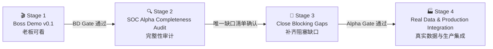

# SOC Agent Delivery Roadmap / 阶段性交付路线

> Status: **Authoritative / 权威执行顺序**  
> Current stage: **Stage 4 - Real Data & Production Integration**
> This document owns stage order and stage gates. `soc-agent-solution.md` owns the product and
> architecture design; `progress.md` records current execution status.

## 1. Delivery Decision / 交付决策

后续严格按以下四阶段推进，不跳步、不并行发散：



这四个结果不能混为一谈：

| Result / 结果 | Definition / 定义 | Does not mean / 不代表 |
|---|---|---|
| Boss Demo v0.1 | 老板可在浏览器中看到一条代表性告警完成受控研判闭环 | SOC Alpha 已完整、生产已就绪 |
| SOC Alpha audit | 全链路能力被逐项审阅并分类，阻塞项有唯一清单 | 审计时顺手修完所有问题 |
| SOC Alpha complete | 本地/测试环境中的产品闭环可重复，代码可控的 P0/P1 阻塞项已清零 | 已接真实平安系统或允许自动处置 |
| Production integration | 真实数据源、凭证、基础设施、运营指标和治理门槛得到验证 | 自动等同正式 GA 或开放高风险动作 |

## 2. Stage Overview / 阶段总览

| Stage | Status | Primary outcome / 核心产出 | Exit gate / 退出门槛 |
|---|---|---|---|
| `BD` Boss Demo v0.1 | **Done** | 一条 8-10 分钟、浏览器优先、可重复的 golden path | `BD-01..03` 与 BD Gate 已通过 |
| `AA` SOC Alpha Completeness Audit | **Done / AA Gate Passed** | 唯一的 Complete/Gap/Mock/Data-gated/Deferred 矩阵 | 审计矩阵和 P0/P1 阻塞清单已于 2026-07-18 确认 |
| `BG` Close Blocking Gaps | **Done / Alpha Gate Passed 2026-07-20** | P0/P1、Alpha readiness technical gate、独立评审与具名批准已完成 | `BG-03` 已批准进入 Stage 4 integration preparation |
| `PI` Real Data & Production Integration | **Current / PI-01E External Simulation -> Internal Real** | 真实 PingAn/通用 provider；所有内网依赖先完成外网仿真交付包 | Pilot readiness review 通过 |

Boss Demo v0.1 和 Alpha 完整性审计已于 2026-07-18 分别通过 BD Gate、AA Gate；冻结的
`BG-P0-01..BG-P1-05` 与 `BG-03` 已于 2026-07-20 关闭。`PI-04-A SOC Operations Snapshot` 已完成。产品负责人于 2026-08-04 明确将已具备完整验收工具、但仍需内网输入的 `D12-B` 暂存为 `Parked / internal evidence pending`。`PI-01A` 与 `PI-01B1` 已完成 production-shaped Provider/MCP 的外网可验证部分并保留各自真实内网 gate；`PI-01B2` 和 `PI-01C` 因缺真实权威来源/事件协议标为 `Data-gated`，不能用 fixture 或旧代码猜测补齐。`PI-01D1/D2/D3/D4` 已完成版本化只读调查计划、显式 composition、Registry fail-fast、durable execution/attempt ledger、逐次 result-mode 校验、Kafka/internal-batch opt-in，以及从持久状态重建的 shadow report/addendum。2026-08-05 起，所有需要内网才能完成的已确认能力必须先完成外网 simulation package；PI-01E 五条及五十条 paired external simulation 均已通过，当前只进入批准内网的五条 `internal_real`，不再扩充外网 Mock。所有真实 `mocked=false` 门槛均未降低。当前 DEV 统一使用独立本地 SQLite，不收集真实 Kafka/K8s/PostgreSQL 参数；未经证实的进程树/主机上下文查询 mock 已删除，不得以“先仿真”为由恢复或虚构能力。

## 3. Stage 1 - Boss Demo v0.1

### 3.1 Audience and story / 受众与故事

主要受众是老板和产品/安全负责人。主入口是 Web，终端命令只负责准备环境：

1. 导入一条有代表性的 APT/反弹 Shell 告警。
2. Runtime 展示规范化、事实重建、受控 LLM 研判和决策理由。
3. 调查上下文展示实体、攻击方向、场景、证据、证据缺口和相似历史告警。
4. ReviewQueue 展示待复核工单；Lead Agent 可围绕该工单对话。
5. 分析师提交 note/correction，系统产生可审阅 memory candidate。
6. 所有 mock、shadow-only、未接真实 provider 的能力在页面或演示清单中明确标记。

### 3.2 Work packages / 工作包

| ID | Work / 工作 | Deliverable / 产出 | Acceptance / 验收 |
|---|---|---|---|
| `BD-01` | Scope freeze + one-command golden path / 范围冻结与一键准备 | **Done**: 独立可重置 Boss Demo SQLite、`soc demo boss`、结构化 launch manifest 和聚焦测试 | 不手改数据库；输出 Web URL、`run_id`、`queue_id`、analyzer mode、真实/mock 边界和下一步命令；失败不得静默降级 |
| `BD-02` | Web + Lead Agent coherent journey / 连贯可见链路 | **Done**: Docker Gateway/API/Web 共用独立 Demo DB；authenticated API、ReviewQueue 页面和 bounded Lead Agent context bridge 已验证 | 一个浏览器旅程可完成查看与复核；前端不复制业务逻辑；mock/shadow 状态显式可见 |
| `BD-03` | Rehearsal + acceptance / 演练与验收 | **Done**: live DeepSeek 页面、Web correction -> pending memory candidate、deterministic clean reset、authenticated API/CLI context 和最终截图均已保存 | 同一输入可再次演示；live/deterministic 模式可辨认；关键 API/UI/持久化断言通过；演示验收结果已保存 |

### 3.3 Scope freeze / 当前非目标

Stage 1 不做以下工作，除非它被实测证明直接阻塞 golden path：

- 真实 CMDB/EDR/Zeus/MCP 凭证接入。
- 扩充 correlation 人工标签集或设计 scorer v2。
- Prometheus 全局运营态势面板和生产压测。
- 新增更多攻击场景或完整自治 Sub Agent 群。
- Wiki/OKF/GraphRAG/PageIndex 投影。
- 封禁、隔离等高风险真实执行。
- 为演示重写 DeerFlow Runtime、Web 或 Lead Agent 基础设施。

### 3.4 BD Gate / 演示门禁

- [x] 一条命令或一组明确的启动命令可准备独立 demo 数据库。
- [x] 无需人工编辑 JSON/数据库即可在 manifest 得到本次 `run_id`/`queue_id` 入口。
- [x] 老板主要在 Web 完成查看，CLI 不是演示主体。
- [x] Runtime conclusion、evidence、scenario、correlation、review context 可见且边界明确。
- [x] live LLM、deterministic、mock provider、shadow-only 的边界均显式显示。
- [x] correction/note 至少一条人工反馈闭环可演示。
- [x] reset 后可重复运行；自动 smoke 和演示脚本通过。

## 4. Stage 2 - SOC Alpha Completeness Audit

Stage 2 是 time-boxed 审计，不在审计过程中纵向优化单个模块。

| ID | Work / 工作 | Deliverable / 产出 | Acceptance / 验收 |
|---|---|---|---|
| `AUD-01` | Journey inventory / 完整旅程盘点 | **Done**: [`audits/alpha-journey-inventory.md`](audits/alpha-journey-inventory.md) 已逐一定位 CLI/Kafka/Runtime/persistence/correlation/action/domain/Review/Web/TUI/Lead Agent/feedback/memory/audit/replay | 入口、21 个服务边界、15 个状态聚合、17 张业务表及用户可见产物已有唯一落点 |
| `AUD-02` | Code/contract/docs consistency / 一致性审计 | **Done**: [`audits/alpha-consistency-audit.md`](audits/alpha-consistency-audit.md) 已记录 10 项确认一致边界、24 项事实差异和 mock/real/shadow/reachability 核对 | 未把 target/service-only 冒充 application-complete；未把 mock 或 shadow-only 冒充 production real；审计过程未修改业务代码或被审文档 |
| `AUD-03` | Completeness matrix + blocker register / 完整性矩阵与阻塞台账 | **Done**: [`audits/alpha-completeness-matrix.md`](audits/alpha-completeness-matrix.md) 已将 50 项能力唯一分类，记录 13 个 Gap、P0/P1 优先级和 7 个冻结工作包 | 每个 Gap 有 owner、影响、证据、验收方式和目标阶段；只有代码可控 P0/P1 进入 Stage 3 |

### AA Gate / 审计门禁

- [x] 全链路只有一份完整性矩阵，不新增平行路线图。
- [x] P0/P1 阻塞项与非阻塞质量优化明确分开。
- [x] mock、凭证缺失、真实数据缺失和代码缺口明确分开。
- [x] Stage 3 的任务集合由审计结果冻结，不靠聊天临时决定。

**AA Gate: Passed on 2026-07-18.**

## 5. Stage 3 - Close Blocking Gaps

| ID | Work / 工作 | Deliverable / 产出 | Acceptance / 验收 |
|---|---|---|---|
| `BG-01` | Close P0 blockers / 修复 P0 | **Done 2026-07-18**: `BG-P0-01..02` 已关闭审批/RBAC、事务化变更和持久审计缺口 | `AC-16/21/22/34` 均有回归与故障注入证据 |
| `BG-02` | Close P1 + E2E acceptance / 修复 P1 与端到端验收 | **Done 2026-07-20**: `BG-P1-01..05` 已完成；`soc.alpha_acceptance_report.v1` 覆盖 APT/EDR/HIDS 的 CLI/Kafka/SQL/Gateway/Web/feedback/audit/replay | 结果可重复；失败语义、offset、review、audit 和 memory boundary 符合契约 |
| `BG-03` | Alpha readiness package / Alpha 就绪包 | **Done 2026-07-20**: `soc.alpha_readiness_report.v1` 绑定版本化验收、全量回归、矩阵/路线 hash、部署/回滚和 Stage 4 输入；`alpha-gate-review.md` 记录 `yydspanda` 的具名范围批准与临时 PI owner | Alpha Gate 仅批准 Stage 4 integration preparation；共享部署、试点、生产和高风险动作仍未批准 |

Stage 3 的唯一拆分与验收条件见
[`audits/alpha-completeness-matrix.md`](audits/alpha-completeness-matrix.md) Section 6，执行顺序固定为：

```text
BG-P0-01 -> BG-P0-02 -> BG-P1-01 -> BG-P1-02 -> BG-P1-03 -> BG-P1-04 -> BG-P1-05 -> BG-03
```

Stage 3 不负责解决真实凭证、生产标签数量或企业基础设施未准备等外部条件。

## 6. Stage 4 - Real Data & Production Integration

| ID | Work / 工作 | Deliverable / 产出 | Acceptance / 验收 |
|---|---|---|---|
| `PI-01` | Real providers and governed investigation / 真实能力源与受控调查 | **Current / PI-01E internal real 5**: external 5/50 passed；D12-B、TI、security-tag 保留内网 gate；B2/C data-gated；D1-D4 已完成 | 每个内网依赖先有 `mocked=true` 外网仿真报告，再有独立 `mocked=false` 内网验收证据；两类 evidence 不互换，且均不得修改基础 Runtime verdict、关单、写 confirmed memory 或执行高风险动作 |
| `PI-02` | Real infrastructure / 真实基础设施 | **Parked until inputs exist**: Kafka/PostgreSQL/K8s 参数与容量/恢复测试；本轮内网 DEV 使用独立本地 SQLite | 吞吐、端到端延迟、重试、DLQ、幂等、连接池和故障恢复满足试点门槛 |
| `PI-03` | Real labels, learning and calibration / 真实标签、学习与校准 | 脱敏人工标签、scenario/verdict/evidence 与 correlation 评测、反馈型 Skill 候选；parser/path governance 仅按独立 gate 激活 | 来源、范围、版本和 reviewer 可审计；scorer/profile/Skill/parser/tenant knowledge 只能在离线 replay 和人工批准后进入 shadow |
| `PI-04` | Operations and security / 运维与安全 | **PI-04-A Done / PI-04-B Parked**: `soc.operations_snapshot.v1` 已通过精确 persisted aggregates、secret-free Kafka projection、CLI/API 和回归；`PI-01E` 产生真实 shadow telemetry 后再排薄 Web，后续再接 Prometheus、真实 telemetry、SLO 和安全运营流程 | 运营同事能定位任务/预警/延迟/模型/队列问题；任何未采集的 lag/算力/SLO 必须标记 `not_measured`，不能用默认值冒充健康 |
| `PI-05` | Governed rollout / 受治理上线 | shadow -> limited pilot -> controlled action 的阶段评审 | 不因单次评测自动开放 auto-close 或高风险执行；每一档可回滚 |

### 6.1 PI-01 Execution Order / 真实能力与调查主线

真实 Provider “可以被 MCP/Action 调到”不等于告警消费链已经使用它。`PI-01D1/D2/D3` 后，
`SocEnrichmentPlanner`、`soc.enrichment_composition.v1`、严格 Registry 绑定和 durable workflow 已能
按 tenant 精确规划并执行 typed read-only action。Kafka daemon 与内网 PKL 批跑只有在显式传入
composition/action 配置后才进入该桥；默认仍只执行固定 `SocAnalysisService`。D4 已能从持久化
ledger/evidence 重建 shadow report、telemetry 和 addendum；它不能把“已接线”冒充真实 Provider
质量或 Pilot readiness。当前 PI-01E 先在外网以同一生产代码和 fake transport 完成 rehearsal，再在
批准的内网配置和数据上收集独立真实 shadow 证据。

| Order | ID | Work / 工作 | Implementation boundary / 实现边界 | Exit evidence / 退出证据 |
|---|---|---|---|---|
| 1 | `D12-B` | Real asset provider / 真实资产定位 | 仅在 PingAn integration 内接 ZEUS + workflow/UM 降级链；generic 层仍只认识 `asset.locate`；现有 acceptance runner 复用 Dispatcher/Review Context，不新增 Runtime 节点 | direct + MCP success/not-found/auth/timeout/ambiguous；至少一项 `mocked=false`；持久化证据可从共享 Review/Lead Agent context 回读且基础 Run/Review 不变；deployed Web/TUI smoke 单独通过 |
| 2 | `PI-01A` | Real threat intelligence / 真实威胁情报 | 复用 ZEUS 鉴权，PingAn adapter 映射 `/public/indicatorSearch`；generic route 保持 `threat_intel.ip_reputation.lookup` | hit/not-found/provider-failure/timeout、裁剪、freshness、lineage 和持久化证据通过 |
| 3 | `PI-01B` | Real security tags and governed facts / 安全标签与治理事实 | `/public/searchTagContent` 只输出 typed provider result；授权扫描、护网、红蓝队、维护窗口等权威事实再映射到现有 Governed Context 生命周期 | valid/expired/out-of-scope/conflict/not-found/error 均可解释；标签不能直接判安全或关单 |
| 4 | `PI-01C` | Real external disposition source / 真实状态理由回流 | Zeus/工单 source adapter 只生成 `SocExternalDispositionIngressCommand`，继续走现有 authenticated ingress/service/UoW | 幂等、乱序、重放、更正、未知状态和 trust mapping 通过；reason 只生成待评审知识候选 |
| 5 | `PI-01D` | Governed read-only investigation orchestration / 受控只读调查编排 | application-level planner/service；D1 只消费 typed entity/role + tenant policy，后续只有新增 typed trigger contract 后才可消费 scenario/gap；复用现有 dispatcher/registry/evidence repository | asset/TI/tag 自动调查可回放；`asset.lookup` 与 `asset.locate` 完成 route consolidation；Provider 失败与正常查无可区分；基础 `AnalysisRun` 不可变且所有副作用保持关闭 |
| 6 | `PI-01E` | External rehearsal -> internal shadow / 外网仿真到内网影子 | 两种环境均分开运行 Runtime compatibility 与 persisted investigation；外网 `external_simulation` 要求 fake/`mocked=true`，内网 `internal_real` 要求 internal/`mocked=false`；先 5 后 50 | 两类报告均覆盖 provider hit/not-found/error、有效证据率、P95、LLM/tool cost、review rate 和越权计数；外网 pass 仅允许进入下一档，不关闭真实 gate |

Current status / 当前状态：`D12-B` 为 `Parked / internal evidence pending`；其代码、私有 case matrix 和验收门槛全部保留。`PI-01A` 已完成 production-shaped PingAn Provider、stdio MCP、generic action config、显式 fake smoke，以及 hit/not-found/partial/error/freshness/trim/lineage/persistence 回归；真实内网 `mocked=false` smoke 与实际响应字段复核仍是退出门槛，因此不能标记 Done。`PI-01B1` 已完成 `/public/searchTagContent` Provider/MCP/action 的外网可验证部分，保留 active/expired/inactive/conflicted/unknown/out-of-scope/unusable/not-found 语义；真实 DEV 响应、对象类型、无过期时间语义与持久化 `mocked=false` 证据仍待内网验收。

`PI-01B` 包含两个不能互相冒充的子 gate：`PI-01B1` 是按实体查询安全标签的 request/response
Provider；`PI-01B2` 是 change/scanner/maintenance/exercise-roster 等权威来源向 Governed Context
同步带版本、有效期和 scope 的事实。完成 B1 不代表 B2 完成。若 DEV 暂无 B2 来源，必须显式记录
`data-gated` 并保持授权型 disposition/automation 关闭，不能用测试 fixture 补齐。

旧 ZEUS 源码只证明状态枚举和 `/public/getAlertBrief` 轮询形态，没有给出可审阅的稳定 source event
ID、版本、reason、乱序/更正规则；现有材料也没有 change/scanner/maintenance/exercise-roster 的权威
source contract。因此 `PI-01B2` 与 `PI-01C` 当前均为 `Data-gated`。它们的 generic lifecycle/service
已存在，但 source adapter 不能靠猜测实现，也不阻塞可独立完成的 `PI-01D`。

`PI-01D` 的固定结构是：

```text
immutable base Runtime run
  -> deterministic SocEnrichmentPlanner
  -> versioned allowlisted read-only action plan
  -> SocAgentActionDispatcher / SocActionAdapterRegistry
  -> persisted InvestigationEvidence
  -> correlation + domain triage + Review/Web/TUI/Lead Agent context
```

Kafka/批处理不允许让 LLM 自由发现并执行任意工具。交互式 Lead Agent 可以提出候选动作，但仍须经过
同一个 route/action/policy/adapter 边界。若外部证据需要形成更新后的调查结论，应新增带版本和
Grounding 的 investigation addendum，而不是覆写原始 Runtime run。

`PI-01D` 固定拆成四刀，避免再次把 planner、provider 和 daemon 混成一项：

| Slice | Status | Scope / 范围 | Exit / 退出条件 |
|---|---|---|---|
| `PI-01D1` | **Done** | `SocEnrichmentPolicy/Plan`、确定性 Planner、Main Orchestrator 可选注入；typed entity/role、tenant/CIDR、预算、去重、冲突保留 | 默认关闭；只生成 exact allowlisted read-only action；同 run/policy 可稳定重放；基础 run 不变 |
| `PI-01D2` | **Done** | `soc.enrichment_composition.v1`、严格 config loader/composition root、policy-route/registry 启动校验、`asset.lookup`/`asset.locate` tenant 级二选一 | 默认关闭；exact route/action/adapter ID/kind；只读与 Planner input fail-fast；`mock_only`/`real_only`/`runtime_declared` provenance 隔离；无 tool discovery |
| `PI-01D3` | **Done** | Kafka/内网 batch 的独立 durable investigation workflow；持久化 immutable plan/execution/attempt/evidence，补跨进程幂等、bounded retry、stale recovery、linked replay 和逐次 result-mode 校验 | Runtime batch 可独立；Provider failure 不伪装 miss；重复消息不重复已完成查询/证据；Kafka retryable failure 不提交 offset；migration/CLI/回归通过 |
| `PI-01D4` | **Done** | `soc.investigation_shadow_report.v1`、`soc.investigation_addendum.v1`、只读 reporting service、Review/Web/TUI/Lead Agent 投影、CLI 与内网 batch 聚合 | 可测 hit/not-found/error/retry/action-attempt latency/evidence coverage；未接来源的 Provider 网络耗时与 cost 明确 `not_measured`；addendum 不产生新结论，仍无 verdict overwrite、auto-close、memory confirm 或高风险动作 |

### 6.2 PI-03 Decomposition / 标签与学习工作包

PI-03 目前不是 Current，但下面的未完成项已有固定落点，不再散落为“以后优化”：

| ID | Work / 工作 | First slice / 第一刀 | Gate / 门槛 |
|---|---|---|---|
| `PI-03A` | Human label foundation / 人工标签基础 | immutable corpus manifest、reviewer/rationale/provenance/supersede contract | 没有来源和 reviewer 的标签不得用于质量声明 |
| `PI-03B` | Runtime/model/correlation evaluation / Runtime、模型与关联评测 | 对 scenario/verdict/evidence/review routing 和三类 correlation pair 做版本化 replay diff | 分报告 retrieval 与 duplicate identity；模型 self-confidence 不当作概率 |
| `PI-03C` | Feedback-derived Skill candidates / 反馈型 Skill 候选 | 重复 external reason/analyst correction 聚合为 `SkillImprovementCandidate`，绑定 Skill、样本引用、失败 facet 和回放集 | 只进人工 backlog，不自动编辑、激活或发布 Skill |
| `PI-03D` | Tenant knowledge promotion / 租户知识治理升级 | 对路径目录等 candidate knowledge 生成独立 promotion proposal，补 scope/validity/owner 和标签 replay | 默认保持 investigation-only；目录更新本身永不获得 decision impact |
| `PI-03E` | Adaptive parser governance / 自适应解析治理 | drift cohort report + candidate bundle；之后才允许 dual-run/replay/approval/canary/rollback | 禁止单告警 LLM 解析和 Runtime 自修改；无稳定 cohort 不启动 |

### PI Gate / 生产集成门禁

Stage 4 的退出结果是 **Pilot Ready / 可试点**。正式 GA、自动关单和高风险自动处置仍需独立治理审批。

## 7. Parking Lot / 后续项

以下事项有价值，但不能插入当前 `PI-01E`：

- [Correlation pair corpus expansion 和 scorer v2](../archive/ai_soc/deferred/correlation-label-corpus-expansion.md)。
- 完整多 Sub Agent 并行自治与跨域攻击尝试。
- Knowledge RAG、GraphRAG、PageIndex，以及
  [DB memory -> Wiki/OKF projection](../archive/ai_soc/deferred/wiki-okf-memory-projection.md)。
- Prometheus 全局系统态势和管理驾驶舱。
- [Adaptive normalization/parser evolution](../archive/ai_soc/deferred/adaptive-normalization-parser-evolution.md)、
  更多 vendor/scenario adapter、自动 skill 优化和长期记忆治理。
- 高风险 response adapter、补偿事务和自动化 rollout。

只有当前阶段 Gate 通过，或用户明确决定替换当前目标，Parking Lot 项才可进入执行。

## 8. Anti-Drift Rules / 防跑偏规则

1. 同一时间只有一个 Stage 为 `Current`，只有一个 task 为 `In Progress`。
2. 每个实现切片必须携带路线编号，例如 `BD-01`；没有编号的需求先进入 Parking Lot。
3. 新想法不能悄悄插队：要么用户明确替换当前目标，要么记录到后续 Stage/TODO。
4. `progress.md` 的“当前下一刀”必须引用本文件中的任务编号。
5. 未满足 Stage Gate，不得把下一阶段改成 `Current`。
6. 每个切片都写清 `real / mock / fixture / shadow-only / data-gated`，不允许静默降级。
7. 代码、测试、演示产物和文档在同一切片更新；不再创建另一份完整路线图。
8. 研究和参考项目查询必须服务当前 task 的明确决策，不以“继续研究”替代交付。
9. CodeGraph 在切片明确后用于找复用点；完成代码修改后执行 `codegraph sync .`。
10. 每次阶段转换都在 `progress.md` 留下 Gate 证据、未完成项去向和下一任务。
11. 任何内网依赖先交付外网 simulation package；内网阶段只能填充环境变量、批准样本并运行既有验收。无稳定 contract 的能力保持 data-gated，不用 mock 猜测。

## 9. Current Execution Pointer / 当前执行指针

```text
Completed:    BD - Boss Demo v0.1 (BD Gate passed 2026-07-18)
Completed:    AA - SOC Alpha Completeness Audit (AA Gate passed 2026-07-18; AUD-01..03 done)
Completed:    BG - Close Blocking Gaps (Alpha Gate passed 2026-07-20)
Completed:    BG-P0-01 - approval integrity and L3 authorization (AC-22, AC-34)
Completed:    BG-P0-02 - transactional mutation and durable audit (AC-16, AC-21)
Completed:    BG-P1-01 - versioned ingestion and feedback (AC-04, AC-08)
Completed:    BG-P1-02 - API contract stabilization (AC-11)
Completed:    BG-P1-03 - Runtime recovery and decision provenance (AC-13, AC-17)
Completed:    BG-P1-04 - Governed memory activation (AC-39)
Completed:    BG-P1-05 - Alpha E2E and docs reconciliation (AC-23, AC-24, AC-49)
Completed:    BG-03 - Alpha readiness package and scoped accountable approval
Current Stage: PI - Real Data & Production Integration
Current:      PI-01E - internal real shadow stage 5
Completed:    PI-01 Checkpoint D-0 - 212-row adapter-independent corpus inventory
Completed:    PI-01 Checkpoint D-1 - alert 1965449 canonical normalization (parser warnings explicit)
Completed:    PI-01 Checkpoint D-2 - alert 1965449 generic deterministic entity extraction
Completed:    PI-01 Checkpoint D-3 - alert 1965449 fact reconstruction and role-resolution review
Completed:    PI-01 Checkpoint D-4 - alert 1965449 bounded analysis input and EvidenceCoverageReport
Completed:    PI-01 Checkpoint D-5 - alert 1965449 bounded Skill-package context (3 selected, 387 estimated tokens)
Completed:    PI-01 Checkpoint D-6 - 212-row Skill route coverage (212/212 processed, 0 failed/missed/misrouted)
Completed:    PI-01 Checkpoint D-7 - live AnalysisResult.v2 and typed scenario contract (deepseek-v4-pro, no repair)
Completed:    PI-01 Checkpoint D-8 - current production Grounding lineage (5 grounded, 4 description leakage, quality blocked)
Completed:    PI-01 Checkpoint D-9 - soc.decision_policy.v3 (degraded from ungrounded evidence, review required, no automation)
Completed:    PI-01 Checkpoint D-10 - live deepseek-v4-pro 8-topic / 6-source Runtime matrix (10 calls, 167,042 tokens, quality findings fail closed)
Completed:    PI-01 Checkpoint D-11/D11.1 - 212-row two-pass Runtime compatibility plus evidence-quality semantics (424 runs, 212 stable, 0 failures)
Completed:    PI-01 Checkpoint D12-A - PingAn asset provider code + fake MCP smoke (`mocked=true`; not real-provider evidence)
Parked:       PI-01 Checkpoint D12-B - internal real asset-provider smoke (`mocked=false` still required)
Pending evidence: PI-01A - provider/MCP/evidence code verified externally; internal `mocked=false` smoke pending
Pending evidence: PI-01B1 - provider/MCP/evidence code verified externally; internal expiry/schema and `mocked=false` smoke pending
Data-gated:   PI-01B2 - no authoritative change/scanner/maintenance/exercise-roster source contract
Data-gated:   PI-01C - no stable Zeus/ITSM source event, reason, version and ordering contract
Completed:    PI-01D1 - versioned deterministic enrichment plan + optional Main Orchestrator bridge
Completed:    PI-01D2 - strict enrichment composition, exact registry binding and mock/real provenance validation
Completed:    PI-01D3 - durable investigation ledger, opt-in Kafka/internal-batch bridge, retry/recovery/replay and per-result mode enforcement
Completed:    PI-01D4 - recomputable shadow report, deterministic investigation addendum, context/CLI/batch projections
Completed:    PI-01E tooling - dual-mode paired gate, exact composition/action/extensions fingerprints, tenant scope, per-route result coverage and zero-side-effect validation
Completed:    PI-01E external simulation stage 5 - same 5-row live-LLM cohort; 11 fake MCP calls/evidence, 0 failures/missing evidence/unauthorized side effects; report explicitly cannot close real gates
Completed:    PI-01E external simulation stage 50 - 50/50 paired completion; 157 fake MCP calls/evidence, 0 failures/missing evidence/unauthorized side effects; no Provider hit observed and real gates remain open
Completed:    PI-01E internal-real operator entry - static-by-default, dual-confirm live orchestration of environment/MCP preflight, isolated SQLite, paired batches and gate; no internal evidence produced externally
Completed:    PI-04-A - SOC Operations Snapshot contract, exact persisted counters, Kafka readiness projection, CLI/API
Next:         In approved PingAn DEV, review the static `run_pingan_internal_shadow.py` plan, rerun with both live confirmations, and human-review the resulting `internal_real` stage-5 report
Required internal evidence: D12-B asset, PI-01A TI and PI-01B1 security-tag `mocked=false` gates remain open
Internal inputs: endpoint/secrets/approved hit/not-found/error cases are now required; PI-01B2/C source contracts remain separately data-gated
```
