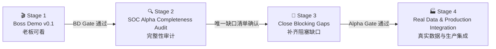

# SOC Agent Delivery Roadmap / 阶段性交付路线

> Status: **Authoritative / 权威执行顺序**  
> Current stage: **Stage 3 - Close Blocking Gaps**
> This document owns stage order and stage gates. `soc-agent-solution.md` owns the product and
> architecture design; `progress.md` records current execution status.

## 1. Delivery Decision / 交付决策

后续严格按以下四阶段推进，不跳步、不并行发散：



这四个结果不能混为一谈：

| Result / 结果 | Definition / 定义 | Does not mean / 不代表 |
|---|---|---|
| Boss Demo v0.1 | 老板可在浏览器中看到一条代表性告警完成受控研判闭环 | SOC Alpha 已完整、生产已就绪 |
| SOC Alpha audit | 全链路能力被逐项审阅并分类，阻塞项有唯一清单 | 审计时顺手修完所有问题 |
| SOC Alpha complete | 本地/测试环境中的产品闭环可重复，代码可控的 P0/P1 阻塞项已清零 | 已接真实平安系统或允许自动处置 |
| Production integration | 真实数据源、凭证、基础设施、运营指标和治理门槛得到验证 | 自动等同正式 GA 或开放高风险动作 |

## 2. Stage Overview / 阶段总览

| Stage | Status | Primary outcome / 核心产出 | Exit gate / 退出门槛 |
|---|---|---|---|
| `BD` Boss Demo v0.1 | **Done** | 一条 8-10 分钟、浏览器优先、可重复的 golden path | `BD-01..03` 与 BD Gate 已通过 |
| `AA` SOC Alpha Completeness Audit | **Done / AA Gate Passed** | 唯一的 Complete/Gap/Mock/Data-gated/Deferred 矩阵 | 审计矩阵和 P0/P1 阻塞清单已于 2026-07-18 确认 |
| `BG` Close Blocking Gaps | **Current / BG-P1-02 In Progress** | 只修审计确认的代码可控 P0/P1 阻塞项 | Alpha 端到端验收通过 |
| `PI` Real Data & Production Integration | Data/credential-gated | 真实 PingAn/通用 provider、Kafka/PostgreSQL/K8s 和运营验证 | Pilot readiness review 通过 |

Boss Demo v0.1 和 Alpha 完整性审计已于 2026-07-18 分别通过 BD Gate、AA Gate；当前只执行
[`audits/alpha-completeness-matrix.md`](audits/alpha-completeness-matrix.md) 冻结的 Stage 3 阻塞工作包。
这不代表 Alpha 或生产已经完成。

## 3. Stage 1 - Boss Demo v0.1

### 3.1 Audience and story / 受众与故事

主要受众是老板和产品/安全负责人。主入口是 Web，终端命令只负责准备环境：

1. 导入一条有代表性的 APT/反弹 Shell 告警。
2. Runtime 展示规范化、事实重建、受控 LLM 研判和决策理由。
3. 调查上下文展示实体、攻击方向、场景、证据、证据缺口和相似历史告警。
4. ReviewQueue 展示待复核工单；Lead Agent 可围绕该工单对话。
5. 分析师提交 note/correction，系统产生可审阅 memory candidate。
6. 所有 mock、shadow-only、未接真实 provider 的能力在页面或演示清单中明确标记。

### 3.2 Work packages / 工作包

| ID | Work / 工作 | Deliverable / 产出 | Acceptance / 验收 |
|---|---|---|---|
| `BD-01` | Scope freeze + one-command golden path / 范围冻结与一键准备 | **Done**: 独立可重置 Boss Demo SQLite、`soc demo boss`、结构化 launch manifest 和聚焦测试 | 不手改数据库；输出 Web URL、`run_id`、`queue_id`、analyzer mode、真实/mock 边界和下一步命令；失败不得静默降级 |
| `BD-02` | Web + Lead Agent coherent journey / 连贯可见链路 | **Done**: Docker Gateway/API/Web 共用独立 Demo DB；authenticated API、ReviewQueue 页面和 bounded Lead Agent context bridge 已验证 | 一个浏览器旅程可完成查看与复核；前端不复制业务逻辑；mock/shadow 状态显式可见 |
| `BD-03` | Rehearsal + acceptance / 演练与验收 | **Done**: live DeepSeek 页面、Web correction -> pending memory candidate、deterministic clean reset、authenticated API/CLI context 和最终截图均已保存 | 同一输入可再次演示；live/deterministic 模式可辨认；关键 API/UI/持久化断言通过；演示验收结果已保存 |

### 3.3 Scope freeze / 当前非目标

Stage 1 不做以下工作，除非它被实测证明直接阻塞 golden path：

- 真实 CMDB/EDR/Zeus/MCP 凭证接入。
- 扩充 correlation 人工标签集或设计 scorer v2。
- Prometheus 全局运营态势面板和生产压测。
- 新增更多攻击场景或完整自治 Sub Agent 群。
- Wiki/OKF/GraphRAG/PageIndex 投影。
- 封禁、隔离等高风险真实执行。
- 为演示重写 DeerFlow Runtime、Web 或 Lead Agent 基础设施。

### 3.4 BD Gate / 演示门禁

- [x] 一条命令或一组明确的启动命令可准备独立 demo 数据库。
- [x] 无需人工编辑 JSON/数据库即可在 manifest 得到本次 `run_id`/`queue_id` 入口。
- [x] 老板主要在 Web 完成查看，CLI 不是演示主体。
- [x] Runtime conclusion、evidence、scenario、correlation、review context 可见且边界明确。
- [x] live LLM、deterministic、mock provider、shadow-only 的边界均显式显示。
- [x] correction/note 至少一条人工反馈闭环可演示。
- [x] reset 后可重复运行；自动 smoke 和演示脚本通过。

## 4. Stage 2 - SOC Alpha Completeness Audit

Stage 2 是 time-boxed 审计，不在审计过程中纵向优化单个模块。

| ID | Work / 工作 | Deliverable / 产出 | Acceptance / 验收 |
|---|---|---|---|
| `AUD-01` | Journey inventory / 完整旅程盘点 | **Done**: [`audits/alpha-journey-inventory.md`](audits/alpha-journey-inventory.md) 已逐一定位 CLI/Kafka/Runtime/persistence/correlation/action/domain/Review/Web/TUI/Lead Agent/feedback/memory/audit/replay | 入口、21 个服务边界、15 个状态聚合、17 张业务表及用户可见产物已有唯一落点 |
| `AUD-02` | Code/contract/docs consistency / 一致性审计 | **Done**: [`audits/alpha-consistency-audit.md`](audits/alpha-consistency-audit.md) 已记录 10 项确认一致边界、24 项事实差异和 mock/real/shadow/reachability 核对 | 未把 target/service-only 冒充 application-complete；未把 mock 或 shadow-only 冒充 production real；审计过程未修改业务代码或被审文档 |
| `AUD-03` | Completeness matrix + blocker register / 完整性矩阵与阻塞台账 | **Done**: [`audits/alpha-completeness-matrix.md`](audits/alpha-completeness-matrix.md) 已将 50 项能力唯一分类，记录 13 个 Gap、P0/P1 优先级和 7 个冻结工作包 | 每个 Gap 有 owner、影响、证据、验收方式和目标阶段；只有代码可控 P0/P1 进入 Stage 3 |

### AA Gate / 审计门禁

- [x] 全链路只有一份完整性矩阵，不新增平行路线图。
- [x] P0/P1 阻塞项与非阻塞质量优化明确分开。
- [x] mock、凭证缺失、真实数据缺失和代码缺口明确分开。
- [x] Stage 3 的任务集合由审计结果冻结，不靠聊天临时决定。

**AA Gate: Passed on 2026-07-18.**

## 5. Stage 3 - Close Blocking Gaps

| ID | Work / 工作 | Deliverable / 产出 | Acceptance / 验收 |
|---|---|---|---|
| `BG-01` | Close P0 blockers / 修复 P0 | **Done 2026-07-18**: `BG-P0-01..02` 已关闭审批/RBAC、事务化变更和持久审计缺口 | `AC-16/21/22/34` 均有回归与故障注入证据 |
| `BG-02` | Close P1 + E2E acceptance / 修复 P1 与端到端验收 | **In progress**: `BG-P1-01` 已完成，当前执行 `BG-P1-02`，之后依次执行 `BG-P1-03..05` | 结果可重复；失败语义、offset、review、audit 和 memory boundary 符合契约 |
| `BG-03` | Alpha readiness package / Alpha 就绪包 | 版本化验收报告、已知限制、mock/data-gated 清单、部署与回滚说明 | 代码可控 P0/P1 为零；全量 SOC/architecture 测试通过；Stage 4 输入明确 |

Stage 3 的唯一拆分与验收条件见
[`audits/alpha-completeness-matrix.md`](audits/alpha-completeness-matrix.md) Section 6，执行顺序固定为：

```text
BG-P0-01 -> BG-P0-02 -> BG-P1-01 -> BG-P1-02 -> BG-P1-03 -> BG-P1-04 -> BG-P1-05 -> BG-03
```

Stage 3 不负责解决真实凭证、生产标签数量或企业基础设施未准备等外部条件。

## 6. Stage 4 - Real Data & Production Integration

| ID | Work / 工作 | Deliverable / 产出 | Acceptance / 验收 |
|---|---|---|---|
| `PI-01` | Real providers / 真实能力源 | CMDB、EDR、威胁情报、security tag、Zeus 等真实 dev/staging adapter/MCP/API | provider contract、超时、权限、脱敏、审计、失败降级和 smoke 有证据 |
| `PI-02` | Real infrastructure / 真实基础设施 | Kafka、PostgreSQL、K8s 参数与容量/恢复测试 | 吞吐、端到端延迟、重试、DLQ、幂等、连接池和故障恢复满足试点门槛 |
| `PI-03` | Real labels and calibration / 真实标签与校准 | 脱敏、人工标注的 scenario/confidence/correlation corpus | 来源、范围、版本和 reviewer 可审计；scorer/profile 仅在离线 gate 通过后进入 shadow |
| `PI-04` | Operations and security / 运维与安全 | 可观测性、SLO、告警、secret、RBAC、审计保留和隐私策略 | 运营同事能定位任务/预警/延迟/模型/队列问题；安全评审通过 |
| `PI-05` | Governed rollout / 受治理上线 | shadow -> limited pilot -> controlled action 的阶段评审 | 不因单次评测自动开放 auto-close 或高风险执行；每一档可回滚 |

### PI Gate / 生产集成门禁

Stage 4 的退出结果是 **Pilot Ready / 可试点**。正式 GA、自动关单和高风险自动处置仍需独立治理审批。

## 7. Parking Lot / 后续项

以下事项有价值，但不能插入当前 Stage 1：

- Correlation pair corpus expansion 和 scorer v2。
- 完整多 Sub Agent 并行自治与跨域攻击尝试。
- Knowledge RAG、GraphRAG、PageIndex、Wiki/OKF projection。
- Prometheus 全局系统态势和管理驾驶舱。
- 更多 vendor/scenario adapter、自动 skill 优化和长期记忆治理。
- 高风险 response adapter、补偿事务和自动化 rollout。

只有当前阶段 Gate 通过，或用户明确决定替换当前目标，Parking Lot 项才可进入执行。

## 8. Anti-Drift Rules / 防跑偏规则

1. 同一时间只有一个 Stage 为 `Current`，只有一个 task 为 `In Progress`。
2. 每个实现切片必须携带路线编号，例如 `BD-01`；没有编号的需求先进入 Parking Lot。
3. 新想法不能悄悄插队：要么用户明确替换当前目标，要么记录到后续 Stage/TODO。
4. `progress.md` 的“当前下一刀”必须引用本文件中的任务编号。
5. 未满足 Stage Gate，不得把下一阶段改成 `Current`。
6. 每个切片都写清 `real / mock / fixture / shadow-only / data-gated`，不允许静默降级。
7. 代码、测试、演示产物和文档在同一切片更新；不再创建另一份完整路线图。
8. 研究和参考项目查询必须服务当前 task 的明确决策，不以“继续研究”替代交付。
9. CodeGraph 在切片明确后用于找复用点；完成代码修改后执行 `codegraph sync .`。
10. 每次阶段转换都在 `progress.md` 留下 Gate 证据、未完成项去向和下一任务。

## 9. Current Execution Pointer / 当前执行指针

```text
Completed:    BD - Boss Demo v0.1 (BD Gate passed 2026-07-18)
Completed:    AA - SOC Alpha Completeness Audit (AA Gate passed 2026-07-18; AUD-01..03 done)
Current Stage: BG - Close Blocking Gaps
Completed:    BG-P0-01 - approval integrity and L3 authorization (AC-22, AC-34)
Completed:    BG-P0-02 - transactional mutation and durable audit (AC-16, AC-21)
Completed:    BG-P1-01 - versioned ingestion and feedback (AC-04, AC-08)
In Progress:  BG-P1-02 - API contract stabilization (AC-11)
Next:         Freeze one explicit SOC API transport/error/request-metadata convention and OpenAPI regression boundary
Blocked by:   None for BG-P1-02; real providers and production infrastructure remain Stage 4 data-gated
```
