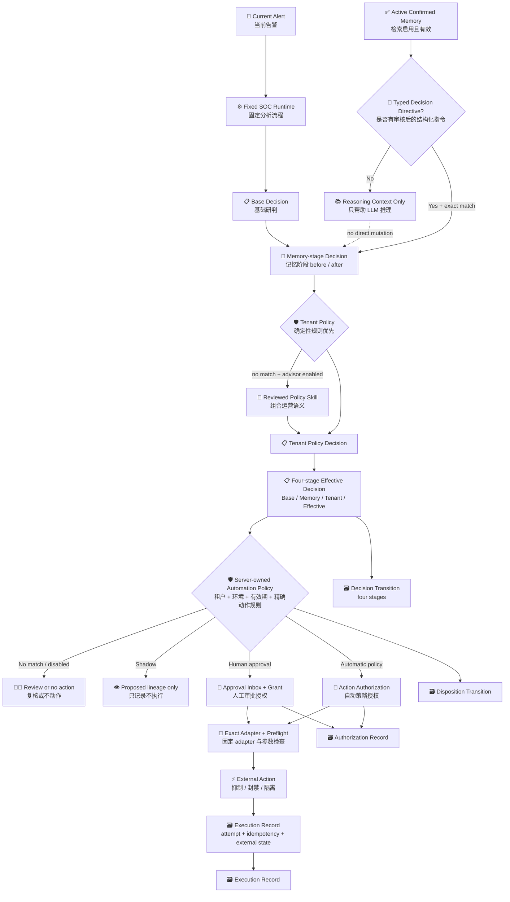

# Decision, Disposition, Authorization, and Execution

> Updated: 2026-08-11
>
> 本文定义 SOC Runtime 之后的受治理自动化边界，解决两个核心问题：确认后的 Memory 如何真正帮助改判；当前告警即使没有 Memory，何时仍可自动抑制、封禁或隔离。

## 1. 核心结论

系统必须分开七件事，不能把它们都叫“模型结论”或“自动化”：

| 层 | English | 当前权威对象 | 负责什么 |
|---|---|---|---|
| 基础研判 | Base Detection Decision | `AnalysisRun.decision` | Runtime 对当前告警形成的不可变基础判断 |
| 记忆阶段 | Memory Decision Stage | `SocDecisionTransitionRecord.stages[1]` | 将符合条件的 reviewed typed Memory directive 应用到基础判断；普通 Memory 只作上下文 |
| 租户策略阶段 | Tenant Policy Decision Stage | `TenantPolicyDecision` + `stages[2]` | 将平安等租户运营规则形成独立判断；不改写技术检测真值 |
| 有效研判 | Effective Decision | `SocDecisionTransitionRecord.after` + `effective_disposition` | 汇总 Base、Memory、租户策略和可选自动化 policy，形成最终可复盘结果 |
| 运营处置 | Operational Disposition | `SocDispositionTransitionRecord` | 表达升级、复核、抑制、关闭等业务状态意图 |
| 动作授权 | Action Authorization | `SocActionAuthorizationRecord` | 判断某个精确动作、目标和 adapter 是否获准执行 |
| 动作执行 | Action Execution | `SocActionExecutionRecord` | 调用外部系统并保存尝试、幂等键、结果及前后状态 |

关键边界：

- LLM 只产生基础研判和理由，不能直接授权外部动作。
- 普通 `M-*` 文本是推理上下文，不具备改判或授权能力。
- 只有人工确认时显式附加的 `SocMemoryDecisionDirective`，在检索、版本、有效期、复核期、匹配分数和 required facets 全部通过后，才可改变有效研判。
- 租户策略在完整 Runtime 和 Memory 阶段之后运行。精确条件由确定性规则处理；确定性 `no_match` 后可由受版本/hash 约束的 policy Skill 处理组合语义。
- 租户策略必须有显式总开关。它可以在 `enforced` 模式改变复核要求和运营 disposition，但不能更改 `AnalysisRun.decision.verdict/confidence`，也不能授权动作。
- Memory 永远不直接授权动作。动作授权只来自受评审、版本化、服务端持有的 `SocAutomationPolicy` 或人工 Approval Grant。
- 因此，当前告警没有命中任何 Memory，只要有效研判和策略条件满足，也可以获得自动动作授权。

## 2. 完整控制流



## 3. Memory 怎样真正影响判断

### 3.1 候选与普通记忆不改判

- 每条告警不创建一条 Memory。Kafka/批处理先写 observation，只有稳定重复模式跨过 support 和 distinct-source 门槛才创建一个候选。
- 候选必须人工确认；确认后仍默认 `retrieval_enabled=false`。
- 仅有自然语言 `summary/content` 的 Memory 即使被检索为 `M-*`，也只能帮助模型推理。

### 3.2 结构化指令可以改有效研判

审核人确认候选时，可选择附加 `SocMemoryDecisionDirective`：

```json
{
  "schema_version": "soc.memory_decision_directive.v1",
  "effect": "override",
  "target_verdict": "false_positive",
  "review_effect": "clear",
  "minimum_match_score": 8.0,
  "required_facet_keys": ["tenant", "detection"],
  "rationale": "已人工验证的租户级检测误报模式",
  "policy_version": "soc.memory_decision_directive_policy.v1"
}
```

应用条件全部为真时才生效：

1. record 是 `confirmed` 且 retrieval 已由 governor 显式启用。
2. record 的版本、content hash 和 facets hash 与本次 `M-*` 投影完全一致。
3. activation validity、record validity 和 review due 均未过期。
4. 检索分数达到 `minimum_match_score`。
5. `required_facet_keys` 在本次匹配明细中都有实际命中。
6. 多条 override 不产生相互冲突的目标 verdict；一旦冲突，停止本轮 disposition/action rule selection。

生效后不改写原 `AnalysisRun.decision`，而是追加一条 `SocDecisionTransitionRecord`：

```text
before: suspicious, needs_review=true
after:  false_positive, needs_review=false
kind:   overridden
contributors: current evidence + model reasoning + M-* + policy version/hash
```

这样可以统计 Memory 使用前后差异、改判率、复核节省率和错误覆盖率。冲突的 Memory 指令不选第一条，而是形成 `conflicted` transition 并要求复核。

## 4. 没有 Memory 也能自动动作

`SocAutomationPolicy` 匹配的是 Memory 与租户策略处理后的有效研判，而不是“是否命中 Memory”。以下两条路径同等合法：

```text
当前证据 + LLM + Decision Policy -> effective suspicious -> policy -> block

当前证据 + LLM + Decision Policy + reviewed Memory override
  -> effective suspicious -> policy -> block

当前证据 + LLM + Decision Policy + PingAn policy disposition
  -> effective suspicious/escalated -> policy -> exact governed action
```

租户策略与动作策略不是同一层。租户策略可以说“平安运营上忽略、转交或关闭良性真阳性”，但只有单独的 Automation Policy 才能说“对哪个目标、通过哪个 adapter、以什么幂等键执行什么动作”。

自动动作规则必须显式声明：

- exact tenant 和 environment；
- policy validity、version、reviewer 和 review time；
- 允许的 verdict；
- 允许的 evidence state；
- exact model name、Prompt version 和 Decision Policy version；模型或提示词升级后必须重新评审自动化范围；
- minimum confidence；
- explicit `needs_review` match；常规自动规则使用 `false`，若要对仍需复核的高风险研判立即处置，必须显式匹配 `true` 并填写 `review_required_override_reason`；
- exact route/action/adapter ID；
- deterministic target selector；
- adapter 必须声明 `write|destructive`、`execute_supported=true`、`idempotency_required=true`。

模型不能临时扩大范围、选择任意 MCP 或修改 adapter。`needs_review=true` 的显式 override 只跳过“本动作必须等待逐条点击”的门槛，不会删除 ReviewQueue，也不会把基础 Decision 改写成已人工确认。策略未配置时整层关闭；`shadow` 只留痕；`enforced` 才可能授权；真实执行还要显式设置 `SOC_AUTOMATION_EXECUTE_AUTHORIZED_ACTIONS=true` 并由 composition root 注入经过审核的 adapter registry。

## 5. 人工审批与自动策略不是二选一

每条规则选择一种授权模式：

| Mode | 用途 | 行为 |
|---|---|---|
| `human_approval` | 新场景、高风险、证据不足、策略尚未验证 | 进入现有 Approval Inbox，获得一次性 Grant 后再进入动作边界 |
| `automatic_policy` | 已评审、范围明确、质量门槛通过、可回滚的稳定场景 | 由版本化策略直接生成授权，不要求 Memory，也不要求每条告警人工点击 |

当前已有两套执行入口尚未完全收敛：

- 新的自动策略链会实际调用注入的 `SocActionAdapterRegistry.execute()` 并保存 execution record。
- 既有 `SocAgentApprovalService.execute_approved_action()` 保留 Alpha 的 grant/preflight/token 边界，不应被文档误写成已经完成真实外部副作用。

后续应让人工 Grant 和自动 Policy Authorization 共用一个外部执行 service；在此之前不得复制第二套 adapter 业务逻辑，也不得声称人工审批路径已完成生产执行。

## 6. 持久化与查询

Migration `0023_governed_automation_and_memory_index` 增加基础 Memory/自动化 lineage；migration
`0024_decision_stages` 增加可索引的租户策略与四阶段摘要：

| Table | 记录内容 |
|---|---|
| `soc_memory_record_facets` | Memory facet 倒排索引；先按相关性跨完整 corpus 召回，不再只看最新 200 条 |
| `soc_decision_transitions` | Base/Memory/Tenant/Effective 四阶段、before/after、最终 disposition、贡献者和 policy hash |
| `soc_tenant_policy_decisions` | 确定性规则或 policy Skill 形成的独立租户运营判断及完整来源 |
| `soc_disposition_transitions` | 处置建议或应用状态及来源 |
| `soc_action_authorizations` | 授权模式、目标、adapter、原因、有效期和贡献者 |
| `soc_action_executions` | 每次尝试、稳定幂等键、外部 request ID、前后状态和错误 |

查看某次完整链路：

```bash
cd backend
.venv/bin/soc automation lineage --run-id RUN_ID --pretty
```

也可以使用 `--alert-id ALERT_ID`。输出同时包含四类 append-only lineage，便于复盘“什么导致改判、什么授权动作、实际执行是否成功”。

## 7. 失败与重试边界

- automation observer 在主分析事务之后运行；失败不会回滚已保存的 Runtime 结果。
- 未解析目标、adapter 不存在、identity 不一致、策略不在有效期或质量条件不满足时 fail closed。
- 授权有明确过期时间；过期后只写 `skipped`，不执行。
- retryable provider failure 最多重试 3 次，attempt 递增但复用同一个外部 idempotency key。
- success、terminal failure 或 skipped 不会再次执行。
- replay 只允许重算和留痕，永远不获得 automatic external-action authorization，避免历史回放重复副作用。
- 所有 contributor 只保存受限引用、版本和 hash，不把 prompt、credential、provider header 或完整敏感响应写入 lineage。

## 8. 当前状态与未完成边界

已完成：

- typed Memory decision directive 的 review/API/CLI/service contract；
- relevance-first Memory facet index 和旧数据 migration backfill；
- post-Runtime effective-decision、disposition、authorization、execution service；
- `Base -> Memory -> Tenant Policy -> Effective` 四阶段 lineage 和 migration `0024`；
- 默认关闭的租户策略总开关、确定性规则优先和可选 LLM policy Skill；
- PingAn canonical HTTP 全非 `200` 忽略、明确 provider 失败忽略、强制转交优先级和组合语义 Policy
  Skill；`200` 单独不产生 disposition，非 HTTP `status` 字段不参与；provider 成功/失陷标签只使非
  `200` 规则弃权，由 Policy Skill 结合效果证据判断；
- 无 Memory 自动授权、Memory override、幂等、重试和 SQL lineage 测试；
- 仍需复核的 current-alert decision 只有在规则显式提供 `review_required_override_reason` 时才可自动授权；
- 默认关闭、shadow/enforced 区分和 CLI lineage 查询。

仍需真实环境验收：

- 生产 write/destructive adapter 及回滚能力；
- enforced policy 的租户 owner、安全 owner 和平台 owner 审批记录；
- 真实标签上的阈值、错误改判率和自动动作质量 gate；
- 人工 Approval Grant 与自动 Authorization 共用同一 external execution service；
- Web 侧 lineage 和策略管理/只读展示。

固定十条业务 E2E 已删除人为构造的网络自动封禁策略。该验证只启用 PingAn tenant policy/Skill；没有另行配置真实 Automation Policy 时，正确结果是有四阶段判断和运营 disposition，但 action authorization/execution 均为 0。通用自动化能力继续由单元/组件测试验证，不再用假业务规则制造“3 条自动封禁成功”。
