# 从研判到处置：控制标记、传递规则与状态流转

Updated: 2026-09-15. 本文对应当前源码，不是未来规划。

**本文重点：不只解释状态叫什么，还说明“谁产生哪个标记，谁读取它，满足什么条件后改变什么”。**
范围从企业规则前置检查开始，覆盖直接处理、模型研判、Memory/策略采用、动作执行和结果展示；不穷举 Adapter 的原始厂商字段。

## 当前入口：规则优先，经验其次

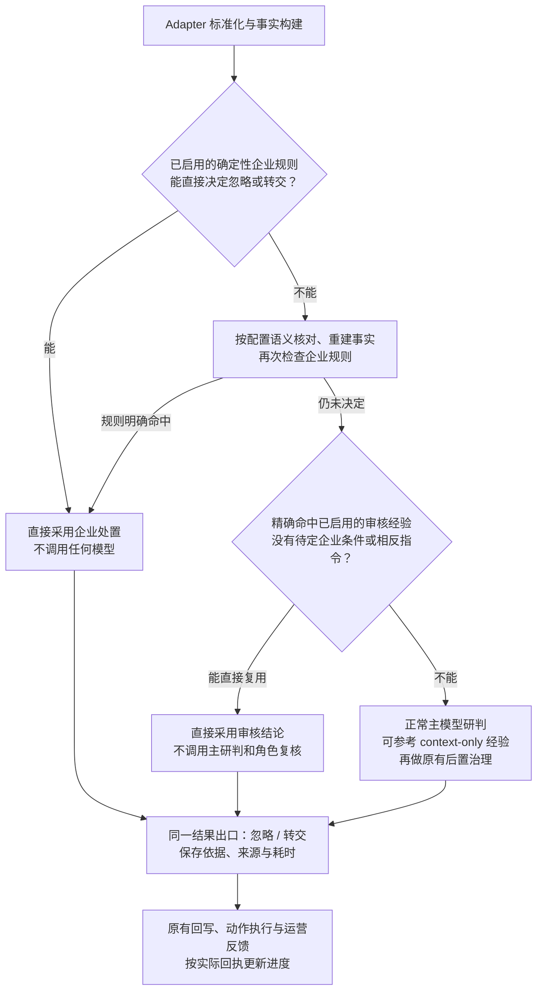

大白话：企业已经要求转交，就不再花一次研判去重新讨论；企业没有决定、审核经验又精确适用，
就直接采用经验。两者都没有答案才让模型研判。仍依赖模型判断的 Policy Skill 不冒充确定规则。
企业规则条件尚缺主模型结论时标记 `deferred`，不能把“暂时不知道”当成“未命中”而绕过它。

| 直接处理标记 | 谁产生 | 后续含义 |
|---|---|---|
| `run.direct_resolution.source_kind=tenant_policy` | Runtime 前置规则检查 | 企业规则已选择处置；冻结 policy/rule/hash，不伪造技术攻击结论 |
| `run.direct_resolution.source_kind=memory` | Runtime 精确经验检查 | 已应用审核结论；保存 Memory 版本、hash 和匹配条件，不再交主模型批准 |
| `run.analysis=null`、`model_name=not_invoked` | 直接处理分支 | 主模型确实未调用；不是失败，也不是模型给了 0% 置信度 |
| Base `status=skipped`、快照 `evaluated=false` | 决策演变服务 | 没有初判供比较；后续仍保存实际来源和有效结果 |
| `MemoryUse.effect=direct_reused`、`base_model_evaluated=false` | 使用记录服务 | 计一次使用，不计新独立样本、人工认可或模型改判收益 |
| `run.direct_memory_conflicted=true` | 完整精确经验集合检查 | 相反答案未被唯一裁定；后续 Top-K 不得把它变成唯一指令 |
| `case_outcome.processing_path` | 结果投影 | 页面明确显示企业直接处理 / 经验直接复用 / 模型研判 |

处置已确定不等于外部接口已执行成功；这一点沿用本文后面的回执规则。
早期企业命中为零模型调用；Memory 前若启用了语义核对，那次抽取调用仍如实计数。
可通过 `SOC_DIRECT_RESOLUTION_ENABLED=false` 回到完整研判顺序，不更改已有记录。
完整方案见 [直接处理设计](../architecture/direct-resolution-design.md)。

**下面 Base → Memory → Policy 的细图，描述的是未提前解决而进入模型的分支，以及旧记录的复盘，
不是要求上面的直接处理再跑一次主模型。直接结果也使用同一组阶段记录，但未执行阶段明确 skipped。**

| 你想弄清什么 | 阅读位置 |
|---|---|
| 运营最终怎么处理 | 正常处理流程与“标记对应忽略还是转交”表 |
| 标记如何沿流程传递，而不是互相覆盖 | 第 0 节：传递地图、同名字段与存储位置 |
| 缺口/冲突怎样变成复核要求 | 第 1 节：Base 的标记生产链 |
| Memory、企业策略怎样修改后续判断 | 第 2～4 节：读取条件、写入结果与不可清除的边界 |
| 哪些反馈才能让进度改变 | 第 5 节：状态选择优先级与反馈触发值 |
| 对着具体值逐步复盘 | 第 6 节：真实案例及明确标注的机制示例 |
| 回到代码核实 | 第 7 节：函数与消费方入口 |

## 正常处理流程

**运营只需先看一份处理结论：忽略 / 转交，再看依据与必要下一步。可疑不是第三种处理选项。**

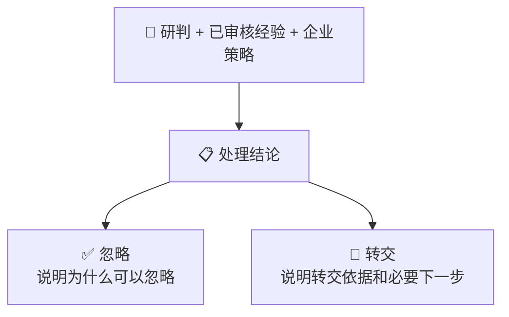

**页面说明，不是流程分支：**“研判与处置详情”只是同一份结果的可展开记录，供复盘时查看
风险判断、置信度、执行反馈、Memory、企业策略和原始疑点。点击它不会重新研判、创建任务
或改变结论；不展开也能按主结果完成日常处理。因此不把“查看详情”画成业务流程分支。

**输出语言：**给运营看的摘要、理由、下一步、核查项、角色复核说明和经验正文统一要求简体中文；
规则码、IP、路径、HTTP/SQL 等技术名称及 JSON 结构字段保持原样。这一要求同时覆盖主研判、
企业策略模型与结构修复，不因策略 Skill 或历史上下文是英文而输出英文建议。
固定阶段说明由只读展示投影转换为中文；原始模型文本、决策记录及哈希不改写。
`2456233 / RUN-4224A3CEFBC0` 的英文建议来自旧版企业策略模型，非主模型；旧结果保留原文，
重跑生成新的版本化结果。不会为了翻译多调用一次模型，也不会因语言问题撤销有效结论。

**异常提示：**上图描述已形成可用结果的正常流程。运行失败、结果缺失、实质冲突或动作失败
仍需明确提示，不能伪装成成功；这些提示也不是新的正常处理选项。

- 先排除运行失败，再检查尚未解决的结论级问题；有这种问题时转交确认，不能采用忽略方案。
  没有阻断时，按已采用的企业方案或已映射运营反馈展示；都没有则可疑/真实攻击转交、误报忽略。
  没有结果的运行仍显示异常，不编造“忽略”或假装模型已完成研判。
- `2502512` 主结果为**转交**，处理依据说明“研判倾向误报，但企业策略要求转交”；
  误报/82%和待转交反馈放入详情。没有改写模型判断，也没有宣称已经回写 ZEUS。
- **下面的详细分支是内部技术审计图，不要求运营理解后才能使用。**保留它们是为了复盘，
  不是继续在首页并列展示安全判断、处置方案与进度。

### 模型分支：内部字段如何保留

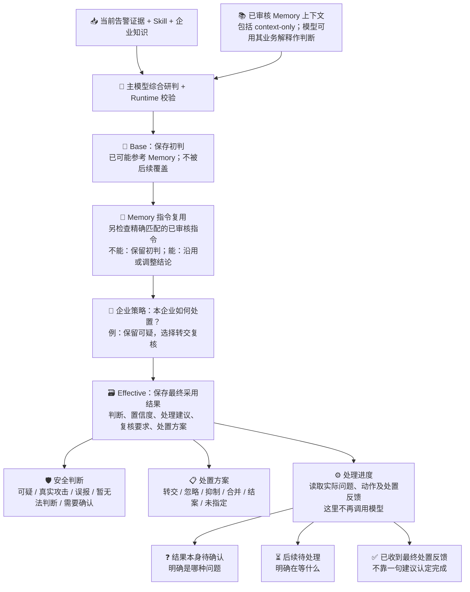

- **可疑也是已形成的判断**。没有证明主机失陷，不妨碍给出“可疑，建议转交排查”。
- 看到 `evidence_gaps` 不代表必须等待。已知业务经验可以解释疑点；普通补充信息不阻断当前结论。
- `needs_review` 是复核标志，不是处置方案；必须结合具体原因和已采用策略，按下表映射。
- `applied` 只表示已应用到决策，不表示调用外部接口成功。
- 下面是**决策采用顺序**。参考型 Memory 在主模型调用前进入上下文；企业策略建议的生成/落库可先于最终四阶段合并，不是四次顺序模型调用。

### 这些标记到底对应忽略还是转交？

| 当前情况 | 运营主结果 | 依据与后续 |
|---|---|---|
| 误报，只有“可补查资产负责人”等普通 `evidence_gaps` | **忽略** | 当前判断可用；补充信息放详情，不强制等待 |
| 已审核经验解释了原疑点，没有当前反证 | **按采用结果：可忽略** | context-only 可帮助模型得出误报；指令复用也可改判，不因旧疑点重复转交 |
| 可疑/真实攻击，`needs_review=false`，没有其他生效方案 | **转交** | 已完成风险判断，仍需要运营处置；false 不是“安全” |
| 企业策略单独要求复核，或明确要求转交 | **转交** | 说明命中哪条策略；不是输入或分析失败，即使技术结论是误报也可转交 |
| 未解决的实质事实冲突、核心结果校验问题、关键输入遗漏 | **转交确认** | 指明具体问题；技术 verdict 原样留痕，不再显示“忽略但结论不可用” |
| 仅动作目标不完整，或旧标记只是普通截断/未校准 | **不单独改变忽略/转交** | 只限制依赖该目标的动作；不把一切 `needs_review=true` 视为结论失败 |
| 只有复核标志、找不到原因或有效策略归属 | **转交确认复核原因** | 不擅自清除要求，也不虚构“证据缺失” |
| 应调用模型但调用失败、没有产生分析或决策 | **运行失败** | 这是异常；企业/Memory 正常直接处理不属于此情况 |

优先级：**运行失败 → 结论级问题 → 有效处置方案/纯策略复核 → 当前 verdict**。
`evidence_gaps` 是说明文字，不能仅凭非空或某个词触发转交；结论级问题读取已有
`Decision.review_reasons` 和 `AnalysisMaterialityReport`，不新增一次 LLM，也不重新怀疑上游日志。
事实冲突已被 Adapter/模型解决时不应出现在这些尚未解决的原因里。

`recommended_handling_basis` 保留分类依据，例如 `verdict:false_positive`、
`disposition:escalated`、`governed_review_required`、`decision_review:fact_conflict`。
前端列表、详情、历史处置对比和 ZEUS 回传使用同一分类；完整原因仍在原始审计中。

## 0. 标记如何传递：先看这张地图

### 0.1 不是每个字段都是状态开关

大白话说：**标记是随本次研判保存的信息；只有下游代码确实读取它作条件判断，它才会影响分支。**
有些是条件，有些是上一步判定的结果，有些只是用来解释原因。同一个字段也可能既是上一步的输出，
又是下一步的输入。本文的“条件编号”只用于阅读，不是新加的 Runtime 字段。

| 类型 | 例子 | 实际作用 |
|---|---|---|
| 🚦 控制条件 / Guard | `review_reasons`、`decision_directive_applicable`、`policy_mode`、`auto_apply_allowed` | 下游按明确条件决定能否改判、采用方案或授权 |
| 📋 阶段结果 / State | `run.status`、阶段 `status`、`execution.status` | 记录哪一步到了什么状态；不同对象的 status 不能混用 |
| 💬 解释 / Explanation | `evidence_gaps`、`manual_checks`、`summary`、`rationale` | 模型和人员据此理解告警；不是读到“缺少”二字就自动转交 |
| 🔗 身份与追溯 / Provenance | `run_id`、Memory 版本/hash、`selected_rule_id` | 防止拿错 Run、旧版本经验或其他环境策略；也用于解释谁影响了结论 |

“不是确定性开关”不等于没用。参考型 Memory 的业务解释能影响主模型判断；但其文字不能自己授予
动作权限。类似地，`manual_checks` 能成为转交后的核查建议，却不会自动生成一个新的调查任务。

### 0.2 传的不是一个总开关，而是几份有关联的记录

以下是**内部数据传递图**，不是让运营多走几个页面。实线表示传入数据/快照，虚线表示读取旁路的
原始报告或已保存反馈。最终仍只有正常的忽略/转交建议。

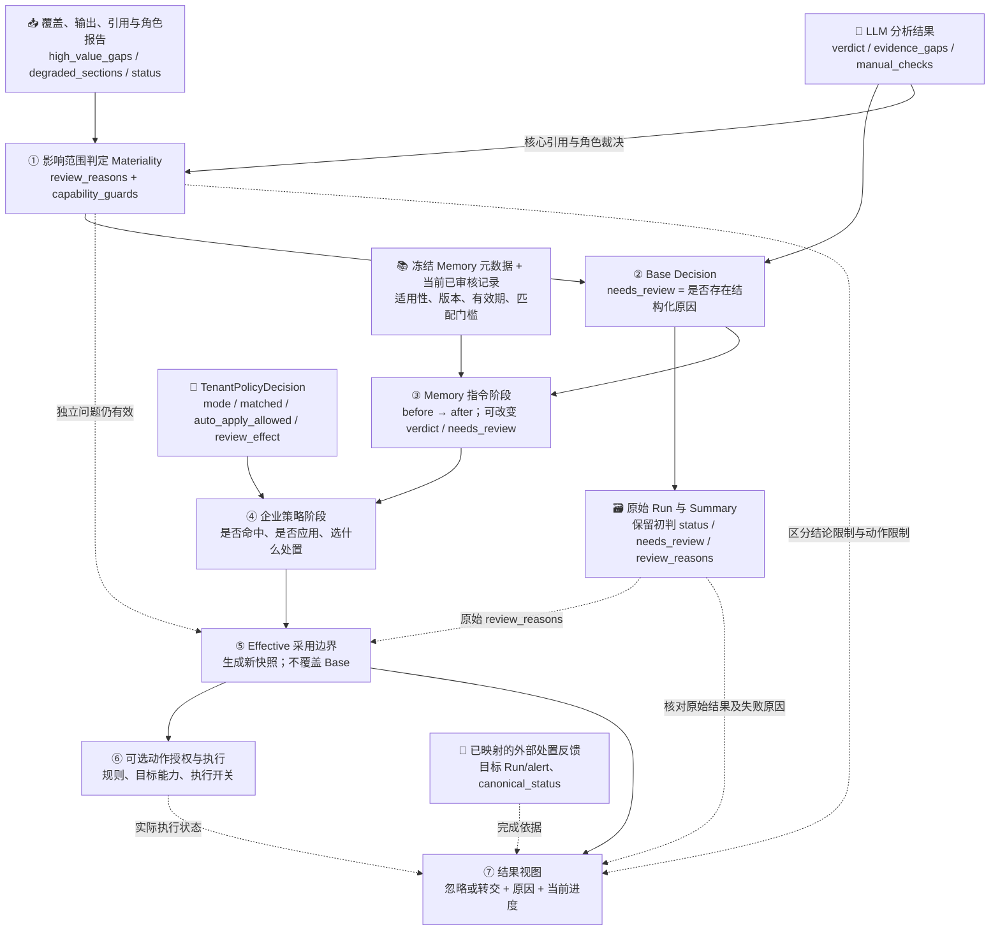

这张图按**依赖关系**组织：Materiality 也会读取模型的角色裁决和核心引用；策略建议可以提前生成，
最终合并时才按 Base → Memory → Tenant → Effective 采用。不是每个框都调用一次模型。
**标记不会自己执行代码。** Runtime 顺序调用校验和 Decision；Core Service 保存结果后调用已配置的
后分析 Observer；查询接口再组装结果视图。是这些消费者读取条件后选择分支，不是数据库字段一变
就有一条隐形任务链自动启动。

### 0.3 同名标记，先看它属于哪个对象

| 完整位置 | 谁写、含义 | 下游怎么用 |
|---|---|---|
| `run.analysis.evidence_gaps` | 主模型的疑点说明 | 展示/解释，结合影响范围使用；非空不直接触发复核 |
| `run.analysis_materiality.decision_usable` | 核心结构/引用是否可用 | **不是“所有问题都已解决”**；仍须看同报告的 `review_reasons` |
| `run.analysis_materiality.review_required` | 是否产生结论级原因 | 由同报告原因列表汇总；可与 `decision_usable=true` 同时出现 |
| `run.decision.needs_review` | Base 时是否有结构化复核原因 | 决定原始 `run.status`，与 `run.decision.review_reasons` 一起保存 |
| `transition.stages[*].after.needs_review` | 某个治理阶段采用后的复核标志 | 下一阶段读取此快照；必须结合这个阶段的来源和前后差异 |
| `transition.after.needs_review` | Effective 快照的复核标志 | 结果投影/授权匹配读取，但仍核对 Base 原因和独立 Materiality |
| `case_outcome.decision_usable` | 结果视图综合运行失败、阻断原因和最终 verdict 的判断 | 决定是否展示结论待确认；不等于上面的 Materiality 同名字段 |
| `case_outcome.closure_status` | 从已有结果和回执算出的进度 | 展示当前还缺什么；不是另一次研判或外部任务派发 |

这里的 `transition` 指一条 `SocDecisionTransitionRecord`，`case_outcome` 指 `SocCaseOutcomeView`；
它们不是 `AnalysisRun` 下面凭空新增的同名字段。`stages[*]` 是查找 `stage=base|memory|tenant_policy|effective`
的写法，不是要求人工记住数组下标。
每阶段 `before` 是进入这一阶段时的快照，`after` 是该阶段处理后的快照；没有变化就沿用值，
有变化就保留两份供比较，不把上一个阶段的 after 擦掉。

**特别容易误读的组合：**`Materiality.decision_usable=true` 与 `review_reasons=["fact_conflict"]`
可以同时存在：结构和引用完整，但事实仍有实质矛盾。下游看原因列表，会转交确认；不能只拿前一个 true 放行。

### 0.4 哪些沿用，哪些新建，哪些只重算展示？

| 记录 | 保存什么 | 后面怎么传 |
|---|---|---|
| `AnalysisRun` / `soc_analysis_runs` | 冻结输入、模型结果、原始报告与 `Decision` | 作为原始审计；Memory/Policy 合并不会把它覆盖成最终状态 |
| `AlertSummary` / `soc_alert_summaries` | Base 的扁平查询字段，包括原因列表 | 供列表轻量查询；列表再读取有效 transition/反馈，不把 Summary 当最终结论 |
| `SocDecisionTransitionRecord` / `soc_decision_transitions` | 四阶段 before/after、来源、最终快照与处置方案 | 新建可追踪的采用记录；按 `run_id` 回读 |
| `SocDispositionTransitionRecord` / `soc_disposition_transitions` | 某处置是提出还是在本系统采用 | 不充当外部已经执行的回执 |
| Authorization / Execution / ExternalDisposition | 动作许可、动作尝试、外部状态反馈 | 分开记录，再交给结果视图读取 |
| `SocCaseOutcomeView` | 当前采用结果、处理依据、限制和进度 | 只读派生视图，不新建一套持久业务状态 |

**快照不是把整个 Run 复制过去。** `SocDecisionSnapshot` 只带 `verdict`、`confidence`、`evidence_state`、
`suggested_action`、`needs_review`、`policy_version`；**没有 `review_reasons` 字段**。
所以 Effective 和详情必须同时读取原始 Run/Materiality，不能认为“after 里没有原因列表”就是“问题消失”。

举例：Base 的 `run.status=needs_review`，之后 Memory 将 Effective 的 `needs_review` 清为 false，
原始 `run.status` 仍然不变。它表达“初判时发生了什么”，不是“现在还必须复核”。这是保留前后对比，
不是字段没同步；当前结果要看 Effective 加独立阻断及反馈。

## 1. 模型分支 Base：初判是否产出

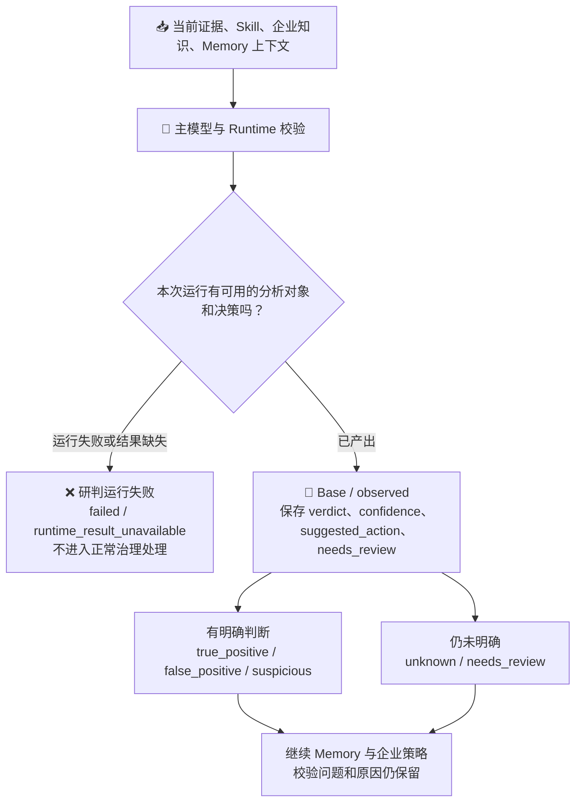

可选区块局部降级不自动判定整次失败；核心校验和具体能力限制仍由已有 Materiality 决定。本次优化不修改模型结论、Grounding 或核心研判门槛。

### 1.1 原始报告怎样产生控制标记

| 读取的标记 | 触发条件 | 写给下游什么 | 谁消费 |
|---|---|---|---|
| `run.analysis_output_quality.status / degraded_sections` | 兜底结果，或损坏区块包含 `core` | Materiality 的 `core_usable=false`、`analysis_output_degraded` 原因 | Base + Effective，阻断整份结果的自动采用 |
| `run.analysis_evidence_grounding` 的不合格 E/R 引用，与 `analysis.decision_evidence_refs / decision_reasoning_refs` | **不合格引用被核心结论引用** | `ungrounded_analysis_evidence` / `ungrounded_analysis_reasoning` | Base + Effective；仅可选区块引用坏了不能扩大影响 |
| `llm_analysis_request.evidence_coverage.high_value_gaps` | 列表非空 | Base 加 `high_value_evidence_gap` | Effective、结果视图；普通裁剪或编码压缩不等同此标记 |
| `analysis_materiality.conflict_dispositions[].impact` | 至少一个 `decision_review` | Materiality 加 `fact_conflict` | Base、Effective、人工介入准入、结果视图 |
| 角色复核的 `status` | `challenged` | `role_verification_challenged`；相关能力也受限 | Base + Effective + 动作目标检查 |
| 角色复核的 `status` | `unresolved` / `unavailable` | 只限制方向/角色相关能力 | 动作目标检查；不单独抹掉主模型判断 |
| `analysis.verdict` | `unknown` / `needs_review` | Base 加 `uncertain_verdict` | 后续 Memory/Policy 可继续给出适用结论；不是硬证据缺口 |
| 分析节点来源 | `analyze_stub` | Base 加 `stub_analyzer` | 明确兜底来源，不当成正常模型已完成 |

上表角色复核的完整位置是 `run.role_adjudication_verification.status`。
Base 的汇总公式是：

```text
review_reasons = Materiality 的原因
               + 模型尚未明确判断的原因
               + 关键输入遗漏的原因
               + 确定性兜底的原因

needs_review = bool(review_reasons)
run.status = needs_review ? "needs_review" : "success"
运行异常则走 "failed"，不是上面两条成功产出路径。
```

这只是 **Base 时点**。`uncertain_verdict` 可以被后续适用的已审核经验解释；核心损坏、事实冲突等
独立原因必须继续核对。不能把 `review_reasons` 中任何一个值都当成同等强度的“禁止”。
`run.status=needs_review` 也不等于一定生成 ReviewQueue 工单：当前人工介入准入只读取
Base 的 `fact_conflict`，其他质量问题保留在告警结果中。不能把布尔复核标志当作“已派给运营”的证据。

### 1.2 “有冲突报告”怎样变成真正阻断？

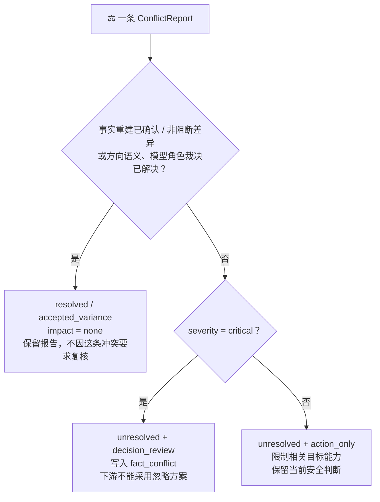

大白话：先看有没有被解决，再看它影响什么。不是看到 `ConflictReport` 或 `rejected_count > 0`
就一律转交；更不是重新要求证明告警是否命中过规则。

### 1.3 这些数值不是通用“一刀切”阈值

- 原始置信度 68%、75%、82% 不决定统一的转交/忽略阈值；未校准本身不产生复核任务。
- `evidence_state=partial` 可以只是普通字段省略，不等于核心不可用；它仍可能影响某条明确配置的自动化规则。
- 自动化规则自己的 `minimum_confidence`、Memory 指令自己的 `minimum_match_score` 是各自范围内的门槛，
  不能拿其中一个当整个 Runtime 的统一评分线。
- 5 条观察、30 天窗口属于候选经验生成，不是本次风险判断的置信度或自动处置门槛。

## 2. Memory 指令复用：五个可能结果

**先在经验审核端预防冲突，再在运行端兜底。** 现在启用 Memory 时会检查完整有效经验集，
相同范围的相反答案、重叠范围的相反直接复用指令不能同时启用；新告警提出的挑战可在原审核页
明确选择修订旧经验，确认后新旧原子替换。下面“多个 override 目标相反”的分支仍保留，
用于历史遗留记录等情况，不能靠选最新一条或让模型猜哪条有效来掩盖。
范围比较、审核入口与可复现实例见
[Memory 治理对照](../memory/pingan-soc-memory-design.md#审核时怎样处理新旧经验--governance-comparison)。

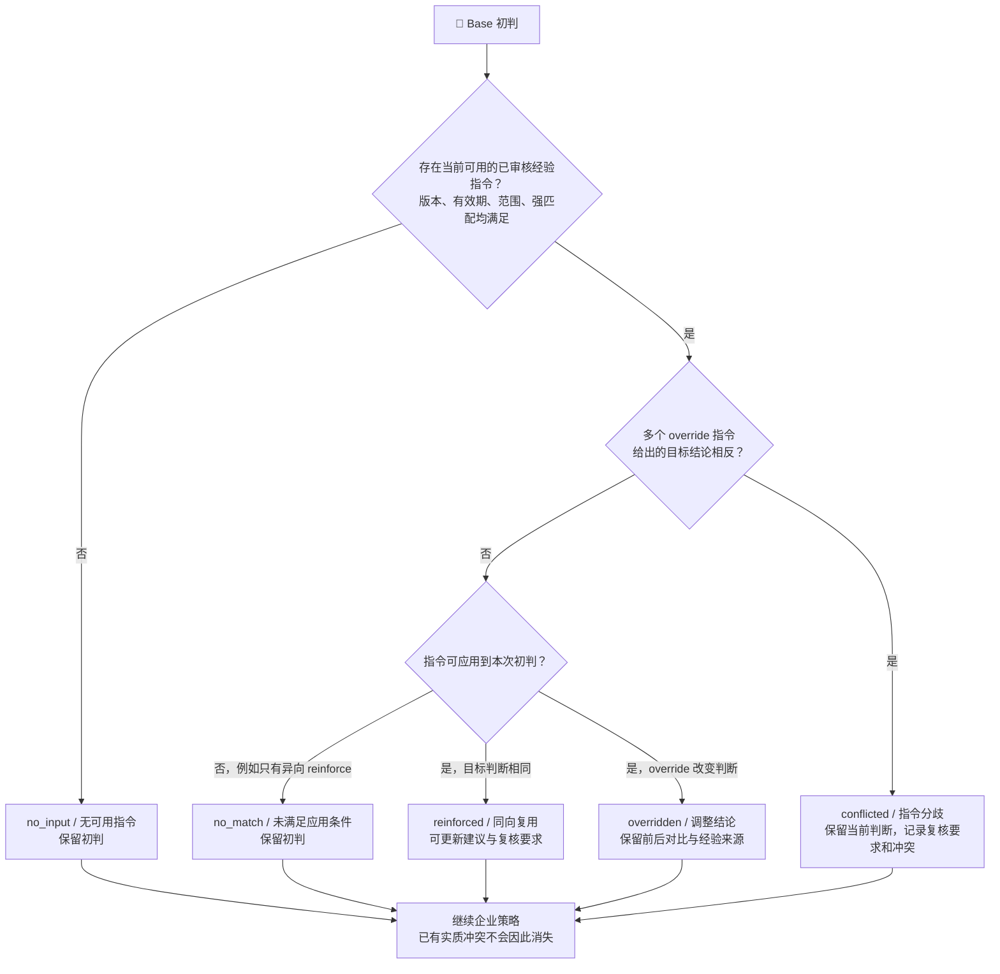

**context-only 不走上图的直接改判分支**：它已经进入主模型上下文，模型可以依据其业务解释给出误报或真实攻击。`Memory=no_input` 仅表示无可应用的直接结论指令，不表示模型没读取过经验。
同一条 Memory 的最终用法仍按本 Run 的实际记录归因；不是因为分两处画图，就把一次使用记成两次改判。

**不是所有召回的参考经验都会进入主模型。** 如果当前行为已有精确匹配的明确审核结论，
同检测/场景中结论相反的部分匹配经验只留差异审计，不再供模型泛化当前风险结论：

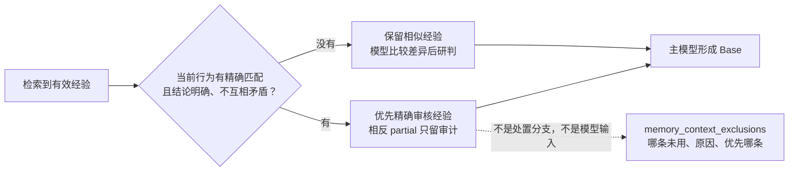

触发值是 `applicability_status=applicable`、必需行为指纹已命中、审核判断为
`true_positive/false_positive`，且同范围精确判断不存在分歧。没有这些条件不执行排除。
差异审计不计作 Memory 使用，也不产生 `evidence_gaps` 或新增转交；完整规则见
[Memory 设计](../memory/pingan-soc-memory-design.md#研判时怎样处理相反参考经验--exact-context-precedence)。

### 2.1 Memory 具体带什么标记到下一步

消费者：`SocAutomationService._eligible_memory_directives()`。输入来自本次冻结
`run.llm_analysis_request.context_catalog[]` 的 M-* 条目，以及按 `memory_id` 重新读取的 Memory 记录。

| 检查 | 必须满足什么 | 不满足时 |
|---|---|---|
| 身份与内容 | `memory_id / memory_version` 有效，当前记录仍有效且版本、`record_content_hash / record_facets_hash` 与冻结值一致 | 不直接复用，不能把后修改的经验套进旧输入 |
| 当前适用性 | `metadata.applicability_status="applicable"` 且 `metadata.decision_directive_applicable=true` | 不直接复用；已有参考上下文不因此被倒改 |
| 经验权限类型 | 记录 `decision_impact="detection_decision"`，存在 applicability 和 typed directive | 普通经验文字没有确定性改判权限 |
| 指令门槛 | `retrieval_score >= directive.minimum_match_score`，required facet keys 都有匹配值 | 不直接复用 |
| 多条指令的一致性 | 多个有效 override 的 `target_verdict` 不矛盾 | 矛盾则 `transition_kind=conflicted`，不挑一条当全部一致 |

全部通过后，指令的 `effect` 决定 **override 改判断** 或 **reinforce 沿用同向判断**；
`review_effect` 决定复核标志：`require → true`、`clear → false`、`preserve → 沿用`。
同批适用指令中 `require` 优先于 `clear`。新值写入 **Memory 阶段 after**，不是覆盖 `run.decision`。
之后企业策略、Effective 仍会读取原始问题报告。

## 3. 企业策略：生成建议与采用建议

### 3.1 建议从哪里来

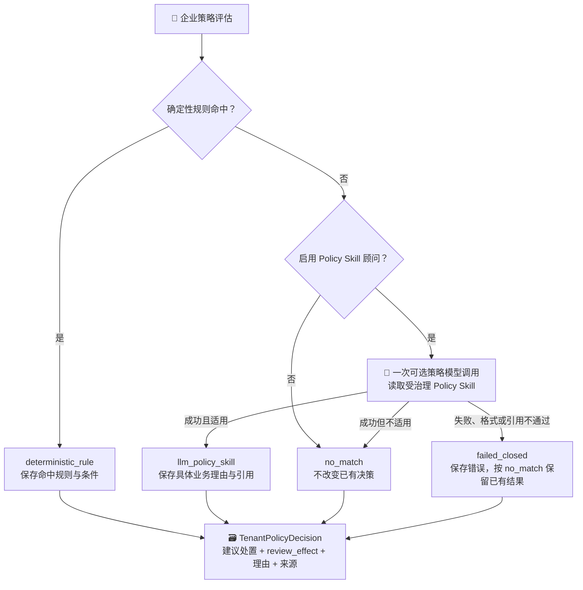

### 3.2 决策合并时的所有企业策略阶段状态

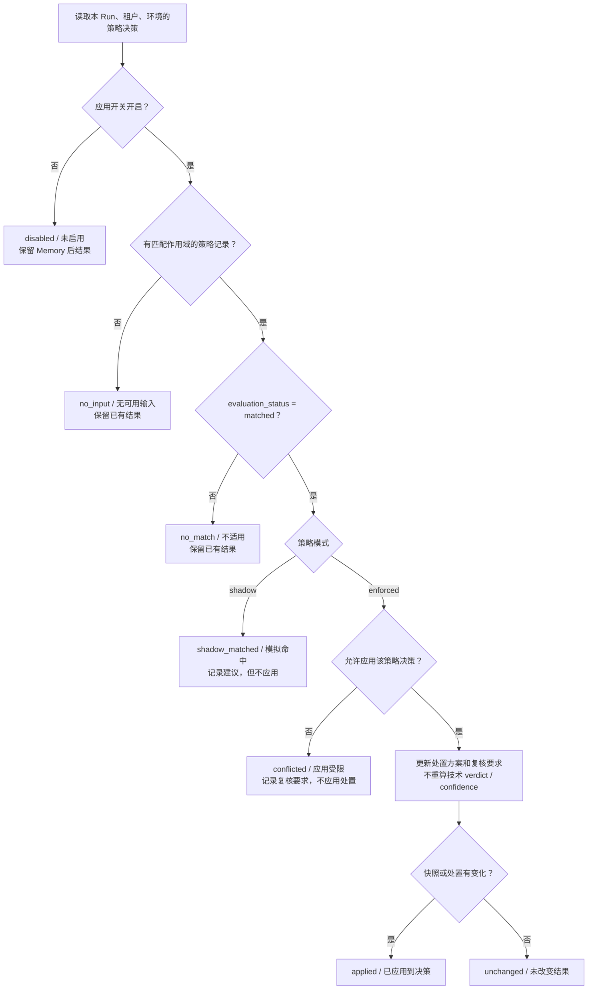

| 字段 | 可取值或作用 | 不代表什么 |
|---|---|---|
| `review_effect` | `preserve` 保留、`require` 要求、`clear` 清除该阶段复核标志 | 不自动创建/完成所有人工任务；不清除独立 Materiality 冲突 |
| `recommended_disposition` | 转交、忽略、抑制、重复合并、三种结案；空/unknown 表示未选择 | 不是执行回执 |
| `selected_rule_id` | 具体规则 ID；策略模型为 `llm-policy-skill-advice` | 不是处理进度原因码 |
| `summary / rationale` | 为什么该告警应这样处理 | 不是第二份独立技术结论 |

当前 PingAn 文件包含授权活动关闭、指定规则码转交、安全软件路径忽略、canonical HTTP 非 200 忽略和明确请求失败忽略。它们具有各自严格条件，不意味着仅凭任意 `status` 字段就忽略。具体以 `tenant-disposition-v2.json` 为准；其他厂商可以提供自己的规则和 Policy Skill。

### 3.3 “策略原因码”到底看哪里

**目前没有一个包办全部业务原因的 `tenant_reason_code` 枚举。不要把阶段状态、规则编号和进度原因混为一谈。**

| 你要问的问题 | 看哪个字段 | 1966558 的答案 |
|---|---|---|
| 策略是否被采用？ | 阶段 `status` | `applied`，已采用 |
| 谁给的建议？ | `decision_source`、`selected_rule_id` | Policy Skill，`llm-policy-skill-advice` |
| 为什么这么处理？ | `summary`、`rationale`；确定性规则另看 `rule_evaluations.conditions` | 存在待核实的风险，需确认授权测试、端点及失陷情况 |
| 对已有结果改了什么？ | 阶段 `before / after`、`disposition_after` | 增加复核要求和转交方案，更新建议；可疑与 68% 不变 |
| 现在还在等什么？ | 结果视图 `closure_reason_codes`、`progress_detail` | `tenant_policy_handoff_pending`，未记录转交完成反馈 |

当前 PingAn 确定性规则编号：

| `selected_rule_id` | 业务原因 |
|---|---|
| `authorized-activity-operational-close` | 精确命中有效授权活动，按授权良性活动关闭 |
| `legacy-forced-transfer-rule-code` | 命中明确要求转交的两个规则码 |
| `edr-safe-software-path-fast-ignore` | 全部相关路径符合已启用的安全软件快速忽略策略 |
| `canonical-http-non-200-ignore` | canonical HTTP 状态均非 200，且不被成功/失陷等条件排除 |
| `provider-confirmed-request-failure-ignore` | 上游语义明确表示请求失败，且满足该规则的排除与优先级条件 |

这些只是已配置的企业规则，不是通用 Runtime 的厂商分支；本轮没有修改它们。

### 3.4 企业策略的标记传递顺序

```text
匹配当前 run_id + tenant_id + environment 的 TenantPolicyDecision
  → 应用开关关了：disabled，不改快照
  → 没有策略记录：no_input，不改快照
  → evaluation_status=no_match：no_match，不改快照
  → policy_mode=shadow：shadow_matched，只留建议
  → enforced 但 auto_apply_allowed=false：conflicted，要求复核，不采用处置
  → enforced 且允许：应用 review_effect 和具体 recommended_disposition
```

`auto_apply_allowed=true` 是**允许采用这份企业策略建议**，不是允许封禁/隔离。
`recommended_disposition=unknown` 或空值表示没有选处置，不应抹掉上一步建议。
`review_effect=clear` 改的是该阶段快照的布尔值，不会删除 Base 的原因和 Materiality 报告。
本阶段也不改技术 `verdict/confidence`。条件不满足时还必须保留来源和原因，不能只剩一个 false。

## 4. Effective：最终采用什么

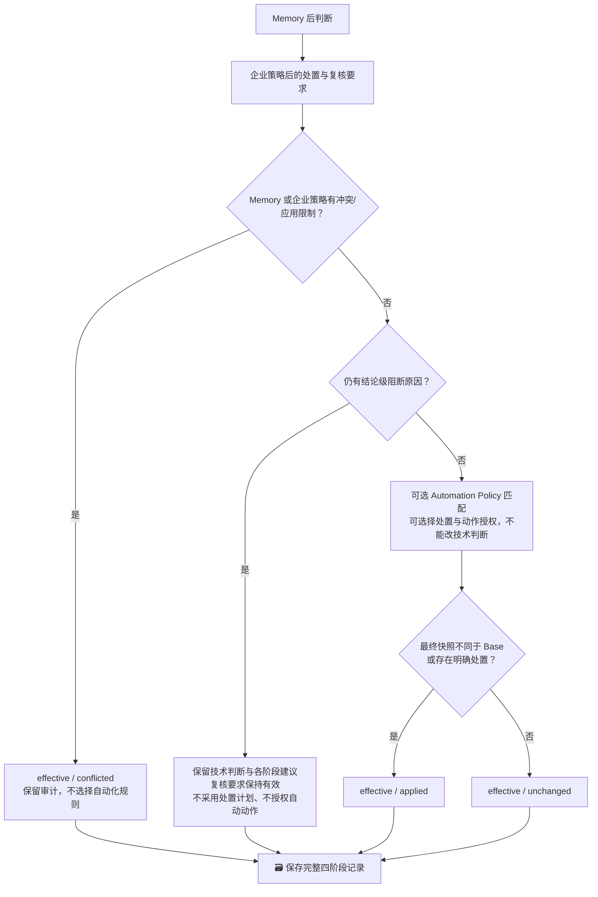

不存在“Effective 再调用一个模型投票”。自动执行另外要求受治理授权、执行开关、目标与 Adapter 可用，且不能把 Mock 结果当成内网验收通过。自动化失败不要求把原告警重新送给模型。

Effective policy v4 在合并时保留尚未解决的结论级阻断。Memory 或策略的 `clear` 可以解除业务疑问，
不能抹掉独立的核心校验/事实冲突。被阻断的策略建议留在 Tenant 阶段，不生成已采用处置记录、
动作授权或执行。页面仍给出“转交确认”，不要求运营理解四阶段才知道该怎么处理。
历史记录只读重投影：未执行且已被阻断的旧方案不再作为当前处置展示；原阶段内容保留，
ZEUS 审计可查看 `recorded_disposition`。已经收到的真实外部反馈不删除。

### 4.1 最终条件判断读取哪些值

| 条件编号 | 输入与判断 | 触发的变化 | 明确保留什么 |
|---|---|---|---|
| E1 | Base 仍有 `fact_conflict / high_value_evidence_gap / ungrounded_analysis_evidence / ungrounded_analysis_reasoning / role_verification_challenged / analysis_output_degraded / stub_analyzer`，或 Materiality 有结论级原因/核心判断不可用 | Effective 保持 `needs_review=true`，本轮不采用处置、不选自动化规则 | 原始 verdict、Memory 和 Tenant 的建议及 before/after |
| E2 | Memory/策略阶段导致总 `transition_kind=conflicted` | 不采用处置、不授权执行 | 冲突来源，不假装已经解决 |
| E3 | E1/E2 都不触发 | 可以匹配独立 Automation Policy | 没有匹配不意味着分析失败，也不凭空有执行权限 |
| E4 | 投影尚无阻断原因、Base 的 `review_reasons` 为空、Effective 仍要求复核，且不能归属纯策略复核或明确采用的自动化方案 | 标记 `review_requirement_unattributed`，提示查清复核来源 | 不虚构成“缺少业务证据” |

源码里的 `decision_blockers / handling_blocked` 是**函数内计算变量**，不是新增在结果 JSON 里的同名字段。
审阅时通过原始原因、阶段 after、`effective_disposition`、`selected_rule_id` 和最终处理依据还原判断。
不要在导出的 JSON 里到处寻找 `handling_blocked`。
E4 所说的明确自动化方案，代码要求总处置非空、Effective 阶段为 `applied` 且有 `selected_rule_id`；
不是看建议文字里有没有“已授权”。纯企业策略复核的完整条件见第 5 节。

`stage.status=applied` 可能只表示快照的复核要求或策略版本发生变化；**不能单凭 applied 认定忽略方案已采用**。
必须同时看 `disposition_after / effective_disposition`。同理，`unchanged` 表示快照没改，不表示它没有留下审计，
也不替代查看总冲突状态。
列表的 `decision_usability` 仍是 **Base 质量分类**，不是四阶段后的 `case_outcome.decision_usable`；
列表主处理结论使用 `recommended_handling`。审计原始质量和判断最终怎么处理，不能只取同一个状态值。

### 4.2 从处置方案到真正执行，还有哪些触发值？

| 边界 | 实际读取的条件 | 未满足时 |
|---|---|---|
| 匹配动作规则 | 当前环境/租户/有效期；规则要求的 verdict、evidence state、模型/Prompt/Decision 版本、分数和复核标志 | 不选择该规则 |
| 检查目标能力 | canonical/已裁决角色目标 + `capability_guards[].allowed`，以及精确 Adapter 描述 | 拒绝相关动作；不能封禁一个未确认的目标 |
| 产生授权 | `enforced` 模式、授权方式、非 replay、目标与 Adapter 合规 | shadow 不授权；human_approval 仍走审批；其他失败保留拒绝原因 |
| 真正执行 | `authorization.decision=authorized` 且执行开关开启，执行时还检查有效期/幂等 | 可以已授权但未执行；重复请求不能重复造成副作用 |
| 记录完成情况 | `execution.status` 与真实 Provider 返回 | 单次动作成功只证明该动作，不等于整条告警已关闭 |

Base 的 `automation_allowed=false` 表示基础分析器不直接授予动作权限；**不是系统永远不能自动执行**。
独立受治理规则可以产生新的 Authorization。这里的 `authorized`、处置 `applied`、执行 `succeeded` 是三件不同的事。
明确配置的通用复核例外不能绕过 E1/E2 或相关目标能力检查。

## 5. 处理进度：严格按这个优先级判断

先用两件具体事情区分最容易混淆的状态：

- `follow_up_required`：**结果本身仍有问题需要确认**。例如两条可直接复用的已审核 Memory 对同一告警给出相反判断；当前判断仍保留，但不能假装分歧已经解决。又如核心结果引用校验出错，应找技术侧检查，不应该让运营去补主机日志。
- `handling_pending`：**当前判断已形成，后续处理尚未完成或尚无回执**。例如 1966558 已判断可疑，企业策略要求转交；系统没有接收方反馈，因此显示待转交。即使完全没有证据缺口，也可能处于这个状态。

这不是每条告警都必须先后经过的两站；每次读取按下面条件选择当前状态。

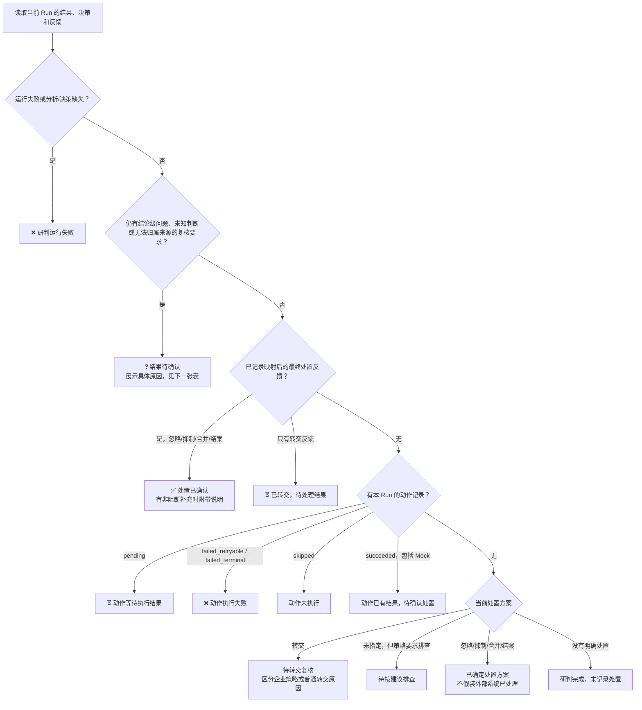

**状态本身不派发任务、不调用 MCP、不自动等待某个后台补查。** 是否创建人工介入、执行动作、接收回调由既有业务服务决定。不要把“当前没有回执”理解成“必须让运营再点一次确认”。

### 结果待确认：不再全叫“关键事实待确认”

| 原因码 | 页面标题 | 谁/哪部分需要处理 |
|---|---|---|
| `decision_source_conflict` | 待解决决策分歧 | 核对冲突的 Memory 指令或受限策略来源 |
| `current_fact_conflict` | 待确认事实冲突 | 核对已经记录的实质矛盾，不重审所有字段 |
| `critical_input_missing` | 待补齐关键输入 | 检查输入覆盖与投影遗漏，不等同缺少 CMDB 服务 |
| `analysis_validation_failed` | 待处理结果校验问题 | 技术侧检查核心输出/引用；不是要求运营补业务证据 |
| `role_verification_challenged` | 待确认角色分歧 | 看具体方向/角色反证，不否定已声明来源语义 |
| `analysis_fallback_used` | 本次使用兜底结果 | 查看为什么没有采用正常模型结果 |
| `decision_not_established` | 尚未形成明确判断 | 读模型给出的具体原因和已有核查建议 |
| `memory_review_required` | 经验要求专项复核 | 已应用经验指令新增复核要求，查看该经验的使用边界 |
| `review_requirement_unattributed` | 待确认复核原因 | 老记录或缺少来源的复核要求，不虚构“事实缺失” |

聚合状态仍为 `follow_up_required`，并保留 `material_follow_up_required` 通用码；具体原因可有多个，页面显示首个问题并说明其他原因。可疑/低置信度/普通 `evidence_gaps` 非空本身都不会触发这些原因。

### 后续待处理：每一个 pending 都说明在等什么

| 原因码 | 页面标题 |
|---|---|
| `tenant_policy_handoff_pending` | 待转交复核：策略单独新增的转交要求 |
| `tenant_policy_review_pending` | 待按建议排查：策略单独新增复核但未指定处置 |
| `handoff_confirmation_pending` | 待转交复核：普通转交方案 |
| `handoff_recorded` | 已转交，待处理结果：已有外部转交反馈 |
| `handling_not_applied` | 研判完成，未记录处置 |
| `disposition_decided` | 已确定处置方案 |
| `action_execution_pending` | 动作等待执行结果 |
| `action_execution_failed` | 动作执行失败 |
| `action_execution_skipped` | 动作未执行 |
| `action_result_recorded` | 动作已有结果，待确认处置 |

“纯企业策略复核”的源码条件：该阶段 applied、之前不要求复核、之后要求复核、技术 verdict 不变、处置为空或转交、最终快照仍与该阶段一致，并且没有独立结果/事实冲突。否则保留独立问题，不凭文案猜测并清除要求。

### 5.1 进度不是跟着某个单一 status 自动改

消费者是 `project_soc_case_outcome()`：读取当前 Run、最新采用记录、当前 Run/alert 反馈和动作，**重新选择**一个视图状态。
它不是把 `run.status` 改成 `closed`，也不是把 `execution.succeeded` 原样复制到告警状态。

| 新读取到的条件 | 下游显示变化 | 不会自动做的事 |
|---|---|---|
| 运行失败，或缺分析/决策对象 | `failed`，显示失败原因 | 不制造业务转交成功 |
| 仍有结论级阻断、未知判断等 | `follow_up_required`，给具体原因 | 不因一条忽略建议掩盖问题 |
| 无上述阻断，收到 `apply_status=mapped` 且匹配目标的终态反馈 | `closed / closed_with_limitations` | 不推断模型曾经无风险；终态也可能是确认攻击后结案 |
| 只收到 `canonical_status=escalated` 的有效反馈 | `handling_pending / handoff_recorded` | 不当作最终结案 |
| 没有最终反馈，但动作 `failed_retryable / failed_terminal` | `handling_pending / action_execution_failed` | 不重新调用模型来掩盖接口失败 |
| 只有已采用的忽略/转交方案 | `handling_pending`，区分方案已确定或待转交回执 | 不宣称外部系统已完成 |

此处的终态值是 `ignored`、`suppressed`、`duplicate`、`closed_true_positive`、
`closed_false_positive`、`closed_benign_true_positive`；必须来自已映射反馈，不能只从策略计划里取同名值。

反馈首先按目标 Run/alert 和 `apply_status` 过滤，不能使用其他 Run 的回执或 unknown 状态。
当前总 transition 若为 conflicted，处置解析先保留冲突，不凭反馈旁路消掉分歧。其余场景下映射反馈
优先于计划；若独立问题仍在，进度仍提示问题，原始反馈并不被删除。

`closure_reason_codes` 是这次选择进度后的**解释码**，`progress_label/progress_detail` 再据此生成文案；
它们不是下一轮模型的命令。查询页面不产生新派单、权限或外部调用。
兼容任务的 `SUCCESS` 只说明任务完成并有结果；callback 投递成功与 ZEUS 已有最终运营处置也是不同状态。

## 6. 看具体值如何变化

### 6.1 1966558：企业策略新增转交要求

来源：已保存 Run `RUN-17096399AD10`，本次仅重新读取，没有重跑模型。

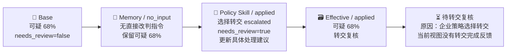

页面主结果：**转交**。依据是策略建议核实授权测试与端点情况，下一步保留已生成的排查建议。
展开详情才看**可疑/68%、待转交复核、没有转交完成反馈**。不是“分析失败”，不是“已经自动查询端点”，也不是“ZEUS 已转交”。

```json
{
  "recommended_handling": "transfer",
  "security_verdict": "suspicious",
  "confidence": 0.68,
  "operational_disposition": "escalated",
  "closure_status": "handling_pending",
  "closure_reason_codes": ["tenant_policy_handoff_pending"],
  "progress_label": "待转交复核"
}
```

这条里的关键变化不是模型“重新怀疑告警”，而是策略阶段单独把 `needs_review=false → true`，
同时给出 `disposition_after=escalated`。最终读取到的是“有风险判断、有企业转交方案、无完成回执”，
因此给运营转交建议，而不是把普通疑点变成输入失败。

### 6.2 机制示例：Memory 消除了业务疑问

**以下为解释代码的机制示例，不是新跑出的真实告警记录。** 假设原先不知道某内部服务调用是否授权，
已审核且本次精确适用的 Memory 给出误报结论；没有独立关键输入缺失或事实冲突，企业策略未改变它。

| 时点 | 读取值/触发值 | 写出的结果 |
|---|---|---|
| Base | `verdict=unknown`，原因只有 `uncertain_verdict` | `needs_review=true`、原始 `run.status=needs_review` |
| Memory | 有效 override 指令：`target_verdict=false_positive`、`review_effect=clear`，适用性与版本门槛通过 | Memory.after：`false_positive / needs_review=false` |
| Effective | 没有 E1/E2 阻断；无企业/自动化处置变更 | transition.after 沿用 Memory 结果 |
| 页面/ZEUS 投影 | 最终误报、无独立阻断 | `recommended_handling=ignore`；被取代的 Base 疑点留在 `prior_analysis_gaps` |
| 审计 | 回看原始 Run | 原来的 `unknown / needs_review=true` 还在，不应当作现在仍需复核 |

若只是 context-only 经验，也可以由主模型直接在 Base 给出 `false_positive`；此时 Memory 阶段
`no_input` 仍正常。**“经验参与了判断”与“指令在后处理阶段改判了”是两条不同的因果路径。**

### 6.3 机制示例：为什么一个 clear 不能让所有标记消失

同样是机制示例，假设原始记录还有一个尚未裁决的关键事实冲突：

```json
{
  "core_usable": true,
  "decision_usable": true,
  "review_required": true,
  "review_reasons": ["fact_conflict"]
}
```

这是 `run.analysis_materiality` 的节选。前两个 true 说明核心结构/引用可用，不表示后面的冲突不存在。

| 时点 | 标记变化 | 为什么 |
|---|---|---|
| Base | `needs_review=true`，原因 `fact_conflict` | Materiality 产生了结论级原因 |
| Memory | 适用指令可以先把本阶段 `needs_review` 清为 false | 改的是本阶段快照，不是原报告 |
| Effective | E1 仍读取到 `fact_conflict`，最终 `needs_review=true` | 原始原因仍在，不能当作已解决 |
| 采用与执行 | `effective_disposition=null`，不创建处置采用/授权/执行记录 | 原策略建议仍留在之前阶段，不冒充已采用 |
| 页面 | `recommended_handling=transfer`，依据 `decision_review:fact_conflict` | 保留当前技术 verdict，并说明待确认的具体冲突 |

这不要求重审所有告警字段；要处理的是**已经被标记为未解决的那项具体矛盾**。普通补充信息、
已解决的差异、只影响某个动作目标的问题，不走这个分支。

### 6.4 想解释一条告警，按这六处向后追

1. 找准本次 `run_id`，不要把同 alert 的旧 Run 混进来。
2. 看 `run.decision.review_reasons`，再回到 coverage/materiality/role 报告确认原因怎么产生。
3. 看四阶段的 `before/after`，尤其是哪一段改了 verdict、needs_review、处置和建议。
4. 看 `transition.after` 与 `effective_disposition`，并核对是否有独立阻断，不能只看最后一个布尔值。
5. 看 Authorization、Execution、已映射外部反馈，区分“可执行、已尝试、已完成、已结案”。
6. 对照 `recommended_handling_basis` 与 `closure_reason_codes`：前者回答为什么忽略/转交，后者回答当前还在等什么。

## 7. 代码、范围与验证

### 7.1 按标记找生产方和消费方

以下链接指向实际源码；函数名用于定位，不要求把文档行号当成固定接口。

| 要追的标记 | 生产/转换入口 | 下游读取入口 |
|---|---|---|
| core/capability/冲突影响 | [materiality.py](../../../backend/soc_agent/pipeline/materiality.py)：`assess_analysis_materiality`、`_conflict_dispositions` | `SocDecisionPolicy.decide`、`SocAutomationService.evaluate`、`project_soc_case_outcome` |
| Base reasons、needs_review | [decision_policy.py](../../../backend/soc_agent/core/decision_policy.py)：`_review_reasons`、`decide` | [runtime.py](../../../backend/soc_agent/core/runtime.py)：保存 `run.decision`、选择 `run.status` |
| 原始记录与后分析调用 | [service.py](../../../backend/soc_agent/core/service.py)：`save_analysis_bundle` 调用、`_observe_post_analysis` | 已配置 Observer 产生独立后处理记录；查询时按 Run 组合 |
| Memory 指令、Tenant 采用、Effective 阻断 | [automation.py](../../../backend/soc_agent/core/automation.py)：`_eligible_memory_directives`、`_effective_decision`、`_tenant_policy_outcome`、`evaluate` | 同文件的处置/授权路径及结果读模型 |
| 结论级阻断与忽略/转交 | [handling.py](../../../backend/soc_agent/core/handling.py)：`handling_blockers`、`project_operational_handling` | [alert_results.py](../../../backend/soc_agent/core/alert_results.py)、case outcome、ZEUS mapper |
| 授权匹配与目标能力 | [policy.py](../../../backend/soc_agent/automation/policy.py)：`select_automation_rule`；automation.py 的 `_action_materiality_guard`、`_authorization_decision` | `_execute`，另受执行开关、有效期和幂等约束 |
| 完成反馈与进度 | [case_outcomes.py](../../../backend/soc_agent/core/case_outcomes.py)：`project_soc_case_outcome`、`_closure_status` | [case_progress.py](../../../backend/soc_agent/core/case_progress.py)：原因码转解释；Web 渲染 |
| 传回 ZEUS 的业务结果 | [result_mapper.py](../../../backend/soc_agent/integrations/pingan/legacy_compat/result_mapper.py)：`PingAnLegacyResultMapper.project` | legacy Worker 持久结果与 callback outbox；投递回执不等于运营结案 |

### 7.2 范围与验证边界

- 决策四阶段：`backend/soc_agent/core/automation.py`。
- 企业策略契约、建议与采用：`contracts/tenant_policy.py`、`tenant_policy/evaluator.py`、`tenant_policy/advisor.py`。
- 进度判定与具体说明：`core/case_outcomes.py`、`core/case_progress.py`。
- 列表、详情、历史对比与 ZEUS 共用 `core/handling.py` 的忽略/转交分类；列表读取有界
  transition/feedback，不加载完整 Run，也不重跑模型。失败结果不能沿用旧对象显示忽略。
- Web 只渲染后端 `progress_label / progress_detail`，不另造一套判断。技术审计表显示每阶段处置方案、复核要求、处理建议。
- 完成反馈只消费当前 Run（或明确关联当前告警且没有其他 Run 归属）的已映射记录；不从任意动作成功、未知状态、其他告警或其他 Run 推断完成。
- 当前 corpus 演练列表只传入 Run 和决策阶段，**不查询实时 ZEUS 回执**；完整告警调查上下文服务可传入外部反馈和动作记录。未接入的视图不伪造已完成。
- 本轮没有修改安全 verdict、Memory 匹配或企业策略规则，没有增加模型调用、外部调用、数据库迁移或自动人工任务。新增 Effective 结论级阻断约束；旧数据库不重写，读取时统一展示。
- 测试覆盖 `test_soc_case_outcomes.py`、`test_soc_alert_results.py`、`test_soc_automation.py`、`test_soc_tenant_policy.py`、`test_soc_pingan_legacy_execution.py` 及现有结果组件。真实内网回执接通仍按集成台账验收，本文不冒充其已经完成。
- 本次“标记传递”补充仅说明已有代码，不新增 Guard、状态机或配置开关；机制示例与真实 `1966558` 记录分开标明。
