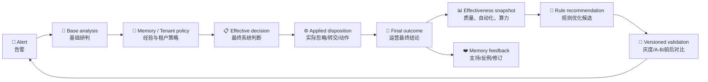
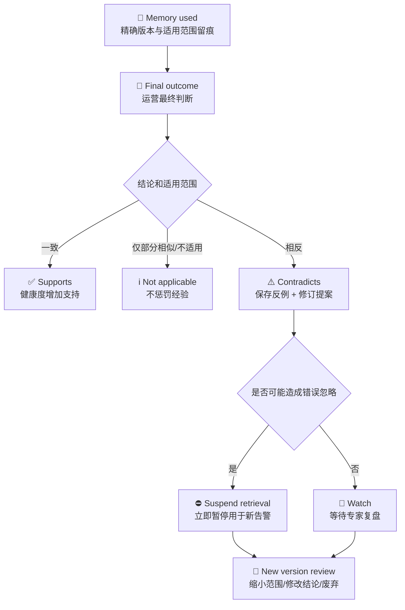

# SOC Effectiveness And Rule Optimization / 研判效能与规则优化闭环

Status: Implemented baseline; real final-outcome integration pending

Updated: 2026-08-28

## 1. Product Decision / 产品决策

SOC Agent 不用自己的模型结论证明自己准确。效能评价必须把以下四层分开：

1. **Base/Effective Verdict / 模型与系统研判结论**：系统当时认为有没有风险；
2. **Applied Disposition / 实际处置**：系统是否真的忽略、转交或执行动作；
3. **Final Outcome / 运营最终结论**：分析师或可信外部系统最后确认有没有风险；
4. **Cost And Quality / 成本与质量**：模型调用、Token、耗时、修复、降级和 fallback。

没有第三层时，告警可以计入处理量和自动化量，但不得计入准确率、漏报率或规则真实误报率。
`validation/soc可视化报表.html` 中的百分比和成本数字只作为产品展示参考，不能替代本系统的真实埋点。



## 2. User Workflow / 用户工作流

### 2.1 Memory review / 经验审核

运营专家不再重复填写“业务事实”和“治理理由”。正常确认只要求：

- **Final verdict / 最终判断**：真实攻击或误报；
- **Business fact / 业务事实**：可选的一次性补充，说明机器证据中没有的企业背景。

AI 基于冻结候选、证据引用和上述人工输入，生成可编辑的 **Experience Card / 研判经验卡**：

| Card section | 用户问题 |
|---|---|
| Detection scenario / 检测场景 | 规则声称发生了什么攻击或异常？ |
| Observed event / 实际事件 | 业务上实际发生了什么？ |
| Reviewed conclusion / 审核结论 | 最终为什么有风险或无风险？ |
| Rationale / 判断依据 | 哪些事实支持该结论？ |
| Applicability / 适用条件 | 新告警满足什么条件时可以复用？ |
| Generalization / 允许变化 | IP、账号、时间等哪些变化不影响复用？ |
| Invalidation / 失效条件 | 出现什么反证时必须停止复用？ |
| Handling / 处置建议 | 命中后应如何研判或处置？ |

服务端自动生成审计描述，例如“审核人确认误报经验，仅作上下文”或“精确匹配后允许复用误报结论”。
只有后续启用、暂停或恢复 Memory 时，才要求填写 **使用状态变更说明**；这用于解释一次治理动作，
不是让分析师再次复述业务事实。

### 2.2 Memory contradiction / 经验被后续结论推翻

每次 Memory 被新告警使用都保存 exact `memory_id/version`、匹配范围和是否实际改判。随后收到高可信
最终结论时，系统比较 Memory 的**人工审核结论**与新告警真值：



系统不原地覆盖旧经验。旧版本、当时如何影响判断、反例、暂停原因和新版本审核全部保留，便于计算
Memory 支持率、反例率以及错误自动忽略归因。

## 3. Truth Contract / 最终真值契约

质量标签按以下优先级选择，低优先级不能覆盖高优先级：

1. 分析师显式 correction 或结构化最终 outcome；
2. 通过 source、status mapping、target 和 trust gate 的外部 Zeus/ITSM/SOAR 最终状态；
3. 独立抽样复核的 sealed label；
4. 其他状态、自由文本、模型自报置信度：只保存，不进入质量分母。

Detection truth / 技术真值与 Operational disposition / 运营处置必须分开。例如“真实扫描但属于授权演练”
可以是 `true_positive + ignored`；不能因为最终关闭工单就把它误记成技术误报。

## 4. Instrumentation Map / 埋点地图

| Stage | Persisted signal | Purpose |
|---|---|---|
| Alert ingress | `alert_id`、tenant、source、canonical detection identity、可选 `rule_code` | 量级、来源、规则族 |
| Analysis Run | analysis/runtime verdict、模型与 Prompt 版本、总耗时 | 基础质量与延迟 |
| Provider invocation | 调用次数、input/output/total tokens、usage 状态 | 算力和成本覆盖；Provider 不返回 usage 时记 unavailable |
| Output validation | repair、fallback、degraded section count | Prompt/模型/解析稳定性 |
| Decision lineage | Base、Memory、Tenant、Effective before/after | 解释谁改变了结论 |
| Disposition lineage | proposed/applied + ignored/escalated 等 | 区分建议和真实自动化 |
| Final outcome | verdict、reviewer/source/trust、reason、occurred_at | 准确率与漏报的唯一分母来源 |
| Memory lineage | context/directive use、supports/contradicts/not-applicable | 经验真实贡献与失效 |

统计窗口内同一 `alert_id` 只使用最新 Run；重跑和 replay 记录为 superseded，不重复扩大业务量。

## 5. Product Metrics / 产品指标

所有比率同时返回 numerator、denominator、availability 和公式。分母为零时显示 `not_measured`，不显示 `0%`。

| Metric | Formula | Meaning |
|---|---|---|
| Label coverage / 标签覆盖 | 高可信最终结论 / 完成告警 | 评价其他质量指标是否有代表性 |
| Triage accuracy / 研判准确率 | Effective Verdict 与最终技术真值一致 / 高可信已标注告警 | 系统判断是否正确 |
| Detection miss / 技术漏报率 | 最终真实攻击但 Effective 为误报 / 最终真实攻击 | 模型、Memory、Policy 综合漏报 |
| Operational miss / 运营漏报率 | 最终真实攻击但已自动忽略 / 最终真实攻击 | 自动化安全红线 |
| Transfer precision / 转交精确率 | 转交且最终真实攻击 / 有标签的转交 | 产品表中的“正确转交数 / 总转交数”实际是 precision |
| Transfer recall / 攻击转交召回 | 被转交的真实攻击 / 全部最终真实攻击 | 防止只转交少量容易样本获得高 precision |
| Auto-ignore rate / 自动忽略率 | 已实际应用忽略类处置 / 完成告警 | 当前所说自动化率；shadow proposal 不计入 |
| Wrong auto-ignore / 错误自动忽略率 | 自动忽略后最终为真实攻击 / 有标签的自动忽略 | 必须与自动忽略率同时展示 |
| Human touch / 人工触达率 | 人工最终修正或人工 outcome / 完成告警 | 是否真正减少运营工作量 |

## 6. Rule Code And Behavior Evaluation / Rule Code 与同类行为评价

通用聚合键为 `tenant + source_type + source_system + canonical detection identity`。`rule_code` 是 PingAn
等供应商可提供的别名，不是通用必填字段；无 `rule_code` 时系统仍按 detection key/name/source 工作。
名称是展示属性，不参与稳定主键；同一 canonical detection identity 仅因 `rule_name` 文案变化时不得被拆成
两条规则。

运营页面固定使用以下三层，而不是把抽象“检测族”直接暴露给用户：

```text
Rule Code（没有时显示 canonical detection identity）
  -> 同类行为（canonical behavior fingerprint 对应的可读标签）
     -> Memory（该行为已审核的经验及实际使用效果）
```

同一个 Rule Code 同时出现误报和真实攻击，不代表所有告警可以统一处理。系统必须先下钻到同类行为；
同 Rule Code、不同强行为指纹的告警继续走完整 LLM 研判，并由统一 PostAnalysis Observer 留下各自的告警
样本。跨 Rule Code 的相似 Memory 在当前版本最多作为 `context-only` 背景，不能自动复用结论。

每条 Rule Code（或无 Rule Code 时的 canonical detection identity）同时展示：

- 告警总量与高可信标签覆盖；
- **Confirmed-risk rate / 有效检出占比**：最终真实攻击 / 已标注告警；
- **Rule false-positive rate / 规则误报占比**：最终误报 / 已标注告警；
- **AI triage accuracy / AI 研判准确率**与该组技术漏报率；
- 自动忽略量、错误自动忽略量；
- 模型调用、Token、平均耗时、repair/fallback/degraded；
- Memory context/directive 使用量和反例量。

“有效检出占比”不能被称为规则召回率。真正的检测召回率需要知道没有产生告警的真实攻击数量，当前
告警数据集无法提供这个分母。

### 6.1 Memory effectiveness / Memory 效果归因

Memory 与 Rule Code 是运行时形成的多对多关系，不增加硬编码外键：

- 来源规则来自 Memory 的冻结 source run；
- 实际覆盖规则来自 `MemoryUse -> AnalysisRun -> AlertSummary`；
- 同一 Memory 版本在一个告警 Run 中只有一种最终用法；
- `directive`（直接复用结论）可与最终运营结论做归因；
- `context-only` 只证明模型看过该背景，不能据此宣称它提高了准确率。

每个 exact `memory_id + version` 展示使用告警数、context/directive 次数、最终反馈覆盖率、指令正确率、
帮助纠正、错误覆盖、运营反例以及错误自动忽略。错误自动忽略必须同时存在“Memory 改成误报 + 实际
应用忽略处置 + 高可信最终真值为真实攻击”，不能只看模型 verdict 推断。旧版本没有历史 Record 快照时，
只展示其 ID、版本与真实 Use/Feedback，不继承当前版本的名称或启用状态。

### 6.2 Versioned recommendations / 版本化改进建议

建议由只读、确定性 `soc.rule_optimization_policy.v1` 生成，权限固定为 `advisory`：

| Recommendation | Trigger | Suggested action |
|---|---|---|
| Insufficient labels | 标签数量或覆盖不足 | 先同步运营状态或抽样复核 |
| Detection gap | 已标注真实攻击中的漏报超阈值 | 优先修 Adapter、Skill、Memory 或决策策略，禁止快速忽略 |
| Adapter/enrichment issue | repair/fallback/degraded 过高 | 修输入覆盖、上下文或输出契约 |
| Rule split | 同 Rule 同时存在显著风险和误报 | 按行为指纹、协议、服务、资产角色或授权上下文拆分 |
| Upstream rule tuning | 稳定高误报 | 调阈值、白名单、重复聚合和字段语义 |
| Fast-path candidate | 高量、稳定误报、存在模型消耗且无已知错误忽略 | 精确行为 + 审核 Memory/Policy + 抽样复核后灰度 |
| Keep full analysis | 真实风险占比较高 | 保留完整模型与证据查询 |
| Monitor | 未越过阈值 | 继续收集最终状态和成本 |

系统不会自动修改 Flink 规则、Prompt、Memory 或动作策略。规则优化必须生成版本，使用冻结样本进行
before/after 或小流量 A/B，且同时满足“误报下降、漏报不升、错误自动忽略不升”。

## 7. Compute Optimization / 算力优化

算力节省不能用 `rule_code` 一刀切。允许的渐进路径是：

1. 同一 `alert_id` 重投/replay：复用幂等结果，不再调用模型；
2. 重复原始观察：先做确定性 compact/dedup，保留高价值 canonical evidence；
3. Rule Code 下的高量稳定误报行为组：先形成精确行为指纹和审核后的 Memory/Policy；
4. 灰度快速路径：可使用去重、小模型或确定性结论，同时保留抽样全量研判；
5. 任一新行为、反证、Memory 失效、标签漂移或错误自动忽略：立即退回完整分析。

当前报表只统计告警 Runtime 的可审计模型调用；Memory 草稿等离线治理调用暂不混入告警成本。若内网
LiteLLM 不返回 usage，调用次数和耗时仍可测，Token 覆盖明确降低，不用字符数伪造 Token。

## 8. Implemented Surface / 当前实现

- Read API: `GET /api/soc/effectiveness/snapshot?window_days=30&tenant_id=...&source_type=...`
- Rule drill-down API: `GET /api/soc/effectiveness/rules/{group_key}?window_days=30&...`
- Core service: `SocEffectivenessService`
- SQL read model: `SqlAlchemySocEffectivenessRepository`
- Contract: `soc.effectiveness_snapshot.v1`
- Persistence index migration: `0026_effectiveness_telemetry`
- Web: `SOC 运营总览 -> 研判效能 -> Rule Code -> 同类行为 -> Memory 实际效果`
- Memory detail: `新告警验证结果` 展示使用、支持、反例、不适用和暂停状态。

历史 migration `0026` 之前的 Run 没有回填模型 usage/质量索引，相关覆盖率可能为空；原始 payload 未被
批量重写。真实 Zeus 最终状态接入前，质量类指标预期显示 `not_measured`，这是正确状态，不是系统故障。

## 9. Acceptance / 验收标准

- 未标注告警绝不进入准确率、漏报率和规则误报率分母；
- shadow disposition 不计自动化，只有 `applied` 才计；
- 同一告警重跑只统计最新 Run，并展示 superseded 数；
- Rule Code 缺失时仍能以 vendor-neutral canonical detection identity 聚合；
- 同一 detection identity 的名称变化不拆分规则；同一 Rule Code 的不同行为必须分别展示；
- 模型 usage 缺失时不估算 Token；
- context-only 不进入 Memory 因果正确率；错误自动忽略必须有 applied disposition 与最终真值；
- Memory 反例保留 exact use/version lineage，危险误报经验自动暂停但不静默重写；
- 所有规则建议均为 advisory，不自动改变上游规则或授权动作；
- 每次规则/策略改进都绑定版本、冻结 cohort、前后质量与成本指标。
