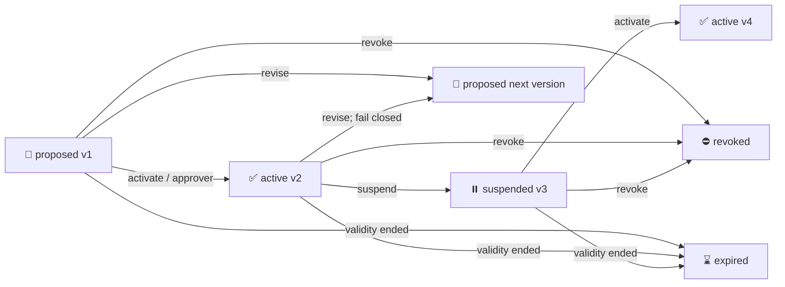

# Governed Context Facts / 受治理上下文事实

## Purpose / 目的

`GovernedContextFact` 保存具有租户、环境、业务有效期、来源、版本和撤销语义的运营事实。
它与下面几类数据严格分离：

| Data | Meaning | Can change detection verdict? |
|---|---|---|
| `InvestigationEvidence` | 一次 MCP/tool 查询返回的证据快照 | No |
| `GovernedContextFact` | 在明确范围和时间内成立的业务上下文 | No，后续只能参与确定性 disposition policy |
| `SocMemoryRecord` | 经复核的可复用研判经验 | No direct mutation |
| Approval grant | 一次高风险动作执行授权 | 只授权动作，不证明告警良性 |

当前 `GF-01` 已实现事实合同、追加式版本、生命周期、Repository、数据库迁移和 CLI；`AA-01`
已实现 canonical `AuthorizationQuery`、确定性事件时间 matcher、`AuthorizationMatchResult` 和只读
`soc context match`；`EX-01` 已把结果保存为 append-only `AuthorizationEnrichmentRecord`，并投影到
InvestigationContext、Web/TUI 和 Lead Agent bounded artifact；`DP-01` 已能从 persisted exact enrichment
和当前 true-positive detection truth 生成独立的 `SocDispositionProposalRecord`。Proposal 仍为 shadow、
not-applied，并且 **不会改变 Runtime、ReviewQueue 或自动关单**。

## Current Contract / 当前合同

首个 typed payload 是 `AuthorizedActivityPayload`：

- `subject_scope`: 谁在执行，例如 service/asset/account/agent/IP/CIDR/tag/certificate。
- `target_scope`: 作用于什么目标，例如 asset/service/application/domain/CIDR/tag。
- `behavior_scope`: 允许的行为，例如 scenario/behavior signature/process/service/protocol/detection alias/technique。
- `recurring_windows`: 可选 IANA 时区、星期（`0=Monday..6=Sunday`）和 local-naive 起止时间；
  AA-01 支持普通窗口和跨午夜窗口，跨午夜归属窗口开始日。
- envelope: tenant/environment、`valid_from/valid_until`、source snapshot、owner、reviewer、reason、evidence refs。

供应商字段、平安 `rule_code`、Zeus aliases 和永久 IP 白名单不得进入公共 matcher 合同。

## Lifecycle / 生命周期



- `fact_id` 是稳定逻辑身份；`fact_version_id` 标识一个不可替换的历史版本。
- 每次 transition/revision 都追加新版本；旧版本保留并设置 `is_latest=false`。
- 所有写操作携带 `expected_latest_version`，过期写者 fail-fast，防止静默覆盖并发修改。
- revision 总是回到 `proposed` 并重新审批。若 revision 来自 active fact，最新状态会暂时 fail closed，
  不再被未来 matcher 当作 active，直到新版本重新激活。
- `revoked/expired` 是终态；提前终止使用 `revoke`，`expire` 只接受已到 `valid_until` 的事实。

## Roles / 角色

| Operation | Required role |
|---|---|
| propose | `soc_analyst`, `soc_engineer`, `soc_admin`, or `soc_context_source` |
| revise | Same as propose |
| activate / suspend / revoke | `soc_context_approver` or `soc_admin` |
| expire | Approver/admin or `soc_context_service` |

CLI 会为本地命令装配对应角色，用于开发和运维入口；生产 API/daemon 必须从认证身份生成
`ServiceRequestContext`，不能信任客户端自报 roles。

## Persistence / 持久化

- Table: `soc_governed_context_facts`
- Migration: `0013_governed_context_facts`
- Source of truth: `GovernedContextFactRepository`
- PostgreSQL 是生产目标；SQLite 可用于本地测试。
- `current_key` 唯一索引确保每个 `fact_id` 只有一个 latest 版本；`fact_id + version` 也必须唯一。
- Repository 从 JSON 恢复后必须经过具体 Pydantic payload validation，并校验索引列与 typed payload 一致。
- `soc context list --valid-at ...` 只做 business-validity 存储过滤，不等价于 authorization match；
  历史版本状态、source freshness 和 subject/target/behavior applicability 必须由 AA-01 matcher 裁决。
- Enrichment table: `soc_authorization_enrichments`
- Enrichment migration: `0014_authorization_enrichments`
- `AuthorizationEnrichmentRepository` 只允许 append；记录保存 canonical query、semantic query hash、
  match result、matcher policy、fact version/content hash refs、actor、idempotency key 和 replay lineage。
- 同一 idempotency key 只能对应同一 run/queue/query/replay source；不同输入复用必须明确失败。
- Proposal table: `soc_disposition_proposals`
- Proposal migration: `0015_disposition_proposals`
- `SocDispositionProposalRepository` 只允许 append；`proposal_key` 对 enrichment、fact refs、matcher policy
  和 detection snapshot 做语义去重，`idempotency_key` 防止 transport retry 重复写入。

## Shadow Disposition Proposal / 影子处置建议

`SocDispositionProposalService` 只接受一个已持久化 enrichment id，并执行确定性 gate：

1. enrichment 必须保留 `shadow_only=true`、`decision_impact=none`；
2. match status 必须是 `exact` 且至少引用一个 governed fact version；
3. enrichment 的 run/alert/queue lineage 必须一致，并且 ReviewQueue 当前仍为 `open`；
4. 当前 detection truth 必须是 `true_positive`；
5. 唯一允许的 DP-01 输出是 `closed_benign_true_positive` +
   `authorized_activity_exact_match`。

输出同时保留 `SocDetectionTruthSnapshot` 和 `proposed_disposition`，因此“行为真实发生”不会被错误改写
为 false positive。记录固定为 `proposal_mode=shadow`、`application_status=not_applied`、
`requires_human_review=true`、`auto_close_allowed=false`，且 detection/ReviewQueue impact 均为 `none`。
没有 queue、queue 不存在、lineage 不一致或 queue 已关闭时均 fail closed，不生成一个无法进入人工流程的建议。

## Deterministic Match / 确定性匹配

`SocAuthorizedActivityService` 只读调用 `GovernedContextFactRepository`，并按 alert event time 从同一
`fact_id` 的追加式历史中选择当时已经生效的版本。它依次检查：

1. tenant/environment；
2. lifecycle version、`valid_from/valid_until` 和 source observation/freshness；
3. recurring window；
4. subject、target、behavior selector groups；
5. canonical fact reconstruction 是否仍有 `blocks_automation=true` 的冲突。

Selector 采用保守语义：不同 `kind@namespace` group 之间是 AND，同 group 内多个值是 OR。例如
`scenario=lateral_movement`、`process=svchost.exe|services.exe` 和 `technique=T1021` 要求三个 group
都命中，但 process group 中任一允许值即可。CIDR 可匹配 canonical IP；namespace 一旦在 fact 中
声明，query 必须提供相同 namespace。

输出状态：

| Status | Meaning |
|---|---|
| `exact` | 当时 active/fresh，时间和所有 scope group 均匹配，且无阻断冲突 |
| `partial` | 存在接近的事实，但 canonical evidence 缺少某个必需 selector group |
| `conflict` | 有可比较值但超出 scope、窗口不符，或事实重建仍有阻断冲突 |
| `expired` | 当时 lifecycle 非 active、业务有效期不符或 source 已 stale |
| `not_found` | 该 tenant/environment 下没有候选事实 |
| `unavailable` | tenant/environment/event time、repository/source history 等决定性上下文不可用 |

无时区的 alert event time 不会被通用代码静默解释。调用方必须通过租户/集成配置传入 IANA timezone；
结果会记录 `authorization_event_time_timezone_assumed:<timezone>`。历史 replay 不允许使用事后创建的
fact version 反向授权旧告警。

## CLI Smoke / CLI 验证

```bash
cd backend
soc db upgrade
soc context propose samples/governed_context/authorized_activity_proposal.json --pretty
soc context activate GCF-... --expected-version 1 --reason "approved for shadow validation" --pretty
soc context list --status active --tenant-id tenant-demo --environment production --pretty
soc context get GCF-... --history --pretty
soc context match /path/to/alert.json \
  --tenant-id tenant-demo --environment production \
  --event-timezone Asia/Shanghai --pretty
soc context enrich RUN-... \
  --queue-id REV-... --tenant-id tenant-demo --environment production \
  --event-timezone Asia/Shanghai --pretty
soc context enrichment list --run-id RUN-... --pretty
soc context enrichment get AAE-... --pretty
soc context enrichment replay AAE-... --idempotency-key authorization-replay:AAE-...:1 --pretty
soc disposition propose AAE-... --pretty
soc disposition list --run-id RUN-... --pretty
soc disposition get DPROP-... --pretty
```

其他生命周期命令：

```bash
soc context suspend GCF-... --expected-version 2 --reason "source under review"
soc context revoke GCF-... --expected-version 3 --reason "change cancelled"
soc context expire GCF-... --expected-version 3 --reason "validity ended"
soc context revise GCF-... revision.json --expected-version 2 --pretty
```

## Next / 下一步

1. `EV-01 Evaluation Gate`：统计 shadow precision、override、freshness、fan-out 和随机抽样，未达 gate
   不允许 auto-close。
