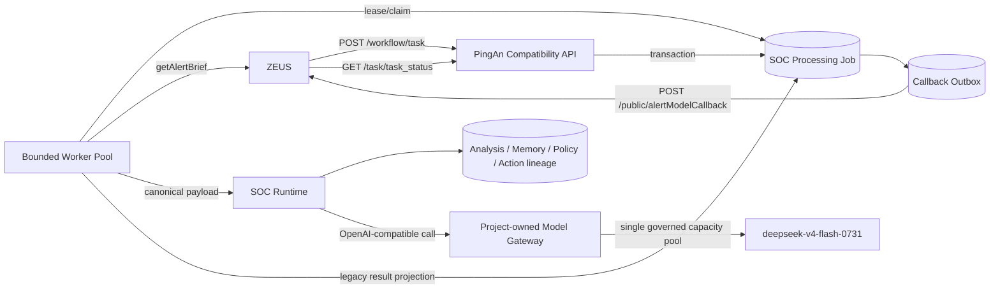

# PingAn Legacy Compatibility Execution Plane / 平安旧系统兼容执行面

## 1. Decision / 决策

新 SOC Agent 保留 ZEUS 与旧 `sec_know_model` 之间已经投入使用的外部协议，内部不迁移
Celery、Redis、多模型动态调度和旧 LlamaIndex 工作流。兼容层只承担协议翻译，所有研判继续调用
唯一的 `SocAnalysisService`。



对外兼容四个接口：

1. `POST /workflow/task`：接收 `app_code/flow_id/session_id/alert_id/alert_data`，立即返回任务号。
2. `GET /task/task_status?task_id=...`：继续返回 `{id,status,result}`。
3. `POST /public/getAlertBrief`：分析前检查 ZEUS 是否已经由运营处置。
4. `POST /public/alertModelCallback`：完成、跳过或失败后异步回写。

内网 DEV 为减少上游改造，兼容 API 延续旧服务的 `8090` 入口并显式绑定局域网；该端口只允许
受信 ZEUS DEV/STG 调用方访问，并继续执行按 `app_code` 的 Bearer/`app-key` 鉴权和请求体上限。
模型网关 `4001` 始终仅绑定 loopback，不能暴露给局域网。

## 2. Ownership Boundary / 归属边界

| Layer | Owns / 负责 | Must not own / 禁止承担 |
|---|---|---|
| Generic job layer | 持久任务、优先级、租约、重试、幂等、事件 | PingAn 字段、ZEUS 状态码、旧结果格式 |
| PingAn compatibility layer | 旧请求/响应、状态查询、结果投影、回调 | SOC 事实重建、Memory、决策与动作权限 |
| SOC Runtime | 规范化、LLM 研判、Memory、租户策略、有效决策 | 外部任务状态和旧 API 语义 |
| Model gateway | OpenAI-compatible 协议、模型并发、超时和 usage 降级 | 业务队列、告警优先级、任务结果 |

平安模块只能位于 `soc_agent/integrations/pingan` 或独立的 PingAn API 进程；通用层只认识
`ProcessingJob` 和 canonical `AnalysisRun`。

## 3. Durable State Machine / 持久状态机

```mermaid
stateDiagram-v2
    [*] --> queued: accepted + transaction committed
    queued --> claimed: worker lease acquired
    claimed --> prechecking: getAlertBrief
    prechecking --> analyzing: pending or state unknown
    prechecking --> skipped_external_handled: already handled
    queued --> expired_before_analysis: queue deadline exceeded
    analyzing --> projecting: AnalysisRun persisted
    projecting --> completed: legacy result + outbox committed
    claimed --> queued: lease expired / retryable failure
    prechecking --> queued: lease expired / retryable failure
    analyzing --> queued: lease expired; same analysis idempotency key resumes
    projecting --> queued: lease expired; persisted run is reused
    queued --> failed: retry budget exhausted
    claimed --> failed: non-retryable failure
    completed --> [*]
    skipped_external_handled --> [*]
    expired_before_analysis --> [*]
    failed --> [*]
```



Callback 是独立状态机：

```text
pending -> sending -> delivered
                   -> retry_wait -> sending
                   -> dead_letter
```

回调失败只重试回调，绝不重新运行 LLM。业务任务和 Outbox 在同一事务完成。

## 4. Idempotency And Recovery / 幂等与恢复

- 调用方提供 `X-Idempotency-Key` 时优先使用；否则使用
  `app_code + flow_id + session_id + alert_id + canonical payload SHA-256`。
- 完全相同的请求重投返回原任务号；同一告警但 payload 改变会创建新任务版本。
- Worker 使用数据库租约领取任务。进程退出后，过期租约回到队列。
- Runtime 使用稳定键 `processing-job:{job_id}:analysis`。若模型已完成但 Worker 在写任务结果前退出，
  恢复时读取同一个已持久化 `AnalysisRun`，不再次计费。
- 旧告警任务只有 `executeType in {1, 3}` 使用 30 分钟排队时限；其他任务类型不套用这条
  PingAn 告警语义。过期判断由 PingAn Worker 负责，通用 Repository 不解释 `executeType`。
- 过期告警不调用 LLM，但不能静默删除：Worker 原子写入 `expired_before_analysis`、旧格式“过期”结果
  和成功 Callback Outbox，随后由独立 Dispatcher 回调 ZEUS。
- DEV 使用 SQLite 且只启动一个协调 Worker；STG/PRD 使用 PostgreSQL
  `FOR UPDATE SKIP LOCKED` 支持多副本领取。

## 5. Priority And Capacity / 优先级与算力

- 业务队列固定名 `deepseek-v4-flash`，实际模型 ID 为 `deepseek-v4-flash-0731`。
- `executeType`、`profileCode` 只由 PingAn adapter 翻译为 `priority`；通用队列不解析这些字段。
- `SOC_PINGAN_LEGACY_QUEUE_TTL_SECONDS` 默认 `1800`，仅应用于 `executeType=1/3`；调整该值必须以
  旧系统契约与真实排队延迟为依据，不能把它扩展成所有 `ProcessingJob` 的通用 TTL。
- 旧模型别名只在入口兼容，不再执行多模型动态选择。
- 第一层是持久业务任务队列；第二层是模型网关的有界并发。队列保证不丢任务，不创造算力。
- 估算公式：`daily capacity ~= concurrency * 86400 / (average call seconds * calls per alert)`。
  内网必须按 `1 -> 2 -> 4 -> 6` 逐级压测后设置上限。

## 6. External Lifecycle Rules / 外部状态规则

- `getAlertBrief` 明确返回“待研判”时继续。
- 明确返回“已由运营处置”时终止模型调用，任务内部状态为
  `skipped_external_handled`，旧接口按兼容结果返回。
- 查询超时、鉴权失败、响应损坏与正常查无严格区分。查询失败允许只读研判继续，但记录
  `external_state=unknown`，并阻断不可逆外部动作。
- 任何不可逆动作执行前再次查询状态，避免与运营并发处置冲突。

## 7. Legacy Result Projection / 旧结果投影

投影器读取持久化链路，而不是只读主模型输出：

```text
Base Decision
  -> Memory Decision
  -> PingAn Tenant Policy Decision
  -> Effective Decision
  -> Automation Authorization / Execution
  -> legacy ZEUS result
```

任务表将 `alert_id`、`detection_key/rule_code`、`execute_type`、`model_name`、最终状态、
`run_id` 和耗时作为可查询列；完整输入、结果与 lineage 仍保留在 JSON payload。

## 8. Model Gateway / 模型网关

本项目自行提供 loopback OpenAI-compatible `/v1/chat/completions`，不依赖旧
`sec_know_model/start_proxy.sh` 或旧 LiteLLM。网关负责：

- 将公开 alias `deepseek-v4-flash` 映射到内部模型 `deepseek-v4-flash-0731`。
- 透传并审计 `extra_body.chat_template_kwargs.enable_thinking/reasoning_effort`；这是供应商扩展，
  不是 OpenAI 标准字段。
- 有界并发、排队超时、上游超时、错误分类、usage 可选兼容；内网不返回 usage 时记录
  `measurement_status=unavailable`，不能伪造 Token。
- 配置和凭证只来自环境变量或 private overlay，源码与日志不保存密钥。

## 9. Delivery Slices / 实施切片

| Slice | Deliverable | Acceptance gate |
|---|---|---|
| `PI-01H1` | Processing Job 契约、表、迁移、Repository、事件与租约 | SQLite 幂等/优先级/恢复；PostgreSQL claim SQL 回归 |
| `PI-01H2` | 旧 API、鉴权、状态映射、结果投影、Callback Outbox | golden request/response；回调失败不重跑分析 |
| `PI-01H3` | Worker 与 `SocAnalysisService` 组合 | fake ZEUS 下 submit -> status -> analysis -> callback E2E；崩溃恢复不重复模型调用 |
| `PI-01H4` | 项目自有模型网关和 `deepseek-v4-flash` 容量门 | OpenAI-compatible smoke；并发上限、超时、usage 降级 |
| `PI-01H5` | macOS host DEV 与离线交付更新 | 无 Docker 启动；fake 全链通过；内网只替换 private overlay |
| `PI-01H6` | 旧协议 live acceptance 与脱敏证据报告 | fresh submit、幂等 replay、真实 pending precheck、Runtime lineage、真实 delivered callback 同时通过 |

## 10. Implementation Status / 实现状态

截至 `2026-09-01`，`PI-01H1..H6` 的外网 production-shaped 代码和 hermetic simulation 已完成：

- `soc_processing_jobs`、事件、Callback Outbox 与 append-only callback attempt 已进入 `0027` migration；
  repository 通过公共 `ProcessingJobRepository` 协议被 API、Worker 和 Dispatcher 复用。
- 旧 `/workflow/task` 与 `/task/task_status` 已由独立 PingAn FastAPI 进程提供；请求先持久化再返回，
  同幂等键重投复用任务，不在 HTTP 请求内同步运行 LLM。
- Worker 使用数据库租约、稳定 Runtime 幂等键和持久结果恢复；任务完成与 Outbox 在同一事务提交，
  callback 的 delivered/retry/dead-letter/lease-expired 均有逐次审计。
- 项目模型网关提供 loopback OpenAI-compatible boundary、EAGW/OpenAI transport、模型 alias、
  `chat_template_kwargs` 透传、请求大小/并发/排队/上游超时门。当前并发门是进程内信号量，
  因此模型网关固定单进程。
- `soc_pingan_legacy_fake_acceptance.py` 使用真实 migration、HTTP contract、SQLite repository、
  Runtime、结果投影和 callback dispatcher 验证幂等与崩溃恢复；报告固定声明 `simulated=true`，
  不冒充内网连接证据。
- `soc_pingan_macos_host_dev.py` 通过 sidecar manager 启停 4001 模型网关、8090 兼容 API 和一个
  durable worker，再复用 DeerFlow 原有 Gateway/Frontend/Nginx 启动器；不创建第二套 Web 栈。
- `soc_pingan_legacy_live_acceptance.py` 只接收 mode-`0600` 的私有 `.local.json` 和 loopback API，
  显式验证 fresh submit、重复请求只产生一个 Job、非 mock lifecycle、Runtime run/model、Outbox 与
  delivered non-mock callback attempt；输出只有哈希、状态和耗时，不含业务正文或凭证。

外网完成表示代码和失败语义可交付，不表示 PingAn 真实依赖已验收。进入内网后不改 core contract，
只注入 private overlay 并按下一节关闭真实门禁。

## 11. Real Internal Gates / 内网仍需关闭的门禁

外网 fake 可以验证控制流，但以下结果只有 PingAn DEV/STG `mocked=false` 才能关闭：

- `getAlertBrief` 的真实 envelope 与状态枚举。
- `alertModelCallback` 成功、重复、超时和业务错误响应。
- 模型上游认证、`chat_template_kwargs`、流式/非流式响应与 usage 行为。
- 任务吞吐、P95、最大告警体、模型并发、租约时长和回调重试参数。
- 旧 ZEUS 页面能正确读取任务状态和最终结果。
