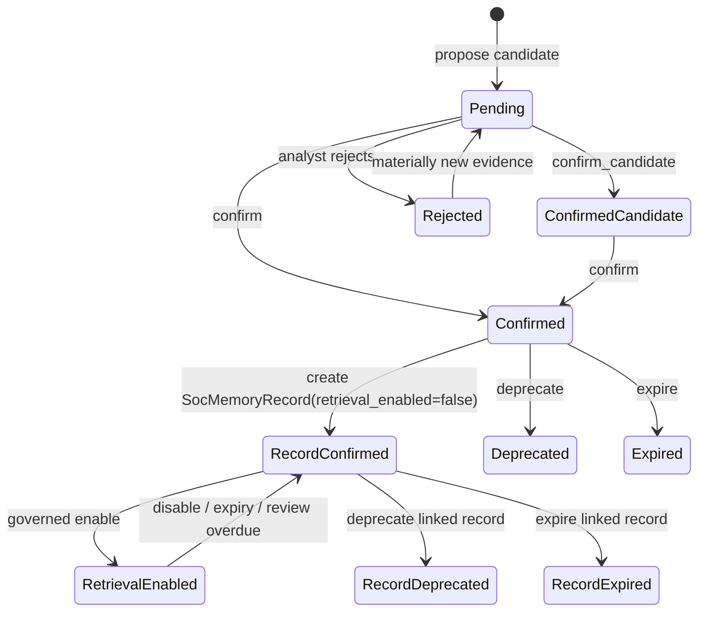

# SOC Memory Tracking

> Updated: 2026-08-12
>
> 目的：定义 SOC Agent 后续如何沉淀 topic / detection / scenario 级经验，并把 SOC TUI、Kafka daemon、ReviewQueue、Lead Agent 和 domain triage 中的重要结论转成可审计、可确认、可回滚的业务记忆。

## 1. 当前决策

SOC memory 先做 **DB-first operational memory store**，wiki/OKF 只作为后期展示、人工审阅和迁移导出的 projection。

```text
PostgreSQL = source of truth
Wiki / OKF = read model / review projection / portable export
```

原因：

- 生产研判必须依赖结构化 DB、状态机、权限、审计和回滚。
- wiki/OKF 适合人类浏览、知识整理、跨工具迁移，但不适合作为生产判断的主写入源。
- 如果 DB 和 wiki 双主写，会出现版本冲突、自然语言修改无法校验、LLM 自动编辑污染生产判断等问题。

因此当前实现顺序是：

```text
Typed memory DB contract
  -> SocMemoryService
  -> Candidate review workflow / confirmed-memory boundary
  -> Retrieval policy
  -> TUI/Web/Kafka/domain candidate write
  -> Prompt/Lead Agent bounded injection
  -> Wiki/OKF export projection later
```

当前实现进度：`SocMemoryCandidate` DB/API/CLI/Web/TUI/Lead Agent visibility 已完成；`SocMemoryService.review_candidate()` 已支持 `confirm_candidate`、`confirm`、`reject`、`deprecate`、`expire`；`confirm` 会创建 `SocMemoryRecord(status=confirmed, retrieval_enabled=false)`。所有单条工作流来源现在先经过 `MemoryAdmissionService`：只有明确人工提升/采纳、足够理由和可复用 facet 同时成立才建立 `pending_review` candidate，其余保留为 `observed_only`，避免每天一万条告警制造候选噪声。`SocMemoryService.find_relevant_records()` 已支持 governed activation、完整 eligible corpus 多 lane 召回、Retrieval v2 强锚点、score、match reason、token budget、replay diff 和 `InvestigationContext.relevant_memories`。固定 Runtime 在 LLM 调用前，通过 `ConfirmedMemoryAnalysisRequestEnricher` 查询同一 service，并把命中的受治理记录投影为 `M-*` context。普通 Memory 文本仍不是 `E-*` 当前告警事实，也没有可执行权限；只有审核人在确认时显式附加的 `SocMemoryDecisionDirective`，通过完整检索与治理条件后，才可在 post-Runtime 层形成带 before/after 的有效研判变更。Memory 永不直接授权动作。

PingAn 的完整 same-class、模式候选、适用范围、命中改判、最终结果反馈、健康度和安全失效设计见
`pingan-soc-memory-design.md`。实现采用通用 Memory Kernel + `PingAnSocMemoryProfile`，不把平安字段写入
通用 Runtime。

## 2. 不是四维硬主键

`rule_code`、`topic`、`detection_key`、`scenario_signature` 都不能被设计成“必须全等命中”的联合主键。任何一个维度在不同公司、不同厂商、不同检测场景下都可能缺失、别名不同或粒度不同。

正确模型是：

```text
Typed Memory Record
  + Facets
  + Evidence Refs
  + Status Lifecycle
  + Retrieval Policy
```

也就是说，memory 是 typed record；topic、detection、scenario、vendor alias、entity、asset 等都是 facets，用于召回、打分、解释和审计。

## 3. Typed Memory Record

推荐核心结构：

```json
{
  "memory_id": "MEM-...",
  "version": 3,
  "memory_type": "procedure | detection_lesson | environment_fact | negative_memory | case_memory",
  "status": "confirmed | deprecated | expired",
  "retrieval_enabled": false,
  "content": "APT 方向冲突时，优先 raw message、五元组和资产归属重建攻击方向。",
  "facets": {
    "scope": ["soc", "defense"],
    "topics": ["apt_direction_reconstruction"],
    "detection": {
      "canonical_key": "apt:direction_conflict",
      "vendor_aliases": {
        "pingan.rule_code": "APT-2026494",
        "sigma.rule_id": null,
        "splunk.analytic_id": null
      }
    },
    "scenario": {
      "source_type": "apt",
      "direction_conflict": true,
      "asset_role": "internal_target"
    },
    "entities": {
      "ip": [],
      "user": [],
      "host": []
    },
    "environment": {
      "tenant_id": "default",
      "asset_zone": null,
      "business_unit": null
    }
  },
  "evidence_refs": [
    {"type": "run", "id": "RUN-..."},
    {"type": "review_item", "id": "REV-..."},
    {"type": "investigation_evidence", "id": "EVD-..."}
  ],
  "validity": {
    "valid_from": "2026-07-06T00:00:00Z",
    "valid_until": null
  },
  "confidence": 0.82,
  "hit_count": 12,
  "last_used_at": null,
  "content_hash": "sha256:...",
  "facets_hash": "sha256:..."
}
```

字段原则：

- `memory_type` 决定用途和注入边界。
- candidate `status` 决定评审阶段；record `status` + `retrieval_enabled` + retrieval policy 共同决定是否能影响后续判断。
- `facets` 用于检索，不是硬主键。
- `vendor_aliases` 是可选字段；平安 `rule_code`、EDR `signature_id`、SIEM `analytic_id` 都只是 alias。
- `entities` 默认作为 evidence / query dimension，不作为长期全局记忆主粒度。
- `evidence_refs` 必须能追溯到 run、review、tool result、分析师纠正或外部文档。

## 4. Memory Types

| Type | 用途 | 是否可默认注入 | 示例 |
|---|---|---|---|
| `procedure` | 研判方法 / SOP | confirmed + retrieval policy 允许后可注入 | “APT 方向冲突优先 raw message + 五元组重建” |
| `detection_lesson` | 检测规则/场景经验 | confirmed + retrieval policy 允许后可注入 | “EDR PowerShell + Office parent + 外联公网需查进程树” |
| `benign_pattern` | 常见误报 / 授权行为模式 | confirmed、未过期且 retrieval policy 允许后可注入 | “某内部安全组执行指定扫描工具通常为授权测试” |
| `environment_fact` | 环境事实 / 授权资产 / 业务背景 | confirmed、未过期且 retrieval policy 允许后可注入 | “SecurityScan 是公司漏扫工具” |
| `identity_pattern` | 租户身份/账号模式 | confirmed、未过期且 retrieval policy 允许后可注入 | “外包账号通常使用 EX- 前缀” |
| `response_policy_hint` | 处置策略提示 | 普通内容只作建议；可选 typed directive 仍须独立治理 | “该场景优先转 BU，不直接封 IP” |
| `negative_memory` | 被驳回结论 / 禁止重复建议 | confirmed + retrieval policy 允许后用于抑制 | “不要把 X 类日志云加工字段当攻击方向事实” |
| `case_memory` | 当前 case 临时上下文 | 只在当前 case 注入 | “本工单已查过 endpoint process tree” |

### 4.1 PingAn Prompt Decomposition

`.notes/ai_soc/capabilities/pingan/source-docs/` 中的历史 Prompt 原文不能整体进入模型，也不能把所有
平安内容都叫 Memory。拆分规则如下：

| PingAn 内容 | 目标层 | 要求 |
|---|---|---|
| 通用方向、进程、HTTP 研判方法 | public Skill / `S-*` | 清除平安字段和处置规则，可跨租户复用 |
| 平安字段、采集点和 provider 语义 | PingAn Adapter / `A-*` | 只解释来源数据，不得自动忽略或转交 |
| 已评审且相对稳定的网段、内部域名、F5/CDN 语义 | versioned tenant knowledge profile / `C-*` | 有 profile/version/source/review，按当前告警有限投影；无 decision authority |
| 某规则或行为经人工复核的可复用教训 | `benign_pattern` / `detection_lesson` / `negative_memory` | 先过 Memory Admission，再候选、确认、激活 |
| 当前安全工具授权、护网参与者、变更窗口 | Governed Context Fact / `C-*` | 有事件时间、范围、有效期、来源和撤销生命周期，不写永久 Memory |
| 资产、TI、标签、会话查询 | MCP / tool result / `T-*` | 调用结果默认只是调查证据 |
| 忽略、转交、封禁/隔离条件 | Tenant Policy / Automation Policy | 独立 Decision/authorization lineage，不从 Memory 文本推断 |

方向知识的具体迁移见
`../capabilities/pingan/network-direction-knowledge-migration.md`。

## 5. Facets 不是必填项

不同来源能提供的 facets 不一样。系统必须允许缺失，而不是因为缺 `rule_code`、缺 topic、缺完整 scenario 就无法工作。

| Facet | 是否必需 | 说明 |
|---|---|---|
| `detection_key` / `rule_code` | 可选强锚点 | 有则精确匹配；没有时不阻断其他锚点 |
| `scenario_key` | 可选强锚点 | 来自 fact/model 场景，保持开放词汇 |
| `behavior_fingerprint` | 可选强锚点 | 至少两个稳定行为组件才生成，不含 alert/run ID |
| `role_entity` / `entity` | 可选强锚点 | 角色+实体可区分 attacker/victim/host/user 等适用范围 |
| `skill` / `conflict_type` | 类型相关锚点 | 更适用于 procedure / negative memory |
| `source_type` / `source_system` / `product` | 范围与排序 | 通常不能单独证明检测经验相关 |
| `environment` | 范围与排序 | 不能成为 detection lesson/benign pattern 的唯一强锚点 |

## 6. 新预警如何查记忆

新预警进入后，从同一个 canonical `LLMAnalysisRequest` 构造 `SocMemoryQuery.v2`。它不依赖
`relatedAlertList`，也不要求 `rule_code` 存在。

```json
{
  "memory_types": ["procedure", "detection_lesson", "environment_fact", "negative_memory"],
  "policy_version": "soc.memory_retrieval_policy.v2",
  "facets": {
    "source_type": ["edr"],
    "detection_key": ["edr:suspicious_powershell"],
    "scenario_key": ["powershell_execution"],
    "behavior_component": ["process:powershell.exe", "process:winword.exe"],
    "behavior_fingerprint": ["<stable-sha256>"],
    "role_entity": ["impacted_asset:endpoint-1"],
    "environment": ["prod"]
  },
  "limit": 8
}
```

召回策略：

1. 先按 tenant/status/activation/validity/review due 过滤完整 eligible corpus。
2. SQL exact-facet、text/type 和 scoped fallback 是候选召回 lane，不代表最终相关。
3. 统一 scorer 记录 overlap 和排序分数。
4. Retrieval v2 再按 memory type 做强锚点 Gate：例如 detection lesson 必须精确命中
   detection/scenario/behavior/role/entity 中至少一类；environment/source/category 不能独立放行。
5. 通过 Gate 后才应用 candidate limit、top-K 和 token budget，并投影 `M-*`。
6. 所有 match 保存 `anchor_match_reasons` 和 `matched_anchor_facets`，可与 v1 做 replay diff。

打分示意：

```text
score =
  record_confidence
  + exact_facet_weights
  + bounded_text_match
  + evidence_overlap

return only if type_appropriate_exact_anchor == true
```

只取 top K 条进入 prompt / Lead Agent bounded context，并记录 `match_reason`、`score`、`memory_id`、`version` 和 `content_hash`，用于 replay diff。这里的 top K 是**最终投影预算**，不是“只从最新 K/200 条记录中查找”。SQL repository 先通过 `soc_memory_record_facets` 对完整可用 corpus 做 exact facet 候选召回，再做 text/type/fallback 和统一评分；旧而相关的 Memory 不会被大量新但无关的记录淹没。

### 6.1 固定 Runtime 的检索边界

固定 Runtime 在 Skill 选择完成后、reference catalog 冻结和 provider journal 写入前执行一次只读检索：

```text
canonical LLMAnalysisRequest
  -> vendor-neutral SocMemoryQuery
  -> SocMemoryService.find_relevant_records()
  -> confirmed + retrieval-enabled + validity/review gates
  -> top 5 / 900-token bounded projection
  -> M-* context catalog
  -> prompt + request journal boundary
```

- Query 只使用 canonical source、detection、category、severity、scenario、entity、resolved role、
  replay-stable behavior fingerprint、conflict 和 selected-skill facets；通用 Runtime 不识别 PingAn 字段别名。
- Runtime 默认 `soc.memory_retrieval_policy.v2`。没有 type-appropriate strong anchor 时返回空结果，
  而不是用“同来源/同环境”宽泛记忆填满上下文。
- `alert_id` / `run_id` 只进入检索审计 metadata，不作为匹配 facet，避免把“同一告警 ID”误当成经验相关性。
- `M-*` 只能被 `R-*` reasoning 作为 `confirmed_memory` basis 引用，不能伪装成 `E-*` 当前告警事实。自由文本本身不能改判。
- 检索异常只产生脱敏 warning，不阻断基础告警分析；没有命中时保持原 Runtime 行为。
- Memory 命中不等于结构化决策权限。只有 record 携带审核后的 `SocMemoryDecisionDirective`，且 exact version、activation、validity、review due、minimum score 和 required facet match 全部通过，才可在 `SocAutomationService` 中改变 effective decision；原 `AnalysisRun.decision` 保持不可变。

### 6.2 Typed Decision Directive / 结构化改判指令

Memory review `confirm` 可以选择附加 `SocMemoryDecisionDirective`，但不能从自由文本自动推断：

- `effect=reinforce|override`；override 必须声明至少一个 required facet key。
- `target_verdict` 明确写出目标，不从 summary/content 猜测。
- `review_effect=preserve|require|clear` 明确说明是否保留人工复核；`unknown` 不能清除复核。
- `minimum_match_score` 和 `required_facet_keys` 约束未来适用范围。
- 冲突的多条 override 产生 `conflicted` transition，不按时间或分数随便选一条，并停止本轮 disposition/action rule selection。
- 每次作用都保存 `SocDecisionTransitionRecord.before/after`、Memory ID/version/hash、匹配分数和策略来源，支持 Memory 使用前后效果统计。
- 该 directive 只影响 effective detection decision；动作是否获准由独立的 `SocAutomationPolicy` 或人工 Approval 决定，即使没有 Memory 也可以授权。

完整边界见 `../governance/decision-disposition-action-automation.md`。

## 7. 写入来源

| 来源 | 可生成什么 | 默认状态 | 说明 |
|---|---|---|---|
| SOC TUI / ReviewQueue 人工纠正 | detection lesson / negative memory | `observed_only` 或 `pending_review` | 只有 verdict 改变、理由充分且有可复用锚点时准入 |
| ReviewQueue note | procedure / detection lesson | `observed_only` 或 `pending_review` | 普通 note 默认只观察；`promote_to_memory=true` 或采纳 Lead Agent 结论才可准入 |
| Kafka daemon / batch 稳定重复模式 | pattern lesson candidate | `pending_review` | 每条告警仅留 observation；同模式通过重复度、结论一致性和强锚点门槛后才生成一个候选 |
| 分析师明确采纳的 Lead Agent 结论 | detection lesson | `observed_only` 或 `pending_review` | LLM 输出本身不是来源；人工 acceptance + queue/thread/message + 足够详细的人工 reason 才能提候选，模型正文长度不能代替人工理由 |
| Domain triage result | topic/scenario candidate | `observed_only` 或 `pending_review` | 必须有分析师反馈、充分理由和可复用锚点 |
| InvestigationEvidence | evidence ref | 不直接是 memory | 可作为候选记忆的证据 |

### 7.1 PI-03F 来源治理边界

PI-03F 不增加第二套 memory service。人工 note/correction 等来源统一走
`SocMemoryCandidateSourceBridge -> MemoryAdmissionService -> SocMemoryService.propose_candidate()`；Kafka/批处理先由
`SocMemoryPatternService` 保存 typed aggregate observation，达到门槛后再调用同一个
`SocMemoryService.propose_candidate()`。两条路径都不能绕过 pending-review boundary。

当前已完成的 PI-03F1/F2：

- `soc chat tui --lead-agent` 中，分析师显式执行 `/accept-conclusion REUSE_REASON`，系统选取当前
  ReviewQueue 上下文内最后一条带稳定 message ID 的 assistant 消息。
- CLI 可通过 `soc review note --lead-agent-thread-id ... --lead-agent-message-id ...
  --acceptance-reason ...` 记录同类人工采纳。
- source type 仍为 `review_note`，因为权威来源是分析师的采纳动作；`origin`、surface、queue、run、alert、
  thread、message 和 acceptance reason 用于区分与追溯。
- 结果始终是 `pending_review`；不会自动 confirm、启用 retrieval、修改 verdict、关闭 ReviewQueue 或执行动作。
- 非 `--lead-agent` TUI 不暴露该命令。CLI/TUI 保存分析师声明并由当前 stream 捕获的 lineage，不冒充
  server-side message verification。
- authenticated Web/Gateway command 只接收 queue/thread/message/reason；thread ownership、
  `agent_name=soc-triage` 和当前 checkpoint branch 由服务端核验，assistant 正文不由客户端提交。只有最后
  一条可见、非 summary、无 tool call 的稳定 assistant message 可被采纳；服务端保留 checkpoint ID 与
  text SHA-256，并拒绝 closed ReviewQueue 上的新候选。
- Web 从 ReviewQueue 打开对话时只提交 queue identity hint。Gateway 对 owner-owned DeerFlow thread 写入
  immutable queue/run/alert binding，每轮通过 `SocReviewService` 重建 bounded artifact；profile middleware
  只在 model request 临时注入，并把 exact context hash/lineage 写入 assistant message provenance。采纳必须
  同时匹配 route queue、thread binding 与 message provenance，仍只生成 `pending_review`。首次采纳改变当前
  InvestigationContext，因此幂等 retry 复用已保存 snapshot hash，不重算 post-mutation current hash。

PI-03F3 已完成 Kafka/批处理来源，冻结规则如下：

- 每条完成的 Runtime 结果只写 `MemoryPatternObservation`，单条 alert/run/finding/offset 不能形成候选。
- generic fallback 从 primary scenario、canonical detection key、behavior、category 中选择最强可用维度；
  `rule_code` 不是必填项，也不在通用 Kernel 规定跨厂商联合硬 key。Tenant Profile 可从 canonical facets
  定义版本化 compound cohort；PingAn v2 用 detection + behavior 防止同 rule 的相反结论互相覆盖。
- cohort 严格隔离 tenant、environment 和 `simulation|operational` data class，并按 canonical
  timezone-aware `AlertInput.event.event_time` 落入固定 UTC window。缺失或 naive event time 时跳过聚合，
  不使用 `run.started_at` 伪造历史窗口，也不猜租户时区。
- policy `soc.memory_pattern_aggregation.v3` 默认 window=24h、minimum support=5、minimum distinct
  sources=5、minimum conclusive support=5、risk/benign consistency >=80%，并要求至少一个与候选类型对应的
  consensus strong retrieval anchor。
- 每条 v3 observation 保存 bounded lesson snapshot，而不是创建 Memory：verdict/risk class、review/evidence
  state、summary/reason/recommendation、primary scenario/stage 和 direction。低支持、冲突、未决过多或弱锚点
  cohort 只保留 observation 与 reason codes，不进入专家队列。
- 通过全部门槛后只通过既有 `SocMemoryService.propose_candidate()` 创建一个 frozen `pending_review`
  pattern lesson。候选必须总结适用范围、结论分布、一致率、代表性理由和例外，不得复述单个 alert。后续
  observation 只进入 replay diff；自动更新和自动 supersession 均禁止，supersession 固定 `manual_only`。
- lesson fingerprint 由 policy/lineage、dominant risk class 和 consensus strong anchors 构成，不包含 fixed
  window。后续窗口重复得到相同经验时只作为 reinforcement observation 并复用既有候选，不新增专家任务；
  风险类别或强锚点范围实质改变时才形成新候选，且不会自动覆盖旧 Memory。
- evidence-set hash、observation IDs、source IDs、policy/window/scope/cohort quality 均冻结进 candidate metadata；
  `soc memory patterns list|replay` 只读检查 cohort 和快照完整性。
- recurrence 不证明 benign/malicious、授权、攻击影响或处置动作，不能改变 Runtime decision、确认记忆、
  启用 retrieval 或执行 action。Kafka/batch sidecar 默认关闭，聚合失败不阻断基础分析。
- `SocMemoryProfileRegistry` 在 composition root 选择 tenant/source profile。PingAn profile 只消费 canonical
  Adapter 输出：detection key 与 behavior fingerprint 同时存在时形成 compound cohort；detection-only
  只能形成 rule-context，behavior-only 保留为 ruleless pattern，category-only 不形成 PingAn cohort；
  同 upstream event/input occurrence 不重复增加 support。
- 候选和确认记录可携带 `SocMemoryApplicabilitySpec`。Retrieval 在打分/强锚点之后独立核对 profile/version、
  required/optional/excluded facets；只有 `applicable` 才允许 typed directive 参与有效决策。受 Profile
  限定的 `partial/context-only` match 可以作为明确降权的 LLM 背景，但 Automation 必须拒绝其 directive。

## 8. 状态机



注入规则：

- `confirmed` record 不会默认注入；只有 `retrieval_enabled=true`、未过期、未超过 review due 且通过 `SocMemoryService.find_relevant_records()` 命中的 record，才可进入 `InvestigationContext.relevant_memories` 或固定 Runtime 的 `M-*` bounded context。若携带 typed directive，还必须通过本节额外 match gate 才能影响 effective decision。
- 每次实际投影保存 `SocMemoryUseRecord`；人工纠正或外部处置结果保存 `SocMemoryFeedbackEvent`，并按
  Memory version 更新 `SocMemoryHealthRecord`。高可信风险真值若反驳 active benign directive，会立即关闭
  retrieval 并建立 `SocMemoryRevisionProposal`；其他矛盾进入 watch/review，不原地篡改旧记录。
- `confirmed_candidate` 默认不全局注入；可以在当前 TUI/correction 会话内局部引用。
- `pending_review` 不注入，只展示给分析师确认。
- `rejected` 不注入，并用于抑制重复错误建议。
- `deprecated` 不注入，但保留审计和历史解释。

## 9. DB 与 Wiki/OKF 一致性

当前阶段不实现 wiki/OKF 运行时写入。后期如果要做，必须遵守单主原则：

```text
SocMemoryService -> PostgreSQL -> memory_events -> exporter -> wiki/OKF
```

规则：

- PostgreSQL 是唯一 source of truth。
- wiki/OKF 是从 DB 导出的 read model，不参与生产推理主链路。
- 自动同步方向只有 DB -> wiki/OKF。
- 人工编辑 wiki 后，不能直接覆盖 DB；只能生成 `SocMemoryChangeProposal`，经 review 后通过 `SocMemoryService.apply_change()` 写回 DB 新版本。
- 每个 wiki 页面 frontmatter 必须包含 `memory_id`、`version`、`status`、`content_hash`、`facets_hash`、`db_updated_at`。
- `soc memory reconcile` 后期用于检查 DB/wiki 缺失、版本不一致、hash 不一致、status 不一致和未导入变更。

后期命令草案：

```bash
soc memory export --format okf
soc memory diff-wiki
soc memory import-proposals
soc memory reconcile
```

## 10. 实现路线

### Slice A：Memory Tracking Contract

- 已新增 `SocMemoryCandidate`、`SocMemoryRecord`、review 状态枚举、`SocMemoryQuery` 和 retrieval result。
- 定义 typed record、facets、hash、status lifecycle 和 retrieval result。
- 先不接自动写入，只固定 schema、hash、去重和测试。

### Slice B：SocMemoryService MVP

- 已新增 `SocMemoryService.propose_candidate()` 和 `review_candidate()`。
- 已新增 repository protocol：保存候选、查询 pending、确认、驳回、标记 deprecated/expired，以及保存/查询 confirmed record。
- 所有入口只能调用 service，不能直接写 memory repository。

### Slice C：Memory Retrieval MVP

- 已新增 `SocMemoryService.find_relevant_records(SocMemoryQuery)`。
- 已支持 type/status/tenant/facets/text/evidence refs 多路召回、score、match reason、token budget、hash/version 和 skipped counters。
- 已接 CLI `soc memory search`、Gateway `/api/soc/memory/search`、ReviewQueue context/Web/TUI/Lead Agent bounded artifact 可见化。
- 已接固定 Runtime pre-LLM enricher；只允许 retrieval policy 通过、`retrieval_enabled=true`、confirmed 且未过期/未超 review due 的 top-K 结果以 `M-*` 进入 bounded prompt。
- SQL repository 已增加 normalized facet index；候选检索先跨完整 corpus 找相关记录，再按 `candidate_limit` 限制后续精排，不使用“最新 200 条”作为召回边界。
- 2026-08-11 使用告警 `1965802` 完成人工确认、候选确认、检索启用和真实模型 replay：`RUN-C00EA5ED8A72` 的 context catalog 包含 `MEM-94B04755582D@v4`，模型以 `confirmed_memory` basis 引用它；该旧 record 没有 typed directive，因此只证明上下文引用，不应再被解释为“所有 Memory 都不能改判”。

### Slice C2：Governed Decision Impact / 受治理改判

- 已增加 `SocMemoryDecisionDirective`，只能由审核人在 confirm 命令/API 中显式提交。
- 已增加 post-Runtime `SocDecisionTransitionRecord`，保存基础与有效研判的 before/after 和全部 contributor lineage。
- 已覆盖 reinforce、override、冲突、过期/过审/版本不符、分数不足和 required-facet 缺失边界。
- Memory 不产生动作权限；无 Memory 的当前告警也可由独立的、服务端版本化策略获得 action authorization。

### Slice D：TUI / ReviewQueue Memory Candidate

- `soc correct`、`soc review tui`、ReviewQueue Web correction 产生 memory candidate。
- 候选内容来自 structured correction、domain finding、evidence refs 和 analyst reason。
- 先写 `pending_review`，人工确认后才进入 `confirmed`。
- PI-03F1 已增加显式 Lead Agent conclusion acceptance；它复用 review-note bridge，不自动保存模型输出。
- PI-03F2 已补 authenticated Gateway/Web 服务端 message resolution；后续 PI-01F2 又补齐 server-built
  queue context、immutable thread binding 和 exact message provenance。二者仍是独立边界：context bridge
  证明模型拿到了哪份 snapshot，acceptance 证明分析师采纳的是哪条 server-owned assistant message。

### Slice E：Kafka Daemon Memory Candidate

- **Done / PI-03F3**：daemon 和 internal batch 只在显式配置时启用同一
  `SocMemoryPatternService`；默认行为保持 Runtime-only。
- 每条 alert/offset 只成为 immutable observation/evidence ref。固定 UTC source-event-time window 达到
  5 support + 5 distinct sources 后，还需 5 条有效结论、>=80% 风险类别一致性和 consensus strong anchor，
  才创建一个 frozen `pending_review` pattern lesson；其他 cohort 不占用专家审核时间。
- 幂等、scope、evidence-set hash、manual-only supersession 和 read-only replay 已落地；migration 为
  `0021_memory_pattern_observations`，运维入口为 `soc memory patterns list|replay`。

### Slice F：Wiki/OKF Export Projection

- 等 DB memory store、service、retrieval 和 review workflow 稳定后再做。
- 初始只做 DB -> wiki/OKF export，不做反向 import。
- 反向 import 必须走 proposal/review。

## 11. 与当前路线关系

Memory tracking 应该加入待完成列表，但不要早于 Correlation Service 抢主线：

```text
Slice 0: PingAn SOC capability onboarding
Slice 1: Correlation Service MVP
Slice 2: Memory Tracking Contract
Slice 3: Domain Sub-Agent Contract
Slice 4: EDR/APT/HIDS/F5 MVP handlers
Slice 5: Main SOC Agent Orchestrator MVP
Slice 6: Web/TUI 可见化
Slice 7: Demo/Eval Script
```

原因：

- Correlation 先解决“这条告警和历史有什么关系”。
- Memory Tracking Contract 再固定“哪些结论可以变成长期经验”。
- Domain Sub-Agent 和后续 TUI/Kafka workflow 才能按同一套 typed memory/facets 产出候选记忆。

## 12. 第一批建议追踪的 Topics

| Topic | 来源 | 初始用途 |
|---|---|---|
| `apt_direction_reconstruction` | APT / 天眼 / Zeus | 修复方向错判、攻击/受害角色冲突 |
| `edr_process_tree_triage` | EDR | 记录进程树研判模式和常见误报 |
| `asset_ownership_resolution` | CMDB / asset.locate | 记录资产归属、处置对象选择经验 |
| `f5_suppression_target` | F5/WAF | 记录抑制目标是 IP、URI、rule 还是组合 |
| `hids_host_behavior_triage` | HIDS | 记录主机行为规则的常见误报/真阳性模式 |
| `negative_memory` | TUI/Web correction | 记录已驳回的错误结论，防止反复提示 |
