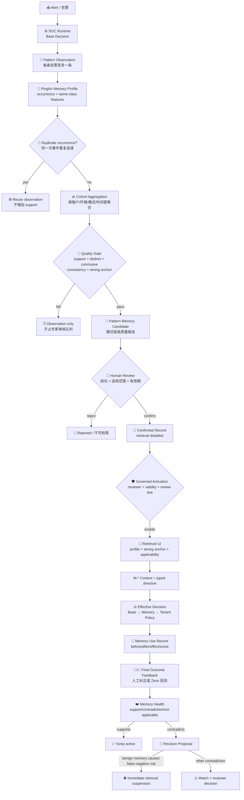

# PingAn SOC Memory Design

> Status: Implemented MVP / 2026-08-16
>
> Purpose: define how PingAn alert experience becomes a small number of high-quality,
> reviewable memories that can materially change later alert decisions without placing
> PingAn semantics inside the generic SOC Runtime.

## 0. 中文设计结论

这套 Memory 不是“把每条告警总结后存进数据库”，而是一个受治理的经验决策系统：

1. 每条告警最多留下一个不可变 `Observation`，重复投递不增加经验支持度。
2. 平安 Profile 负责判断“是否同一次事件、是否同一类经验、适用范围是什么”；通用 Runtime 只依赖
   标准协议，因此以后接其他公司时新增 Profile，不修改通用内核。
3. 只有重复、结论明确、相互一致且存在强锚点的 cohort 才生成一条候选，运营专家审核的是“模式”，
   不是每天上万条告警。
4. `detection_key` 只负责识别规则大类；Profile v3 再从 canonical `rule_name` 生成
   `detection_signature`。只有 `detection_key + detection_signature + strong behavior_fingerprint`
   才定义可改判的同类行为，rule-only/weak-only Memory 永远只是背景参考。
5. 告警处理完成后，只更新本次真正用过的 Memory：一致则增加支持，冲突则记录反证、更新健康度并
   生成修订任务；高可信风险真值反驳 benign Memory 时立即停止检索，避免错误批量扩散。
6. 所有 Base/Memory/Tenant/Effective Decision、Memory 使用、人工反馈、健康度和修订均可回放。DB 是
   唯一事实源，Wiki/OKF 后期只负责可读展示。

## 1. Decision

PingAn Memory uses a **generic Memory Kernel + tenant profile** design:

- The generic kernel owns contracts, lifecycle, persistence, retrieval, audit, decision
  lineage, feedback, health, and revision proposals.
- `PingAnSocMemoryProfile` owns how a PingAn canonical alert is classified as the same
  operational occurrence or the same reusable alert class.
- Every completed alert may become an immutable observation. It does **not** become one
  Memory or one expert-review task.
- A review candidate is created only when a repeated cohort passes recurrence,
  conclusion-quality, consistency, and strong-anchor gates.
- A reviewer confirms the reusable conclusion and its exact applicability. Only an
  explicitly activated record can be retrieved.
- A confirmed record can change a later effective verdict only through a typed,
  reviewer-authored `SocMemoryDecisionDirective`; prose alone has no deterministic
  authority.
- Analyst or external-system final outcomes are attached to the exact Memory uses.
  Contradictions create append-only feedback and a revision proposal. A high-trust risk
  outcome that contradicts an active benign directive immediately suspends retrieval.
- DB is the source of truth. Wiki/OKF is a future read/review projection, never a second
  writable memory store.

This design deliberately does not use `relatedAlertList` as trusted Memory and does not
require every vendor to provide `rule_code`.

## 2. Product Goal

The operational goal is not "store everything the model said". It is:

> When a new alert is demonstrably in the reviewed scope of an existing lesson, use that
> lesson as a decisive input; when later human truth contradicts it, preserve the before/
> after lineage and stop or revise the lesson before it causes repeated mistakes.

The primary users are:

| User | Job |
|---|---|
| SOC analyst | Confirm one reusable pattern instead of reviewing every repeated alert |
| Memory reviewer | Define the conclusion, applicability, validity, and review period |
| SOC operator | Inspect which Memory affected which alert and whether it remains healthy |
| Architect/developer | Add another tenant profile without changing generic Runtime semantics |

## 3. End-to-End Flow



## 4. Ownership Boundary

| Concern | Generic kernel owner | PingAn owner |
|---|---|---|
| Candidate/record/retrieval contracts | `soc_agent.contracts` | None |
| Lifecycle and authorization | `SocMemoryService` | None |
| Observation aggregation | `SocMemoryPatternService` | Provides profile callbacks |
| Persistence and migration | `soc_agent.db` | None |
| Retrieval score and strong-anchor gate | `soc_agent.memory.scoring` | Supplies canonical facets/profile identity |
| Same occurrence | Profile protocol | `PingAnSocMemoryProfile.build_occurrence_key()` |
| Same reusable class | Profile protocol | detection + behavior compound；缺任一项时按受限语义降级 |
| Applicability scope | Generic typed contract | PingAn profile builds reviewed candidate scope |
| Effective decision | `SocAutomationService` | PingAn tenant policy remains a separate later stage |
| Outcome feedback and health | `SocMemoryEvolutionService` | Zeus feedback enters through canonical correction/disposition ingress |

The profile consumes only canonical fields produced by the PingAn Adapter. It does not
read raw aliases such as a vendor-specific `src_*` field, and generic Runtime never imports
PingAn parsing or policy code.

### 4.1 Isolated 5+1 Lifecycle Validation

`validation/compact_zeus/memory/simulate_pattern_memory_lifecycle.py` provides the
canonical wiring smoke:

```text
5 distinct simulation occurrences
  -> 1 pending pattern candidate
  -> simulated human confirmation + retrieval activation
  -> 1 held-out exact match
  -> M-* projection
  -> persisted Base -> Memory -> Effective transition
```

It uses the production service boundaries but injects reviewed fixture outcomes and never
calls an LLM or Provider. Its SQLite records remain `simulation`/`mocked` evidence and do
not establish pattern accuracy, production validity, or action authority. A real quality
claim still requires distinct operational alerts and independent analyst labels.

## 5. What Counts As The Same Thing

Three identities must not be confused:

### 5.1 Same transport delivery

`idempotency_key` prevents the exact Kafka/batch command from being processed twice.

### 5.2 Same operational occurrence

`occurrence_key` prevents retries or duplicate Zeus deliveries from increasing pattern
support. PingAn priority is:

1. canonical upstream event ID;
2. exact Runtime `input_hash`;
3. a bounded five-minute canonical entity/role scope;
4. run/alert lineage fallback.

### 5.3 Same reusable alert class

The PingAn profile v3 selects one stable cohort signature:

1. when available, hash canonical `detection_key + detection_signature + behavior_fingerprint`
   into a `compound` cohort; the original facets remain separately auditable;
2. detection only creates a rule-level cohort that can describe recurring outcomes but
   can never own a future deterministic verdict;
3. behavior only creates a pattern-level cohort for vendors/alerts without stable rule
   identity and may become decision-eligible after review;
4. otherwise the alert is observation-ineligible for PingAn Memory.

An `alert_id` identifies one occurrence and must never be synthesized into
`detection_key`. Using `zeus:alert:{alert_id}` would make every alert its own class and
silently disable reuse.

`detection_signature` is a deterministic hash of source/product and the whitespace/case-normalized
canonical rule name. It is deliberately separate from `detection_key`: PingAn data shows that one
ZEUS `rule_code` may contain many detector names. Exact rule-name normalization is conservative;
future governed aliasing may merge reviewed cosmetic aliases, but v3 never guesses that two names
are equivalent.

The current `behavior_fingerprint` is deterministic and pre-LLM. It reuses canonical
facts already produced by SOC Runtime and hashes a versioned,
sorted set of canonical behavior components such as deterministic scenario hypotheses,
process/parent names, protocol, HTTP method, MITRE techniques and typed behavior mentions.
IP, UM/account and alert/run IDs are deliberately excluded so the same behavior may match
across changing entities. Profile v3 classifies protocol, HTTP method and generic
`scenario:web_attack` as weak components; process, specific scenario, MITRE technique and typed
behavior components are strong. A decisive compound requires exact detection key, detector
signature, behavior fingerprint, environment and `behavior_strength=strong`. When the exact
detection/signature/environment match but the full fingerprint differs, Retrieval may expose the
record only as explicit `context-only` LLM context when at least one reviewed strong behavior
component overlaps; it cannot apply its directive. Protocol-only similarity is not returned.
Evaluate component stability on a held-out PingAn corpus and bump the feature schema whenever the
component policy changes.

`category`, `severity`, source type, or a model-only scenario label can help rank or
explain a match, but they cannot alone create a decisive PingAn lesson. This avoids both
extremes: a brittle four-dimensional key and an unsafe "all NDR alerts are alike" key.

Environment is not part of the reusable class identity, but it is a mandatory
applicability boundary. A `prd` lesson therefore cannot affect `stg`, and vice versa.
Future decisive PingAn matches require the exact reviewed environment plus every reviewed
required facet. For a decisive compound record this means exact `detection_key`,
`detection_signature`, `behavior_fingerprint`, `behavior_strength` and environment; matching
`detection_key` alone is never enough to copy the old verdict.

The same IP may appear in both generic `entity=ip:*` and typed `role_entity=attacker|victim|...`.
PingAn profile projection removes only that duplicate generic IP facet and retains the typed role.
This prevents duplicate relevance weight; IP remains optional and never blocks cross-IP reuse.

Here `environment` means the server-owned operating lane such as `dev`, `stg` or `prd`.
It is not inferred from Kafka topic names, IP ranges, or arbitrary vendor fields. Pattern
observation and Runtime retrieval must receive the same configured lane; a missing or
different lane fails applicability rather than reusing a PRD conclusion in STG. Persisted
composition binds this value before Memory profile selection from the explicit batch/daemon
setting or the consistent `SOC_MEMORY_ENVIRONMENT`, `SOC_TENANT_POLICY_ENVIRONMENT` and
`SOC_AUTOMATION_ENVIRONMENT` server configuration. Conflicting configured values fail startup.
Business-system, asset class, BU, network zone and asset-environment applicability are a
separate deferred improvement because they require a stable CMDB/canonical taxonomy and
human labels; see
`../../archive/ai_soc/deferred/asset-business-context-memory-applicability.md`.

## 6. Candidate Quality Gate

The default `soc.memory_pattern_aggregation.v3` policy is:

| Gate | Default | Why |
|---|---:|---|
| Window | 24 hours | Bound one recurrence cohort |
| Observations | >= 5 | One alert cannot become a pattern |
| Distinct sources | >= 5 | Retries do not manufacture support |
| Conclusive outcomes | >= 5 | Unknown results do not form a lesson |
| Risk/benign consistency | >= 80% | Conflicted cohorts remain observations |
| Strong anchor | required | A broad category cannot admit a reusable lesson |

Three clocks must not be conflated:

- **aggregation window**: 24 hours by default; it groups repeated observations into one
  review candidate and is not the Memory lifetime;
- **record validity**: generated pattern candidates currently default to 90 days, which
  covers the requested one-to-two-month operational lifetime;
- **retrieval activation/review**: the reviewer explicitly chooses an activation expiry
  and review interval. Activation cannot outlive record validity; a practical PingAn
  starting policy is 60 days active with review due every 30 days.

The generated candidate contains:

- whether the dominant lesson is risk or benign;
- verdict distribution and consistency;
- exact applicability facets and profile version;
- representative summaries/reasons;
- minority and unresolved counts;
- evidence and source lineage;
- explicit review boundaries.

An equivalent lesson in a later window is reinforcement, not a new candidate. A changed
risk class or strong-anchor scope creates a new reviewable lesson and never silently
overwrites the old record.

## 7. Human Review And Activation

Candidate confirmation is one explicit product action. The reviewer may:

- edit the final summary/content;
- keep the profile-produced applicability, or narrow it by promoting an existing optional
  candidate facet to required; the service rejects removal of strong anchors, larger value
  sets, changed profile/schema versions or widened context-only fallback;
- confirm the technical verdict;
- choose whether exact future matches may use it as a directive;
- choose whether a match may clear Runtime review;
- activate retrieval with `valid_until` and `review_after_days`.

Convenience input `apply_to_future_matches=true` is materialized into a typed
`SocMemoryDecisionDirective`. The server never derives this directive from Memory prose.
It is rejected for detection-only/rule-context candidates. A reviewer can still confirm
and activate those records as useful `M-*` background without granting decision authority.

```text
Candidate confirmed
  -> SocMemoryRecord(retrieval_enabled=false)
  -> optional reviewed directive
  -> optional governed activation
  -> eligible for Retrieval v2
```

Roles:

- `soc_memory_reviewer|soc_admin`: confirm and enable/disable retrieval;
- `soc_memory_safety_monitor`: disable only, never enable;
- model/Skill/MCP/tenant adapter: no Memory confirmation or activation authority.

## 8. Retrieval And Decision Semantics

A record reaches the model and decision layer only when all gates pass:

1. confirmed status;
2. retrieval explicitly enabled;
3. record validity and activation validity current;
4. review due date not overdue;
5. tenant scope matches;
6. query profile/version/feature schema matches;
7. exact reviewed environment matches;
8. Retrieval v2 strong anchor matches;
9. typed applicability required facets match and exclusions do not match;
10. score and token budget pass.

The result is projected as `M-*`, never as current-alert `E-*` evidence. One additional,
strictly bounded lane exists for a compound PingAn record: same detection key/signature,
environment and strong behavior classification plus an overlapping
`behavior_component_strong` may be returned with
`status=partial, context_only_allowed=true`. Runtime labels that item “仅作相似模式参考”,
prioritizes exact matches ahead of it, counts it separately, and Automation rejects its
decision directive. This preserves useful prior experience without turning fuzzy similarity
into a deterministic verdict.

```text
Base Decision (immutable)
  -> Memory Decision (optional reviewed directive)
  -> PingAn Tenant Policy Decision (independent)
  -> Effective Decision
  -> Action authorization/execution (independent policy)
```

A Memory directive may change a verdict and review requirement. It never grants network
blocking, endpoint isolation, suppression, or any other side-effect authority. Those
actions can still be authorized without Memory by the separate automation policy.

## 9. Feedback, Health, And Revision

Every projected `M-*` creates one idempotent `SocMemoryUseRecord` with:

- exact Memory ID/version/content/facet hashes;
- run/alert/tenant/context reference;
- retrieval policy, score, matched facets, and applicability report;
- base and effective verdict;
- context-only/reinforced/overridden/conflicted effect;
- decision transition ID.

When an analyst correction or trusted Zeus final disposition arrives, it becomes one
`SocMemoryFeedbackEvent` for every Memory actually used by that run. The service compares
the final technical verdict with the reviewed directive:

| Result | Effect |
|---|---|
| Same risk class | `supports`; increment support health |
| Opposite risk class | `contradicts`; create revision proposal |
| Memory had no directive | `unknown`; context use remains auditable |
| Scope later proven inapplicable | `not_applicable`; retained for scope review |

Safety rule: if an active benign/false-positive Memory is followed by a high-trust risk
outcome, retrieval is immediately disabled by `soc-memory-safety-monitor`. The old record
is never edited in place. Reviewers inspect the pending proposal and then narrow scope,
create a new version, deprecate it, or reject the feedback.

Reviewing a revision proposal changes only the proposal from `pending_review` to
`accepted|rejected`. Even `accepted` does not rewrite or reactivate the old Memory. The
reviewer must deliberately create/review a replacement version or use the existing
governed activation/deprecation boundary. This prevents one click on a contradiction task
from silently restoring an unsafe lesson.

This is the concrete answer to "how does final analyst disposition adjust Memory": it
does not silently rewrite a learned rule; it updates measured health, stops a dangerous
record when required, and opens an auditable revision path.

## 10. Data Model

| Object/table | Role | Mutable? |
|---|---|---|
| `soc_memory_pattern_observations` | Per-occurrence source and bounded conclusion snapshot | Append-only |
| `soc_memory_candidates` | One quality-gated pattern lesson awaiting review | State transition only |
| `soc_memory_records` | Confirmed versioned lesson, applicability, directive, activation | CAS/versioned |
| `soc_memory_record_facets` | Exact retrieval index | Rebuilt with record version |
| `soc_memory_uses` | Exact use and decision effect | Append-only |
| `soc_memory_feedback` | Final-outcome support/contradiction | Append-only |
| `soc_memory_health` | Derived current health by Memory version | Optimistic CAS |
| `soc_memory_revision_proposals` | Review task for material contradiction | Reviewed state |
| `soc_decision_transitions` | Base/Memory/Tenant/Effective before-after lineage | Append-only |

Migration head: `0025_memory_evolution`.

### 10.1 Implementation map

| Boundary | Implementation |
|---|---|
| Generic profile protocol/registry | `backend/soc_agent/memory/profiles.py` |
| PingAn same-occurrence/same-class/applicability rules | `backend/soc_agent/integrations/pingan/memory/profile.py` |
| Observation and cohort aggregation | `backend/soc_agent/core/memory_patterns.py` |
| Admission/review/activation/retrieval | `backend/soc_agent/core/service.py`, `backend/soc_agent/memory/` |
| Use/feedback/health/revision workflow | `backend/soc_agent/core/memory_evolution.py` |
| Application composition | `backend/soc_agent/application/memory.py` |
| SQL persistence and migration | `backend/soc_agent/db/repositories.py`, `backend/soc_agent/db/migrations/versions/0025_pingan_memory_evolution.py` |
| API/CLI | `backend/app/gateway/routers/soc_memory.py`, `backend/soc_agent/cli.py` |

## 11. Interfaces

### CLI

```bash
# Explicitly promote a single analyst correction when it is genuinely reusable
soc correct RUN_ID --verdict false_positive --reason "..." --promote-to-memory

# Review one pattern candidate, attach a future-match decision, and activate it
soc memory review CANDIDATE_ID --decision confirm --reason "..." \
  --apply-to-future-matches --confirmed-verdict false_positive \
  --clear-review-on-match --activate-retrieval \
  --activation-valid-until 2026-09-15T00:00:00+08:00 \
  --activation-review-after-days 7

# Optional: narrow the reviewed scope with a complete applicability JSON contract.
# The file may promote a candidate optional facet (for example source_type) to required,
# but may not widen the Profile-produced scope.
soc memory review CANDIDATE_ID --decision confirm --reason "..." \
  --record-applicability reviewed-applicability.json

# Inspect exact use, feedback, health, and revision lineage
soc memory records lineage MEMORY_ID

# Inspect contradiction work and resolve one proposal
soc memory revisions list --status pending_review
soc memory revisions review PROPOSAL_ID --decision accept --reason "..." \
  --idempotency-key REVISION_REVIEW_KEY
```

### Gateway API

- `POST /api/soc/memory/candidates/{candidate_id}/review`
- `POST /api/soc/memory/records/{memory_id}/retrieval`
- `POST /api/soc/memory/search`
- `GET /api/soc/memory/records/{memory_id}/lineage`
- `GET /api/soc/memory/revisions`
- `GET /api/soc/memory/revisions/{proposal_id}`
- `POST /api/soc/memory/revisions/{proposal_id}/review`
- Review correction API accepts `promote_to_memory`; it also records feedback for any
  confirmed Memory used by the run.

All mutation surfaces call Core Services and carry actor, role, request, trace, and
idempotency context. No route writes tables directly.

## 12. Metrics And Acceptance

The module is useful only if it lowers work without hiding risk. Track:

| Metric | Desired interpretation |
|---|---|
| observations / candidate | High; proves no per-alert candidate spam |
| candidates / reviewed records | Reviewer workload and candidate quality |
| retrieval precision on held-out alerts | Whether same-class matching is correct |
| directive override accuracy | Final outcomes supporting Memory-caused changes |
| contradiction rate by record/version | Staleness or overly broad scope |
| false-negative safety suspensions | Must be visible and investigated immediately |
| `not_applicable` rate | Applicability scope quality |
| `returned_context_only_count` | Similar-pattern recall that must never become an override |
| analyst review minutes saved | Product value, not just model accuracy |
| unreviewed/overdue active records | Governance debt |

Acceptance requires a held-out, human-labeled PingAn set. In-sample fixtures prove wiring
only and cannot establish Memory precision or production quality.

## 13. Rollout

1. `observe_only`: save observations and inspect cohorts; no candidates activated.
2. `candidate_review`: reviewers inspect pattern-level candidates and tune applicability.
3. `shadow_retrieval`: inject `M-*`, record matches and hypothetical transitions.
4. `enforced_decision`: allow reviewed directives to change effective decisions; actions
   remain separately governed.
5. `feedback_guarded`: ingest trusted final outcomes, monitor health, suspend dangerous
   benign memories, and process revision proposals.

Rollback is retrieval disablement. Raw alerts, Base Decisions, uses, feedback, and prior
record versions remain available for replay.

Profile v2 records do not silently match Profile v3 queries. They remain auditable but
must be re-aggregated under the v3 feature schema and reviewed again before receiving v3
retrieval or decision authority. A migration must never infer a compound behavior scope
from an old detection-only record.

## 14. Wiki / OKF Boundary

Wiki/OKF can later display one page per confirmed Memory with frontmatter containing
`memory_id`, version, status, hashes, applicability, health, and DB timestamp. Edits in
Wiki must become change proposals and return through `SocMemoryService`; they must never
overwrite the DB directly. This preserves one source of truth while giving analysts a
human-friendly knowledge view.

## 15. Implementation Verification

The MVP is covered by repeatable local checks rather than document-only claims:

```bash
# Memory Kernel/Profile/Runtime/Review/External/API/architecture regression
backend/.venv/bin/pytest -q \
  backend/tests/test_soc_pingan_memory_profile.py \
  backend/tests/test_soc_memory_evolution.py \
  backend/tests/test_soc_memory_admission.py \
  backend/tests/test_soc_memory_patterns.py \
  backend/tests/test_soc_memory_retrieval_v2.py \
  backend/tests/test_soc_agent_memory_runtime_context.py \
  backend/tests/test_soc_mutation_uow.py \
  backend/tests/test_soc_memory_router.py \
  backend/tests/test_soc_agent_service.py \
  backend/tests/test_soc_external_disposition.py \
  backend/tests/test_soc_automation.py \
  backend/tests/test_soc_api_transport.py \
  backend/tests/architecture/test_soc_agent_boundaries.py

# Real migration chain reaches the new head
backend/.venv/bin/pytest -q \
  backend/tests/test_soc_governed_context.py::test_soc_migration_head_creates_governance_and_approval_lifecycle_schema

# Offline PingAn batch/Memory validation helpers
PYTHONPATH=.:backend backend/.venv/bin/pytest -q \
  validation/compact_zeus/memory/test_seed_confirmed_memory_from_batch.py \
  validation/compact_zeus/memory/test_compare_role_memory_batches.py \
  validation/compact_zeus/internal_batch/test_run_pingan_runtime_batch.py

# No-LLM structural comparison over the 210-alert PingAn corpus
backend/.venv/bin/python \
  validation/compact_zeus/memory/build_behavior_fingerprint_audit.py \
  --environment prd \
  --output-dir backend/.deer-flow/soc-validation/behavior-fingerprint-audit-v2
```

The 2026-08-16 local structural audit replayed 210 source alerts with zero extraction
errors and zero raw-payload mutation. Profile v3 reduced ambiguous exact cohorts from
4 to 0, context-only alert pairs from 679 to 54, weak-only context pairs from 561 to 0,
and duplicate IP facet occurrences from 283 to 0. It retained 17 recurrent cross-IP
cohorts covering 118 alerts. Twelve recurrent cohorts were structurally decision-eligible.
The corpus has no independent analyst labels, so these figures prove contract behavior,
not production precision or recall.

Current result: `194 passed` for the cross-layer Memory suite, `1 passed` for the real
migration chain, and `27 passed` for offline validation helpers. These prove wiring,
state transitions, authorization, idempotency and persistence. They do not replace the
held-out analyst labels required to claim production retrieval precision or workload
reduction.
