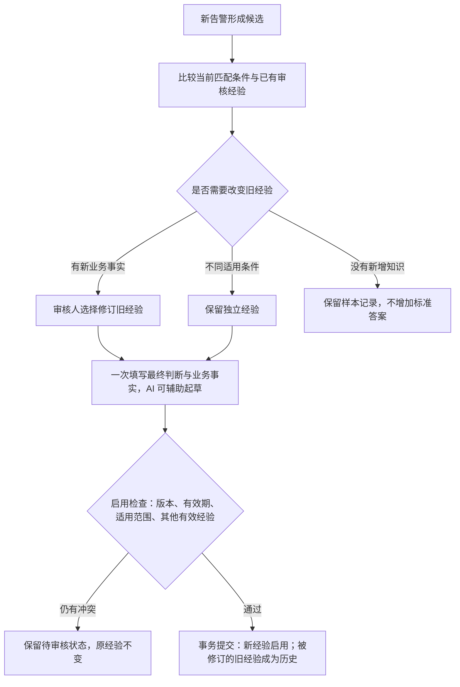
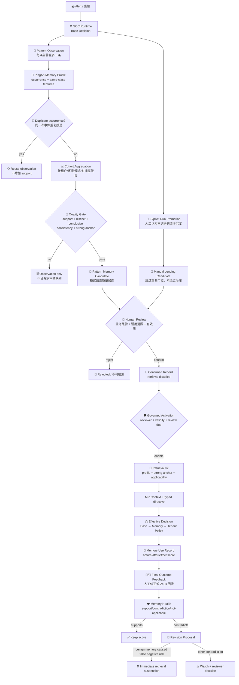

# PingAn SOC Memory Design

> Status: Implemented MVP / 2026-08-16
>
> Purpose: define how PingAn alert experience becomes a small number of high-quality,
> reviewable memories that can materially change later alert decisions without placing
> PingAn semantics inside the generic SOC Runtime.

## 0. 中文设计结论

这套 Memory 不是“把每条告警总结后存进数据库”，而是一个受治理的经验决策系统：

1. 每条告警最多留下一个不可变 `Observation`，重复投递不增加经验支持度。
2. 平安 Profile 负责判断“是否同一次事件、是否同一类经验、适用范围是什么”；通用 Runtime 只依赖
   标准协议，因此以后接其他公司时新增 Profile，不修改通用内核。
3. 只有重复、结论明确、相互一致且存在强锚点的 cohort 才生成一条候选，运营专家审核的是“模式”，
   不是每天上万条告警。
4. `detection_key` 只负责识别规则大类；PingAn Profile v7（feature schema v5）再从 canonical
   `rule_name` 生成 `detection_signature`，并从 canonical network/endpoint evidence 生成版本化
   core/detail behavior component。
   只有 `detection_key + detection_signature + strong behavior_fingerprint` 才定义可改判的同类行为，
   rule-only/weak-only Memory 永远只是背景参考。
5. 告警处理完成后，只更新本次真正用过的 Memory：一致则增加支持，冲突则记录反证、更新健康度并
   生成修订任务；高可信风险真值反驳 benign Memory 时立即停止检索，避免错误批量扩散。
6. 所有 Base/Memory/Tenant/Effective Decision、Memory 使用、人工反馈、健康度和修订均可回放。DB 是
   唯一事实源，Wiki/OKF 后期只负责可读展示。

## 1. Decision

### 审核时怎样处理新旧经验 / Governance Comparison

入口仍是 **经验中心 → 审核候选**，不增加一套审核流程。

| 发现的关系 | 运营看到什么 | 系统怎么做 |
|---|---|---|
| 相同条件、结论一致 | 原经验的业务结论 | 不再启用一份重复标准答案；有新增知识时选择修订，没有增量可放弃候选，样本记录不丢 |
| 相同或重叠条件、结论不同 | 原结论、条件差异、本次是否曾参考 | 选择“以本次审核修订这条经验”，继续填写一次最终判断与业务事实；确认时新旧原子替换 |
| 确实是不同适用范围 | 不同的机器匹配条件 | 可保留独立经验；同 Rule Code 的不同场景可以有相反结论 |
| 只有模型可疑或企业转交 | 待核对的当前判断 | 不自动认定旧经验错误，不自动停用，不把转交写成真实攻击 |

审核页面的 **与已有经验对照** 是只读查询。选择修订也不立即停用旧经验，最终确认才执行：



**范围不是只看一个指纹。** 比较 tenant、Profile/feature 版本、必需条件、排除条件、
可选条件门槛及有效期。Profile 声明哪些 facet 对单个告警是单值；只有这类条件明确互斥，
才能证明范围不同。例如两个精确行为指纹不同可区分；仅两个 IP 不同不能证明，因为一个告警
可能同时包含它们。宽范围 A 与窄范围 B 仍有交集，不能仅在正文里写“例外”就同时启用相反指令。

**实现与限制：**

- `SocMemoryService.preview_candidate_governance()` 返回旧业务结论、版本、范围关系和差异。
  `POST /api/soc/memory/candidates/{id}/governance-preview` 不写库、不调模型、不改告警。
- `review_candidate` 可携带 `replaces_memory_id + expected_replaced_version`。沿用已有
  `revision_lineage` 和 supersession，保留前后版本、hash、来源及审核审计。并发或版本过期返回 409。
  CLI `memory review` 同样接受 `--replaces-memory-id / --expected-replaced-version`，
  起草与启用都使用相同 Profile 注册表。若第三条有效经验仍与新结论冲突，替换整体回滚，不能只换掉其中一条就绕过检查。
- `set_retrieval_activation` 扫描完整有效经验集，不使用检索 Top-K 作为冲突检查。
  同精确行为范围的重复答案需补充/修订；相同范围相反答案即使仅作参考也不能再次启用；
  重叠范围的相反直接复用指令必须先消除冲突。
- 新候选的待审身份按 typed scope 合并，不把模型 benign/risk 分类放入该身份。
  同范围多条挑战继续保留 Observation、来源引用和事件，不增加同内容的待审任务；
  最近 20 条补充来源在候选 metadata 中可查。原候选正文与质量快照不被后续模型覆盖。
- AI 起草 Prompt v6 会收到有界的新旧经验对照，帮助说明补充、修正或范围差异；仍由审核人确认。
  每条告警不增加模型调用，没有新增治理理由输入框。
- 不修改 PingAn 指纹版本，不需清库或重建语料索引，不自动更改旧 Memory。
  已存在的重复或相反记录仍保留，由运营修订；Runtime 原有多指令冲突保护继续兜底。

运营主动发起修订后，旧经验暂停。若改变主意，审核页可 **取消修订并恢复旧经验**；
已放弃的最新修订也提供 **恢复旧经验**。确认原使用方式、开放期限和复查日期后，以同一事务结束
修订并重新启用旧经验。内容、匹配条件、context-only/Directive 模式均不变，不生成新标准答案。
普通 **放弃修订，保持暂停** 仍只结束修订。已过期、被替代、存在后续变更或发布冲突时不得恢复，
失败不产生半完成状态；历史 Run 和审计保持原样。审核页 **查看旧经验** 直接进入旧记录详情，
恢复成功后也进入该页，而非候选台账。
- SQLite 同事务写锁、PostgreSQL 事务 advisory lock 保证两个审核不会同时越过“尚无冲突”的检查。
  外网并发实测覆盖 SQLite；PostgreSQL 并发部署仍需数据库环境验收。所有写入方应一起升级。

**本轮审计入口：** `backend/.deer-flow/soc-validation/memory-governance-20260909/`
的 `governance-audit.json` 展示旧误报 → 相反候选被拦截 → 明确修订 → 仅新记录有效，
并保留两种屏宽的截图。它是隔离的合成业务场景，不是新的真实模型质量报告。

### 研判时怎样处理相反参考经验 / Exact Context Precedence

“允许不同场景保留不同结论”不等于“把两条结论无差别交给模型”。
`soc.memory_context_precedence.v1` 在检索后、主模型调用前确定本次可引用经验：

| 当前告警找到的经验 | 进入主模型的内容 | 留在审计里的内容 |
|---|---|---|
| 只有相似经验 A | A 继续作为 context-only，模型可合理泛化 | 正常匹配差异 |
| 精确经验 B + 相反的部分匹配 A | B；没有 directive 的 B 也可作为精确审核背景 | A 的结论、匹配差异、版本/hash，以及优先采用 B 的原因 |
| 精确 B + 同向相似 A | 均可作为研判上下文 | 正常使用记录 |
| 精确经验自身相互矛盾或结论不明确 | 保留分歧，不按分数/时间偷偷选一个 | 原有冲突机制继续生效 |

例如 OpenVPN + SIP/5060 的 A 是误报，纯 OpenVPN UDP/1194 的 B 审核为真实攻击。
新 UDP/1194 告警精确命中 B 后，A 不再提供当前告警结论依据。A 本身不失效，也不因此停用；
新 SIP/5060 告警仍可使用 A。此规则不硬编码 OpenVPN、端口、rule_code 或厂商原始字段，
只消费 Profile 输出的适用结果及 canonical 检测/场景锚点，且优先经验必须匹配必需行为指纹。

被排除的参考经验在新 Run 的 `llm_analysis_request.memory_context_exclusions` 中可查。
告警演练的 `10-memory-pattern-write.json` 同时提供该列表和 `memory_comparisons_only` 数量；
这不是第五种 Memory 使用方式，不计入本次使用次数，不作为模型缺证据或强制转交的理由。
旧运行不回写、不伪造新筛选结果；重跑才使用新规则。新增真实 Memory 审核不是这个筛选器的职责。

本地对比报告：`backend/.deer-flow/soc-validation/memory-context-precedence-20260909/`。
使用真实保存的 `2448168` 请求及 `MEM-52B94F38659F`，但 B 的相反审核结论是隔离仿真；
不新增生产 Memory、不调用模型，不把筛选成功当作新告警准确率。

PingAn Memory uses a **generic Memory Kernel + tenant profile** design:

- The generic kernel owns contracts, lifecycle, persistence, retrieval, audit, decision
  lineage, feedback, health, and revision proposals.
- `PingAnSocMemoryProfile` owns how a PingAn canonical alert is classified as the same
  operational occurrence or the same reusable alert class, and declares the versioned
  default fixed aggregation window for that class.
- Every completed alert may become an immutable observation. It does **not** become one
  Memory or one expert-review task.
- A review candidate is created only when a repeated cohort passes recurrence,
  conclusion-quality, consistency, and strong-anchor gates.
- A reviewer confirms the reusable conclusion and its exact applicability. Only an
  explicitly activated record can be retrieved.
- A confirmed record can change a later effective verdict only through a typed,
  reviewer-authored `SocMemoryDecisionDirective`; prose alone has no deterministic
  authority.
- Analyst or external-system final outcomes are attached to the exact Memory uses.
  Contradictions create append-only feedback and a revision proposal. A high-trust risk
  outcome that contradicts an active benign directive immediately suspends retrieval.
- DB is the source of truth. Wiki/OKF is a future read/review projection, never a second
  writable memory store.

This design deliberately does not use `relatedAlertList` as trusted Memory and does not
require every vendor to provide `rule_code`.

## 2. Product Goal

The operational goal is not "store everything the model said". It is:

> When a new alert is demonstrably in the reviewed scope of an existing lesson, use that
> lesson as a decisive input; when later human truth contradicts it, preserve the before/
> after lineage and stop or revise the lesson before it causes repeated mistakes.

The primary users are:

| User | Job |
|---|---|
| SOC analyst | Confirm one reusable pattern instead of reviewing every repeated alert |
| Memory reviewer | Define the conclusion, applicability, validity, and review period |
| SOC operator | Inspect which Memory affected which alert and whether it remains healthy |
| Architect/developer | Add another tenant profile without changing generic Runtime semantics |

## 3. End-to-End Flow



## 4. Ownership Boundary

| Concern | Generic kernel owner | PingAn owner |
|---|---|---|
| Candidate/record/retrieval contracts | `soc_agent.contracts` | None |
| Lifecycle and authorization | `SocMemoryService` | None |
| Observation aggregation | `SocMemoryPatternService` | Provides profile callbacks |
| Persistence and migration | `soc_agent.db` | None |
| Retrieval score and strong-anchor gate | `soc_agent.memory.scoring` | Supplies canonical facets/profile identity |
| Same occurrence | Profile protocol | `PingAnSocMemoryProfile.build_occurrence_key()` |
| Same reusable class | Profile protocol | detection + behavior compound；缺任一项时按受限语义降级 |
| Applicability scope | Generic typed contract | PingAn profile builds reviewed candidate scope |
| Effective decision | `SocAutomationService` | PingAn tenant policy remains a separate later stage |
| Outcome feedback and health | `SocMemoryEvolutionService` | Zeus feedback enters through canonical correction/disposition ingress |

The profile consumes only canonical fields produced by the PingAn Adapter. It does not
read raw aliases such as a vendor-specific `src_*` field, and generic Runtime never imports
PingAn parsing or policy code.

### 4.1 Isolated 5+1 Lifecycle Validation

`validation/compact_zeus/memory/simulate_pattern_memory_lifecycle.py` provides the
canonical wiring smoke:

```text
5 distinct simulation occurrences
  -> 1 pending pattern candidate
  -> simulated human confirmation + retrieval activation
  -> 1 held-out exact match
  -> M-* projection
  -> persisted Base -> Memory -> Effective transition
```

It uses the production service boundaries but injects reviewed fixture outcomes and never
calls an LLM or Provider. Its SQLite records remain `simulation`/`mocked` evidence and do
not establish pattern accuracy, production validity, or action authority. A real quality
claim still requires distinct operational alerts and independent analyst labels.

### 4.2 Browser-driven DEV validation

The external-machine product-flow acceptance uses a fixed 14-alert real historical cohort while
keeping every unavailable or dangerous integration outside the decision path:

```text
5 construction alerts
  -> Pattern Observation accumulation
  -> one quality-gated Pattern Candidate
  -> SOC review / candidate-governance view: AI draft + analyst-edited Business Lesson
  -> explicit candidate confirmation + retrieval activation
  -> 1 held-out alert: inspect M-* and Base -> Memory -> Tenant -> Effective
  -> 8 additional alerts: inspect applicability and non-match behavior
```

Start it with `./scripts/soc-memory-dev.sh start` and open
`/workspace/soc/memory-validation`. The command migrates only
`backend/.deer-flow/soc-validation/memory-dev-web/soc-memory-dev.sqlite`. The Gateway endpoint is
default-off and requires `SOC_ANALYZER_MODE=llm`, an authenticated admin, explicit `dev` Memory and
automation environments, SQLite isolation, disabled tenant policy, and disabled external action
execution. The browser cannot skip a phase. Candidate confirmation, Business Lesson drafting and
retrieval activation remain official Memory API operations in the SOC review workspace rather than
workbench shortcuts. Pattern governance does not fabricate an alert ReviewQueue item when the source
decision itself does not require analyst review.

This is `DEV` evidence even though the 14 inputs are historical operational alerts. Their original
business fields remain unchanged; `DEV` describes the isolated execution/Memory namespace, not a
rewrite of the source alert. A successful walkthrough proves product wiring and operator ergonomics,
not analyst-label accuracy, internal Provider availability, STG readiness, or production action safety.

## 5. What Counts As The Same Thing

Three identities must not be confused:

### 5.1 Same transport delivery

`idempotency_key` prevents the exact Kafka/batch command from being processed twice.

### 5.2 Same operational occurrence

`occurrence_key` prevents retries or duplicate Zeus deliveries from increasing pattern
support. PingAn priority is:

1. stable operator-visible ZEUS `alertId` / `alertCode` from the original payload;
2. canonical sensor event ID when the ZEUS alert ID is absent;
3. exact Runtime `input_hash`;
4. a bounded five-minute canonical entity/role scope;
5. run/alert lineage fallback.

This makes a re-delivered ZEUS alert idempotent even when mutable payload fields or the
Kafka offset change. A later alert with the same IP/rule but a different ZEUS alert ID is
a new operational occurrence and may legitimately reinforce the repeated pattern. The
PingAn Adapter interprets timezone-less legacy event timestamps as `Asia/Shanghai` and
records that assumption in `extensions.event_time_policy`; it does not silently let those
alerts fall out of the recurrence workflow as naive datetimes.

### 5.3 Same reusable alert class

The PingAn Profile v7 / feature schema v5 selects one stable cohort signature:

1. when available, hash canonical `detection_key + detection_signature + behavior_fingerprint`
   into a `compound` cohort; the original facets remain separately auditable;
2. detection only creates a rule-level cohort that can describe recurring outcomes but
   can never own a future deterministic verdict;
3. behavior only creates a pattern-level cohort for vendors/alerts without stable rule
   identity and may become decision-eligible after review;
4. otherwise the alert is observation-ineligible for PingAn Memory.

An `alert_id` identifies one occurrence and must never be synthesized into
`detection_key`. Using `zeus:alert:{alert_id}` would make every alert its own class and
silently disable reuse.

`detection_signature` is a deterministic hash of source/product and the whitespace/case-normalized
canonical rule name. It is deliberately separate from `detection_key`: PingAn data shows that one
ZEUS `rule_code` may contain many detector names. Exact rule-name normalization is conservative;
future governed aliasing may merge reviewed cosmetic aliases, but v5 never guesses that two names
are equivalent.

The current `behavior_fingerprint` is deterministic and pre-LLM. It reuses canonical
facts already produced by SOC Runtime and hashes a versioned, sorted set of core behavior
components. Generic feature schema v2 adds canonical destination transport/port as
`network_service` and extracts public CVE identifiers as `vulnerability_id` from bounded current-alert
evidence. PingAn feature schema v5 retains scenario/process/protocol/MITRE components and,
for PingAn endpoint evidence, adds canonical process image/path, command module and switch names,
parent Windows service, and a typed protected-registry-hive target class. Exact target names such as
`SAM` and `SYSTEM` remain separate auditable detail components rather than splitting a cohort when an
upstream event reports only one hive. The PingAn EDR Adapter first projects flat
`str_suspicious_file` values into provenance-linked `endpoint_action_target` observations; the Memory
Profile never reads that raw alias. IP, host, UM/account, alert/run IDs and random command values such
as ClassId UUIDs are deliberately excluded so the same behavior may match across changing entities.
PingAn feature schema v5 additionally normalizes canonical alert categories into an auditable
`attack_behavior_family`; reviewed aliases such as OpenVPN proxy/tunnel descriptions converge without
using a model-generated scenario. Protocol, HTTP method, network service, source classification family and generic
`scenario:web_attack` are weak components; process, specific scenario, MITRE technique, CVE and typed
behavior components are strong. A decisive compound requires exact detection key, detector
signature, behavior fingerprint, environment and `behavior_strength=strong`. When the exact
detection/signature/environment match but the full fingerprint differs, Retrieval may expose the
record only as explicit `context-only` LLM context when at least one reviewed strong behavior
component overlaps; it cannot apply its directive. Protocol-only similarity is not returned.
Evaluate component stability on a held-out PingAn corpus and bump the feature schema whenever the
component policy changes.

Profile v7 / feature schema v5 is intentionally incompatible with earlier versions. Existing records remain
auditable but cannot be matched or apply a directive until the source cohort is re-aggregated, reviewed and
activated under v7. Profile v7 keeps the v5 decision fingerprint and adds a deterministic analyst-facing
behavior label derived from the same canonical components; it never uses a Candidate summary as the behavior name.

The real DEV replay for rule `RPAADM_000558` demonstrates the boundary: alerts `2448168`, `2457097`,
`2457177` and `2457581` converge on `UDP/1194 + proxy_tunnel_activity` across changing IPs, while alert
`2456140` becomes another cohort through `UDP/44818 + CVE-2017-7924 + vulnerability_exploitation`.
This is a feature-policy rule, not an alert-ID exception. New canonical protocols, destination ports and CVEs
automatically use the same projection; unknown PingAn categories retain an exact source-category family until a
reviewed alias is versioned.

`category`, `severity`, source type, or a model-only scenario label can help rank or
explain a match, but they cannot alone create a decisive PingAn lesson. This avoids both
extremes: a brittle four-dimensional key and an unsafe "all NDR alerts are alike" key.

Environment is not part of the reusable class identity, but it is a mandatory
applicability boundary. A `prd` lesson therefore cannot affect `stg`, and vice versa.
Future decisive PingAn matches require the exact reviewed environment plus every reviewed
required facet. For a decisive compound record this means exact `detection_key`,
`detection_signature`, `behavior_fingerprint`, `behavior_strength` and environment; matching
`detection_key` alone is never enough to copy the old verdict.

The same IP may appear in both generic `entity=ip:*` and typed `role_entity=attacker|victim|...`.
PingAn profile projection removes only that duplicate generic IP facet and retains the typed role.
This prevents duplicate relevance weight; IP remains optional and never blocks cross-IP reuse.

Here `environment` means the server-owned operating lane such as `dev`, `stg` or `prd`.
It is not inferred from Kafka topic names, IP ranges, or arbitrary vendor fields. Pattern
observation and Runtime retrieval must receive the same configured lane; a missing or
different lane fails applicability rather than reusing a PRD conclusion in STG. Persisted
composition binds this value before Memory profile selection from the explicit batch/daemon
setting or the consistent `SOC_MEMORY_ENVIRONMENT`, `SOC_TENANT_POLICY_ENVIRONMENT` and
`SOC_AUTOMATION_ENVIRONMENT` server configuration. Conflicting configured values fail startup.
Business-system, asset class, BU, network zone and asset-environment applicability are a
separate deferred improvement because they require a stable CMDB/canonical taxonomy and
human labels; see
`../../archive/ai_soc/deferred/asset-business-context-memory-applicability.md`.

## 6. Candidate Quality Gate

The default `soc.memory_pattern_aggregation.v3` policy is:

| Gate | Default | Why |
|---|---:|---|
| Window | 30 days for PingAn Profile v7 | Bound one recurrence cohort for comparatively static PingAn rules |
| Observations | >= 5 | One alert cannot become a pattern |
| Distinct sources | >= 5 | Retries do not manufacture support |
| Conclusive outcomes | >= 5 | Unknown results do not form a lesson |
| Risk/benign consistency | >= 80% | Conflicted cohorts remain observations |
| Strong anchor | required | A broad category cannot admit a reusable lesson |

Three clocks must not be conflated:

- **aggregation window**: PingAn Profile v7 defaults to a fixed 30-day UTC window; it
  groups repeated observations into one review candidate and is neither a rolling
  lookback nor the Memory lifetime. The generic profile remains 24 hours, and explicit
  offline/operator policies may override the profile default;
- **record validity**: generated pattern candidates currently default to 90 days, which
  covers the requested one-to-two-month operational lifetime;
- **retrieval activation/review**: the reviewer explicitly chooses an activation expiry
  and review interval. Activation cannot outlive record validity; a practical PingAn
  starting policy is 60 days active with review due every 30 days.

The generated candidate contains:

- whether the dominant lesson is risk or benign;
- verdict distribution and consistency;
- exact applicability facets and profile version;
- representative summaries/reasons;
- minority and unresolved counts;
- evidence and source lineage;
- explicit review boundaries.

An equivalent lesson in a later window is reinforcement, not a new candidate. A changed
risk class or strong-anchor scope creates a new reviewable lesson and never silently
overwrites the old record.

### 6.1 Manual Run Promotion / 人工提炼单次研判

自动 Pattern gate 负责控制批量告警产生的候选噪声，但它不是唯一入口。分析师在一条已完成 Run 中发现
重要、可复用的业务经验时，可以显式点击“提前提炼”创建 Candidate，即使该 cohort 尚未达到 5/5 门槛。
该动作本身已经表达“交给专家治理”的意图，因此不强制分析师提前编写沉淀理由；可选备注只用于提示审核人
重点关注的内容。Candidate 审核阶段只要求审核人选择最终判断，并可选补充一次业务事实。AI 将冻结证据和
该输入整理为八段研判经验卡；服务端根据最终用途自动生成审计描述。审核人不再重复填写一份“治理理由”。
只有后续启用、暂停或恢复 Memory 时，才填写本次使用状态变更说明。

该入口复用 `SocReviewService -> SocMemoryCandidateSourceBridge -> MemoryAdmissionService ->
SocMemoryService`，来源为 `manual_note`，状态固定为 `pending_review`。它仍要求可复用 facet，保留
可信 actor、操作时间、run/alert/evidence lineage 和幂等审计；不会直接生成 Business Lesson、确认记录、
开启检索、改变当前告警结论或授权处置。审核人随后在统一 Candidate 页面生成或编辑六段 Business Lesson，
再执行确认与激活。无备注时，审计记录描述“已认证分析师显式发起提前提炼”，不得伪装为业务审核理由。

如果该 Run 已经形成 `MemoryPatternObservation`，人工 Candidate 必须携带其精确 `lineage_key`、
`aggregation_key`、`observation_id`，以及点击提炼时可见 cohort 的 observation/source 清单、support 数和
证据集合哈希，使提前提炼后的 Candidate/Memory 仍显示在同一个 Pattern 生命周期中。该快照一经创建即冻结；
同一 `lineage_key` 后续达到自动门槛时，只返回这条人工 Candidate，并以 `lineage_governance` 标记其覆盖关系，
不会再创建一条自动 Candidate。后来进入的告警仍保存为 Observation，用于 replay、强化和未来显式修订。
历史上缺少这些元数据的人工 Candidate，由 Memory Center 仅按同一 `source_run_id`、tenant、Profile/schema
和 environment 做只读补链；这不增加 support count、不伪造达到 5/5，也不改写历史记录。

## 7. Human Review And Activation

Web 首次生成和修订重新生成均直接进入逐项编辑，七个业务正文项可修改；适用条件仍由类型化匹配范围生成。
预览与编辑来回切换保留草稿；重新生成需确认覆盖，失败保留当前内容。生成期间锁定正文、判断、范围与确认操作，
避免异步结果覆盖正在编辑的业务输入。最终确认提交当前表单的 `record_lesson`，不是原始 AI 草稿。
“业务事实”是可选的人工补充，不会仅凭选择真实攻击/误报就自动伪造业务事实，也不增加单独的模型调用。

### Readable Scope / 可读适用范围

候选 detail、Memory detail 和 lineage HTTP 只读响应附带 `soc.memory_scope_view.v1`，不写入
Candidate/Memory、不参与检索或审核输入。通用投影调用已注册 Profile 的解释方法，PingAn 在 Integration
核对当前版本及保存的检测签名、行为 Hash，只有重算完全一致才展示组成。缺失、版本不兼容或无法核验时
保留原指纹匹配，并明确明细未核验；绝不根据相邻 facets 猜测适用范围。Profile 和 feature 版本均不变。

Web 默认展示规则、产品、核心行为和数据使用范围；`dev-corpus-eval` 显示为告警演练数据，非业务资产环境。
Hash、原始 required/optional/excluded 条件及阈值放入技术详情。页面直接列出必需条件与独立可选条件，
已确认经验不出现编辑开关，未增加的可选条件仍可查阅。重复判断按具体值而非整组：例如 `entity` 中
`rule_code` 已被覆盖，但资产组、其他 MITRE 标记和不属于当前检测规则的实体仍可单独选择。不能因为一项重复就隐藏整组。

`rule:<16位Hash>` 由 `SHA-256(detection_key)[:16]` 生成，不是上游新增规则 ID。
例如 `sec_guard_apt:rule_code:rpaadm_000451` 对应 `rule:e29555055c12b7c7`。
当只有一个必需检测规则时，平安新候选不再把其同值 Hash 放进可选条件；旧候选/经验经核验后
只读标为已覆盖，技术详情仍保留原契约。生成函数与实体提取共用，避免两处算法漂移。
多检测规则 OR、不同 Hash、未知 Profile 或旧版未核验范围不猜测去重。已被人工设为必需/排除的
条件不自动删除。通用实体、查询 facets、索引和评分保留，故不需要重跑、迁移或清空已有经验。

审核页使用 `promoted_facet_values` 提交具体值，兼容原 `promoted_facet_keys` 整组请求。
AI 草稿和治理比较调用同一收窄函数，确认提交完整 `record_applicability`，并由原审核服务校验只缩小、不扩大。
例如只选 `entity=[asset:某资产组]`，落库后该组不再保留 `rule_code` 等其他候选值，单凭同规则不能满足该限制。
同一组多选保留 OR 语义，不同组为 AND；新增限制也必须满足才允许 context-only 回退。
相似召回键仍归原回退契约所有，不改成必需键。未选择不修改原范围，勾选本身不落库。
不修改已有记录、Fingerprint/Profile 版本、匹配算法或改判权限，不新增数据库迁移或模型调用。

Candidate confirmation is one explicit product action. The reviewer may:

- request a candidate-level AI draft through `soc.memory_business_lesson_draft.v1`; the bounded model sees an
  explicit reviewer-selected verdict, a frozen `D-*` source catalog and an optional analyst business note, while
  Runtime deterministically supplies the machine applicability prose; prior Runtime/model outcomes remain
  observations and cannot replace the reviewer selection;
- for context-only records, edit the final summary/content;
- for decision-bearing records, explicitly submit `soc.memory_business_lesson.v2` with
  detection scenario, observed business event, conclusion, business rationale,
  applicability conditions, generalization boundaries, invalidation conditions, and
  handling guidance; v1 remains read-compatible, and a review reason alone is audit metadata;
- keep the profile-produced applicability, or narrow it by promoting an existing optional
  candidate facet to required; the service rejects removal of strong anchors, larger value
  sets, changed profile/schema versions or widened context-only fallback;
- confirm the technical verdict;
- choose whether exact future matches may use it as a directive;
- choose whether a match may clear Runtime review;
- activate retrieval with `valid_until` and `review_after_days`.

Convenience input `apply_to_future_matches=true` is materialized into a typed
`SocMemoryDecisionDirective`. The server never derives this directive from Memory prose.
The optional drafter may transform candidate/cohort facts and a reviewer note into a complete
editable eight-section Lesson draft, but that draft has `decision_impact=none`, is not persisted, and does
not become reviewer-owned until the reviewer explicitly submits it as `record_lesson`.
Missing `record_lesson` still fails before the candidate state transition.
It is rejected for detection-only/rule-context candidates. A reviewer can still confirm
and activate those records as useful `M-*` background without granting decision authority.

Drafting uses a dedicated versioned Prompt rather than a Skill. This is a narrow structured
form-synthesis node with fixed authority and response contracts, not open-ended investigation
or tenant routing. Tenant facts are never embedded in the generic Prompt: an internal fact such
as AskBob ownership must already exist in the candidate/cohort context or be supplied as the
current analyst's draft context, and the final reviewer must verify it.

```text
Candidate confirmed
  -> SocMemoryRecord(retrieval_enabled=false)
  -> optional reviewed directive
  -> optional governed activation
  -> eligible for Retrieval v2
```

Roles:

- `soc_memory_reviewer|soc_admin`: confirm and enable/disable retrieval;
- `soc_memory_safety_monitor`: disable only, never enable;
- model/Skill/MCP/tenant adapter: no Memory confirmation or activation authority.

## 8. Retrieval And Decision Semantics

A record reaches the model and decision layer only when all gates pass:

1. confirmed status;
2. retrieval explicitly enabled;
3. record validity and activation validity current;
4. review due date not overdue;
5. tenant scope matches;
6. query profile/version/feature schema matches;
7. exact reviewed environment matches;
8. Retrieval v2 strong anchor matches;
9. typed applicability required facets match and exclusions do not match;
10. score and token budget pass.

The result is projected as `M-*`, never as current-alert `E-*` evidence. One additional,
strictly bounded lane exists for a compound PingAn record: same detection key/signature,
environment and strong behavior classification plus an overlapping
`behavior_component_strong` may be returned with
`status=partial, context_only_allowed=true`. Runtime labels that item “仅作相似模式参考”,
prioritizes exact matches ahead of it, counts it separately, and Automation rejects its
decision directive. This preserves useful prior experience without turning fuzzy similarity
into a deterministic verdict.

```text
Base Decision (immutable)
  -> Memory Decision (optional reviewed directive)
  -> PingAn Tenant Policy Decision (independent)
  -> Effective Decision
  -> Action authorization/execution (independent policy)
```

A Memory directive may change a verdict and review requirement. It never grants network
blocking, endpoint isolation, suppression, or any other side-effect authority. Those
actions can still be authorized without Memory by the separate automation policy.

## 9. Feedback, Health, And Revision

Every unique `(run_id, memory_id, memory_version)` creates one idempotent
`SocMemoryUseRecord`. If the same immutable Memory is accidentally projected through
multiple `M-*` references, Runtime collapses them and prefers the reference that actually
contributed to the final decision. The Decision transition contributor list is deduplicated
on the same identity before the use record is captured. One Memory version therefore has
exactly one final effect in one Run, and health is incremented once. The record contains:

- exact Memory ID/version/content/facet hashes;
- run/alert/tenant/context reference;
- retrieval policy, score, matched facets, and applicability report;
- base and effective verdict;
- context-only/reinforced/overridden/conflicted effect;
- decision transition ID.

When an analyst correction or trusted Zeus final disposition arrives, it becomes one
`SocMemoryFeedbackEvent` for every Memory actually used by that run. The service compares
the final technical verdict with the record's explicit reviewer verdict. That comparison
also works for context-only Memory; directive status is recorded separately:

| Result | Effect |
|---|---|
| Exact/applicable use and same risk class | `supports`; increment support health |
| Exact/applicable use and opposite risk class | `contradicts`; create revision proposal |
| Legacy record without a reviewer verdict | `unknown`; context use remains auditable |
| Partial context-only match or scope later proven inapplicable | `not_applicable`; do not punish the lesson |

Safety rule: if a retrievable benign/false-positive Memory was applicable to the current
alert and is followed by a high-trust risk outcome, retrieval is immediately disabled by
`soc-memory-safety-monitor`, whether or not its directive happened to change that Run. The old record
is never edited in place. Reviewers inspect the pending proposal and then narrow scope,
create a new version, deprecate it, or reject the feedback.

Reviewing a revision proposal changes only the proposal from `pending_review` to
`accepted|rejected`. Even `accepted` does not rewrite or reactivate the old Memory. The
reviewer must deliberately create/review a replacement version or use the existing
governed activation/deprecation boundary. This prevents one click on a contradiction task
from silently restoring an unsafe lesson.

This is the concrete answer to "how does final analyst disposition adjust Memory": it
does not silently rewrite a learned rule; it updates measured health, stops a dangerous
record when required, and opens an auditable revision path.

## 10. Data Model

| Object/table | Role | Mutable? |
|---|---|---|
| `soc_memory_pattern_observations` | Per-occurrence source and bounded conclusion snapshot | Append-only |
| `soc_memory_candidates` | One quality-gated pattern lesson awaiting review | State transition only |
| `soc_memory_records` | Confirmed versioned lesson, applicability, directive, activation | CAS/versioned |
| `soc_memory_record_facets` | Exact retrieval index | Rebuilt with record version |
| `soc_memory_uses` | Exact use and decision effect | Append-only |
| `soc_memory_feedback` | Final-outcome support/contradiction | Append-only |
| `soc_memory_health` | Derived current health by Memory version | Optimistic CAS |
| `soc_memory_revision_proposals` | Review task for material contradiction | Reviewed state |
| `soc_decision_transitions` | Base/Memory/Tenant/Effective before-after lineage | Append-only |

Migration head: `0025_memory_evolution`.

### 10.1 Implementation map

| Boundary | Implementation |
|---|---|
| Generic profile protocol/registry | `backend/soc_agent/memory/profiles.py` |
| PingAn same-occurrence/same-class/applicability rules | `backend/soc_agent/integrations/pingan/memory/profile.py` |
| Observation and cohort aggregation | `backend/soc_agent/core/memory_patterns.py` |
| Business Lesson validation/rendering | `backend/soc_agent/memory/lessons.py`, `backend/soc_agent/core/service.py` |
| Business Lesson AI draft | `backend/soc_agent/prompts/memory_lesson.py`, `backend/soc_agent/llm/memory_lesson.py`, `backend/soc_agent/core/memory_lesson_drafting.py` |
| Admission/review/activation/retrieval | `backend/soc_agent/core/service.py`, `backend/soc_agent/memory/` |
| Use/feedback/health/revision workflow | `backend/soc_agent/core/memory_evolution.py` |
| Application composition | `backend/soc_agent/application/memory.py` |
| SQL persistence and migration | `backend/soc_agent/db/repositories.py`, `backend/soc_agent/db/migrations/versions/0025_pingan_memory_evolution.py` |
| API/CLI | `backend/app/gateway/routers/soc_memory.py`, `backend/soc_agent/cli.py` |

## 11. Interfaces

### CLI

```bash
# Generate an editable draft only; this does not confirm or persist Memory
soc memory draft-lesson CANDIDATE_ID \
  --reviewer-verdict false_positive \
  --reviewer-context "该 URL 属于已确认的内部服务，不是真实反连控制端" \
  --pretty

# Explicitly promote a single analyst correction when it is genuinely reusable
soc correct RUN_ID --verdict false_positive --reason "..." --promote-to-memory

# Review one pattern candidate, attach a future-match decision, and activate it
soc memory review CANDIDATE_ID --decision confirm --reason "..." \
  --record-lesson reviewed-business-lesson.json \
  --apply-to-future-matches --confirmed-verdict false_positive \
  --clear-review-on-match --activate-retrieval \
  --activation-valid-until 2026-09-15T00:00:00+08:00 \
  --activation-review-after-days 7

# Optional: narrow the reviewed scope with a complete applicability JSON contract.
# The file may promote a candidate optional facet (for example source_type) to required,
# but may not widen the Profile-produced scope.
soc memory review CANDIDATE_ID --decision confirm --reason "..." \
  --record-lesson reviewed-business-lesson.json \
  --record-applicability reviewed-applicability.json

# Inspect exact use, feedback, health, and revision lineage
soc memory records lineage MEMORY_ID

# Inspect contradiction work and resolve one proposal
soc memory revisions list --status pending_review
soc memory revisions review PROPOSAL_ID --decision accept --reason "..." \
  --idempotency-key REVISION_REVIEW_KEY
```

### Gateway API

- `POST /api/soc/memory/candidates/{candidate_id}/review`
- `POST /api/soc/memory/records/{memory_id}/retrieval`
- `POST /api/soc/memory/search`
- `GET /api/soc/memory/records/{memory_id}/lineage`
- `GET /api/soc/memory/revisions`
- `GET /api/soc/memory/revisions/{proposal_id}`
- `POST /api/soc/memory/revisions/{proposal_id}/review`
- Review correction API accepts `promote_to_memory`; it also records feedback for any
  confirmed Memory used by the run.

All mutation surfaces call Core Services and carry actor, role, request, trace, and
idempotency context. No route writes tables directly.

## 12. Metrics And Acceptance

The module is useful only if it lowers work without hiding risk. Track:

| Metric | Desired interpretation |
|---|---|
| observations / candidate | High; proves no per-alert candidate spam |
| candidates / reviewed records | Reviewer workload and candidate quality |
| retrieval precision on held-out alerts | Whether same-class matching is correct |
| pattern lesson precision / recall | Whether Profile applicability classifies an exact decision lesson correctly |
| directive eligibility precision / recall | Whether the real post-Runtime resolver accepts the reviewed directive |
| directive override accuracy | Final outcomes supporting Memory-caused changes |
| base vs effective verdict accuracy | Whether Memory improves the frozen Runtime result instead of only increasing recall |
| scenario / direction / role accuracy | Independent quality dimensions; missing labels do not become failures |
| verifier failure rate | Availability failures among actually triggered verifier calls |
| contradiction rate by record/version | Staleness or overly broad scope |
| false-negative safety suspensions | Must be visible and investigated immediately |
| `not_applicable` rate | Applicability scope quality |
| `returned_context_only_count` | Similar-pattern recall that must never become an override |
| analyst review minutes saved | Product value, not just model accuracy |
| unreviewed/overdue active records | Governance debt |

Acceptance requires a held-out, human-labeled PingAn set. In-sample fixtures prove wiring
only and cannot establish Memory precision or production quality.

The canonical read-only evaluator uses two versioned contracts:

- `soc.memory_heldout_eval_fixture.v1` freezes reviewed records, their source alert lineage,
  held-out Runtime requests/base decisions, model predictions, and independent analyst truth.
- `soc.memory_heldout_eval_report.v1` replays the production Profile, Retrieval v2, `M-*`
  projection, and Base-to-Memory decision resolver. It does not implement a second matching
  algorithm.

Construction alert IDs and held-out query alert IDs must be disjoint. Every accepted case
labels every frozen Memory as `decision_applicable`, `context_only`, or `unrelated` and records
reviewer/source/time/reason. Pending labels produce no accuracy claim. Simulation labels may
validate the evaluator wiring, but `real_quality_metrics_available=false` and
`rollout_authorized=false` remain fixed.

## 13. Rollout

1. `observe_only`: save observations and inspect cohorts; no candidates activated.
2. `candidate_review`: reviewers inspect pattern-level candidates and tune applicability.
3. `shadow_retrieval`: inject `M-*`, record matches and hypothetical transitions.
4. `enforced_decision`: allow reviewed directives to change effective decisions; actions
   remain separately governed.
5. `feedback_guarded`: ingest trusted final outcomes, monitor health, suspend dangerous
   benign memories, and process revision proposals.

Rollback is retrieval disablement. Raw alerts, Base Decisions, uses, feedback, and prior
record versions remain available for replay.

Earlier Profile records do not silently match Profile v7 / feature-schema-v5 queries. They remain auditable but
must be re-aggregated under the v5 feature schema and reviewed again before receiving v6
retrieval or decision authority. A migration must never infer a compound behavior scope
from an old detection-only or coarser behavior record.

## 14. Wiki / OKF Boundary

Wiki/OKF can later display one page per confirmed Memory with frontmatter containing
`memory_id`, version, status, hashes, applicability, health, and DB timestamp. Edits in
Wiki must become change proposals and return through `SocMemoryService`; they must never
overwrite the DB directly. This preserves one source of truth while giving analysts a
human-friendly knowledge view.

## 15. Implementation Verification

The MVP is covered by repeatable local checks rather than document-only claims:

```bash
# Memory Kernel/Profile/Runtime/Review/External/API/architecture regression
backend/.venv/bin/pytest -q \
  backend/tests/test_soc_pingan_memory_profile.py \
  backend/tests/test_soc_memory_evolution.py \
  backend/tests/test_soc_memory_admission.py \
  backend/tests/test_soc_memory_patterns.py \
  backend/tests/test_soc_memory_retrieval_v2.py \
  backend/tests/test_soc_agent_memory_runtime_context.py \
  backend/tests/test_soc_mutation_uow.py \
  backend/tests/test_soc_memory_router.py \
  backend/tests/test_soc_agent_service.py \
  backend/tests/test_soc_external_disposition.py \
  backend/tests/test_soc_automation.py \
  backend/tests/test_soc_api_transport.py \
  backend/tests/architecture/test_soc_agent_boundaries.py

# Real migration chain reaches the new head
backend/.venv/bin/pytest -q \
  backend/tests/test_soc_governed_context.py::test_soc_migration_head_creates_governance_and_approval_lifecycle_schema

# Offline PingAn batch/Memory validation helpers
PYTHONPATH=.:backend backend/.venv/bin/pytest -q \
  validation/compact_zeus/memory/test_seed_confirmed_memory_from_batch.py \
  validation/compact_zeus/memory/test_compare_role_memory_batches.py \
  validation/compact_zeus/internal_batch/test_run_pingan_runtime_batch.py

# Held-out Memory evaluator and its simulation wiring baseline
backend/.venv/bin/pytest -q backend/tests/test_soc_memory_eval.py
cd backend && .venv/bin/python -m soc_agent.cli eval memory run --pretty

# No-LLM structural comparison over the 210-alert PingAn corpus
backend/.venv/bin/python \
  validation/compact_zeus/memory/build_behavior_fingerprint_audit.py \
  --environment prd \
  --output-dir backend/.deer-flow/soc-validation/behavior-fingerprint-audit-v2
```

The 2026-08-16 local structural audit replayed 210 source alerts with zero extraction
errors and zero raw-payload mutation. Profile v3 reduced ambiguous exact cohorts from
4 to 0, context-only alert pairs from 679 to 54, weak-only context pairs from 561 to 0,
and duplicate IP facet occurrences from 283 to 0. It retained 17 recurrent cross-IP
cohorts covering 118 alerts. Twelve recurrent cohorts were structurally decision-eligible.
The corpus has no independent analyst labels, so these figures prove contract behavior,
not production precision or recall.

Current result: `235 passed` for the cross-layer Memory suite, `1 passed` for the real
migration chain, and `27 passed` for offline validation helpers. These prove wiring,
state transitions, authorization, idempotency and persistence. They do not replace the
held-out analyst labels required to claim production retrieval precision or workload
reduction.

The committed three-case simulation baseline additionally proves exact cross-IP retrieval,
same-service context-only retrieval, different-service rejection, directive eligibility, and
Base-to-Memory transition metrics through production services. Its reviewed AskBob lesson requires
the exact canonical service URL while allowing endpoint IPs to change. Its perfect synthetic scores
are not PingAn quality evidence. A real pending fixture is prepared with `soc eval memory prepare`;
only independently reviewed, desensitized held-out cases can set
`real_quality_metrics_available=true`.

The current Business Lesson/Router/Repository/Profile/Eval/Prompt/LLM-client/architecture focused
regression is `102 passed`. Each generated rationale retains its exact bounded `D-*` source mapping
for human review; the formal record still requires explicit confirmation. Frontend `eslint + tsc`
and the focused ReviewQueue Playwright suite also pass. Exact test counts
are implementation evidence only; the simulation report remains explicitly non-production quality.

The 2026-08-16 live AskBob draft check used `globalai-deepseek-v4-flash-0731` through ordinary Chat
Completion with reasoning and provider JSON mode disabled. Three logical drafts used three provider calls,
required no output repair, performed no persistence, and passed schema, exact-reference, literal-identifier,
scope and authority validation. Reviewer-selected optional facets were promoted server-side before drafting,
so the exact AskBob service URI remained required while endpoint IPs could vary. Runtime also prepended the
required-facet mismatch and current-counterevidence invalidation floors. The saved local report is
`backend/.deer-flow/soc-validation/memory-lesson-live-20260816/quality-report.json`. This accepts the output
as an editable reviewer draft, not as automatically confirmed Memory.
