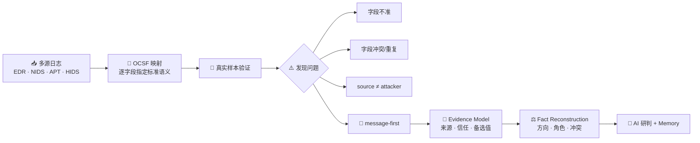
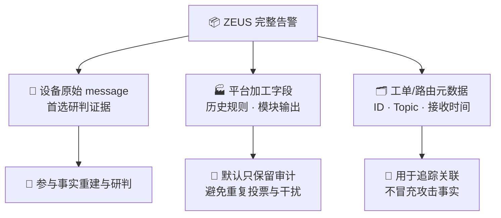
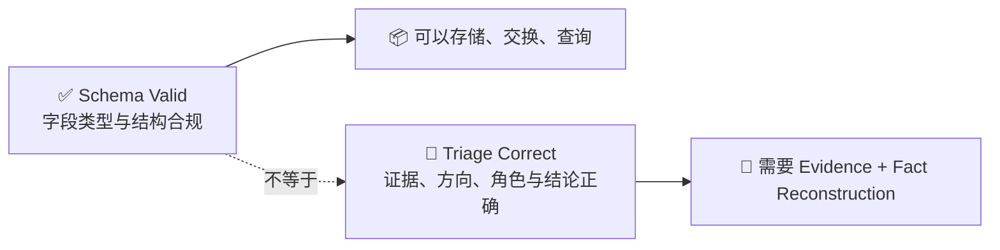

# OCSF Route Retrospective and Architecture Decision / OCSF 路线复盘与架构决策

Status: Explanatory report / 路线复盘  
Audience: Management, SOC operations and technical reviewers / 管理、运营与技术评审  
Last reviewed: 2026-09-11

---

## 1. Executive Decision / 核心决策

| 事项 | 结论 |
|---|---|
| 当前 AI 研判是否使用 OCSF | **否。**SOC Runtime 不调用 `ocsf-bridge`，也不依赖 OCSF Schema。 |
| OCSF-first 路线是否继续 | **否。**已停止作为 AI 研判主路线。 |
| 当前输入策略 | PingAn 场景优先解析设备原始 `message`；不可用时才使用结构化 fallback。 |
| 当前内部模型 | SOC 自有的 Evidence/Fact Model：证据来源、可信度、角色、场景和冲突。 |
| 前期工作的直接价值 | OCSF 逐字段映射暴露了字段不准、冲突和角色误映射，完成了关键路线验证。 |
| 旧代码是否已经复用 | **没有。**旧代码未进入当前 Runtime，不能计为当前产品能力。 |

> **OCSF 实践证明了“格式统一不等于事实正确”，并直接推动项目从 Schema-first 转向 Evidence-first。**

---

## 2. Route Evolution / 路线演进



### 关键因果关系

| OCSF 实践动作 | 暴露的问题 | 形成的决策 |
|---|---|---|
| 为每个原始字段寻找标准字段 | 必须明确字段来源、含义和优先级 | 字段名称不能直接代表事实语义 |
| 比较原始字段与真实告警 | ZEUS 多业务方加工字段存在不准、冲突和重复 | 优先使用更接近设备检测证据的 `message` |
| 映射 `source/destination` | 网络连接角色不等于攻击者/受害者 | 网络观察与安全角色分层保存 |
| 验证 OCSF Schema | Schema 可以合规，但研判仍可能错误 | 标准化不能替代事实重建 |

**若没有开展 OCSF 逐字段映射，就难以如此系统地发现这些问题。**

---

## 3. Evidence Strategy and Case / 证据策略与样本

### 3.1 Why `message-first` / 为什么优先原始 `message`



| 输入情况 | 处理策略 |
|---|---|
| `message` 存在且可解析 | `raw_message_first`，作为 PingAn 首选证据 |
| `message` 不可用 | `structured_fallback`，保留降级原因与可信级别 |
| ZEUS 其他字段 | 完整保留在 raw，支持审计和回放 |
| 其他厂商 | 由各自 Adapter 声明证据策略，不继承 PingAn 硬编码 |

### 3.2 Reverse Shell / 反弹 Shell 样本

```text
被控主机 30.116.114.150  ──主动回连──▶  30.174.29.44 攻击者主机
```

| 观察维度 | `30.116.114.150` | `30.174.29.44` |
|---|---|---|
| 网络会话角色 | source / 连接发起方 | destination / 连接接收方 |
| 安全攻击角色 | victim / 被控主机 | attacker / 攻击者 |

```text
错误假设：source == attacker，destination == victim
真实情况：source/destination 描述连接；attacker/victim 描述安全角色
```

该问题同样可能出现在：

`C2 回连` · `恶意外联` · `CDN/F5` · `NAT` · `X-Forwarded-For` · `代理链` · `横向移动`

### 当前处理方式


---

## 4. Architecture Comparison / 架构对比

### 未采用的路径

```text
message → 解析 → OCSF → SOC 数据模型 → 事实重建 → AI 研判 → Memory
```

### 当前路径

```text
message → Adapter → Evidence/Fact Model → AI 研判 → 复核/决策 → Memory
```

| 评价维度 | `message -> OCSF -> SOC` | 当前 Evidence-first |
|---|---|---|
| 增加新证据 | 否，只改变表达格式 | 否，但完整保留证据来源 |
| 转换层数 | 两次映射 | 一次厂商适配 |
| 字段来源与备选值 | 需要额外扩展 | 一等契约 |
| 网络方向与攻击角色 | 可能被提前合并 | 分层表达后裁决 |
| 冲突处理 | 需要另建模型 | `ConflictReport` |
| 推理准入 | 需要另建模型 | `FieldTrust` + evidence policy |
| 维护成本 | OCSF 与 SOC 双 Schema/双映射 | 主链路单一 |
| Schema 合规 | 强 | 由 SOC contract 保证 |
| 研判适配性 | 仍需完整事实重建 | 直接服务安全研判 |

### 为什么不再多转一次 OCSF

```text
OCSF 增加的是统一表达，不是新的安全证据。
```

若只映射 `src_endpoint/dst_endpoint`，后面仍需判断 attacker/victim，OCSF 只是额外中转层；若提前
填写 attacker/victim、risk 或 disposition，则可能把尚未裁决的错误包装成标准字段。

### Schema 合规与研判正确



| 数据工程验收 | 安全研判验收 |
|---|---|
| Schema 是否合法 | 证据是否可信 |
| 字段是否完成映射 | 语义是否映射正确 |
| 数据能否统一消费 | 攻击方向与角色是否正确 |
| 性能是否达标 | 冲突是否被发现并控制 |

---

## 5. Current Boundary / 当前系统边界


| 已实现 | 当前未实现/未承诺 |
|---|---|
| PingAn `message-first + structured fallback` | OCSF 输入 Adapter |
| 完整原始告警审计与回放 | OCSF 输出 Exporter |
| `CanonicalFieldProvenance` | OCSF 作为 Runtime 中间层 |
| `FieldTrust` / 推理准入 | 旧 `ocsf-bridge` 代码迁入 |
| `RoleClaim` / `RoleResolution` | 以未来可能性计算当前产品价值 |
| `ConflictReport` / 覆盖检查 |  |

`message-first` 是 PingAn Adapter 的证据策略，不是通用 Runtime 的硬编码。其他厂商可以使用干净的
结构化数据、原始事件或原生 OCSF，但必须在各自 Adapter 中声明证据来源和可信边界。

### Implementation Anchors / 当前代码落点

| 能力 | 代码位置 |
|---|---|
| PingAn 证据选择与字段适配 | [`pingan_platform.py`](../../../backend/soc_agent/normalizers/pingan_platform.py) |
| Canonical Alert 与完整 raw | [`AlertInput`](../../../backend/soc_agent/contracts/schemas.py) |
| 来源、角色、冲突与覆盖契约 | [`CanonicalFieldProvenance` / `ConflictReport`](../../../backend/soc_agent/contracts/schemas.py) |
| 确定性事实重建 | [`fact_reconstructor.py`](../../../backend/soc_agent/pipeline/fact_reconstructor.py) |
| 模型可见证据边界 | [`analysis_context.py`](../../../backend/soc_agent/pipeline/analysis_context.py) |

---

## 6. Previous Investment / 前期投入的实际价值

| 前期产出 | 当前是否直接使用 | 已产生的价值 | 未来候选，不代表承诺 |
|---|---|---|---|
| OCSF Event 与 Mapper 代码 | **否** | 完成标准化可行性验证 | 有明确交换契约时评估 Adapter/Exporter |
| EDR/NIDS/APT/HIDS 字段盘点 | 无运行时依赖 | 发现字段含义、别名、冲突和覆盖问题 | 新厂商 Adapter 调研参考 |
| Mapper/Registry 架构 | **否** | 验证按数据源扩展转换器的设计模式 | 复用设计经验，不机械复制代码 |
| 字段覆盖、Schema、性能测试 | **否** | 建立批量数据转换验证方法 | 可改造成 Adapter coverage 工具 |
| 真实样本与边界案例 | 未证明全部迁入 | 暴露 XFF、方向和角色等问题 | 治理后可进入 replay/eval corpus |
| 反弹 Shell 等样本结论 | 结论已吸收 | 证明连接方向不能直接映射攻击角色 | 持续用于事实重建验证 |
| OCSF-first 路线验证 | 结论已吸收 | 及时停止不适合研判主链路的方案 | 保留为架构决策依据 |

### 投入结论

```text
没有转化为当前能力：OCSF 代码、Schema 和 Runtime 集成

已经转化为项目价值：
字段问题发现 + 路线验证 + 架构纠偏 + 避免继续扩大错误投入
```

这部分工作应计为**有明确结论的研发探索和路线验证**，不能包装成已复用的产品功能，也不能简单归类为
与当前方案无关的无效投入。

---

## 7. Key Questions / 关键问题速览

| 关键问题 | 一句话结论 |
|---|---|
| 为什么第一版使用 ZEUS 字段做 OCSF？ | 先验证跨设备标准化，并假设加工字段可作为稳定输入。 |
| 为什么后来改用 `message`？ | OCSF 映射和真实样本对照发现加工字段不准、冲突和语义漂移。 |
| 为什么不采用 `message -> OCSF -> SOC`？ | 不增加证据，却增加一次映射，并可能提前固化错误语义。 |
| 前期工作是否进入当前 Runtime？ | 旧代码没有进入；字段问题与路线验证结论已经被当前架构吸收。 |
| OCSF 是否还会建设？ | 当前不建设；只有明确外部交换契约出现后才重新评估。 |
| 当前方案是否只适用于 PingAn？ | 否；PingAn 逻辑留在 Adapter，通用 Runtime 使用 vendor-neutral contract。 |

---

## 8. Final Statement / 最终陈述

> 早期 OCSF 建设要求逐字段确认标准语义。正是在映射和真实样本验证过程中，项目发现 ZEUS 加工字段
> 不准、相互冲突，以及反弹 Shell 中 `source/destination` 不等于 `attacker/victim` 等问题，从而验证
> OCSF-first 不适合作为 AI 研判主路线。当前系统改为从原始 `message` 建立带来源、可信度和冲突信息的
> Evidence/Fact Model，再进行 AI 研判和 Memory 沉淀。旧代码没有进入当前 Runtime，但前期工作完成了
> 关键路线验证，避免项目继续沿错误架构扩大投入。

### Architecture Decision / 架构决策

| 决策项 | 结果 |
|---|---|
| Evidence-first SOC 主链路 | **Accept / 采用** |
| OCSF-first 内部研判链路 | **Reject / 停止** |
| OCSF 未来互操作能力 | **Not planned / 无明确需求前不建设** |
