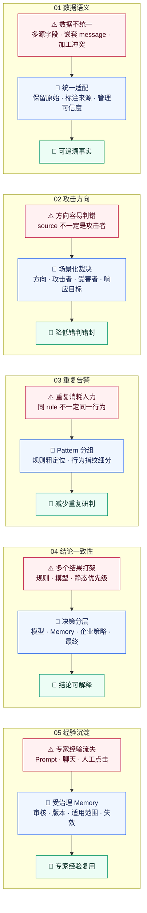
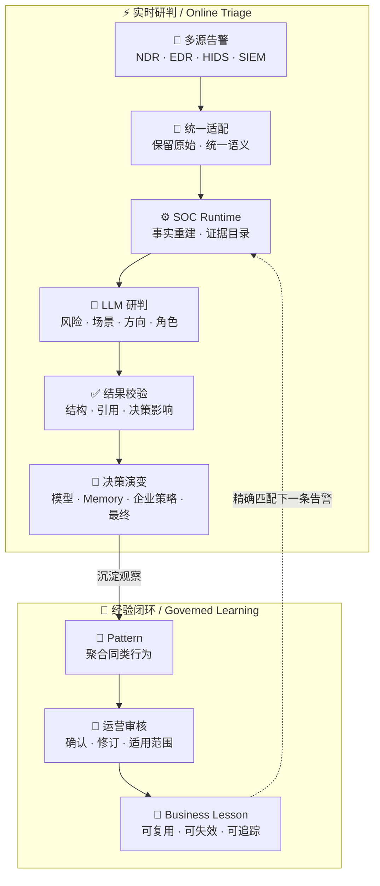
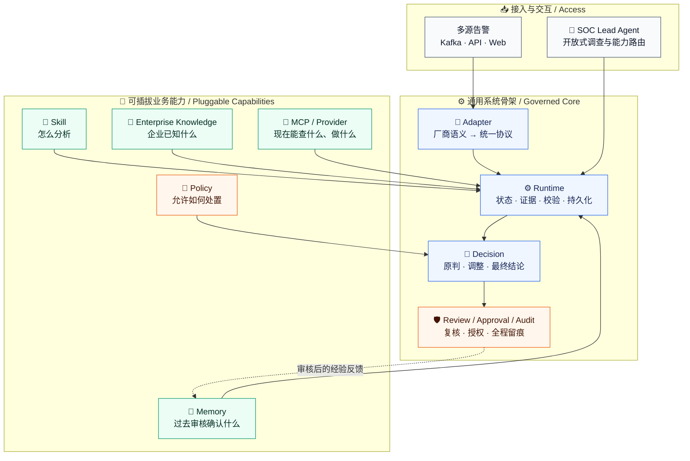

# SOC Agent Project Brief / 项目汇报摘要

## 30 秒结论

> SOC Agent 不是一个“把告警交给大模型回答”的聊天工具，而是一套可治理的安全运营执行系统：
> 它统一不同来源告警，让模型集中完成安全语义判断，再用确定性流程管理证据、决策、权限和经验复用。

核心价值是减少重复研判，同时让每次结论都能回答：**依据是什么、被什么经验或策略改变、最终为什么这样处理。**
它也不是把企业能力堆进一个大 Prompt：分析方法、稳定知识、历史经验、实时工具和处置权限分别治理、按需组合。

## 必须解决的五个问题

## 核心闭环

## 不是一个大 Prompt：能力分层

这套分层的价值不是“模块更多”，而是把五种容易混淆的责任彻底拆开：**方法、事实、经验、外部能力、处置权限**。
因此，更换告警厂商、企业知识、工具系统或运营策略时，不需要重写通用 Runtime，也不会让一段 Prompt 同时拥有事实解释和执行权限。

## 模型调用次数

| 阶段 | 调用次数 | 触发条件 |
|---|---:|---|
| 单条告警主分析 | `1` | 每次正式研判 |
| 角色窄范围复核 | `+1` | 复核开关开启且角色问题达到门槛；当前演示默认关闭 |
| AI 草拟 Business Lesson | `+1` | Candidate 治理时由运营主动请求 |
| 人工确认、Memory 入库和检索 | `0` | 确定性流程完成 |

因此：普通告警通常调用 `1` 次；运营对 Candidate 请求 AI 草拟 Business Lesson 时，整段闭环通常共 `2` 次；
同时触发角色复核时共 `3` 次。
Lead Agent 的开放式调查按任务动态调用，不计入固定告警流水线。网络重试会单独记录。

## 当前已经证明什么

- `4,343` 条历史告警已进入统一语料工作台，覆盖 `310` 个规则标识和 `1,280` 个行为组。
- `4,082` 条可形成行为指纹，证明同一个 rule_code 可以按真实行为拆成不同 Pattern。
- Web 已走通单告警全链路审计、Candidate 审核、Business Lesson 草拟、Memory 启用、匹配和修订。
- 场景导览提供 `5` 组主案例和 `2` 组备选案例，可展示完整 Runtime、同规则分组和正反风险 Memory。

## 当前不能宣称什么

- 历史“忽略/转交”是运营处置结果，不是独立真值，不能直接宣称生产准确率。
- 当前演示使用历史回放和 SQLite；内网安全能力接口处于关闭/模拟状态。
- 企业专属策略和外部动作在演示中关闭，尚未完成真实自动化上线验收。

## 下一阶段

1. 在内网接入 ZEUS、资产、威胁情报和安全标签等真实只读能力。
2. 由少量运营专家审核代表样本和高价值 Candidate，建立可衡量的质量基线。
3. 进入 Shadow，统计研判一致率、人工复核率、Memory 有效命中率、耗时和错误自动化数量。
4. 达到质量门后再进入有限试点，不直接替换现有生产处置流程。

## 六页汇报顺序

1. 业务痛点：日志不统一、重复告警、经验无法复用。
2. 产品闭环与能力分层：统一事实 -> LLM 研判 -> 决策 -> Memory；Skill、知识、工具和策略各自治理。
3. 单告警审计：原始输入、证据、模型判断和最终结论。
4. 重复告警治理：同规则不同 Pattern、误报和真实风险经验复用。
5. 当前证据与边界：4,343 条语料、哪些真实、哪些仍关闭/模拟。
6. 下一阶段：真实只读接入 -> Shadow -> 有限试点。
