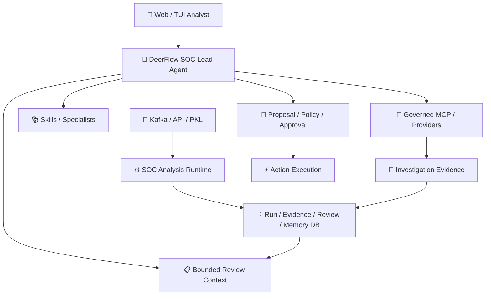
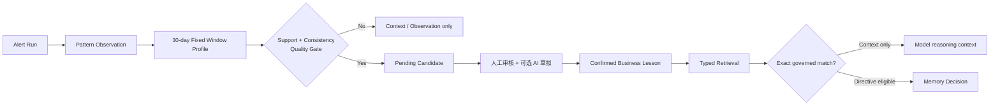

# SOC Agent Technical Solution / 技术解决方案

## 1. 设计判断

本系统不是“一个自主 Agent 接全部工具”。它由两个互补运行时组成：

- **SOC Analysis Runtime**：处理 Kafka/批量/单条告警的固定流水线，拥有状态、持久化、校验、重试和审计。
- **DeerFlow Agent Runtime**：处理运营人员的开放式调查对话，可选择 Skill、MCP 和受控 Sub Agent，但不能绕过 SOC 权限边界。



## 2. 能力类型与责任边界

SOC Agent 的扩展性不是来自“挂更多工具”，而是来自不同类型能力各自拥有稳定契约、数据来源和权限边界。

| 能力层 | 回答的问题 | 典型内容 | 明确边界 |
|---|---|---|---|
| **Adapter / 厂商适配** | 这份原始告警字段到底是什么意思？ | message-first、字段别名、来源可信度、canonical 映射 | 只解释和转换输入，不直接给最终 verdict 或动作授权 |
| **Skill / 研判方法** | 面对这类场景应该怎么分析？ | 反弹 Shell、网络攻击、终端行为的分析步骤与检查框架 | 是可复用方法，不保存企业事实，不调用生产系统，不授予处置权限 |
| **Enterprise Knowledge / 企业定制知识** | 该企业有哪些稳定、受治理的已知事实？ | 内部域名、网络归属、平台身份、采集约定、首见告警 Playbook | 必须有租户、版本、范围和有效期；不等于历史经验或动作策略 |
| **Memory / 审核经验** | 过去对同类行为审核确认了什么？ | Pattern、Business Lesson、适用条件、失效条件、directive | 来自真实闭环并可修订；模糊匹配只能作为上下文，不能直接获得动作权限 |
| **MCP / 标准工具协议** | Agent 或 Runtime 可以通过什么标准接口发现和调用能力？ | 资产、威胁情报、安全标签等工具接口 | MCP 是协议与工具暴露方式，本身不决定业务结论或权限 |
| **Provider / Action Adapter** | 实际怎样调用某个企业系统？ | ZEUS、CMDB、TI、封禁或隔离接口的实现适配 | 负责鉴权、超时、错误映射和结果裁剪；结果形成 `T-*` 证据，不直接篡改 verdict |
| **Policy / 企业策略** | 该企业最终允许如何处置？ | 忽略、转交、审批、自动动作的版本化规则 | 位于完整技术研判之后；处置判断与高风险动作授权仍是两个独立关口 |
| **Lead/Sub Agent / 调查智能体** | 当前开放式调查下一步查什么、调用谁？ | 对话、Skill/MCP 路由、专家子能力协作 | 只能提出调查或动作建议，不能绕过 Runtime、Policy、Approval 和审计 |
| **Runtime / 确定性运行时** | 每条告警必须按什么语义可靠流转？ | 状态、Schema、证据、重试、持久化、决策演变 | 掌握强制控制流；LLM、Skill、Memory、MCP 都是受控参与者 |
| **Review / Approval / Audit / 治理** | 谁确认经验、谁授权动作、事后如何复盘？ | Candidate 审核、Memory 修订、一次性授权、完整 lineage | 人工确认、动作授权和审计不可被模型输出替代 |

最短记忆口径是：**Skill 讲方法，Knowledge 讲稳定事实，Memory 讲审核经验，MCP/Provider 提供实时能力，Policy 决定处置权限。**
Adapter、Runtime 和 Agent 则负责让这些能力在统一协议下协作，而不是互相越权。

## 3. 单告警流水线

| 阶段 | 输入 | 责任 | 主要输出 |
|---|---|---|---|
| Admission | vendor payload | 接收、幂等、保留原始数据 | immutable raw input |
| Adapter | PingAn/其他厂商字段 | 解释别名、选择 message-first/fallback、记录 provenance | 统一告警模型 |
| Entity Extraction | canonical observations | 提取 IP、host、account、process、file、HTTP 等 typed mentions | entity catalog |
| Fact Reconstruction | observations + field trust | 重建方向、角色主张、冲突与场景信号 | facts/conflicts/hypotheses |
| Skill Selection | source/scenario/capability | 选择有限的通用研判方法，不加载全部 Skill | `S-*` context |
| Context Build | E/S/A/M/C/T catalogs | 裁剪、压缩、限长、冻结引用别名 | bounded LLM request |
| LLM Analysis | bounded request | 输出 verdict、场景、方向、角色、目标和引用 ID | compact analysis |
| Conditional Role Verification | 关键角色结论 + 同批证据 | 开关开启且命中质量门时进行窄范围独立复核 | confirmed/disputed claims |
| Validation | model output + frozen catalogs | JSON repair、结构校验、引用恢复、证据对应检查、决策影响判定 | validated/degraded sections |
| Decision | validated analysis + policy layers | 分别记录模型原判、Memory 调整、企业专属策略和最终结论 | decision + review/action guard |
| Pattern/Memory | reviewed outcomes | 去重观察、聚合同类、候选治理和经验复用 | Pattern/Candidate/Memory |

## 4. 为什么可扩展

通用 Runtime 不直接识别任何厂商的原始字段。新增厂商时由 Adapter 将原始字段映射到统一数据协议；新增外部能力时
由 Provider/Action Adapter 实现，通用层只依赖稳定的能力名称、请求和响应契约。

模型上下文按职责分为：

| 前缀 | 内容 | 权限 |
|---|---|---|
| `E-*` | 当前告警的类型化事实 | 当前事件证据 |
| `S-*` | 通用分析方法 / Skill | 方法指导，无业务事实权限 |
| `A-*` | Adapter 声明的厂商字段语义 | 仅解释来源字段 |
| `M-*` | 已审核历史 Business Lesson | 可作上下文；满足 directive 契约时可影响 Decision |
| `C-*` | 版本化租户静态知识/授权事实 | 按有效期与 scope 使用 |
| `T-*` | CMDB/TI/EDR 等实时工具结果 | 调查证据，不直接越权改判 |

## 5. Memory 机制



关键点：

- `alert_id` 是同一原始告警重投/重跑的第一去重依据；不同时间的新告警仍是新观察。
- PingAn 先以 detection key/rule_code 粗定位，再以 canonical behavior fingerprint 区分行为。
- 指纹可包含攻击族、场景、协议/服务、CVE、进程链、命令语义等；默认不把变化频繁的具体 IP 当作跨 IP 泛化主键。
- Candidate 不等于 Memory；Confirmed 不等于已启用检索；可检索不等于拥有 decision directive。
- 修改 Confirmed Memory 通过版本化 revision，旧版本暂停而不是原地覆盖。
- Pattern Observation、聚合 Profile 和 Candidate 生成由确定性流程完成，不调用模型。
- 只有运营在 Candidate 治理中请求 AI 草拟 Business Lesson 时才增加一次模型调用；人工确认、入库和后续检索不调用模型。

## 6. 决策与动作

```text
Base Decision
  -> Memory Decision
  -> Enterprise-specific Policy Decision
  -> Effective Decision
  -> Action Authorization
  -> Provider Execution
```

每一层记录 `before/after/source/version/reason`。因此可以回答：

- 模型原始判断是什么？
- 哪条 Memory 是否真的参与改判？
- 哪条租户策略改变了处置语义？
- 谁授权了什么目标上的什么动作？
- Provider 是否成功、失败、超时或返回正常查无？

## 7. 稳定性设计

- 模型只返回紧凑引用 ID，Runtime 从冻结目录补全 path/value，减少大 JSON 复制错误。
- 核心 verdict 与可选场景/角色/目标区块分开校验；局部失败只阻断依赖能力。
- Grounding 只验证引用存在和对应，不重新审判模型的合理安全推理。
- Provider 调用前写 journal；失败区分 retryable、not-found、schema error 和 auth failure。
- 所有流水线步骤记录开始、结束和耗时；token usage 支持 provider-reported 或降级 estimated。
- 原始输入、canonical input、prompt/model/config/version/hash 可 replay。

## 8. 当前演示边界

| 项目 | 演示状态 | 生产所需 |
|---|---|---|
| Runtime/Memory/API/Web | 完整功能链路 | 继续回归和 Shadow |
| 数据 | 历史 PKL 回放 | 实时 Kafka envelope 与数据治理 |
| DB | 独立 SQLite | PostgreSQL migration/连接池/恢复 |
| LLM | 内网 LiteLLM/OpenAI-compatible | 限流、容量、成本和 SLO |
| 内网安全能力接口 | 关闭/模拟 | ZEUS/CMDB/TI 真实调用验收 |
| 企业专属策略（Tenant Policy） | 演示默认关闭 | 内网策略版本、负责人、观察/生效门禁 |
| 外部动作 | disabled | 真实 Adapter、授权、审计、补偿和 rollout |

## 9. 评测方法

本地 4,343 条语料适合验证结构覆盖、稳定性、分组和产品闭环。生产质量必须另建代表性、脱敏、具名人工审核的
truth set，并按来源和场景统计：核心 JSON 首次通过率、局部 repair/fallback、verdict 一致率、角色准确率、
Memory precision、context-only 有效性、人工复核率、P50/P95、token/成本和错误自动化数量。
