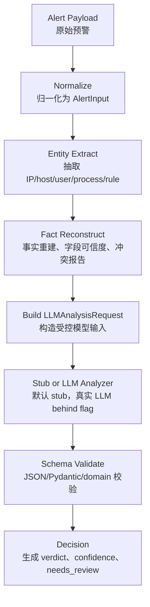
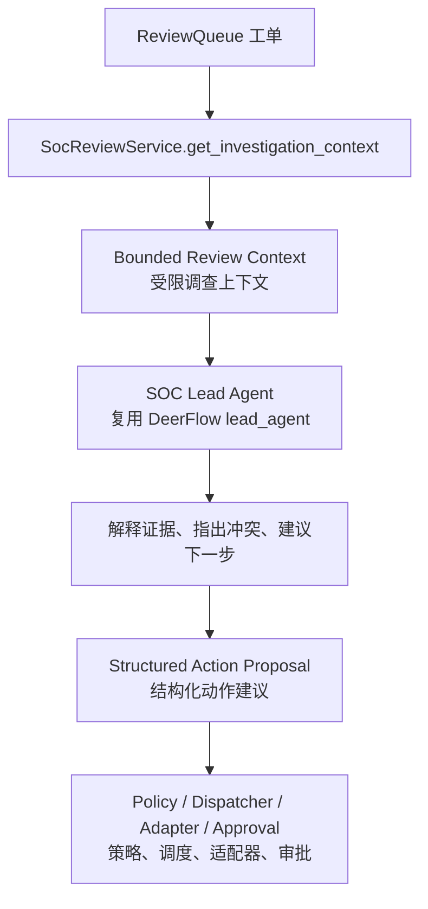

# SOC Agent Runtime-first 与受控 LLM 策略说明

> Updated: 2026-07-14
>
> 面向对象：老板/管理层、产品评审、架构评审、安全运营负责人
>
> 目的：解释为什么 SOC Agent 不应该做成“一个大模型全自动决定一切”，而应该采用
> `确定性 Runtime + 受控 LLM 推理 + 工具证据 + 人工审批 + 可评审记忆` 的生产级架构。

## 1. 一句话结论

我们不是要做一个“看起来很智能、但生产不可控的聊天机器人”。

我们要做的是：

```text
Runtime 掌握主流程。
LLM 负责受控安全研判。
工具/MCP 负责可审计取证。
人负责高风险审批和经验确认。
记忆先进入候选，人工确认后才可被检索使用。
```

这套架构的核心价值是：

| 目标 | 管理层关心的问题 | 我们的设计 |
|---|---|---|
| 可靠 | 每天持续进告警，系统不能靠模型自由发挥 | Runtime 固定流程、状态机、审计、持久化、重放 |
| 智能 | 安全研判需要理解上下文、历史经验、证据冲突 | LLM 进入受控节点和 Lead Agent 协作流程 |
| 安全 | 错封、错关、错抑制会造成真实业务风险 | 工具调用有白名单，高风险动作走人工审批 |
| 可复制 | 不能只服务平安一个场景，要能对外推广 | core 保持通用，客户差异放到 adapter、memory、policy、capability card |
| 可演进 | 先跑通 MVP，再扩展 Kafka、Web、TUI、RAG、自动化 | 分阶段建设，不为了“全自主”牺牲可控性 |

所以推荐的管理决策是：

```text
批准 Runtime-first 的 SOC Agent 架构。
不要把第一版目标定成“完全自主 Agent”。
用可复核结论、审计能力、误报压降、记忆质量、分析师节省时间来衡量成功。
```

## 2. 我们到底用不用大模型

答案是：**用，但不让大模型掌控主流程。**

### 2.1 自动告警分析默认不直接调用真实大模型

当前自动分析链路是：



当前默认的 `analyze_stub` 是 deterministic stub，不调真实模型，便于离线回归和无外部依赖运行。
真实 `JsonLLMAnalyzer` 已通过 DeerFlow `create_chat_model()` 接入模型注册表；使用
`SOC_ANALYZER_MODE=llm` / `SOC_LLM_MODEL` 或对应 CLI 参数显式开启。模型输出仍必须经过：

- JSON parse；
- bad JSON repair；
- Pydantic schema validation；
- domain validation；
- audit metadata 记录。

这意味着同一条 Runtime 管线可以在 stub、replay 和真实 LLM 之间切换，而主控制流、校验、审计和
人工复核边界保持不变。真实模型当前仍是 opt-in，不代表尚未接入。

### 2.2 Lead Agent 对话会使用大模型，但只拿受限上下文

分析师打开 ReviewQueue 工单后，可以通过 SOC Lead Agent 辅助研判：



Lead Agent 能做：

- 解释当前告警和证据；
- 指出字段冲突和证据缺口；
- 总结相似历史告警；
- 引用 confirmed memory；
- 建议下一步查资产、查 EDR、查威胁情报、查 security tag；
- 输出结构化 action proposal。

Lead Agent 不能做：

- 直接读数据库；
- 直接调用任意 MCP；
- 直接改 verdict；
- 直接关闭工单；
- 直接写 confirmed memory；
- 直接封禁 IP、隔离主机、修改抑制规则。

## 3. 为什么不能让大模型/Lead Agent 自主决定全流程

SOC Agent 的落地难点不是“模型不会推理”，而是：

```text
模型给出了看似合理的答案，但系统无法证明、复盘、恢复、审计它为什么这样做。
```

真实 SOC 场景有几个特点：

- 输入脏：上游日志字段可能缺失、冲突、含义不一致；
- 后果重：错关告警可能漏掉入侵，错封 IP/隔离主机可能影响业务；
- 入口多：Kafka、Web、TUI、CLI、外部 Zeus/ITSM 状态同步都会进入系统；
- 责任清：谁触发、谁审批、用什么证据、为什么判断，都要可追踪；
- 经验会变：历史经验有价值，但也可能过期或污染后续判断；
- 客户差异大：不同公司不一定有同样的 `rule_code`、CMDB、EDR、日志质量。

如果把这些都交给一个自由 Agent，它可能短期 demo 很漂亮，但生产会遇到：

| 风险 | 例子 | 后果 |
|---|---|---|
| 漏报 | 真实入侵被模型判断成误报 | 事故延迟发现 |
| 误报 | 授权扫描被升级成高危攻击 | 浪费分析师时间 |
| 错处置 | 攻击方/受害方方向判断反了 | 封错对象、找错负责人 |
| 工具误用 | 模型把错误参数传给高权限工具 | 造成安全或业务事故 |
| 记忆污染 | 一次错误结论变成未来经验 | 错误被系统性放大 |
| 不可审计 | 无法解释为何关闭或升级工单 | 管理、合规、复盘困难 |

所以我们的原则是：

```text
大模型可以给建议，但不能成为操作系统。
```

## 4. Runtime 和 Lead Agent 的职责边界

| 能力 | Runtime/Core Service 负责 | LLM/Lead Agent 负责 |
|---|---|---|
| 主流程 | 固定 pipeline、状态机、失败处理 | 不负责 |
| 数据标准化 | vendor adapter -> canonical schema | 不负责 |
| 字段可信度 | EvidenceLayer / FieldTrust / ConflictReport | 读取并解释 |
| 自动分析 | 构造 bounded request、校验输出 | 在受控节点里生成研判 |
| 工具调用 | 白名单、策略、adapter、审计 | 提出结构化建议 |
| MCP 使用 | 通过 action adapter 显式绑定 | 不直接自由调用 |
| 工单状态 | ReviewService 管理 | 可建议关闭/升级/补查 |
| 高风险动作 | ApprovalService 管理 | 只能提出 proposal |
| 记忆沉淀 | MemoryService 状态机和人工确认 | 只能生成 candidate |
| 外部反馈 | ExternalDispositionService 归一化和审计 | 可解释和引用 |

这套边界让系统具备清晰责任链：

```text
Runtime 说明“系统实际做了什么”。
LLM 说明“为什么这个安全解释可能成立”。
Tool/MCP 说明“查到了什么证据”。
Human 说明“哪些高风险动作和经验被确认”。
```

## 5. 这不是传统预警分析系统

采用 Runtime-first 不代表我们在做传统规则系统。

传统 SOC 平台通常只是：

- 规则命中；
- 字段展示；
- 静态富化；
- 人工处置；
- 经验靠人脑或文档沉淀。

我们的 SOC Agent 增加的是：

- 大模型对复杂证据的受控推理；
- 反弹 shell、webshell、横向移动、命令执行、恶意外联、提权、凭证滥用等场景识别；
- APT/EDR/HIDS/资产方向/终端研判/网络研判等 domain skills；
- 相似历史告警和处置反馈复用；
- Lead Agent 辅助分析师对话研判；
- 工具/MCP 只读取证；
- 高风险动作审批；
- 人工 correction 到 memory candidate 的学习闭环；
- replay / eval 对模型和规则变化做回归验证。

关键区别是：

```text
传统系统展示数据。
SOC Agent 解释证据、建议下一步、学习已复核经验。
```

但它不会牺牲生产系统必须具备的确定性、审计和审批。

## 6. 为什么这对平安和未来商业化都更合适

### 6.1 对平安当前问题的适配

平安当前有一些典型复杂性：

- APT 原始告警可能用同一字段模板表达不同攻击方向；
- 天眼/日志云中攻击方和受害方可能判反；
- 历史加工字段太多，彼此冲突；
- Zeus 预警处置结果来源多，标准不统一；
- 运营同事的历史处置理由很有价值，但不能不经确认就变成自动规则。

Runtime-first 方案可以把这些问题显式化：

- raw message 优先；
- 缺 raw message 时才 fallback 到 `zeusRawLogs` 全字段；
- 用 `FieldTrust` 标记字段可信度；
- 用 `ConflictReport` 记录攻击方/受害方/方向冲突；
- 平安专属经验放到 tenant memory、policy、eval fixture、adapter、capability card；
- public skill 只保留跨客户通用研判方法。

### 6.2 对未来客户的可复制性

未来客户可能没有平安的 `rule_code`、Zeus、CMDB、EDR、日志字段或处置流程。
所以 core 不能写死某一家客户。

我们的扩展方式是：

| 差异来源 | 放在哪里 |
|---|---|
| 厂商字段差异 | normalizer / mapping adapter |
| 资产系统差异 | read-only action adapter / MCP-backed adapter |
| EDR/威胁情报差异 | action adapter / MCP config |
| 客户内部经验 | tenant-scoped memory candidate / confirmed memory |
| 客户处置策略 | policy / approval config |
| 客户场景样本 | eval fixture |
| 客户专属知识拆分 | capability card |

这样产品能从平安场景起步，但不会被平安字段和系统焊死。

## 7. 建设路线

| Phase | 目标 | 说明 |
|---|---|---|
| Phase 1 | 跑通单条预警闭环 | 一条预警进来，产生可复核的调查结果 |
| Phase 2 | 做历史关联和统一调查上下文 | 让分析师看到当前告警、历史相似告警、已有证据和证据缺口 |
| Phase 3 | 做可控学习 | 把运营反馈变成可评审记忆，而不是让模型自我污染 |
| Phase 4 | 接入 Kafka 和后台运行 | 持续消费预警流，同时保持幂等、审计、限流和失败恢复 |
| Phase 5 | 做成安全运营工作台 | Web/TUI/Lead Agent/RAG/Threat Intel/MITRE/运行态势面板 |

## 8. 管理层应该看什么指标

不要用“Agent 看起来是否足够自主”作为成功指标。

更应该看：

| 指标 | 说明 |
|---|---|
| 单条预警到可复核结论的耗时 | 是否真正节省分析师时间 |
| ReviewQueue 告警质量 | 是否减少无效工单 |
| 误报压降 | 是否减少重复人工关闭 |
| 高危漏报率 | 智能化不能牺牲安全底线 |
| 证据覆盖率 | 每个结论是否有可追溯证据 |
| 字段冲突识别率 | 是否把上游脏数据显式暴露 |
| replay 稳定性 | 模型/规则变化是否可评测 |
| memory candidate 采纳率 | 是否沉淀了真实可复用经验 |
| 工具/MCP 成功率和延迟 | 外部系统接入是否可靠 |
| 高风险审批通过/拒绝原因 | 自动化边界是否受控 |

## 9. 给老板的推荐表述

可以这样汇报：

> 我们不是把大模型放到驾驶位，让它自由决定怎么处理安全告警。
> 我们是在 DeerFlow 上做一个生产级 SOC Runtime：确定性服务负责流程、状态、审计和持久化；
> 大模型负责受控安全研判和分析师协作；工具和 MCP 负责可审计取证；
> 高风险动作和可复用经验必须人工确认。
>
> 这样既能利用大模型的推理能力，也能满足 SOC 系统在生产环境里的可靠性、合规性、
> 可复盘性和可推广性。第一阶段先把单条预警闭环做稳，再逐步扩展到历史关联、记忆学习、
> Kafka 后台消费、Web/TUI 工作台和更丰富的安全运营能力。

## 10. 希望老板批准的方向

建议争取的决策是：

```text
认可 Runtime-first + bounded LLM 的架构方向。
第一版不追求全自主 Agent，而追求可复核、可审计、可度量、可扩展。
后续再逐步放开更多 LLM 推理和自动化能力，但必须经过评测、审批和回放验证。
```

这条路线更适合企业级 SOC 场景，也更适合未来从平安内部经验走向可商业化产品。
