# SOC Runtime Validation Runbook / 运行时逐步验证手册

> Purpose: reproduce every current Runtime/evaluation/governance artifact for review.  
> Storage: `backend/.deer-flow/soc-runtime-validation/` (gitignored, contains real-alert-derived data).  
> Latest local index: `backend/.deer-flow/soc-runtime-validation/RUN-INDEX.md`.

## 1. What Is Actually Linear / 真正固定流水线

```mermaid
flowchart LR
    A["📨 Input<br/>原始告警"] --> B["🔌 Normalize<br/>适配与规范化"]
    B --> C["🧩 Entity Extract<br/>实体提取"]
    C --> D["🧭 Fact Reconstruct<br/>事实/角色/冲突重建"]
    D --> E["📦 Bounded Input<br/>有界、脱敏模型输入"]
    E --> F["🧰 Skill Context<br/>技能上下文"]
    F --> G["🧠 Analyze<br/>Stub 或 Live LLM"]
    G --> H["✅ Schema Validate<br/>结构与领域校验"]
    H --> I["🔗 Evidence Grounding<br/>证据落地校验"]
    I --> J["⚖️ Decide<br/>确定性决策策略"]
```



`normalize -> entity_extract -> fact_reconstruct -> build_analysis_input -> skill_context -> analyze -> schema_validate -> evidence_grounding -> decide`

以下编号是审阅轨道，不应被误解为都在上述主流水线中：

- Step 7 是离线 normalization mapping suggestion，永不自动修改 Adapter。
- Step 9 是人工真值/置信度校准门禁。
- Step 10-11 是确定性回放、主编排和 correlation 离线评测。
- Step 11-12 是 governed context 与 authorization shadow 旁路，不改 Runtime verdict。

## 2. One Entry Point / 唯一重跑入口

从仓库根目录执行：

```bash
# 只跑确定性的 Step 01-05
./scripts/soc-runtime-validation.sh core

# 调用真实模型，跑 Step 06-09
SOC_VALIDATION_MODEL=deepseek-v4-pro ./scripts/soc-runtime-validation.sh live

# 跑 Step 10-12，不调用外部模型
./scripts/soc-runtime-validation.sh evaluations

# 根据已有结果重建 manifest 和总索引
./scripts/soc-runtime-validation.sh finalize

# 全部依次执行
./scripts/soc-runtime-validation.sh all
```

重跑前如需保留当前本地产物：

```bash
./scripts/soc-runtime-validation.sh snapshot
```

Runtime 验证本身不需要 Docker。Boss Web 演示需要 Docker；若 CLI/socket 不可用，先启动
Docker Desktop，等待 Engine Ready，并确认当前发行版的 WSL Integration 已开启。

## 3. Step Contract / 每步看什么

| Seq | Directory / 目录 | Input / 输入 | Output / 重点产物 | Pass meaning / 通过含义 |
|---:|---|---|---|---|
| 1 | `step-01-input-adapter` | 5 条 `datas/*.json` | Adapter、source type、raw-message inventory | 输入来源和供应商 Adapter 被明确识别 |
| 2 | `step-02-message-parsing` | Step 1 + 原始 payload | canonical alert、完整 message parse、decode/repair、coverage | 原始 payload 保留；可解析字段进入高信任 message projection |
| 3 | `step-03-fact-reconstruction` | canonical + role/scenario claims | role resolutions、scenario hypotheses、conflicts、provenance | 不默认 attacker=source；角色不确定性和冲突可见 |
| 4 | `step-04-build-analysis-input` | Step 3 | `LLMAnalysisRequest` | 模型只看到有界、脱敏、限长证据，不看到无限 raw payload |
| 5 | `step-05-normalization-maintenance` | schema/coverage observations | baseline + maintenance issues | 格式漂移/截断产生维护 issue，但不改变 verdict |
| 6 | `step-06-live-llm` | APT 代表样本 | 完整 live `AnalysisRun` | DeerFlow model path、JSON/schema validation、grounding、decision 全部执行 |
| 7 | `step-07-live-normalization-suggestion` | normalization report | candidate mappings | 仅供工程师审阅，`auto_apply_allowed=false` |
| 8 | `step-08-runtime-hardening` | Step 6 live run | 安全断言摘要 | 不合格证据必须触发 degraded + review + automation blocked |
| 9 | `step-09-confidence-labeling` | 5 条 live runs | 新 pending label set + validation | 未经人工真值不得校准；不覆盖历史人工标注文件 |
| 10 | `step-10-five-sample-repair` | 5 条样本 | stub deterministic runs | 解析/修复/决策可离线重复 |
| 10 | `step-10-correlation-bridge` | 3 条 capability fixtures | unified investigation reports | 主编排能消费 typed correlation/evidence/finding |
| 11 | `step-11-correlation-eval` | 8 条受控 pair | baseline + replay diff | lineage 无泄漏、重跑无变化；不开放生产 suppress |
| 11 | `step-11-governed-context` | 授权业务真值 | proposed/active/history/query + SQLite | append-only、乐观版本、生命周期查询生效 |
| 12 | `step-12-authorization-shadow` | HIDS/EDR + active facts | exact match records | 只读 shadow；不改检测真值、不关单、不授权动作 |

## 4. 2026-07-17 Latest Run / 本次实跑结果

总结果：`13 passed + 1 expected_pending + 0 failed/missing`。

| Sample | Live verdict | Confidence | Grounded | Rejected | Runtime result |
|---|---|---:|---:|---:|---|
| `apt-1965449` | `needs_review` | 0.52 | 3 | 8 | 安全降级并阻止自动化 |
| `apt-2025642` | `suspicious` | 0.78 | 13 | 2 | 安全降级并阻止自动化 |
| `apt-2026494` | `suspicious` | 0.70 | 10 | 0 | 全部证据落地，仍因未校准而复核 |
| `edr-1965810` | `needs_review` | 0.55 | 7 | 0 | 全部证据落地，仍因未校准而复核 |
| `hids-1965448` | `suspicious` | 0.65 | 5 | 1 | 安全降级并阻止自动化 |

本次关键发现：

1. 5 条真实模型调用均完成，没有 silent fallback。
2. 49 条模型证据中 38 条落地、11 条被拒绝；3 条样本触发
   `ungrounded_analysis_evidence`。Runtime 正确将其降级为人工复核并保持
   `automation_allowed=false`，但模型引用质量仍是后续优化项。
3. 5 条 confidence label 全部保持 pending；这是治理门禁的预期结果，不是失败。
4. Step 5 对 APT 样本产生 schema degradation/evidence truncation issue；EDR/HIDS 无 issue。
5. Step 7 生成 14 条候选 mapping，全部禁止 auto-apply。
6. Correlation 受控语料 retrieval precision `0.667`、recall `1.0`，replay diff `changed=false`；
   该数字不代表生产分布，也不能用于自动抑制。
7. HIDS/EDR 已知授权事实均得到 `exact` shadow match，但不会修改检测真值或自动关单。

## 5. Review Order / 明天逐步审阅顺序

1. 先看 `RUN-INDEX.md`，确认本次产物完整性和已知发现。
2. 逐样本查看 Step 1-4，重点审查字段是否遗漏、message 是否完整解析、角色/场景是否正确。
3. 查看 Step 5，区分真实格式漂移、证据截断和已接受 baseline。
4. 查看 Step 6 的完整 live run，再看 Step 8 如何拦截未落地证据。
5. 查看 Step 9 五样本 manifest；人工真值确认前不要运行 confidence calibration。
6. 最后查看 Step 10-12，确认关联、治理事实和授权旁路均没有越过决策/审批边界。

## 6. Boundaries / 注意事项

- 产物含真实告警衍生字段，只能留在 gitignored 本地目录。
- `label-set.pending.json` 是已有人工审阅数据；脚本只写
  `label-set.rerun.pending.json`，绝不覆盖前者。
- LLM 输出能被成功解析不等于证据可信；必须继续经过 grounding 和 decision policy。
- Step 7 suggestion、Step 11 correlation threshold、Step 12 exact match 都不能自动修改生产逻辑。
- 任何 live 模型失败都会留下 `.failed` 临时产物并停止，不用旧结果冒充新重跑。
