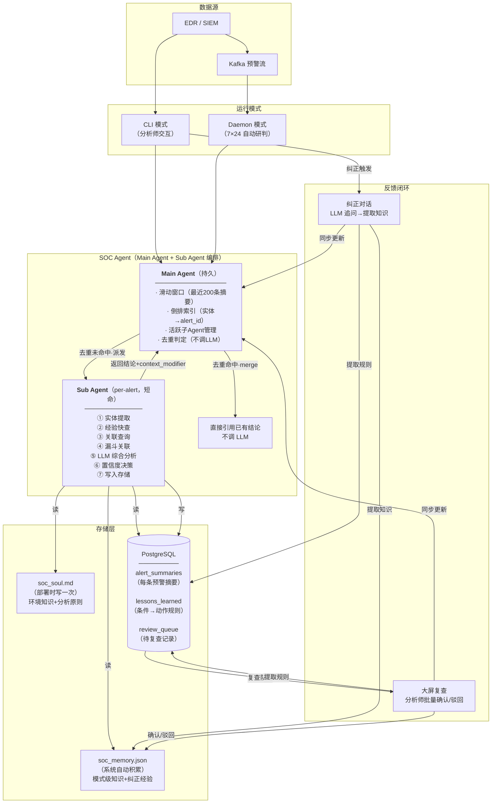
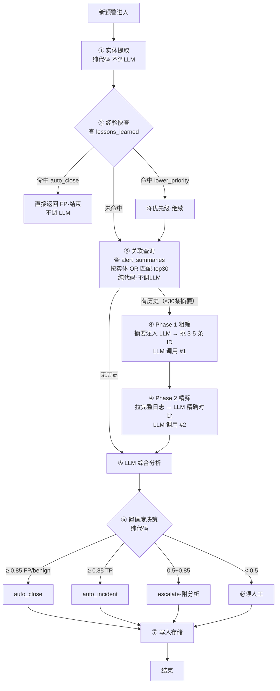
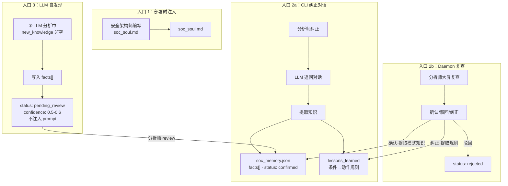

# SOC Agent 预警分析系统 — 完整方案 v4

> 基于 DeerFlow 架构学习 + Claude Code 源码研究 + 业界调研（Dropzone AI、AgentSOC、Vigil SOC、Radiant Security、D3 Security）
> 整理：2026-06-17 · v4（新增主 Agent + 子 Agent 编排层，吸收 Claude Code 设计模式）
> 参考：`.notes/research/hermes-vs-deerflow-agent-patterns.md`（Claude Code 可借鉴设计模式清单）

---

## 一、整体架构

### 1.1 架构总图



### 1.2 两条运行模式

| 维度 | Daemon 模式 | CLI 模式 |
|---|---|---|
| 触发 | Kafka 消费，7×24 | 分析师手动触发 |
| 处理量 | 全量预警 | 单条/少量 |
| 纠正方式 | 第二天大屏批量复查 | 当场追问对话 |
| 适合场景 | 日常自动研判 | 深入调查 + 知识注入 |
| 自动化程度 | 高置信自动处置 | 全部展示给人看 |

### 1.3 设计决策与依据

| 决策 | 选择 | 依据 |
|---|---|---|
| Agent 架构 | **Main Agent (持久) + Sub Agent (per-alert)** | 主Agent维护短期上下文（滑动窗口+倒排索引）实现免LLM去重；子Agent独立流水线互不干扰。参考 Claude Code 的 Leader + Teammate 模式（`QueryEngine.ts:184-207`） |
| 去重策略 | 主Agent倒排索引 + 基于证据重叠度判定 | 同 rule + 同 exe + 同 src_ip 在短窗口内重复 → 直接 merge，不调 LLM。参考 Claude Code `bashPermissions.ts:1483-1587` 的 speculative classifier |
| 子Agent生命周期 | 独立 AbortController + 超时 kill | 单个子Agent不响应 → kill，其他子Agent不受影响。参考 Claude Code `Task.ts:6-76` |
| 知识存储 | soc_memory.json | 复用 DeerFlow memory.json 结构 + `_apply_updates()` 逻辑 |
| 预警摘要 | PostgreSQL | 需要按实体/时间窗口查询，文件做不到；生产环境同构 |
| 经验规则 | PostgreSQL | 需要按 pattern 高效匹配；后续可加 trigram/JSONB 索引 |
| 反馈方式 | 追问对话(CLI) + 批量复查(daemon) | CLI 可交互；daemon 只能事后复查 |
| soul 维护 | 部署时写一次 | 运营分析师不会主动维护，后续学习走 memory |
| memory 粒度 | 模式级，不存具体 IP/用户 | 具体实体的靠 alert_summaries 关联查询覆盖 |
| 主Agent重启恢复 | pattern_index 从 alert_summaries 重建最近 N 条 | daemon 重启后滑动窗口短期失忆，但索引可重建 |

### 1.4 和 DeerFlow 的架构映射

| DeerFlow | SOC Agent |
|---|---|
| SOUL.md | soc_soul.md（分析原则+环境知识） |
| memory.json | soc_memory.json（facts 数组，同结构） |
| `_apply_updates()` | 合并新旧 facts（同逻辑） |
| `format_memory_for_injection()` | 注入 prompt（同逻辑） |
| `detect_correction()` | 纠正对话 → confidence 覆盖 |
| middleware 链 | 处理流水线（7 步） |
| config.yaml | config.yaml（模型/阈值/API） |

### 1.5 核心设计：Main Agent + Sub Agent 编排

> 参考 Claude Code 的 Leader + Teammate 模式（`QueryEngine.ts:184-207`、`Task.ts:6-76`）。

#### 为什么需要这个层次

v3 的单引擎方案有一个瓶颈：每条预警独立走完整流水线，即使与前一条几乎完全相同。批量扫描触发 20 条同类预警时，会重复调用 LLM 20 次。

Main Agent + Sub Agent 的核心价值：
1. **去重免算**：主 Agent 的倒排索引在 LLM 调用前拦截重复预警
2. **短期上下文**：主 Agent 维护最近 N 条预警的趋势，子 Agent 不只是看历史 DB，还能看到「刚才发生了什么」
3. **并行安全**：子 Agent 独立运行，超时 kill 不影响其他

#### Main Agent 维护的状态

```python
@dataclass
class MainAgentContext:
    # === 静资产（从存储加载） ===
    soul: str                              # soc_soul.md 全文
    
    # === 准静资产（从存储加载，按需更新） ===
    memory_facts: list[Fact]               # soc_memory.json 中 status=confirmed 的 facts
    
    # === 动资产（内存维护，重启时从 DB 重建） ===
    recent_window: deque[AlertDigest]      # 最近 200 条预警摘要（环形缓冲区）
    pattern_index: dict[PatternKey, list[str]]  # (rule_name, exe_name, src_ip) → alert_ids
    active_subs: dict[str, SubAgentHandle] # 当前正在运行的子 Agent
    
    # === 实时上下文（不持久化，重启清零） ===
    recent_trends: dict[str, TrendSignal]  # 最近 5 分钟的趋势信号
                                           # 例如: "10.0.3.5 在 3 分钟内触发了 5 条不同规则"
```

#### 去重判定逻辑（主 Agent，纯代码，不调 LLM）

```python
class MainAgent:
    def check_duplicate(self, alert: dict) -> AlertDigest | None:
        """查 pattern_index：同 rule + 同 exe + 同 src_ip 的近 N 条"""
        key = PatternKey(
            rule_name=alert["rule_name"],
            exe_name=extract_exe(alert),
            src_ip=alert.get("source_ip", "")
        )
        candidates = self.ctx.pattern_index.get(key, [])
        
        for alert_id in reversed(candidates[-5:]):  # 只看最近 5 条
            digest = self.ctx.recent_window.get(alert_id)
            if digest is None:
                continue
            # 证据重叠度 > 90% → 判定为重复
            if digest.evidence_overlap(alert) > 0.9:
                return digest
        return None

    async def on_alert(self, alert: dict) -> AlertResult:
        # 步骤 0（新增）：去重判定
        match = self.check_duplicate(alert)
        if match is not None:
            if match.confidence > 0.9:
                # 完全同类型 → 跳过所有 LLM 调用
                return AlertResult(
                    alert_id=alert["id"],
                    verdict=match.verdict,
                    confidence=match.confidence,
                    merged_from=match.alert_id,
                    skipped_llm=True
                )
            else:
                # 可能相关但不确定 → 标记 context_ref 供子 Agent 参考
                alert["_context_ref"] = match.alert_id
        
        # 步骤 1: 派发子 Agent
        sub = SubAgent(
            alert=alert,
            context_ref=alert.get("_context_ref"),
            main_ctx=self.ctx
        )
        self.ctx.active_subs[alert["id"]] = sub
        
        # 步骤 2: 异步执行（带超时）
        try:
            result = await asyncio.wait_for(sub.run(), timeout=120)
        except asyncio.TimeoutError:
            result = AlertResult(
                alert_id=alert["id"],
                verdict="uncertain",
                confidence=0.3,
                summary="子Agent超时"
            )
            sub.kill()
        
        # 步骤 3: 结果回写主 Agent 上下文
        if result.context_modifier:
            self.ctx = result.context_modifier(self.ctx)
        
        # 步骤 4: 更新滑动窗口
        self.ctx.recent_window.append(result.to_digest())
        self.ctx.pattern_index[key].append(alert["id"])
        del self.ctx.active_subs[alert["id"]]
        
        return result
```

#### 子 Agent 启动时注入上下文

```python
class SubAgent:
    def __init__(self, alert, context_ref, main_ctx):
        self.alert = alert
        self.context_ref = context_ref  # ← 如果命中相似预警，带上
        self.main_ctx = main_ctx        # 共享 soul + memory + 实时趋势
        self.abort = asyncio.Event()
    
    async def run(self) -> AlertResult:
        # 构建 prompt 时注入主 Agent 的实时上下文
        context = {
            "alert": self.alert,
            "context_ref": self._get_context_ref(),  # 相关历史的完整摘要
            "recent_trends": self.main_ctx.recent_trends,  # 最近 5 分钟趋势
            "soul": self.main_ctx.soul,
            "memory_facts": self.main_ctx.memory_facts,
        }
        
        # 走 7 步流水线...
        result = await self.pipeline(context)
        return result
    
    def _get_context_ref(self) -> dict | None:
        if not self.context_ref:
            return None
        prior = self.main_ctx.recent_window.get(self.context_ref)
        if prior:
            return {
                "alert_id": prior.alert_id,
                "verdict": prior.verdict,
                "summary": prior.summary,
                "relation_hint": f"同类预警 {prior.alert_id} 已判定为 {prior.verdict}"
            }
        return None
    
    def kill(self):
        self.abort.set()
```

#### 效率提升预估

| 场景 | v3（单引擎） | v4（主+子） |
|---|---|---|
| 扫描器 5 秒触发 20 条同类预警 | 20 次 LLM 调用 | 第 1 次走 Sub Agent，后 19 次主 Agent 直接 merge（**0 次 LLM**） |
| 同 IP 同 exe 再次触发（距上次 30s） | 重新研判 | 索引命中 → 复用结论 |
| 同 IP 不同 exe（距上次 30s） | 无所知 | 子 Agent 拿到「此 IP 刚触发过其他规则」的实时上下文 |

#### 重启恢复策略

```python
def rebuild_main_agent_from_db() -> MainAgentContext:
    """daemon 重启时从 alert_summaries 重建滑动窗口"""
    ctx = MainAgentContext()
    recent = db.query("""
        SELECT alert_id, rule_name, exe_name, src_ip, verdict, 
               confidence, summary, entities, alert_time
        FROM alert_summaries
        ORDER BY analyzed_at DESC
        LIMIT 200
    """)
    for row in recent:
        digest = AlertDigest.from_row(row)
        ctx.recent_window.append(digest)
        key = PatternKey(row["rule_name"], row["exe_name"], row["src_ip"])
        ctx.pattern_index[key].append(row["alert_id"])
    return ctx
```

重启后滑动窗口短期可用（最多丢失重启间隔内的预警上下文，但 index 和 recent_window 都能从 DB 重建）。

---

## 二、处理流水线（7 步详解）

每条预警进入后，依次走过 7 个步骤。大部分步骤是纯代码，只在④⑤两步调用 LLM。

### 2.1 流程总图



### 2.2 ① 实体提取（纯代码）

从预警原始数据中提取结构化实体，供后续关联查询使用。不调 LLM。

**提取维度**：

| 实体类型 | 来源 | 过滤规则 |
|---|---|---|
| IP 地址 | EDR 字段（source_ip, dest_ip）+ 正则补充 | 排除 127.x / 0.x / 169.254.x / 224.x |
| 域名 | EDR 字段（dest_domain）+ 正则补充 | 排除无点号的单段主机名 |
| exe 文件名 | process_name 取 basename | — |
| 文件哈希 | 正则（32-64 位十六进制） | 排除 < 32 位 |
| 注册表路径 | 正则（HK 开头路径） | — |
| URL | 正则（http/https） | — |
| 用户名 | EDR 字段 | — |

**提取优先级**：EDR 结构化字段优先，正则补充。结构化字段更准确。

```python
def extract_entities(alert: dict) -> AlertEntities:
    e = AlertEntities()

    # 结构化字段优先
    for f in [alert.get("source_ip"), alert.get("dest_ip")]:
        if f and is_real_ip(f):
            e.ips.append(f)

    proc = alert.get("process_name", "")
    if proc:
        e.exe_names.append(PureWindowsPath(proc).name.lower())

    # 正则补充（从 command_line、raw_log 等文本字段中）
    blob = " ".join([alert.get(f, "") for f in ["command_line", "raw_log", "target"]])
    e.ips.extend(ip for ip in re.findall(r'\b(?:\d{1,3}\.){3}\d{1,3}\b', blob)
                  if is_real_ip(ip) and ip not in e.ips)
    e.file_hashes.extend(re.findall(r'\b[A-Fa-f0-9]{32,64}\b', blob))

    return e

def is_real_ip(ip: str) -> bool:
    return not ip.startswith(("127.", "0.", "169.254.", "224."))
```

### 2.3 ② 经验快查（纯代码）

查询 lessons_learned 表，看是否命中已知 pattern。命中则跳过后续所有 LLM 调用。

**匹配逻辑**：

```python
def check_lessons(alert: dict, entities: AlertEntities) -> LessonMatch | None:
    conditions = []

    # 构建 pattern 片段
    for exe in entities.exe_names:
        conditions.append(("exe", exe))
    rule = alert.get("rule_name", "")
    if rule:
        conditions.append(("rule", rule))
    for ip in entities.ips:
        conditions.append(("ip", ip))

    for key, value in conditions:
        rows = db.query(
            "SELECT * FROM lessons_learned WHERE pattern LIKE ?",
            [f"%{key}:{value}%"]
        )
        if rows:
            return LessonMatch(row=rows[0], matched_on=f"{key}:{value}")

    return None
```

**三种命中结果**：

| 命中 action | 后续动作 | LLM 调用 |
|---|---|---|
| `auto_close` | 直接返回 FP，结束 | 0 次 |
| `lower_priority` | 降低优先级，继续走流水线 | 正常调用 |
| `flag` | 打标记，继续走流水线 | 正常调用 |

### 2.4 ③ 关联查询（纯代码）

查询 alert_summaries 表，按实体 OR 匹配，取 top 30 条历史摘要。宁可多召回不漏。

**查询 SQL**：

```sql
SELECT alert_id, alert_time, exe_name, src_ip, dst_ip,
       verdict, confidence, summary, alert_type
FROM alert_summaries
WHERE (rule_name = ?)
   OR (exe_name = ?)
   OR (src_ip = ? OR dst_ip = ?)
   OR (domain = ?)
   OR (user_name = ?)
ORDER BY alert_time DESC
LIMIT 30
```

**参数按实体填充**：每个维度独立匹配，OR 取并集。交给 Phase 1 LLM 去筛。

**返回结果**：
- 0 条 → 无历史，跳到⑤直接分析
- 1~30 条 → 进入④漏斗关联

### 2.5 ④ 漏斗关联（两轮 LLM）

将关联查询拿到的摘要经过两轮筛选，从 30 条缩到 3-5 条完整日志，用于精确对比。

#### Phase 1：粗筛（30 条摘要 → 挑 3-5 条 ID）

```python
PHASE1_PROMPT = """<alert_correlation_phase1>
当前新预警: {current_alert}

以下是可能有关系的历史预警摘要，请挑出最相关的 3-5 条（返回 ID 列表）。
判断标准：同类行为、同程序、同攻击模式、同目标。不相关的不要选。

{formatted_summaries}
</alert_correlation_phase1>

只返回 JSON: {"related_ids": ["ALT-001", ...], "reason": "一句话关联理由"}"""
```

**输入**：30 条摘要，每条约 50 tokens → 共 1.5K tokens
**输出**：3-5 个 alert_id
**目的**：只挑出最相关的，避免拉无关的完整日志浪费 token

#### Phase 2：精筛（拉完整日志 → 精确对比）

```python
PHASE2_PROMPT = """<alert_correlation_phase2>
当前新预警完整日志:
{current_alert_full}

以下是最相关的历史预警完整日志:
{full_logs}

请精确对比：
1. 当前预警是否与某条历史预警属于同一类事件？
2. 如果是，引用历史调查结论
3. 如果有新发现或差异，指出
</alert_correlation_phase2>"""
```

**输入**：3-5 条完整日志，每条约 500 tokens → 共 1.5-2.5K tokens
**输出**：关联分析结论（结构化文本）
**目的**：用完整日志做精确判断，不是只看摘要

#### Token 消耗分析

| 方案 | 总 Token | 准确率 |
|---|---|---|
| 暴力全塞原始日志（30 条） | 20K+ | 高但贵 |
| 只用摘要，不拉完整日志 | 1.5K | 快但缺精确对比 |
| **漏斗式（本方案）** | **~6K** | **高且省** |

### 2.6 ⑤ LLM 综合分析

这是核心步骤。将所有上下文组装后交给 LLM，产出最终的判断和摘要。

#### 输入组装

参考 Claude Code 的 prompt 组装方式（`QueryEngine.ts:316-325`、`api.ts:119-266`），将 prompt 拆分为可缓存和不可缓存两部分：

```
LLM 收到的输入：
├── [cacheable] System Prompt（含分析原则 + 输出格式要求）
├── [cacheable] soc_soul.md（全文注入，几乎不变 → 可缓存）
├── [volatile]  soc_memory.json（status=confirmed 的 facts，按实体相关性筛选）
├── [volatile]  主Agent实时上下文（近5分钟趋势·context_ref）
├── [volatile]  关联结果（④的 Phase 2 产出，或空）
└── [volatile]  当前预警完整数据
```

> 使用 Anthropic API 的 `cache_control: {type: "ephemeral"}` 标记 cacheable block。soul 不变时每次省 ~2K tokens。参考 Claude Code `api.ts:1373-1379`。

#### System Prompt

```
你是一个安全分析师 AI 助手，负责分析安全预警。

<soul>
{soc_soul.md 全文}
</soul>

<memory>
{soc_memory.json 中 status=confirmed 的 facts}
</memory>

## 判定标准

- true_positive：确认的恶意行为，有明确恶意证据
- false_positive：已知合法工具/行为被误拦，能解释为什么是误报
- benign_positive：行为确实发生了，但属于正常业务

## 置信度
- ≥ 0.85: 高置信，可自动化处理
- 0.5-0.85: 中置信，建议人工复核
- < 0.5: 低置信，必须人工

## 关联分析规则
- 历史有多条同类型 FP → 当前大概率也是 FP（但要检查差异）
- 同 IP/域名在多台机器出现 → 提高警惕
- 首次出现的模式 → 默认中低置信

## 输出格式（严格 JSON）
{
    "verdict": "true_positive | false_positive | benign_positive",
    "confidence": 0.0-1.0,
    "summary": "一句话总结（≤80字，含关键程序/IP/行为/结论）",
    "investigation": "详细分析（3-5句）",
    "alert_type": "malware | lateral_movement | exfiltration | scanning | credential_access | persistence | other",
    "severity": "critical | high | medium | low | info",
    "recommendation": "建议动作",
    "iocs": ["提取的 IOC 列表"],
    "new_knowledge": null | { "content": "...", "category": "..." }
}
```

#### 输出处理

```python
async def analyze(alert, soul, memory_facts, correlation_result):
    result = await llm.call(system=SYSTEM_PROMPT, user=build_user_prompt(...))

    # 如果 LLM 主动发现了新知识 → 写入 memory（pending 状态）
    if result.get("new_knowledge"):
        add_fact(
            content=result["new_knowledge"]["content"],
            category=result["new_knowledge"]["category"],
            confidence=0.55,
            source="llm_discovery",
            status="pending_review"
        )

    return result
```

### 2.7 ⑥ 置信度决策（纯代码）

参考 Claude Code 的多级权限决策管道（`types/permissions.ts:24-44`、`useCanUseTool.tsx:28-191`），决策不只是看 confidence 阈值，而是多层漏斗：

```
经验规则(lessons_learned) → 运行模式(mode) → 分类器(相似度) → 置信度阈值 → 人工确认
         ↓                       ↓               ↓               ↓            ↓
    auto_close / flag        daemon=less    similarity>0.9    ≥0.85 auto    <0.5 human
                            aggressive     直接复用
```

决策实现：

```python
def decide(analysis: dict, mode: str, 
           lesson_match: LessonMatch | None = None,
           similarity_score: float = 0.0) -> Decision:
    """
    五层决策链：
    L1: 经验规则（② 已检查）
    L2: 运行模式
    L3: 分类器相似度（新增）
    L4: LLM 置信度阈值
    L5: 人工确认
    """
    c = analysis["confidence"]
    v = analysis["verdict"]
    
    # L2: 运行模式覆盖
    if mode == "daemon" and c < 0.85:
        return Decision(action="queue_for_review", needs_human=True)
    
    # L3: 分类器相似度预判（新增）—— 历史有高相似的同类型，直接复用
    if similarity_score > 0.9 and lesson_match is None:
        return Decision(action="inherit_prior", needs_human=False)
    
    # L4: LLM 置信度阈值
    if c >= 0.85:
        if v in ("false_positive", "benign_positive"):
            return Decision(action="auto_close", needs_human=False)
        else:
            return Decision(action="auto_incident", needs_human=False)
    elif c >= 0.5:
        return Decision(action="escalate", needs_human=True)
    else:
        # L5: 必须人工
        return Decision(action="human_required", needs_human=True)
```

### 2.8 ⑦ 写入存储

分析完成后，将结果写入各存储。

| 写入目标 | 写什么 | 条件 |
|---|---|---|
| `alert_summaries` | 实体 + verdict + summary + alert_type | 每条预警都写 |
| `review_queue` | alert_id + AI 判断 + 详细分析 | 仅 daemon 模式 + 低置信 |
| `soc_memory.json` | new_knowledge（pending 状态） | 仅 LLM 主动发现时 |

```python
def write_results(alert, entities, analysis, decision):
    db.insert("alert_summaries", {
        "alert_id": alert["id"],
        "rule_name": alert["rule_name"],
        "alert_time": alert["alert_time"],
        "exe_name": next(iter(entities.exe_names), ""),
        "src_ip": alert.get("source_ip", ""),
        "dst_ip": alert.get("dest_ip", ""),
        "domain": next(iter(entities.domains), ""),
        "user_name": alert.get("user_name", ""),
        "entities": json.dumps(entities.to_dict()),
        "verdict": analysis["verdict"],
        "confidence": analysis["confidence"],
        "summary": analysis["summary"],
        "alert_type": analysis["alert_type"],
        "severity": analysis["severity"],
        "mode": decision.mode,
    })

    if decision.action == "queue_for_review":
        db.insert("review_queue", {
            "alert_id": alert["id"],
            "ai_verdict": analysis["verdict"],
            "ai_confidence": analysis["confidence"],
            "ai_summary": analysis["summary"],
            "ai_investigation": analysis["investigation"],
        })
```

### 2.9 LLM 调用统计

| 场景 | LLM 调用次数 | Token 消耗 | 说明 |
|---|---|---|---|
| 主Agent去重命中 | **0** | 0 | 纯内存匹配，不调 LLM |
| 分类器预判高置信命中 | **0** | 0 | 异步分类器直接判定（新增） |
| 命中经验规则（auto_close） | **0** | 0 | lessons_learned 命中 |
| 无历史预警 | **1**（⑤综合分析） | ~3K | — |
| 带 context_ref（相似预警） | **1**（⑤综合分析，简化版） | ~2K | 子Agent拿到历史结论，简化 prompt |
| 有历史 + 漏斗关联 | **3**（④粗筛 + ④精筛 + ⑤综合分析） | ~6K | — |

### 2.10 预警去重与预判（v4 新增）

v3 的去抖动方案（60s 窗口查 DB）有一个问题：第 2 条预警到达时第 1 条可能还没写入 DB。

v4 方案：

**1. 主 Agent 内存去重（主路径）**

见 1.5 节：主 Agent 维护 `pattern_index` + `recent_window`，在派发子 Agent 之前拦截重复预警。纯内存操作，零延迟。

**2. 异步分类器预判（辅助路径）**

参考 Claude Code 的 speculative classifier（`bashPermissions.ts:1483-1587`）：

```python
async def handle_alert_with_prejudge(alert):
    # 步骤 ②③ 同步进行的同时，后台启动分类器
    speculative = asyncio.create_task(classifier.prejudge(alert))
    
    lesson = check_lessons(alert)        # ② 同步查 DB
    history = correlate(alert)           # ③ 同步查 DB
    
    classifier_result = await speculative  # 等待分类器完成
    
    # 分类器高置信命中 → 直接跳过 LLM
    if (classifier_result.confidence == "high" 
        and classifier_result.action == "auto_close"):
        return AlertResult(verdict="false_positive", 
                          confidence=0.92,
                          source="classifier",
                          skipped_llm=True)
    
    # 继续走 ④⑤ 正常流水线
```

效果：很多低风险预警在 LLM 调用前就被两步过滤（主Agent去重 + 分类器预判）。

**3. DB 去重（兜底）**

如果主 Agent 刚重启、窗口还空的场景，降级查 DB：

```
条件：同 rule_name + 同 src_ip + 同 exe_name
窗口：60 秒
实现：处理前查 alert_summaries 是否有 60s 内同条件记录
      有 → 跳过，返回已有结论
      无 → 正常处理
```

---

## 三、存储设计

理解了流水线后，再看存储设计。存储是流水线的"仓库"：流水线读它、写它。

### 3.1 三层存储定位

```
                    权威性高
                      ↑
   soc_soul.md        │     ← 部署时写一次，几乎不动
   （静态环境知识）     │        分析原则、网段说明、已知 IOC
                      │
   soc_memory.json    │     ← 系统自动积累
   （模式级知识）       │        从纠正对话和 LLM 发现中提取
                      │        facts 数组，confidence + status 区分
                      │
   PostgreSQL ────────┤     ← 系统自动写入
   ├ alert_summaries  │        每条预警的摘要 → ③关联查询读
   ├ lessons_learned  │        条件→动作规则 → ②经验快查读
   └ review_queue     │        daemon 待复查 → 大屏复查读
                      │
                    查询频率高
```

**流水线读写关系**：

| 流水线步骤 | 读 | 写 |
|---|---|---|
| ① 实体提取 | — | — |
| ② 经验快查 | lessons_learned | — |
| ③ 关联查询 | alert_summaries | — |
| ④ 漏斗关联 | alert_summaries（拉完整日志） | — |
| ⑤ LLM 综合分析 | soc_soul.md + soc_memory.json | soc_memory.json（LLM 发现时） |
| ⑥ 置信度决策 | — | — |
| ⑦ 写入存储 | — | alert_summaries + review_queue |

### 3.2 soc_soul.md — 部署时写一次

安全架构师/lead 在项目上线时写好，以后几乎不动。

```markdown
# SOC Agent Soul

## 分析原则
- 同 exe + 同规则，历史全 FP 的，先检查有没有细微差异再跟判
- 跨 ≥3 台机器出现同一可疑 IP，提高警惕
- 首次出现的模式，默认中低置信，不自动处理
- 高置信自动处理只做关闭和建事件，不做隔离/封禁

## 已批准工具
- SecurityScan v2.3 — 漏洞扫描，每周三凌晨 2 点
- AngryIPScanner — 安全团队资产盘点

## 网段说明
- 10.0.1.0/24  开发网段
- 10.0.5.0/24  财务网段，月末有异常流量属正常
- 10.0.8.0/24  DMZ，公网暴露

## 已知恶意 IOC
- 185.220.101.35 — Cobalt Strike C2（微步 2026-04）

## 运维窗口
- 2026-06 AD 迁移，异常认证事件预期增多
```

**注入方式**：⑤ LLM 综合分析时全文注入（通常几百行，~2-3K tokens）。

### 3.3 soc_memory.json — 复用 DeerFlow 结构

```json
{
  "environment": {
    "network_zones": "10.0.1.0/24 开发; 10.0.5.0/24 财务; 10.0.8.0/24 DMZ",
    "approved_tools": "SecurityScan v2.3 漏扫; AngryIPScanner 资产盘点",
    "known_threats": "185.220.101.35 C2; evil.exe SHA256:abc123 钓鱼",
    "current_operations": "2026-06 AD迁移"
  },
  "facts": [
    {
      "id": "f001",
      "content": "ProcExec-SuspiciousScanner 规则主要由 SecurityScan 触发，历史基本为 FP",
      "category": "correction",
      "confidence": 0.92,
      "source": "ALT-0042",
      "status": "confirmed",
      "created_at": "2026-05-18"
    },
    {
      "id": "f002",
      "content": "10.0.5.0/24 财务网段月末对账期间数据库访问属正常业务",
      "category": "environment",
      "confidence": 0.85,
      "source": "ALT-0038",
      "status": "confirmed",
      "created_at": "2026-05-15"
    },
    {
      "id": "f010",
      "content": "10.0.3.0/24 网段近期频繁触发 PowerShell 编码执行规则，可能存在新攻击",
      "category": "observation",
      "confidence": 0.55,
      "source": "llm_discovery",
      "status": "pending_review",
      "created_at": "2026-05-17"
    }
  ]
}
```

**三个 status**：

| status | 含义 | 注入 prompt？ | 来源 |
|---|---|---|---|
| `confirmed` | 已确认 | **是** | 纠正对话提取 / 分析师确认 |
| `pending_review` | 待确认 | **否**（避免误导 LLM） | LLM 自发现 |
| `rejected` | 已驳回 | **否** | 分析师驳回 |

**粒度控制**：memory 只存模式级知识，不存具体 IP/用户。
- ✅ "SecurityScan 是公司漏扫工具"（适用所有机器）
- ✅ "财务网段月末对账有异常流量"（适用整个网段）
- ❌ "张三的 PC 有 USB 许可"（太具体，放 alert_summaries 关联查询即可）

**注入方式**：⑤ LLM 综合分析时，只注入 `status=confirmed` 的 facts，按实体相关性排序。

### 3.4 alert_summaries — 每条预警的摘要

写入：⑦ 写入存储。读取：③ 关联查询 + ④ 漏斗关联（Phase 2 拉完整日志时）。

```sql
CREATE TABLE alert_summaries (
    alert_id TEXT PRIMARY KEY,
    rule_name TEXT NOT NULL,
    alert_time TIMESTAMPTZ NOT NULL,

    exe_name TEXT,
    src_ip TEXT,
    dst_ip TEXT,
    dst_port TEXT,
    domain TEXT,
    file_hash TEXT,
    user_name TEXT,
    entities JSONB NOT NULL DEFAULT '{}'::jsonb,

    verdict TEXT NOT NULL,
    confidence DOUBLE PRECISION NOT NULL,
    summary TEXT NOT NULL,
    alert_type TEXT,
    severity TEXT,

    analyzed_at TIMESTAMPTZ,
    corrected_at TIMESTAMPTZ,
    original_verdict TEXT,
    mode TEXT NOT NULL DEFAULT 'cli'
);

CREATE INDEX idx_sum_rule ON alert_summaries(rule_name);
CREATE INDEX idx_sum_exe ON alert_summaries(exe_name);
CREATE INDEX idx_sum_ip ON alert_summaries(src_ip, dst_ip);
CREATE INDEX idx_sum_domain ON alert_summaries(domain);
CREATE INDEX idx_sum_user ON alert_summaries(user_name);
CREATE INDEX idx_sum_time ON alert_summaries(alert_time DESC);
CREATE INDEX idx_sum_entities_gin ON alert_summaries USING GIN (entities);
```

### 3.5 lessons_learned — 条件→动作规则

写入：纠正对话后提取。读取：② 经验快查。

存的是**可自动执行的规则**，不是知识描述：

```sql
CREATE TABLE lessons_learned (
    id BIGSERIAL PRIMARY KEY,
    pattern TEXT NOT NULL,
    action TEXT NOT NULL,       -- auto_close / lower_priority / flag
    lesson TEXT NOT NULL,
    source_alert_id TEXT,
    hit_count INTEGER NOT NULL DEFAULT 0,
    confidence DOUBLE PRECISION NOT NULL DEFAULT 0.8,
    created_at TIMESTAMPTZ NOT NULL DEFAULT now()
);

CREATE INDEX idx_lessons_pattern ON lessons_learned(pattern);
CREATE INDEX idx_lessons_confidence ON lessons_learned(confidence DESC);
```

| pattern | action | lesson |
|---|---|---|
| `exe:scanner.exe + rule:ProcExec-SuspiciousScanner` | auto_close | SecurityScan v2.3 漏扫工具触发 |
| `exe:ngrok.exe` | lower_priority | 开发团队偶尔做调试用 |
| `src_ip:10.0.1.100 + rule:VPN-AnomalousLocation` | auto_close | VPN 网关，出差员工从各地登录 |

### 3.6 review_queue — Daemon 模式待复查

写入：⑦ 写入存储（仅 daemon 模式 + 低置信）。读取：大屏复查。

```sql
CREATE TABLE review_queue (
    id BIGSERIAL PRIMARY KEY,
    alert_id TEXT NOT NULL,
    alert_time TIMESTAMPTZ NOT NULL,
    ai_verdict TEXT NOT NULL,
    ai_confidence DOUBLE PRECISION NOT NULL,
    ai_summary TEXT NOT NULL,
    ai_investigation TEXT,
    status TEXT NOT NULL DEFAULT 'pending',
    reviewed_at TIMESTAMPTZ,
    reviewer_note TEXT,
    created_at TIMESTAMPTZ NOT NULL DEFAULT now()
);

CREATE INDEX idx_review_status ON review_queue(status, created_at);
```

---

## 四、反馈闭环

流水线只"读"和"写"存储，但存储的**内容质量**靠反馈闭环持续提升。

### 4.1 三条知识入口



### 4.2 CLI 纠正对话流程

```bash
$ soc-agent correct ALT-0042 --verdict false_positive

💭 我把 SecurityScan 误判为恶意扫描工具，
   可能是因为不了解公司环境中有这个已批准工具

我有几个问题想确认：
  1. scanner.exe 是你们批准的安全工具吗？叫什么名字？
  2. 它定期运行还是偶尔运行？

❓ scanner.exe 是你们批准的安全工具吗？叫什么名字？
  → SecurityScan v2.3，公司买的漏扫工具

❓ 它定期运行还是偶尔运行？
  → 每周三凌晨定时跑

还有什么要补充的吗？（回车跳过）
  → 

✅ 已保存 1 条知识到 soc_memory.json（status: confirmed）
✅ 已保存 1 条规则到 lessons_learned（以后同类自动关闭）
✅ 已更新 ALT-0042 verdict → false_positive
```

**纠正涉及三个 Prompt**：
1. 反思+追问生成（LLM 调用 #1）
2. 知识提取（LLM 调用 #2）
3. 规则提取（同一次调用，一起输出）

### 4.3 Daemon 复查流程

```
第二天，分析师打开复查大屏：

┌─────────────────────────────────────────────────────┐
│ 待复查: 23 条  │  已确认: 156 条  │  已纠正: 8 条   │
├──────────┬──────────┬──────────┬────────────────────┤
│ 预警ID    │ AI判断    │ 置信度    │ 一句话摘要          │
├──────────┼──────────┼──────────┼────────────────────┤
│ ALT-0150 │ TP       │ 0.72     │ 10.0.3.5 异常PS... │
│ ALT-0149 │ FP       │ 0.68     │ scanner.exe 触发... │
│ ...      │          │          │                    │
└──────────┴──────────┴──────────┴────────────────────┘

操作：
  [确认] → AI 判断正确 → 提取模式知识（如果有价值）
  [纠正] → 选正确 verdict → 可选填原因 → 自动提取知识+规则
  [批量确认] → 全部正确 → 不提取知识（太多了，没有新信息）
```

**Daemon 复查 vs CLI 纠正**：
- CLI：深度追问 2-3 个问题，提取详细知识
- Daemon 复查：快速确认/纠正，只提取高价值知识（避免每条都追问）

### 4.4 pending_review 知识的触达路径

pending 状态的知识**不注入 prompt**（避免误导 LLM），但需要让分析师看到并确认。三条路径：

#### 路径 1：CLI 专有命令

```bash
$ soc-agent knowledge review

📋 待确认知识（3 条）：

  #1 [observation] confidence: 0.55
     "10.0.3.0/24 网段近期频繁触发 PowerShell 编码执行规则"
     来源: LLM 自发现 · 2026-05-17
     → [c]确认 [r]驳回 [s]跳过: c
     ✅ 已确认

  #2 [environment] confidence: 0.58
     "10.0.1.55 的 nmap 扫描行为可能属于开发网段月度扫描"
     → [c]确认 [r]驳回 [s]跳过: r
     "驳回原因（可选）: 这是攻击者在做内网探测"
     ✅ 已驳回
```

#### 路径 2：纠正对话末尾顺带问

```
✅ 已保存 1 条知识到 soc_memory.json
✅ 已保存 1 条经验规则

💡 顺便问一下，我之前有一个观察想确认：
   "10.0.3.0/24 网段近期频繁触发 PowerShell 编码执行规则"
   这个观察对吗？
   → [y]对 [n]不对 [回车跳过]: y
   ✅ 已确认
```

逻辑：纠正对话结束后，查有没有和当前预警实体相关的 pending_review 条目，有则顺带问。利用分析师已在思考相关上下文的时机。

#### 路径 3：Daemon 复查大屏

```
┌─ 待确认知识（3 条）─────────────────────────┐
│ #1 10.0.3.0/24 频繁PS执行  → [确认] [驳回]  │
│ #2 nmap 可能是月度扫描      → [确认] [驳回]  │
│ #3 svchost 非标准路径常见    → [确认] [驳回]  │
└───────────────────────────────────────────────┘
```

### 4.5 知识老化

- facts 超过 180 天未命中 → 标记 `stale: true` → 降低注入优先级
- lessons_learned 的 hit_count 连续 90 天为 0 → 标记待 review
- soc_memory.json facts 数量超过 100 → 提醒分析师做一轮整理

---

## 五、Prompt 设计汇总

### 5.1 纠正追问 Prompt

```
你判断错了。原始判断: {ai_verdict}，分析师纠正: {analyst_verdict}。
分析师备注: {analyst_note}
预警详情: {alert_summary}

请反思为什么判错，然后提 2-3 个追问帮您理解环境。
不要问预警里已有的信息。

输出 JSON:
{
    "self_reflection": "一句话反思",
    "questions": ["问题1", "问题2", "问题3"]
}
```

### 5.2 知识提取 Prompt

```
以下是纠正对话记录：
{conversation}

提取可复用的模式级知识（不要提取具体 IP/用户级别的）。
区分"一次性事实"和"可复用知识"：
- "这台机器在重装" → 一次性，不提取
- "SecurityScan 是我们的漏扫工具" → 可复用，提取

输出 JSON:
{
    "facts": [
        { "content": "...", "category": "correction|environment|approved|threat", "confidence": 0.0-1.0 }
    ],
    "lesson": {
        "pattern": "exe:xxx + rule:yyy",
        "action": "auto_close | lower_priority",
        "lesson": "人能读的解释"
    }
}
```

---

## 六、项目结构与开发路线图

### 6.1 项目结构

```
soc-agent/
├── config.yaml              # 模型/API/阈值配置
├── soc_soul.md              # 静态环境知识（部署时写一次）
├── soc_memory.json          # 动态知识（系统自动积累）
├── docker-compose.yml       # 本地 PostgreSQL + Kafka/Redpanda 开发环境
├── .env.example             # DATABASE_URL / KAFKA_BROKERS 等本地配置示例
│
├── cli.py                   # CLI 入口
├── daemon.py                # Daemon 入口（Kafka 消费 + 优雅关闭）
│
├── agent/
│   ├── main_agent.py        # Main Agent（持久·去重·编排）
│   ├── main_context.py      # MainAgentContext 数据类
│   ├── sub_agent.py         # Sub Agent（per-alert·7步流水线）
│   └── agent_mailbox.py     # 主-子 Agent 通信
│
├── pipeline/
│   ├── extractor.py         # ① 实体提取
│   ├── lesson_check.py      # ② 经验快查
│   ├── correlator.py        # ③ 关联查询
│   ├── funnel.py            # ④ 漏斗关联（Phase1+Phase2）
│   ├── classifier.py        # 异步分类器预判（新增·参考 Claude Code bashPermissions）
│   ├── analyzer.py          # ⑤ LLM 综合分析
│   ├── prompt_builder.py    # ⑤ prompt 组装（含缓存感知·新增）
│   ├── decider.py           # ⑥ 置信度决策（5 层决策链）
│   └── writer.py            # ⑦ 写入存储
│
├── events/
│   ├── signal.py            # Signal 响应式事件（参考 Claude Code signal.ts）
│   ├── hook_executor.py     # Hook 生命周期管理（参考 hookEvents.ts）
│   └── hooks/               # 内置 hooks
│       ├── progress_hook.py # 流水线进度推送
│       └── audit_hook.py    # 审计日志
│
├── memory/
│   ├── memory.py            # soc_memory.json 管理（复用 DeerFlow 结构）
│   ├── apply_updates.py     # 合并新旧 facts
│   ├── inject.py            # 格式化注入 prompt
│   └── dream.py             # 后台知识整合去重（参考 Claude Code autoDream.ts）
│
├── feedback/
│   ├── correct_dialog.py    # CLI 纠正追问对话
│   ├── knowledge_extract.py # 知识提取
│   └── review_processor.py  # Daemon 复查处理
│
├── db/
│   ├── migrations/          # PostgreSQL schema 迁移
│   ├── schema.sql           # 当前 PostgreSQL schema 快照
│   ├── queries.py           # 查询函数
│   └── models.py            # 数据模型
│
└── utils/
    ├── accumulator.py       # EndTruncatingAccumulator（安全截断·参考 Claude Code）
    └── shutdown.py          # 多级优雅关闭（参考 gracefulShutdown.ts）
```

### 6.2 开发路线图

| Phase | 目标 | 周期 | 核心交付 |
|---|---|---|---|
| **Phase 1** | MVP — CLI 基本可用 | 2 周 | ①实体提取 + ⑤LLM分析（无关联）+ ⑦写入 + `analyze`/`correct` 命令 |
| **Phase 2** | 关联能力 + 主Agent去重 | 2 周 | ③关联查询 + ④漏斗关联 + ②经验快查 + MainAgent去重 + pattern_index |
| **Phase 3** | 学习能力 + 分类器预判 | 2 周 | soc_memory.json 管理 + 纠正对话 + facts status 管理 + 异步分类器 |
| **Phase 4** | Daemon 模式 + 子Agent并行 | 2 周 | Kafka 消费 + SubAgent并行 + review_queue + 优雅关闭 + 去重预判 |
| **Phase 5** | 增强 | 按需 | 威胁情报集成 / 复查大屏 UI / MITRE ATT&CK / 知识老化 / Dream整合 |

---

## 七、业界调研摘要

| 来源 | 关键启示 |
|---|---|
| [Dropzone AI - Context Memory](https://www.dropzone.ai/blog/context-memory-ai-soc-analyst) | 三阶段 Collect→Comprehend→Conclude；四类上下文；70% FP 降低 |
| [Dropzone AI - 300+ 部署经验](https://www.dropzone.ai/blog/ai-soc-analyst-lessons-learned-at-scale) | 先降噪再 AI；SOAR 处理确定性预警；分阶段上线 |
| [AgentSOC 论文](https://arxiv.org/html/2604.20134v1) | 四层架构；闭环 Sense→Reason→Act；506ms 延迟 |
| [Vigil SOC](https://github.com/Vigil-SOC/vigil) | 12 Agent + Workflow；confidence 0.90 自动批准 |
| [Radiant Security](https://thehackernews.com/expert-insights/2025/11/continuous-feedback-loops-why-training.html) | Day 90: 70-80% FP 降低；静态 AI 会退化 |

---

## 八、技术实现：从 DeerFlow 拆零件

### 路线：引包搭新项目（不是 Fork，不是从零写）

用 LangGraph 画自己的 SOC Agent 图（7 步流水线），从 DeerFlow 拆组件拼装。

### 复用的组件

| DeerFlow 组件 | 怎么用 | 改动量 |
|---|---|---|
| `models/factory.py` | 直接 import `create_chat_model()` | 零 |
| `memory/updater.py` | 搬过来，改 MEMORY_UPDATE_PROMPT | 小 |
| `memory/storage.py` + `queue.py` | 搬过来（原子写入 + 30s 去抖动） | 零 |
| `middleware/` 部分 | 挑着搬（summarization, error handling） | 小 |
| `config/app_config.py` | 搬过来（热重载 + YAML） | 小 |
| `tools/sync.py` + `types.py` | 直接 import（async→sync 桥接） | 零 |

### 不搬的东西

| 组件 | 不搬的原因 |
|---|---|
| DeerFlowClient | SOC 走 Kafka 消费，不走 chat |
| Gateway/Auth | 部署环境自己管 |
| IM Channels | SOC 走 Kafka/大屏 |
| Skills | 7 步流水线固定，不需要动态加载 |
| Persistence | 用自己的 PostgreSQL schema 存 alert |
| Sandbox | 除非要执行脚本分析日志 |

### SOC Agent 图（两层）

**主 Agent 图（去重 + 派发）**：

```python
# main_agent.py
g = StateGraph(MainAgentState)
g.add_node("dedup", dedup_check)              # 去重判定（纯代码）
g.add_node("dispatch", dispatch_to_subagent)  # 派发子Agent
g.add_node("merge", merge_with_prior)         # 合并到已有预警
g.add_node("update_ctx", update_main_context) # 更新主Agent滑动窗口+索引

g.set_entry_point("dedup")
g.add_conditional_edges("dedup", route, {
    "duplicate": "merge",
    "new": "dispatch"
})
g.add_edge("dispatch", "update_ctx")
g.add_edge("merge", "update_ctx")
g.add_edge("update_ctx", END)
```

**子 Agent 图（7 步流水线 + 分类器预判）**：

```python
# sub_agent.py
g = StateGraph(SubAgentState)
g.add_node("extract", extract_entities)              # ① 纯代码
g.add_node("check_exp", check_experience)             # ② 查 DB
g.add_node("classify_bg", async_classifier_prejudge)  # 分类器预判（后台并行·新增）
g.add_node("correlate", correlate_alerts)             # ③ 查 DB
g.add_node("funnel_phase1", funnel_phase1)            # ④ Phase 1 LLM
g.add_node("funnel_phase2", funnel_phase2)            # ④ Phase 2 LLM
g.add_node("analyze", llm_analysis)                   # ⑤ LLM
g.add_node("decide", confidence_decision)             # ⑥ 5层决策
g.add_node("write", write_results)                    # ⑦ 写 DB

g.set_entry_point("extract")
g.add_edge("extract", "check_exp")
# 分类器与 ②③ 并行执行
g.add_edge("extract", "classify_bg")
g.add_conditional_edges("check_exp", route, {"skip": "write", "continue": "correlate"})
g.add_edge("correlate", "funnel_phase1")
g.add_edge("funnel_phase1", "funnel_phase2")
g.add_edge("funnel_phase2", "analyze")

# 在 analyze 之前等待分类器结果（join）
# 如果分类器已高置信命中 → 跳过 LLM 直接 decide
g.add_conditional_edges("analyze", route_classifier, {
    "classifier_hit": "decide",  # 分类器结果作为参考
    "normal": "decide"
})
g.add_conditional_edges("decide", route, {
    "auto": "write", "escalate": "write", "retry": "analyze"
})
g.add_edge("write", END)
```

分类器预判的关键设计（参考 Claude Code `bashPermissions.ts:1555-1587`）：

```python
async def async_classifier_prejudge(state: SubAgentState) -> SubAgentState:
    """后台运行，与步骤②③并行。结果缓存到 state，步骤⑤使用。"""
    command = f"{state.exe_name} {state.rule_name}"
    descriptions = [state.exe_name, state.rule_name]
    
    result = await classifier.classify(command, descriptions, mode='allow')
    
    state.classifier_result = result
    if result.matches and result.confidence == 'high':
        state.classifier_hit = True
        state.classifier_action = result.action  # auto_close / lower_priority
    
    return state
```
| [D3 Security](https://d3security.com/resources/5-architectural-flaws-agentic-ai-soc/) | 多 Agent 5 个结构性缺陷；统一推理引擎更优 |
