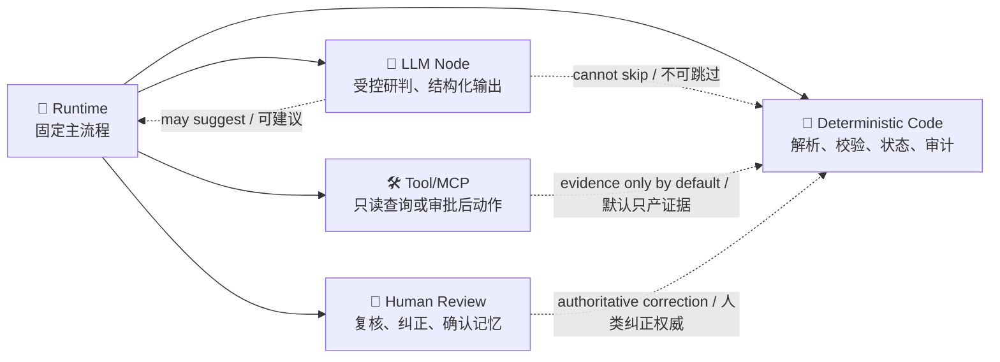
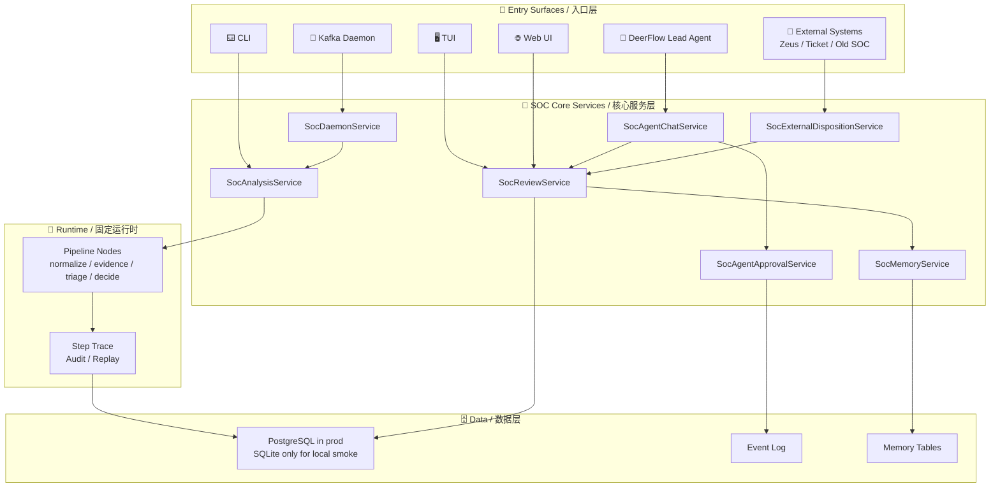
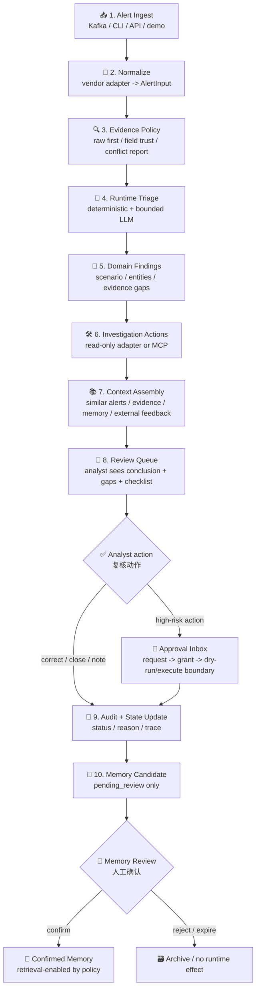
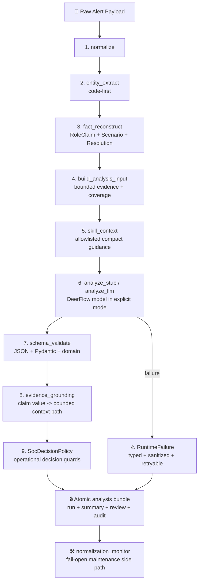
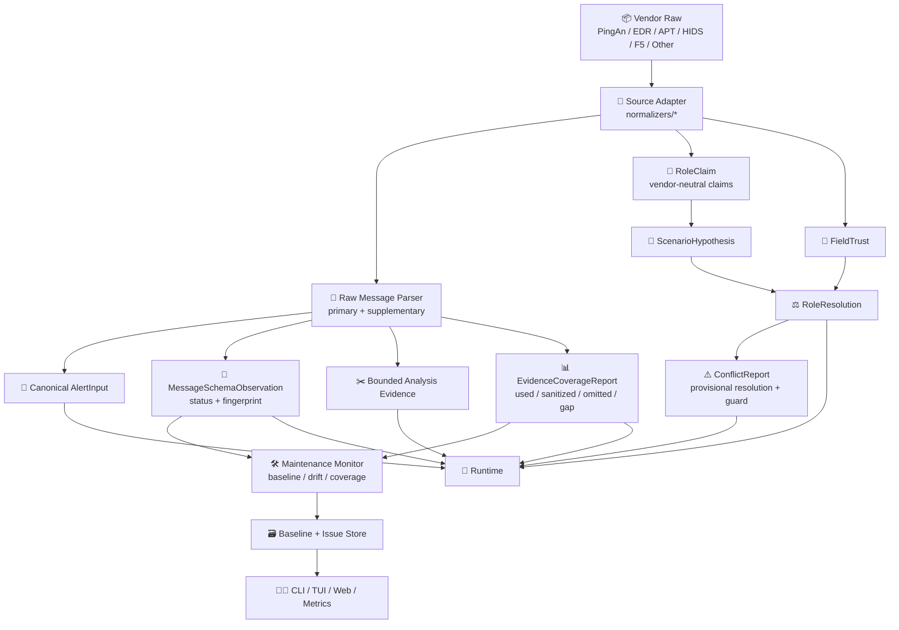
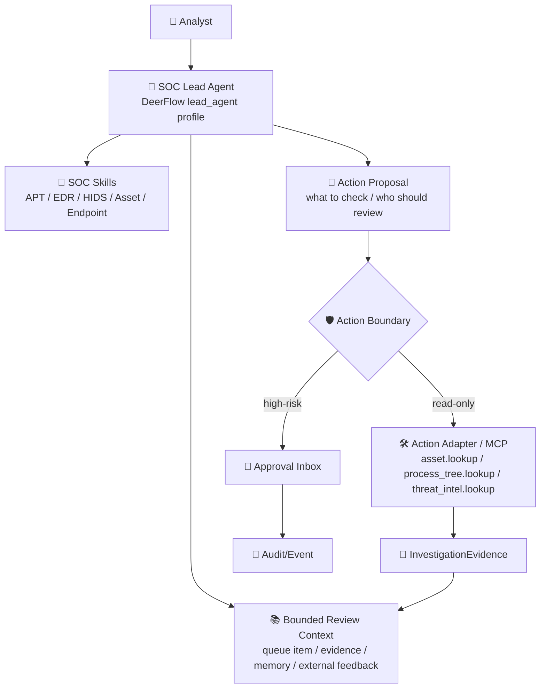
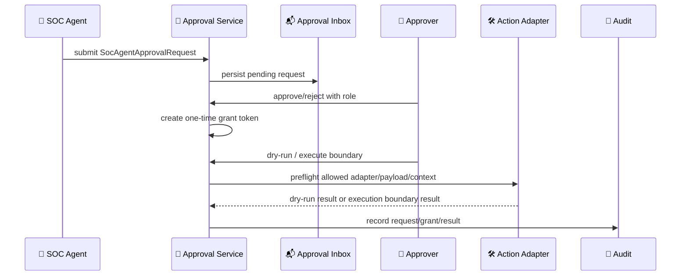
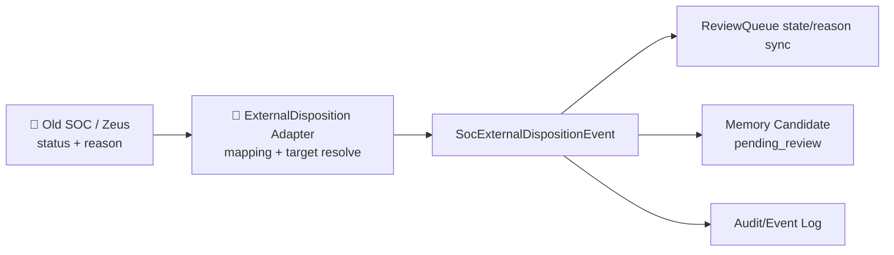
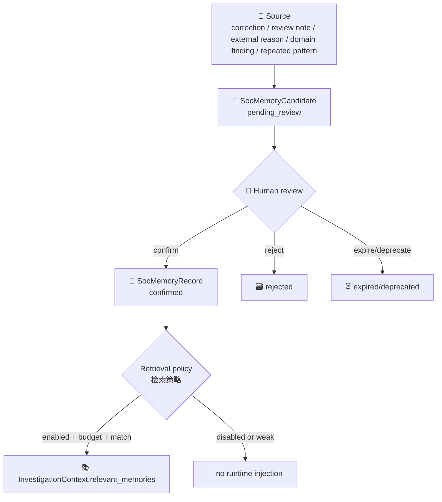
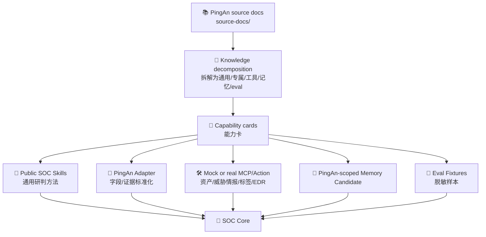

# SOC Agent Solution / SOC Agent 权威方案

Status: Active review baseline

Last updated: 2026-07-14

Primary audience: product review, architecture review, engineering review, security review

This document is the authoritative review entry for the SOC Agent work in this DeerFlow fork.
It explains what the system is, how the modules fit together, which contracts must stay stable,
and how PingAn-specific experience is injected without hard-coding the whole product to PingAn.

本文是后续 review 的主文档。它不再承担流水账职责：具体进度看
`.notes/ai_soc/progress.md`，端到端生命周期细节看
`.notes/ai_soc/alert-lifecycle-flow.md`，工程接口规范看
`.notes/reference-index/soc-agent-engineering-contracts.md`。

---

## 0. Review Guide / 如何评审

Review should answer these questions first:

| Review question / 评审问题 | Where to inspect / 看哪里 |
| --- | --- |
| The product flow is clear? / 产品流转是否清楚 | Sections 3, 4, and `.notes/ai_soc/alert-lifecycle-flow.md` |
| The architecture is DeerFlow-aligned? / 是否复用 DeerFlow | Sections 2, 5, 7 |
| The agent is not a fragile prompt wrapper? / 是否避免 prompt-only agent | Sections 1, 4, 6, 10 |
| Data contracts are stable? / 数据协议是否稳定 | Sections 8, 9 |
| PingAn knowledge is reusable and not hard-coded? / 平安经验是否可迁移 | Section 11 |
| Memory is useful but not polluting decisions? / 记忆是否可控 | Section 10 |
| Approval and side effects are safe? / 审批和副作用是否安全 | Sections 7, 12 |

Non-goals of this document:

- It is not a full backlog. Use `.notes/ai_soc/progress.md` for completed slices and next steps.
- It is not a replacement for code contracts. Use `backend/soc_agent/contracts/` and
  `.notes/reference-index/soc-agent-engineering-contracts.md` for exact schemas.
- It does not document every old draft. Historical or low-frequency notes live under
  `.notes/archive/` or focused subdirectories.

---

## 1. Core Principle / 核心原则

The SOC Agent is not a pure traditional alert analysis system, and it is not a fully autonomous
LLM that drives production operations by itself.

SOC Agent 是一个在 DeerFlow 上增量构建的安全运营智能体系统：

- Deterministic runtime owns the main control flow / 确定性 Runtime 掌握主流程。
- LLM handles bounded reasoning inside controlled nodes / LLM 只在受控节点内做研判。
- Skills provide reusable investigation playbooks / Skill 承载可复用研判方法。
- MCP or action adapters provide external capabilities / MCP 或 Action Adapter 承载外部系统能力。
- Human approval gates high-risk actions / 高风险动作必须人工审批。
- Memory is candidate-first and review-gated / 记忆先进入候选，确认后才可检索使用。
- PingAn and other tenants use adapters, capability cards, policy, and scoped memory, not
  hard-coded core logic / 平安或其他客户能力通过适配器、能力卡、策略和租户记忆接入，不写死到核心。

### 1.1 Control Philosophy / 控制流哲学


```mermaid
flowchart LR
    A["🧭 Runtime<br/>固定主流程"] --> B["🧩 Deterministic Code<br/>解析、校验、状态、审计"]
    A --> C["🤖 LLM Node<br/>受控研判、结构化输出"]
    A --> D["🛠️ Tool/MCP<br/>只读查询或审批后动作"]
    A --> E["👤 Human Review<br/>复核、纠正、确认记忆"]

    C -. "may suggest / 可建议" .-> A
    C -. "cannot skip / 不可跳过" .-> B
    D -. "evidence only by default / 默认只产证据" .-> B
    E -. "authoritative correction / 人类纠正权威" .-> B
```

LLM can recommend routes from a whitelist, but it cannot rewrite the pipeline, skip validation,
write confirmed memory, or execute side-effect actions.

---

## 2. Terminology / 中英文术语对照

| 中文术语 | English term | Code / contract | Meaning / 含义 |
| --- | --- | --- | --- |
| 预警 | Alert | `AlertInput` | SOC Agent 的标准输入，不直接绑定某一家厂商字段 |
| 原始日志 | Raw message | `raw_message`, `source.raw` | 供应商或平台原始文本，优先作为事实重建依据 |
| 标准化 | Normalization | `normalizers/` | 将 PingAn/EDR/APT/HIDS/F5 等输入转成 canonical alert |
| 证据层 | Evidence Layer | `EvidenceLayer` | 区分 raw、canonical、enriched、derived 等证据来源 |
| 字段可信度 | Field Trust | `FieldTrust` | 表示字段来源可信程度和冲突情况 |
| 角色声明 | Role Claim | `RoleClaim` | 区分网络观测、厂商角色断言、场景推导、外部证据和人工确认 |
| 场景假设 | Scenario Hypothesis | `ScenarioHypothesis` | 反弹 shell、C2、横向移动等带证据的暂定场景，不是最终 verdict |
| 角色裁决 | Role Resolution | `RoleResolution` | 给出 observed/tentative/conflicted/confirmed/unresolved 状态和暂定值 |
| 冲突报告 | Conflict Report | `ConflictReport` | 记录上游字段、加工字段、模型结论之间的冲突 |
| 受限分析证据 | Bounded Analysis Evidence | `BoundedAnalysisEvidence` | 允许进入模型的限长、脱敏、带来源证据，不等于完整 raw payload |
| Skill 选择上下文 | Skill Context | `SocSkillContext` | 当前选择清单、原因、摘要和 hash；不是完整 `SKILL.md` 正文 |
| 分析运行 | Analysis Run | `AnalysisRun` | 一次 alert 分析的完整记录、trace、result |
| 预警摘要 | Alert Summary | `AlertSummary` | 轻量读模型，用于列表、关联、复核和 demo |
| 复核队列 | Review Queue | `ReviewQueueItem` | 需要分析师看的工作项 |
| 调查上下文 | Investigation Context | `InvestigationContext` | Review/Lead Agent/TUI/Web 共享的受控上下文 |
| 统一调查视图 | Unified Investigation View | `UnifiedInvestigationView` | 将分析、证据、相似预警、记忆、外部反馈拼成可读视图 |
| 调查证据 | Investigation Evidence | `InvestigationEvidence` | 只读工具/MCP 查询结果，不直接改变 verdict |
| 领域研判 | Domain Triage | `SocDomainTriageResult` | 面向 APT/EDR/HIDS/网络/账号等领域的研判结果 |
| 场景发现 | Scenario Finding | `SocDomainFinding` | 反弹 shell、横向移动、恶意外联等场景化发现 |
| 主控智能体 | SOC Lead Agent | `soc-triage` profile | DeerFlow lead_agent 派生的 SOC 对话/编排入口 |
| 子能力 | Skill | `skills/public/soc-*` | 可复用的研判方法，不直接调用生产系统 |
| 动作适配器 | Action Adapter | `SocActionAdapter` | 工具能力边界，可是 in-memory/mock/MCP-backed |
| MCP 工具 | MCP Tool | MCP server tool | 外部系统能力的标准工具接口，例如 CMDB/EDR/TI |
| 动作建议 | Action Proposal | `SocAgentActionProposal` | Agent 建议下一步查什么或做什么 |
| 审批请求 | Approval Request | `SocAgentApprovalRequest` | 高风险动作进入统一审批 inbox |
| 审批授权 | Approval Grant | `SocAgentApprovalGrant` | 一次性 execution token，不等于自动执行 |
| 处置反馈 | External Disposition | `SocExternalDispositionEvent` | Zeus/老平台/工单系统同步回来的状态和理由 |
| 候选记忆 | Memory Candidate | `SocMemoryCandidate` | 待复核的经验、事实、模式、反馈 |
| 确认记忆 | Confirmed Memory | `SocMemoryRecord` | 人类确认后的可检索记忆，默认仍受 retrieval policy 约束 |
| 能力卡 | Capability Card | PingAn capability docs | 描述一个业务能力应落到 skill、MCP、adapter、memory 还是 eval |

---

## 3. Product Shape / 产品形态

SOC Agent exposes several entry surfaces, but all of them must call the same core services.

SOC Agent 有多个入口，但不能各写一套业务逻辑：

| Entry / 入口 | User / 用户 | Purpose / 用途 | Rule / 约束 |
| --- | --- | --- | --- |
| CLI | Developer, maintainer | Demo, smoke, replay, correction | Thin wrapper over services |
| TUI / terminal workbench | Analyst, operator | Queue review, context view, agent chat | DeerFlow-aligned, no independent business logic |
| Web UI | Analyst, team lead | Review inbox, approval inbox, investigation view | Reads Gateway APIs backed by services |
| Kafka daemon | Background ingestion | Consume alert stream and create review items | Ingestion adapter only |
| DeerFlow Lead Agent | Analyst chat | Ask questions around a review item, propose next steps | Uses bounded review context |
| External systems | Zeus, old SOC platform, ticketing | Push status/reason back into SOC Agent | Goes through external disposition service |


```mermaid
flowchart TB
    subgraph Entry["🚪 Entry Surfaces / 入口层"]
        CLI["⌨️ CLI"]
        TUI["🖥️ TUI"]
        WEB["🌐 Web UI"]
        KAFKA["📨 Kafka Daemon"]
        LEAD["🤖 DeerFlow Lead Agent"]
        EXT["🔁 External Systems<br/>Zeus / Ticket / Old SOC"]
    end

    subgraph Core["🧠 SOC Core Services / 核心服务层"]
        ANALYSIS["SocAnalysisService"]
        REVIEW["SocReviewService"]
        MEMORY["SocMemoryService"]
        DAEMON["SocDaemonService"]
        CHAT["SocAgentChatService"]
        DISPOSITION["SocExternalDispositionService"]
        APPROVAL["SocAgentApprovalService"]
    end

    subgraph Runtime["🧭 Runtime / 固定运行时"]
        PIPELINE["Pipeline Nodes<br/>normalize / evidence / triage / decide"]
        TRACE["Step Trace<br/>Audit / Replay"]
    end

    subgraph Data["🗄️ Data / 数据层"]
        DB["PostgreSQL in prod<br/>SQLite only for local smoke"]
        EVENTS["Event Log"]
        MEMORY_DB["Memory Tables"]
    end

    CLI --> ANALYSIS
    TUI --> REVIEW
    WEB --> REVIEW
    KAFKA --> DAEMON
    LEAD --> CHAT
    EXT --> DISPOSITION

    DAEMON --> ANALYSIS
    CHAT --> REVIEW
    CHAT --> APPROVAL
    DISPOSITION --> REVIEW
    REVIEW --> MEMORY
    ANALYSIS --> PIPELINE
    PIPELINE --> TRACE
    TRACE --> DB
    REVIEW --> DB
    MEMORY --> MEMORY_DB
    APPROVAL --> EVENTS
```

Product conclusion:

- Build a full SOC work system, not only a CLI parser.
- Keep the first usable path narrow: one alert in, reviewable investigation out.
- Keep all user-facing surfaces thin: CLI/Web/TUI/daemon call the same service layer.
- Keep DeerFlow reusable: SOC Lead Agent should use DeerFlow `lead_agent` profile/skills/MCP path, not a separate LangGraph clone unless proven necessary.

---

## 4. End-to-End Flow / 端到端流程

The current canonical lifecycle is documented in detail in `.notes/ai_soc/alert-lifecycle-flow.md`.
The summary below is the review-level product flow.


```mermaid
flowchart TD
    A["📥 1. Alert Ingest<br/>Kafka / CLI / API / demo"] --> B["🧾 2. Normalize<br/>vendor adapter -> AlertInput"]
    B --> C["🔍 3. Evidence Policy<br/>raw first / field trust / conflict report"]
    C --> D["🧠 4. Runtime Triage<br/>deterministic + bounded LLM"]
    D --> E["🧩 5. Domain Findings<br/>scenario / entities / evidence gaps"]
    E --> F["🛠️ 6. Investigation Actions<br/>read-only adapter or MCP"]
    F --> G["📚 7. Context Assembly<br/>similar alerts / evidence / memory / external feedback"]
    G --> H["👤 8. Review Queue<br/>analyst sees conclusion + gaps + checklist"]
    H --> I{"✅ Analyst action<br/>复核动作"}
    I -->|"correct / close / note"| J["📝 9. Audit + State Update<br/>status / reason / trace"]
    I -->|"high-risk action"| K["🛂 Approval Inbox<br/>request -> grant -> dry-run/execute boundary"]
    J --> L["🧬 10. Memory Candidate<br/>pending_review only"]
    K --> J
    L --> M{"👤 Memory Review<br/>人工确认"}
    M -->|"confirm"| N["📖 Confirmed Memory<br/>retrieval-enabled by policy"]
    M -->|"reject / expire"| O["🗃️ Archive / no runtime effect"]
```

Important behavior:

- A result must still be produced even when tools are unavailable.
- Missing evidence should become explicit evidence gaps and human checklist items.
- Historical similar alerts, external feedback, and confirmed memory are not fallback-only;
  they are part of the normal investigation context.
- Tool results are evidence. They do not silently mutate verdict, memory, or status.
- High-risk actions go to approval inbox. Approval grant is still not automatic execution.

---

## 5. Module Responsibilities / 模块职责

### 5.1 Entry Layer / 入口层

| Module / 模块 | Responsibility / 职责 | Must not do / 禁止 |
| --- | --- | --- |
| `backend/soc_agent/cli.py` | CLI commands for demo, review, memory, daemon smoke | No direct DB business mutation except through services |
| Gateway API routes | Web/TUI/API access to review, memory, approval | No duplicate runtime logic |
| Kafka consumer / daemon | Decode records, map to daemon messages, call `SocDaemonService` | No direct alert analysis logic |
| DeerFlow Lead Agent bridge | Chat around bounded investigation context | No unbounded raw secret/context injection |
| External disposition adapter | Map old-platform status/reason to canonical event | No direct confirmed memory write |

### 5.2 Core Service Layer / 核心服务层

| Service / 服务 | Public role / 对外角色 | Review focus / 评审重点 |
| --- | --- | --- |
| `SocAnalysisService` | Analyze alert, replay run, update summary | Runtime determinism, trace, validation |
| `SocReviewService` | Review queue, correction, notes, investigation context | State transition, audit, memory candidate bridge |
| `SocMemoryService` | Candidate review, confirmed memory retrieval | Human confirmation boundary |
| `SocDaemonService` | Background ingestion orchestration | Idempotency, backoff, worker result |
| `SocAgentChatService` | SOC chat event stream and proposal handling | Bounded context and approval proposal |
| `SocAgentApprovalService` | Approval request/grant/dry-run/execute boundary | Permission, token, audit, no silent execute |
| `SocExternalDispositionService` | External status/reason sync | Mapping, target resolution, idempotency |
| `SocCorrelationService` | Similar alert lookup | Uses summaries/evidence, no LLM dependency |
| `SocMainOrchestratorService` | Read-only demo orchestration for selected skills/evidence/domain results | No hidden side effects |

### 5.3 Runtime Pipeline / 固定运行时


```mermaid
flowchart TD
    I["🧾 Raw Alert Payload"] --> N["1. normalize"]
    N --> X["2. entity_extract<br/>code-first"]
    X --> F["3. fact_reconstruct<br/>RoleClaim + Scenario + Resolution"]
    F --> B["4. build_analysis_input<br/>bounded evidence + coverage"]
    B --> S["5. skill_context<br/>allowlisted compact guidance"]
    S --> L["6. analyze_stub / analyze_llm<br/>DeerFlow model in explicit mode"]
    L --> V["7. schema_validate<br/>JSON + Pydantic + domain"]
    V --> G["8. evidence_grounding<br/>claim value -> bounded context path"]
    G --> R["9. SocDecisionPolicy<br/>operational decision guards"]
    R --> P["🔒 Atomic analysis bundle<br/>run + summary + review + audit"]
    L -->|failure| E["⚠️ RuntimeFailure<br/>typed + sanitized + retryable"]
    E --> P
    P --> M["🛠️ normalization_monitor<br/>fail-open maintenance side path"]
```

`SocCorrelationService`, `SocDomainTriageService`, investigation actions, memory retrieval, and the
DeerFlow SOC Lead Agent are **not hidden nodes inside this base Runtime**. They consume the persisted
run through explicit orchestration/review services. This keeps one-alert execution replayable while
allowing richer investigation workflows to evolve independently.

Runtime rules:

- Every node has typed input/output.
- LLM output must pass parser and schema validation.
- Analyzer evidence must pass deterministic grounding against the exact bounded prompt projection.
  Ungrounded values or invalid source paths cannot disappear behind a high confidence score; they
  become structured review reasons.
- The live analyzer reuses DeerFlow `create_chat_model()` and configured model names. Entry surfaces
  select it explicitly with `--analyzer-mode llm` or `SOC_ANALYZER_MODE=llm`; direct service tests
  remain deterministic by default.
- Model calls record actual model name, prompt/parser versions, duration, bounded token usage and
  safe provider metadata. They never persist API keys, request headers, full prompts or raw responses.
- Process-local model admission is bounded independently from Kafka workers with
  `SOC_LLM_MAX_CONCURRENCY`, optional `SOC_LLM_REQUESTS_PER_MINUTE`, and
  `SOC_LLM_ADMISSION_TIMEOUT_SECONDS`.
- Bad JSON repair is allowed only as a logged parser step.
- Prompt context, model response, analysis text, evidence count/value size, knowledge candidates,
  and projection depth/list sizes all have hard bounds.
- Replay must be possible from stored run payload and deterministic settings.
- Runtime failures are stored as `RuntimeFailure(kind, step_name, retryable, safe message)`. Retryable
  Kafka failures do not commit the offset or open a duplicate analyst queue; non-retryable failures
  are dead-lettered and enter ReviewQueue.
- The primary business write is one transaction through `AnalysisPersistence.save_analysis_bundle()`:
  `AnalysisRun`, `AlertSummary`, optional `ReviewQueueItem`, and `DecisionAuditRecord` either all
  commit or all roll back. Normalization maintenance remains a fail-open post-write side path.
- Runtime never calls production side-effect tools directly.

### 5.4 Normalizer and Evidence Layer / 标准化与证据层

The system must handle vendor differences without turning the core schema into a vendor schema.

处理不同供应商日志的方式：

1. Vendor adapter maps raw input to canonical `AlertInput`.
2. Evidence policy records which fields are trusted, weak, conflicting, or derived.
3. PingAn deterministically parses all available `zeusRawLogs[].message` values through a
   source-scoped parser registry. Supported MVP formats are delimited JSON, quoted KV,
   comma-delimited KV, and loose KV.
   Supported nested JSON/HTTP fields are decoded by an allowlisted decoder with size limits;
   decoded request/response bodies and headers are redacted before entering bounded model context.
4. Fields parsed from the raw message are the highest-priority observable facts. Conflicting
   `zeusRawLogs[]` structured fields remain visible as medium/low-trust fallback candidates;
   canonical processed fields remain lower-trust derived values.
5. The original payload is never replaced: `AlertInput.raw` and `AnalysisRun.input_payload`
   retain every hit log, raw event, message, and platform field for replay and audit.
6. The first successfully parsed message becomes primary evidence; additional messages become
   bounded supplementary evidence. Analysis nodes receive size-bounded parsed content, not only
   a source path and not the unbounded vendor payload.
7. If raw message parsing fails, Runtime preserves the raw text, emits a warning, and keeps the
   structured fallback at reduced trust. If raw message is absent, PingAn falls back to
   `zeusRawLogs[]` with explicit low trust.
8. Strict nested JSON failure does not discard the field. Runtime attempts a conservative repair:
   accepted structures enter a separately labeled `repaired_fields` projection, while rejected or
   failed repair uses a redacted string fallback. Repair is field-policy aware and validates root
   type, depth, node count, key length, and source-evidenced keys/string values. The original string
   always stays in `fields`, and repaired content never masquerades as strict-decoded source fact.
9. Every selected message emits `MessageSchemaObservation`: `recognized` means the deterministic
   parser handled the structure, `degraded` means partial/nested decoding failed, and `unsupported`
   means no parser handled the selected message. A structural fingerprint supports baseline diff.
10. `EvidenceCoverageReport` records parsed/decoded/repaired paths, canonical/fact/scenario consumers,
    bounded LLM projection, redaction/replacement, truncation, and known high-value gaps. High-value
    expectations come from `EvidenceFieldImportanceRegistry`: core provides vendor-neutral defaults,
    while source adapters may add typed rules in `AlertInput.extensions`. It is persisted for audit;
    the prompt receives only a compact coverage summary without vendor paths.
11. Clean vendors may bypass heavy conflict handling, but still produce canonical evidence metadata.
12. Vendor aliases stop at the source adapter. PingAn fields such as `attack_sip`, `alarm_sip`,
   `str_source_ip`, and `str_attack_ip` are converted into vendor-neutral `RoleClaim` objects;
   the generic fact reconstructor does not interpret those aliases directly.
13. Evidence trust and semantic confidence are separate. A value parsed faithfully from raw
    message may still be a wrong attacker/victim assertion from the source product.

Schema drift workflow / 结构漂移流程：

1. Offline onboarding still uses `soc normalize drift` and `--schema-baseline` to compare a reviewed
   sample corpus before deployment.
2. An engineer accepts production baselines with `soc normalize baseline-accept` or
   `POST /api/soc/normalization/baselines`. Baselines are versioned, scoped by tenant/source/adapter/
   parser/version, persisted in `soc_normalization_schema_baselines`, and never self-approved.
3. Every persisted CLI/Kafka analysis calls `SocNormalizationMaintenanceService.monitor_run()` after
   the normal run/summary/queue/audit writes. Missing baseline, novel fingerprint, degraded or
   unsupported schema, high-value mapping gap, and bounded-evidence truncation become deduplicated
   `NormalizationMaintenanceIssue` records. Monitoring failure is fail-open for alert analysis and is
   recorded in `NormalizationMonitoringResult.warnings`.
4. Accepting a baseline supersedes the prior active version and resolves covered `baseline_missing` /
   `novel_schema` issues. Recurrence increments `occurrence_count`; a resolved/ignored issue that
   recurs is reopened.
5. Operators use `soc normalize issues`, Review TUI `/normalization` and `/norm-update`, or the Web
   workbench at `/workspace/soc/normalization`. Gateway metrics expose bounded type/severity/source
   counts; Kafka JSONL metrics include per-message issue count/IDs/warnings.
6. `soc normalize suggest` is an offline-only assistant. It emits a value-free path prompt and can
   either replay a recorded response or call a DeerFlow-configured model with `--live-llm`. Both paths
   validate suggestions against observed source paths and a canonical target whitelist, keep invalid
   proposals as rejected, and always return `auto_apply_allowed=false`.
7. A new fingerprint only means the structure changed. It is maintenance evidence, never a verdict,
   memory fact, suppression decision, or automatic parser patch.

Conflict adjudication / 冲突裁决：

- `source` / `destination` are observed network roles; they are not globally equivalent to
  `attacker` / `victim`.
- Scenario hypotheses determine which semantic constraints are valid. For reverse connection,
  `source=victim` and `destination=attacker` is consistent rather than contradictory.
- `RoleResolution` always exposes status, provisional value, evidence gaps, manual checks, and
  supporting/contradicting claim IDs. A conflicted resolution may provide a current conclusion,
  but it remains visibly provisional.
- Supplementary raw messages participate as independent claim sources. They are not only appended
  to an LLM prompt.
- Fact reconstruction never determines `response_target`. Action type, policy, asset evidence,
  approval, and the action adapter jointly determine an operational target later.
- No role resolution alone enables an action. `automation_allowed` remains false at this layer,
  including for human-confirmed facts.


```mermaid
flowchart TB
    RAW["📦 Vendor Raw<br/>PingAn / EDR / APT / HIDS / F5 / Other"] --> ADAPTER["🔌 Source Adapter<br/>normalizers/*"]
    ADAPTER --> PARSER["🧾 Raw Message Parser<br/>primary + supplementary"]
    PARSER --> CANON["📄 Canonical AlertInput"]
    PARSER --> SCHEMA["🔎 MessageSchemaObservation<br/>status + fingerprint"]
    PARSER --> BOUNDED["✂️ Bounded Analysis Evidence"]
    PARSER --> COVER["📊 EvidenceCoverageReport<br/>used / sanitized / omitted / gap"]
    SCHEMA --> MONITOR["🛠️ Maintenance Monitor<br/>baseline / drift / coverage"]
    COVER --> MONITOR
    MONITOR --> MAINTDB["🗃️ Baseline + Issue Store"]
    MAINTDB --> OPS["🧑‍💻 CLI / TUI / Web / Metrics"]
    ADAPTER --> CLAIM["🧾 RoleClaim<br/>vendor-neutral claims"]
    ADAPTER --> TRUST["🧪 FieldTrust"]
    CLAIM --> SCENARIO["🧠 ScenarioHypothesis"]
    SCENARIO --> RESOLVE["⚖️ RoleResolution"]
    TRUST --> RESOLVE
    RESOLVE --> CONFLICT["⚠️ ConflictReport<br/>provisional resolution + guard"]
    CANON --> RUNTIME["🧭 Runtime"]
    BOUNDED --> RUNTIME
    SCHEMA --> RUNTIME
    COVER --> RUNTIME
    RESOLVE --> RUNTIME
    CONFLICT --> RUNTIME
```

### 5.5 Confidence Semantics / 置信度语义

The system has several confidence-like values, but they are not interchangeable probabilities.

| Signal / 信号 | Meaning / 含义 | Current use / 当前用途 |
| --- | --- | --- |
| `EvidenceTrustLevel` | Provenance quality: raw, fallback, processed, inferred, or human-confirmed | Evidence ordering and warnings; never averaged |
| `MessageSchemaStatus` | Parser completeness: recognized/degraded/unsupported | Drift and maintenance alert; not a probability |
| `ScenarioHypothesis.confidence` | Versioned deterministic heuristic score | Scenario ordering and review context; currently uncalibrated |
| `RoleClaim/RoleResolution.semantic_confidence` | Strength of one role interpretation under a scenario | Provisional role explanation and automation guard |
| `AnalysisResult.confidence` | Analyzer/LLM assessment for the verdict | Review display and eval only; cannot bypass validation or approval |
| `Decision.confidence_source` | Provenance of the raw decision score | Distinguishes stub heuristic, LLM self-report, human confirmation, and external disposition |
| `Decision.calibrated_probability` | Versioned calibrated probability, when an approved profile exists | Currently `null`; it must never be fabricated from raw analyzer confidence |
| `Decision.evidence_state` / `review_reasons` | Operational evidence guard and structured review causes | Drives ReviewQueue/audit explanations independently of the numeric score |
| `AnalysisEvidenceGroundingReport` | Whether each analyzer evidence value exists at its declared bounded-context source | Ungrounded claims force review and remain auditable; never auto-rewrite model output |
| Memory confidence | Strength of a reviewed reusable lesson | Retrieval ranking after confirmation; never promotes a candidate by itself |

Rules:

- Never average or multiply these values across layers.
- A high-trust raw field can still have low semantic confidence when the sensor assigns attacker and
  victim incorrectly.
- Current scenario/role scores are deterministic heuristics, not calibrated likelihoods. Their
  constants and taxonomy version must be replayable.
- LLM self-reported confidence is advisory. Production thresholds require labeled replay sets,
  calibration metrics, versioned thresholds, and comparison against analyst outcomes.
- `soc eval confidence` now provides the offline calibration boundary. It reads reviewed JSON/JSONL,
  reports accuracy, Brier score, expected calibration error and non-empty bins, and emits a versioned
  `review_below` profile. Small or single-class sets are warned; the profile is provisional and
  `auto_action_allowed` is always false.
- Missing coverage, degraded schemas, conflicts, and truncation can lower or cap an operational
  conclusion, but no single score may silently erase those warnings.
- `SocDecisionPolicy` is the only Runtime component allowed to translate validated analysis into an
  operational `Decision`. The current policy deliberately marks stub and live-LLM confidence as
  uncalibrated and sends every such decision to human review until a labeled, approved calibration
  profile is explicitly integrated and replay-tested.
- False-positive decisions require confirmation even when the raw score is high. Review reasons are
  structured (`confidence_not_calibrated`, `fact_conflict`, `high_value_evidence_gap`, and so on),
  persisted in the summary/queue/audit trail, and must not be replaced by one free-text reason.
- Successful mock evidence is visible for demo and audit only. Mock, denied, or failed action results
  cannot satisfy scenario tool requirements, raise domain/scenario confidence, or change verdict.

---

## 6. SOC Lead Agent, Skills, MCP, and Tools / 智能体、技能、MCP、工具

The SOC Lead Agent should feel like DeerFlow, but operate inside SOC service boundaries.

SOC Lead Agent 的定位：

- It is the analyst-facing conversational agent.
- It can inspect a review item through `InvestigationContext`.
- It can select SOC skills and propose actions.
- It can call read-only adapters or MCP-backed tools through controlled bridges.
- It cannot bypass services, approval, memory review, or audit.


```mermaid
flowchart TD
    Analyst["👤 Analyst"] --> Lead["🤖 SOC Lead Agent<br/>DeerFlow lead_agent profile"]
    Lead --> Context["📚 Bounded Review Context<br/>queue item / evidence / memory / external feedback"]
    Lead --> Skill["🧩 SOC Skills<br/>APT / EDR / HIDS / Asset / Endpoint"]
    Lead --> Proposal["📌 Action Proposal<br/>what to check / who should review"]
    Proposal --> Router{"🛡️ Action Boundary"}
    Router -->|"read-only"| Adapter["🛠️ Action Adapter / MCP<br/>asset.lookup / process_tree.lookup / threat_intel.lookup"]
    Router -->|"high-risk"| Approval["🛂 Approval Inbox"]
    Adapter --> Evidence["🔎 InvestigationEvidence"]
    Evidence --> Context
    Approval --> Audit["🧾 Audit/Event"]
```

### 6.1 Skill vs MCP vs Memory / Skill、MCP、Memory 怎么分

| Content type / 内容 | Belongs to / 应放在 | Example / 例子 |
| --- | --- | --- |
| Reusable investigation method / 通用研判方法 | Public SOC skill | How to reason about reverse shell, malicious outbound, process tree |
| External system query / 外部系统查询 | MCP or action adapter | CMDB lookup, EDR process tree, threat intel reputation |
| Tenant-specific fact / 租户事实 | Scoped memory or policy/config | PingAn internal asset tag, suppression rule, special business system |
| Vendor field mapping / 字段映射 | Normalizer adapter | PingAn `zeusRawLogs[].message` mapping |
| Repeated operational conclusion / 历史处置经验 | Memory candidate then confirmed memory | This rule often flips attacker/victim direction under condition X |
| Eval sample / 验证样本 | Eval fixture | Desensitized APT/EDR/HIDS examples |
| Prompt fragment / 提示词片段 | Only if it is stable role/task instruction | Output requirements, evidence discipline |

### 6.2 Sub Agent Strategy / 子智能体策略

Long-term, APT/EDR/HIDS/network/endpoint/domain-specific agents should be sub-agents or
specialized profiles under a SOC orchestrator, not independent uncontrolled agents.

长期结构：

| Role / 角色 | Purpose / 用途 | Timing / 时机 |
| --- | --- | --- |
| SOC Lead Agent | Main analyst-facing orchestrator | Current direction |
| APT triage sub-agent | Network/APT alert reasoning | After domain flow stabilizes |
| EDR triage sub-agent | Endpoint/process/file/account reasoning | After process-tree evidence flow stabilizes |
| HIDS triage sub-agent | Host intrusion and integrity reasoning | After generic scenario taxonomy stabilizes |
| Threat hunting agent | Cross-alert hunting and IOC/TTP expansion | Later |
| Detection engineering agent | Rule tuning, false-positive pattern analysis | Later |
| Attack simulation agent | Authorized red-team or validation workflows | Later, strict scope and approval |

All agents share SOC contracts, service boundaries, approval, and memory policy.

---

## 7. Review, Approval, and External Feedback / 复核、审批、外部反馈

### 7.1 Review Queue / 复核队列

Review queue is the analyst's primary work surface.

It should show:

- Current conclusion with confidence.
- Evidence used and evidence gaps.
- Scenario findings and domain triage.
- Similar historical alerts.
- Relevant confirmed memory.
- Pending memory candidates.
- External disposition history.
- Read-only investigation evidence.
- Human checklist and suggested next steps.

### 7.2 Approval Boundary / 审批边界

High-risk actions must follow this path:


```mermaid
sequenceDiagram
    participant Agent as 🤖 SOC Agent
    participant Approval as 🛂 Approval Service
    participant Inbox as 📬 Approval Inbox
    participant Human as 👤 Approver
    participant Adapter as 🛠️ Action Adapter
    participant Audit as 🧾 Audit

    Agent->>Approval: submit SocAgentApprovalRequest
    Approval->>Inbox: persist pending request
    Human->>Approval: approve/reject with role
    Approval->>Approval: create one-time grant token
    Human->>Approval: dry-run / execute boundary
    Approval->>Adapter: preflight allowed adapter/payload/context
    Adapter-->>Approval: dry-run result or execution boundary result
    Approval->>Audit: record request/grant/result
```

Current safety posture:

- Read-only investigation actions can produce `InvestigationEvidence`.
- High-risk actions create approval requests.
- Execute boundary exists, but real production side effects must wait for real adapter review.
- Approval grant is single-use and audited.

### 7.3 External Disposition Sync / 外部处置反馈同步

Users may still work in Zeus or another old SOC system. Their status/reason updates must
feed SOC Agent rather than being lost.


```mermaid
flowchart LR
    OLD["🏢 Old SOC / Zeus<br/>status + reason"] --> MAP["🔁 ExternalDisposition Adapter<br/>mapping + target resolve"]
    MAP --> EVENT["SocExternalDispositionEvent"]
    EVENT --> REVIEW["ReviewQueue state/reason sync"]
    EVENT --> CAND["Memory Candidate<br/>pending_review"]
    EVENT --> AUDIT["Audit/Event Log"]
```

Rules:

- External reason may update local review state if target resolution is unique and trusted.
- External reason can generate memory candidates.
- External reason cannot become confirmed memory without review.
- Mapping must be configurable per external system.

---

## 8. Data Contracts / 数据契约

The contracts are the product boundary. Adding a UI, daemon, agent, or vendor adapter should
not require rewriting core contracts.

| Contract / 契约 | Role / 作用 | Stability expectation / 稳定性 |
| --- | --- | --- |
| `AlertInput` | Canonical alert input | Stable, extensible through typed optional sections and metadata |
| `EvidenceLayer` | Evidence source/layer metadata | Stable |
| `FieldTrust` | Field trust and provenance | Stable |
| `CanonicalFieldProvenance` | Selected canonical source path and alternatives | Stable |
| `RoleClaim` | Observable/asserted/derived role evidence | Stable |
| `ScenarioHypothesis` | Evidence-backed scenario hypothesis | Stable |
| `RoleResolution` | Conflict-aware role result and evidence gaps | Stable |
| `ConflictReport` | Conflict and ambiguity report | Stable |
| `AnalysisRun` | Full runtime execution record | Stable for replay/audit |
| `AlertSummary` | Lightweight read model | Stable for queue/correlation/list |
| `ReviewQueueItem` | Analyst work item | Stable state machine |
| `InvestigationContext` | Shared context for Web/TUI/Lead Agent | Stable but may gain new sections |
| `UnifiedInvestigationView` | Read-optimized investigation projection | Stable as display/read model |
| `InvestigationEvidence` | Tool/MCP evidence record | Stable |
| `SocDomainTriageResult` | Domain-level triage result | Stable |
| `SocDomainFinding` | Scenario-level finding | Stable taxonomy version required |
| `SocAgentActionProposal` | Agent proposal | Stable |
| `SocAgentApprovalRequest` | Approval inbox item | Stable |
| `SocAgentApprovalGrant` | One-time approval grant | Stable |
| `SocExternalDispositionEvent` | External status/reason update | Stable |
| `SocMemoryCandidate` | Pending memory proposal | Stable |
| `SocMemoryRecord` | Confirmed memory | Stable retrieval policy |

Contract rules:

- Prefer additive changes.
- Keep vendor-specific fields under adapter metadata, aliases, or scoped extensions.
- Never make `rule_code`, vendor scene name, or PingAn-only fields required for the system to work.
- Every external write path must include actor, source, reason, and audit metadata.

---

## 9. Persistence and Runtime Data / 存储与运行数据

Production and staging should use PostgreSQL as the SOC business store. Local SQLite can be
used only for smoke/demo convenience when explicitly configured.

Main persistence categories:

| Data / 数据 | Purpose / 用途 | Notes / 备注 |
| --- | --- | --- |
| Analysis runs | Replay and audit | Full payload, trace, result |
| Alert summaries | Review/correlation/list | Lightweight projection |
| Review queue | Human workflow | State, owner, reason, correction |
| Investigation evidence | Read-only tool/MCP evidence | Reusable in context, not memory by default |
| Approval requests/grants | High-risk action boundary | Pending request and one-time grant |
| External dispositions | Old-platform status/reason sync | Idempotent by external event key |
| Memory candidates | Pending learning | Human review required |
| Confirmed memory | Reviewed experience | Retrieval-enabled by policy |
| Events/audit | Traceability | Required for production trust |

Service/repository rule:

- Services depend on repository protocols from `backend/soc_agent/protocols.py`.
- Entry layers must not write tables directly.
- Migrations live under `backend/soc_agent/db/migrations/`.
- SOC tables stay separate from DeerFlow harness persistence unless a generic upstream extension is required.

---

## 10. Memory System / 记忆系统

Memory must help the agent learn from operations, but it must not become an uncontrolled
prompt-stuffing system.

### 10.1 Memory Granularity / 记忆粒度

Use layered and optional keys, not one over-specific composite key.

| Layer / 层级 | Example / 示例 | Required? / 必须吗 |
| --- | --- | --- |
| Tenant / 租户 | PingAn, customer A | Optional but recommended in multi-tenant |
| Source family / 来源族 | EDR, APT, HIDS, NIDS, SIEM, WAF | Optional |
| Detection alias / 检测别名 | rule_code, signature_id, analytic_id | Optional |
| Scenario / 场景 | reverse_shell, webshell, lateral_movement | Optional |
| Entity features / 实体特征 | IP, domain, process, user, host | Optional |
| Disposition pattern / 处置模式 | false positive because asset is scanner | Optional |

Retrieval should work even when some dimensions are missing. For example, if a vendor has no
`rule_code`, the system can still match by source family, scenario, entity features, summary,
and confirmed memory text.

### 10.2 Memory Lifecycle / 记忆生命周期


```mermaid
flowchart TD
    S1["📝 Source<br/>correction / review note / external reason / domain finding / repeated pattern"] --> C["🧬 SocMemoryCandidate<br/>pending_review"]
    C --> R{"👤 Human review"}
    R -->|"confirm"| M["📖 SocMemoryRecord<br/>confirmed"]
    R -->|"reject"| X["🗃️ rejected"]
    R -->|"expire/deprecate"| E["⏳ expired/deprecated"]
    M --> P{"Retrieval policy<br/>检索策略"}
    P -->|"enabled + budget + match"| CTX["📚 InvestigationContext.relevant_memories"]
    P -->|"disabled or weak"| NO["🚫 no runtime injection"]
```

Rules:

- LLM-discovered knowledge is candidate knowledge only.
- Correction, review note, domain finding, external feedback, and repeated pattern can all create candidates.
- Confirmation requires explicit human action through `SocMemoryService`.
- Confirmed memory retrieval is budgeted and reasoned; it is not dumped blindly into prompts.
- Wiki/OKF-style displays can be exported later from DB memory, but DB remains the source of truth.

---

## 11. PingAn Capability Layer / 平安能力接入层

PingAn experience is valuable, but the product must stay vendor-neutral.

平安能力接入不等于把平安字段和提示词写死到核心。正确做法：


```mermaid
flowchart TB
    DOCS["📚 PingAn source docs<br/>source-docs/"] --> DECOMP["🧹 Knowledge decomposition<br/>拆解为通用/专属/工具/记忆/eval"]
    DECOMP --> CARD["🧾 Capability cards<br/>能力卡"]
    CARD --> SKILL["🧩 Public SOC Skills<br/>通用研判方法"]
    CARD --> ADAPTER["🔌 PingAn Adapter<br/>字段/证据标准化"]
    CARD --> MCP["🛠️ Mock or real MCP/Action<br/>资产/威胁情报/标签/EDR"]
    CARD --> MEMORY["🧬 PingAn-scoped Memory Candidate"]
    CARD --> EVAL["🧪 Eval Fixtures<br/>脱敏样本"]
    SKILL --> CORE["🧠 SOC Core"]
    ADAPTER --> CORE
    MCP --> CORE
    MEMORY --> CORE
    EVAL --> CORE
```

Current PingAn docs live under:

- `.notes/ai_soc/capabilities/pingan/source-docs/`
- `.notes/ai_soc/capabilities/pingan/onboarding.md`
- `.notes/ai_soc/capabilities/pingan/knowledge-decomposition.md`
- `.notes/ai_soc/capabilities/pingan/capability-cards.md`
- `.notes/ai_soc/capabilities/pingan/knowledge-candidates.md`

### 11.1 What goes where / 平安内容怎么落位

| PingAn content / 平安内容 | Destination / 落位 | Reason / 原因 |
| --- | --- | --- |
| Raw field quirks, `zeusRawLogs[].message` preference | PingAn normalizer adapter | Vendor-specific parsing belongs at edge |
| General investigation reasoning | `skills/public/soc-*` | Reusable across customers |
| PingAn internal asset/tag/business knowledge | Scoped memory or config | Not public prompt |
| Remote lookup capability | Mock now, real MCP/action later | External capability boundary |
| Historical false-positive/true-positive lessons | Memory candidate | Must be reviewed |
| Desensitized examples | Eval fixtures | Regression tests and replay |
| Prompt-like notes that are actually experience | Capability card or memory candidate | Avoid stuffing main prompt |

### 11.2 PingAn PA Track / 平安能力路线

The PA track is a capability onboarding method, not a separate product architecture.

| Step / 步骤 | Meaning / 含义 |
| --- | --- |
| PA-01 | Capability register |
| PA-02..PA-04 | APT/EDR/HIDS source decomposition |
| PA-05 | PingAn knowledge candidate register |
| PA-06 | Public skill minimal revisions |
| PA-07 | Read-only mock action adapters |
| PA-08 | Eval fixtures |
| PA-09 | Memory candidate entry |
| PA-10 | Domain triage MVP |
| PA-11 | Main orchestrator demo |
| PA-12 | Replace mock with real PingAn dev/staging MCP/API, credential-gated |

PA-12 must not be marked complete by adding more mock behavior. It requires real endpoint,
credentials, smoke report, and payload/latency/error evaluation.

---

## 12. Security and Permission Model / 安全与权限模型

| Level / 等级 | Meaning / 含义 | SOC Agent behavior / 行为 |
| --- | --- | --- |
| L0 | Read local context | Allowed through services |
| L1 | Read external data | Allowed through read-only adapter/MCP with audit |
| L2 | Generate recommendation | Allowed, must be labeled recommendation |
| L3 | Change internal SOC state | Requires role and service method |
| L4 | Execute external side effect | Approval required, adapter reviewed |
| L5 | Destructive or attack simulation | Explicit scope, approval, audit, later phase only |

Security invariants:

- No production secret in docs, skills, fixtures, or committed config.
- No side-effect tool call from LLM directly.
- No confirmed memory without human review.
- No tenant-specific knowledge in public generic skills unless sanitized and generalized.
- No unbounded raw alert dump into DeerFlow Lead Agent context.
- No bypass of `SocReviewService`, `SocMemoryService`, or `SocAgentApprovalService`.

---

## 13. Evaluation and Demo / 评测与演示

The system should be reviewable from a single alert before scaling to Kafka.

Useful command surfaces:

```bash
# Run one arbitrary alert through the service chain and create review context
soc demo alert alert_demo/apt-2026494.json --pretty

# Seed repeatable demo chains
soc demo run all

# Inspect review context
soc review context <queue-id> --summary --pretty

# Add analyst note and optionally create memory candidate
soc review note <queue-id> --note "..." --memory-candidate

# Review memory candidates
soc memory list --status pending_review
soc memory review <candidate-id> --confirm
soc memory search --query "reverse shell internal host"

# Chat through DeerFlow-aligned SOC Lead Agent
soc chat tui --queue-id <queue-id> --lead-agent

# Process daemon message locally
soc daemon process --message-json '{"kind":"alert",...}'

# Inspect model resolution without exposing credentials
soc llm status --analyzer-mode llm --model-name deepseek-v4-pro --pretty

# Run one alert through the real bounded model node
soc analyze alert.json --analyzer-mode llm --model-name deepseek-v4-pro --pretty

# Compare stub and live model over an offline sample set
soc eval offline samples/ --live-llm --model-name deepseek-v4-pro --pretty
```

Acceptance criteria for the first complete demo:

- One alert can be normalized into `AlertInput`.
- Runtime creates an `AnalysisRun` and `AlertSummary`.
- Review queue item is visible.
- Investigation context includes conclusion, evidence, scenario findings, similar alerts if any,
  memory if any, and explicit evidence gaps.
- Lead Agent can answer around the review item using bounded context.
- Read-only action/MCP result becomes `InvestigationEvidence`.
- Analyst note/correction can create pending memory candidate.
- External disposition can sync status/reason into review context.
- No high-risk action is executed without approval boundary.

---

## 14. Current Architecture Decisions / 当前架构决策

| Decision / 决策 | Rationale / 理由 |
| --- | --- |
| Use DeerFlow lead_agent for SOC conversational agent | Reuses existing agent/profile/skill/MCP infrastructure |
| Keep SOC code under `backend/soc_agent/` | Avoid invasive upstream fork changes |
| Keep entry surfaces thin | Prevent CLI/Web/TUI/Kafka logic divergence |
| Reuse DeerFlow `create_chat_model` for Runtime LLM | One provider/config/tracing implementation; no SOC-specific SDK client |
| Centralize operational decisions in `SocDecisionPolicy` | Keep confidence provenance, evidence guards, review routing, and policy version deterministic and auditable |
| Use canonical `AlertInput` | Vendor-neutral core |
| Use adapters for PingAn and future vendors | Extensible source integration |
| Use read-only investigation evidence first | Makes tools useful before risky automation |
| Use approval inbox for high-risk actions | Production-safe execution boundary |
| Use candidate-first memory | Prevent memory pollution |
| Treat Kafka as ingestion adapter | It is not the product UX itself |
| Keep PA-12 credential-gated | Mock cannot prove real integration |

---

## 15. Review Checklist / Review 清单

### Product Review / 产品评审

- Does the analyst know what happened, why, and what to do next?
- Can the system give a conclusion even when tools are unavailable?
- Are evidence gaps explicit and actionable?
- Does the flow support old-platform feedback and human notes?
- Is the demo path clear enough to show value on a single alert?

### Architecture Review / 架构评审

- Are CLI/Web/TUI/Kafka/Lead Agent all calling core services?
- Is DeerFlow core changed only where a generic extension point is justified?
- Are SOC modules cohesive and not becoming a flat pile of Python files?
- Are protocol boundaries represented by typed contracts?
- Can future APT/EDR/HIDS sub-agents reuse the same contracts?

### Data Contract Review / 数据契约评审

- Does the new field belong in canonical schema, vendor adapter metadata, memory, or evidence?
- Is the field required only when truly universal?
- Is `rule_code` optional and vendor-neutral through aliases?
- Does every state-changing operation carry actor, source, reason, and audit metadata?

### Memory Review / 记忆评审

- Is the source a correction, feedback, note, domain finding, repeated pattern, or external reason?
- Does it enter `pending_review` first?
- Is tenant/vendor specificity represented safely?
- Is retrieval explainable and budgeted?
- Can the memory be rejected, expired, or deprecated?

### Tool/MCP Review / 工具评审

- Is the capability read-only or side-effecting?
- Does the adapter validate payload and context refs?
- Does the result become evidence rather than verdict mutation?
- Is there a mock provider for tests and a real provider gated by config/credentials?
- Is sensitive data redacted before Lead Agent context?

### PingAn Review / 平安能力评审

- Is PingAn-specific parsing in `normalizers/pingan_platform.py` or equivalent adapter?
- Is general investigation reasoning promoted to public SOC skill only after sanitization?
- Are PingAn environment facts stored as scoped memory/config, not public prompt?
- Are capability cards updated before implementing a new PingAn integration?
- Does PA-12 use real dev/staging credentials and smoke report, not more mock?

---

## 16. Pointers / 相关文档

| Document / 文档 | Purpose / 用途 |
| --- | --- |
| `.notes/ai_soc/alert-lifecycle-flow.md` | Detailed lifecycle diagrams and state/data changes |
| `.notes/ai_soc/progress.md` | Durable progress ledger and next step |
| `.notes/reference-index/soc-agent-engineering-contracts.md` | API, protocol, code style, events, tests |
| `.notes/ai_soc/capabilities/pingan/onboarding.md` | PingAn capability onboarding plan |
| `.notes/ai_soc/integrations/mock-and-real-register.md` | Mock vs real integration register |
| `.notes/ai_soc/integrations/external-disposition-sync.md` | External status/reason sync plan |
| `.notes/ai_soc/memory/memory-tracking.md` | Memory tracking and retrieval plan |
| `.notes/ai_soc/governance/agent-profile-governance.md` | SOC agent/profile/skill governance |

The review source of truth is this document plus the contracts document. Historical chat context
should not be treated as durable project state.
