# SOC Agent Solution / SOC Agent 权威方案

Status: Active review baseline

Last updated: 2026-08-06

Primary audience: product review, architecture review, engineering review, security review

This document is the authoritative review entry for the SOC Agent work in this DeerFlow fork.
It explains what the system is, how the modules fit together, which contracts must stay stable,
and how PingAn-specific experience is injected without hard-coding the whole product to PingAn.

本文是后续 review 的主文档。它不再承担流水账职责：具体进度看
`.notes/ai_soc/progress.md`，端到端生命周期细节看
`.notes/ai_soc/alert-lifecycle-flow.md`，工程接口规范看
`.notes/reference-index/soc-agent-engineering-contracts.md`。

---

## 0. Review Guide / 如何评审

Review should answer these questions first:

| Review question / 评审问题 | Where to inspect / 看哪里 |
| --- | --- |
| The product flow is clear? / 产品流转是否清楚 | Sections 3, 4, and `.notes/ai_soc/alert-lifecycle-flow.md` |
| The architecture is DeerFlow-aligned? / 是否复用 DeerFlow | Sections 2, 5, 7 |
| The agent is not a fragile prompt wrapper? / 是否避免 prompt-only agent | Sections 1, 4, 6, 10 |
| Data contracts are stable? / 数据协议是否稳定 | Sections 8, 9 |
| PingAn knowledge is reusable and not hard-coded? / 平安经验是否可迁移 | Section 11 |
| Memory is useful but not polluting decisions? / 记忆是否可控 | Section 10 |
| Governed context is typed, scoped and auditable? / 运营事实是否强类型、有范围、时效和审计 | Section 7.4 |
| Approval and side effects are safe? / 审批和副作用是否安全 | Sections 7, 12 |
| The Alpha journey is reproducible and honestly scoped? / Alpha 是否可复跑且边界真实 | Section 13 and `.notes/ai_soc/alpha-acceptance-runbook.md` |

Non-goals of this document:

- It is not a full backlog. Use `.notes/ai_soc/progress.md` for completed slices and next steps.
- It is not a replacement for code contracts. Use `backend/soc_agent/contracts/` and
  `.notes/reference-index/soc-agent-engineering-contracts.md` for exact schemas.
- It does not document every old draft. Historical or low-frequency notes live under
  `.notes/archive/` or focused subdirectories.

---

## 1. Core Principle / 核心原则

The SOC Agent is not a pure traditional alert analysis system, and it is not a fully autonomous
LLM that drives production operations by itself.

SOC Agent 是一个在 DeerFlow 上增量构建的安全运营智能体系统：

- Deterministic runtime owns the main control flow / 确定性 Runtime 掌握主流程。
- LLM handles bounded reasoning inside controlled nodes / LLM 只在受控节点内做研判。
- Skills provide reusable investigation playbooks / Skill 承载可复用研判方法。
- MCP or action adapters provide external capabilities / MCP 或 Action Adapter 承载外部系统能力。
- Human approval gates high-risk actions / 高风险动作必须人工审批。
- Memory is candidate-first and review-gated / 记忆先进入候选，确认后才可检索使用。
- Operational context uses typed governed facts, not memory or permanent whitelists / 授权活动、
  护网参与者、变更窗口等运营上下文使用强类型受治理事实，不是记忆，也不是永久白名单。
- PingAn and other tenants use adapters, capability cards, policy, and scoped memory, not
  hard-coded core logic / 平安或其他客户能力通过适配器、能力卡、策略和租户记忆接入，不写死到核心。

### 1.1 Control Philosophy / 控制流哲学

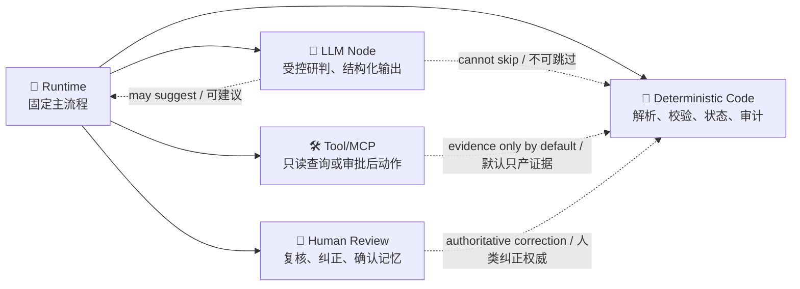
```mermaid
flowchart LR
    A["🧭 Runtime<br/>固定主流程"] --> B["🧩 Deterministic Code<br/>解析、校验、状态、审计"]
    A --> C["🤖 LLM Node<br/>受控研判、结构化输出"]
    A --> D["🛠️ Tool/MCP<br/>只读查询或审批后动作"]
    A --> E["👤 Human Review<br/>复核、纠正、确认记忆"]

    C -. "may suggest / 可建议" .-> A
    C -. "cannot skip / 不可跳过" .-> B
    D -. "evidence only by default / 默认只产证据" .-> B
    E -. "authoritative correction / 人类纠正权威" .-> B
```

LLM can recommend routes from a whitelist, but it cannot rewrite the pipeline, skip validation,
write confirmed memory, or execute side-effect actions.

---

## 2. Terminology / 中英文术语对照

| 中文术语 | English term | Code / contract | Meaning / 含义 |
| --- | --- | --- | --- |
| 预警 | Alert | `AlertInput` | SOC Agent 的标准输入，不直接绑定某一家厂商字段 |
| 原始日志 | Raw message | `raw_message`, `source.raw` | 供应商或平台原始文本，优先作为事实重建依据 |
| 标准化 | Normalization | `normalizers/` | 将 PingAn/EDR/APT/HIDS/F5 等输入转成 canonical alert |
| 证据层 | Evidence Layer | `EvidenceLayer` | 区分 raw、canonical、enriched、derived 等证据来源 |
| 字段可信度与推理准入 | Field Trust / Reasoning Eligibility | `FieldTrust` | `source_trust` 表示来源可信度；`reasoning_status/participates` 独立表示是否作为事实来源参与 |
| 角色声明 | Role Claim | `RoleClaim` | 区分网络观测、厂商角色断言、场景推导、外部证据和人工确认 |
| 场景假设 | Scenario Hypothesis | `ScenarioHypothesis` | 反弹 shell、C2、横向移动等带证据的暂定场景，不是最终 verdict |
| 角色裁决 | Role Resolution | `RoleResolution` | 给出 observed/tentative/conflicted/confirmed/unresolved 状态和暂定值 |
| 冲突报告 | Conflict Report | `ConflictReport` | 记录上游字段、加工字段、模型结论之间的冲突 |
| 受限分析证据 | Bounded Analysis Evidence | `BoundedAnalysisEvidence` | 允许进入模型的限长、带来源证据；默认脱敏，批准环境可显式保留原值，不等于完整 raw payload |
| Skill 选择上下文 | Skill Context | `SocSkillContext.v2` | 当前选择清单、原因、命中特征、包内 bounded guidance、package/projection hash 与 token budget；不是完整 `SKILL.md` 正文 |
| 分析运行 | Analysis Run | `AnalysisRun` | 一次 alert 分析的完整记录、trace、result |
| 决策审计 | Decision Audit | `DecisionAuditRecord` | analyze/replay/correct 的判定沿革和证据策略摘要，不替代完整 run |
| 业务变更审计 | Mutation Audit | `SocMutationAuditRecord` | L3 服务命令的追加式审计；记录 actor、来源、原因、幂等和有界结果，不保存原始敏感 payload |
| 预警摘要 | Alert Summary | `AlertSummary` | 轻量读模型，用于列表、关联、复核和 demo |
| 复核队列 | Review Queue | `ReviewQueueItem` | 需要分析师看的工作项 |
| 调查上下文 | Investigation Context | `InvestigationContext` | Review/Lead Agent/TUI/Web 共享的受控上下文 |
| 统一调查视图 | Unified Investigation View | `UnifiedInvestigationView` | 将分析、证据、相似预警、记忆、外部反馈拼成可读视图 |
| 调查证据 | Investigation Evidence | `InvestigationEvidence` | 只读工具/MCP 查询结果，不直接改变 verdict |
| 受治理上下文事实 | Governed Context Fact | `GovernedContextFact` | 共享租户、时效、来源、状态和审计信封的强类型运营事实 |
| 授权活动事实 | Authorized Activity Fact | `AuthorizedActivityFact` | 某项扫描、运维、测试或服务行为在限定范围和时间内已获授权；不是永久白名单 |
| 授权匹配结果 | Authorization Match Result | `AuthorizationMatchResult` | 当前告警与有效授权事实的确定性匹配、缺口、冲突和来源说明 |
| 安全演练事实 | Security Exercise Fact | `SecurityExerciseCampaignFact` | 护网/红蓝对抗的时间、目标、交战规则和权威来源 |
| 演练参与者事实 | Exercise Participant Fact | `ExerciseParticipantFact` | 某个时段内团队角色与 IP/账号/证书等标识的可审计关联 |
| 参与者归属结果 | Participant Attribution Result | `ParticipantAttributionResult` | 根据事件时间和标识判断红队/蓝队/白队等身份，允许 ambiguous/conflict |
| 检测真值 | Detection Truth | `actual_verdict` | 告警描述的攻击/异常行为是否真实发生 |
| 运营处置 | Operational Disposition | `SocOperationalDisposition` | 真实行为最终应升级、复核、抑制或按授权良性真阳关闭；与 detection truth 分离 |
| 影子处置建议 | Shadow Disposition Proposal | `SocDispositionProposalRecord` | 基于确定性上下文提出运营结论，但不应用、不关单 |
| 领域研判 | Domain Triage | `SocDomainTriageResult` | 面向 APT/EDR/HIDS/网络/账号等领域的研判结果 |
| 场景发现 | Scenario Finding | `SocDomainFinding` | 反弹 shell、横向移动、恶意外联等场景化发现 |
| 主控智能体 | SOC Lead Agent | `soc-triage` profile | DeerFlow lead_agent 派生的 SOC 对话/编排入口 |
| 子能力 | Skill | `skills/public/soc-*` | 可复用的研判方法，不直接调用生产系统 |
| 动作适配器 | Action Adapter | `SocActionAdapter` | 工具能力边界，可是 in-memory/mock/MCP-backed |
| MCP 工具 | MCP Tool | MCP server tool | 外部系统能力的标准工具接口，例如 CMDB/EDR/TI |
| 动作建议 | Action Proposal | `SocAgentActionProposal` | Agent 建议下一步查什么或做什么 |
| 审批请求 | Approval Request | `SocAgentApprovalRequest` | 高风险动作进入统一审批 inbox |
| 审批授权 | Approval Grant | `SocAgentApprovalGrant` | 一次性 execution token，不等于自动执行 |
| 处置反馈 | External Disposition | `SocExternalDispositionEvent` | Zeus/老平台/工单系统同步回来的状态和理由 |
| 候选记忆 | Memory Candidate | `SocMemoryCandidate` | 待复核的经验、事实、模式、反馈 |
| 确认记忆 | Confirmed Memory | `SocMemoryRecord` | 人类确认后的可检索记忆，默认仍受 retrieval policy 约束 |
| 能力卡 | Capability Card | PingAn capability docs | 描述一个业务能力应落到 skill、MCP、adapter、memory 还是 eval |

---

## 3. Product Shape / 产品形态

SOC Agent exposes several entry surfaces, but all of them must call the same core services.

SOC Agent 有多个入口，但不能各写一套业务逻辑：

| Entry / 入口 | User / 用户 | Purpose / 用途 | Rule / 约束 |
| --- | --- | --- | --- |
| CLI | Developer, maintainer | Demo, smoke, replay, correction | Thin wrapper over services |
| TUI / terminal workbench | Analyst, operator | Queue review, context view, agent chat | DeerFlow-aligned, no independent business logic |
| Web UI | Analyst, team lead | Review inbox, approval inbox, investigation view | Reads Gateway APIs backed by services |
| Kafka daemon | Background ingestion | Consume strict versioned alert envelopes and create review items | Validate/unwrap only; raw source payload remains intact |
| DeerFlow Lead Agent | Analyst chat | Ask questions around a review item, propose next steps | Uses bounded review context |
| External systems | Zeus, old SOC platform, ticketing | Push status/reason back into SOC Agent | Source adapter maps to canonical command, then authenticated Gateway/service boundary |

Gateway compatibility contract:

- Existing `/api/soc/*` paths and direct typed success bodies are stable for current Web clients.
- Every SOC route uses `create_soc_router()` to return `X-SOC-API-Version: 1`, correlated
  `X-Request-Id` / `X-Trace-Id`, and sanitized RFC Problem Details for route-level failures.
- The OpenAPI summary snapshot under `contracts/soc_api/` is the review gate for path/method/header/error
  changes. Authenticated Gateway identity is authoritative; a caller header cannot replace it.

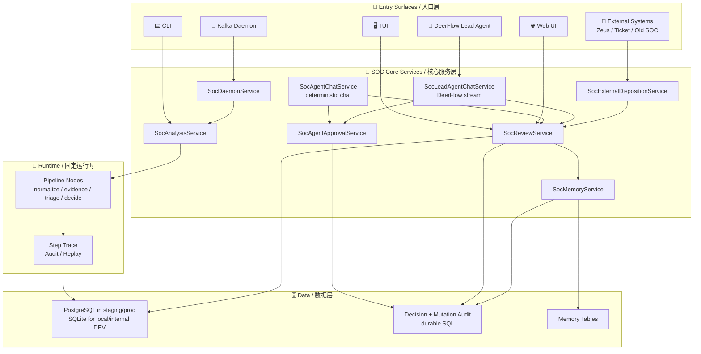
```mermaid
flowchart TB
    subgraph Entry["🚪 Entry Surfaces / 入口层"]
        CLI["⌨️ CLI"]
        TUI["🖥️ TUI"]
        WEB["🌐 Web UI"]
        KAFKA["📨 Kafka Daemon"]
        LEAD["🤖 DeerFlow Lead Agent"]
        EXT["🔁 External Systems<br/>Zeus / Ticket / Old SOC"]
    end

    subgraph Core["🧠 SOC Core Services / 核心服务层"]
        ANALYSIS["SocAnalysisService"]
        REVIEW["SocReviewService"]
        MEMORY["SocMemoryService"]
        DAEMON["SocDaemonService"]
        CHAT["SocAgentChatService<br/>deterministic chat"]
        LEAD_CHAT["SocLeadAgentChatService<br/>DeerFlow stream"]
        DISPOSITION["SocExternalDispositionService"]
        APPROVAL["SocAgentApprovalService"]
    end

    subgraph Runtime["🧭 Runtime / 固定运行时"]
        PIPELINE["Pipeline Nodes<br/>normalize / evidence / triage / decide"]
        TRACE["Step Trace<br/>Audit / Replay"]
    end

    subgraph Data["🗄️ Data / 数据层"]
        DB["PostgreSQL in staging/prod<br/>SQLite for local/internal DEV"]
        AUDIT_DB["Decision + Mutation Audit<br/>durable SQL"]
        MEMORY_DB["Memory Tables"]
    end

    CLI --> ANALYSIS
    TUI --> REVIEW
    WEB --> REVIEW
    KAFKA --> DAEMON
    LEAD --> LEAD_CHAT
    EXT --> DISPOSITION

    DAEMON --> ANALYSIS
    CHAT --> REVIEW
    CHAT --> APPROVAL
    LEAD_CHAT --> REVIEW
    LEAD_CHAT --> APPROVAL
    DISPOSITION --> REVIEW
    REVIEW --> MEMORY
    ANALYSIS --> PIPELINE
    PIPELINE --> TRACE
    TRACE --> DB
    REVIEW --> DB
    MEMORY --> MEMORY_DB
    APPROVAL --> AUDIT_DB
    REVIEW --> AUDIT_DB
    MEMORY --> AUDIT_DB
```

Product conclusion:

- Build a full SOC work system, not only a CLI parser.
- Keep the first usable path narrow: one alert in, reviewable investigation out.
- Keep all user-facing surfaces thin: CLI/Web/TUI/daemon call the same service layer.
- Keep DeerFlow reusable: SOC Lead Agent should use DeerFlow `lead_agent` profile/skills/MCP path, not a separate LangGraph clone unless proven necessary.

---

## 4. End-to-End Flow / 端到端流程

The currently implemented lifecycle is documented in detail in
`.notes/ai_soc/alert-lifecycle-flow.md`. The summary below is the review-level target flow. Steps 7
and 9 are implemented for authorized-activity enrichment plus shadow disposition; campaign,
participant and additional governed-fact types remain planned.

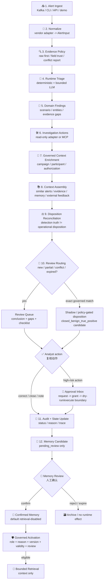
```mermaid
flowchart TD
    A["📥 1. Alert Ingest<br/>Kafka / CLI / API / demo"] --> B["🧾 2. Normalize<br/>vendor adapter -> AlertInput"]
    B --> C["🔍 3. Evidence Policy<br/>raw first / field trust / conflict report"]
    C --> D["🧠 4. Runtime Triage<br/>deterministic + bounded LLM"]
    D --> E["🧩 5. Domain Findings<br/>scenario / entities / evidence gaps"]
    E --> F["🛠️ 6. Investigation Actions<br/>read-only adapter or MCP"]
    F --> A1["🪪 7. Governed Context Enrichment<br/>campaign / participant / authorization"]
    A1 --> G["📚 8. Context Assembly<br/>similar alerts / evidence / memory / external feedback"]
    G --> D1["⚖️ 9. Disposition Reconciliation<br/>detection truth != operational disposition"]
    D1 --> H{"👤 10. Review Routing<br/>new / partial / conflict / expired?"}
    H -->|"yes"| H1["Review Queue<br/>conclusion + gaps + checklist"]
    H -->|"exact governed match"| H2["Shadow / policy-gated disposition<br/>closed_benign_true_positive candidate"]
    H1 --> I{"✅ Analyst action<br/>复核动作"}
    H2 --> I
    I -->|"correct / close / note"| J["📝 11. Audit + State Update<br/>status / reason / trace"]
    I -->|"high-risk action"| K["🛂 Approval Inbox<br/>request -> grant -> dry-run/execute boundary"]
    J --> L["🧬 12. Memory Candidate<br/>pending_review only"]
    K --> J
    L --> M{"👤 Memory Review<br/>人工确认"}
    M -->|"confirm"| N["📖 Confirmed Memory<br/>default retrieval-disabled"]
    N --> P["🛡️ Governed Activation<br/>role + reason + version + validity + review"]
    P -->|"eligible"| Q["🔎 Bounded Retrieval<br/>context only"]
    M -->|"reject / expire"| O["🗃️ Archive / no runtime effect"]
```

Important behavior:

- A result must still be produced even when tools are unavailable.
- Missing evidence should become explicit evidence gaps and human checklist items.
- Historical similar alerts, external feedback, and confirmed memory are not fallback-only;
  they are part of the normal investigation context.
- Tool results are evidence. They do not silently mutate verdict, memory, or status.
- Authorization never rewrites detection truth. A real exploit or prohibited operation can remain
  `true_positive` while the operational disposition is `closed_benign_true_positive` because it was
  explicitly authorized.
- Only a complete governed-context chain that matches event time, tenant/environment, participant,
  subject, target and behavior scope may reduce repetitive review. Identity attribution alone is not
  authorization. Partial, expired, conflicting or new patterns still go to humans.
- High-risk actions go to approval inbox. Approval grant is still not automatic execution.

---

## 5. Module Responsibilities / 模块职责

### 5.1 Entry Layer / 入口层

| Module / 模块 | Responsibility / 职责 | Must not do / 禁止 |
| --- | --- | --- |
| `backend/soc_agent/cli.py` | CLI commands for demo, review, memory, daemon smoke | No direct DB business mutation except through services |
| Gateway API routes | Web/TUI/API access to review, memory, approval through the shared v1 transport helper | No duplicate runtime logic, ad hoc error shape or trusted caller actor header |
| Kafka consumer / daemon | Validate `SocAlertRawEnvelope`, preserve raw payload, map to daemon messages, call `SocDaemonService` | No bare alert object, vendor parsing or direct alert analysis logic |
| DeerFlow Lead Agent bridge | Use `SocLeadAgentChatService` to stream DeerFlow `lead_agent(agent_name=soc-triage)` around bounded investigation context | No direct repository access, arbitrary MCP exposure, or unbounded raw secret/context injection |
| External disposition adapter | Map old-platform status/reason to canonical event and call the authenticated canonical ingress | No direct DB, verdict, queue or confirmed-memory write |

### 5.2 Core Service Layer / 核心服务层

| Service / 服务 | Public role / 对外角色 | Review focus / 评审重点 |
| --- | --- | --- |
| `SocAnalysisService` | Analyze alert, replay run, update summary | Runtime determinism, trace, validation |
| `SocReviewService` | Review queue, correction, notes, investigation context | State transition, audit, memory candidate bridge |
| `SocMemoryService` | Candidate review, governed retrieval activation, confirmed memory retrieval | Human confirmation, optimistic concurrency, validity/review and audit boundary |
| `SocDaemonService` | Background ingestion orchestration | Idempotency, backoff, worker result |
| `SocAgentChatService` | Deterministic SOC chat/event shell | Bounded context and proposal parsing; not the DeerFlow Lead Agent stream |
| `SocLeadAgentChatService` | DeerFlow `soc-triage` Lead Agent streaming entry | Reuse DeerFlow profile/skills/MCP, bounded review artifact and proposal boundary |
| `SocAgentApprovalService` | Approval request/grant/dry-run/execute boundary | Permission, token, audit, no silent execute |
| `SocExternalDispositionService` | External status/reason sync | Mapping, target resolution, idempotency |
| `SocGovernedContextService` | Govern typed fact lifecycle and source/version history | GF-01 implemented: proposal, activation, validity, revocation, audit |
| `SocAuthorizedActivityService` | Read-only authorized-activity matching over governed facts | AA-01 implemented: canonical query, historical version selection, scope/time/freshness explanation |
| `SocAuthorizationEnrichmentService` | Persist/replay one authorization match as investigation context | EX-01 implemented: append-only, idempotent, read-only projection; no disposition |
| `SocDispositionProposalService` | Produce an auditable shadow operational proposal from persisted context | DP-01 implemented: exact + true-positive gate; no apply/close/action |
| `SocDispositionEvaluationService` | Persist explicit labels, create reproducible samples, derive reviewer inboxes, compute read-only gate reports | EV-01..EV-03 implemented: CLI/API/Web/TUI/trusted external capture share one append-only service; passed report still cannot auto-close |
| `SocSecurityExerciseContextService` (planned) | Compose campaign, participant attribution and authorization | Red/blue/white-team identity is not authorization by itself |
| `SocCorrelationService` | Deterministic similar-alert and historical-evidence lookup | Shared summary repository, structured reasons, no LLM/decision mutation |
| `SocMainOrchestratorService` | Read-only PingAn eval/demo orchestration for analysis/correlation/selected actions/domain report | Not wired as a second live Runtime; typed `CorrelationResult` bridge; no direct repository/tool/high-risk side effects |

### 5.3 Runtime Pipeline / 固定运行时

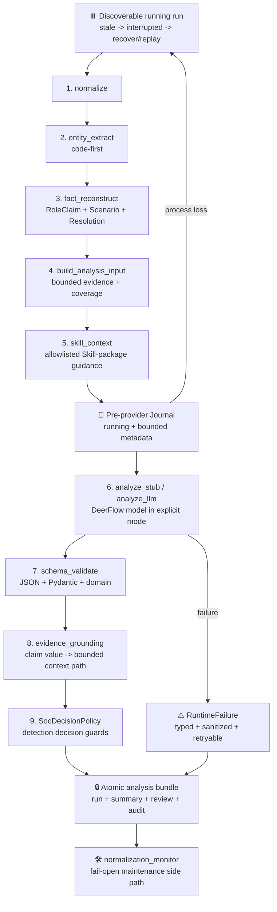
```mermaid
flowchart TD
    I["🧾 Raw Alert Payload"] --> N["1. normalize"]
    N --> X["2. entity_extract<br/>code-first"]
    X --> F["3. fact_reconstruct<br/>RoleClaim + Scenario + Resolution"]
    F --> B["4. build_analysis_input<br/>bounded evidence + coverage"]
    B --> S["5. skill_context<br/>allowlisted Skill-package guidance"]
    S --> J["📝 Pre-provider Journal<br/>running + bounded metadata"]
    J --> L["6. analyze_stub / analyze_llm<br/>DeerFlow model in explicit mode"]
    L --> V["7. schema_validate<br/>JSON + Pydantic + domain"]
    V --> G["8. evidence_grounding<br/>claim value -> bounded context path"]
    G --> R["9. SocDecisionPolicy<br/>detection decision guards"]
    R --> P["🔒 Atomic analysis bundle<br/>run + summary + review + audit"]
    L -->|failure| E["⚠️ RuntimeFailure<br/>typed + sanitized + retryable"]
    E --> P
    J -->|process loss| I["⏸️ Discoverable running run<br/>stale -> interrupted -> recover/replay"]
    P --> M["🛠️ normalization_monitor<br/>fail-open maintenance side path"]
```

`SocCorrelationService`, `SocDomainTriageService`, investigation actions, governed-context matching,
memory retrieval, and the DeerFlow SOC Lead Agent are **not hidden nodes inside this base
Runtime**. They consume the persisted run through explicit orchestration/review services. The base
Runtime produces the detection assessment; a later deterministic disposition reconciliation may
combine it with governed authorization facts without rewriting the immutable original run. This
keeps one-alert execution replayable while allowing richer investigation workflows to evolve
independently.

The primary analysis bundle has its own `AnalysisPersistence` transaction. L3 service commands use
the separate `SocMutationUnitOfWork`: one correction, review close/note, memory review, approval
transition/action boundary, or external-disposition apply either commits all SQL writes plus one
`SocMutationAuditRecord`, or rolls them all back. Process-local `SocEvent` emission is buffered until
commit. `DecisionAuditRecord` remains the decision-lineage record; mutation audit is the
cross-command actor/idempotency/result record, so neither table replaces the other.

The provider call has an earlier durability boundary because it cannot be rolled back. Persisted
CLI/Kafka analysis uses `DeterministicAnalysisRuntime.analyze_journaled()`: immediately before the
analyzer is invoked, `SocAnalysisService` commits the same `AnalysisRun(status=running)` with a
bounded `AnalysisRequestJournal`. The journal contains hashes, model/prompt/step, compact source and
evidence counts, request/trace/actor, and a hashed idempotency key; it never contains a rendered
prompt, evidence values, provider headers/responses, credentials, or tokens. The existing governed
`input_payload` remains the replay snapshot. Final bundle commit changes the journal to
`completed/failed`; process loss or bundle rollback leaves the pre-call row discoverable. Operators
use `soc recover RUN_ID --reason ...` after the stale window, which marks the old run `interrupted`
through an expected-`running` single-winner database claim and creates one idempotent replay run
linked by `replay_of_run_id`. An interrupted claim without a replay remains lease-protected until its
stale window expires.

Explicit correlation bridge / 显式历史关联桥接：

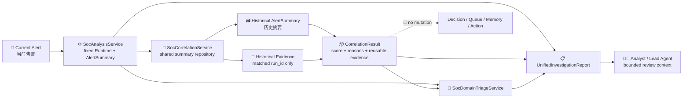
```mermaid
flowchart LR
    A["🧾 Current Alert<br/>当前告警"] --> B["⚙️ SocAnalysisService<br/>fixed Runtime + AlertSummary"]
    B --> C["🔎 SocCorrelationService<br/>shared summary repository"]
    C --> D["🗃️ Historical AlertSummary<br/>历史摘要"]
    C --> E["🧰 Historical Evidence<br/>matched run_id only"]
    D --> F["📦 CorrelationResult<br/>score + reasons + reusable evidence"]
    E --> F
    B --> G["🧩 SocDomainTriageService"]
    F --> G
    B --> H["📋 UnifiedInvestigationReport"]
    F --> H
    G --> H
    H --> I["🧑‍💻 Analyst / Lead Agent<br/>bounded review context"]
    F -. "🚫 no mutation" .-> J["Decision / Queue / Memory / Action"]
```

The analysis and correlation services share one `AlertSummaryRepository`, but the orchestrator does
not query it directly. Local/eval sessions use an in-memory implementation; production must inject a
fully configured service pair backed by the SOC PostgreSQL repository, preserving atomic analysis
persistence. Structured correlation is authoritative; metadata counts are display-only
projections. Reusable evidence is selected by the matched historical `run_id`, preventing a repeated
`alert_id` from mixing current and historical action results. A match can enrich domain findings and
human review, but it cannot by itself suppress/deduplicate an alert or alter the Runtime decision.

Correlation evaluation / 关联质量评测：

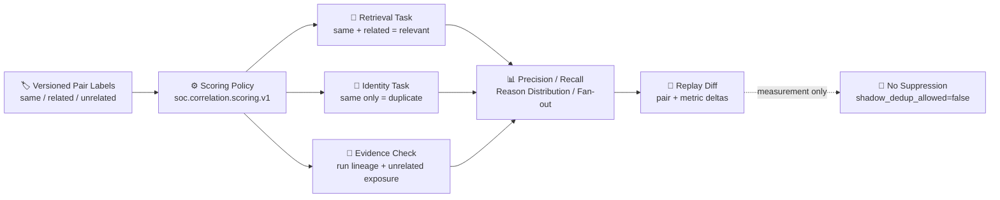
```mermaid
flowchart LR
    A["🏷️ Versioned Pair Labels<br/>same / related / unrelated"] --> B["⚙️ Scoring Policy<br/>soc.correlation.scoring.v1"]
    B --> C["🔎 Retrieval Task<br/>same + related = relevant"]
    B --> D["🧬 Identity Task<br/>same only = duplicate"]
    C --> E["📊 Precision / Recall<br/>Reason Distribution / Fan-out"]
    D --> E
    B --> F["🧰 Evidence Check<br/>run lineage + unrelated exposure"]
    F --> E
    E --> G["🔁 Replay Diff<br/>pair + metric deltas"]
    G -. "measurement only" .-> H["🚫 No Suppression<br/>shadow_dedup_allowed=false"]
```

`soc eval correlation` consumes a versioned, vendor-neutral label set. `same_incident` and
`related_distinct` are both useful historical retrievals, but only `same_incident` is a possible
duplicate identity. The current controlled baseline has 8 pairs: retrieval precision `0.667`, recall
`1.0`; an offline score threshold of `130` also yields duplicate precision `0.667`, recall `1.0`
because one related-but-distinct endpoint occurrence crosses the threshold. Historical evidence has
zero cross-run lineage leaks, but two unrelated retrieved candidates expose irrelevant evidence.
These numbers are diagnostic, not rollout gates. The current scorer has no incident-identity proof,
so automatic dedup/suppression remains forbidden. `--baseline-json` compares metric, pair, reason,
fan-out and evidence changes while ignoring report timestamps.

Runtime rules:

- Every node has typed input/output.
- LLM output must pass parser and schema validation.
- Analyzer evidence must pass deterministic grounding against the exact bounded prompt projection.
  Ungrounded values or invalid source paths cannot disappear behind a high confidence score; they
  become structured review reasons.
- The live analyzer reuses DeerFlow `create_chat_model()` and configured model names. Entry surfaces
  select it explicitly with `--analyzer-mode llm` or `SOC_ANALYZER_MODE=llm`; direct service tests
  remain deterministic by default.
- Model calls record actual model name, prompt/parser versions, duration, bounded token usage and
  safe provider metadata. They never persist API keys, request headers, full prompts or raw responses.
- Before a persisted analyzer call, the service commits a bounded request journal. A normal replay
  rejects a still-running run; recovery requires the stale-window command and preserves the old
  run as `interrupted` rather than overwriting it.
- Process-local model admission is bounded independently from Kafka workers with
  `SOC_LLM_MAX_CONCURRENCY`, optional `SOC_LLM_REQUESTS_PER_MINUTE`, and
  `SOC_LLM_ADMISSION_TIMEOUT_SECONDS`. One provider invocation is separately bounded by
  `SOC_LLM_CALL_TIMEOUT_SECONDS`; timeout is a retryable `analyzer_timeout`, not a silent hang.
- Bad JSON repair is allowed only as a logged parser step. Narrow schema-shape repair may unwrap a
  single-item verdict or evidence-value array, but multi-item or lossy coercion still fails schema
  validation.
- Prompt context, model response, analysis text, evidence count/value size, knowledge candidates,
  and projection depth/list sizes all have hard bounds.
- Replay must be possible from stored run payload and deterministic settings. Recovery creates a
  new replay run and records `replay_of_run_id`; it never turns the original run into the new result.
- Runtime failures are stored as `RuntimeFailure(kind, step_name, retryable, safe message)`. Retryable
  Kafka failures do not commit the offset or open a duplicate analyst queue; non-retryable failures
  are dead-lettered and enter ReviewQueue.
- The primary business write is one transaction through `AnalysisPersistence.save_analysis_bundle()`:
  `AnalysisRun`, `AlertSummary`, optional `ReviewQueueItem`, and `DecisionAuditRecord` either all
  commit or all roll back. Normalization maintenance remains a fail-open post-write side path.
- Runtime never calls production side-effect tools directly.

### 5.4 Normalizer and Evidence Layer / 标准化与证据层

The system must handle vendor differences without turning the core schema into a vendor schema.

处理不同供应商日志的方式：

1. Vendor adapter maps raw input to canonical `AlertInput`.
2. Evidence policy records which fields are trusted, weak, conflicting, or derived.
3. PingAn deterministically parses all available `zeusRawLogs[].message` values through a
   source-scoped parser registry. Supported MVP formats are delimited JSON, quoted KV,
   complete direct/prefixed JSON objects, comma-delimited KV, and loose KV.
   Supported nested JSON/HTTP fields are decoded by an allowlisted decoder with size limits;
   parser evidence preserves original values. Model-boundary projection defaults to redaction;
   an explicitly approved environment may select `SOC_LLM_SENSITIVE_EVIDENCE_MODE=full`.
4. PingAn uses a strict message-or-fallback boundary. If at least one `zeusRawLogs[].message`
   is deterministically parsed, only parsed message fields may feed canonical mapping, role/scenario
   facts, conflict reconstruction, and model-bound evidence. Zeus sibling/processed fields remain in
   immutable raw evidence only; they cannot become low-trust alternative claims or synthetic
   conflicts. Structured fallback is enabled only when zero messages parse. Exact topic
   `T_GBD_zeus_data` is currently the sole high-trust structured-fallback allowlist; every other
   fallback defaults to low trust. Similar topic names, prefixes, source type, and message absence do
   not inherit the exception.
5. The original payload is never replaced: `AlertInput.raw` and `AnalysisRun.input_payload`
   retain every hit log, raw event, message, and platform field for replay and audit.
6. The first successfully parsed message becomes primary evidence; up to four additional messages
   become full bounded supplementary evidence. Network, HTTP, file, and process facts remain
   per-message observations with stable evidence paths; different sessions, HTTP transactions, or
   process executions are not collapsed into one synthetic conflict. Exact-path
   `SourceFieldSemantic` entries drive projection priority. High-value values outside the full-message
   budget enter the generic, size-bounded `BoundedEvidenceHighlight` projection with occurrence count
   and at most five representative provenance paths. Complete covered paths stay in
   `EvidenceCoverageReport` rather than consuming Prompt tokens. Sensitive values still obey
   redacted/full evidence mode. Analysis nodes receive this bounded contract, never the unbounded
   vendor payload.
7. PingAn NIDS maps the observed wire five-tuple (`sip/sport/dip/dport/proto`) into canonical
   source/destination fields and preserves every message as a `NetworkObservationRef`. Sensor
   `alert.source/target` are rule-relative endpoints stored separately on that observation; they are
   not automatically attacker/victim or wire source/destination. Structured HTTP metadata becomes
   canonical plus per-message `HttpObservationRef`. Generic `query` is not promoted to DNS/domain
   without explicit protocol evidence.
8. Sensor enforcement/result fields and protocol response metadata are not detection truth:
   `allowed` only says the sensor did not block, vendor `attack_res` remains an uninterpreted code,
   and HTTP 2xx does not prove exploit or command success. The adapter emits these constraints as
   `SourceFieldSemantic`; Suricata-style `files[]` remains transaction metadata and is not treated as
   proof of an endpoint file write. Generic Runtime remains vendor-neutral.
9. PingAn NDR/APT preserves every parsed wire session as an independent network observation and
   maps HTTP context per message. The reviewed source field named `ioc` contains vendor detection
   descriptors rather than typed indicators, so value shape cannot promote it into the threat IOC
   contract. `file_name/file_md5` become provenance-backed `observed_artifact` network-content
   evidence; they do not prove endpoint persistence, exploit success, or compromise. These aliases
   are owned by `normalizers/pingan_ndr.py`. Reviewed `rule_name`, `rule_desc`, `attack_type`,
   `host_state`, and `rule_labels` are emitted as generic provider detection assertions. Their exact
   values may support classification or effect-stage reasoning only when present in selected
   high-trust bounded evidence; the adapter does not write the Runtime verdict.
10. PingAn HIDS treats `internal_ip/agent_ip` as endpoint identity and provisional impacted-asset
    evidence, not packet source. The known `external_ip=1.1.1.1` default is retained as a
    non-reasoning `SourceFieldSemantic` and excluded from host/IOC/peer projections. Process trees,
    users and files remain per-message observations; `parent_process_id` preserves an observed ppid
    even when no parent name is available. Only reviewed event contracts
    (`bounce_shell`, `honeypot`, `malic_opera`) create event-scoped network observations; top-level
    canonical source/destination stay empty. These aliases are owned by
    `normalizers/pingan_hids.py`.
11. PingAn EDR keeps a single canonical endpoint/process/file summary for ordinary consumers and
   preserves every nested `detailsN` record as a replayable `ProcessObservationRef` or
   `FileObservationRef` with an exact evidence path. `iplist`, `str_source_ip`, and `device__ip`
   identify the endpoint and provisional victim/impacted-asset candidates, not a network source.
   A validated `str_attack_ip` that differs from endpoint addresses may become a tentative vendor
   attacker/peer candidate and typed IOC, but never a canonical destination. Polymorphic
   `str_threat_value` and `str_activity_id` remain source semantics and cannot become IP/hash
   entities by string shape. Without explicit directional connection fields, EDR canonical
   source/destination and network observations stay empty. Only shape-valid process MD5/SHA-256
   values enter entities; invalid vendor values remain visible with typed semantics. Child process,
   file, registry, scheduled-task, artifact-existence and MITRE fields are useful investigation
   context, but none of them alone proves maliciousness or attack success. PingAn aliases and the
   historical `process_mame` typo remain inside `normalizers/pingan_edr.py`.
12. PingAn Threat Intel keeps the observed wire session and provider security roles separate.
   Nested `net.*` populates canonical session fields/observations; `attacker` and `victim` remain
   provider assertions, while `machine` is an impacted-host candidate. Asset CIDR/range scope never
   becomes a host IP. External peers/explicit IOCs, malware family and MITRE tags receive typed
   projections; provider `result=success`, reputation and severity/score metadata remain source
   semantics rather than exploit outcome or calibrated Runtime confidence. These aliases are owned
   by `normalizers/pingan_threat_intel.py`.
13. PingAn SIEM uses reviewed subtype adapters over the selected high-trust structured fallback.
   `suspicious_email` projects bounded email metadata and deterministic email/domain/URL entities;
   body text and upstream model narrative/score stay source evidence. `standard_machine_copy`
   projects host name/IP candidates without inventing a network flow or attacker. High trust means
   source provenance, not model correctness; pipeline identity is not an event actor. Unknown
   subtypes keep bounded evidence and emit mapping gaps. These aliases are owned by
   `normalizers/pingan_siem.py`.
14. If raw message parsing fails, Runtime preserves the raw text and emits a warning. If raw message
   is absent, PingAn projects only the first `zeusRawLogs[]` object as bounded structured evidence;
   later objects remain in `AlertInput.raw`. Trust is source-configured rather than inferred from
   message presence: `T_GBD_zeus_data` is a trusted internal SIEM/model source and uses high-trust
   structured fallback. Empty `zeusRawLogs=[]` is an upstream evidence gap, not synthetic evidence.
15. Strict nested JSON failure does not discard the field. Runtime attempts a conservative repair:
   accepted structures enter a separately labeled `repaired_fields` projection, while rejected or
   failed repair uses a policy-controlled string fallback. Repair is field-policy aware and validates root
   type, depth, node count, key length, and source-evidenced keys/string values. The original string
   always stays in `fields`, and repaired content never masquerades as strict-decoded source fact.
16. Long encoding-shaped values are compacted only after redaction/full-mode selection and only in
    model-bound evidence. The shared production boundary applies to every primary/supplementary
    evidence item, so every PingAn topic and future vendor receives the same protection without
    topic-specific branches. `backend/soc_agent/pipeline/encoded_context.py` owns the implementation;
    validation tools import it, while production code is forbidden from importing `validation.*`.
    It never decodes or mutates raw/parsed input. Each marker records encoding kind, original
    character count, and a short SHA-256 prefix; the audit sidecar records exact path and complete
    SHA-256. The sidecar is omitted from the prompt. An exact marker-bearing scalar may ground only
    source-field presence, encoding shape, and model-boundary omission; hidden bytes, token
    validity/identity/privileges, security outcome, and the private complete sidecar hash remain
    ungrounded.
17. Every selected message emits `MessageSchemaObservation`: `recognized` means the deterministic
   parser handled the outer message structure, even when an allowlisted nested body has its own
   decode/repair warning; `degraded` is reserved for an explicitly incomplete outer parse, and
   `unsupported` means no parser handled the selected message. Nested field damage remains visible in
   `NestedJsonRepairObservation`, the preserved source string, and parser warnings. A structural
   fingerprint supports baseline diff.
18. `EvidenceCoverageReport` records structured/parsed/decoded/repaired paths,
    canonical/fact/scenario consumers, exact bounded LLM projection, redaction/full mode,
    encoded compaction, omission reasons, truncation, and known
    high-value gaps. A candidate path is not reported as projected unless its value is present in the
    exact prompt projection, including `BoundedEvidenceHighlight` paths. High-value expectations come from `EvidenceFieldImportanceRegistry`:
    core provides vendor-neutral defaults, while source adapters may add typed rules in
    `AlertInput.extensions`. The registry evaluates both parsed message views and the selected
    `structured.*` fallback view. It is persisted for audit; the prompt receives only a compact
    coverage summary without vendor paths.
    If bounded raw evidence, highlights, canonical provenance, role facts, and scenario facts are
    all absent, Core emits the vendor-neutral critical gap `analysis_evidence.unavailable`. This is
    evidence quality, not a verdict: Decision Policy degrades evidence state, requires review, and
    blocks automation. A valid canonical input with provenance-backed facts does not trigger this
    gap merely because it has no raw-message object.
    Evidence quality is classified rather than collapsed: encoded-span compaction is informational;
    routine bounded omissions/truncation with no high-value gap produce at most `partial`; an explicit
    degraded/unsupported outer schema, high-value gap, or ungrounded analyzer citation produces
    `degraded`; fact conflicts retain the stronger `conflicted` state. `soc.decision_policy.v3` no
    longer emits `truncated_analysis_evidence` for ordinary budget pressure.
    Empty/null source leaves do not create false mapping gaps; a non-empty unknown high-value field
    remains an explicit maintenance issue. The NDR/HIDS corpus audit evaluates each non-empty parsed
    leaf instance rather than relying only on path aggregates, so nested `_origin.*`, `payload.*`,
    and messages beyond the full supplementary limit cannot pass through an uncounted blind spot.
19. Clean vendors may bypass heavy conflict handling, but still produce canonical evidence metadata.
20. Vendor aliases stop at the source adapter. PingAn fields such as `attack_sip`, `alarm_sip`,
   `str_source_ip`, and `str_attack_ip` are converted into vendor-neutral `RoleClaim` objects;
   the generic fact reconstructor does not interpret those aliases directly.
21. Evidence trust and semantic confidence are separate. A value parsed faithfully from raw
    message may still be a wrong attacker/victim assertion from the source product.
22. Vendor-known placeholders or non-observation fields are emitted as `SourceFieldSemantic` with
    explicit reasoning/entity permissions. For example, a vendor default external IP may remain in
    raw/parsed evidence for audit while being forbidden from canonical entities, IOC extraction and
    network-peer reasoning. `participates_in_reasoning=false` is enforced at the model projection
    boundary with omission reason `adapter_excluded_from_reasoning`; it is not merely Prompt advice.
    Core Runtime does not know vendor aliases or placeholder values.
23. External SOAR/asset/related-alert context remains separated from event facts. Asset owner or
    logged-on account is not automatically the event actor; historical automated dispositions are
    not independent human evidence. Deferred external context is visible in coverage and is later
    admitted through typed investigation/correlation services.

Schema drift workflow / 结构漂移流程：

1. Offline onboarding still uses `soc normalize drift` and `--schema-baseline` to compare a reviewed
   sample corpus before deployment.
2. An engineer accepts production baselines with `soc normalize baseline-accept` or
   `POST /api/soc/normalization/baselines`. Baselines are versioned, scoped by tenant/source/adapter/
   parser/version, persisted in `soc_normalization_schema_baselines`, and never self-approved.
3. Every persisted CLI/Kafka analysis calls `SocNormalizationMaintenanceService.monitor_run()` after
   the normal run/summary/queue/audit writes. Missing baseline, novel fingerprint, degraded or
   unsupported schema, high-value mapping gap, and bounded-evidence truncation become deduplicated
   `NormalizationMaintenanceIssue` records. Monitoring failure is fail-open for alert analysis and is
   recorded in `NormalizationMonitoringResult.warnings`. A truncation maintenance issue is an
   operational capacity/mapping signal; it does not by itself make the Decision evidence degraded.
4. Accepting a baseline supersedes the prior active version and resolves covered `baseline_missing` /
   `novel_schema` issues. Recurrence increments `occurrence_count`; a resolved/ignored issue that
   recurs is reopened.
5. Operators use `soc normalize issues`, Review TUI `/normalization` and `/norm-update`, or the Web
   workbench at `/workspace/soc/normalization`. Gateway metrics expose bounded type/severity/source
   counts; Kafka JSONL metrics include per-message issue count/IDs/warnings.
6. `soc normalize suggest` is an offline-only assistant. It emits a value-free path prompt and can
   either replay a recorded response or call a DeerFlow-configured model with `--live-llm`. Both paths
   validate suggestions against observed source paths and a canonical target whitelist, keep invalid
   proposals as rejected, and always return `auto_apply_allowed=false`.
7. A new fingerprint only means the structure changed. It is maintenance evidence, never a verdict,
   memory fact, suppression decision, or automatic parser patch.

Conflict adjudication / 冲突裁决：

- `source` / `destination` are observed network roles; they are not globally equivalent to
  `attacker` / `victim`.
- Scenario hypotheses determine which semantic constraints are valid. For reverse connection,
  `source=victim` and `destination=attacker` is consistent rather than contradictory.
- `RoleResolution` always exposes status, provisional value, evidence gaps, manual checks, and
  supporting/contradicting claim IDs. A conflicted resolution may provide a current conclusion,
  but it remains visibly provisional.
- Supplementary raw messages participate as independent claim sources. They are not only appended
  to an LLM prompt.
- An unselected structured fallback is audit evidence only. When `raw_message_first` succeeds, its
  `FieldTrust` must be non-participating and it cannot re-enter claims, scenarios, conflicts, or the
  model projection through the fact layer.
- A canonical projection inherits `source_trust` from `CanonicalFieldProvenance`. When it duplicates
  already selected raw evidence, it remains high-trust but uses
  `reasoning_status=excluded_duplicate_projection` and `participates=false`; exclusion must never be
  represented by lowering source trust.
- Canonical provenance is an evidence contract, not a best-effort label: the recorded source path
  must actually explain the selected value. Similar field names with different values are not valid
  provenance.
- Fact reconstruction never determines `response_target`. Action type, policy, asset evidence,
  approval, and the action adapter jointly determine an operational target later.
- No role resolution alone enables an action. `automation_allowed` remains false at this layer,
  including for human-confirmed facts.

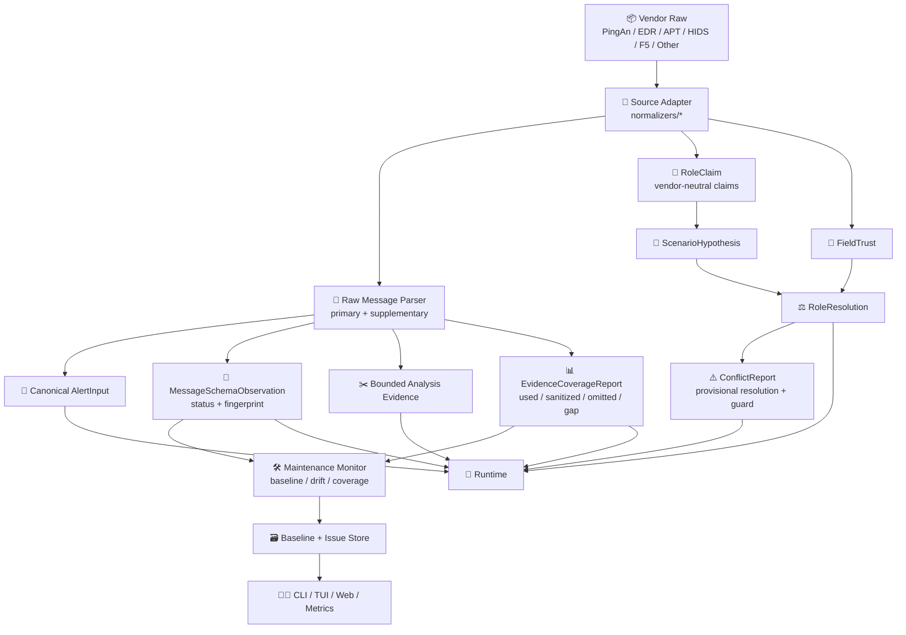
```mermaid
flowchart TB
    RAW["📦 Vendor Raw<br/>PingAn / EDR / APT / HIDS / F5 / Other"] --> ADAPTER["🔌 Source Adapter<br/>normalizers/*"]
    ADAPTER --> PARSER["🧾 Raw Message Parser<br/>primary + supplementary"]
    PARSER --> CANON["📄 Canonical AlertInput"]
    PARSER --> SCHEMA["🔎 MessageSchemaObservation<br/>status + fingerprint"]
    PARSER --> BOUNDED["✂️ Bounded Analysis Evidence"]
    PARSER --> COVER["📊 EvidenceCoverageReport<br/>used / sanitized / omitted / gap"]
    SCHEMA --> MONITOR["🛠️ Maintenance Monitor<br/>baseline / drift / coverage"]
    COVER --> MONITOR
    MONITOR --> MAINTDB["🗃️ Baseline + Issue Store"]
    MAINTDB --> OPS["🧑‍💻 CLI / TUI / Web / Metrics"]
    ADAPTER --> CLAIM["🧾 RoleClaim<br/>vendor-neutral claims"]
    ADAPTER --> TRUST["🧪 FieldTrust"]
    CLAIM --> SCENARIO["🧠 ScenarioHypothesis"]
    SCENARIO --> RESOLVE["⚖️ RoleResolution"]
    TRUST --> RESOLVE
    RESOLVE --> CONFLICT["⚠️ ConflictReport<br/>provisional resolution + guard"]
    CANON --> RUNTIME["🧭 Runtime"]
    BOUNDED --> RUNTIME
    SCHEMA --> RUNTIME
    COVER --> RUNTIME
    RESOLVE --> RUNTIME
    CONFLICT --> RUNTIME
```

### 5.5 Confidence Semantics / 置信度语义

The system has several confidence-like values, but they are not interchangeable probabilities.

| Signal / 信号 | Meaning / 含义 | Current use / 当前用途 |
| --- | --- | --- |
| `EvidenceTrustLevel` | Provenance quality: raw, fallback, processed, inferred, or human-confirmed | Evidence ordering and warnings; never averaged |
| `MessageSchemaStatus` | Parser completeness: recognized/degraded/unsupported | Drift and maintenance alert; not a probability |
| `ScenarioHypothesis.confidence` | Versioned deterministic heuristic score | Scenario ordering and review context; currently uncalibrated |
| `RoleClaim/RoleResolution.semantic_confidence` | Strength of one role interpretation under a scenario | Provisional role explanation and automation guard |
| `TriageScenarioAssessment.confidence` | LLM self-assessment for one open-vocabulary scenario | Analyst explanation/eval only; must cite `AnalysisResult.evidence` indexes |
| `AnalysisResult.confidence` | Analyzer/LLM assessment for the verdict | Review display and eval only; cannot bypass validation or approval |
| `Decision.confidence_source` | Provenance of the raw decision score | Distinguishes stub heuristic, LLM self-report, human confirmation, and external disposition |
| Correction confirmation strength | Human/external categorical confirmation, optionally supplied by an analyst | Always uncalibrated; policy/explanation/source travel with the number |
| `Decision.calibrated_probability` | Versioned calibrated probability, when an approved profile exists | Currently `null`; it must never be fabricated from raw analyzer confidence |
| `Decision.evidence_state` / `review_reasons` | Operational evidence guard and structured review causes | Drives ReviewQueue/audit explanations independently of the numeric score |
| `AnalysisEvidenceGroundingReport` | Whether each analyzer evidence value exists at its declared bounded-context source | Ungrounded claims force review and remain auditable; never auto-rewrite model output |
| `AuthorizationMatchResult` | Deterministic applicability of governed authorization facts | Drives disposition eligibility; it is not an LLM probability |
| Calibration eligibility | Whether decisive facts were present in the evaluated model input | Excludes context-missing samples from analyzer calibration without discarding their business truth |
| Memory confidence | Strength of a reviewed reusable lesson | Retrieval ranking after confirmation; never promotes a candidate by itself |

Rules:

- Never average or multiply these values across layers.
- A high-trust raw field can still have low semantic confidence when the sensor assigns attacker and
  victim incorrectly.
- Current scenario/role scores are deterministic heuristics, not calibrated likelihoods. Their
  constants and taxonomy version must be replayable.
- LLM self-reported confidence is advisory. Production thresholds require labeled replay sets,
  calibration metrics, versioned thresholds, and comparison against analyst outcomes.
- A correction score is not silently presented as model probability. Human correction uses
  `human_confirmation`; an admitted trusted external disposition uses `external_disposition`.
  Both use `soc.correction_policy.v1`, preserve whether the value was explicit, carry a plain
  explanation, and force `confidence_is_calibrated=false` with no calibrated probability. The old
  external fixed `0.95` is removed.
- Offline calibration is a governed two-stage boundary. `soc eval labels prepare` extracts a compact,
  raw-payload-free review bundle from complete live-LLM `AnalysisRun` artifacts; analysts then set
  `actual_verdict`, `review_status`, reviewer, time, and reason. `soc eval labels validate` blocks
  pending labels, duplicate input hashes, and mixed model/prompt/pipeline scopes. Only a validated
  label set may enter `soc eval confidence`, which reports accuracy, Brier score, expected calibration
  error and non-empty bins and emits a provenance-bound `review_below` profile. Small or single-class
  sets are warned; the profile remains offline and `auto_action_allowed` is always false.
- `PI-03A` adds an immutable provenance seal around that label set. `soc eval labels seal` records the
  exact label-set hash, sample identity hash, tenant/environment, data class, source references,
  rationale, reviewer/status summary and optional superseded-manifest lineage; `verify` detects payload
  or review-summary drift. `simulation` and `desensitized_real` use separate supersession chains.
  A simulation manifest always exposes `mocked=true` and `real_quality_claim_allowed=false`: it can
  prove the review/calibration software flow is executable, but it cannot support a real accuracy,
  threshold, pilot or production claim. Quality promotion remains a separate evaluated and approved
  gate rather than a boolean written by the corpus manifest.
- `PI-03B` composes the existing offline Runtime/parser, scenario taxonomy, correlation and confidence
  evaluators into `soc.quality_evaluation_report.v1`; it does not introduce another verdict, scorer or
  Runtime. `ConfidenceCalibrationSample.review_source` distinguishes `human_review` from
  `simulation_fixture`, and a `desensitized_real` corpus rejects synthetic labels. `soc eval confidence`
  requires the exact manifest, while `soc eval quality` records stable component hashes and can diff a
  prior report without treating generated run/finding IDs as behavioral changes. The aggregate may mark
  the engineering flow passed, but always keeps real-quality claims, profile publication, rollout and
  automation disabled. Grounding gaps, missing taxonomy coverage and correlation false positives remain
  visible limitations instead of being hidden behind one green status.
- Calibration must separate detection truth from operational disposition. A sample can have
  `actual_verdict=true_positive` and `actual_disposition=closed_benign_true_positive` at the same
  time. If authorization was not present in the exact bounded input used by the model, record the
  known business truth but mark the analyzer sample `excluded_missing_decisive_context`; do not use
  it to punish or calibrate the analyzer. Retain it for authorization-enrichment coverage metrics.
- Missing high-value coverage, degraded/unsupported outer schemas, conflicts, and ungrounded analyzer
  citations cap an operational conclusion. Routine bounded omission remains `partial`, while encoded
  compaction alone is informational; no confidence score may silently erase any of these signals.
- Analyzer evidence uses one exact source path per item. Composite paths and descriptions that add
  uncited sibling facts are invalid. `#parsed`, `#decoded`, and `#repaired` citations are distinct
  provenance surfaces and must resolve to the exact bounded projection used for that model call.
- HTTP status, tool transport success, workflow state, ticket transition, `is_blocked`, or
  `is_banned` does not by itself prove exploit execution, command success, file creation, compromise,
  or completed response. A positive outcome claim without outcome-specific evidence forces review as
  `unproven_outcome_claim`; explicit uncertainty such as "cannot confirm success" is not such a claim.
- `SocDecisionPolicy` is the only Runtime component allowed to translate validated analysis into a
  detection `Decision`. The current policy deliberately marks stub and live-LLM confidence as
  uncalibrated and sends every such decision to human review until a labeled, approved calibration
  profile is explicitly integrated and replay-tested.
- Final lifecycle disposition is a separate deterministic reconciliation boundary. It may consume
  the detection decision plus `AuthorizationMatchResult`, but neither an LLM statement nor a memory
  match may directly close or suppress an alert.
- False-positive decisions require confirmation even when the raw score is high. Review reasons are
  structured (`confidence_not_calibrated`, `fact_conflict`, `high_value_evidence_gap`, and so on),
  persisted in the summary/queue/audit trail, and must not be replaced by one free-text reason.
- Successful mock evidence is visible for demo and audit only. Mock, denied, or failed action results
  cannot satisfy scenario tool requirements, raise domain/scenario confidence, or change verdict.

### 5.6 Structured Analyzer Result / 结构化 Analyzer 结果

The bounded analyzer emits `soc.analysis_result.v2`. It does not hide scenario reasoning inside a
free-text `reason`:

- `scenario_assessments` is open vocabulary. Upstream/deterministic scenario hypotheses are hints;
  the analyzer may confirm, refine, or reject them.
- `origin` distinguishes `upstream_hint`, `inferred`, and `hybrid`.
- A non-empty list has exactly one `is_primary=true`.
- `activity_stage` separates `detection_hit`, `attempt_observed`, `effect_observed`,
  `impact_confirmed`, and `indeterminate`. A direct response/state change may be an observed effect
  without proving material impact.
- `evidence_indices` reference the same result's bounded `evidence` array. They do not cite raw data
  outside `LLMAnalysisRequest`.
- `competing_explanations`, `evidence_gaps`, and `manual_checks` keep uncertainty actionable while
  still requiring a current verdict.
- `recommended_action` remains a safe routing suggestion, not an executed action.

`soc-analysis-v8` tells the model that each evidence description must be supported by that item's
source/value alone, that `evidence.value` must be copied from one scalar leaf, and that IP/port or
other multi-fact statements require separate exact-path evidence items. A visible encoded-omission
marker may support only presence/shape/omission, never hidden token content or validity.
`soc-analysis-json-parser-v5` rejects missing D7 fields, unsupported top-level or
scenario fields, non-numeric confidence, invalid evidence indexes, duplicate scenarios, and
zero/multiple primary scenarios. Existing stored v1-shaped objects may deserialize with empty
defaults, but new model output must explicitly satisfy v2.

Checkpoint D7 uses a real configured model only to prove this output boundary. A structural D7 pass
does not prove evidence correctness. D8 runs deterministic `soc.analysis_evidence_grounding.v2`:

- source/value mismatch, synthesized `key=value`, private omission-sidecar values, and non-scalar
  object citations are rejected; an exact visible marker-bearing scalar has the narrower grounding
  semantics described above;
- a grounded value whose description imports another bounded fact becomes
  `description_context_leakage`;
- `matched_context_paths` and `foreign_description_context_paths` keep the rejection auditable;
- rejected items remain ungrounded, so existing Decision Policy must produce degraded evidence and
  human review rather than repairing the model's semantic output.

The latest 2026-08-02 D7/D8 artifacts use `deepseek-v4-pro` with `soc-analysis-v8` after rebuilding D5
under the corrected outer-schema semantics. D7 passed its typed structural contract with 9 evidence
items. D8 accepted 5 and rejected 4 descriptions that mixed uncited sibling facts. Execution passed
while quality correctly remained blocked. Re-running the stochastic model produced different citation
mistakes, which confirms that Prompt guidance cannot replace deterministic Grounding. D9 consumed the
exact persisted D5/D7/D8 lineage and invoked `soc.decision_policy.v3` without another model call or
persistence. It preserved the `suspicious` detection verdict while producing
`evidence_state=degraded`, `needs_review=true`, four structured review reasons and
`automation_allowed=false`; routine truncation and nested parser warnings were not among those hard
reasons. D10 previously replayed the complete production
Runtime with the configured `deepseek-v4-pro` analyzer for one median-shaped representative from each
of 8 topics plus both known empty-input rows. All 10 real calls completed across 6 source families,
using 167,042 tokens and producing 8 `suspicious`, 1 `needs_review`, and 1 `unknown` result. Grounding
accepted 67 of 87 evidence items and rejected 20, including 14 description-context leakages, so the
matrix passed its execution contract with quality findings and every Decision remained review-only
with automation disabled. The empty rows exposed the generic critical
`analysis_evidence.unavailable` gap rather than allowing the model to invent missing input. The next
boundary, D11, then executed all 212 D0 rows twice through the same non-persistent control flow with
the stub analyzer. All 424 executions completed, all 212 semantic projections were stable, and both
known empty-input rows failed closed; there were no Runtime exceptions, failed rows or diagnostics.
Its 206 `unknown` / 6 `true_positive` stub outputs are control-flow coverage only, not a model-quality
claim. D11.1 then corrected evidence-quality semantics: 343 outer messages are recognized even though
12 rows retain nested parser warnings; 175 rows have routine truncation without a high-value gap and
112 rows have encoded compaction. The resulting states are 6 `conflicted`, 2 `degraded`, 198 `partial`,
and 6 `sufficient`; the only degraded rows are the two explicit high-value input gaps. All 220
non-empty stub evidence items ground successfully after empty optional command-line citations were
removed. D10 remains the paid cross-source live-model sample, while D11 proves full-corpus payload and
Runtime compatibility. PI-01 then split the first approved read-only asset-provider intake into D12-A
production-shaped code plus an explicitly fake external-network smoke, and D12-B internal real smoke.
D12-A cannot substitute for D12-B or close the real-provider gate.

---

## 6. SOC Lead Agent, Skills, MCP, and Tools / 智能体、技能、MCP、工具

The SOC Lead Agent should feel like DeerFlow, but operate inside SOC service boundaries.

SOC Lead Agent 的定位：

- It is the analyst-facing conversational agent.
- It can inspect a review item through `InvestigationContext`.
- It can select SOC skills and propose actions.
- It can call read-only adapters or MCP-backed tools through controlled bridges.
- It cannot bypass services, approval, memory review, or audit.

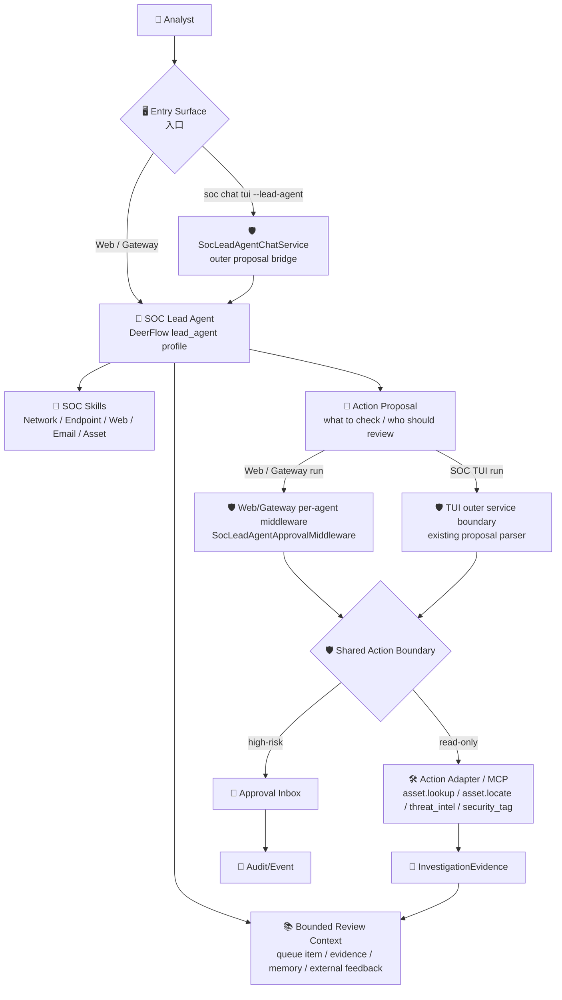
```mermaid
flowchart TD
    Analyst["👤 Analyst"] --> Surface{"🖥️ Entry Surface<br/>入口"}
    Surface -->|"Web / Gateway"| Lead["🤖 SOC Lead Agent<br/>DeerFlow lead_agent profile"]
    Surface -->|"soc chat tui --lead-agent"| TuiBridge["🛡️ SocLeadAgentChatService<br/>outer proposal bridge"]
    TuiBridge --> Lead
    Lead --> Context["📚 Bounded Review Context<br/>queue item / evidence / memory / external feedback"]
    Lead --> Skill["🧩 SOC Skills<br/>Network / Endpoint / Web / Email / Asset"]
    Lead --> Proposal["📌 Action Proposal<br/>what to check / who should review"]
    Proposal -->|"Web / Gateway run"| WebBridge["🛡️ Web/Gateway per-agent middleware<br/>SocLeadAgentApprovalMiddleware"]
    Proposal -->|"SOC TUI run"| TuiBoundary["🛡️ TUI outer service boundary<br/>existing proposal parser"]
    WebBridge --> Router{"🛡️ Shared Action Boundary"}
    TuiBoundary --> Router
    Router -->|"read-only"| Adapter["🛠️ Action Adapter / MCP<br/>asset.lookup / asset.locate / threat_intel / security_tag"]
    Router -->|"high-risk"| Approval["🛂 Approval Inbox"]
    Adapter --> Evidence["🔎 InvestigationEvidence"]
    Evidence --> Context
    Approval --> Audit["🧾 Audit/Event"]
```

`SocLeadAgentProfile.v2` installs the Web/Gateway middleware as trusted operator configuration.
Existing per-user `soc-triage` profiles are not silently overwritten and require
`soc agent install-profile --overwrite` to adopt it. Both surface bridges accept only explicit
`<soc_action_proposal>` JSON markers and converge on `SocLeadAgentActionProposalBoundary`; normal
assistant prose cannot trigger an action. The model may describe only the candidate action. Stable
proposal/decision/request IDs, actor identity, source, run/thread context and idempotency are owned by
the server. A message is bounded to five valid proposals.

This bridge is not a general tool-call interceptor. High-risk SOC adapters must remain outside the
Lead Agent's unrestricted DeerFlow/MCP tool set. The middleware can create a pending approval request,
but it never executes the action; approved execution still uses the SOC grant, dry-run, adapter and
mutation-audit boundaries.

### 6.1 Skill vs MCP vs Memory / Skill、MCP、Memory 怎么分

| Content type / 内容 | Belongs to / 应放在 | Example / 例子 |
| --- | --- | --- |
| Reusable investigation method / 通用研判方法 | Public SOC skill | How to reason about reverse shell, malicious outbound, process tree |
| External system query / 外部系统查询 | MCP or action adapter | Asset ownership, threat-intel reputation, governed security tags |
| Alert-native endpoint/host evidence / 告警原生终端与主机证据 | Normalizer + bounded evidence | Process tree, command line, login user, host events carried by EDR/HIDS alerts |
| Governed operational fact / 有治理的运营事实 | Governed context registry + typed source adapter | Exercise participant, approved scanner campaign, maintenance window, asset state |
| Tenant-specific descriptive fact / 租户描述性事实 | Scoped memory or policy/config | Internal domain meaning, investigation note, special business-system context |
| Vendor field mapping / 字段映射 | Normalizer adapter | PingAn `zeusRawLogs[].message` mapping |
| Repeated operational conclusion / 历史处置经验 | Memory candidate then confirmed memory | This rule often flips attacker/victim direction under condition X |
| Eval sample / 验证样本 | Eval fixture | Desensitized APT/EDR/HIDS examples |
| Prompt fragment / 提示词片段 | Only if it is stable role/task instruction | Output requirements, evidence discipline |

Public SOC Skill taxonomy is capability-oriented rather than vendor-oriented:

- `soc-alert-triage` is the baseline evidence/verdict discipline.
- `soc-network-apt-triage`, `soc-endpoint-triage`, `soc-web-application-triage`, and
  `soc-email-phishing-triage` own reusable domain methods.
- `soc-asset-direction` is selected for explicit role/direction ambiguity; ordinary tentative or
  unresolved roles do not make it a global default.
- `soc-asset-extraction` is selected for explicit extraction work or high-value mapping gaps, not
  simply because a normalized entity already exists.

Each public package may contain detailed `references/` for DeerFlow's dynamic Lead Agent loading.
The deterministic Runtime uses only the reviewed `references/runtime-guidance.md` projection and
records its source, package hash, guidance hash, estimated token count and budget in
`SocSkillContext.v2`. This keeps one Skill package as the method source of truth without placing old
Zeus long prompts or the full `SKILL.md` into every model call.

Skill routing follows an evidence hierarchy rather than a keyword vote. Source type and typed canonical
HTTP/email/network/endpoint evidence are strong signals. Explicit domain wording is a fallback; broad
behavior words such as malicious activity or command execution may reinforce a compatible route but
cannot create a cross-domain Skill for a known source by themselves. Typed cross-domain evidence is
never discarded. Checkpoint D6 v2 audits this boundary over the complete local corpus. Tenant-specific
Skill demos are decomposed before use; see
[`capabilities/pingan/security-log-analysis-skill-audit.md`](capabilities/pingan/security-log-analysis-skill-audit.md).

### 6.2 Sub Agent Strategy / 子智能体策略

SOC specialist reasoning uses DeerFlow's native custom-subagent registry and `task` tool. It does not
create another SOC LangGraph, persistence path, MCP stack, stream protocol, or tool runtime.

当前采用 capability-oriented profiles，而不是为每个厂商或 topic 创建一个 Agent：

| Role / 角色 | Covers / 覆盖 | Authority / 权限 |
| --- | --- | --- |
| SOC Lead Agent | analyst conversation, bounded ReviewQueue context, routing, synthesis, action proposal | 唯一面向运营的主控；仍不能绕过 service/policy/approval |
| Network specialist | APT、NDR/NIDS、C2、恶意外联、IOC、方向与网络角色 | bounded evidence + projected Skill guidance + advisory result |
| Endpoint specialist | EDR、HIDS、主机、进程、命令行、文件、账号、横向移动 | bounded evidence + projected Skill guidance + advisory result；EDR/HIDS 不因来源名称重复拆 Agent |
| Web specialist | HTTP、WAF/F5、反向代理、注入、webshell、认证与攻击效果 | bounded evidence + projected Skill guidance + advisory result |
| Email specialist | phishing、sender identity、link/attachment/QR、delivery 和 recipient impact | bounded evidence + projected Skill guidance + advisory result |
| Threat hunting / detection engineering / attack simulation | 跨告警狩猎、规则优化、授权攻防 | Later；必须另有数据范围、评测、RBAC 和审批契约 |

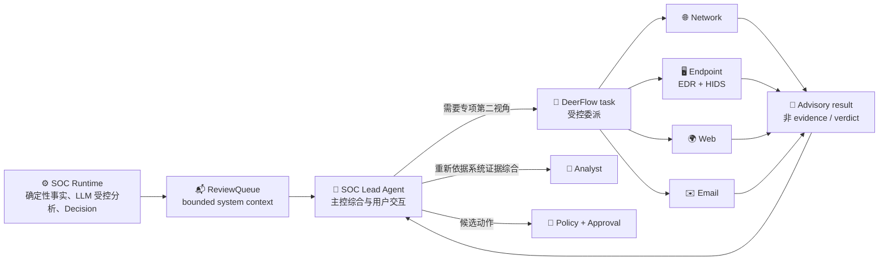
```mermaid
flowchart LR
    R["⚙️ SOC Runtime<br/>确定性事实、LLM 受控分析、Decision"] --> Q["📬 ReviewQueue<br/>bounded system context"]
    Q --> L["🧠 SOC Lead Agent<br/>主控综合与用户交互"]
    L -->|"需要专项第二视角"| T["🧰 DeerFlow task<br/>受控委派"]
    T --> N["🌐 Network"]
    T --> E["🖥️ Endpoint<br/>EDR + HIDS"]
    T --> W["🌍 Web"]
    T --> M["✉️ Email"]
    N --> A["📄 Advisory result<br/>非 evidence / verdict"]
    E --> A
    W --> A
    M --> A
    A --> L
    L -->|"重新依据系统证据综合"| U["👤 Analyst"]
    L -->|"候选动作"| P["🛂 Policy + Approval"]
```

Delegation rules / 委派规则：

- Runtime 主流程不委派。它继续稳定地完成 normalization、fact reconstruction、bounded LLM
  analysis、grounding、decision 和 persistence。
- Lead Agent 只有在专项第二视角、上下文隔离或跨域并行存在明确收益时才委派；常规一条告警不因
  `source_type` 自动多跑多个模型。
- 子智能体 profile 固定 `tools=[]` 和 `skills=[]`：它不读文件、不动态发现 Skill、不读 repository、
  不执行 Provider/MCP/action。server 只投影当前 ReviewQueue 的 bounded case evidence 和适用
  public Skill 中已评审的 `references/runtime-guidance.md`。
- `SocLeadAgentDelegationMiddleware` 只对 `soc-triage` 生效；没有 trusted ReviewQueue artifact 不能委派。
  每个 chat run 最多两个不同专家，Lead Agent 问题最多 1200 字符，server 投影最多
  32K 字符，并记录 case/task/projection hash。重复专家、越界 agent、action marker 和
  stopped/capped result 均 fail closed。
- 子智能体结果是 advisory artifact。Lead Agent 必须把它与 Runtime/ReviewQueue 的 exact evidence
  refs 重新综合；专家文本本身不能成为 `InvestigationEvidence` 或提高自动化权限。
- fake Provider 证据可以被专家看到以验证流程，但必须保留 `mocked=true`；专家不得把它描述为真实
  客户事实。
- `PI-01G1..G3` 已于 2026-08-07 完成：profile/config installer + runtime doctor、受控委派协议、
  native task event/replay 回归，以及 NIDS network 和 EDR endpoint 的 `deepseek-v4-flash` 代表样本。
  `AC-30` 的防守产品缺口已关闭；Provider 真实性、网络方向/角色质量校准和 hunting/
  red-team 自治仍是独立 gate，不由该 smoke 代替。

All agents share SOC contracts, service boundaries, approval, and memory policy.

---

## 7. Review, Approval, and External Feedback / 复核、审批、外部反馈

### 7.1 Review Queue / 复核队列

Review queue is the analyst's primary work surface.

It should show:

- Current conclusion with confidence.
- Evidence used and evidence gaps.
- Scenario findings and domain triage.
- Similar historical alerts.
- Relevant confirmed memory.
- Pending memory candidates.
- External disposition history.
- Read-only investigation evidence.
- Human checklist and suggested next steps.

### 7.2 Approval Boundary / 审批边界

High-risk actions must follow this path:

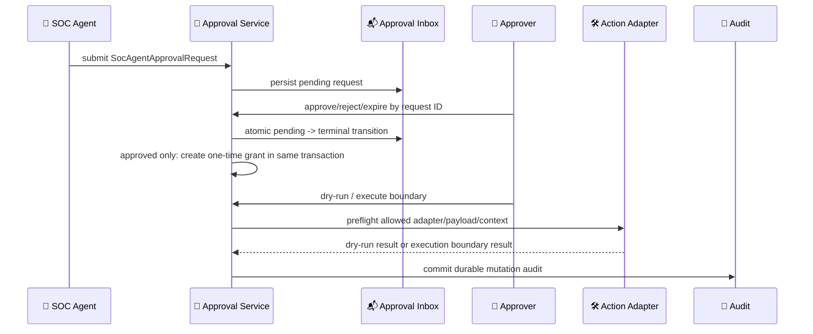
```mermaid
sequenceDiagram
    participant Agent as 🤖 SOC Agent
    participant Approval as 🛂 Approval Service
    participant Inbox as 📬 Approval Inbox
    participant Human as 👤 Approver
    participant Adapter as 🛠️ Action Adapter
    participant Audit as 🧾 Audit

    Agent->>Approval: submit SocAgentApprovalRequest
    Approval->>Inbox: persist pending request
    Human->>Approval: approve/reject/expire by request ID
    Approval->>Inbox: atomic pending -> terminal transition
    Approval->>Approval: approved only: create one-time grant in same transaction
    Human->>Approval: dry-run / execute boundary
    Approval->>Adapter: preflight allowed adapter/payload/context
    Adapter-->>Approval: dry-run result or execution boundary result
    Approval->>Audit: commit durable mutation audit
```

Current safety posture:

- Read-only investigation actions can produce `InvestigationEvidence`.
- High-risk actions create approval requests.
- Web/Gateway `soc-triage` output enters the approval boundary through the operator-owned per-agent
  middleware; the embedded SOC TUI uses its existing outer service bridge. Both share the same
  parser, policy and approval service rather than duplicating approval semantics.
- The model cannot choose proposal/request/decision IDs, actor identity or context lineage. Server
  IDs are deterministic across graph replay, and one model message is capped at five proposals.
- Request lifecycle is `pending -> approved/rejected/expired`; approve loads the persisted request by ID and one request can create at most one grant.
- Exact resolution retries are idempotent; stale, forged, or semantically changed retries are rejected.
- Execute boundary exists, but real production side effects must wait for real adapter review.
- Approval grant is single-use. Request/grant/result changes and their secret-safe mutation audit commit in one command transaction through migration `0018_mutation_audit`.

### 7.3 External Disposition Sync / 外部处置反馈同步

Users may still work in Zeus or another old SOC system. Their status/reason updates must
feed SOC Agent rather than being lost.

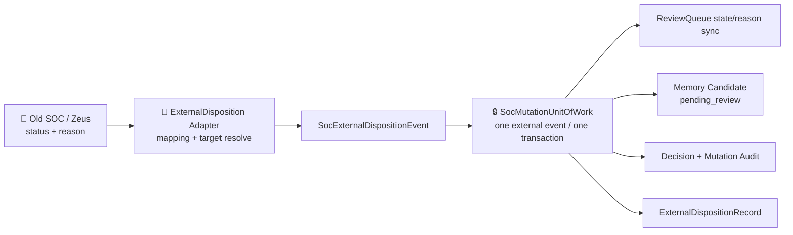
```mermaid
flowchart LR
    OLD["🏢 Old SOC / Zeus<br/>status + reason"] --> MAP["🔁 ExternalDisposition Adapter<br/>mapping + target resolve"]
    MAP --> EVENT["SocExternalDispositionEvent"]
    EVENT --> TX["🔒 SocMutationUnitOfWork<br/>one external event / one transaction"]
    TX --> REVIEW["ReviewQueue state/reason sync"]
    TX --> CAND["Memory Candidate<br/>pending_review"]
    TX --> AUDIT["Decision + Mutation Audit"]
    TX --> EXT["ExternalDispositionRecord"]
```

Rules:

- The implemented application ingress is authenticated
  `POST /api/soc/external-dispositions` with
  `SocExternalDispositionIngressCommand(schema_version=soc.external_disposition_ingress.v1)`.
- The ingress requires a stable `event.source_event_id`; only `soc_admin` or
  `external_disposition_adapter` service roles may apply it. Source-specific field mapping and trust
  configuration remain server-owned and cannot be supplied by the caller.
- An exact source-event retry returns the existing logical result. Reusing the same semantic identity
  with changed content returns a conflict instead of silently overwriting history.
- This closes the generic application boundary only. Real Zeus/ITSM/SOAR webhook, Kafka or polling
  feeds still require customer endpoint, authentication/signature, tenant and replay configuration.
- External reason may update local review state if target resolution is unique and trusted.
- External reason can generate memory candidates.
- External reason cannot become confirmed memory without review.
- Mapping must be configurable per external system.
- Local correction, summary/queue, candidate, external record, eligible outcome and both audit
  records commit atomically; events are emitted only after commit. An exact retry returns the one
  existing logical result, while reuse of the idempotency key for changed content conflicts.

### 7.4 Governed Context Facts / 受治理上下文事实（GF-01 + AA-01 + EX-01 + DP-01 + EV-01..EV-03 Implemented）

Authorization is the first implementation, but it is not the only operational context that needs
source, scope, time and revocation. Use a shared typed envelope instead of a universal untyped KV
store or one matcher for every fact.

```text
GovernedContextFact
├── AuthorizedActivityFact
├── SecurityExerciseCampaignFact
├── ExerciseParticipantFact
├── AssetContextFact
├── IdentityContextFact
├── ChangeWindowFact
├── NetworkTopologyFact
├── ServiceRelationshipFact
└── RiskAcceptanceFact
```

`GovernedContextFact` owns common metadata: fact id/type/schema version, tenant/environment,
`valid_from/valid_until`, source type/ref/version/freshness, status, owner/reviewer/reason,
evidence refs, content hash and audit timestamps. Every subtype has a discriminated typed payload and
its own matcher/resolver. The system must not implement a generic natural-language fact matcher.

Shared lifecycle belongs to `SocGovernedContextService`; typed domain services compose it with
deterministic matchers. PostgreSQL may use one common fact envelope table with typed JSONB payloads
and indexed common columns, but Pydantic contracts and subtype validators remain mandatory.

Current GF-01 + AA-01 + EX-01 + DP-01 + EV-01..EV-03 implementation:

- Governed lifecycle contracts live in `soc_agent.contracts.governed_context`; the first instantiable
  subtype is vendor-neutral `AuthorizedActivityPayload`. Matching contracts live separately in
  `soc_agent.contracts.authorization` so persistence does not imply authorization.
- `SocGovernedContextService` owns propose/revise/activate/suspend/revoke/expire/get/list. A stable
  `fact_id` has append-only immutable versions identified by `fact_version_id`; every writer supplies
  `expected_latest_version`, and stale writers fail rather than overwrite a newer decision.
- Revision always creates a new `proposed` version and requires re-approval. Revising an active fact
  deliberately fails closed: the latest version is no longer active until an approver activates it.
- `GovernedContextFactRepository` is implemented by the in-memory test adapter and
  `SqlAlchemyAlertRepository`. Migration `0013_governed_context_facts` creates
  `soc_governed_context_facts`; one unique `current_key` per fact and unique `(fact_id, version)`
  enforce version-stream integrity.
- `AuthorizationQueryBuilder` consumes only canonical alert/entity/fact/scenario contracts. It does
  not recognize vendor aliases. Naive event times require an explicit tenant/integration IANA
  timezone and record that assumption.
- `AuthorizedActivityMatcher` selects the fact lifecycle version that existed at alert event time,
  then checks lifecycle, validity, source freshness, recurrence and typed scope. Different selector
  kinds are ANDed; values inside one kind are ORed. It emits
  `exact/partial/conflict/expired/not_found/unavailable` without an LLM.
- CLI provides lifecycle commands plus read-only `soc context match`. HIDS `java -> chattr` and EDR
  RemoteRegistry sample replay both produce explainable exact matches in step-12 validation.
- `SocAuthorizationEnrichmentService` attaches AA-01 results to existing runs through strict
  `AuthorizationEnrichmentCommand/Record/ApplyResult` contracts. Migration
  `0014_authorization_enrichments` stores append-only records with query hash, matcher policy, exact
  fact-version refs, actor, idempotency key and replay lineage.
- `SocReviewService.get_investigation_context()` projects enrichments into the shared API/Web/TUI read
  model and the bounded Lead Agent artifact. Timeline/counts label them as `shadow_only` and
  `decision_impact=none`.
- `SocDispositionProposalService` consumes one persisted exact enrichment linked to an open
  ReviewQueue and snapshots the current detection truth. Only `true_positive` may produce
  `closed_benign_true_positive`; missing/closed/mismatched queue, all other match states or verdicts
  fail closed. Migration `0015_disposition_proposals` persists immutable proposal,
  source enrichment/query/matcher/fact refs, detection snapshot, policy, actor and idempotency data.
- `soc disposition propose|list|get` and InvestigationContext/Web/TUI/Lead Agent expose the proposal.
  It is always `shadow`, `not_applied`, `requires_human_review=true`, `auto_close_allowed=false`, with
  no detection-truth or ReviewQueue impact.
- `SocDispositionEvaluationService` records explicit append-only outcomes only after the linked
  ReviewQueue is closed. It never infers labels from close-reason text. Corrections must explicitly
  supersede the latest outcome; analyst-resolution and independent sampled-quality-review lanes remain
  distinguishable.
- EV-01 creates reproducible `sha256_rank_v1` sample manifests over one exact
  tenant/environment/time/proposal-policy/matcher-policy cohort. Migration `0016_disposition_evaluation`
  stores manifests and outcomes in `soc_disposition_sample_manifests` and `soc_disposition_outcomes`.
- `SocDispositionEvaluationGateReport` measures resolution, shadow precision, override, sampled coverage/
  precision/agreement, source freshness and fact-version fan-out. Truncated datasets or broken enrichment
  lineage are insufficient data. Gate policy explicitly allowlists primary/sample outcome sources, and a unique
  outcome lineage key prevents concurrent root/successor labels. Passing means only
  `eligible_for_governed_rollout_review`; the report and policy both keep `auto_close_allowed=false`.
- EV-02 connects authenticated API/Web capture, Review TUI primary/sample commands, and a guarded trusted
  external-disposition bridge to `SocDispositionEvaluationService.record_outcome()`. Web close and outcome
  remain separate actions; API/TUI require explicit idempotency; no surface infers a label from close reason.
  Review TUI accepts a stable `--actor-id` so the service can enforce independent sampled-review identity.
  The external bridge requires a high-trust mapped event, verified target and exactly one matching proposal,
  reports deterministic skip reasons, and never silently replaces a newer analyst/replay label.
- EV-03 derives `SocDispositionSampleReviewInbox` from each immutable manifest and current proposal,
  ReviewQueue, primary outcome and sampled outcome records. It computes independent-review completion,
  reviewer conflicts and explicit readiness without adding a second campaign source of truth. Read-only
  Gateway endpoints feed the Web `抽样复核` view; opening an item preselects the server-returned
  `sample_id/proposal_id/queue` in the EV-02 form, so reviewers cannot cherry-pick outside the manifest.
- GF-01/AA-01/EX-01 do not inject facts into `LLMAnalysisRequest` or change `SocDecisionPolicy`.
  DP-01 generates a separate operational proposal but still cannot update the run, close ReviewQueue,
  write memory, authorize an action, or execute a response. EV-01 evaluates that proposal, EV-02 captures
  explicit labels and EV-03 organizes independent QA work; all retain the same no-mutation boundary.

#### 7.4.1 Authorized Activity Facts / 授权活动事实

The system must not ask an analyst to reconfirm the same known authorized activity for every alert,
but it also must not turn one confirmation into a permanent IP whitelist. Use a dedicated governed
fact lifecycle instead of memory or prompt text.

`AuthorizedActivityFact` minimum semantics:

| Dimension / 维度 | Required meaning / 必须表达 |
| --- | --- |
| Identity | Stable fact id, schema version, tenant and environment |
| Activity | `vulnerability_scan`, `penetration_test`, `maintenance`, `automation`, `service_traffic`, or an extensible tenant-scoped type |
| Subject scope | Scanner/service/asset/account selectors; prefer stable asset/service IDs and tags over an IP alone |
| Target scope | Asset IDs, tags, applications, domains or bounded CIDRs the activity may touch |
| Behavior scope | Scenario keys, normalized behavior signatures, service/process constraints, and optional detection aliases |
| Validity | `valid_from`, `valid_until`, optional recurrence/window, and evaluation against alert event time |
| Source | Authoritative system/type, source reference or ticket/campaign id, source version, evidence refs |
| Governance | `proposed/active/suspended/expired/revoked`, owner, reviewer, reason, created/updated time |

`AuthorizationMatchResult` is produced by deterministic code, not by the LLM. It records matched fact
ids, `exact/partial/conflict/expired/not_found/unavailable`, matched and missing dimensions, event time,
source freshness, policy version and evidence refs.

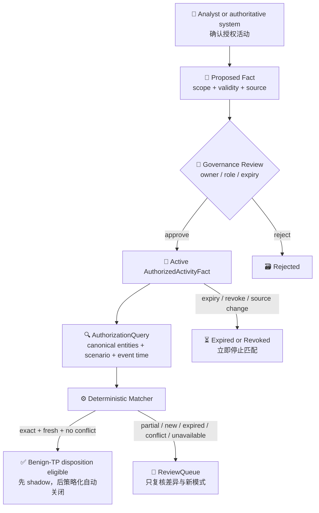
```mermaid
flowchart TD
    H["👤 Analyst or authoritative system<br/>确认授权活动"] --> P["📝 Proposed Fact<br/>scope + validity + source"]
    P --> G{"🛂 Governance Review<br/>owner / role / expiry"}
    G -->|"approve"| A["🪪 Active AuthorizedActivityFact"]
    G -->|"reject"| X["🗃️ Rejected"]
    A --> Q["🔍 AuthorizationQuery<br/>canonical entities + scenario + event time"]
    Q --> M["⚙️ Deterministic Matcher"]
    M -->|"exact + fresh + no conflict"| B["✅ Benign-TP disposition eligible<br/>先 shadow，后策略化自动关闭"]
    M -->|"partial / new / expired / conflict / unavailable"| R["👤 ReviewQueue<br/>只复核差异与新模式"]
    A -->|"expiry / revoke / source change"| E["⏳ Expired or Revoked<br/>立即停止匹配"]
```

Source and rollout rules:

- Preferred sources are change-management, scanner, maintenance, CMDB/security-tag or other
  authoritative systems exposed through read-only adapters/MCP. PostgreSQL stores the governed fact
  and source snapshot/cache; it must retain the external source reference and freshness.
- Analyst confirmation may create a `proposed` fact. Activation requires an authorized role, explicit
  scope and expiry. A free-text review note alone cannot activate it.
- `security_tag.lookup` may provide one evidence input, but a generic future
  `authorized_activity.lookup`/source-sync adapter owns authorization-specific records. Vendor names
  stop at adapters; core matching consumes canonical selectors.
- Exact matching can only make `closed_benign_true_positive` eligible. It must never rewrite a real
  detection to `false_positive`, and it never authorizes a response action.
- Initial rollout is shadow-only: show proposed disposition and match explanation while humans still
  close the case. Auto-close is enabled later only for exact, authoritative, fresh matches after
  replay precision, override rate and sampled-review gates pass.
- Historical alerts are evaluated using the authorization fact version valid at alert event time.
  Current state cannot silently rewrite old cases.

Rollout slices are deliberately separate:

| Slice | Responsibility | Must not do |
| --- | --- | --- |
| `GF-01` | Govern typed fact lifecycle and append-only versions | Match alerts |
| `AA-01` | Build canonical query and return deterministic match explanation | Persist enrichment or propose disposition |
| `EX-01` | Implemented: persist/version match enrichment and project it into investigation context/audit | Change detection truth or generate disposition |
| `DP-01` | Implemented: persist `closed_benign_true_positive` shadow proposal from open-queue exact enrichment + true-positive detection snapshot | Apply proposal or auto-close during shadow phase |
| `EV-01` | Implemented: explicit outcomes, reproducible samples, precision/override/freshness/fan-out gate | Apply proposal or enable auto-close |
| `EV-02` | Implemented: capture structured outcomes through Web/TUI/API and trusted external disposition bridge | Infer labels from free text, silently replace analyst labels, or bypass evaluation service |
| `EV-03` | Implemented: derived paginated sample-review inbox plus Web campaign navigation over persisted manifests and selected proposals | Enable auto-close or let reviewers cherry-pick outside a manifest |

#### 7.4.2 Security Exercise Context / 护网与红蓝对抗上下文

A security exercise requires three facts, not one IP whitelist:

| Fact / 事实 | What it proves / 能证明什么 |
| --- | --- |
| `SecurityExerciseCampaignFact` | Campaign time, environment, target scope, allowed/forbidden behaviors and versioned Rules of Engagement |
| `ExerciseParticipantFact` | At event time, an IP/CIDR/domain/account/certificate/agent id belonged to a red/blue/white team or other exercise role |
| `AuthorizedActivityFact` | That participant was allowed to perform this behavior against this target during this campaign |

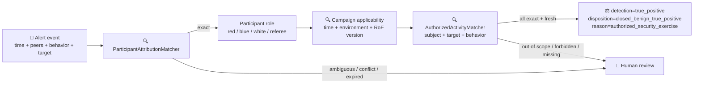
```mermaid
flowchart LR
    E["🧾 Alert event<br/>time + peers + behavior + target"] --> P["🔍 ParticipantAttributionMatcher"]
    P -->|"exact"| R["Participant role<br/>red / blue / white / referee"]
    P -->|"ambiguous / conflict / expired"| H["👤 Human review"]
    R --> C["🔍 Campaign applicability<br/>time + environment + RoE version"]
    C --> A["🔍 AuthorizedActivityMatcher<br/>subject + target + behavior"]
    A -->|"all exact + fresh"| D["⚖️ detection=true_positive<br/>disposition=closed_benign_true_positive<br/>reason=authorized_security_exercise"]
    A -->|"out of scope / forbidden / missing"| H
```

Rules:

- Seeing a registered red-team IP only establishes participant attribution. It cannot prove that the
  current target or technique was authorized.
- Participant identifiers are time-bounded and multi-valued. Dynamic IP, NAT, shared jump hosts,
  proxying and identifier reassignment must yield `ambiguous/conflict` rather than forced identity.
- Ordinary analyst context should expose role/team refs; personal identity and official roster details
  require stricter access control and remain auditable.
- Do not mark red-team infrastructure as globally benign or erase its IOC history. Preserve the
  detection and attach campaign-scoped operational context.
- The canonical disposition remains `closed_benign_true_positive`; use a reason code such as
  `authorized_security_exercise` instead of creating one status per campaign type.

#### 7.4.3 Tenant Disposition Policy / 租户级处置策略

Environment and customer-specific operating rules are disposition context, not detection truth.
For example, PingAn may decide that a confirmed `dev/local/staging` asset does not require an
operational response. The product must support that rule without teaching the generic Runtime that
`stg == safe` and without skipping technical analysis.

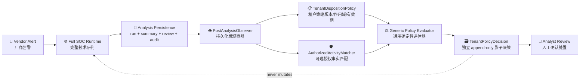
```mermaid
flowchart LR
    A["🧾 Vendor Alert<br/>厂商告警"] --> R["⚙️ Full SOC Runtime<br/>完整技术研判"]
    R --> DB["💾 Analysis Persistence<br/>run + summary + review + audit"]
    DB --> O["👁️ PostAnalysisObserver<br/>持久化后观察器"]
    O --> P["📋 TenantDispositionPolicy<br/>租户策略版本/作用域/有效期"]
    O --> G["🛡️ AuthorizedActivityMatcher<br/>可选授权事实匹配"]
    P --> E["⚖️ Generic Policy Evaluator<br/>通用确定性评估器"]
    G --> E
    E --> D["🗃️ TenantPolicyDecision<br/>独立 append-only 影子决策"]
    D --> H["👤 Analyst Review<br/>人工确认处置"]
    D -. "never mutates" .-> R
```

Required separation:

- A vendor adapter may emit a generic `EnvironmentClaim` or other context candidate with exact
  provenance. It must not emit `safe`, `skip_analysis`, a Runtime verdict, or a closure decision.
- A governed resolver confirms environment and applicability through an authoritative source such
  as CMDB, or a reviewed tenant mapping. A hostname containing `stg` is only a hint unless that
  mapping is explicitly governed as authoritative.
- The fixed Runtime still performs normalization, fact reconstruction, bounded analysis, Grounding
  and detection Decision. Tenant policy is reconciled after detection; it must not short-circuit the
  technical analysis path.
- A tenant policy is configuration/data with `tenant_id`, stable policy id and version, typed
  conditions, environment/asset scope, validity, owner/reviewer, reason, rollout mode and audit
  metadata. PingAn field aliases remain in its adapter or tenant mapping, never in generic policy
  evaluation code.
- A matched non-production policy may produce `operational_disposition=nonproduction_exempt` or an
  equivalent canonical recommendation while preserving `detection_truth=true_positive` when the
  detection is real. It must not relabel the event as `false_positive` merely because the target is
  non-production.
- Authorization and non-production exemption are separate policies. A scoped red-team or automation
  authorization proves an activity was allowed; an environment policy expresses how that tenant
  operates alerts for a confirmed environment.
- Initial rollout is recommendation/shadow-only. Auto-close remains disabled until versioned replay,
  override, sampled-review and rollback gates pass. Other tenants without this policy keep the
  generic review behavior.

Current implementation (`soc.tenant_disposition_policy.v1` / `soc.tenant_policy_decision.v1`):

- Generic contracts, evaluator and repository live in `backend/soc_agent/contracts/tenant_policy.py`,
  `tenant_policy/`, and `core/tenant_policy.py`; migration `0022_tenant_policy_decisions` stores one
  immutable decision per `run + exact policy content hash`.
- `SocAnalysisService` invokes generic `PostAnalysisObserver` instances only after the main
  run/summary/review/audit transaction. Observer failure is logged and cannot roll back or fail the
  already-persisted analysis. Idempotent analysis retries re-run the observer and deduplicate by the
  same decision key.
- Operators opt in with `SOC_TENANT_DISPOSITION_POLICY_PATH`,
  `SOC_TENANT_POLICY_ENVIRONMENT`, and optional `SOC_TENANT_POLICY_EVENT_TIMEZONE`. No configured
  policy means no evaluation and no PingAn import in generic composition.
- PingAn v1 is isolated as data at
  `backend/soc_agent/integrations/pingan/policies/tenant-disposition-v1.json`. Its initial rule covers
  only internal non-production credential-alert review: a hostname pattern can recommend no automated
  response plus explicit authorization checks, but cannot confirm the environment or propose an
  exempt/benign disposition. Exact authorized activity remains on the existing
  `AuthorizationEnrichmentRecord -> SocDispositionProposalRecord` path so the tenant policy cannot
  bypass persisted fact, open-queue, and true-positive lineage.
- Policy version selection uses timezone-aware alert event time. A configured timezone may localize
  a legacy naive timestamp and records `alert_event_time_timezone_assumed`; no implicit timezone is
  guessed. Bounded policies without event time do not apply.
- `soc tenant-policy evaluate|list|get` provides replay and inspection. The generated validation under
  `backend/.deer-flow/soc-runtime-validation/tenant-policy-shadow/` proves on real saved Runtime
  results that detection truth and the Runtime object remain unchanged.

The intended user-visible conclusion keeps both dimensions explicit, for example: “Weak-password
activity was detected; the target is a confirmed PingAn staging asset; PingAn policy v1 recommends no
operational action.” This is a governed policy result, not LLM memory or a universal security fact.

---

## 8. Data Contracts / 数据契约

The contracts are the product boundary. Adding a UI, daemon, agent, or vendor adapter should
not require rewriting core contracts.

| Contract / 契约 | Role / 作用 | Stability expectation / 稳定性 |
| --- | --- | --- |
| `AlertInput` | Canonical alert input | Stable, extensible through typed optional sections and metadata |
| `EvidenceLayer` | Evidence source/layer metadata | Stable |
| `FieldTrust` | Source trust plus independent reasoning eligibility | Stable v2: `source_trust`, `reasoning_status`, `participates` |
| `CanonicalFieldProvenance` | Selected canonical source path and alternatives | Stable |
| `RoleClaim` | Observable/asserted/derived role evidence | Stable |
| `ScenarioHypothesis` | Evidence-backed scenario hypothesis | Stable |
| `RoleResolution` | Conflict-aware role result and evidence gaps | Stable |
| `ConflictReport` | Conflict and ambiguity report | Stable |
| `AnalysisRun` | Full runtime execution record | Stable for replay/audit |
| `AnalysisRequestJournal` | Durable bounded pre-provider metadata and recovery state | Stable; no rendered prompt/provider secret/response |
| `AnalysisRunRecoveryCommand` | Stale running-run claim and replay request | Stable service/CLI boundary |
| `AlertSummary` | Lightweight read model | Stable for queue/correlation/list |
| `CorrelationResult` | Structured historical similarity and reusable-evidence result | Stable read-only bridge into domain/report/context |
| `CorrelationEvalFixtureSet` | Versioned same/related/unrelated pair labels | Offline-only; must name scoring policy and preserve human rationale |
| `CorrelationEvalReport` | Retrieval, identity, fan-out, reason and evidence baseline | Read-only; `shadow_dedup_allowed=false` |
| `ReviewQueueItem` | Analyst work item | Stable state machine |
| `InvestigationContext` | Shared context for Web/TUI/Lead Agent | Stable but may gain new sections |
| `UnifiedInvestigationView` | Read-optimized investigation projection | Stable as display/read model |
| `UnifiedInvestigationReport` | Main-orchestrator analysis/correlation/evidence/domain report | Stable bounded report; no direct state mutation |
| `InvestigationEvidence` | Tool/MCP evidence record | Stable |
| `SocEnrichmentPolicy` | Versioned tenant allowlist, scope and action budget for automatic read-only investigation | PI-01D1 implemented; default has no enabled route |
| `SocEnrichmentPlan` | Immutable, replayable read-only action plan with skips, provenance and decision guard | PI-01D1 implemented; execution only through Dispatcher/Registry |
| `SocEnrichmentCompositionConfig` | Default-off tenant policy plus exact route/action/adapter binding and required result mode | PI-01D2 implemented; strict JSON/YAML application config |
| `SocEnrichmentAdapterBinding` | Exact `route/action/adapter_id/adapter_kind` identity selected at startup | PI-01D2 implemented; no free tool discovery or fallback |
| `GovernedContextFact` | Shared typed fact envelope and lifecycle | GF-01 implemented stable contract |
| `AuthorizedActivityPayload` | Time-, scope- and source-bounded authorized activity definition | GF-01 storage + AA-01 deterministic matcher implemented |
| `SecurityExerciseCampaignFact` | Campaign scope and Rules of Engagement | Planned typed fact |
| `TenantDispositionPolicy` | Versioned tenant-specific operating rule over governed context and detection truth | Implemented v1; generic JSON evaluator, tenant-owned data, shadow-only |
| `TenantPolicyDecision` | Auditable match/no-match result and operational recommendation | Implemented v1 + migration `0022`; cannot mutate detection truth, ReviewQueue, action or memory |
| `ExerciseParticipantFact` | Event-time participant role and identifier mapping | Planned typed fact |
| `ParticipantAttributionResult` | Deterministic participant identity resolution | Planned typed result |
| `AuthorizationQuery` | Vendor-neutral event-time matching input | AA-01 implemented stable contract |
| `AuthorizationMatchResult` | Explainable deterministic match result | AA-01 implemented; read-only/shadow, not a disposition |
| `AuthorizationEnrichmentRecord` | Append-only query/result/policy/fact-ref snapshot attached to a run | EX-01 implemented; replayable, `decision_impact=none` |
| `SocDispositionProposalRecord` | Append-only operational proposal with detection snapshot and authorization lineage | DP-01 implemented; shadow/not-applied, human review required |
| `SocDispositionSampleManifest` | Reproducible hash-ranked quality-review sample over one exact cohort | EV-01 implemented; append-only, seed hash only |
| `SocDispositionSampleReviewInbox` | Derived reviewer-specific progress/readiness over one immutable manifest | EV-03 implemented; paginated, no mutable campaign state, no auto-close |
| `SocDispositionOutcomeRecord` | Explicit append-only analyst/trusted-system label with supersession lineage | EV-01 implemented; no decision or queue impact |
| `SocDispositionEvaluationReport` | Read-only precision/override/sample/freshness/fan-out gate result | EV-01 implemented; passed means rollout review only, never auto-close |
| `SocDomainTriageResult` | Domain-level triage result | Stable |
| `SocDomainFinding` | Scenario-level finding | Stable taxonomy version required |
| `SocAgentActionProposal` | Agent proposal | Stable |
| `SocAgentApprovalRequest` | Approval inbox item | Stable |
| `SocAgentApprovalGrant` | One-time approval grant | Stable |
| `SocExternalDispositionEvent` | External status/reason update | Stable |
| `SocMemoryCandidate` | Pending memory proposal | Stable |
| `SocMemoryRecord` | Confirmed memory | Stable retrieval policy |

Contract rules:

- Prefer additive changes.
- Keep vendor-specific fields under adapter metadata, aliases, or scoped extensions.
- Never make `rule_code`, vendor scene name, or PingAn-only fields required for the system to work.
- Every external write path must include actor, source, reason, and audit metadata.

---

## 9. Persistence and Runtime Data / 存储与运行数据

Production and staging should use PostgreSQL as the SOC business store. Local development and the
current PingAn internal DEV validation follow DeerFlow `database.backend: sqlite` and automatically
use the separate `{database.sqlite_dir}/soc_agent_dev.db`; explicit CLI/env database URLs remain
overrides. SQLite evidence cannot satisfy PostgreSQL/staging acceptance.

Main persistence categories:

| Data / 数据 | Purpose / 用途 | Notes / 备注 |
| --- | --- | --- |
| Analysis runs | Replay, pre-provider journal, recovery and audit | Full source snapshot plus bounded request journal, trace and result |
| Alert summaries | Review/correlation/list | Lightweight projection |
| Review queue | Human workflow | State, owner, reason, correction |
| Investigation evidence | Read-only tool/MCP evidence | Reusable in context, not memory by default |
| Approval requests/grants | High-risk action boundary | Terminal request lifecycle and at most one one-time grant per approved request |
| External dispositions | Old-platform status/reason sync | Idempotent by external event key |
| Governed context facts | Typed operational facts | Versioned, expiring, revocable, source-referenced |
| Context match audit | Authorization/attribution/applicability result | Replayable against event time and policy version |
| Memory candidates | Pending learning | Human review required |
| Confirmed memory | Reviewed experience | Confirm creates it disabled; a versioned, audited activation policy with validity and review gates controls retrieval |
| Decision audit | Verdict lineage | analyze/replay/correct/external decision metadata and policy provenance |
| Mutation audit | L3 command lineage | Append-only actor/auth source/reason/idempotency/command hash/bounded result; no raw payload or secrets |
| Process events | Local signaling | Buffered until SQL commit; generic durable event streaming remains a later capability |

Service/repository rule:

- Services depend on repository protocols from `backend/soc_agent/protocols.py`.
- Entry layers must not write tables directly.
- Multi-write L3 commands must use `SocMutationUnitOfWork`; service code owns audit creation and
  emits process events only after the transaction commits.
- Migrations live under `backend/soc_agent/db/migrations/`.
- SOC tables stay separate from DeerFlow harness persistence unless a generic upstream extension is required.

---

## 10. Memory System / 记忆系统

Memory must help the agent learn from operations, but it must not become an uncontrolled
prompt-stuffing system.

### 10.1 Memory Granularity / 记忆粒度

Use layered and optional keys, not one over-specific composite key.

| Layer / 层级 | Example / 示例 | Required? / 必须吗 |
| --- | --- | --- |
| Tenant / 租户 | PingAn, customer A | Optional but recommended in multi-tenant |
| Source family / 来源族 | EDR, APT, HIDS, NIDS, SIEM, WAF | Optional |
| Detection alias / 检测别名 | rule_code, signature_id, analytic_id | Optional |
| Scenario / 场景 | reverse_shell, webshell, lateral_movement | Optional |
| Entity features / 实体特征 | IP, domain, process, user, host | Optional |
| Disposition pattern / 处置模式 | false positive because asset is scanner | Optional |

Retrieval should work even when some dimensions are missing. For example, if a vendor has no
`rule_code`, the system can still match by source family, scenario, entity features, summary,
and confirmed memory text.

### 10.2 Memory Lifecycle / 记忆生命周期

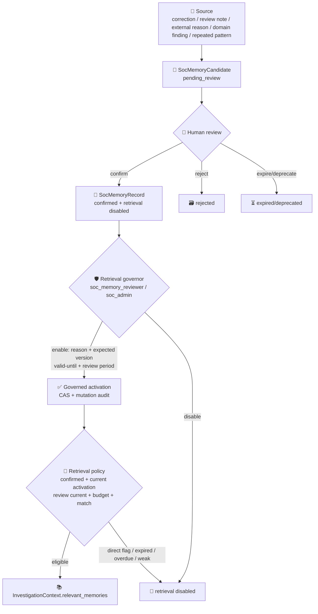
```mermaid
flowchart TD
    S1["📝 Source<br/>correction / review note / external reason / domain finding / repeated pattern"] --> C["🧬 SocMemoryCandidate<br/>pending_review"]
    C --> R{"👤 Human review"}
    R -->|"confirm"| M["📖 SocMemoryRecord<br/>confirmed + retrieval disabled"]
    R -->|"reject"| X["🗃️ rejected"]
    R -->|"expire/deprecate"| E["⏳ expired/deprecated"]
    M --> G{"🛡️ Retrieval governor<br/>soc_memory_reviewer / soc_admin"}
    G -->|"enable: reason + expected version<br/>valid-until + review period"| P["✅ Governed activation<br/>CAS + mutation audit"]
    G -->|"disable"| NO["🚫 retrieval disabled"]
    P --> RP{"🔎 Retrieval policy<br/>confirmed + current activation<br/>review current + budget + match"}
    RP -->|"eligible"| CTX["📚 InvestigationContext.relevant_memories"]
    RP -->|"direct flag / expired / overdue / weak"| NO
```

Rules:

- LLM-discovered knowledge is candidate knowledge only.
- Correction, review note, domain finding, external feedback, and repeated pattern can all create candidates.
- A Lead Agent answer is not a memory source by itself. PI-03F1 requires an analyst to explicitly accept one
  stable assistant message in an open ReviewQueue context and provide a reuse reason; the result remains a
  `review_note`-origin `pending_review` candidate. Non-Lead-Agent TUI mode cannot perform this mutation.
- PI-03F2 provides the authenticated Web/Gateway command. The client sends only queue/thread/message identity
  plus the human reason; Gateway verifies thread ownership and `soc-triage` metadata, resolves the latest
  visible terminal assistant text from the current server-owned checkpoint branch, and stores checkpoint/hash
  provenance before calling the same `SocReviewService.add_note()` boundary. Stale, tool-calling, hidden,
  ambiguous or client-forged text cannot cross this boundary, and a closed ReviewQueue rejects a new source.
- Direct DeerFlow Web chat now sends only `context.soc_review_queue_id` as an identity hint. Gateway requires
  authenticated `lead_agent(agent_name=soc-triage)`, validates queue/run/alert/tenant lineage, and atomically
  binds the caller-owned thread to one queue. The binding is server-reserved and immutable; a different queue
  requires a new thread. Every run reloads `SocReviewService.get_investigation_context()` and rebuilds the
  bounded artifact rather than trusting the URL or reusing the first snapshot.
- `SocLeadAgentReviewContextMiddleware` injects that artifact transiently into the model call under a 48,000
  character cap and stamps exact artifact/hash/business/chat lineage on the resulting assistant message. Web
  acceptance verifies route queue + thread binding + message provenance and records the accepted snapshot.
  It deliberately does not compare with a newly rebuilt hash after candidate creation, because the mutation
  itself changes ReviewQueue context and would break idempotent retry. This still grants no verdict, close,
  confirmed-memory, retrieval, approval, or action authority and does not replace the TUI context bridge.
- Client-facing thread-state updates strip the reserved SOC review-context provenance from submitted messages.
  A manual checkpoint rewrite therefore invalidates conclusion acceptance instead of manufacturing trusted
  middleware lineage; normal server-side graph writes retain the provenance.
- Kafka/batch records are observations, not memories. PI-03F3 uses
  `soc.memory_pattern_aggregation.v1`: choose one strongest vendor-neutral dimension (primary scenario,
  canonical detection key, then category), isolate tenant/environment/`simulation|operational`, and place the
  canonical timezone-aware source event time in a fixed UTC window. The default 24-hour policy requires both
  5 observations and 5 distinct alert sources before proposing exactly one frozen `pending_review`
  repeated-pattern candidate. Missing/naive event time is ineligible; later observations are replay-only and
  supersession is manual. Never write one candidate per alert/finding, and never treat recurrence as evidence
  of benignness, maliciousness, authorization, impact, or a permitted action.
- Confirmation requires explicit human action through `SocMemoryService`.
- Confirmation does not make a record retrievable. `SocMemoryService.set_retrieval_activation()` is the
  only enable/disable boundary and requires an authorized memory governor, reason, expected record
  version, idempotency key, and, for enable, a bounded validity and mandatory review period.
- Activation and its `SocMutationAuditRecord` commit atomically. A stale version conflicts; exact retry
  returns the same logical result. Candidate deprecation/expiry disables and version-bumps the record.
- Retrieval rejects legacy/direct boolean flags without `soc.memory_retrieval_activation_policy.v1`
  metadata, as well as expired activation or overdue review. `soc memory search --baseline-json` exposes
  deterministic before/after match changes for governance review.
- Confirmed memory retrieval is budgeted and reasoned; it is not dumped blindly into prompts.
- Active operational facts are not confirmed memory. Memory may describe how a scanner or exercise
  team tends to behave, but only governed-context services and typed matchers can determine identity,
  campaign applicability and authorization for a specific event time.
- Wiki/OKF-style displays can be exported later from DB memory, but DB remains the source of truth.

---

## 11. PingAn Capability Layer / 平安能力接入层

PingAn experience is valuable, but the product must stay vendor-neutral.

平安能力接入不等于把平安字段和提示词写死到核心。正确做法：

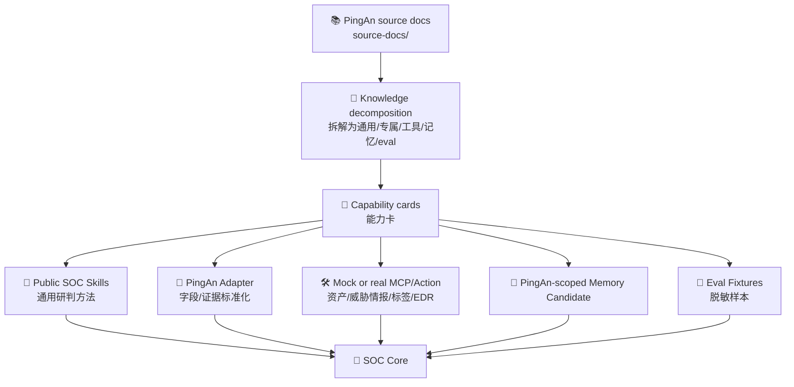
```mermaid
flowchart TB
    DOCS["📚 PingAn source docs<br/>source-docs/"] --> DECOMP["🧹 Knowledge decomposition<br/>拆解为通用/专属/工具/记忆/eval"]
    DECOMP --> CARD["🧾 Capability cards<br/>能力卡"]
    CARD --> SKILL["🧩 Public SOC Skills<br/>通用研判方法"]
    CARD --> ADAPTER["🔌 PingAn Adapter<br/>字段/证据标准化"]
    CARD --> MCP["🛠️ Mock or real MCP/Action<br/>资产/威胁情报/标签/EDR"]
    CARD --> MEMORY["🧬 PingAn-scoped Memory Candidate"]
    CARD --> EVAL["🧪 Eval Fixtures<br/>脱敏样本"]
    SKILL --> CORE["🧠 SOC Core"]
    ADAPTER --> CORE
    MCP --> CORE
    MEMORY --> CORE
    EVAL --> CORE
```

Current PingAn docs live under:

- `.notes/ai_soc/capabilities/pingan/source-docs/`
- `.notes/ai_soc/capabilities/pingan/onboarding.md`
- `.notes/ai_soc/capabilities/pingan/knowledge-decomposition.md`
- `.notes/ai_soc/capabilities/pingan/capability-cards.md`
- `.notes/ai_soc/capabilities/pingan/knowledge-candidates.md`

Current real-alert Adapter coverage:

- `ptp-nids -> nids`, `sec_guard_wb -> threat_intel`, and
  `T_GBD_zeus_data -> siem` are confirmed PingAn edge mappings. They do not
  belong in vendor-neutral Runtime code.
- A non-empty `zeusRawLogs[].message` remains high-trust primary evidence.
  When no message exists, the complete selected structured event remains the
  explicit fallback: low trust by default, with exact `T_GBD_zeus_data` as the sole reviewed
  high-trust exception.
- Parser precedence is delimited JSON, complete direct/prefixed JSON object,
  quoted KV, comma KV, then loose KV. The complete-JSON parser rejects arrays,
  fragments, incomplete JSON, trailing payloads, and prefixes beyond its bound.
- The 212-alert Checkpoint B replay has zero normalization errors, zero unsupported schemas, zero
  unexpected `other` source types, and no message/policy contract violations.
- NIDS Checkpoint C covers 95 alerts and 128 parsed messages: 95/95 canonical five-tuples, 128
  independent network observations, 67 HTTP observations across 35 alerts, and 15 alerts with
  multiple five-tuples that remain separate. `query` is not mislabeled as DNS, rule-relative sensor
  endpoints remain separate from wire endpoints, and current typed high-value gaps are zero.
  Scenario hypotheses are available for 81/95 alerts; unmatched alert text remains bounded evidence
  for the controlled LLM node rather than being forced into a deterministic taxonomy.
- EDR Checkpoint C covers 37 alerts and 60 parsed messages. Endpoint/process/file/MITRE mapping
  produces 30 process observations, 39 process nodes, and 7 file observations while preserving all
  raw payload hashes. A field-semantics correction deliberately leaves canonical directional
  network coverage at 0/37: the corpus contains no contracted EDR wire five-tuple, 33 of 37 populated
  `str_attack_ip` values equal the endpoint, and `str_threat_value`/`str_activity_id` are frequently
  digest-shaped vendor identifiers. Endpoint IP coverage remains 36/37, validated remote attack-IP
  candidates remain typed IOC/tentative attacker evidence, and current high-value gaps are zero.
  Endpoint exclusion joins parsed and structured identities only within the same raw-event
  observation scope, so split-layer aliases cannot manufacture a remote peer.
- Threat Intel/SIEM Checkpoint C covers 3 Threat Intel alerts / 4 parsed messages and 10 SIEM
  alerts / 15 structured events. Threat Intel produces 4 independent network observations, with
  session source/destination separated from 4 provider attacker/victim assertions; all 3 alerts
  project monitored host, external IOC, malware family and MITRE `T1496`, while asset CIDR/ranges
  never leak into host IPs. SIEM contains 6 suspicious-email alerts / 7 events and 4
  standard-machine-copy alerts / 8 events: all selected emails produce typed email observations,
  all machine-copy alerts produce host/IP candidates, and none invents network direction or treats
  `User=system` as an actor. The combined audit records 159 canonical provenance entries, zero
  high-value gaps and zero raw-payload mutations. Structured fallback fields now participate in the
  same high-value mapping-gap registry through a generic `structured.*` source view.
- The 212-alert corpus confirms that every one of the eight PingAn topics enters the same production
  model projection. Runtime compacts 210 encoding-shaped spans across 112 alerts without changing
  any raw payload hash: NIDS contributes 180 spans/92 alerts, APT 8/3, APT Detail 3/3, and HIDS
  19/14. EDR, SIEM, and threat-intelligence samples were evaluated but had no qualifying long span.
  The production implementation is `backend/soc_agent/pipeline/encoded_context.py`; the local
  `validation/compact_zeus/shared/compact_encoded_llm_context.py` command is a regression/exploration caller,
  never a production dependency.
- Reproducible local evidence and representative sample paths are documented in
  `validation/compact_zeus/README.md` and
  `validation/compact_zeus/docs/pingan_adapter_rebuild_review.md`.

### 11.1 What goes where / 平安内容怎么落位

| PingAn content / 平安内容 | Destination / 落位 | Reason / 原因 |
| --- | --- | --- |
| Raw field quirks, `zeusRawLogs[].message` preference | PingAn normalizer adapter | Vendor-specific parsing belongs at edge |
| General investigation reasoning | `skills/public/soc-*` | Reusable across customers |
| PingAn internal asset/tag/business knowledge | Scoped memory or config | Not public prompt |
| Remote lookup capability | Mock now, real MCP/action later | External capability boundary |
| Historical false-positive/true-positive lessons | Memory candidate | Must be reviewed |
| Desensitized examples | Eval fixtures | Regression tests and replay |
| Prompt-like notes that are actually experience | Capability card or memory candidate | Avoid stuffing main prompt |

### 11.2 PingAn PA Track / 平安能力路线

The PA track is a capability onboarding method, not a separate product architecture.

| Step / 步骤 | Meaning / 含义 |
| --- | --- |
| PA-01 | Capability register |
| PA-02..PA-04 | APT/EDR/HIDS source decomposition |
| PA-05 | PingAn knowledge candidate register |
| PA-06 | Public skill minimal revisions |
| PA-07 | Read-only mock action adapters |
| PA-08 | Eval fixtures |
| PA-09 | Memory candidate entry |
| PA-10 | Domain triage MVP |
| PA-11 | Main orchestrator demo |
| PA-12 | Replace mock with real PingAn dev/staging MCP/API, credential-gated |

PA-12 must not be marked complete by adding more mock behavior. It requires real endpoint,
credentials, smoke report, and payload/latency/error evaluation.

### 11.3 Checkpoint D12 Asset Provider Boundary / 资产能力源边界

`D12-A` and `D12-B` are intentionally separate deliverables:

| Deliverable / 交付物 | Status / 状态 | Meaning / 含义 |
| --- | --- | --- |
| D12-A provider implementation | Done / `fake-only` | PingAn-owned ZEUS HTTP/signing port, asset-to-BU/UM workflow port, fallback service, stdio MCP server, explicit action/MCP config and regression tests; every smoke result is `mocked=true` |
| D12-B internal real smoke | Parked / execution-ready | Local DEV model profile, portable ZEUS signer, no-network preflight, direct seven-class runner and MCP evidence/readback acceptance runner are implemented. Product owner parked internal execution on 2026-08-04; the private matrix, `mocked=false`, persistence/readback and deployed Web/TUI gates remain unchanged and must pass when resumed |

The provider receives an already-extracted `asset_key`, type and optional role. It does not extract
assets, infer attacker/victim roles, select a response target, alter the Runtime verdict, close a
ReviewQueue item, confirm memory, or authorize an action. PingAn protocol and fallback details remain
inside `soc_agent.integrations.pingan`; generic Runtime/Core code depends only on existing
`asset.locate` and `InvestigationEvidence` contracts. Fake/internal modes are mutually exclusive and
an internal configuration error must fail closed rather than falling back to fake data.

The portable signer preserves the reviewed legacy ZEUS wire contract but has no default credential
and no import-time dependency on the old application. ZEUS lifecycle status/reason integration and
the historical EDR safe-path candidate dataset also stay PingAn-owned: status events enter the
canonical external-disposition service, while safe-path matches may only become governed,
investigation-only evidence. Neither may add a PingAn branch to generic Runtime control flow.

### 11.3.1 PI-01A Threat-intelligence Provider / 威胁情报能力源

`PI-01A` retains an open internal evidence gate while D12-B waits for internal execution. The generic boundary
remains `threat_intel.ip_reputation.lookup`; PingAn authentication, `/public/indicatorSearch`,
`ipAnalyseReport` and `ipReputationReport` exist only under
`soc_agent.integrations.pingan.threat_intel`. The stdio MCP and explicit action config replace the
in-memory adapter without changing Runtime control flow.

The provider emits only reviewed, bounded facts: labels with exact source paths, selected
scene/carrier/location context, provider update time, configurable freshness, response hash and
mapping warnings for unreviewed field names. It never exports the full response. The legacy
hardcoded risk formula, geographic multiplier, whitelist and blocking decisions are deliberately
excluded; absent stable provider semantics, `score`, `confidence` and `last_seen` remain unset.
Results are always investigation-only, have no decision impact, and become useful only after the
normal MCP action -> Dispatcher -> `InvestigationEvidence` path. Generic evidence consumption
unwraps the typed `mcp_result` envelope rather than adding a PingAn-specific branch.

### 11.3.2 PI-01B1 Security-tag Provider / 安全标签能力源

The current code slice replaces the local-only `security_tag.lookup` mock with a PingAn-owned
`/public/searchTagContent` Provider, stdio MCP and explicit action config. The generic route and
`SocSecurityTagRecord` remain vendor-neutral; ZEUS authentication, request fields and response aliases
stop in `soc_agent.integrations.pingan.security_tag`. No external IO or PingAn branch enters the fixed
Runtime.

The Provider preserves exact entity scope and distinguishes `active`, `expired`, `inactive`,
`conflicted`, `unknown`, `out_of_scope`, `unusable` and `not_found`. Unlike the legacy client, it does
not discard expired/disabled rows before returning a result. Missing or invalid `expireTime` fails
closed to `unknown`; open-ended validity can be enabled only by explicit tenant configuration after
the internal source owner confirms that semantic. A response SHA-256 identifies the observed payload,
but is not presented as a ZEUS business version; `provider_version` and source freshness stay unknown
until a reviewed field contract exists.

Every result is `InvestigationEvidence` with `decision_impact=none`,
`authorization_fact_created=false` and `automation_eligible=false`. An active tag may support an
analyst-visible explanation, but it cannot declare an alert benign, close ReviewQueue, authorize a
response action, or complete `PI-01B2`. Only a separately governed change/scanner/maintenance/exercise
source adapter may create versioned `GovernedContextFact` records for deterministic authorization
matching.

### 11.4 Governed Read-only Investigation Orchestration / 受控只读调查编排

Real Provider availability and alert-workflow integration are separate gates. `PI-01D1` adds an
application-level investigation planner outside the fixed Runtime; `PI-01D2` adds its strict,
default-off application composition; `PI-01D3` adds the explicit durable execution bridge used by the
Kafka daemon and internal PKL batch. Both entry paths still invoke no investigation tool when the
composition/action configuration is omitted:

```text
immutable AnalysisRun
  -> deterministic, versioned SocEnrichmentPlanner
  -> allowlisted read-only actions
  -> existing SocAgentActionDispatcher / SocActionAdapterRegistry
  -> persisted InvestigationEvidence
  -> correlation, domain triage, ReviewQueue, Web/TUI and Lead Agent context
```

The implemented v1 planner consumes only provenance-backed `EntityMention`, deterministic
`RoleResolution`, the completed run status and an explicit `SocEnrichmentPolicy`. It supports only the
exact routes `asset.lookup`, `asset.locate`, `threat_intel.ip_reputation.lookup` and
`security_tag.lookup`; policy must select at most one asset route. Tenant matching, internal CIDR scope,
entity kind/role allowlists, per-route/total budgets, semantic de-duplication, stable plan/action IDs,
invalid entity skips and role-conflict notes are part of the plan. TI lookup defaults to blocked until
tenant internal-network scope is configured, preventing internal or special IPs from being sent to a
reputation Provider.

The planner never invokes a Provider, reads PingAn aliases, changes the run, chooses a response target,
or emits high-risk actions. `SocMainOrchestratorService` converts planned actions to the same
`SocAgentCapabilityRouter -> SocAgentActionDispatcher -> SocActionAdapterRegistry` path used by explicit
actions; an identical explicit action wins de-duplication. Successful results enter the injected
`InvestigationEvidenceRepository`, while `UnifiedInvestigationReport` retains the immutable plan and
planned/explicit lineage. Current tests use in-memory adapters/repository, so D1 is not real Provider or
production persistence evidence.

`soc.enrichment_composition.v1` binds one tenant policy to exact
`route/action/adapter_id/adapter_kind` entries. `build_soc_main_orchestrator_service()` validates every
binding against `SocActionAdapterRegistry.list_descriptors()` before constructing the Planner. It fails
closed when a route is missing, adapter identity/kind drifts, the adapter is not executable read-only,
or its required payload/context cannot be guaranteed by Planner + Orchestrator. An enabled composition
must inject an explicit evidence repository; the disabled default creates no Planner and performs no MCP
tool discovery.

Mock/real separation is descriptor-level and versioned: in-memory/local demo adapters declare
`mock_only`; a provider that cannot return fake data may declare `real_only`; PingAn asset/TI/tag MCP
adapters declare `runtime_declared` plus `result_mode_field=mocked`. A real composition rejects
`mock_only`, and a mock composition rejects `real_only`. `runtime_declared` passing D2 startup validation
also requires MCP `output_fields` to retain `mocked`; it does not prove a real call. D3 inspects every
returned `mocked` value before evidence is accepted for
that execution mode. No enabled PingAn real composition is committed before tenant internal network
scope is reviewed.

Scenario assessments and evidence gaps are deliberately not v1 execution triggers: current scenario
names/gap text can contain model-generated free text. They may influence routing only after a separate
typed, versioned trigger contract is introduced and evaluated. `PI-01D2` completed explicit
config/composition, policy-to-registry startup validation and tenant asset-route consolidation. D3 now
implements Kafka/internal-batch persistence, cross-process idempotency, per-result mock/real validation,
failure/retry and replay. Interactive Lead Agent proposals continue through
the same action boundary. Provider errors are not normal misses, and rollout remains shadow-only: no
verdict overwrite, ReviewQueue close, confirmed-memory write or high-risk action. If enriched evidence
later warrants a new conclusion, persist a versioned, grounded investigation addendum instead of
mutating the original run.

---

## 12. Security and Permission Model / 安全与权限模型

| Level / 等级 | Meaning / 含义 | SOC Agent behavior / 行为 |
| --- | --- | --- |
| L0 | Read local context | Allowed through services |
| L1 | Read external data | Allowed through read-only adapter/MCP with audit |
| L2 | Generate recommendation | Allowed, must be labeled recommendation |
| L3 | Change internal SOC state | Requires trusted `auth_source`, command-specific role and service method |
| L4 | Execute external side effect | Approval required, adapter reviewed |
| L5 | Destructive or attack simulation | Explicit scope, approval, audit, later phase only |

Security invariants:

- No production secret in docs, skills, fixtures, or committed config.
- No side-effect tool call from LLM directly.
- No confirmed memory without human review.
- No tenant-specific knowledge in public generic skills unless sanitized and generalized.
- No unbounded raw alert dump into DeerFlow Lead Agent context.
- No bypass of `SocReviewService`, `SocMemoryService`, or `SocAgentApprovalService`.
- No L3 mutation may rely only on entry-layer authorization; core services must reject unknown provenance and missing roles.
- No Alpha L3 mutation may commit business state without its `SocMutationAuditRecord`; audit
  projections must be bounded and secret-safe, and exact retry semantics are keyed by operation,
  idempotency key and command hash.

---

## 13. Evaluation and Demo / 评测与演示

The system should be reviewable from a single alert before scaling to Kafka.

Useful command surfaces:

```bash
# Run one arbitrary alert through the service chain and create review context
soc demo alert samples/alerts/pingan_legacy_apt.json --init-db --pretty

# Seed repeatable demo chains
soc demo run all

# Inspect review context
soc review context <queue-id> --summary --pretty

# Add analyst note; this creates a pending memory candidate through SocMemoryService
soc review note <queue-id> --note "..."

# Review memory candidates
soc memory list --status pending_review
soc memory review <candidate-id> --decision confirm --reason "reviewed evidence"
soc memory records retrieval <memory-id> --action enable --expected-version 1 \
  --reason "approved reusable lesson" --valid-until 2026-10-01T00:00:00+08:00 \
  --review-after-days 30 --idempotency-key memory-enable-001
soc memory search --term "reverse shell" --term "internal host" --baseline-json previous-search.json

# Chat through DeerFlow-aligned SOC Lead Agent
soc chat tui --queue-id <queue-id> --lead-agent
soc chat tui --queue-id <queue-id> --lead-agent --model-name deepseek-v4-pro

# Process daemon message locally
soc daemon process --message-json '{"kind":"alert",...}'

# Inspect model resolution without exposing credentials
soc llm status --analyzer-mode llm --model-name deepseek-v4-flash --pretty

# Run one alert through the real bounded model node
soc analyze alert.json --analyzer-mode llm --model-name deepseek-v4-flash --pretty

# Recover a stale running provider call without overwriting the original run
soc recover RUN_ID --reason "worker exited during provider call" --database-url "$SOC_DATABASE_URL" --pretty

# Compare stub and live model over an offline sample set
soc eval offline samples/ --live-llm --model-name deepseek-v4-flash --pretty

# Build the local lineage-preserving real-alert validation corpus
cd ..
backend/.venv/bin/python validation/compact_zeus/corpus/build_alert_validation_corpus.py

# Inventory all canonical inputs without invoking Adapter/Runtime/LLM
backend/.venv/bin/python validation/compact_zeus/checkpoint_d/build_checkpoint_d_corpus_inventory.py

# Rebuild the ZeusRawLogs compaction evidence from that unified corpus
backend/.venv/bin/python validation/compact_zeus/corpus/build_zeus_compaction_artifacts.py

# Reproduce the complete local Runtime/evaluation/governance review package
./scripts/soc-runtime-validation.sh all

# Reproduce the release-level APT/EDR/HIDS Alpha acceptance package
./scripts/soc-alpha-acceptance.sh all
```

The generated Step 01-12 directories are review tracks, not twelve hidden Runtime nodes. The fixed
Runtime remains `normalize -> entity_extract -> fact_reconstruct -> build_analysis_input ->
skill_context -> analyze -> schema_validate -> evidence_grounding -> decide`; normalization
suggestions, human labels, correlation evaluation, and governed authorization are explicit offline or
sidecar tracks. Exact commands, artifact contracts, and the latest local findings are documented in
[`runtime-validation-runbook.md`](runtime-validation-runbook.md).

The local `validation/compact_zeus` corpus is a PI-01 payload-compatibility input, not an evaluation
label set. It keeps one canonical row per alert ID, retains legacy conflicts as lineage, and preserves
the source PKL rows unchanged. Checkpoint D is reviewed incrementally: D-0 inventories only the raw
corpus structure and evidence availability; D-1 through D-3 review normalization, entities and facts;
D-4 reviews the production bounded analysis request and exact evidence coverage without running
Skill resolution, Prompt, model, grounding, decision or persistence. D-5 then validates only
deterministic Skill selection and bounded package guidance projection; D-6 is a 212-row offline route
coverage audit for typed HTTP/email, host-vs-asset semantics, keyword-only cross-domain routing, and package availability, not a Runtime
node. The internal gitignored D-4 review uses
explicitly approved `full` mode, while generic deployments remain `redact` by default. Encoded-span
compaction remains a separate token-budget mechanism and never rewrites immutable raw input. Later
steps move from one representative sample to analyzer/decision review, a paid live-model cross-source
sample, and finally the completed 212-row deterministic Runtime compatibility replay. Historical `agent_response`
values remain model outputs, and a corpus with no analyst `ground_label` cannot support accuracy,
calibration, suppression, or automation claims. The generated PKL, manifest and rich reports contain
or derive from internal alerts and remain gitignored.

The release-level command is a different gate: it combines CLI, SQL, registered Gateway
handlers/services, a real local Kafka-compatible broker, Review Web browser regression, feedback,
durable audit and replay into `backend/.deer-flow/soc-alpha-acceptance/alpha-acceptance-report.json`.
Its deterministic analyzer, local SQLite, mock investigation providers and mocked browser transport
are explicit report fields rather than production claims. Exact prerequisites, artifacts and failure
semantics are in [`alpha-acceptance-runbook.md`](alpha-acceptance-runbook.md).

Acceptance criteria for the first complete demo:

- One alert can be normalized into `AlertInput`.
- Runtime creates an `AnalysisRun` and `AlertSummary`.
- Review queue item is visible.
- Investigation context includes conclusion, evidence, scenario findings, similar alerts if any,
  memory if any, and explicit evidence gaps.
- Lead Agent can answer around the review item using bounded context.
- Read-only action/MCP result becomes `InvestigationEvidence`.
- Analyst note/correction can create pending memory candidate.
- External disposition can sync status/reason into review context.
- No high-risk action is executed without approval boundary.

Delivery stages / 交付阶段：

1. **Boss Demo v0.1**: first expose one repeatable, browser-first golden path so management can see
   the current product value without mistaking mock or shadow-only behavior for production.
2. **SOC Alpha Completeness Audit**: inspect the complete alert journey and classify every
   capability as `Complete`, `Gap`, `Mock`, `Data-gated`, or `Deferred`.
3. **Close Blocking Gaps**: close only the code-controlled P0/P1 blockers identified by the audit,
   then rerun the APT/EDR/HIDS end-to-end acceptance path.
4. **Real Data & Production Integration**: connect real providers and infrastructure, collect real
   labels, establish operations/SLO evidence, and progress through governed shadow/pilot gates.

The authoritative work packages, gates, Parking Lot and anti-drift rules live in
[`delivery-roadmap.md`](delivery-roadmap.md). The current implementation pointer lives only in
[`progress.md`](progress.md). As of 2026-08-05, `BG-P0-01..BG-P1-05` and `BG-03` are complete, the
Alpha Gate has a scoped owner approval, and Stage 4 is current. Checkpoint D0-D11.1 and D12-A
provider code/fake smoke are complete. D12-B has complete execution tooling but is explicitly
`Parked / internal evidence pending`; its `mocked=false` asset-provider gate remains open. PI-01A
threat intelligence has production-shaped PingAn Provider/MCP, bounded mapping and external regression,
while real DEV smoke and actual response-field review remain. PI-01B1 security-tag lookup also has
production-shaped Provider/MCP and external validity/scope regression, while real DEV object-type/expiry
semantics and `mocked=false` evidence remain. PI-01B2 and PI-01C are explicitly data-gated because the
available material does not define authoritative activity-source or stable status/reason event contracts.
PI-01D1/D2/D3/D4 are complete: versioned planner contracts, optional Main Orchestrator bridge, strict
composition, exact Registry binding, durable execution/attempt state, per-result mock/real validation,
bounded retry/stale recovery/linked replay, explicit Kafka/internal-batch integration, and read-only
shadow report/addendum projection are covered by deterministic regression. D3 always starts from an
existing persisted `AnalysisRun`; it does not rerun the LLM or let Provider output overwrite the base
verdict. D4 invokes no Provider and creates no second report truth table. Omitted composition/action
config preserves Runtime-only behavior. PI-01E uses an external-simulation gate before any internal
real acceptance. Both the five-row and 50-row external rehearsals have passed; the fresh five-row
`internal_real` run in approved PingAn DEV remains separate Real Integration Debt. The 50-row simulation
persisted 157/157 fake MCP results without failure or unauthorized side effects, but all results were
normal not-found. It is therefore delivery-shape evidence only and does not prove a real Provider hit
mapping. PI-03A/B/C and PI-04A/B simulation/local product slices are complete. PI-05A now freezes and
rehearses the governed rollout contract without changing a real stage; the product completion pointer
is `PI-05B Simulation Completion Gate`. Real Provider, infrastructure, quality, telemetry, owner and
cohort-enforcement evidence remain independent gates.

PI-01E 的代码侧验收入口位于
`validation/compact_zeus/internal_batch/evaluate_pingan_shadow.py`。它成对读取同一 source cohort 的
Runtime-only batch 与 persisted investigation batch，并生成
`soc.pingan_shadow_acceptance.v2`。该投影不调用 LLM、MCP discovery 或 Provider；它校验
source/row/payload、trusted tenant、composition/action/extensions config 指纹、模型与 evidence profile、
deterministic pre-LLM projection、result-mode/evidence coverage，以及 base-run mutation、auto-close、
confirmed-memory write 和 high-risk action 全部为零。`external_simulation` 只接受 mock composition、
fake MCP server 和 `mocked=true`；`internal_real` 只接受 real composition、internal MCP server 和
`mocked=false`。两种报告通过 `evidence_class` 与 claims 明确隔离，仿真通过永远不能关闭真实 Provider
gate。PingAn shadow 明确禁用本地开发
`asset.lookup`，只允许 `asset.locate` 或无 asset route。报告同时汇总 Provider
hit/not-found/error、有效证据率、action-attempt P95、review rate、LLM usage、schema observation，并把
Provider 网络延迟和费用缺口明确标记为 `not_measured`。`5 -> 50 -> all` 每一档都需人工审阅；技术
pass 不自动扩容、不评估模型准确率，也不声明 Pilot Ready。

live investigation batch 在任何 LLM 调用前必须对启用的 action config 执行真实 MCP `list_tools()`，
精确验证 `(server, tool)`；静态文件中存在配置不能替代工具发现。批跑若已持久化 failed
`AnalysisRun`，显式 `--resume` 必须通过公共 `SocAnalysisService.replay()` 建立 linked replay，并记录
`analysis_retry_of_run_id`；不得复用旧幂等键得到同一失败 run，也不得覆盖失败审计。该恢复规则只处理
基础分析失败；已完成调查 execution 仍复用 durable identity，不重复调用 Provider。

内网 `PI-01E` 的唯一操作入口为 validation-only
`run_pingan_internal_shadow.py`。它不实现第二套 Runtime，只按 fail-closed 顺序组合现有环境 preflight、
`--preflight-investigation` MCP inventory、purpose-specific SQLite migration、provider-free Runtime batch、
persisted investigation batch 与 paired evaluator。默认只执行静态 plan；live 必须同时显式确认模型调用
与只读 Provider 调用。它生成 `soc.pingan_internal_shadow_orchestration.v1` 步骤报告，但该报告不是新的
业务真值，也不能替代 `AnalysisRun`、investigation ledger 或 `soc.pingan_shadow_acceptance.v2`。

所有后续内网依赖采用相同的 **external simulation before internal acceptance** 规则：外网必须先用
同一 production Provider/MCP/action 代码、显式 fake transport、冻结配置和真实本地样本完成契约、
错误矩阵、持久化、回放、报告与安全门禁；进入内网后只注入 endpoint/secret/批准 case 并切换 result
mode。外网不能确认 wire/source contract 的能力继续 `data-gated`，不得用 mock 猜出不存在的接口。
PingAn 批跑可用 `--default-tenant-id pingan` 为缺失 tenant 的离线导出补充可信 ingress metadata；若
源告警已有不同 tenant，runner 必须拒绝，且 PingAn Adapter 必须把 tenant 传入 canonical alert 与
`LLMAnalysisRequest`。

PI-01D3 persists `SocEnrichmentExecution` and `SocEnrichmentActionAttempt` through migration
`0019_enrichment_executions`. The immutable plan records exactly which typed candidates and reviewed
policy produced each action. Actual action results are checked against
`mock_only|runtime_declared|real_only` before deterministic `InvestigationEvidence` is written; normal
not-found is evidence, while Provider/contract failure is not. Kafka retryable failures retain the
offset, internal batch resume locks source/model/composition/action-config hashes, and completed
identities do not repeat Provider calls. Operators can inspect or create an explicitly confirmed linked
replay through `soc investigation get|replay`, and generate the D4 projection through
`soc investigation report`. These mechanics prove reliable orchestration, not true
Provider quality, model accuracy or Pilot readiness.

PI-01D4 adds the reporting boundary in `contracts/investigation_reporting.py` and
`core/investigation_reporting.py`. `SocInvestigationReportingService` reads one persisted execution,
its attempts and exact referenced `InvestigationEvidence`, validates run/alert/thread/route/action/
plan-action lineage, and derives both `soc.investigation_shadow_report.v1` and
`soc.investigation_addendum.v1` from one snapshot. Evidence content hashes participate in the source
hash, so a reused evidence ID cannot conceal changed content. The shadow report exposes secret-free
plan, result, retry, Provider-call, mock/real, evidence-coverage and action-attempt latency telemetry.
Provider-network latency and cost remain named `not_measured` gaps until those sources exist. The
addendum is an execution summary, not a second analysis: it fixes `reasoning_status=not_requested`,
`new_conclusion_produced=false`, `decision_impact=none` and `projection_persisted=false`. Review Context,
Unified Investigation View, Web, TUI and the bounded Lead Agent artifact may display it; none may use it
to overwrite the Runtime verdict, close a queue, confirm memory or authorize an action. Operators use
`soc investigation report EXECUTION_ID`; internal batch items retain workflow/report/addendum and the
manifest aggregates the same measured fields. A future LLM-grounded post-investigation conclusion
requires a separate versioned contract, grounding and persistence decision; it must never silently
change this deterministic D4 projection.

PI-03C feedback-derived Skill governance lives in `soc_agent.contracts.skill_improvement`,
`SocSkillImprovementService`, `SkillImprovementRepository`, migration `0020_skill_improvement_backlog`
and `soc skill-improvement ingest|list|get|review|replay`. A deterministic aggregation key binds tenant,
data class, exact Skill package/guidance hash, scenario, typed failure facet and the complete versioned
policy. Only distinct source IDs count toward the threshold. Candidate approval means only "eligible to
enter the human Skill change and evaluation workflow"; every record keeps Skill mutation/activation,
memory write, Runtime decision and real-quality claims disabled. Reviewed candidates freeze, explicit
replacement lineage governs supersession, and aggregation replay never impersonates post-change Skill
behavior replay. The external simulation used four synthetic observations and produced one versioned
pending candidate with stable replay; it is not real analyst truth. Real correction/external disposition
reason must first pass a server-owned classifier that supplies the target Skill/version, scenario and
typed failure facet. Until that contract exists, raw reason remains external/correction history plus a
pending memory candidate and cannot enter PI-03C automatically.

PI-04-A introduces `soc.operations_snapshot.v1` as a read-only operational projection. It uses exact
SQL aggregates over SOC-owned run, review, approval, normalization and memory tables, then composes a
secret-free Kafka configuration/readiness projection through `SocOperationsService`. The public
surfaces are `soc ops snapshot` and passive `GET /api/soc/operations/snapshot`; only the CLI's
explicit `--check-broker` performs broker IO. The contract intentionally has no overall `healthy`
field. Kafka consumer lag, model/GPU utilization and production SLO compliance remain named
`not_measured` gaps until real telemetry and approved time-window thresholds are connected. `PI-04-B`
adds `/workspace/soc/operations` as a thin typed consumer of that already-frozen snapshot. It refreshes
passively, labels SQLite as local/test evidence, exposes missing production SLO evidence, and never
recomputes counts or frontend health semantics. Deterministic Playwright fixtures prove transport and
desktop/mobile rendering only; deployed Gateway/auth, Prometheus, real lag/compute telemetry and SLO
alerting remain Real Integration Debt.

PI-05A adds a separate rollout-governance boundary, not another Agent Runtime. The versioned
`soc.rollout_plan.v1` names a bounded tenant/source/scenario/operator/time cohort, feature flag, five
independent owner roles, seven real-evidence gates and the complete rollback procedure. The pure
`SocRolloutRehearsalService` and `soc rollout rehearse` exercise virtual
`not_started -> shadow -> limited_pilot -> controlled_rollout -> shadow` transitions, stage-gate
assessment and rollback without invoking Provider, Kafka, database mutation, feature-flag service,
Zeus or response adapters. Its `soc.rollout_rehearsal_report.v1` can pass the engineering rehearsal
while simultaneously preserving `current_real_stage=not_started`, zero real transitions/effects and
false production approval, rollout claim, auto-close, external mutation and high-risk action flags.
Simulation evidence is schema-forbidden from closing a real gate, and stable semantic replay ignores
generation timestamps. PI-05B is implemented in `soc_agent.eval.completion` and exposed through
`soc rollout completion`. Its `soc.simulation_completion_report.v1` reads six existing artifacts as
five typed components: PI-01E external simulation, PI-03B quality, PI-03C ingest/replay, PI-04
operations, and PI-05A rehearsal. Each component validates schema, simulation provenance, semantic
identity/replay, safety counts and claim boundaries. Missing/malformed evidence or a simulation claim
that closes a real gate fails closed. The local completion `SCG-6EEDC5DC3417` is stable across replay,
but still keeps all seven real gates open, `current_real_stage=not_started`, and both
`pilot_ready=false` and `production_ready=false`. A real rollout controller is PI-05C and must be
connected to deployed cohort enforcement, fresh PI-01..04 evidence, accountable approvals, audit and
an actually executable rollback path rather than a disconnected local state machine. Product
simulation implementation ends at PI-05B; unavailable real inputs are not replaced by more mocks.

`BG-03` uses `./scripts/soc-alpha-readiness.sh all` to bind the existing versioned acceptance report,
full SOC regression, architecture/migration gates, the authoritative matrix and Stage 4 roadmap into
`soc.alpha_readiness_report.v1`. A technical pass cannot set human approval, permit a stage transition
or claim production readiness. The separate scoped human decision is recorded in
[`alpha-gate-review.md`](alpha-gate-review.md); deployment, stop/rollback and remaining environment
approval requirements are in [`alpha-readiness-package.md`](alpha-readiness-package.md).

“Alpha complete” means the local/test product journey is repeatable and every mock or external-data
dependency is explicit. It does not mean `production-ready` while real CMDB/EDR/Zeus credentials,
production labels, operational SLOs, and high-risk response adapters are still unavailable.

---

## 14. Current Architecture Decisions / 当前架构决策

| Decision / 决策 | Rationale / 理由 |
| --- | --- |
| Use DeerFlow lead_agent for SOC conversational agent | Reuses existing agent/profile/skill/MCP infrastructure |
| Keep SOC code under `backend/soc_agent/` | Avoid invasive upstream fork changes |
| Keep entry surfaces thin | Prevent CLI/Web/TUI/Kafka logic divergence |
| Reuse DeerFlow `create_chat_model` for Runtime LLM | One provider/config/tracing implementation; no SOC-specific SDK client |
| Centralize detection decisions in `SocDecisionPolicy` | Keep confidence provenance, grounding guards and detection review reasons deterministic and auditable |
| Reconcile operational disposition separately and deterministically | Preserve `detection truth != operational disposition`; authorization may make a true positive benign but cannot make the behavior disappear |
| Treat environment exemptions as tenant disposition policy | Support PingAn non-production operations without encoding `stg == safe`, skipping analysis, or changing generic detection truth |
| Use a typed `GovernedContextFact` envelope | Reuse tenant, event-time validity, source, status, revocation and audit without creating an untyped universal fact matcher |
| Compose exercise attribution and authorization | A red/blue/white-team identity match does not by itself authorize the observed target or behavior |
| Use canonical `AlertInput` | Vendor-neutral core |
| Use adapters for PingAn and future vendors | Extensible source integration |
| Use read-only investigation evidence first | Makes tools useful before risky automation |
| Split provider code-complete from real-provider acceptance | D12-A `mocked=true` cannot satisfy D12-B `mocked=false` internal smoke |
| Use approval inbox for high-risk actions | Production-safe execution boundary |
| Use candidate-first memory | Prevent memory pollution |
| Treat Kafka as ingestion adapter | It is not the product UX itself |
| Keep PA-12 credential-gated | Mock cannot prove real integration |

---

## 15. Review Checklist / Review 清单

### Product Review / 产品评审

- Does the analyst know what happened, why, and what to do next?
- Can the system give a conclusion even when tools are unavailable?
- Are evidence gaps explicit and actionable?
- Does the flow support old-platform feedback and human notes?
- Is the demo path clear enough to show value on a single alert?

### Architecture Review / 架构评审

- Are CLI/Web/TUI/Kafka/Lead Agent all calling core services?
- Is DeerFlow core changed only where a generic extension point is justified?
- Are SOC modules cohesive and not becoming a flat pile of Python files?
- Are protocol boundaries represented by typed contracts?
- Can future APT/EDR/HIDS sub-agents reuse the same contracts?

### Data Contract Review / 数据契约评审

- Does the new field belong in canonical schema, vendor adapter metadata, memory, or evidence?
- Is the field required only when truly universal?
- Is `rule_code` optional and vendor-neutral through aliases?
- Does every state-changing operation carry actor, source, reason, and audit metadata?

### Memory Review / 记忆评审

- Is the source a correction, feedback, note, domain finding, repeated pattern, or external reason?
- Does it enter `pending_review` first?
- Is tenant/vendor specificity represented safely?
- Is retrieval explainable and budgeted?
- Can the memory be rejected, expired, or deprecated?

### Governed Context Fact Review / 受治理上下文事实评审

- Is this an operational fact rather than evidence, policy or a reusable investigation lesson?
- Is the subtype contract explicit, with a deterministic matcher/resolver?
- Are tenant/environment, subject, target, behavior and event-time scope explicit?
- Is the source authoritative, versioned, fresh and auditable?
- Will partial, conflicting, expired or out-of-scope matches still reach a human?
- Does the result preserve detection truth and only propose the canonical operational disposition?
- Can the fact be suspended, revoked or expired without editing prompts or code?
- For exercises, are campaign, participant attribution and authorized activity independently proven?

### Tool/MCP Review / 工具评审

- Is the capability read-only or side-effecting?
- Does the adapter validate payload and context refs?
- Does the result become evidence rather than verdict mutation?
- Is there a mock provider for tests and a real provider gated by config/credentials?
- Is sensitive data redacted before Lead Agent context?

### PingAn Review / 平安能力评审

- Is PingAn-specific parsing in `normalizers/pingan_platform.py` or equivalent adapter?
- Is general investigation reasoning promoted to public SOC skill only after sanitization?
- Are PingAn environment facts stored as scoped memory/config, not public prompt?
- Are capability cards updated before implementing a new PingAn integration?
- Does PA-12 use real dev/staging credentials and smoke report, not more mock?

---

## 16. Pointers / 相关文档

| Document / 文档 | Purpose / 用途 |
| --- | --- |
| `.notes/ai_soc/alert-lifecycle-flow.md` | Detailed lifecycle diagrams and state/data changes |
| `.notes/ai_soc/progress.md` | Durable progress ledger and next step |
| `.notes/reference-index/soc-agent-engineering-contracts.md` | API, protocol, code style, events, tests |
| `.notes/ai_soc/capabilities/pingan/onboarding.md` | PingAn capability onboarding plan |
| `.notes/ai_soc/integrations/mock-and-real-register.md` | Mock vs real integration register |
| `.notes/ai_soc/integrations/external-disposition-sync.md` | External status/reason sync plan |
| `.notes/ai_soc/memory/memory-tracking.md` | Memory tracking and retrieval plan |
| `.notes/ai_soc/governance/agent-profile-governance.md` | SOC agent/profile/skill governance |

The review source of truth is this document plus the contracts document. Historical chat context
should not be treated as durable project state.
