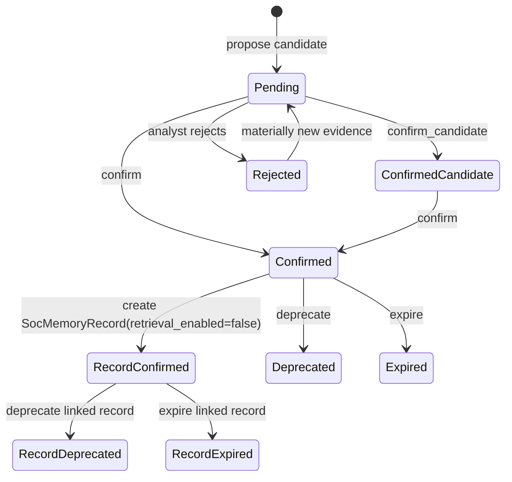

# SOC Memory Tracking Plan

> Updated: 2026-07-08
>
> 目的：定义 SOC Agent 后续如何沉淀 topic / detection / scenario 级经验，并把 SOC TUI、Kafka daemon、ReviewQueue、Lead Agent 和 domain triage 中的重要结论转成可审计、可确认、可回滚的业务记忆。

## 1. 当前决策

SOC memory 先做 **DB-first operational memory store**，wiki/OKF 只作为后期展示、人工审阅和迁移导出的 projection。

```text
PostgreSQL = source of truth
Wiki / OKF = read model / review projection / portable export
```

原因：

- 生产研判必须依赖结构化 DB、状态机、权限、审计和回滚。
- wiki/OKF 适合人类浏览、知识整理、跨工具迁移，但不适合作为生产判断的主写入源。
- 如果 DB 和 wiki 双主写，会出现版本冲突、自然语言修改无法校验、LLM 自动编辑污染生产判断等问题。

因此当前实现顺序是：

```text
Typed memory DB contract
  -> SocMemoryService
  -> Candidate review workflow / confirmed-memory boundary
  -> Retrieval policy
  -> TUI/Web/Kafka/domain candidate write
  -> Prompt/Lead Agent bounded injection
  -> Wiki/OKF export projection later
```

当前实现进度：`SocMemoryCandidate` DB/API/CLI/Web/TUI/Lead Agent visibility 已完成；`SocMemoryService.review_candidate()` 已支持 `confirm_candidate`、`confirm`、`reject`、`deprecate`、`expire`；`confirm` 会创建 `SocMemoryRecord(status=confirmed, retrieval_enabled=false)`。`SocMemoryService.find_relevant_records()` 已支持 retrieval-enabled gate、score、match reason、token budget 和 `InvestigationContext.relevant_memories`；prompt injection、memory replay diff 和 retrieval enablement workflow 后续再做。

## 2. 不是四维硬主键

`rule_code`、`topic`、`detection_key`、`scenario_signature` 都不能被设计成“必须全等命中”的联合主键。任何一个维度在不同公司、不同厂商、不同检测场景下都可能缺失、别名不同或粒度不同。

正确模型是：

```text
Typed Memory Record
  + Facets
  + Evidence Refs
  + Status Lifecycle
  + Retrieval Policy
```

也就是说，memory 是 typed record；topic、detection、scenario、vendor alias、entity、asset 等都是 facets，用于召回、打分、解释和审计。

## 3. Typed Memory Record

推荐核心结构：

```json
{
  "memory_id": "MEM-...",
  "version": 3,
  "memory_type": "procedure | detection_lesson | environment_fact | negative_memory | case_memory",
  "status": "confirmed | deprecated | expired",
  "retrieval_enabled": false,
  "content": "APT 方向冲突时，优先 raw message、五元组和资产归属重建攻击方向。",
  "facets": {
    "scope": ["soc", "defense"],
    "topics": ["apt_direction_reconstruction"],
    "detection": {
      "canonical_key": "apt:direction_conflict",
      "vendor_aliases": {
        "pingan.rule_code": "APT-2026494",
        "sigma.rule_id": null,
        "splunk.analytic_id": null
      }
    },
    "scenario": {
      "source_type": "apt",
      "direction_conflict": true,
      "asset_role": "internal_target"
    },
    "entities": {
      "ip": [],
      "user": [],
      "host": []
    },
    "environment": {
      "tenant_id": "default",
      "asset_zone": null,
      "business_unit": null
    }
  },
  "evidence_refs": [
    {"type": "run", "id": "RUN-..."},
    {"type": "review_item", "id": "REV-..."},
    {"type": "investigation_evidence", "id": "EVD-..."}
  ],
  "validity": {
    "valid_from": "2026-07-06T00:00:00Z",
    "valid_until": null
  },
  "confidence": 0.82,
  "hit_count": 12,
  "last_used_at": null,
  "content_hash": "sha256:...",
  "facets_hash": "sha256:..."
}
```

字段原则：

- `memory_type` 决定用途和注入边界。
- candidate `status` 决定评审阶段；record `status` + `retrieval_enabled` + retrieval policy 共同决定是否能影响后续判断。
- `facets` 用于检索，不是硬主键。
- `vendor_aliases` 是可选字段；平安 `rule_code`、EDR `signature_id`、SIEM `analytic_id` 都只是 alias。
- `entities` 默认作为 evidence / query dimension，不作为长期全局记忆主粒度。
- `evidence_refs` 必须能追溯到 run、review、tool result、分析师纠正或外部文档。

## 4. Memory Types

| Type | 用途 | 是否可默认注入 | 示例 |
|---|---|---|---|
| `procedure` | 研判方法 / SOP | confirmed + retrieval policy 允许后可注入 | “APT 方向冲突优先 raw message + 五元组重建” |
| `detection_lesson` | 检测规则/场景经验 | confirmed + retrieval policy 允许后可注入 | “EDR PowerShell + Office parent + 外联公网需查进程树” |
| `benign_pattern` | 常见误报 / 授权行为模式 | confirmed、未过期且 retrieval policy 允许后可注入 | “某内部安全组执行指定扫描工具通常为授权测试” |
| `environment_fact` | 环境事实 / 授权资产 / 业务背景 | confirmed、未过期且 retrieval policy 允许后可注入 | “SecurityScan 是公司漏扫工具” |
| `identity_pattern` | 租户身份/账号模式 | confirmed、未过期且 retrieval policy 允许后可注入 | “外包账号通常使用 EX- 前缀” |
| `response_policy_hint` | 处置策略提示 | confirmed 后可作为建议，不自动执行 | “该场景优先转 BU，不直接封 IP” |
| `negative_memory` | 被驳回结论 / 禁止重复建议 | confirmed + retrieval policy 允许后用于抑制 | “不要把 X 类日志云加工字段当攻击方向事实” |
| `case_memory` | 当前 case 临时上下文 | 只在当前 case 注入 | “本工单已查过 endpoint process tree” |

### 4.1 PingAn Prompt Decomposition Memory

`.notes/ai_soc/pingan_docs/` 中的历史 prompt 原文不能整体进入 prompt。拆解后，只有通用方法进入 skill；平安环境知识进入 tenant-scoped memory：

| PingAn 内容 | Memory type | 要求 |
|---|---|---|
| 内部安全工具、内部域名、部门/团队例外 | `environment_fact` | 必须有 `tenant_id=pingan`、来源文档、有效期 |
| 某规则/场景长期误报模式 | `benign_pattern` 或 `detection_lesson` | 必须带 detection/vendor alias 和 eval evidence |
| 账号格式、外包账号、管理员账号特征 | `identity_pattern` | 不得当作跨客户通用知识 |
| 处置倾向、转 BU、封禁/隔离前置条件 | `response_policy_hint` | 只能作为建议；执行仍走 approval/policy |
| 字段方向不可信、加工字段误导 | `negative_memory` 或 `procedure` | 用于降低错误字段权重 |

## 5. Facets 不是必填项

不同来源能提供的 facets 不一样。系统必须允许缺失，而不是因为缺 `rule_code`、缺 topic、缺完整 scenario 就无法工作。

| Facet | 是否必需 | 说明 |
|---|---|---|
| `topics` | 推荐但非硬必需 | 可由 skill/domain resolver 推断，缺失时可从 category/source_type 兜底 |
| `detection.canonical_key` | 推荐但非硬必需 | canonical key 缺失时使用 source_type、category、rule_name、MITRE、raw fingerprint 生成弱 key |
| `detection.vendor_aliases` | 可选 | 平安 `rule_code`、Sigma id、EDR signature id 等；只加速和加分 |
| `scenario` | 推荐 | 结构化 facets 比 opaque hash 更重要；hash 只用于去重 |
| `entities` | 可选 | 用于 evidence 和 case query，不默认成为长期主粒度 |
| `environment` | 可选 | tenant、asset zone、BU、environment 等，用于环境事实和过滤 |

## 6. 新预警如何查记忆

新预警进入后，先从 canonical alert、correlation result、selected skills、domain findings 和 asset context 构造 `SocMemoryQuery`。

```json
{
  "memory_types": ["procedure", "detection_lesson", "environment_fact", "negative_memory"],
  "statuses": ["confirmed"],
  "topics": ["edr_process_tree_triage"],
  "detection": {
    "canonical_key": "edr:suspicious_powershell",
    "vendor_aliases": {
      "pingan.rule_code": "EDR-1965810"
    }
  },
  "scenario": {
    "source_type": "edr",
    "process_family": "powershell",
    "parent_process_family": "office",
    "network_direction": "external"
  },
  "entities": {
    "host": ["endpoint-1"],
    "user": ["um12345"]
  },
  "environment": {
    "tenant_id": "default",
    "asset_zone": "office_endpoint"
  },
  "limit": 8
}
```

召回策略：

1. `memory_type/status` 先过滤，只召回允许影响当前任务的记忆。
2. `topics` 召回同领域经验。
3. `canonical_key` 召回同检测族经验。
4. `vendor_aliases` 召回供应商强索引；没有 alias 不影响系统工作。
5. `scenario` 做 overlap 召回和打分。
6. `environment` 召回资产/网段/BU/环境事实。
7. `negative_memory` 单独召回，用于抑制重复错误建议。

打分示意：

```text
score =
  status_weight
  + memory_type_weight
  + topic_match
  + canonical_detection_match
  + vendor_alias_match
  + scenario_overlap
  + environment_match
  + confidence
  + evidence_count
  + hit_count
  + recency
  - stale_penalty
```

只取 top K 条进入 prompt / Lead Agent bounded context，并记录 `match_reason`、`score`、`memory_id`、`version` 和 `content_hash`，用于 replay diff。

## 7. 写入来源

| 来源 | 可生成什么 | 默认状态 | 说明 |
|---|---|---|---|
| SOC TUI 人工纠正 | detection lesson / negative memory | `pending_review` 或 `confirmed_candidate` | 分析师明确确认时可更高可信 |
| ReviewQueue close/correct | correction lesson / negative memory | `pending_review` | close 不等于改判；correct 更适合提取经验 |
| Kafka daemon 批量结果 | repeated pattern candidate | `pending_review` | 自动流量必须保守，不能直接 confirmed |
| Lead Agent 研判总结 | memory candidate | `pending_review` | LLM 只能提候选，不能自行确认 |
| Domain triage result | topic/scenario candidate | `pending_review` | APT/EDR/HIDS/F5 finding 稳定后再接 |
| InvestigationEvidence | evidence ref | 不直接是 memory | 可作为候选记忆的证据 |

## 8. 状态机



注入规则：

- 当前 `confirmed` record 也不能默认注入 analysis prompt；只有 `retrieval_enabled=true` 且通过 `SocMemoryService.find_relevant_records()` 命中的 record 可以作为 `InvestigationContext.relevant_memories` 展示给 Web/TUI/Lead Agent。
- `confirmed_candidate` 默认不全局注入；可以在当前 TUI/correction 会话内局部引用。
- `pending_review` 不注入，只展示给分析师确认。
- `rejected` 不注入，并用于抑制重复错误建议。
- `deprecated` 不注入，但保留审计和历史解释。

## 9. DB 与 Wiki/OKF 一致性

当前阶段不实现 wiki/OKF 运行时写入。后期如果要做，必须遵守单主原则：

```text
SocMemoryService -> PostgreSQL -> memory_events -> exporter -> wiki/OKF
```

规则：

- PostgreSQL 是唯一 source of truth。
- wiki/OKF 是从 DB 导出的 read model，不参与生产推理主链路。
- 自动同步方向只有 DB -> wiki/OKF。
- 人工编辑 wiki 后，不能直接覆盖 DB；只能生成 `SocMemoryChangeProposal`，经 review 后通过 `SocMemoryService.apply_change()` 写回 DB 新版本。
- 每个 wiki 页面 frontmatter 必须包含 `memory_id`、`version`、`status`、`content_hash`、`facets_hash`、`db_updated_at`。
- `soc memory reconcile` 后期用于检查 DB/wiki 缺失、版本不一致、hash 不一致、status 不一致和未导入变更。

后期命令草案：

```bash
soc memory export --format okf
soc memory diff-wiki
soc memory import-proposals
soc memory reconcile
```

## 10. 实现路线

### Slice A：Memory Tracking Contract

- 已新增 `SocMemoryCandidate`、`SocMemoryRecord`、review 状态枚举、`SocMemoryQuery` 和 retrieval result。
- 定义 typed record、facets、hash、status lifecycle 和 retrieval result。
- 先不接自动写入，只固定 schema、hash、去重和测试。

### Slice B：SocMemoryService MVP

- 已新增 `SocMemoryService.propose_candidate()` 和 `review_candidate()`。
- 已新增 repository protocol：保存候选、查询 pending、确认、驳回、标记 deprecated/expired，以及保存/查询 confirmed record。
- 所有入口只能调用 service，不能直接写 memory repository。

### Slice C：Memory Retrieval MVP

- 已新增 `SocMemoryService.find_relevant_records(SocMemoryQuery)`。
- 已支持 type/status/tenant/facets/text/evidence refs 多路召回、score、match reason、token budget、hash/version 和 skipped counters。
- 已接 CLI `soc memory search`、Gateway `/api/soc/memory/search`、ReviewQueue context/Web/TUI/Lead Agent bounded artifact 可见化。
- PromptBuilder 注入仍未开启；后续只允许 retrieval policy 通过、`retrieval_enabled=true`、confirmed 且未过期的结果进入 bounded prompt。

### Slice D：TUI / ReviewQueue Memory Candidate

- `soc correct`、`soc review tui`、ReviewQueue Web correction 产生 memory candidate。
- 候选内容来自 structured correction、domain finding、evidence refs 和 analyst reason。
- 先写 `pending_review`，人工确认后才进入 `confirmed`。

### Slice E：Kafka Daemon Memory Candidate

- daemon 只能生成 repeated pattern candidate，默认 `pending_review`。
- 幂等键必须包含 `topic/partition/offset` 或 run id，避免重放污染 memory。
- 批量命中可以增加 evidence_count，但不能直接 confirmed。

### Slice F：Wiki/OKF Export Projection

- 等 DB memory store、service、retrieval 和 review workflow 稳定后再做。
- 初始只做 DB -> wiki/OKF export，不做反向 import。
- 反向 import 必须走 proposal/review。

## 11. 与当前路线关系

Memory tracking 应该加入待完成列表，但不要早于 Correlation Service 抢主线：

```text
Slice 0: PingAn SOC capability onboarding
Slice 1: Correlation Service MVP
Slice 2: Memory Tracking Contract
Slice 3: Domain Sub-Agent Contract
Slice 4: EDR/APT/HIDS/F5 MVP handlers
Slice 5: Main SOC Agent Orchestrator MVP
Slice 6: Web/TUI 可见化
Slice 7: Demo/Eval Script
```

原因：

- Correlation 先解决“这条告警和历史有什么关系”。
- Memory Tracking Contract 再固定“哪些结论可以变成长期经验”。
- Domain Sub-Agent 和后续 TUI/Kafka workflow 才能按同一套 typed memory/facets 产出候选记忆。

## 12. 第一批建议追踪的 Topics

| Topic | 来源 | 初始用途 |
|---|---|---|
| `apt_direction_reconstruction` | APT / 天眼 / Zeus | 修复方向错判、攻击/受害角色冲突 |
| `edr_process_tree_triage` | EDR | 记录进程树研判模式和常见误报 |
| `asset_ownership_resolution` | CMDB / asset.locate | 记录资产归属、处置对象选择经验 |
| `f5_suppression_target` | F5/WAF | 记录抑制目标是 IP、URI、rule 还是组合 |
| `hids_host_behavior_triage` | HIDS | 记录主机行为规则的常见误报/真阳性模式 |
| `negative_memory` | TUI/Web correction | 记录已驳回的错误结论，防止反复提示 |
