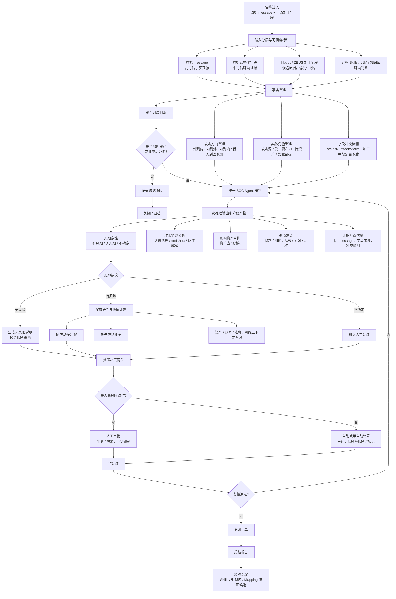
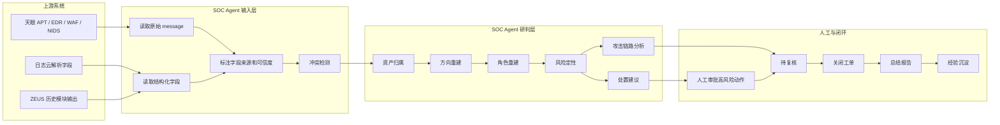

# ZEUS Alert Flow and Field Trust

> 2026-06-30 meeting note digest. This document is a product/architecture
> decision note for SOC Agent alert triage when upstream logs and processed
> fields conflict.

## 背景问题

同事反馈的核心问题不是单纯“流程如何画”，而是当前 ZEUS / 天眼 APT / 日志云链路里存在明显的上游数据可信度问题。

### 1. 上游日志方向不可靠

天眼 APT 使用同一套字段模板承载多类告警，例如恶意外联、外到内攻击、内到内行为、我方访问互联网等。由于上游没有稳定约束流量方向和攻击/受害定义，可能出现：

- 反连场景中，日志显示互联网到平安发起。
- 反连场景中，实际是平安内到内行为触发。
- 正向攻击场景中，实际是我方访问或攻击互联网非平台服务。
- 原始字段里的攻击方、受害方、源/目的方向互相矛盾。

### 2. 日志云加工字段冲突

历史上为了不同需求，日志云增加过很多解析字段。这些字段服务目标不同，可能互相冲突：

- 字段 A 指向一个影响资产。
- 字段 B 指向另一个资产查询对象。
- 字段 C 又服务于抑制或处置下发。
- 多个字段同时进入模型输入时，会干扰 AI 判断。

### 3. ZEUS 处置结果不统一

当前 ZEUS 预警处置流程包含多个模块各自产出的独立结果。这些结果：

- 标准不统一。
- 信息可能互相矛盾。
- 维护复杂。
- 会干扰后端研判模型对影响资产和处置目标的判断。

## 当前有效经验

会议里提到一个重要经验：

> 后端模型研判输入使用原始 message 日志，不包含后续人工加工字段，再配合持续迭代的运营监控响应经验 skills，目前大部分识别符合标准。

这说明 SOC Agent 的输入策略应该明确分层：

| 输入来源 | 默认可信度 | 用途 |
|---|---:|---|
| 原始 `message` | 高 | 事实重建、方向判断、证据引用 |
| 原始结构化字段 | 中 | 辅助实体抽取，但必须允许冲突检测 |
| 日志云/ZEUS 加工字段 | 低到中 | 候选证据，不直接作为最终事实 |
| 历史经验 skills / 记忆 | 中 | 提供研判策略、误报经验、处置经验 |
| 人工复核结果 | 高 | 纠正事实、确认知识、形成闭环 |

## 设计原则

### Principle 1: 上游字段不是事实

字段只能是证据或候选结论。尤其是攻击方向、影响资产、受害方、处置目标，不应直接相信单个上游字段。

SOC Agent 必须能表达：

- 这个字段来自哪里。
- 它是原始日志、加工字段、模型推断，还是人工确认。
- 它和哪些字段冲突。
- 最终事实采用哪个结论，以及为什么。

### Principle 2: 先重建事实，再做研判

研判前必须先做事实重建：

- 攻击方向重建。
- 攻击源、受害资产、中转资产、处置目标重建。
- 内外网方向重建。
- 字段冲突检测。

否则后面的资产查询、相似告警召回、抑制目标、阻断建议都会被污染。

### Principle 3: 统一 Agent 输出多阶段产物

ZEUS 当前问题之一是多个模块各自产出结果，标准不统一。后续应该由统一的 SOC Agent runtime 组织流程，由一个统一输出 contract 承载多个阶段产物：

- 风险定性。
- 攻击方向判断。
- 影响资产判断。
- 攻击链路分析。
- 处置建议。
- 证据引用。
- 置信度和冲突说明。

这不等于让 LLM 掌握主流程。主流程仍由 runtime 控制；LLM 只在固定节点内输出结构化候选结果。

## Mermaid 流程图



## 泳道版



## 对当前 SOC Agent 方案的影响

### 需要补的 contract 概念

当前已落地最小事实重建契约，后续继续扩展冲突类型和 LLM 解释能力：

| 概念 | 目的 |
|---|---|
| `EvidenceLayer` | 已落地；区分 raw message、raw structured、processed field、agent inference、human confirmed |
| `EvidenceInputPolicy` | 已落地；决定事实重建/LLM 研判优先读取哪份输入 |
| `FieldTrust` | 已落地；表达字段可信度、来源、是否参与事实重建 |
| `ConflictReport` | 已落地最小版；记录方向、角色、资产、处置目标之间的候选冲突 |
| `RoleAssignment` | 已落地最小版；表达 source、destination、attacker、victim、impacted_asset、response_target |
| `TriageOutputBundle` | 未落地；后续一次推理输出多个页面/流程产物，避免多个模块各说各话 |

### 对 normalization 的影响

当前已经做了 normalization / drift / mapping config。下一步处理 ZEUS/天眼类日志时，需要注意：

- normalizer 不应把上游加工字段直接提升为事实。
- 加工字段应该进入 extensions 或 candidate evidence。
- 攻击方向、资产角色、处置目标应由事实重建节点输出，并附 evidence。
- 如果 raw message 与加工字段冲突，必须进入 `ConflictReport`，不能静默覆盖。
- 当前 runtime 已在 `entity_extract` 后、`analyze_stub` 前加入 `fact_reconstruct` 节点，输出 `AnalysisRun.fact_reconstruction`。

### 平安 ZEUS / 天眼输入策略

平安旧平台的最小可行策略定为 `raw_message_first + structured_fallback`：

1. 如果 `alert.hitLog[].zeusRawLogs[].message` 存在且非空，后续 LLM/事实重建节点优先读取该原始 message。
2. 如果 `message` 不存在或为空，则 adapter 选择可用原始日志字段并写入 `EvidenceInputPolicy`。
3. 如果没有任何 raw message，只能 fallback 到完整 `zeusRawLogs` 对象，但必须降级可信度，并记录 `fallback_reason=raw_message_missing`。
4. fallback 不表示 `zeusRawLogs` 里的加工字段可信；它只是“没有更好输入时的证据包”。后续方向、资产、攻击/受害角色仍需要事实重建和冲突检测。

当前平安策略不是写死到核心 runtime，而是由 `normalizers/pingan_platform.py` 输出：

```json
{
  "name": "raw_message_first",
  "primary_input_path": "alert.hitLog[0].zeusRawLogs[0].message",
  "fallback_input_path": "alert.hitLog[0].zeusRawLogs[0]",
  "selected_input_path": "alert.hitLog[0].zeusRawLogs[0].message",
  "selected_layer": "raw_message",
  "ignore_processed_fields_for_reasoning": true,
  "trust_level": "high"
}
```

缺少 raw message 时输出：

```json
{
  "name": "structured_fallback",
  "primary_input_path": "alert.hitLog[0].zeusRawLogs[0]",
  "selected_input_path": "alert.hitLog[0].zeusRawLogs[0]",
  "selected_layer": "raw_structured",
  "fallback_reason": "raw_message_missing",
  "ignore_processed_fields_for_reasoning": false,
  "trust_level": "low"
}
```

其他供应商如果字段干净，可以不实现这一步，或选择 `canonical_fields_first`。如果供应商也存在方向/角色冲突，再升级为 `hybrid_with_conflict_check`。

### 对 LLM 使用方式的影响

LLM 可以做：

- 从 raw message 中解释方向和角色。
- 对冲突字段做归因说明。
- 输出结构化候选 `RoleAssignment`。
- 生成处置建议和总结报告。

LLM 不能做：

- 跳过资产归属、方向重建、冲突检测。
- 直接执行阻断、隔离、关闭生产告警等动作。
- 把未确认的候选字段写入长期 confirmed memory。

## 当前结论

ZEUS / 天眼场景下，SOC Agent 的核心价值不是“把上游字段喂给模型总结”，而是：

1. 对输入做可信度分层。
2. 从原始 message 和上下文中重建事实。
3. 显式发现字段冲突。
4. 统一输出风险、链路、资产、处置和报告。
5. 通过复核和经验沉淀持续改进。

这条路线与当前方案中的 runtime 固定主流程、LLM 受限推理节点、human approval、memory confirmed policy 一致。
