# DeerFlow 2.0 架构图

## Changelog
- 2026-05-18：初始创建，包含 Agent 构建 + 中间件链 + 配置系统 + 工具系统
- 2026-05-18：追加 Sandbox 沙箱模块（生命周期 + 虚拟路径映射 + 7 个工具）
- 2026-05-18：追加 Memory 记忆模块（去抖动队列 + LLM 提取 + 存储层）
- 2026-05-20：追加 Memory 模块详细图（全流程 + _apply_updates + token 预算）
- 2026-05-21：追加 Sub-Agent 模块（执行流程 + 三层配置合并）
- 2026-05-28：追加 Guardrails 安全护栏模块 + ContextVar 完整链路
- 2026-05-29：追加模型工厂模块（模型创建流程 + 厂商适配总结）
- 2026-05-29：追加技能系统模块（安装流程 + 安全扫描 + 加载流程）

## 已学模块关系图

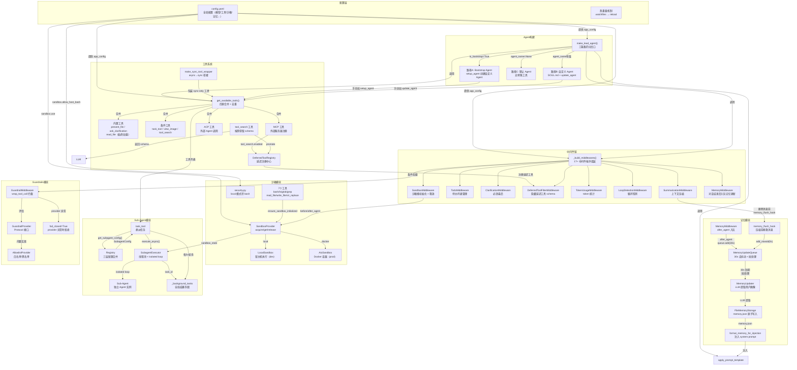
```mermaid
graph TD
    subgraph 配置层
        CONFIG["config.yaml<br/>全局配置（模型/工具/沙箱/记忆...）"]
        CONFIG_HOT["热重载机制<br/>watchfiles → reload"]
    end

    subgraph Agent构建
        MAKE["make_lead_agent()<br/>三条路的分岔口"]
        BOOTSTRAP["路径A: Bootstrap Agent<br/>setup_agent 创建自定义Agent"]
        CUSTOM["路径B: 自定义 Agent<br/>SOUL.md + update_agent"]
        DEFAULT["路径C: 默认 Agent<br/>无特殊工具"]
        MAKE -->|"is_bootstrap=True"| BOOTSTRAP
        MAKE -->|"agent_name有值"| CUSTOM
        MAKE -->|"agent_name=None"| DEFAULT
    end

    subgraph 工具系统
        GAT["get_available_tools()<br/>四源合并 + 去重"]
        BUILTIN["内置工具<br/>present_file / ask_clarification<br/>read_file（始终加载）"]
        CONDITIONAL["条件工具<br/>task_tool / view_image / tool_search"]
        MCP["MCP 工具<br/>外部服务器注册"]
        ACP["ACP 工具<br/>外部 Agent 调用"]
        SYNC["make_sync_tool_wrapper<br/>async→sync 桥接"]
        DEFERRED["DeferredToolRegistry<br/>延迟注册中心"]
        TOOL_SEARCH["tool_search 工具<br/>按需获取 schema"]
    end

    subgraph 中间件链
        MW["_build_middlewares()<br/>17+ 中间件按序组装"]
        SUM["SummarizationMiddleware<br/>上下文压缩"]
        TODO["TodoMiddleware<br/>待办列表管理"]
        CLARIFY["ClarificationMiddleware<br/>必须最后"]
        DEFERRED_MW["DeferredToolFilterMiddleware<br/>隐藏延迟工具 schema"]
        TOKEN["TokenUsageMiddleware<br/>token 统计"]
        LOOP["LoopDetectionMiddleware<br/>循环检测"]
        SANDBOX_MW["SandboxMiddleware<br/>沙箱懒初始化 + 释放"]
        MEMORY_MW["MemoryMiddleware<br/>对话结束后入队记忆更新"]
    end

    subgraph 沙箱模块
        SB_PROV["SandboxProvider<br/>acquire/get/release"]
        SB_LOCAL["LocalSandbox<br/>宿主机执行（dev）"]
        SB_DOCKER["AioSandbox<br/>Docker 容器（prod）"]
        SB_TOOLS["7个工具<br/>bash/ls/glob/grep<br/>read_file/write_file/str_replace"]
        SB_SEC["security.py<br/>local 模式禁 bash"]
    end

    subgraph 记忆模块
        MEM_MW["MemoryMiddleware<br/>after_agent 入队"]
        MEM_QUEUE["MemoryUpdateQueue<br/>30s 去抖动 + 批处理"]
        MEM_UPDATER["MemoryUpdater<br/>LLM 提取用户画像"]
        MEM_STORAGE["FileMemoryStorage<br/>memory.json 原子写入"]
        MEM_HOOK["memory_flush_hook<br/>压缩前抢救消息"]
        MEM_INJECT["format_memory_for_injection<br/>注入 system prompt"]
    end

    subgraph Sub-Agent模块
        SUB_TASK["task_tool<br/>委派任务"]
        SUB_REG["Registry<br/>三层配置合并"]
        SUB_EXEC["SubagentExecutor<br/>线程池 + isolated loop"]
        SUB_AGENT["Sub-Agent<br/>独立 Agent 实例"]
        SUB_BG["_background_tasks<br/>全局结果存储"]
    end

    subgraph Guardrails模块
        GR_MW["GuardrailMiddleware<br/>wrap_tool_call 拦截"]
        GR_PROV["GuardrailProvider<br/>Protocol 接口"]
        GR_ALLOW["AllowlistProvider<br/>白名单/黑名单"]
        GR_FAIL["fail_closed=True<br/>provider 异常时拒绝"]
    end

    CONFIG -->|提供 app_config| MAKE
    CONFIG -->|提供 app_config| GAT
    CONFIG -->|提供 app_config| MW

    MAKE -->|调用| GAT
    MAKE -->|调用| MW
    MAKE -->|调用| apply_prompt_template

    GAT -->|合并| BUILTIN
    GAT -->|合并| CONDITIONAL
    GAT -->|合并| MCP
    GAT -->|合并| ACP

    MCP -->|"tool_search.enabled"| DEFERRED
    DEFERRED -->|注册延迟工具| DEFERRED_MW
    TOOL_SEARCH -->|promote| DEFERRED
    TOOL_SEARCH -->|返回 schema| LLM

    SYNC -->|包装 sync-only 工具| GAT

    MW --> SUM
    MW --> TODO
    MW --> TOKEN
    MW --> DEFERRED_MW
    MW --> LOOP
    MW --> CLARIFY

    BOOTSTRAP -->|手动加 setup_agent| GAT
    CUSTOM -->|手动加 update_agent| GAT

    CONFIG -->|"sandbox.use"| SB_PROV
    CONFIG -->|"sandbox.allow_host_bash"| SB_SEC
    SB_PROV -->|local| SB_LOCAL
    SB_PROV -->|docker| SB_DOCKER
    SB_TOOLS -->|ensure_sandbox_initialized| SB_PROV
    SANDBOX_MW -->|before/after_agent| SB_PROV

    MW --> SANDBOX_MW
    MW --> MEMORY_MW

    MEM_MW -->|"after_agent<br/>queue.add(30s)"| MEM_QUEUE
    SUM -->|"删除消息前<br/>memory_flush_hook"| MEM_HOOK
    MEM_HOOK -->|"add_nowait(0s)"| MEM_QUEUE
    MEM_QUEUE -->|"30s 到期<br/>批处理"| MEM_UPDATER
    MEM_UPDATER -->|"LLM 提取"| MEM_STORAGE
    MEM_STORAGE -->|"memory.json"| MEM_INJECT
    MEM_INJECT -->|"注入 <memory>"| apply_prompt_template

    SUB_TASK -->|"get_subagent_config()"| SUB_REG
    SUB_REG -->|"SubagentConfig"| SUB_TASK
    SUB_TASK -->|"execute_async()"| SUB_EXEC
    SUB_EXEC -->|"isolated loop"| SUB_AGENT
    SUB_EXEC -->|"task_id"| SUB_BG
    SUB_TASK -->|"每5s轮询"| SUB_BG
    GAT -->|"工具列表"| SUB_TASK
    SB_PROV -->|"sandbox_state"| SUB_EXEC

    GR_MW -->|评估| GR_PROV
    GR_PROV -->|内置实现| GR_ALLOW
    GR_MW -->|provider 异常| GR_FAIL
    MW -->|条件加载| GR_MW
```

## 工具系统详细数据流

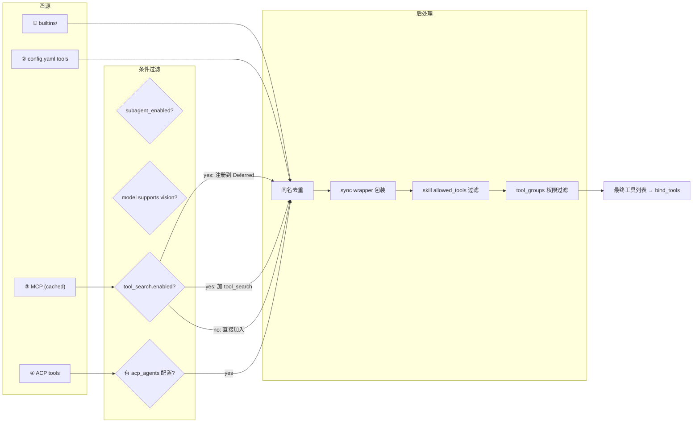
```mermaid
graph LR
    subgraph 四源
        S1["① builtins/"]
        S2["② config.yaml tools"]
        S3["③ MCP (cached)"]
        S4["④ ACP tools"]
    end

    subgraph 条件过滤
        C1{"subagent_enabled?"}
        C2{"model supports vision?"}
        C3{"tool_search.enabled?"}
        C4{"有 acp_agents 配置?"}
    end

    subgraph 后处理
        DEDUP["同名去重"]
        SYNC_W["sync wrapper 包装"]
        SKILL_FILTER["skill allowed_tools 过滤"]
        TOOL_GROUPS["tool_groups 权限过滤"]
    end

    RESULT["最终工具列表 → bind_tools"]

    S1 --> DEDUP
    S2 --> DEDUP
    S3 --> C3
    C3 -->|"yes: 注册到 Deferred"| DEDUP
    C3 -->|"yes: 加 tool_search"| DEDUP
    C3 -->|"no: 直接加入"| DEDUP
    S4 --> C4
    C4 -->|"yes"| DEDUP

    DEDUP --> SYNC_W
    SYNC_W --> SKILL_FILTER
    SKILL_FILTER --> TOOL_GROUPS
    TOOL_GROUPS --> RESULT
```

## task_tool 执行流

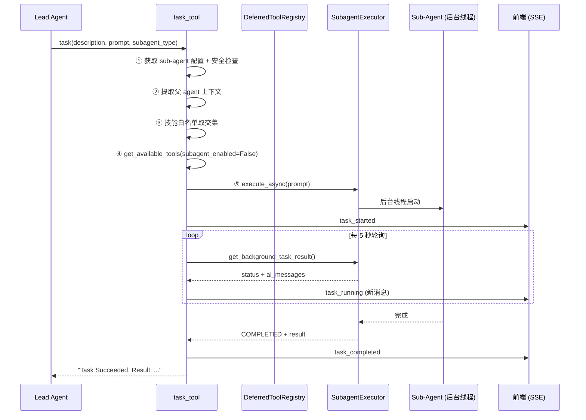
```mermaid
sequenceDiagram
    participant Lead as Lead Agent
    participant TT as task_tool
    participant Registry as DeferredToolRegistry
    participant Executor as SubagentExecutor
    participant Sub as Sub-Agent (后台线程)
    participant SSE as 前端 (SSE)

    Lead->>TT: task(description, prompt, subagent_type)
    TT->>TT: ① 获取 sub-agent 配置 + 安全检查
    TT->>TT: ② 提取父 agent 上下文
    TT->>TT: ③ 技能白名单取交集
    TT->>TT: ④ get_available_tools(subagent_enabled=False)
    TT->>Executor: ⑤ execute_async(prompt)
    Executor->>Sub: 后台线程启动
    TT->>SSE: task_started
    loop 每 5 秒轮询
        TT->>Executor: get_background_task_result()
        Executor-->>TT: status + ai_messages
        TT->>SSE: task_running (新消息)
    end
    Sub-->>Executor: 完成
    Executor-->>TT: COMPLETED + result
    TT->>SSE: task_completed
    TT-->>Lead: "Task Succeeded. Result: ..."
```

## 延迟工具发现流

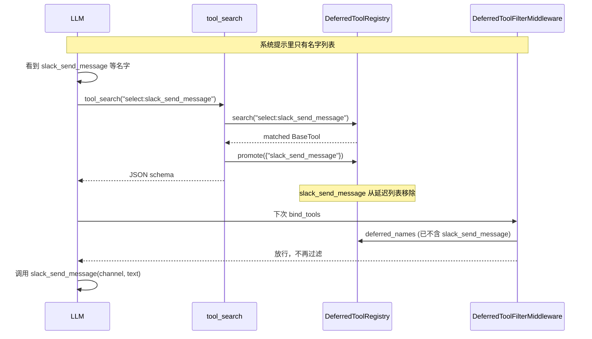
```mermaid
sequenceDiagram
    participant LLM as LLM
    participant TS as tool_search
    participant Reg as DeferredToolRegistry
    participant MW as DeferredToolFilterMiddleware

    Note over LLM,MW: 系统提示里只有名字列表
    LLM->>LLM: 看到 slack_send_message 等名字
    LLM->>TS: tool_search("select:slack_send_message")
    TS->>Reg: search("select:slack_send_message")
    Reg-->>TS: matched BaseTool
    TS->>Reg: promote({"slack_send_message"})
    TS-->>LLM: JSON schema
    Note over Reg: slack_send_message 从延迟列表移除
    LLM->>MW: 下次 bind_tools
    MW->>Reg: deferred_names (已不含 slack_send_message)
    MW-->>LLM: 放行，不再过滤
    LLM->>LLM: 调用 slack_send_message(channel, text)
```

## 跨模块关注点

### 共享状态
- `ThreadState`（`thread_state.py`）：Agent / 中间件 / 工具 共享的状态对象
- `ContextVar`（`tool_search.py`）：每个请求独立的 DeferredToolRegistry
- `runtime.context`（`types.py`）：工具访问运行时上下文（user_id, agent_name, thread_id）

### 配置影响
- `config.yaml` 一个配置项可能影响多个模块：
  - `tool_search.enabled` → 工具系统（加 tool_search）+ 中间件（加 DeferredToolFilterMiddleware）
  - `summarization.enabled` → 中间件（加 SummarizationMiddleware）+ 记忆系统（flush hook）
  - `memory.enabled` → 中间件（加 MemoryMiddleware）+ summarization hooks
  - `token_usage.enabled` → 中间件（加 TokenUsageMiddleware）+ task_tool（缓存 sub-agent 用量）

### 错误传播
- task_tool 超时 → SSE 推送 task_timed_out → Lead Agent 拿到超时错误 → 继续对话
- tool_search 无结果 → 返回 "No tools found" → LLM 换个方式问
- setup_agent 失败 → 自动清理目录 → ToolMessage 返回错误 → LLM 重试或告知用户

## Sandbox 沙箱模块

### 沙箱生命周期

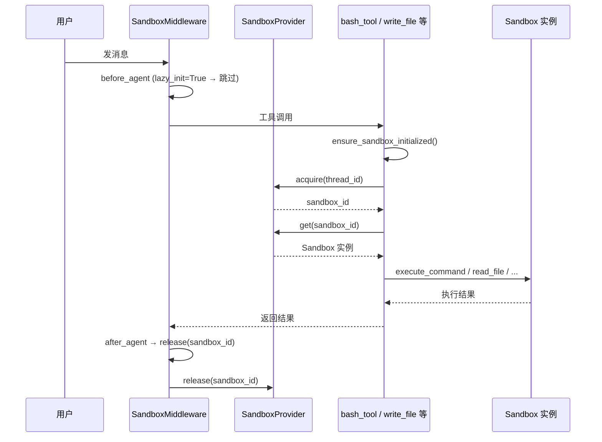
```mermaid
sequenceDiagram
    participant User as 用户
    participant MW as SandboxMiddleware
    participant Prov as SandboxProvider
    participant Tool as bash_tool / write_file 等
    participant SB as Sandbox 实例

    User->>MW: 发消息
    MW->>MW: before_agent (lazy_init=True → 跳过)
    MW->>Tool: 工具调用
    Tool->>Tool: ensure_sandbox_initialized()
    Tool->>Prov: acquire(thread_id)
    Prov-->>Tool: sandbox_id
    Tool->>Prov: get(sandbox_id)
    Prov-->>Tool: Sandbox 实例
    Tool->>SB: execute_command / read_file / ...
    SB-->>Tool: 执行结果
    Tool-->>MW: 返回结果
    MW->>MW: after_agent → release(sandbox_id)
    MW->>Prov: release(sandbox_id)
```

### 虚拟路径映射（local 模式）

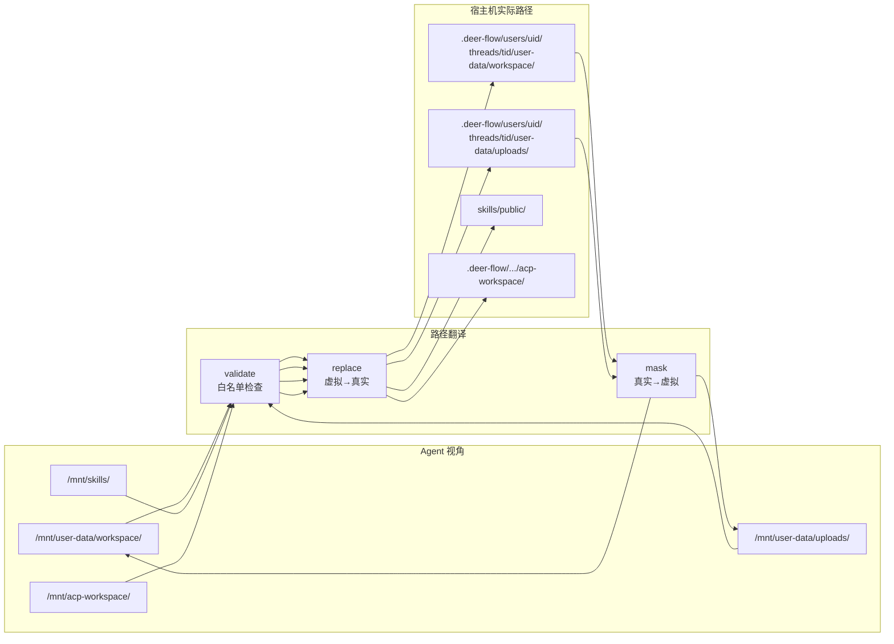
```mermaid
graph LR
    subgraph Agent 视角
        V1["/mnt/user-data/workspace/"]
        V2["/mnt/user-data/uploads/"]
        V3["/mnt/skills/"]
        V4["/mnt/acp-workspace/"]
    end

    subgraph 路径翻译
        T1["validate<br/>白名单检查"]
        T2["replace<br/>虚拟→真实"]
        T3["mask<br/>真实→虚拟"]
    end

    subgraph 宿主机实际路径
        R1[".deer-flow/users/uid/<br/>threads/tid/user-data/workspace/"]
        R2[".deer-flow/users/uid/<br/>threads/tid/user-data/uploads/"]
        R3["skills/public/"]
        R4[".deer-flow/.../acp-workspace/"]
    end

    V1 --> T1 --> T2 --> R1
    V2 --> T1 --> T2 --> R2
    V3 --> T1 --> T2 --> R3
    V4 --> T1 --> T2 --> R4
    R1 --> T3 --> V1
    R2 --> T3 --> V2
```

### bash_tool 执行流（local 模式）

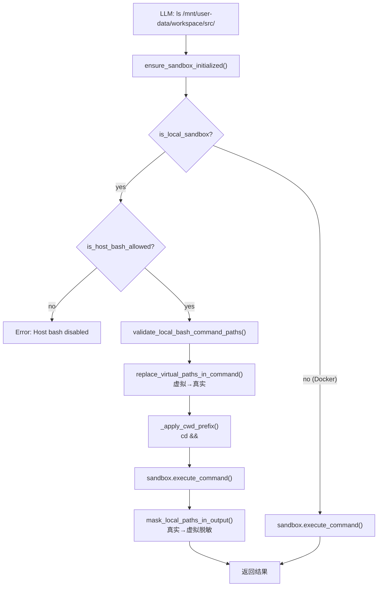
```mermaid
graph TD
    LLM["LLM: ls /mnt/user-data/workspace/src/"] --> ENSURE["ensure_sandbox_initialized()"]
    ENSURE --> LOCAL{"is_local_sandbox?"}
    LOCAL -->|"yes"| BASH_CHECK{"is_host_bash_allowed?"}
    BASH_CHECK -->|"no"| ERR1["Error: Host bash disabled"]
    BASH_CHECK -->|"yes"| VALIDATE["validate_local_bash_command_paths()"]
    VALIDATE --> REPLACE["replace_virtual_paths_in_command()<br/>虚拟→真实"]
    REPLACE --> CWD["_apply_cwd_prefix()<br/>cd <workspace> &&"]
    CWD --> EXEC["sandbox.execute_command()"]
    LOCAL -->|"no (Docker)"| EXEC2["sandbox.execute_command()"]
    EXEC --> MASK["mask_local_paths_in_output()<br/>真实→虚拟脱敏"]
    EXEC2 --> RESULT["返回结果"]
    MASK --> RESULT
```

### 跨模块关注点（更新）

#### 共享状态
- `ThreadState`（`thread_state.py`）：Agent / 中间件 / 工具 共享的状态对象
- `ContextVar`（`tool_search.py`）：每个请求独立的 DeferredToolRegistry
- `runtime.context`（`types.py`）：工具访问运行时上下文（user_id, agent_name, thread_id）
- `ThreadState["sandbox"]`：sandbox_id，工具和中间件共享
- `ThreadState["thread_data"]`：workspace/uploads/outputs 路径，沙箱工具和 ThreadDataMiddleware 共享

#### 配置影响
- `config.yaml` 一个配置项可能影响多个模块：
  - `sandbox.use` → 沙箱模块（哪个 Provider）+ 中间件（lazy_init 策略）+ 安全（bash 开关）
  - `sandbox.allow_host_bash` → task_tool（bash sub-agent）+ bash_tool（直接执行）
  - `tool_search.enabled` → 工具系统（加 tool_search）+ 中间件（加 DeferredToolFilterMiddleware）
  - `summarization.enabled` → 中间件（加 SummarizationMiddleware）+ 记忆系统（flush hook）
  - `memory.enabled` → 中间件（加 MemoryMiddleware）+ summarization hooks
  - `token_usage.enabled` → 中间件（加 TokenUsageMiddleware）+ task_tool（缓存 sub-agent 用量）

#### 错误传播
- task_tool 超时 → SSE 推送 task_timed_out → Lead Agent 拿到超时错误 → 继续对话
- tool_search 无结果 → 返回 "No tools found" → LLM 换个方式问
- setup_agent 失败 → 自动清理目录 → ToolMessage 返回错误 → LLM 重试或告知用户
- bash 路径不安全 → PermissionError → ToolMessage "Error: Unsafe paths" → LLM 换路径重试
- sandbox 未初始化 → ensure_sandbox_initialized 兜底 acquire → 不影响用户体验

## Memory 记忆模块

### 全流程：两条入口 → 三步走 → 一条出口

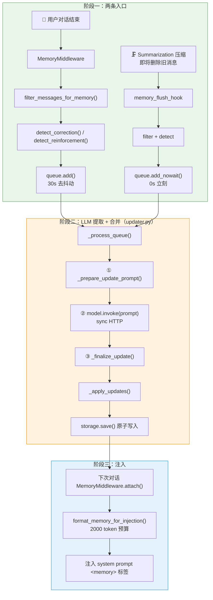
```mermaid
flowchart TD
    subgraph 入口["阶段一：两条入口"]
        direction TB
        A["💬 用户对话结束"] --> B["MemoryMiddleware"]
        B --> C["filter_messages_for_memory()"]
        C --> D["detect_correction() / detect_reinforcement()"]
        D --> E["queue.add()<br/>30s 去抖动"]

        A2["🗜️ Summarization 压缩<br/>即将删除旧消息"] --> B2["memory_flush_hook"]
        B2 --> C2["filter + detect"]
        C2 --> E2["queue.add_nowait()<br/>0s 立刻"]
    end

    subgraph 处理["阶段二：LLM 提取 + 合并（updater.py）"]
        E & E2 --> F["_process_queue()"]
        F --> G["① _prepare_update_prompt()"]
        G --> H["② model.invoke(prompt)<br/>sync HTTP"]
        H --> I["③ _finalize_update()"]
        I --> J["_apply_updates()"]
        J --> K["storage.save() 原子写入"]
    end

    subgraph 使用["阶段三：注入"]
        K --> L["下次对话 MemoryMiddleware.attach()"]
        L --> M["format_memory_for_injection()<br/>2000 token 预算"]
        M --> N["注入 system prompt &lt;memory&gt; 标签"]
    end

    style 入口 fill:#e8f5e9,stroke:#4caf50
    style 处理 fill:#fff3e0,stroke:#ff9800
    style 使用 fill:#e3f2fd,stroke:#2196f3
```

### _apply_updates 合并决策树

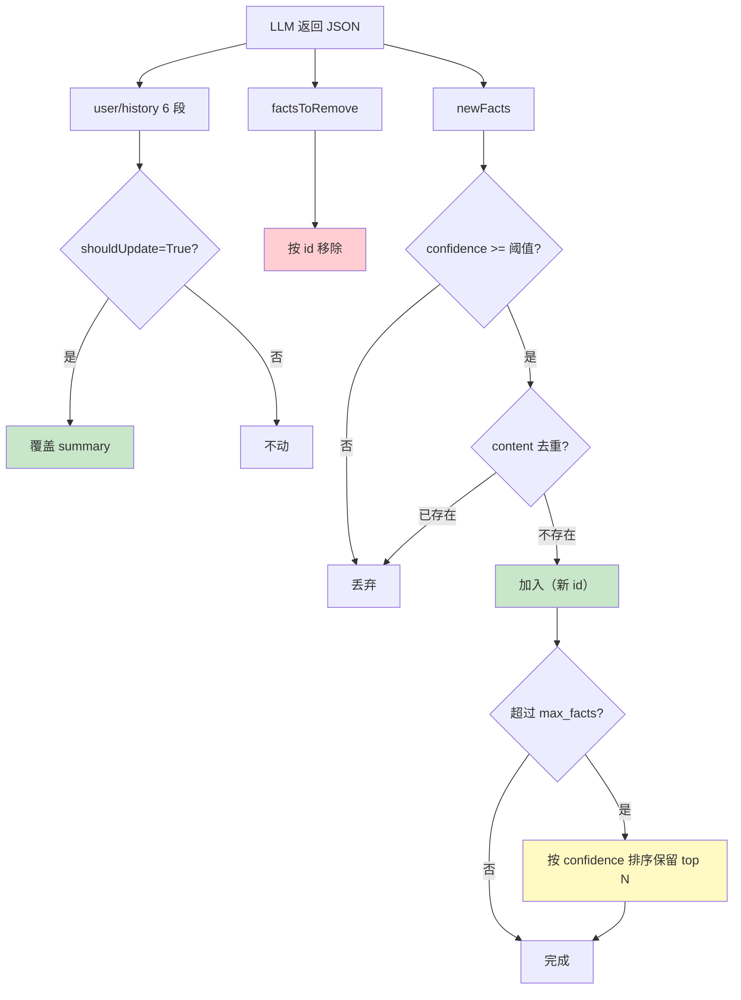
```mermaid
flowchart TD
    LLM["LLM 返回 JSON"] --> U["user/history 6 段"]
    LLM --> FR["factsToRemove"]
    LLM --> FA["newFacts"]

    U --> UR{"shouldUpdate=True?"}
    UR -->|是| UY["覆盖 summary"]
    UR -->|否| UN["不动"]

    FR --> FRD["按 id 移除"]

    FA --> FAC{"confidence >= 阈值?"}
    FAC -->|否| DROP["丢弃"]
    FAC -->|是| DEDUP{"content 去重?"}
    DEDUP -->|已存在| DROP
    DEDUP -->|不存在| ADD["加入（新 id）"]
    ADD --> MAX{"超过 max_facts?"}
    MAX -->|是| TRIM["按 confidence 排序保留 top N"]
    MAX -->|否| OK["完成"]
    TRIM --> OK

    style UY fill:#c8e6c9
    style FRD fill:#ffcdd2
    style ADD fill:#c8e6c9
    style TRIM fill:#fff9c4
```

### add() vs add_nowait() 对比

| | add() | add_nowait() |
|---|---|---|
| 延迟 | 30s 去抖动 | 0s 立刻 |
| 同 thread_id | 新替换旧 | 追加到已有 |
| 谁用 | MemoryMiddleware | summarization_hook |
| 原因 | 不急，等用户说完 | 消息马上被删 |

## Sub-Agent 模块

### 执行流程（execute_async 路径）

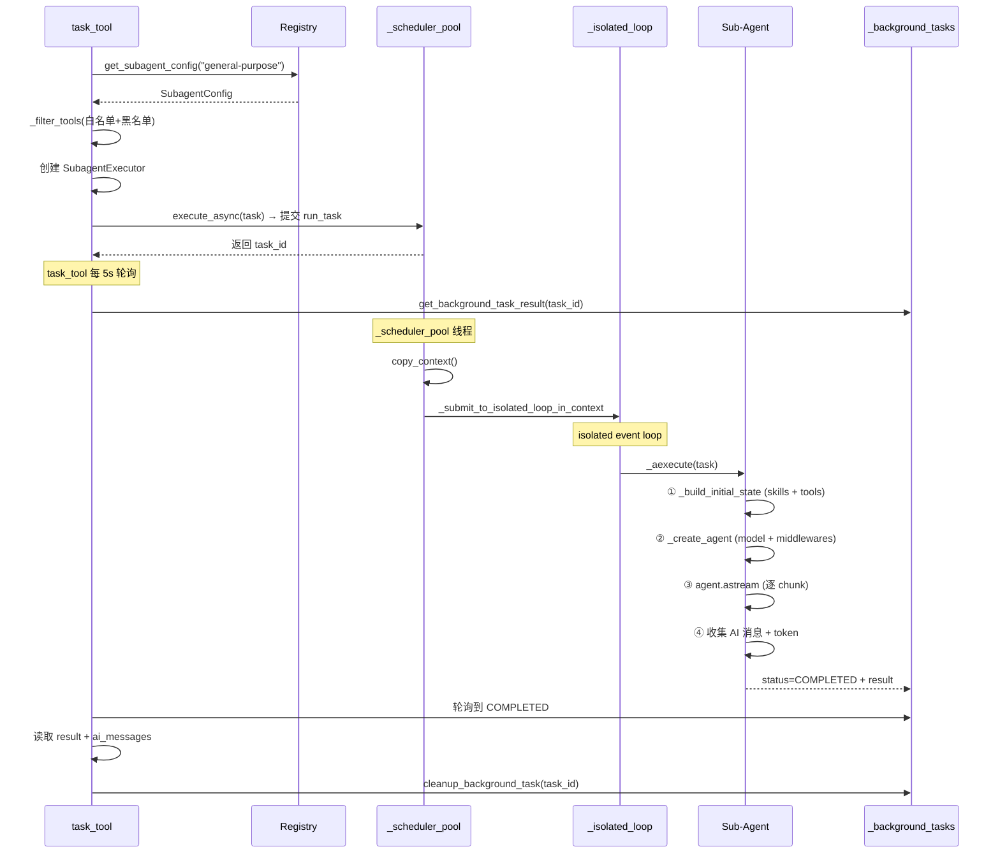
```mermaid
sequenceDiagram
    participant TT as task_tool
    participant Reg as Registry
    participant Pool as _scheduler_pool
    participant ILOOP as _isolated_loop
    participant SA as Sub-Agent
    participant BG as _background_tasks

    TT->>Reg: get_subagent_config("general-purpose")
    Reg-->>TT: SubagentConfig
    TT->>TT: _filter_tools(白名单+黑名单)
    TT->>TT: 创建 SubagentExecutor
    TT->>Pool: execute_async(task) → 提交 run_task
    Pool-->>TT: 返回 task_id

    Note over TT: task_tool 每 5s 轮询
    TT->>BG: get_background_task_result(task_id)

    Note over Pool: _scheduler_pool 线程
    Pool->>Pool: copy_context()
    Pool->>ILOOP: _submit_to_isolated_loop_in_context

    Note over ILOOP: isolated event loop
    ILOOP->>SA: _aexecute(task)
    SA->>SA: ① _build_initial_state (skills + tools)
    SA->>SA: ② _create_agent (model + middlewares)
    SA->>SA: ③ agent.astream (逐 chunk)
    SA->>SA: ④ 收集 AI 消息 + token
    SA-->>BG: status=COMPLETED + result

    TT->>BG: 轮询到 COMPLETED
    TT->>TT: 读取 result + ai_messages
    TT->>BG: cleanup_background_task(task_id)
```

### 三层配置合并

```mermaid
flowchart TD
    NAME["sub-agent 名称"] --> BUILTIN{"内置?"}
    BUILTIN -->|是| BUILTIN_CFG["BUILTIN_SUBAGENTS<br/>general-purpose / bash"]
    BUILTIN -->|否| CUSTOM{"custom_agents 里有?"}
    CUSTOM -->|是| CUSTOM_CFG["config.yaml custom_agents 段"]
    CUSTOM -->|否| NOT_FOUND["return None"]

    BUILTIN_CFG --> OVERRIDE
    CUSTOM_CFG --> OVERRIDE

    subgraph OVERRIDE["应用覆盖"]
        direction TB
        PA{"有 per-agent override?"}
        PA -->|是| APPLY["用 per-agent 值<br/>（最高优先级）"]
        PA -->|否| GD{"是内置 sub-agent?"}
        GD -->|是| GLOBAL["用全局默认值"]
        GD -->|否| KEEP["保持 config 自身值"]

        APPLY --> RESULT
        GLOBAL --> RESULT
        KEEP --> RESULT
    end

    RESULT["最终 SubagentConfig"]

    style APPLY fill:#c8e6c9
    style GLOBAL fill:#fff9c4
    style KEEP fill:#e3f2fd
    ```

## Guardrails 安全护栏模块

### 工具调用拦截流程

```mermaid
sequenceDiagram
    participant LLM as LLM
    participant MW as GuardrailMiddleware
    participant Prov as AllowlistProvider
    participant Tool as 原始工具 handler

    LLM->>MW: 调 bash("rm -rf /")
    MW->>MW: _build_request() → GuardrailRequest
    MW->>Prov: evaluate(request)
    
    alt 白名单有 → 允许
        Prov-->>MW: Decision(allow=True)
        MW->>Tool: handler(request)
        Tool-->>LLM: 执行结果
    else 白名单没有 → 拒绝
        Prov-->>MW: Decision(allow=False, reason="not in allowlist")
        MW-->>LLM: ToolMessage("Guardrail denied: tool 'bash' was blocked")
        Note over LLM: Agent 自适应换方式
    else provider 异常
        Prov--xMW: ConnectionError
        MW->>MW: fail_closed=True → 当作拒绝
        MW-->>LLM: ToolMessage("guardrail provider error (fail-closed)")
    end
```

### 条件加载

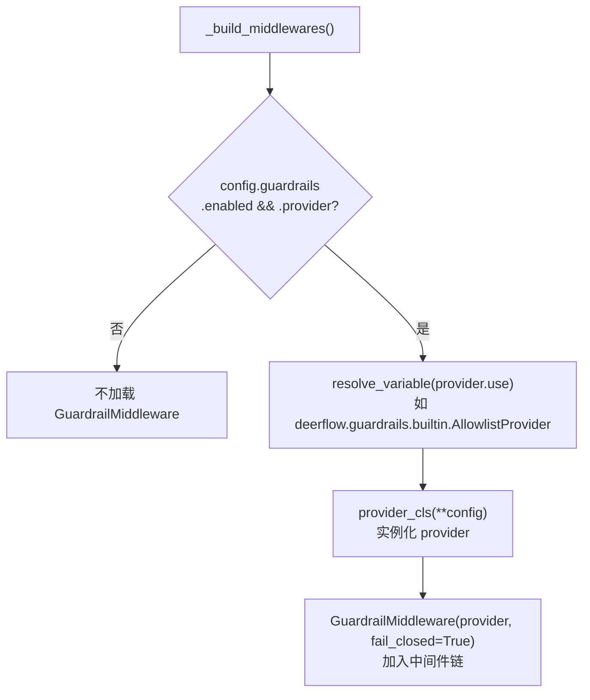
```mermaid
flowchart TD
    START["_build_middlewares()"] --> CHECK{"config.guardrails<br/>.enabled && .provider?"}
    CHECK -->|否| SKIP["不加载 GuardrailMiddleware"]
    CHECK -->|是| RESOLVE["resolve_variable(provider.use)<br/>如 deerflow.guardrails.builtin.AllowlistProvider"]
    RESOLVE --> INST["provider_cls(**config)<br/>实例化 provider"]
    INST --> ADD["GuardrailMiddleware(provider, fail_closed=True)<br/>加入中间件链"]
```

## ContextVar 完整链路

### _current_user 的写入、读取、跨线程传播

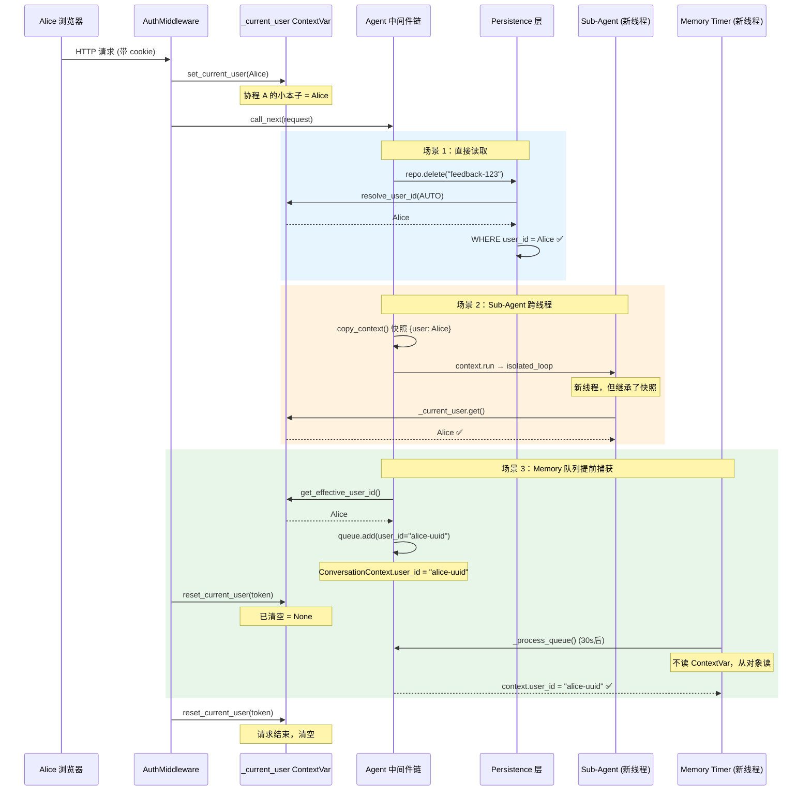
```mermaid
sequenceDiagram
    participant Browser as Alice 浏览器
    participant Auth as AuthMiddleware
    participant CV as _current_user ContextVar
    participant Agent as Agent 中间件链
    participant Persist as Persistence 层
    participant SubAgent as Sub-Agent (新线程)
    participant Timer as Memory Timer (新线程)

    Browser->>Auth: HTTP 请求 (带 cookie)
    Auth->>CV: set_current_user(Alice)
    Note over CV: 协程 A 的小本子 = Alice
    Auth->>Agent: call_next(request)

    rect rgb(230, 245, 255)
        Note over Agent,Persist: 场景 1：直接读取
        Agent->>Persist: repo.delete("feedback-123")
        Persist->>CV: resolve_user_id(AUTO)
        CV-->>Persist: Alice
        Persist->>Persist: WHERE user_id = Alice ✅
    end

    rect rgb(255, 243, 224)
        Note over Agent,SubAgent: 场景 2：Sub-Agent 跨线程
        Agent->>Agent: copy_context() 快照 {user: Alice}
        Agent->>SubAgent: context.run → isolated_loop
        Note over SubAgent: 新线程，但继承了快照
        SubAgent->>CV: _current_user.get()
        CV-->>SubAgent: Alice ✅
    end

    rect rgb(232, 245, 233)
        Note over Agent,Timer: 场景 3：Memory 队列提前捕获
        Agent->>CV: get_effective_user_id()
        CV-->>Agent: Alice
        Agent->>Agent: queue.add(user_id="alice-uuid")
        Note over Agent: ConversationContext.user_id = "alice-uuid"
        Auth->>CV: reset_current_user(token)
        Note over CV: 已清空 = None
        Timer->>Agent: _process_queue() (30s后)
        Note over Timer: 不读 ContextVar，从对象读
        Agent-->>Timer: context.user_id = "alice-uuid" ✅
    end

    Auth->>CV: reset_current_user(token)
    Note over CV: 请求结束，清空
```

## 模型工厂模块

### 模型创建流程

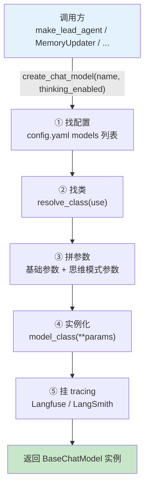
```mermaid
flowchart TD
    CALLER["调用方<br/>make_lead_agent / MemoryUpdater / ..."] -->|"create_chat_model(name, thinking_enabled)"| STEP1["① 找配置<br/>config.yaml models 列表"]
    STEP1 --> STEP2["② 找类<br/>resolve_class(use)"]
    STEP2 --> STEP3["③ 拼参数<br/>基础参数 + 思维模式参数"]
    STEP3 --> STEP4["④ 实例化<br/>model_class(**params)"]
    STEP4 --> STEP5["⑤ 挂 tracing<br/>Langfuse / LangSmith"]
    STEP5 --> RESULT["返回 BaseChatModel 实例"]

    style CALLER fill:#e3f2fd
    style RESULT fill:#c8e6c9
```

### 厂商适配总结

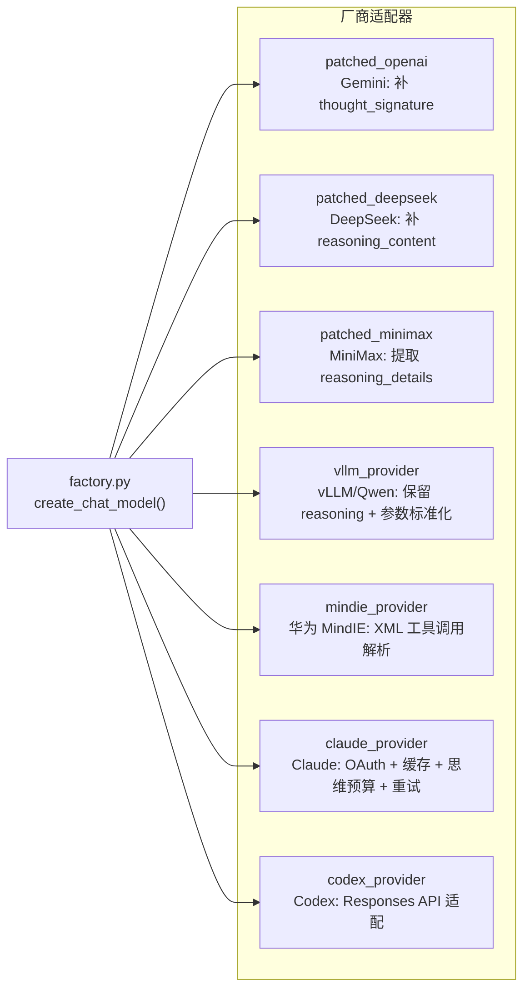
```mermaid
graph LR
    subgraph 厂商适配器
        G["patched_openai<br/>Gemini: 补 thought_signature"]
        D["patched_deepseek<br/>DeepSeek: 补 reasoning_content"]
        M["patched_minimax<br/>MiniMax: 提取 reasoning_details"]
        V["vllm_provider<br/>vLLM/Qwen: 保留 reasoning + 参数标准化"]
        MI["mindie_provider<br/>华为 MindIE: XML 工具调用解析"]
        C["claude_provider<br/>Claude: OAuth + 缓存 + 思维预算 + 重试"]
        CX["codex_provider<br/>Codex: Responses API 适配"]
    end

    FACTORY["factory.py<br/>create_chat_model()"] --> G
    FACTORY --> D
    FACTORY --> M
    FACTORY --> V
    FACTORY --> MI
    FACTORY --> C
    FACTORY --> CX
```

## Skills 技能系统

### 技能安装流程

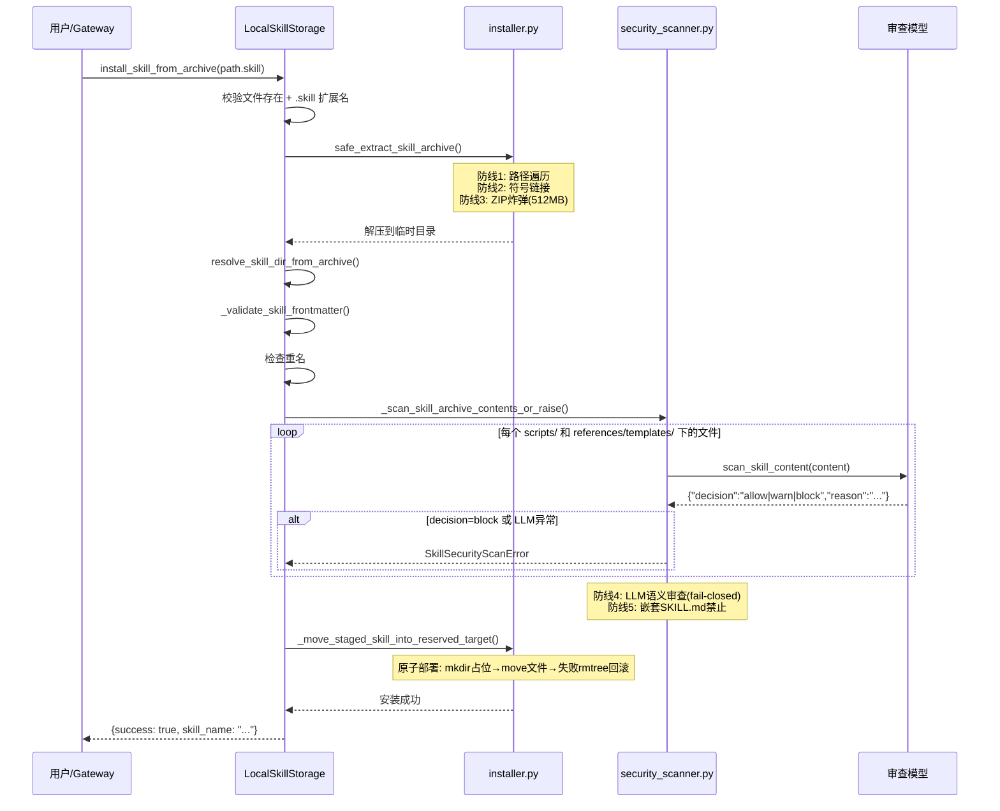
```mermaid
sequenceDiagram
    participant User as 用户/Gateway
    participant Storage as LocalSkillStorage
    participant Installer as installer.py
    participant Scanner as security_scanner.py
    participant LLM as 审查模型

    User->>Storage: install_skill_from_archive(path.skill)
    Storage->>Storage: 校验文件存在 + .skill 扩展名
    Storage->>Installer: safe_extract_skill_archive()
    Note over Installer: 防线1: 路径遍历<br/>防线2: 符号链接<br/>防线3: ZIP炸弹(512MB)
    Installer-->>Storage: 解压到临时目录
    Storage->>Storage: resolve_skill_dir_from_archive()
    Storage->>Storage: _validate_skill_frontmatter()
    Storage->>Storage: 检查重名
    Storage->>Scanner: _scan_skill_archive_contents_or_raise()
    loop 每个 scripts/ 和 references/templates/ 下的文件
        Scanner->>LLM: scan_skill_content(content)
        LLM-->>Scanner: {"decision":"allow|warn|block","reason":"..."}
        alt decision=block 或 LLM异常
            Scanner-->>Storage: SkillSecurityScanError
        end
    end
    Note over Scanner: 防线4: LLM语义审查(fail-closed)<br/>防线5: 嵌套SKILL.md禁止
    Storage->>Installer: _move_staged_skill_into_reserved_target()
    Note over Installer: 原子部署: mkdir占位→move文件→失败rmtree回滚
    Installer-->>Storage: 安装成功
    Storage-->>User: {success: true, skill_name: "..."}
```

### 技能加载流程

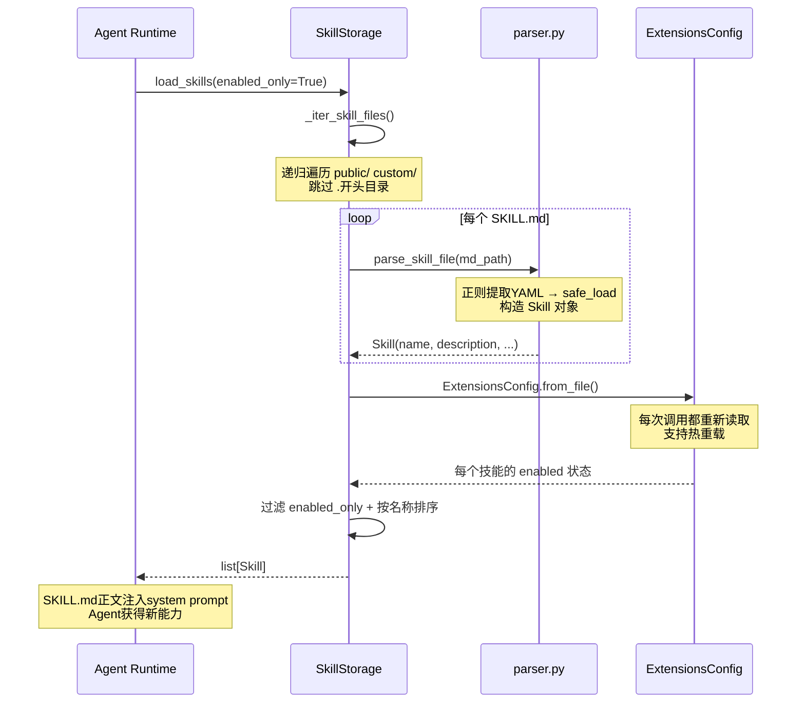
```mermaid
sequenceDiagram
    participant Agent as Agent Runtime
    participant Storage as SkillStorage
    participant Parser as parser.py
    participant ExtConfig as ExtensionsConfig

    Agent->>Storage: load_skills(enabled_only=True)
    Storage->>Storage: _iter_skill_files()
    Note over Storage: 递归遍历 public/ custom/<br/>跳过 .开头目录
    loop 每个 SKILL.md
        Storage->>Parser: parse_skill_file(md_path)
        Note over Parser: 正则提取YAML → safe_load<br/>构造 Skill 对象
        Parser-->>Storage: Skill(name, description, ...)
    end
    Storage->>ExtConfig: ExtensionsConfig.from_file()
    Note over ExtConfig: 每次调用都重新读取<br/>支持热重载
    ExtConfig-->>Storage: 每个技能的 enabled 状态
    Storage->>Storage: 过滤 enabled_only + 按名称排序
    Storage-->>Agent: list[Skill]
    Note over Agent: SKILL.md正文注入system prompt<br/>Agent获得新能力
```
