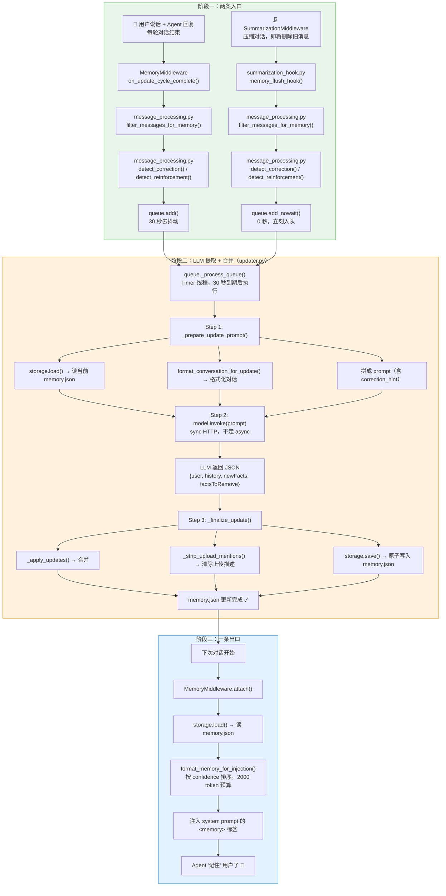
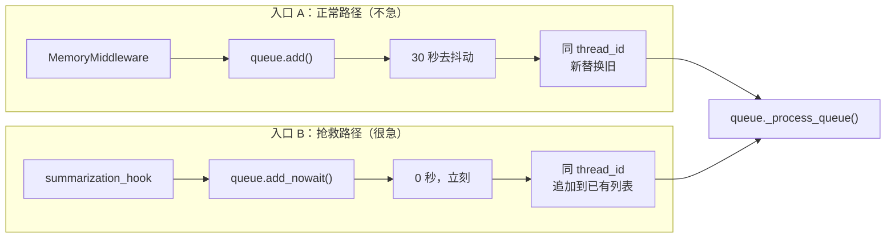
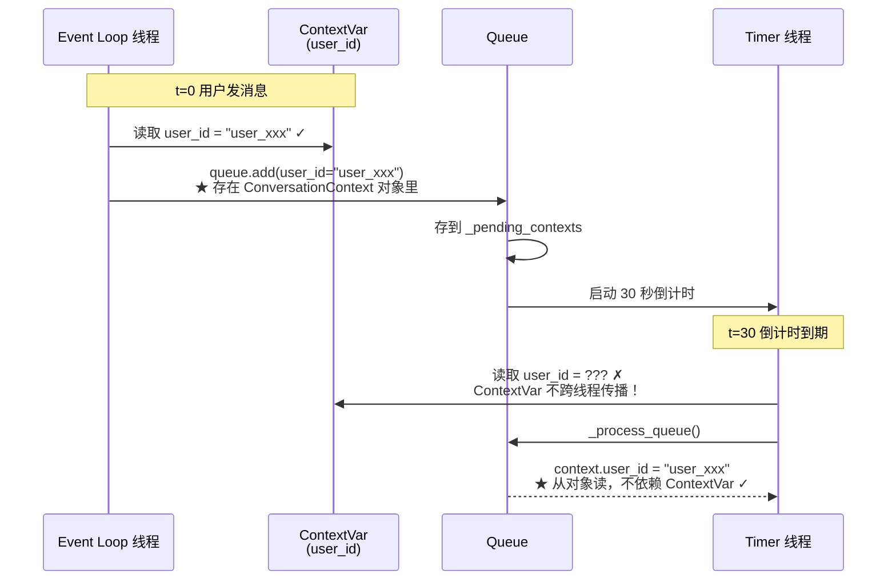
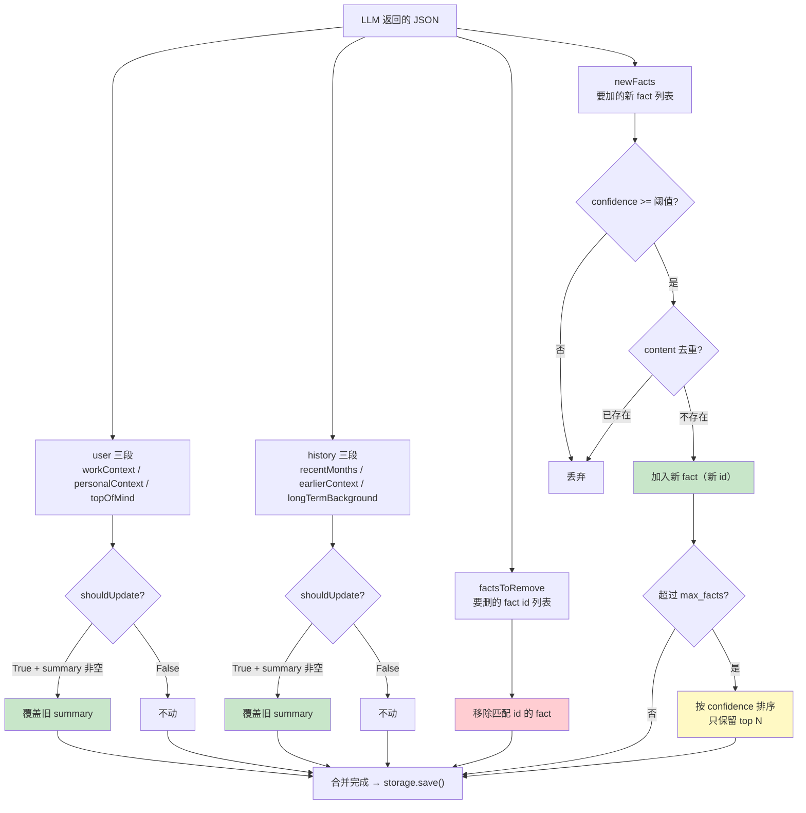
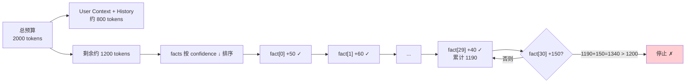
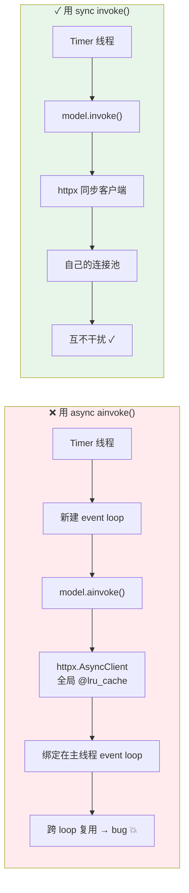
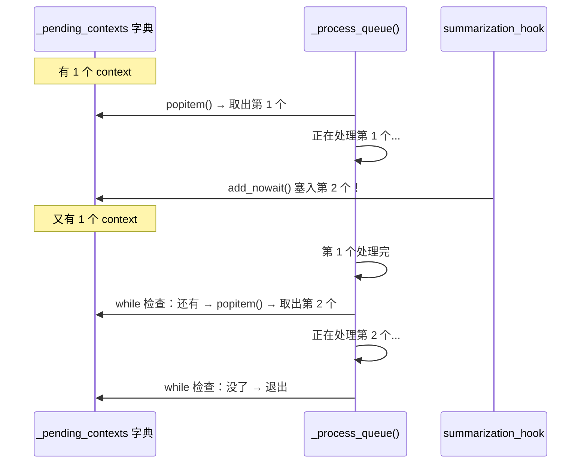

# Memory 模块全景图

> 这篇文档只解决一个问题：**数据在 7 个文件之间怎么流转的？每个函数为什么这么设计？**

---

## 1. 总流程图

---

## 2. 两条入口的区别

| | add() 正常路径 | add_nowait() 抢救路径 |
|---|---|---|
| **延迟** | 30 秒去抖动 | 0 秒，立刻入队 |
| **去重策略** | 同 thread_id **新替换旧** | 同 thread_id **追加到已有** |
| **谁用** | MemoryMiddleware | summarization_hook |
| **为什么** | 不急，等用户说完整 | 消息马上被删，等不了 |

---

## 3. user_id 为什么入队时捕获？

**一句话：** ContextVar 是线程局部变量，Timer 线程读不到 event loop 线程的值。所以入队时取出来存在对象里，带过去。

---

## 4. _apply_updates 合并逻辑

**为什么 user/history 用覆盖，facts 用增删？**

- user/history 是"状态总结"：用户技术栈变了 → 旧总结没意义 → 直接覆盖
- facts 是"独立知识点"：删一条"技术栈 LangGraph"，加一条"技术栈 CrewAI"，不影响"偏好中文"

---

## 5. token 预算分配

---

## 6. 为什么用 sync model.invoke() 不用 async？

---

## 7. 7 个文件一句话总结

| 文件 | 一句话 | 比喻 |
|---|---|---|
| `__init__.py` | 模块入口，导出公共 API | 目录 + 全流程串讲 |
| `message_processing.py` | 过滤消息 + 检测纠正/肯定信号 | 净化器 + 信号灯 |
| `queue.py` | 去抖动队列，攒消息到合适时机处理 | 30 秒缓冲区 |
| `prompt.py` | prompt 模板 + 格式化函数（memory↔文本） | 翻译官 |
| `updater.py` | 调 LLM 提取 + 合并更新 | 大脑（核心三步走） |
| `storage.py` | 读写 memory.json + 缓存 + 原子写入 | 仓库 |
| `summarization_hook.py` | 压缩前抢救即将被删的消息 | 救援队 |

---

## 8. _process_queue 为什么用 while 不用 if？

如果用 `if`，第 2 个 context 就丢了。`while` 保证处理期间新塞进来的也会被处理。
