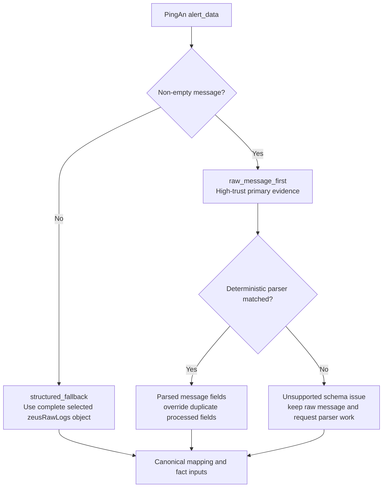

# PingAn Adapter Coverage Review

Status: Checkpoint B implemented; awaiting parser-output and field-coverage review

Corpus: `soc.validation.alert_corpus.v1`, 212 unique alerts

## 1. Rebuild decision

This is an incremental rebuild of the PingAn source adapter, not a rewrite of the
vendor-neutral SOC Runtime.

The following invariants remain unchanged:

1. A non-empty `zeusRawLogs[].message` is the high-trust primary input.
2. When `message` is absent or empty, the selected `zeusRawLogs[]` object is the
   structured fallback.
3. Successfully parsed message fields override duplicate Zeus processed fields.
4. The complete original alert remains under `AlertInput.raw` for audit and replay.
5. Source classification, message parsing and field mapping remain inside the PingAn
   adapter. Generic Runtime code must not learn PingAn aliases.



## 2. Current 212-alert baseline

Message-schema counts are observation counts, not alert counts. One alert can contain
multiple `zeusRawLogs[].message` values.

| Topic | Alerts | Current source type | Input policy | Parser baseline | Finding |
|---|---:|---|---|---|---|
| `T_GBD_zeus_data` | 10 | `other` | 10 structured fallback | No message to parse | Fallback is correct; source type needs confirmation |
| `edr-core-xc` | 5 | `edr` | 5 raw-message first | 14 unsupported | Messages are syslog-prefixed JSON |
| `leagsoft-edr` | 32 | `edr` | 31 raw-message first, 1 fallback | 46 recognized | Existing comma/quoted-KV parsers work |
| `ptp-nids` | 95 | `other` | 95 raw-message first | 78 recognized, 50 unsupported | Messages are full JSON; current quoted-KV matches are partial and misleading |
| `sec_guard_apt` | 38 | `ndr` | 37 raw-message first, 1 fallback | 54 recognized, 19 degraded | Existing delimited-JSON parser works; degraded items are nested repair cases |
| `sec_guard_apt_detail` | 6 | `ndr` | 6 raw-message first | 31 recognized, 1 degraded | Existing delimited-JSON parser works |
| `sec_guard_wb` | 3 | `other` | 3 raw-message first | 4 unsupported | Messages are ThreatBook-prefixed JSON |
| `security_qthids` | 23 | `hids` | 23 raw-message first | 46 recognized | Existing quoted-KV parser works |

Current totals:

- Source types: `edr=37`, `hids=23`, `ndr=44`, `other=108`.
- Evidence policy: `raw_message_first=200`, `structured_fallback=12`.
- Message observations: `recognized=255`, `degraded=20`, `unsupported=68`.
- Alerts with unsupported observations: 40.
- Alerts with degraded observations: 12.
- Alerts without message observations: 12.

## 3. Proposed source classification

| Topic/hint | Proposed type | Confidence | Reason | Confirmation |
|---|---|---|---|---|
| `ptp-nids`, topic name `NIDS` | `nids` | High | Network Intrusion Detection System is already a canonical source type | Confirmed |
| `sec_guard_wb`, topic name `微步威胁情报` | `threat_intel` | High | This is ThreatBook threat-intelligence output, not WAF | Confirmed |
| `T_GBD_zeus_data`, topic name `AI分析模型-数据模型组` | `siem` | Medium | Alerts are model/correlation outputs with rule codes and structured events, not one raw sensor family | Confirmed |

If all three are confirmed, the expected source distribution becomes:

```text
edr=37
hids=23
ndr=44
nids=95
threat_intel=3
siem=10
other=0
```

Source type expresses where an alert was produced. It does not determine attacker/victim
roles, scenario, verdict or response target.

## 4. Proposed message parser change

Add one deterministic JSON-object parser ahead of quoted/comma KV parsers:

```text
1. Existing PingAn delimited JSON: prefix|!{...}
2. New JSON object parser:
   - direct JSON: {...}
   - bounded syslog/product prefix followed by one JSON object
3. Existing quoted KV
4. Existing comma KV
5. Existing loose KV
```

The parser must:

- accept only a complete JSON object, allowing whitespace after it;
- preserve a prefix as header metadata without letting it override JSON fields;
- reject arrays, fragments and text with an incomplete/trailing payload;
- run nested JSON/header decoding through the existing bounded decoder;
- keep the raw message hash and length for audit;
- prevent direct JSON from being incorrectly accepted by quoted-KV with only a few fields.

Representative local review IDs:

| Cohort | IDs | Expected parser |
|---|---|---|
| Direct NIDS JSON | `1976128`, `1985048`, `1979525` | New JSON object parser, offset 0 |
| Prefixed EDR JSON | `1968376`, `1967231` | New JSON object parser after syslog prefix |
| Prefixed ThreatBook JSON | `1965919`, `1982799`, `1973156` | New JSON object parser after product prefix |
| No-message structured fallback | `1965802`, `1965808`, `1965891` | No parser; preserve fallback |

## 5. Review checkpoints

### Checkpoint A: source semantics

The user confirms or corrects the three proposed source types before code changes.

### Checkpoint B: parser output

After implementing the JSON parser, regenerate representative Step 2 artifacts and review:

- complete parsed field tree;
- selected primary/fallback path;
- canonical field provenance;
- high-value fields not mapped into canonical/fact/scenario projections;
- parser warnings, repairs and schema fingerprints.

### Checkpoint C: field mapping

Do not assume parser success means complete SOC coverage. For each cohort, compare every
parsed leaf against:

- canonical `AlertInput`;
- role claims and fact reconstruction;
- scenario signals;
- bounded LLM evidence;
- preserved-only/audit fields.

Any important unmapped field becomes an explicit mapping issue. It must not be silently
discarded.

### Checkpoint D: full replay

Rerun all 212 alerts and require:

- zero normalization errors;
- zero unexpected `other` source types after approved classification;
- zero unsupported schemas for the three JSON cohorts;
- all 12 no-message alerts still use `structured_fallback`;
- each fallback with a non-empty first `zeusRawLogs` object produces bounded
  `raw_structured` evidence; empty arrays remain explicit upstream gaps;
- no regression in existing APT/EDR/HIDS parsers;
- source rows, raw payloads and lineage remain unchanged.

Only after Checkpoint D passes should this corpus enter the real-consumption test.

## 6. Checkpoint B result

The confirmed source mapping and JSON-object parser are implemented. Full-corpus replay
now reports:

```text
normalized alerts: 212 / 212
source type other:  0
raw_message_first:  200
structured_fallback: 12
unsupported schema observations: 0
recognized schema observations:  323
degraded schema observations:    20
```

Parser distribution:

```text
pingan_json_object:    146
pingan_delimited_json: 105
pingan_quoted_kv:       52
pingan_comma_kv:        40
```

The 20 degraded observations remain the previously visible nested JSON repair cases. The
new parser did not convert them into false success.

Sensitive local review artifacts:

| Cohort | Artifact |
|---|---|
| Direct NIDS JSON | `data/pingan-adapter-checkpoint-b/direct-nids-json-1976128.json` |
| Prefixed EDR JSON | `data/pingan-adapter-checkpoint-b/prefixed-edr-json-1968376.json` |
| Prefixed ThreatBook JSON | `data/pingan-adapter-checkpoint-b/prefixed-threat-intel-json-1965919.json` |
| No-message SIEM fallback | `data/pingan-adapter-checkpoint-b/no-message-siem-fallback-1965802.json` |

Initial Checkpoint C signals (pre-mapping baseline):

| Cohort | Parsed schema entries | Role claims | Scenario hypotheses | Interpretation |
|---|---:|---:|---:|---|
| Direct NIDS JSON | 121 | 4 | 0 | Network roles exist, but scenario mapping needs review |
| Prefixed EDR JSON | 128 across 2 messages | 0 | 0 | Parser works; important nested EDR semantics are not yet mapped |
| Prefixed ThreatBook JSON | 100 | 6 | 0 | Network/security roles exist; scenario and TI semantics need review |
| No-message SIEM fallback | 15 structured fields | 0 | 0 | First raw event is preserved and projected in full mode; subtype-specific fact/scenario extraction still needs review |

`high_value_gaps=0` in these artifacts only means the current field-importance registry did
not recognize an outstanding known rule. It does not prove complete field use. The zero or
low role/scenario counts are the stronger signal and must be reviewed before real consumption.

## 7. Structured fallback correction

Checkpoint C exposed that the policy selected `RAW_STRUCTURED` but the analysis-context
builder only created primary evidence for `RAW_MESSAGE`. The selected object was preserved
in `AlertInput.raw`, but `BoundedAnalysisEvidence.primary` was null.

The corrected contract is:

- only the first `zeusRawLogs` object is selected when no non-empty `message` exists;
- selected structured fields are projected by field priority within the 6000-character
  primary budget instead of truncating one serialized JSON string;
- `SOC_LLM_SENSITIVE_EVIDENCE_MODE=full` preserves selected field values unchanged for
  the explicitly approved current model environment;
- the generic default remains `redact`;
- `T_GBD_zeus_data` is a trusted internal SIEM/model source and uses high evidence-source
  trust; model-derived conclusions still do not become human-confirmed truth;
- all later raw events remain only in the complete preserved payload;
- an empty `zeusRawLogs=[]` array produces no fabricated primary evidence and is counted
  as an upstream evidence gap.

Full replay result:

```text
structured_fallback policies:      12
available first raw events:        10
empty zeusRawLogs arrays:            2
projected structured leaf fields: 164
truncated structured projections:   3
policy contract violations:         0
```

For alert `1965802`, the primary SIEM object has 15 fields and 640 serialized
characters. All 15 fields are projected unchanged, with zero sanitized and zero
budget-omitted fields.

## 8. Checkpoint C completed result

The initial table above is retained as the pre-mapping baseline. Current production
adapter results are:

- NIDS: 95 alerts / 128 messages, 95 canonical five-tuples, 128 network observations,
  67 HTTP observations and zero known high-value gaps.
- EDR: 37 alerts / 60 messages, 30 process observations, 39 process nodes and 7 file
  observations. Endpoint identity and tentative attacker candidates remain separate from
  wire direction; no directional session is invented.
- Threat Intel: 3 alerts / 4 messages, 4 independent wire-session observations. Provider
  attacker/victim assertions remain separate role claims; all three alerts project the
  monitored host, external IOC, malware family and `T1496`. Asset CIDR/ranges never become
  host IPs.
- SIEM: 10 alerts / 15 structured events. Six selected suspicious-email alerts create six
  typed email observations; four selected machine-copy alerts create host/IP candidates.
  Later structured events remain raw-only, no network direction is invented, and pipeline
  `User=system` is not treated as an actor.

The combined Threat Intel/SIEM audit records 159 canonical provenance entries, zero known
high-value gaps, and zero raw-payload mutations. High-value checks now inspect the selected
`raw_structured` source view as well as parsed messages, so an unknown SIEM subtype with a
known high-value field creates a normalization-maintenance gap instead of silently passing.

Reproduce the final TI/SIEM evidence with:

```bash
backend/.venv/bin/python \
  validation/compact_zeus/build_pingan_ti_siem_field_audit.py

backend/.venv/bin/python \
  validation/compact_zeus/build_pingan_ti_siem_review_artifacts.py
```

The generated `data/pingan-ti-siem-*` files contain sensitive `full`-mode evidence, remain
gitignored, and must not be committed.
